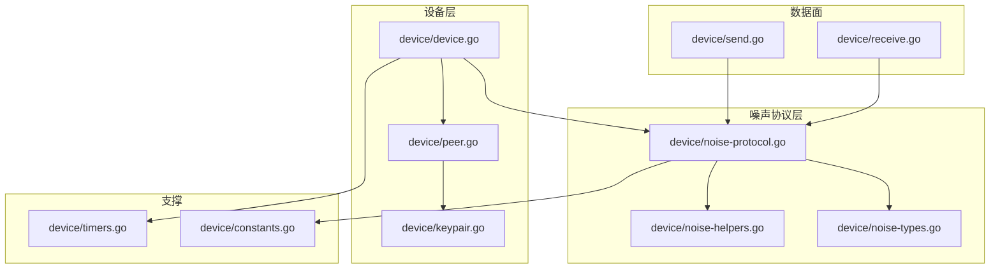
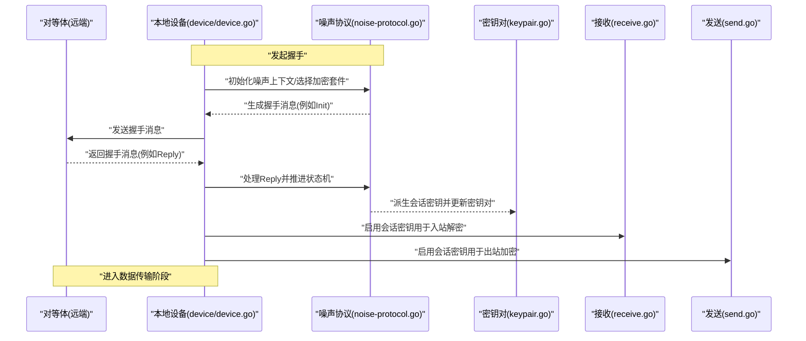
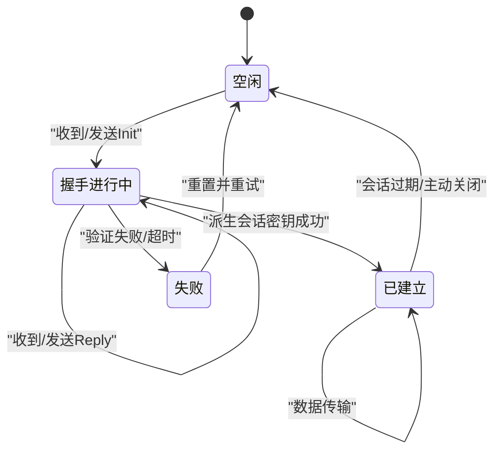
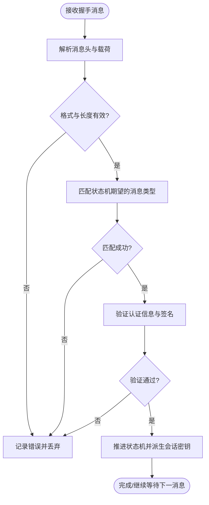
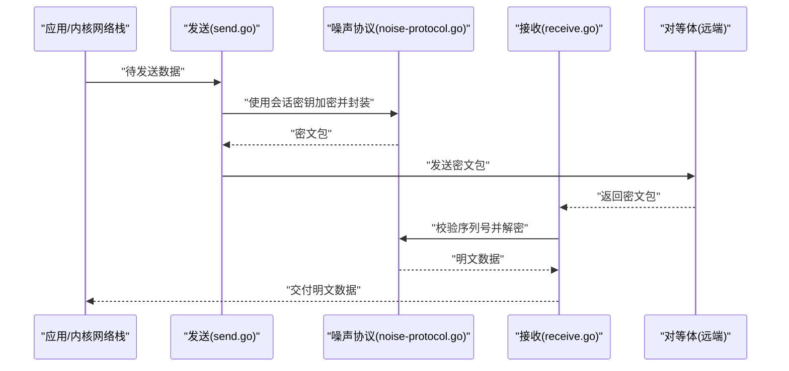
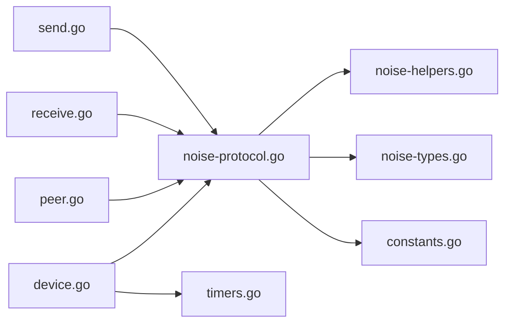

# Noise协议实现

<cite>
**本文引用的文件**
- [device/noise-protocol.go](file://device/noise-protocol.go)
- [device/noise-helpers.go](file://device/noise-helpers.go)
- [device/noise-types.go](file://device/noise-types.go)
- [device/device.go](file://device/device.go)
- [device/peer.go](file://device/peer.go)
- [device/keypair.go](file://device/keypair.go)
- [device/receive.go](file://device/receive.go)
- [device/send.go](file://device/send.go)
- [device/timers.go](file://device/timers.go)
- [device/constants.go](file://device/constants.go)
</cite>

## 目录
1. [简介](#简介)
2. [项目结构](#项目结构)
3. [核心组件](#核心组件)
4. [架构总览](#架构总览)
5. [详细组件分析](#详细组件分析)
6. [依赖关系分析](#依赖关系分析)
7. [性能考量](#性能考量)
8. [故障排除指南](#故障排除指南)
9. [结论](#结论)
10. [附录](#附录)

## 简介
本技术文档聚焦于WireGuard中Noise协议框架的集成与具体实现，系统性阐述握手过程、密钥交换算法、会话建立流程、状态机转换、加密套件选择与配置（ChaCha20-Poly1305与AES-GCM）、握手消息格式与处理逻辑（Hello、Reply、Init等），并提供调试方法与故障排除指南，以及协议扩展与安全增强的实践建议。

## 项目结构
WireGuard将噪声协议相关代码集中在device目录下，围绕设备、对等体、密钥对、收发队列、计时器与常量进行组织：
- device/noise-protocol.go：噪声协议握手流程、消息构造与解析、状态机驱动
- device/noise-helpers.go：噪声工具函数（如哈希、随机数、序列化）
- device/noise-types.go：噪声类型定义（公钥、私钥、会话密钥、消息头等）
- device/device.go：设备主控制器，协调噪声握手与会话生命周期
- device/peer.go：对等体管理，持有对端公钥、会话状态、重传与计时
- device/keypair.go：当前/上一会话密钥对管理与轮换
- device/receive.go / send.go：数据面收发的封装与解封装，调用噪声AEAD加解密
- device/timers.go：握手超时、重传、会话保活等定时器
- device/constants.go：协议常量（包长度、时间常数、错误码等）

图表来源
- [device/device.go:1-200](file://device/device.go#L1-L200)
- [device/noise-protocol.go:1-200](file://device/noise-protocol.go#L1-L200)
- [device/receive.go:1-200](file://device/receive.go#L1-L200)
- [device/send.go:1-200](file://device/send.go#L1-L200)

章节来源
- [device/noise-protocol.go:1-200](file://device/noise-protocol.go#L1-L200)
- [device/noise-helpers.go:1-200](file://device/noise-helpers.go#L1-L200)
- [device/noise-types.go:1-200](file://device/noise-types.go#L1-L200)
- [device/device.go:1-200](file://device/device.go#L1-L200)
- [device/peer.go:1-200](file://device/peer.go#L1-L200)
- [device/keypair.go:1-200](file://device/keypair.go#L1-L200)
- [device/receive.go:1-200](file://device/receive.go#L1-L200)
- [device/send.go:1-200](file://device/send.go#L1-L200)
- [device/timers.go:1-200](file://device/timers.go#L1-L200)
- [device/constants.go:1-200](file://device/constants.go#L1-L200)

## 核心组件
- 噪声协议引擎：负责握手状态机推进、消息序列生成与解析、临时密钥与预共享密钥派生、会话密钥计算。
- 对等体管理：维护对端身份、会话状态、重传与计时、索引表映射。
- 密钥对管理：维护current/previous密钥对，支持安全轮换与旧密钥清理。
- 数据面收发：使用会话AEAD对数据包进行加解密与完整性校验，处理序列号与重放保护。
- 计时器：控制握手超时、重传、会话保活与密钥轮换。
- 常量与工具：提供协议常量、随机数、哈希、序列化等基础能力。

章节来源
- [device/noise-protocol.go:1-200](file://device/noise-protocol.go#L1-L200)
- [device/peer.go:1-200](file://device/peer.go#L1-L200)
- [device/keypair.go:1-200](file://device/keypair.go#L1-L200)
- [device/receive.go:1-200](file://device/receive.go#L1-L200)
- [device/send.go:1-200](file://device/send.go#L1-L200)
- [device/timers.go:1-200](file://device/timers.go#L1-L200)
- [device/constants.go:1-200](file://device/constants.go#L1-L200)

## 架构总览
WireGuard在设备层驱动噪声协议握手，完成身份认证与密钥协商后，进入数据面加密封装阶段。握手期间通过定时器保障可靠性与超时恢复；数据面通过序列号与重放窗口保证抗重放与有序性。

图表来源
- [device/device.go:1-200](file://device/device.go#L1-L200)
- [device/noise-protocol.go:1-200](file://device/noise-protocol.go#L1-L200)
- [device/keypair.go:1-200](file://device/keypair.go#L1-L200)
- [device/receive.go:1-200](file://device/receive.go#L1-L200)
- [device/send.go:1-200](file://device/send.go#L1-L200)

## 详细组件分析

### 噪声协议状态机与握手流程
- 初始状态：加载对端公钥、本地私钥、可选预共享密钥，选择加密套件（ChaCha20-Poly1305或AES-GCM），初始化噪声上下文。
- 握手消息序列：
  - Init：由发起方生成，包含临时公钥与必要的认证信息。
  - Reply：由响应方生成，验证Init并返回其临时公钥与认证信息。
  - Hello/其他扩展：根据实现与扩展点插入，携带额外参数或能力协商。
- 状态推进：每收到一条握手消息即尝试推进状态机；成功则派生会话密钥并切换至“已建立”状态。
- 失败与重试：握手失败时记录错误、重置状态、必要时触发重传或告警。

图表来源
- [device/noise-protocol.go:1-200](file://device/noise-protocol.go#L1-L200)
- [device/timers.go:1-200](file://device/timers.go#L1-L200)

章节来源
- [device/noise-protocol.go:1-200](file://device/noise-protocol.go#L1-L200)
- [device/timers.go:1-200](file://device/timers.go#L1-L200)

### 密钥交换与加密套件
- 密钥交换：基于椭圆曲线Diffie-Hellman（ECDH）的噪声模式，结合静态公钥与临时公钥进行双向认证与密钥派生。
- 加密套件：
  - ChaCha20-Poly1305：默认或首选套件，适用于无硬件加速环境，跨平台一致性好。
  - AES-GCM：当目标平台具备AES-NI等硬件加速时优先使用，以获得更高吞吐。
- 套件选择策略：依据平台能力检测与运行时配置决定；若不支持某套件则回退到另一方案。
- 密钥派生：使用HKDF从握手材料派生出会话密钥与后续密钥材料，确保前向安全性。

章节来源
- [device/noise-protocol.go:1-200](file://device/noise-protocol.go#L1-L200)
- [device/constants.go:1-200](file://device/constants.go#L1-L200)

### 握手消息格式与处理逻辑
- 消息头：包含消息类型、序列号、长度等字段，便于接收端路由与校验。
- 消息类型：
  - Init：发起握手，携带临时公钥与认证载荷。
  - Reply：响应握手，携带临时公钥与认证载荷。
  - Hello：可选扩展消息，携带能力协商或附加参数。
- 处理逻辑：
  - 解析消息头与载荷，校验长度与MAC。
  - 根据当前状态机状态匹配期望的消息类型。
  - 验证签名/认证信息，成功后推进状态并派生会话密钥。
  - 失败时记录错误并可能触发重传或关闭会话。

图表来源
- [device/noise-protocol.go:1-200](file://device/noise-protocol.go#L1-L200)
- [device/constants.go:1-200](file://device/constants.go#L1-L200)

章节来源
- [device/noise-protocol.go:1-200](file://device/noise-protocol.go#L1-L200)
- [device/constants.go:1-200](file://device/constants.go#L1-L200)

### 会话建立与数据面封装
- 会话建立：握手成功后，生成会话密钥并安装到收发路径；同时设置序列号起始值与重放窗口。
- 出站加密：使用AEAD对上层数据进行加密与完整性保护，附加序列号与头部。
- 入站解密：校验序列号与重放窗口，使用对应会话密钥解密并验证完整性。
- 密钥轮换：定期或按需轮换会话密钥，保持前向安全性。

图表来源
- [device/send.go:1-200](file://device/send.go#L1-L200)
- [device/receive.go:1-200](file://device/receive.go#L1-L200)
- [device/noise-protocol.go:1-200](file://device/noise-protocol.go#L1-L200)

章节来源
- [device/send.go:1-200](file://device/send.go#L1-L200)
- [device/receive.go:1-200](file://device/receive.go#L1-L200)
- [device/noise-protocol.go:1-200](file://device/noise-protocol.go#L1-L200)

### 定时器与可靠性
- 握手超时：未在规定时间内收到期望握手消息则重试或放弃。
- 重传机制：对关键握手消息进行有限次重传，避免死锁。
- 会话保活：周期性发送保活消息以维持NAT绑定与对端活跃性。
- 密钥轮换：按时间或数据量阈值触发密钥轮换，降低长期密钥风险。

章节来源
- [device/timers.go:1-200](file://device/timers.go#L1-L200)
- [device/constants.go:1-200](file://device/constants.go#L1-L200)

## 依赖关系分析
- 模块耦合：
  - 噪声协议依赖工具与类型定义，被设备层与数据面共同使用。
  - 对等体管理持有会话状态与定时器，驱动噪声握手生命周期。
  - 密钥对管理为数据面提供当前/上一会话密钥，支持安全轮换。
- 外部依赖：
  - 平台加密库（如Go标准库的crypto/aes、crypto/chacha20poly1305）。
  - 随机数源与哈希函数用于密钥派生与签名验证。
- 潜在循环依赖：通过分层设计避免直接循环，噪声协议不反向依赖设备层。

图表来源
- [device/noise-protocol.go:1-200](file://device/noise-protocol.go#L1-L200)
- [device/device.go:1-200](file://device/device.go#L1-L200)
- [device/peer.go:1-200](file://device/peer.go#L1-L200)
- [device/receive.go:1-200](file://device/receive.go#L1-L200)
- [device/send.go:1-200](file://device/send.go#L1-L200)
- [device/timers.go:1-200](file://device/timers.go#L1-L200)
- [device/constants.go:1-200](file://device/constants.go#L1-L200)

章节来源
- [device/noise-protocol.go:1-200](file://device/noise-protocol.go#L1-L200)
- [device/device.go:1-200](file://device/device.go#L1-L200)
- [device/peer.go:1-200](file://device/peer.go#L1-L200)
- [device/receive.go:1-200](file://device/receive.go#L1-L200)
- [device/send.go:1-200](file://device/send.go#L1-L200)
- [device/timers.go:1-200](file://device/timers.go#L1-L200)
- [device/constants.go:1-200](file://device/constants.go#L1-L200)

## 性能考量
- 加密套件选择：优先使用具备硬件加速的AES-GCM以提升吞吐；在无加速环境下使用ChaCha20-Poly1305以保证一致性。
- 内存与缓冲区：复用缓冲区池减少分配开销，避免频繁GC。
- 批处理：对连续数据包进行批量加解密以降低系统调用与锁竞争。
- 定时器粒度：合理设置握手与保活间隔，平衡延迟与资源消耗。
- 重放窗口：根据链路特性调整窗口大小，兼顾安全性与丢包容忍度。

[本节为通用性能指导，无需特定文件引用]

## 故障排除指南
- 握手失败常见原因：
  - 对端公钥不匹配或无效：检查对端配置与证书/公钥分发。
  - 加密套件不兼容：确认两端均支持所选套件，必要时降级。
  - 网络丢包或NAT问题：增加重传次数或调整保活间隔。
- 调试方法：
  - 启用详细日志：记录握手消息序列、状态转换与错误码。
  - 抓包分析：核对消息头、序列号与MAC，定位解析失败点。
  - 单元测试与回归测试：覆盖边界条件与异常路径。
- 恢复策略：
  - 自动重试与超时重置：避免永久阻塞。
  - 会话降级与回退：在不兼容情况下回退到更广泛支持的套件。
  - 告警与上报：将持续失败事件上报至监控系统。

章节来源
- [device/noise-protocol.go:1-200](file://device/noise-protocol.go#L1-L200)
- [device/timers.go:1-200](file://device/timers.go#L1-L200)
- [device/constants.go:1-200](file://device/constants.go#L1-L200)

## 结论
WireGuard的Noise协议实现通过清晰的状态机、灵活的加密套件选择与健壮的定时器机制，实现了高效且安全的握手与会话管理。通过对握手消息格式的严格校验、密钥派生的前向安全设计以及数据面的序列号与重放保护，确保了端到端通信的机密性与完整性。在实际部署中，应结合平台能力优化套件选择，并通过完善的调试与监控手段提升可运维性。

[本节为总结性内容，无需特定文件引用]

## 附录
- 协议扩展建议：
  - 能力协商：在Hello消息中扩展能力位图，支持未来功能发现。
  - 多密钥通道：为不同业务流提供独立会话密钥，隔离风险。
  - 抗量子过渡：预留后量子KEM接口，逐步引入混合密钥交换。
- 安全增强实践：
  - 最小权限原则：仅暴露必要接口与配置项。
  - 定期审计：对密钥派生与随机数源进行安全审计。
  - 合规性：遵循相关密码学标准与最佳实践。

[本节为概念性内容，无需特定文件引用]