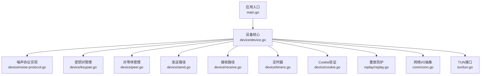
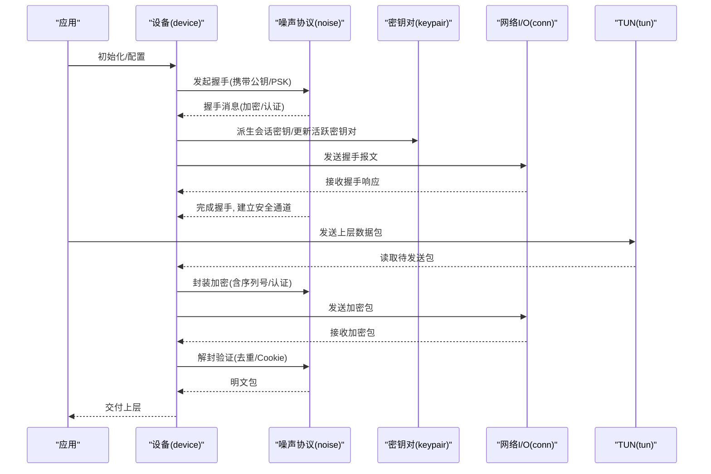
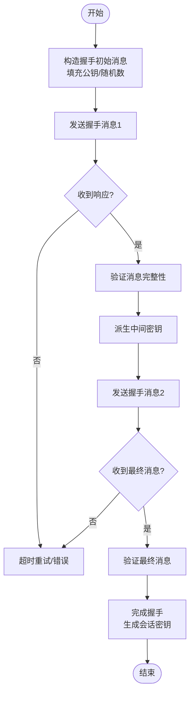
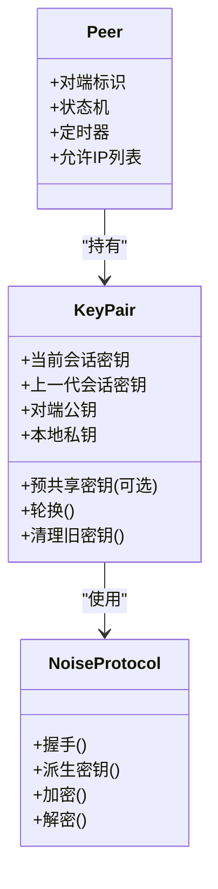
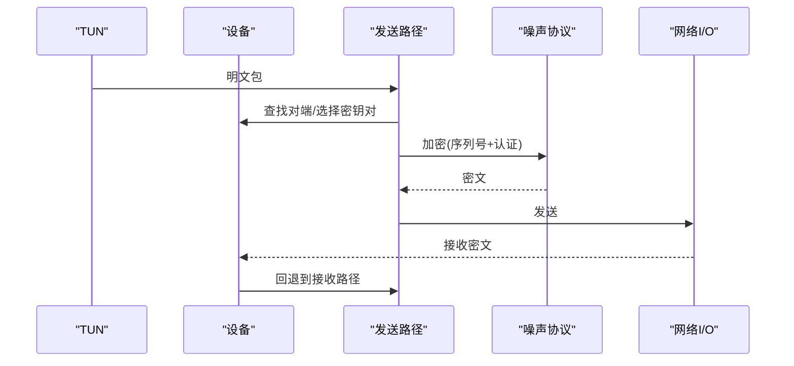
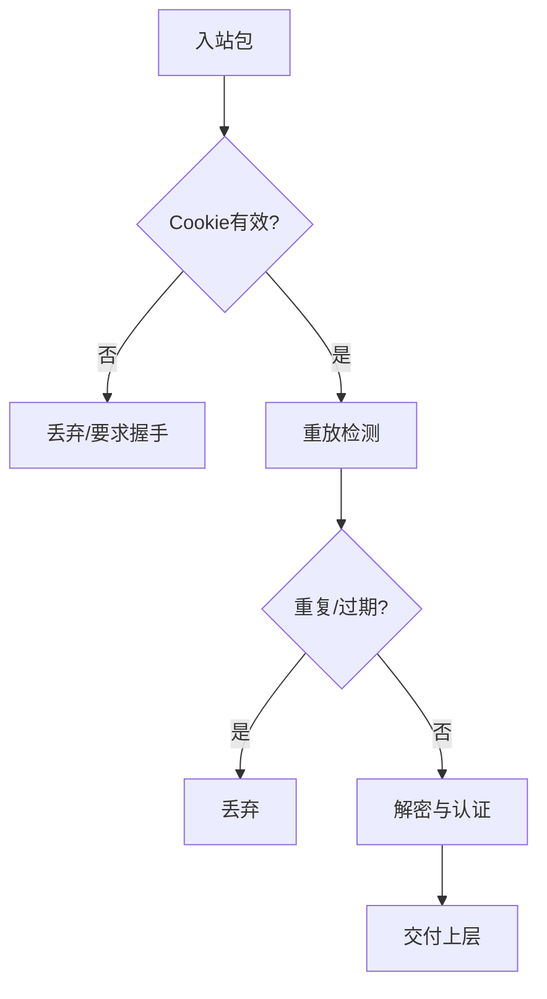
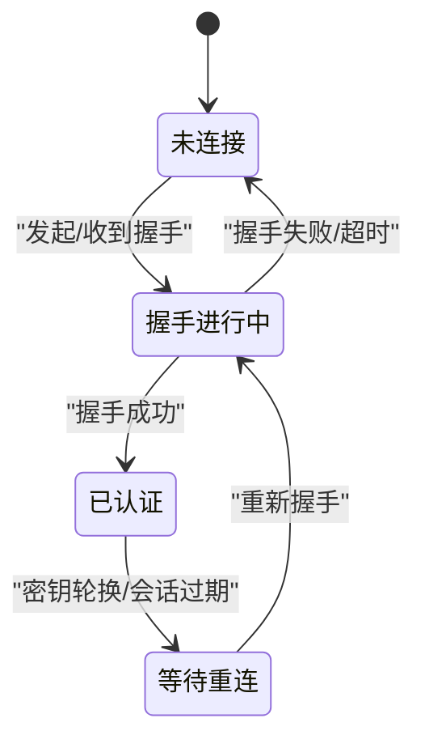
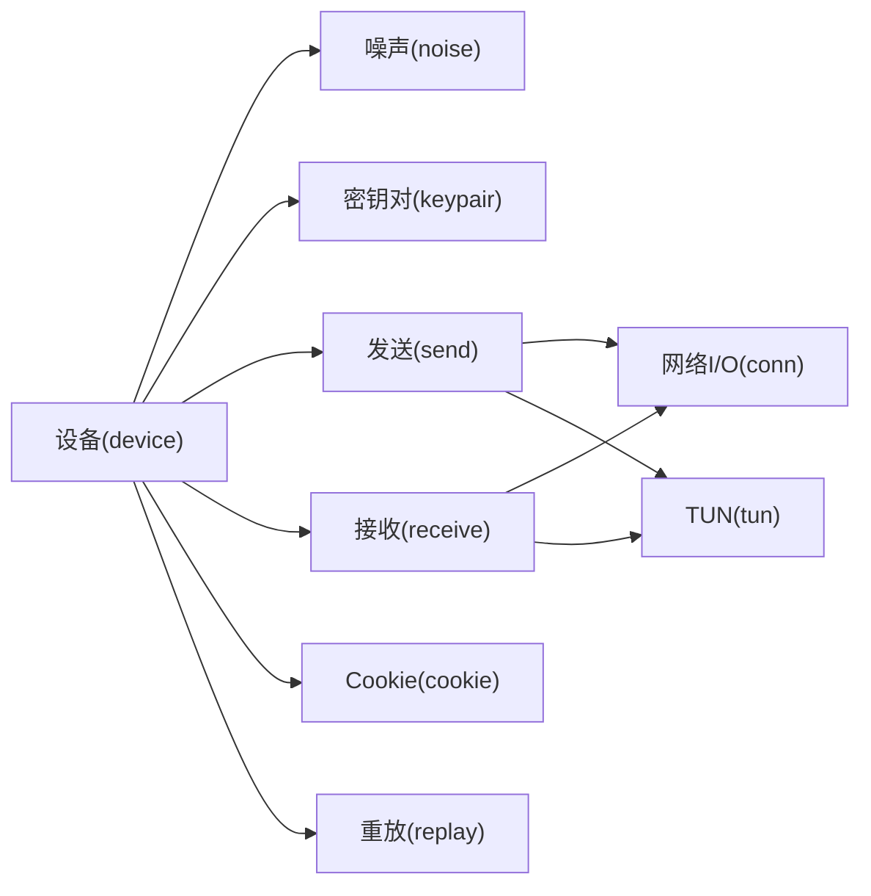

# 协议实现

<cite>
**本文引用的文件**
- [main.go](file://main.go)
- [device/device.go](file://device/device.go)
- [device/noise-protocol.go](file://device/noise-protocol.go)
- [device/noise-helpers.go](file://device/noise-helpers.go)
- [device/noise-types.go](file://device/noise-types.go)
- [device/keypair.go](file://device/keypair.go)
- [device/peer.go](file://device/peer.go)
- [device/send.go](file://device/send.go)
- [device/receive.go](file://device/receive.go)
- [device/timers.go](file://device/timers.go)
- [device/cookie.go](file://device/cookie.go)
- [replay/replay.go](file://replay/replay.go)
- [conn/conn.go](file://conn/conn.go)
- [tun/tun.go](file://tun/tun.go)
</cite>

## 目录
1. [简介](#简介)
2. [项目结构](#项目结构)
3. [核心组件](#核心组件)
4. [架构总览](#架构总览)
5. [详细组件分析](#详细组件分析)
6. [依赖关系分析](#依赖关系分析)
7. [性能考量](#性能考量)
8. [故障排查指南](#故障排查指南)
9. [结论](#结论)
10. [附录](#附录)

## 简介
本技术文档围绕WireGuard协议在Go语言中的实现，系统性阐述Noise协议框架的集成与握手流程、密钥交换算法与会话建立过程；详述静态密钥、临时密钥与会话密钥的管理机制；描述数据包的发送与接收处理（封装/解封装）；解释重放攻击防护与Cookie验证系统；给出协议状态机的实现细节与状态转换逻辑；并提供协议级调试与监控方法以及扩展与安全增强建议。

## 项目结构
该仓库采用分层组织：设备层负责协议状态机、噪声握手、密钥管理、定时器与对等体管理；网络I/O通过conn抽象封装不同平台套接字；TUN接口将隧道数据包注入/取出内核协议栈；重放防护、速率限制等作为独立模块被复用。

图表来源
- [main.go:1-200](file://main.go#L1-L200)
- [device/device.go:1-300](file://device/device.go#L1-L300)
- [device/noise-protocol.go:1-200](file://device/noise-protocol.go#L1-L200)
- [device/keypair.go:1-200](file://device/keypair.go#L1-L200)
- [device/peer.go:1-200](file://device/peer.go#L1-L200)
- [device/send.go:1-200](file://device/send.go#L1-L200)
- [device/receive.go:1-200](file://device/receive.go#L1-L200)
- [device/timers.go:1-200](file://device/timers.go#L1-L200)
- [device/cookie.go:1-200](file://device/cookie.go#L1-L200)
- [replay/replay.go:1-200](file://replay/replay.go#L1-L200)
- [conn/conn.go:1-200](file://conn/conn.go#L1-L200)
- [tun/tun.go:1-200](file://tun/tun.go#L1-L200)

章节来源
- [main.go:1-200](file://main.go#L1-L200)
- [device/device.go:1-300](file://device/device.go#L1-L300)

## 核心组件
- 设备核心：维护全局配置、对等体集合、索引表、队列与定时器，协调收发与握手。
- 噪声协议：实现Noise框架下的握手、密钥派生、消息加密/解密。
- 密钥对管理：维护当前与上一代密钥对，支持滚动更新与旧密钥清理。
- 对等体管理：存储对端公钥、预共享密钥、允许IP列表、状态与计时器。
- 发送路径：构建并加密数据包，写入网络I/O。
- 接收路径：校验、解密、去重、路由到TUN或上层。
- Cookie验证：抵御DoS，基于时间窗口与随机盐生成/验证Cookie。
- 重放防护：基于单调时间与序列号的去重窗口。
- 网络I/O与TUN：跨平台UDP/TCP与TUN设备抽象。

章节来源
- [device/device.go:1-300](file://device/device.go#L1-L300)
- [device/noise-protocol.go:1-200](file://device/noise-protocol.go#L1-L200)
- [device/keypair.go:1-200](file://device/keypair.go#L1-L200)
- [device/peer.go:1-200](file://device/peer.go#L1-L200)
- [device/send.go:1-200](file://device/send.go#L1-L200)
- [device/receive.go:1-200](file://device/receive.go#L1-L200)
- [device/cookie.go:1-200](file://device/cookie.go#L1-L200)
- [replay/replay.go:1-200](file://replay/replay.go#L1-L200)
- [conn/conn.go:1-200](file://conn/conn.go#L1-L200)
- [tun/tun.go:1-200](file://tun/tun.go#L1-L200)

## 架构总览
WireGuard设备作为中心控制器，协调噪声握手、密钥轮换、数据面收发与资源管理。噪声协议提供安全通道建立能力；密钥对模块确保前向保密与无缝切换；收发路径分别负责加密封装与解封验证；Cookie与重放模块提供抗DoS与抗重放保护；I/O与TUN完成与操作系统交互。

图表来源
- [device/device.go:1-300](file://device/device.go#L1-L300)
- [device/noise-protocol.go:1-200](file://device/noise-protocol.go#L1-L200)
- [device/keypair.go:1-200](file://device/keypair.go#L1-L200)
- [device/send.go:1-200](file://device/send.go#L1-L200)
- [device/receive.go:1-200](file://device/receive.go#L1-L200)
- [conn/conn.go:1-200](file://conn/conn.go#L1-L200)
- [tun/tun.go:1-200](file://tun/tun.go#L1-L200)

## 详细组件分析

### 噪声协议与握手流程
- 握手模式：使用Noise框架定义的握手模式，结合对端公钥、本地私钥与可选预共享密钥进行身份认证与密钥协商。
- 密钥派生：通过HKDF从握手材料派生出初始会话密钥、后续轮转密钥与认证标签所需密钥。
- 消息格式：包含固定头部、序列号、密文与认证标签；握手阶段消息逐步推进状态机。
- 状态推进：按“Initiator/Responder”角色推进，完成三次或四次消息后进入已认证状态。

图表来源
- [device/noise-protocol.go:1-200](file://device/noise-protocol.go#L1-L200)
- [device/noise-helpers.go:1-200](file://device/noise-helpers.go#L1-L200)
- [device/noise-types.go:1-200](file://device/noise-types.go#L1-L200)

章节来源
- [device/noise-protocol.go:1-200](file://device/noise-protocol.go#L1-L200)
- [device/noise-helpers.go:1-200](file://device/noise-helpers.go#L1-L200)
- [device/noise-types.go:1-200](file://device/noise-types.go#L1-L200)

### 密钥管理机制
- 静态密钥：长期持有的对端公钥与本地私钥，用于身份认证与握手。
- 临时密钥：每次握手产生的临时对称密钥，用于短期会话加密。
- 会话密钥：由握手材料派生的主会话密钥，支持定期轮转以增强前向保密。
- 密钥对滚动：维护当前与上一代密钥对，确保在轮转期间仍可解密历史包；旧密钥在过期后清理。

图表来源
- [device/keypair.go:1-200](file://device/keypair.go#L1-L200)
- [device/noise-protocol.go:1-200](file://device/noise-protocol.go#L1-L200)
- [device/peer.go:1-200](file://device/peer.go#L1-L200)

章节来源
- [device/keypair.go:1-200](file://device/keypair.go#L1-L200)
- [device/noise-protocol.go:1-200](file://device/noise-protocol.go#L1-L200)
- [device/peer.go:1-200](file://device/peer.go#L1-L200)

### 数据包发送与接收处理
- 发送路径：从TUN读取明文包，分配序列号，使用当前会话密钥加密并附加认证标签，写入网络I/O。
- 接收路径：从网络I/O读取密文，校验Cookie与认证标签，检查重放窗口，使用对应会话密钥解密，交付TUN。
- 封装/解封装：遵循固定头部格式，包含版本、类型、源/目标索引、序列号、密文与认证标签。

图表来源
- [device/send.go:1-200](file://device/send.go#L1-L200)
- [device/receive.go:1-200](file://device/receive.go#L1-L200)
- [device/noise-protocol.go:1-200](file://device/noise-protocol.go#L1-L200)
- [tun/tun.go:1-200](file://tun/tun.go#L1-L200)
- [conn/conn.go:1-200](file://conn/conn.go#L1-L200)

章节来源
- [device/send.go:1-200](file://device/send.go#L1-L200)
- [device/receive.go:1-200](file://device/receive.go#L1-L200)
- [tun/tun.go:1-200](file://tun/tun.go#L1-L200)
- [conn/conn.go:1-200](file://conn/conn.go#L1-L200)

### 重放攻击防护与Cookie验证
- 重放防护：基于单调时间与序列号的滑动窗口去重，拒绝重复或过旧的序列号。
- Cookie验证：为未知或高频请求生成带时间戳与随机盐的Cookie，接收方验证有效期与签名，防止资源耗尽攻击。

图表来源
- [device/cookie.go:1-200](file://device/cookie.go#L1-L200)
- [replay/replay.go:1-200](file://replay/replay.go#L1-L200)
- [device/receive.go:1-200](file://device/receive.go#L1-L200)

章节来源
- [device/cookie.go:1-200](file://device/cookie.go#L1-L200)
- [replay/replay.go:1-200](file://replay/replay.go#L1-L200)
- [device/receive.go:1-200](file://device/receive.go#L1-L200)

### 协议状态机与状态转换
- 状态定义：未连接、握手进行中、已认证、等待重连等。
- 事件驱动：定时器到期、收到握手消息、收到数据包、密钥轮换触发等事件驱动状态迁移。
- 关键转换：
  - 未连接 → 握手进行中：收到新握手请求或主动发起。
  - 握手进行中 → 已认证：完成握手且认证成功。
  - 已认证 → 等待重连：密钥轮换或会话过期。
  - 等待重连 → 握手进行中：重新发起握手。

图表来源
- [device/device.go:1-300](file://device/device.go#L1-L300)
- [device/peer.go:1-200](file://device/peer.go#L1-L200)
- [device/timers.go:1-200](file://device/timers.go#L1-L200)

章节来源
- [device/device.go:1-300](file://device/device.go#L1-L300)
- [device/peer.go:1-200](file://device/peer.go#L1-L200)
- [device/timers.go:1-200](file://device/timers.go#L1-L200)

### 定时器与会话生命周期
- 心跳与保活：周期性发送保活包，维持NAT映射。
- 会话超时：超过阈值自动触发密钥轮换或断开重连。
- 握手超时：握手未完成则回退并重试。

章节来源
- [device/timers.go:1-200](file://device/timers.go#L1-L200)

## 依赖关系分析
设备核心依赖噪声协议进行安全握手与加解密；密钥对模块提供密钥派生与轮换；收发路径依赖噪声与I/O抽象；Cookie与重放模块保障安全性；TUN与conn提供系统与网络接入。

图表来源
- [device/device.go:1-300](file://device/device.go#L1-L300)
- [device/noise-protocol.go:1-200](file://device/noise-protocol.go#L1-L200)
- [device/keypair.go:1-200](file://device/keypair.go#L1-L200)
- [device/send.go:1-200](file://device/send.go#L1-L200)
- [device/receive.go:1-200](file://device/receive.go#L1-L200)
- [device/cookie.go:1-200](file://device/cookie.go#L1-L200)
- [replay/replay.go:1-200](file://replay/replay.go#L1-L200)
- [conn/conn.go:1-200](file://conn/conn.go#L1-L200)
- [tun/tun.go:1-200](file://tun/tun.go#L1-L200)

章节来源
- [device/device.go:1-300](file://device/device.go#L1-L300)

## 性能考量
- 零拷贝与缓冲池：重用缓冲区减少分配开销。
- 批量处理：合并小包提升吞吐。
- 异步I/O：非阻塞读写避免阻塞事件循环。
- 密钥轮换频率：平衡前向保密与计算开销。
- 重放窗口大小：根据带宽与时延调整。

[本节为通用指导，不直接分析具体文件]

## 故障排查指南
- 握手失败：检查公钥匹配、PSK配置、网络连通性与超时设置。
- 无法解密：确认会话密钥是否轮换、序列号是否同步、Cookie是否过期。
- 高丢包：观察重放窗口与NAT保活间隔，调整定时器。
- DoS迹象：统计Cookie拒绝率与握手频率，启用限流。

章节来源
- [device/receive.go:1-200](file://device/receive.go#L1-L200)
- [device/cookie.go:1-200](file://device/cookie.go#L1-L200)
- [device/timers.go:1-200](file://device/timers.go#L1-L200)

## 结论
该实现以设备为核心，整合噪声协议、密钥管理、收发路径与安全防护，形成完整WireGuard协议栈。通过清晰的模块化设计与严格的时序控制，实现了高效、安全的隧道通信。建议在部署中合理配置定时器与密钥轮换策略，并结合监控指标持续优化性能与稳定性。

[本节为总结性内容，不直接分析具体文件]

## 附录
- 调试与监控：
  - 日志级别：记录握手事件、密钥轮换、Cookie验证结果与重放检测。
  - 指标收集：握手成功率、平均时延、丢包率、密钥轮换次数。
  - 抓包分析：捕获握手与数据报文，验证头部格式与认证标签。
- 扩展与安全增强：
  - 扩展噪声模式：支持新的握手模式或认证算法。
  - 增强Cookie：引入更复杂的签名或配额策略。
  - 多路径传输：结合多路复用提升鲁棒性。

[本节为概念性内容，不直接分析具体文件]