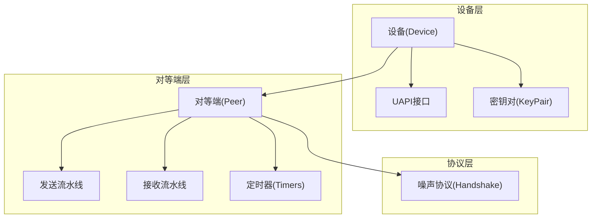
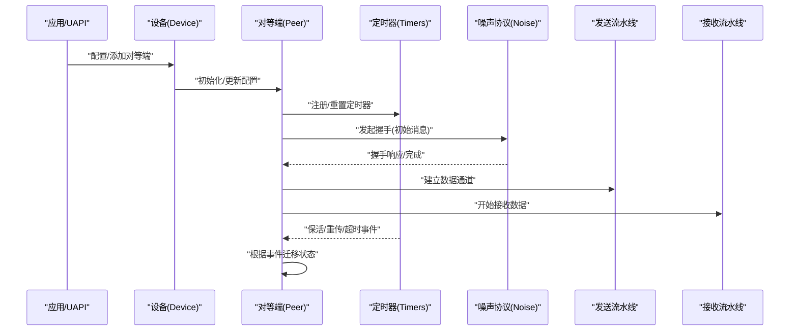
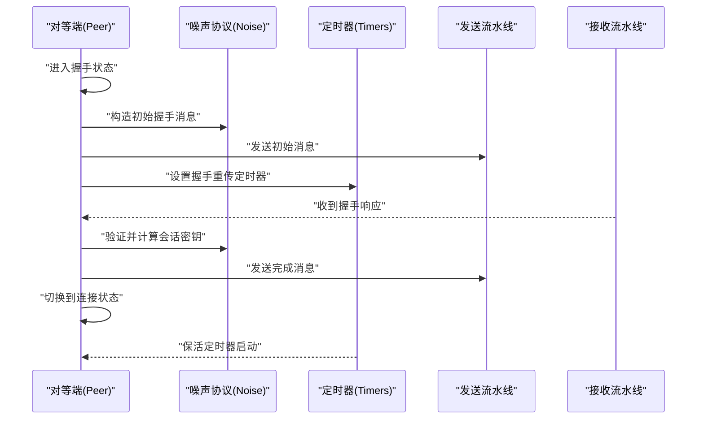
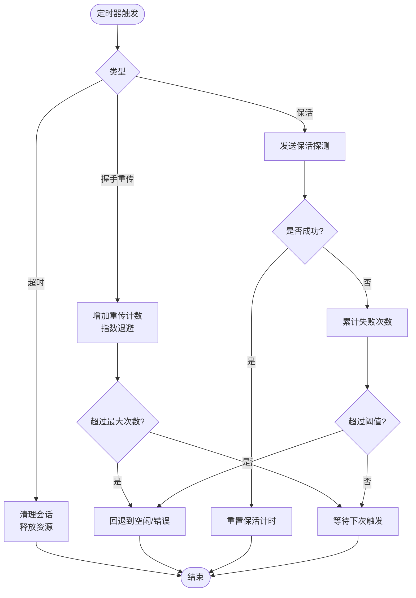
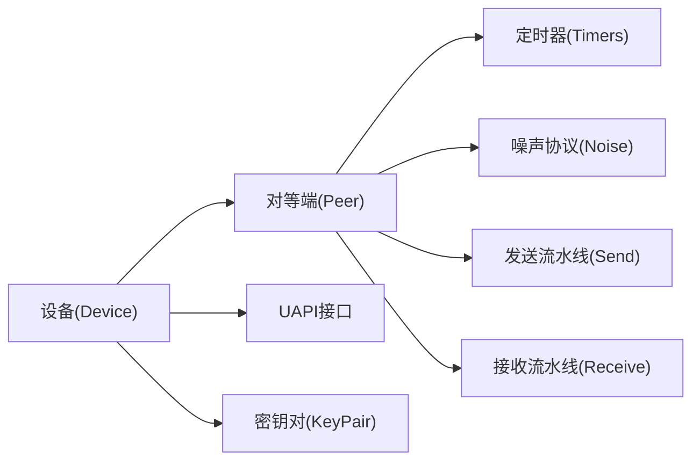

# 协议状态机

<cite>
**本文引用的文件**
- [device/device.go](file://device/device.go)
- [device/peer.go](file://device/peer.go)
- [device/timers.go](file://device/timers.go)
- [device/receive.go](file://device/receive.go)
- [device/send.go](file://device/send.go)
- [device/noise-protocol.go](file://device/noise-protocol.go)
- [device/keypair.go](file://device/keypair.go)
- [device/constants.go](file://device/constants.go)
- [device/uapi.go](file://device/uapi.go)
</cite>

## 目录
1. [简介](#简介)
2. [项目结构](#项目结构)
3. [核心组件](#核心组件)
4. [架构总览](#架构总览)
5. [详细组件分析](#详细组件分析)
6. [依赖关系分析](#依赖关系分析)
7. [性能考虑](#性能考虑)
8. [故障排查指南](#故障排查指南)
9. [结论](#结论)
10. [附录](#附录)

## 简介
本文件聚焦于WireGuard协议的状态机实现，围绕设备与对等端（Peer）的握手、连接、空闲等状态及其转换规则展开。文档同时覆盖定时器系统（重传、保活、超时）、状态持久化与恢复、并发安全（锁机制）、监控与诊断方法、异常检测与处理策略，以及为扩展新状态提供的设计指导。目标是帮助读者在不深入源码细节的前提下，理解并正确使用WireGuard的状态机能力。

## 项目结构
WireGuard的状态机主要位于 device 包中，围绕设备（Device）和对等端（Peer）两个核心对象组织：
- 设备层：负责全局配置、监听、队列管理、密钥对切换、UAPI接口等。
- 对等端层：维护单个对等端的会话状态、握手流程、发送/接收流水线、定时器与重试逻辑。
- 噪声协议层：实现Noise协议握手与消息封装。
- 定时器层：集中管理重传、保活、超时等定时任务。
- 常量层：定义状态枚举、时间常数、队列大小等。

图表来源
- [device/device.go:1-200](file://device/device.go#L1-L200)
- [device/peer.go:1-200](file://device/peer.go#L1-L200)
- [device/timers.go:1-200](file://device/timers.go#L1-L200)
- [device/noise-protocol.go:1-200](file://device/noise-protocol.go#L1-L200)

章节来源
- [device/device.go:1-200](file://device/device.go#L1-L200)
- [device/peer.go:1-200](file://device/peer.go#L1-L200)
- [device/timers.go:1-200](file://device/timers.go#L1-L200)
- [device/noise-protocol.go:1-200](file://device/noise-protocol.go#L1-L200)

## 核心组件
- 设备（Device）：持有所有对等端、监听套接字、队列池、密钥对轮换、UAPI服务入口。负责启动/停止、配置下发、统计信息暴露。
- 对等端（Peer）：维护当前会话状态、最近一次握手、发送/接收队列、定时器集合、索引表映射。是状态机的主体。
- 定时器（Timers）：统一管理重传定时器、保活定时器、超时清理器；支持按对等端粒度调度。
- 噪声协议（Noise）：实现握手消息构造、验证、解密/加密、密钥派生。
- 密钥对（KeyPair）：表示当前活跃与非活跃的对称密钥对，用于数据面加解密与防重放。
- 常量（Constants）：定义状态枚举、时间阈值、队列长度等。

章节来源
- [device/device.go:1-200](file://device/device.go#L1-L200)
- [device/peer.go:1-200](file://device/peer.go#L1-L200)
- [device/timers.go:1-200](file://device/timers.go#L1-L200)
- [device/noise-protocol.go:1-200](file://device/noise-protocol.go#L1-L200)
- [device/keypair.go:1-200](file://device/keypair.go#L1-L200)
- [device/constants.go:1-200](file://device/constants.go#L1-L200)

## 架构总览
下图展示了设备与对等端在状态机中的交互关系，包括握手、数据收发、定时器触发与状态迁移。

图表来源
- [device/device.go:1-200](file://device/device.go#L1-L200)
- [device/peer.go:1-200](file://device/peer.go#L1-L200)
- [device/timers.go:1-200](file://device/timers.go#L1-L200)
- [device/noise-protocol.go:1-200](file://device/noise-protocol.go#L1-L200)

## 详细组件分析

### 状态机模型与状态定义
- 状态集合
  - 空闲（Idle）：无活动握手或数据传输，等待触发条件（如出站流量、保活探测）。
  - 握手（Handshake）：正在进行噪声握手，包含初始消息、响应、完成阶段。
  - 连接（Connected）：握手成功，存在有效密钥对，可收发数据。
  - 其他中间态：如“等待响应”、“重传中”等，通常由握手或定时器驱动。
- 状态属性
  - 当前密钥对（活跃/非活跃）
  - 最近一次握手时间与序列号
  - 对端IP/端口、允许IP列表
  - 定时器句柄（重传、保活、超时）
  - 发送/接收队列指针
- 状态转换规则（概述）
  - 空闲 → 握手：出站数据包到达且无有效密钥对，或收到需要响应的控制报文。
  - 握手 → 连接：噪声握手完成，密钥派生成功，建立数据通道。
  - 连接 → 空闲：长时间无活动且保活失败，或达到最大空闲时间。
  - 握手 → 空闲：握手失败或超时，清理临时状态。
  - 连接 → 握手：密钥轮换或检测到对端重新握手时触发。

章节来源
- [device/constants.go:1-200](file://device/constants.go#L1-L200)
- [device/peer.go:1-200](file://device/peer.go#L1-L200)

### 握手流程与状态转换时序

图表来源
- [device/noise-protocol.go:1-200](file://device/noise-protocol.go#L1-L200)
- [device/send.go:1-200](file://device/send.go#L1-L200)
- [device/receive.go:1-200](file://device/receive.go#L1-L200)
- [device/timers.go:1-200](file://device/timers.go#L1-L200)

### 定时器系统（重传、保活、超时）
- 重传定时器
  - 用途：在握手或关键控制消息未收到响应时进行指数退避重传。
  - 行为：每次超时后延长间隔并重试，达到最大次数后回退到空闲或错误分支。
- 保活定时器
  - 用途：周期性发送探测以维持NAT绑定或对端可达性。
  - 行为：若连续多次探测失败，则判定对端不可达并触发状态回退。
- 超时处理
  - 用途：防止资源泄漏与僵尸会话，清理长期无活动的握手或连接。
  - 行为：到期后释放密钥、清空队列、重置状态。

图表来源
- [device/timers.go:1-200](file://device/timers.go#L1-L200)
- [device/peer.go:1-200](file://device/peer.go#L1-L200)

章节来源
- [device/timers.go:1-200](file://device/timers.go#L1-L200)
- [device/peer.go:1-200](file://device/peer.go#L1-L200)

### 状态持久化与恢复
- 持久化目标
  - 对等端配置（公钥、允许IP、预共享密钥等）
  - 会话元数据（最近握手时间、序列号、对端地址）
  - 定时器状态（剩余时间、重传计数）
- 恢复策略
  - 重启后从持久化存储加载配置与会话元数据。
  - 若发现旧密钥对仍有效，尝试快速恢复；否则发起全新握手。
  - 定时器根据剩余时间重建，避免重复或遗漏。
- 一致性保障
  - 使用原子写入与校验和确保配置完整性。
  - 在状态迁移关键点落盘，减少丢失窗口。

章节来源
- [device/device.go:1-200](file://device/device.go#L1-L200)
- [device/peer.go:1-200](file://device/peer.go#L1-L200)

### 并发状态管理与锁机制
- 并发边界
  - 发送/接收流水线并行运行，需保证状态读写一致。
  - 定时器回调与网络I/O可能同时修改会话状态。
- 锁策略
  - 细粒度锁：针对握手、密钥对切换、定时器字段分别加锁。
  - 写多读少场景采用读写锁，提升并发吞吐。
  - 避免长持锁：将耗时操作移出临界区。
- 一致性检查
  - 在状态迁移前后进行断言，捕获不一致。
  - 通过日志与指标暴露锁竞争热点。

章节来源
- [device/peer.go:1-200](file://device/peer.go#L1-L200)
- [device/timers.go:1-200](file://device/timers.go#L1-L200)

### 状态监控与诊断工具
- UAPI接口
  - 查询对等端状态、统计信息、最近握手时间、发送/接收字节数。
  - 动态调整参数（如重传次数、保活间隔）。
- 指标与日志
  - 暴露握手成功率、重传次数、保活失败率、状态切换频率。
  - 记录关键事件（握手开始/完成、超时、错误码）。
- 诊断流程
  - 通过UAPI拉取状态，结合日志定位问题。
  - 使用抓包工具验证握手报文与数据报文。

章节来源
- [device/uapi.go:1-200](file://device/uapi.go#L1-L200)
- [device/device.go:1-200](file://device/device.go#L1-L200)

### 异常检测与处理策略
- 常见异常
  - 握手失败：对端公钥无效、噪声协议不匹配、证书/签名错误。
  - 重传超限：网络丢包严重或对端无响应。
  - 保活失败：NAT超时、路由变更、对端离线。
  - 密钥轮换失败：随机数不足、内存分配失败。
- 处理策略
  - 降级到空闲状态并记录原因。
  - 触发告警与指标上报。
  - 自动重试或提示用户干预（如更换对端配置）。

章节来源
- [device/noise-protocol.go:1-200](file://device/noise-protocol.go#L1-L200)
- [device/timers.go:1-200](file://device/timers.go#L1-L200)
- [device/peer.go:1-200](file://device/peer.go#L1-L200)

### 扩展与新状态开发指导
- 设计原则
  - 明确状态语义与不变式，避免歧义。
  - 将状态迁移与事件解耦，便于测试与维护。
  - 为新状态补充定时器与持久化支持。
- 实施步骤
  - 在常量中新增状态枚举。
  - 在对等端结构中增加状态相关字段与方法。
  - 在发送/接收与定时器回调中添加迁移逻辑。
  - 更新UAPI输出与监控指标。
  - 编写单元测试覆盖正常路径与异常路径。

章节来源
- [device/constants.go:1-200](file://device/constants.go#L1-L200)
- [device/peer.go:1-200](file://device/peer.go#L1-L200)
- [device/timers.go:1-200](file://device/timers.go#L1-L200)
- [device/uapi.go:1-200](file://device/uapi.go#L1-L200)

## 依赖关系分析

图表来源
- [device/device.go:1-200](file://device/device.go#L1-L200)
- [device/peer.go:1-200](file://device/peer.go#L1-L200)
- [device/timers.go:1-200](file://device/timers.go#L1-L200)
- [device/noise-protocol.go:1-200](file://device/noise-protocol.go#L1-L200)
- [device/send.go:1-200](file://device/send.go#L1-L200)
- [device/receive.go:1-200](file://device/receive.go#L1-L200)
- [device/keypair.go:1-200](file://device/keypair.go#L1-L200)
- [device/uapi.go:1-200](file://device/uapi.go#L1-L200)

章节来源
- [device/device.go:1-200](file://device/device.go#L1-L200)
- [device/peer.go:1-200](file://device/peer.go#L1-L200)
- [device/timers.go:1-200](file://device/timers.go#L1-L200)
- [device/noise-protocol.go:1-200](file://device/noise-protocol.go#L1-L200)
- [device/send.go:1-200](file://device/send.go#L1-L200)
- [device/receive.go:1-200](file://device/receive.go#L1-L200)
- [device/keypair.go:1-200](file://device/keypair.go#L1-L200)
- [device/uapi.go:1-200](file://device/uapi.go#L1-L200)

## 性能考虑
- 减少锁竞争：将高频路径（如数据包加解密）与低频路径（如握手）分离，避免长持锁。
- 批处理与零拷贝：利用队列池与缓冲区复用降低GC压力。
- 定时器精度与开销：合理设置保活间隔与重退避策略，避免过多定时器导致CPU抖动。
- 监控与调优：基于UAPI与指标观察瓶颈，针对性优化。

[本节为通用性能建议，不直接分析具体文件]

## 故障排查指南
- 常见问题
  - 握手反复失败：检查对端公钥、噪声版本、防火墙策略。
  - 频繁重传：关注网络质量、MTU设置、拥塞控制。
  - 保活失败：确认NAT超时、路由稳定性、对端存活。
- 排查步骤
  - 通过UAPI获取对等端状态与统计。
  - 抓取握手与数据报文，比对期望行为。
  - 查看日志中的错误码与堆栈，定位模块。
  - 必要时调整定时器参数与重试策略。

章节来源
- [device/uapi.go:1-200](file://device/uapi.go#L1-L200)
- [device/noise-protocol.go:1-200](file://device/noise-protocol.go#L1-L200)
- [device/timers.go:1-200](file://device/timers.go#L1-L200)

## 结论
WireGuard的状态机以对等端为核心，围绕握手、连接、空闲等状态构建简洁而健壮的控制平面。定时器系统保障了可靠性与鲁棒性，配合UAPI与指标可实现有效的监控与诊断。通过合理的并发设计与持久化策略，系统在多线程与重启场景下保持一致性与可用性。面向未来扩展，遵循解耦与可测试原则，可平滑引入新状态与功能。

[本节为总结性内容，不直接分析具体文件]

## 附录
- 术语
  - 对等端（Peer）：与本地设备通信的另一端实体。
  - 噪声协议（Noise）：WireGuard使用的轻量级认证加密协议。
  - 密钥对（KeyPair）：用于数据面加解密的对称密钥组合。
- 参考
  - 设备与对等端实现：device/device.go, device/peer.go
  - 定时器与超时：device/timers.go
  - 噪声协议：device/noise-protocol.go
  - 发送/接收流水线：device/send.go, device/receive.go
  - 密钥对管理：device/keypair.go
  - 常量定义：device/constants.go
  - UAPI接口：device/uapi.go

[本节为参考资料，不直接分析具体文件]