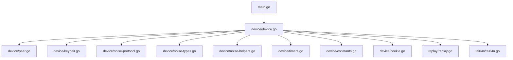
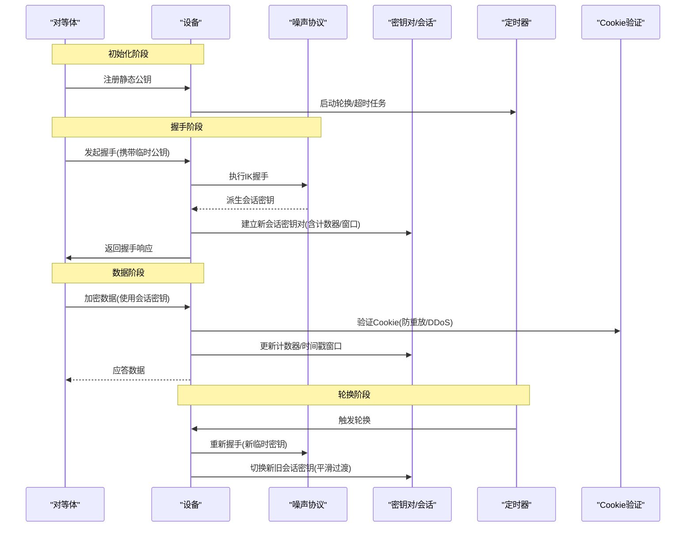
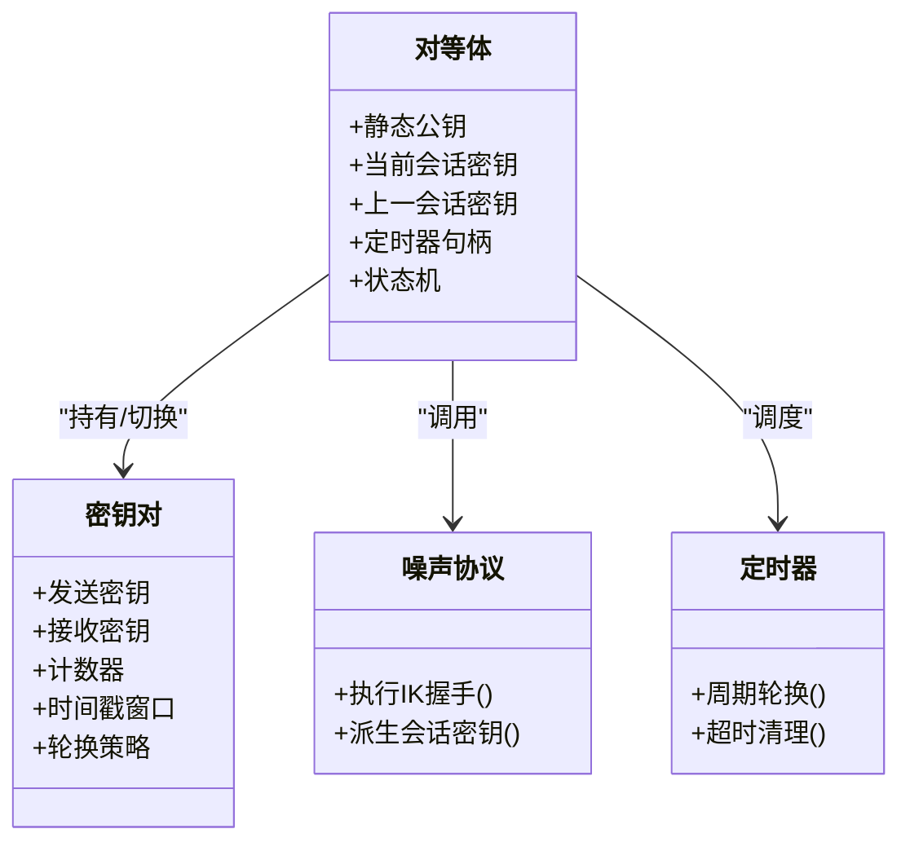
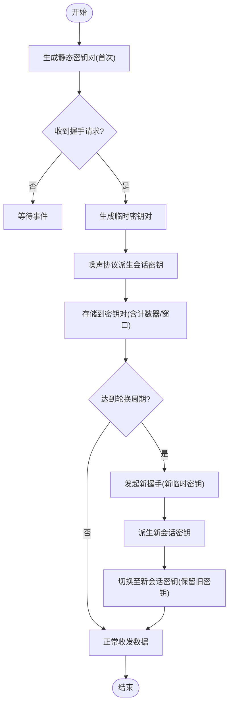
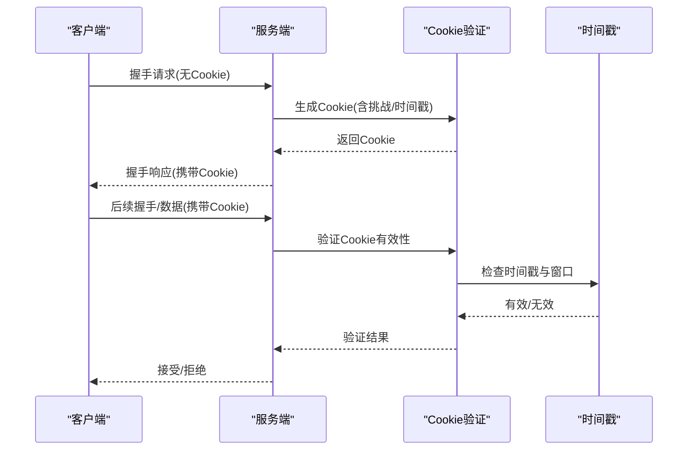
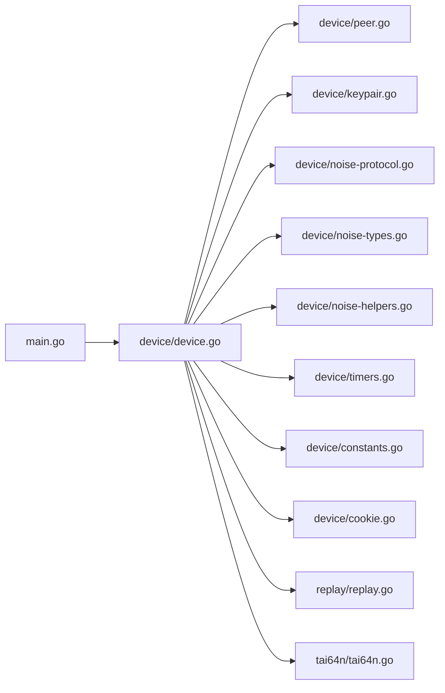

# 密钥管理机制

<cite>
**本文引用的文件**
- [device/device.go](file://device/device.go)
- [device/peer.go](file://device/peer.go)
- [device/keypair.go](file://device/keypair.go)
- [device/noise-protocol.go](file://device/noise-protocol.go)
- [device/noise-types.go](file://device/noise-types.go)
- [device/noise-helpers.go](file://device/noise-helpers.go)
- [device/kdf_test.go](file://device/kdf_test.go)
- [device/timers.go](file://device/timers.go)
- [device/constants.go](file://device/constants.go)
- [device/cookie.go](file://device/cookie.go)
- [replay/replay.go](file://replay/replay.go)
- [tai64n/tai64n.go](file://tai64n/tai64n.go)
- [main.go](file://main.go)
</cite>

## 目录
1. [简介](#简介)
2. [项目结构](#项目结构)
3. [核心组件](#核心组件)
4. [架构总览](#架构总览)
5. [详细组件分析](#详细组件分析)
6. [依赖关系分析](#依赖关系分析)
7. [性能考量](#性能考量)
8. [故障排查指南](#故障排查指南)
9. [结论](#结论)
10. [附录](#附录)

## 简介
本技术文档聚焦于WireGuard-go实现中的密钥管理机制，系统性阐述静态密钥、临时密钥与会话密钥的层次结构与生命周期管理；说明密钥对的生成、存储与轮换策略，以及前向保密的实现方式；详解Cookie验证系统如何抵御重放攻击与DDoS；解释密钥派生函数（HKDF）的使用与参数配置；给出密钥安全存储、备份恢复的最佳实践；提供密钥泄露检测与应急处理流程；并给出监控与审计建议。

## 项目结构
围绕密钥管理的代码主要分布在device子模块中，包括设备状态、对等体管理、密钥对、噪声协议、定时器、常量、Cookie校验等；时间戳与重放防护在replay与tai64n模块；入口在main.go。

图表来源
- [main.go:1-200](file://main.go#L1-L200)
- [device/device.go:1-200](file://device/device.go#L1-L200)
- [device/peer.go:1-200](file://device/peer.go#L1-L200)
- [device/keypair.go:1-200](file://device/keypair.go#L1-L200)
- [device/noise-protocol.go:1-200](file://device/noise-protocol.go#L1-L200)
- [device/noise-types.go:1-200](file://device/noise-types.go#L1-L200)
- [device/noise-helpers.go:1-200](file://device/noise-helpers.go#L1-L200)
- [device/timers.go:1-200](file://device/timers.go#L1-L200)
- [device/constants.go:1-200](file://device/constants.go#L1-L200)
- [device/cookie.go:1-200](file://device/cookie.go#L1-L200)
- [replay/replay.go:1-200](file://replay/replay.go#L1-L200)
- [tai64n/tai64n.go:1-200](file://tai64n/tai64n.go#L1-L200)

章节来源
- [main.go:1-200](file://main.go#L1-L200)
- [device/device.go:1-200](file://device/device.go#L1-L200)

## 核心组件
- 设备与对等体：维护对等体的静态公钥、会话状态、定时器与队列，协调密钥轮换与消息收发。
- 密钥对与会话：封装当前活跃会话的发送/接收密钥、计数器、时间戳窗口等。
- 噪声协议：实现Noise IK握手，完成临时密钥协商与密钥派生，确保前向保密。
- Cookie验证：基于对称密钥派生的挑战-响应机制，用于防重放与DDoS缓解。
- 定时器：驱动会话密钥轮换、超时清理等周期性任务。
- 常量：定义密钥长度、轮转周期、缓冲区大小等关键参数。
- 重放防护：基于单调时间戳与滑动窗口的去重机制。

章节来源
- [device/device.go:1-200](file://device/device.go#L1-L200)
- [device/peer.go:1-200](file://device/peer.go#L1-L200)
- [device/keypair.go:1-200](file://device/keypair.go#L1-L200)
- [device/noise-protocol.go:1-200](file://device/noise-protocol.go#L1-L200)
- [device/noise-types.go:1-200](file://device/noise-types.go#L1-L200)
- [device/noise-helpers.go:1-200](file://device/noise-helpers.go#L1-L200)
- [device/timers.go:1-200](file://device/timers.go#L1-L200)
- [device/constants.go:1-200](file://device/constants.go#L1-L200)
- [device/cookie.go:1-200](file://device/cookie.go#L1-L200)
- [replay/replay.go:1-200](file://replay/replay.go#L1-L200)
- [tai64n/tai64n.go:1-200](file://tai64n/tai64n.go#L1-L200)

## 架构总览
WireGuard的密钥体系采用分层设计：
- 静态密钥层：每个对等体拥有长期静态密钥对，用于身份认证与初始握手。
- 临时密钥层：每次握手生成一次性临时密钥对，参与ECDH计算，提供前向保密。
- 会话密钥层：通过噪声协议派生出短期会话密钥，按固定周期轮换，最小化泄露面。

图表来源
- [device/device.go:1-200](file://device/device.go#L1-L200)
- [device/peer.go:1-200](file://device/peer.go#L1-L200)
- [device/noise-protocol.go:1-200](file://device/noise-protocol.go#L1-L200)
- [device/keypair.go:1-200](file://device/keypair.go#L1-L200)
- [device/timers.go:1-200](file://device/timers.go#L1-L200)
- [device/cookie.go:1-200](file://device/cookie.go#L1-L200)

## 详细组件分析

### 密钥层次结构与生命周期
- 静态密钥：对等体持久持有，用于身份绑定与握手起点。
- 临时密钥：每次握手生成，仅存活一次握手，参与ECDH以产生共享秘密。
- 会话密钥：由噪声协议从共享秘密派生，包含加密/解密密钥、MAC密钥、计数器与时间戳窗口；按固定周期轮换。

图表来源
- [device/peer.go:1-200](file://device/peer.go#L1-L200)
- [device/keypair.go:1-200](file://device/keypair.go#L1-L200)
- [device/noise-protocol.go:1-200](file://device/noise-protocol.go#L1-L200)
- [device/timers.go:1-200](file://device/timers.go#L1-L200)

章节来源
- [device/peer.go:1-200](file://device/peer.go#L1-L200)
- [device/keypair.go:1-200](file://device/keypair.go#L1-L200)
- [device/noise-protocol.go:1-200](file://device/noise-protocol.go#L1-L200)
- [device/timers.go:1-200](file://device/timers.go#L1-L200)

### 密钥生成、存储与轮换
- 生成：静态密钥对在对等体创建时生成；临时密钥对每次握手时随机生成；会话密钥由噪声协议派生。
- 存储：会话密钥保存在对等体的密钥对结构中，包含发送/接收密钥、计数器与窗口；旧会话密钥保留一段时间以支持平滑切换。
- 轮换：定时器周期性触发轮换，切换到新的会话密钥；旧密钥在一定时间内仍可用于接收已发送的数据包，保证可靠性。

图表来源
- [device/noise-protocol.go:1-200](file://device/noise-protocol.go#L1-L200)
- [device/keypair.go:1-200](file://device/keypair.go#L1-L200)
- [device/timers.go:1-200](file://device/timers.go#L1-L200)
- [device/constants.go:1-200](file://device/constants.go#L1-L200)

章节来源
- [device/noise-protocol.go:1-200](file://device/noise-protocol.go#L1-L200)
- [device/keypair.go:1-200](file://device/keypair.go#L1-L200)
- [device/timers.go:1-200](file://device/timers.go#L1-L200)
- [device/constants.go:1-200](file://device/constants.go#L1-L200)

### 前向保密的实现
- 每次握手均使用新的临时密钥对进行ECDH计算，即使长期静态密钥泄露，也无法推导历史会话密钥。
- 会话密钥仅用于短期通信，定期轮换进一步限制泄露影响范围。

章节来源
- [device/noise-protocol.go:1-200](file://device/noise-protocol.go#L1-L200)
- [device/keypair.go:1-200](file://device/keypair.go#L1-L200)

### Cookie验证系统（防重放与DDoS防护）
- 工作原理：服务端为客户端分配带时间戳与挑战的Cookie；客户端在后续握手或数据包中携带该Cookie；服务端验证Cookie的有效性与完整性，拒绝过期或无效Cookie。
- 防重放：结合单调时间戳与窗口检查，避免重复或超时的Cookie被重用。
- DDoS防护：要求客户端证明其具备一定计算能力（如完成Challenge），降低资源耗尽攻击风险。

图表来源
- [device/cookie.go:1-200](file://device/cookie.go#L1-L200)
- [replay/replay.go:1-200](file://replay/replay.go#L1-L200)
- [tai64n/tai64n.go:1-200](file://tai64n/tai64n.go#L1-L200)

章节来源
- [device/cookie.go:1-200](file://device/cookie.go#L1-L200)
- [replay/replay.go:1-200](file://replay/replay.go#L1-L200)
- [tai64n/tai64n.go:1-200](file://tai64n/tai64n.go#L1-L200)

### 密钥派生函数（HKDF）与参数配置
- HKDF应用：噪声协议在握手过程中使用HKDF将共享秘密扩展为多个会话密钥（加密、MAC等）。
- 参数配置：盐值、信息字段与输出长度依据协议规范设定，确保不同用途的密钥相互独立。
- 测试覆盖：通过单元测试验证HKDF输出的确定性与正确性。

章节来源
- [device/noise-helpers.go:1-200](file://device/noise-helpers.go#L1-L200)
- [device/kdf_test.go:1-200](file://device/kdf_test.go#L1-L200)

### 重放防护与单调时间戳
- 单调时间戳：使用tai64n提供的单调时间源，避免时钟回拨导致的安全问题。
- 滑动窗口：维护最近接收的时间戳集合，超出窗口或重复的时间戳将被拒绝。

章节来源
- [replay/replay.go:1-200](file://replay/replay.go#L1-L200)
- [tai64n/tai64n.go:1-200](file://tai64n/tai64n.go#L1-L200)

## 依赖关系分析
- device模块内部耦合度高：peer、keypair、noise、timers、constants、cookie紧密协作。
- 外部依赖：replay与tai64n提供重放防护与单调时间；main作为入口初始化设备与对等体。

图表来源
- [main.go:1-200](file://main.go#L1-L200)
- [device/device.go:1-200](file://device/device.go#L1-L200)
- [device/peer.go:1-200](file://device/peer.go#L1-L200)
- [device/keypair.go:1-200](file://device/keypair.go#L1-L200)
- [device/noise-protocol.go:1-200](file://device/noise-protocol.go#L1-L200)
- [device/noise-types.go:1-200](file://device/noise-types.go#L1-L200)
- [device/noise-helpers.go:1-200](file://device/noise-helpers.go#L1-L200)
- [device/timers.go:1-200](file://device/timers.go#L1-L200)
- [device/constants.go:1-200](file://device/constants.go#L1-L200)
- [device/cookie.go:1-200](file://device/cookie.go#L1-L200)
- [replay/replay.go:1-200](file://replay/replay.go#L1-L200)
- [tai64n/tai64n.go:1-200](file://tai64n/tai64n.go#L1-L200)

章节来源
- [device/device.go:1-200](file://device/device.go#L1-L200)

## 性能考量
- 密钥轮换频率：过短会增加握手开销，过长会扩大泄露面；需根据业务负载与安全性权衡。
- Cookie挑战强度：提高挑战难度可增强DDoS防护，但会增加客户端计算成本。
- 内存占用：同时维护新旧会话密钥与时间戳窗口，需控制最大并发会话数与窗口大小。
- 定时器精度：高精度定时器有助于及时轮换与清理，但可能增加CPU开销。

[本节为通用指导，不直接分析具体文件]

## 故障排查指南
- 握手失败：检查静态公钥是否匹配、临时密钥是否生成成功、噪声协议步骤是否完整。
- Cookie拒绝：确认时间戳同步、Cookie有效期与窗口设置是否正确。
- 重放告警：检查单调时间源与滑动窗口配置，确认是否存在时钟异常。
- 轮换异常：验证定时器是否触发、新旧密钥切换逻辑是否生效。

章节来源
- [device/noise-protocol.go:1-200](file://device/noise-protocol.go#L1-L200)
- [device/cookie.go:1-200](file://device/cookie.go#L1-L200)
- [replay/replay.go:1-200](file://replay/replay.go#L1-L200)
- [device/timers.go:1-200](file://device/timers.go#L1-L200)

## 结论
WireGuard-go通过分层密钥体系、严格的轮换策略与前向保密机制，提供了高效且安全的密钥管理方案。Cookie验证与重放防护进一步增强了抗攻击能力。合理配置HKDF参数、定时器与窗口大小，可实现安全性与性能的平衡。建议在生产环境中实施严格的密钥存储、备份恢复与监控审计措施，以应对密钥泄露等突发事件。

[本节为总结，不直接分析具体文件]

## 附录

### 密钥安全存储最佳实践
- 静态密钥：存储在受保护的密钥库或硬件安全模块中，限制访问权限。
- 会话密钥：仅在内存中持有，进程退出后自动清除；避免落盘。
- 备份恢复：仅备份静态密钥；恢复时需重置会话状态并强制重新握手。

[本节为通用指导，不直接分析具体文件]

### 密钥泄露检测与应急处理
- 检测：监控异常握手频率、Cookie拒绝率、重放告警与错误日志。
- 应急：立即轮换受影响对等体的静态密钥；强制所有会话重新握手；审查访问日志与网络流量。

[本节为通用指导，不直接分析具体文件]

### 监控与审计建议
- 指标：握手成功率、轮换次数、Cookie验证通过率、重放拦截数。
- 日志：记录握手事件、轮换事件、Cookie挑战与验证结果（脱敏）。
- 告警：阈值异常时触发告警，便于快速响应。

[本节为通用指导，不直接分析具体文件]