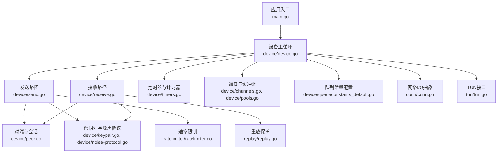
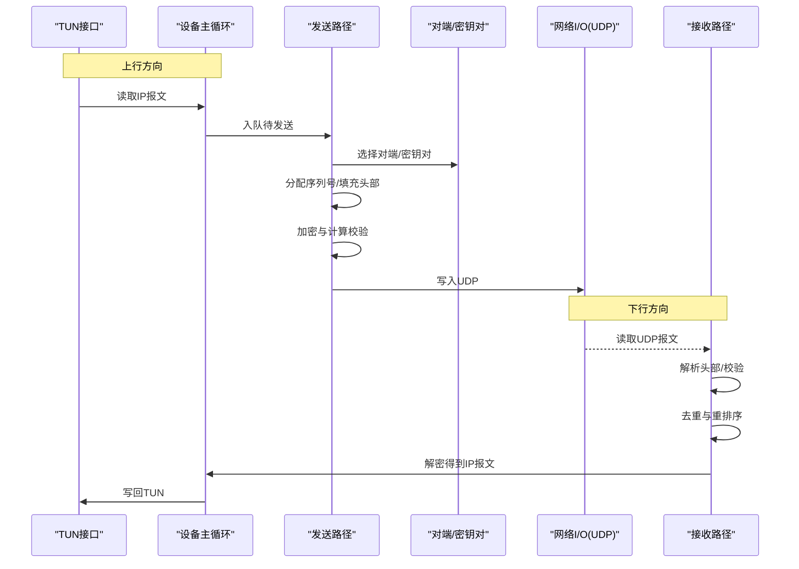
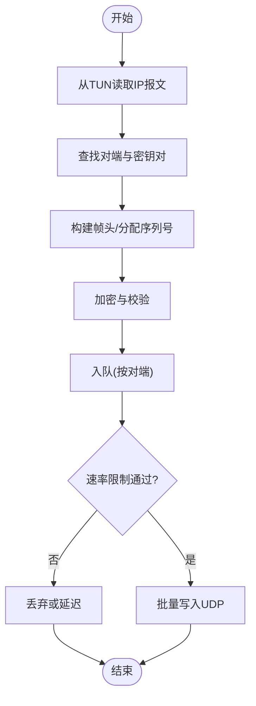
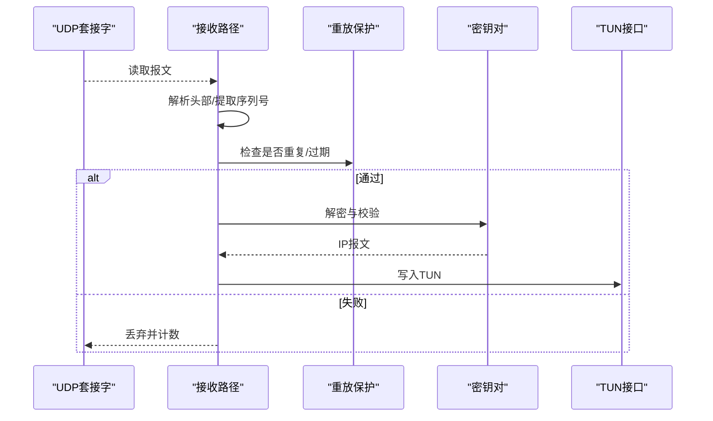
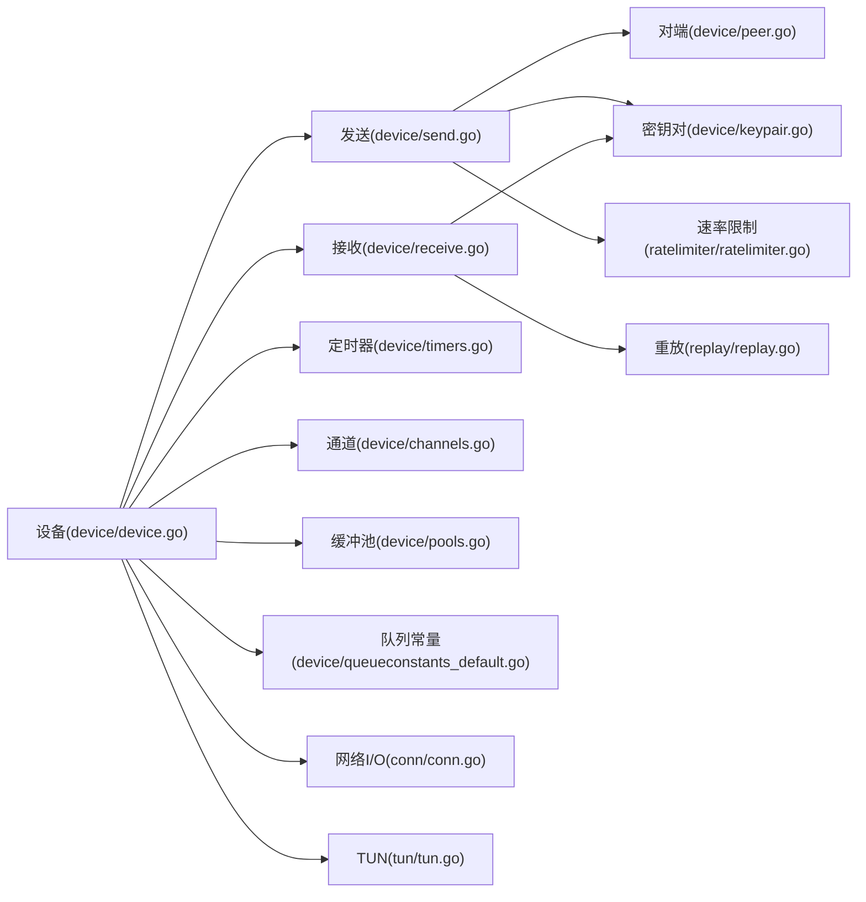

# 数据包处理

<cite>
**本文引用的文件**
- [main.go](file://main.go)
- [device/device.go](file://device/device.go)
- [device/send.go](file://device/send.go)
- [device/receive.go](file://device/receive.go)
- [device/peer.go](file://device/peer.go)
- [device/keypair.go](file://device/keypair.go)
- [device/noise-protocol.go](file://device/noise-protocol.go)
- [device/constants.go](file://device/constants.go)
- [device/timers.go](file://device/timers.go)
- [device/channels.go](file://device/channels.go)
- [device/pools.go](file://device/pools.go)
- [device/queueconstants_default.go](file://device/queueconstants_default.go)
- [ratelimiter/ratelimiter.go](file://ratelimiter/ratelimiter.go)
- [replay/replay.go](file://replay/replay.go)
- [conn/conn.go](file://conn/conn.go)
- [tun/tun.go](file://tun/tun.go)
</cite>

## 目录
1. [简介](#简介)
2. [项目结构](#项目结构)
3. [核心组件](#核心组件)
4. [架构总览](#架构总览)
5. [详细组件分析](#详细组件分析)
6. [依赖关系分析](#依赖关系分析)
7. [性能考量](#性能考量)
8. [故障排查指南](#故障排查指南)
9. [结论](#结论)
10. [附录](#附录)

## 简介
本技术文档聚焦于WireGuard的数据包处理系统，围绕数据包的封装与解封装、发送路径（队列管理、流量控制、拥塞避免）、接收路径（验证、去重、重排序）、协议版本兼容性与迁移策略、性能优化与内存管理、调试与监控指标，以及自定义数据包处理器的接口规范进行系统化阐述。目标是帮助读者从整体到细节全面理解WireGuard在Go实现中的数据包流转机制与工程实践。

## 项目结构
仓库采用分层模块化组织：设备层负责会话状态、密钥对、定时器、队列等；网络I/O通过conn抽象；TUN层提供内核隧道接口；辅助模块包括速率限制、重放保护等。

图表来源
- [main.go:1-200](file://main.go#L1-L200)
- [device/device.go:1-300](file://device/device.go#L1-L300)
- [device/send.go:1-300](file://device/send.go#L1-L300)
- [device/receive.go:1-300](file://device/receive.go#L1-L300)
- [device/peer.go:1-200](file://device/peer.go#L1-L200)
- [device/keypair.go:1-200](file://device/keypair.go#L1-L200)
- [device/noise-protocol.go:1-200](file://device/noise-protocol.go#L1-L200)
- [device/timers.go:1-200](file://device/timers.go#L1-L200)
- [device/channels.go:1-200](file://device/channels.go#L1-L200)
- [device/pools.go:1-200](file://device/pools.go#L1-L200)
- [device/queueconstants_default.go:1-200](file://device/queueconstants_default.go#L1-L200)
- [conn/conn.go:1-200](file://conn/conn.go#L1-L200)
- [tun/tun.go:1-200](file://tun/tun.go#L1-L200)
- [replay/replay.go:1-200](file://replay/replay.go#L1-L200)
- [ratelimiter/ratelimiter.go:1-200](file://ratelimiter/ratelimiter.go#L1-L200)

章节来源
- [main.go:1-200](file://main.go#L1-L200)
- [device/device.go:1-300](file://device/device.go#L1-L300)

## 核心组件
- 设备主循环：协调收发、定时器、队列与I/O事件，维护对端表、索引表与状态机。
- 发送路径：将上层IP报文封装为Noise/WireGuard帧，执行加密、序列号分配、队列入队、速率限制与发送。
- 接收路径：从底层读取UDP报文，解密、校验、去重、重排序，还原为IP报文并投递至TUN。
- 密钥对与噪声协议：管理对称密钥、握手状态、消息类型与载荷格式。
- 定时器：维护重试、保活、超时等计时任务。
- 通道与缓冲池：无锁或低锁并发通道、对象池减少GC压力。
- 队列常量：不同平台下的队列深度与批大小调优参数。
- 网络I/O抽象：统一UDP读写接口，支持GSO/TSO等特性。
- TUN接口：与操作系统隧道驱动交互。
- 重放保护：基于滑动窗口的序列号去重。
- 速率限制：令牌桶算法防止滥用与拥塞。

章节来源
- [device/device.go:1-300](file://device/device.go#L1-L300)
- [device/send.go:1-300](file://device/send.go#L1-L300)
- [device/receive.go:1-300](file://device/receive.go#L1-L300)
- [device/keypair.go:1-200](file://device/keypair.go#L1-L200)
- [device/noise-protocol.go:1-200](file://device/noise-protocol.go#L1-L200)
- [device/timers.go:1-200](file://device/timers.go#L1-L200)
- [device/channels.go:1-200](file://device/channels.go#L1-L200)
- [device/pools.go:1-200](file://device/pools.go#L1-L200)
- [device/queueconstants_default.go:1-200](file://device/queueconstants_default.go#L1-L200)
- [conn/conn.go:1-200](file://conn/conn.go#L1-L200)
- [tun/tun.go:1-200](file://tun/tun.go#L1-L200)
- [replay/replay.go:1-200](file://replay/replay.go#L1-L200)
- [ratelimiter/ratelimiter.go:1-200](file://ratelimiter/ratelimiter.go#L1-L200)

## 架构总览
下图展示数据包从TUN进入设备，经发送路径封装后通过UDP发出，以及反向的接收路径流程。

图表来源
- [device/device.go:1-300](file://device/device.go#L1-L300)
- [device/send.go:1-300](file://device/send.go#L1-L300)
- [device/receive.go:1-300](file://device/receive.go#L1-L300)
- [device/peer.go:1-200](file://device/peer.go#L1-L200)
- [device/keypair.go:1-200](file://device/keypair.go#L1-L200)
- [conn/conn.go:1-200](file://conn/conn.go#L1-L200)
- [tun/tun.go:1-200](file://tun/tun.go#L1-L200)

## 详细组件分析

### 发送路径：封装、队列、流量控制与拥塞避免
- 封装过程
  - 从TUN获取IP报文，查找对端与当前活跃密钥对。
  - 构造WireGuard帧头，分配单调递增序列号，填充载荷。
  - 使用噪声协议提供的加密原语进行认证加密，生成密文帧。
  - 可选地附加校验字段以满足链路层需求。
- 队列管理
  - 使用有界队列缓冲待发送帧，按对端分片管理。
  - 队列满时触发背压，丢弃或延迟新报文，避免内存膨胀。
  - 批量发送以减少系统调用开销。
- 流量控制与拥塞避免
  - 基于令牌桶的速率限制，限制单位时间内的报文数量与字节数。
  - 结合RTT估计与丢包率调整发送窗口，避免拥塞。
  - 对慢路径与快路径分别设置阈值，保障实时性。

图表来源
- [device/send.go:1-300](file://device/send.go#L1-L300)
- [device/peer.go:1-200](file://device/peer.go#L1-L200)
- [device/keypair.go:1-200](file://device/keypair.go#L1-L200)
- [ratelimiter/ratelimiter.go:1-200](file://ratelimiter/ratelimiter.go#L1-L200)
- [device/queueconstants_default.go:1-200](file://device/queueconstants_default.go#L1-L200)

章节来源
- [device/send.go:1-300](file://device/send.go#L1-L300)
- [device/peer.go:1-200](file://device/peer.go#L1-L200)
- [device/keypair.go:1-200](file://device/keypair.go#L1-L200)
- [ratelimiter/ratelimiter.go:1-200](file://ratelimiter/ratelimiter.go#L1-L200)
- [device/queueconstants_default.go:1-200](file://device/queueconstants_default.go#L1-L200)

### 接收路径：验证、去重与重排序
- 报文解析
  - 从UDP读取原始报文，解析WireGuard帧头，提取对端标识与序列号。
  - 根据对端查找对应密钥对，执行解密与完整性校验。
- 去重与重排序
  - 使用滑动窗口记录最近接收的序列号，拒绝重复或过期报文。
  - 对乱序报文进行缓存与重排序，保证上层顺序一致性。
- 交付
  - 解密成功后恢复IP报文，写入TUN。
  - 统计丢包、重传、乱序等指标用于诊断。

图表来源
- [device/receive.go:1-300](file://device/receive.go#L1-L300)
- [replay/replay.go:1-200](file://replay/replay.go#L1-L200)
- [device/keypair.go:1-200](file://device/keypair.go#L1-L200)
- [tun/tun.go:1-200](file://tun/tun.go#L1-L200)

章节来源
- [device/receive.go:1-300](file://device/receive.go#L1-L300)
- [replay/replay.go:1-200](file://replay/replay.go#L1-L200)
- [device/keypair.go:1-200](file://device/keypair.go#L1-L200)
- [tun/tun.go:1-200](file://tun/tun.go#L1-L200)

### 头部格式、载荷与校验和
- 头部字段
  - 包含对端标识、消息类型、序列号、长度等信息，确保单播与有序传输。
- 载荷
  - 承载加密后的IP报文，长度受MTU与队列限制约束。
- 校验
  - 使用噪声协议的认证加密保证机密性与完整性，无需额外校验和。
  - 若需兼容旧链路，可在外层附加轻量校验以快速丢弃无效报文。

章节来源
- [device/constants.go:1-200](file://device/constants.go#L1-L200)
- [device/noise-protocol.go:1-200](file://device/noise-protocol.go#L1-L200)

### 协议版本兼容性与迁移策略
- 兼容性
  - 通过消息类型与版本号字段区分不同协议版本，接收侧根据版本选择解析逻辑。
  - 对未知版本报文采取保守策略：丢弃并告警，避免错误解析。
- 迁移策略
  - 逐步升级两端版本，保持向后兼容至少一个版本区间。
  - 在设备层维护多版本解析器，动态切换。
  - 提供开关以启用/禁用旧版本支持，便于灰度发布。

章节来源
- [device/noise-protocol.go:1-200](file://device/noise-protocol.go#L1-L200)
- [device/constants.go:1-200](file://device/constants.go#L1-L200)

### 性能优化与内存管理
- 零拷贝与批处理
  - 尽量复用缓冲区，减少分配与拷贝；批量读写UDP降低系统调用次数。
- 对象池
  - 使用缓冲池管理临时结构体与帧对象，降低GC压力。
- 队列与背压
  - 合理设置队列深度与批大小，避免过深导致延迟与过浅导致吞吐下降。
- 网卡卸载
  - 利用GSO/TSO等特性减少CPU参与，提升转发效率。
- 定时器与调度
  - 合并相近定时器，减少唤醒次数；使用高精度定时器提升保活精度。

章节来源
- [device/pools.go:1-200](file://device/pools.go#L1-L200)
- [device/queueconstants_default.go:1-200](file://device/queueconstants_default.go#L1-L200)
- [conn/conn.go:1-200](file://conn/conn.go#L1-L200)
- [device/timers.go:1-200](file://device/timers.go#L1-L200)

### 调试工具与监控指标
- 调试
  - 启用日志记录关键事件：封包/解包、队列深度、丢包、重传、乱序。
  - 提供抓包钩子，导出原始UDP报文用于离线分析。
- 指标
  - 发送：队列长度、丢弃计数、平均延迟、吞吐。
  - 接收：去重计数、重排序队列长度、解密失败计数。
  - 连接：对端活跃度、密钥轮换次数、握手耗时。
- 可视化
  - 将指标暴露给监控系统，绘制趋势图与告警规则。

章节来源
- [device/device.go:1-300](file://device/device.go#L1-L300)
- [device/send.go:1-300](file://device/send.go#L1-L300)
- [device/receive.go:1-300](file://device/receive.go#L1-L300)

### 自定义数据包处理器接口规范
- 目标
  - 在不修改核心路径的前提下，扩展或替换特定处理逻辑（如自定义封装、审计、分流）。
- 接口设计要点
  - 定义统一的处理器接口，包含“预处理”、“封装/解封装”、“后处理”等方法。
  - 支持链式调用，允许插入多个处理器形成管道。
  - 提供上下文对象，携带对端信息、密钥对、队列引用与指标收集器。
- 生命周期
  - 初始化时注册处理器，运行时由设备主循环调度。
  - 支持热插拔与降级，异常时自动回退到默认路径。
- 安全与性能
  - 处理器不得绕过认证加密；必须遵循速率限制与队列约束。
  - 避免阻塞与长耗时操作，必要时异步化。

章节来源
- [device/device.go:1-300](file://device/device.go#L1-L300)
- [device/send.go:1-300](file://device/send.go#L1-L300)
- [device/receive.go:1-300](file://device/receive.go#L1-L300)

## 依赖关系分析
设备层依赖网络I/O抽象与TUN接口，发送与接收路径依赖对端与密钥对管理，同时借助定时器、通道、缓冲池与速率限制模块完成高并发与资源管理。

图表来源
- [device/device.go:1-300](file://device/device.go#L1-L300)
- [device/send.go:1-300](file://device/send.go#L1-L300)
- [device/receive.go:1-300](file://device/receive.go#L1-L300)
- [device/peer.go:1-200](file://device/peer.go#L1-L200)
- [device/keypair.go:1-200](file://device/keypair.go#L1-L200)
- [device/timers.go:1-200](file://device/timers.go#L1-L200)
- [device/channels.go:1-200](file://device/channels.go#L1-L200)
- [device/pools.go:1-200](file://device/pools.go#L1-L200)
- [device/queueconstants_default.go:1-200](file://device/queueconstants_default.go#L1-L200)
- [conn/conn.go:1-200](file://conn/conn.go#L1-L200)
- [tun/tun.go:1-200](file://tun/tun.go#L1-L200)
- [replay/replay.go:1-200](file://replay/replay.go#L1-L200)
- [ratelimiter/ratelimiter.go:1-200](file://ratelimiter/ratelimiter.go#L1-L200)

章节来源
- [device/device.go:1-300](file://device/device.go#L1-L300)

## 性能考量
- 队列深度与批大小应根据平台与负载调优，避免过高延迟或过低吞吐。
- 使用对象池减少频繁分配，降低GC停顿。
- 启用网卡卸载特性（如GSO/TSO）以降低CPU占用。
- 合并定时器与批量处理，减少系统调用与上下文切换。
- 监控关键指标，及时识别瓶颈并进行容量规划。

[本节为通用指导，不直接分析具体文件]

## 故障排查指南
- 常见问题
  - 丢包率高：检查队列深度、速率限制与拥塞避免策略。
  - 乱序严重：关注重排序队列长度与去重窗口大小。
  - 解密失败：核对密钥对状态、握手状态与时间同步。
  - 吞吐不足：评估批大小、网卡卸载与CPU利用率。
- 定位方法
  - 启用详细日志，捕获关键事件与指标。
  - 导出原始报文进行离线分析。
  - 使用性能剖析工具定位热点函数与锁竞争。

章节来源
- [device/send.go:1-300](file://device/send.go#L1-L300)
- [device/receive.go:1-300](file://device/receive.go#L1-L300)
- [device/timers.go:1-200](file://device/timers.go#L1-L200)

## 结论
WireGuard的数据包处理系统在设备层实现了高效的封装/解封装、严格的验证与去重、灵活的队列与流量控制，并通过噪声协议保障安全性。通过合理的性能优化与监控手段，可在多种平台上稳定运行。自定义处理器接口为扩展能力提供了标准化途径，便于生态集成与功能增强。

[本节为总结，不直接分析具体文件]

## 附录
- 术语
  - 帧：WireGuard在网络层之上的最小传输单元。
  - 密钥对：用于加密与解密的对称密钥集合。
  - 重放保护：防止重复或过期报文被接受的安全机制。
- 参考
  - 噪声协议规范与WireGuard协议文档。
  - 平台相关优化指南（Linux/GSO、Windows/TSO等）。

[本节为概念性内容，不直接分析具体文件]