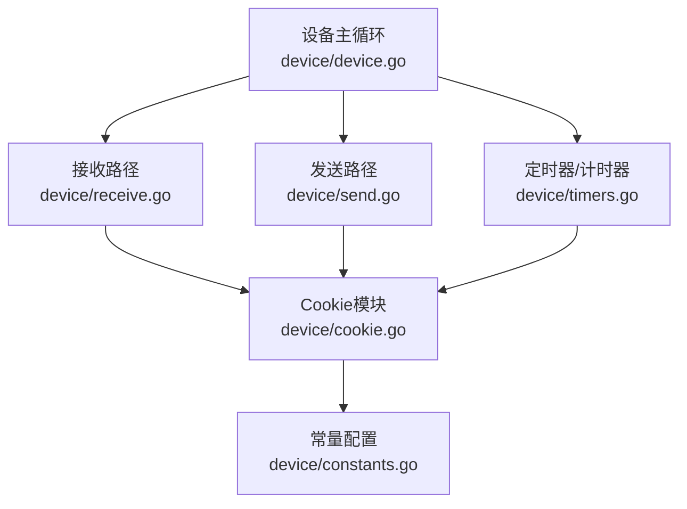
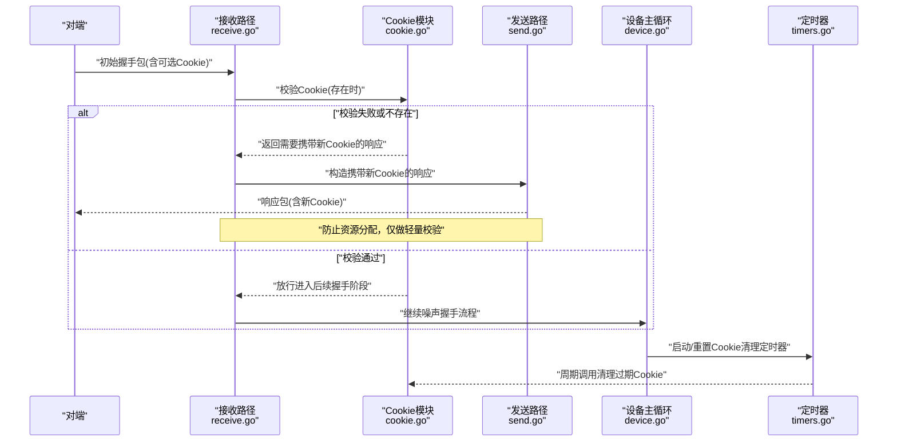
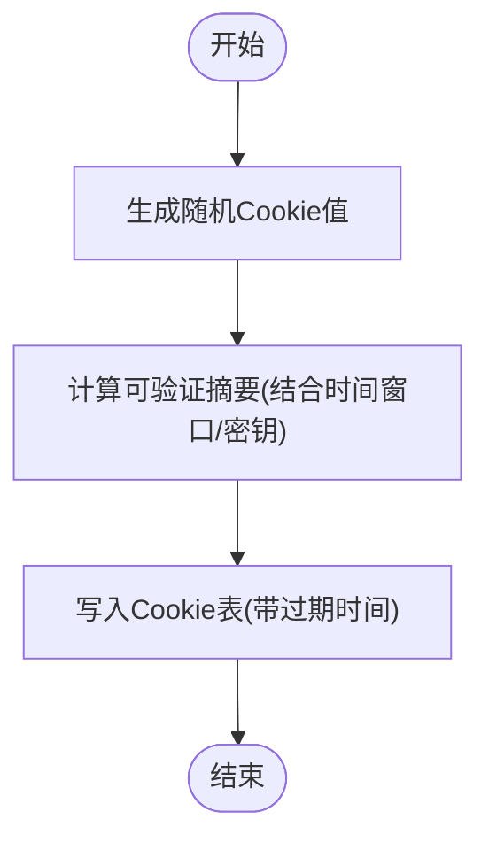
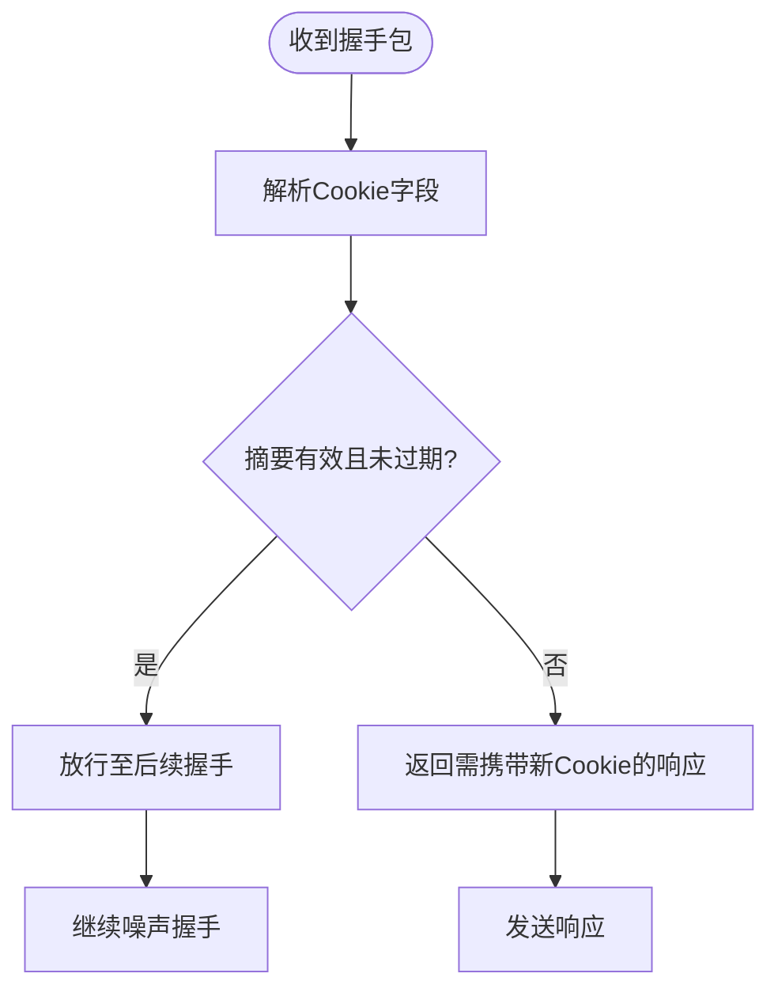
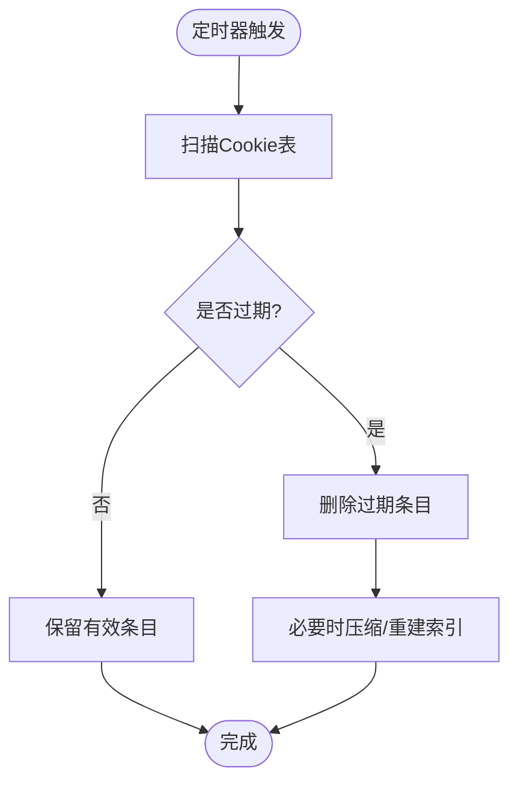
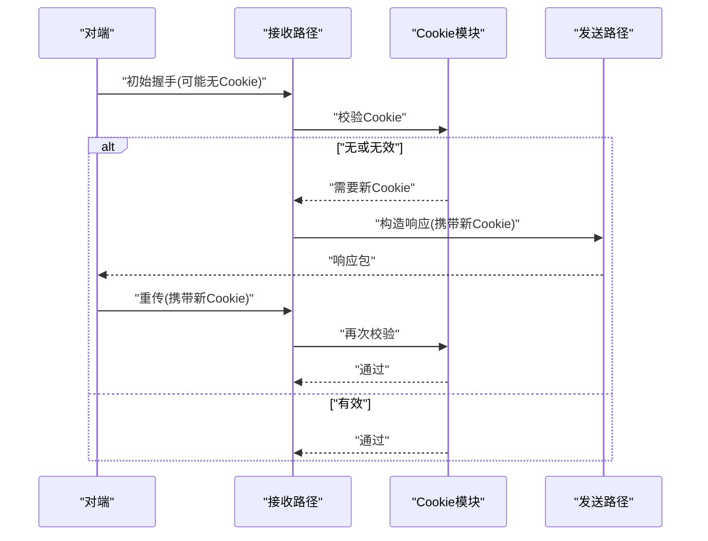
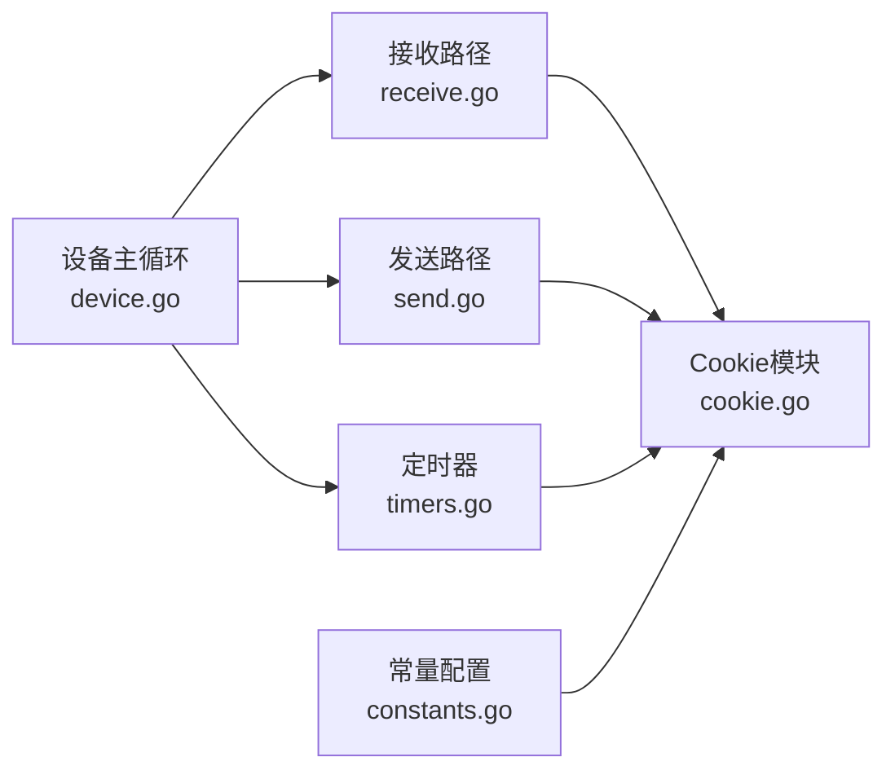

# Cookie验证机制

<cite>
**本文引用的文件**
- [device/cookie.go](file://device/cookie.go)
- [device/cookie_test.go](file://device/cookie_test.go)
- [device/device.go](file://device/device.go)
- [device/receive.go](file://device/receive.go)
- [device/send.go](file://device/send.go)
- [device/constants.go](file://device/constants.go)
- [device/timers.go](file://device/timers.go)
</cite>

## 目录
1. [简介](#简介)
2. [项目结构](#项目结构)
3. [核心组件](#核心组件)
4. [架构总览](#架构总览)
5. [详细组件分析](#详细组件分析)
6. [依赖关系分析](#依赖关系分析)
7. [性能考量](#性能考量)
8. [故障排查指南](#故障排查指南)
9. [结论](#结论)
10. [附录](#附录)

## 简介
本文件系统性说明WireGuard-Go中Cookie验证机制的实现原理与集成方式，重点覆盖：
- 随机Cookie生成、哈希验证与过期管理
- Cookie在防御SYN泛洪攻击中的作用与工作流程
- Cookie生命周期管理与内存优化策略
- Cookie验证的配置项与安全参数调整
- 性能影响分析与优化建议
- 与噪声握手协议的集成方式
- 安全威胁分析与防护措施

## 项目结构
与Cookie验证直接相关的代码主要位于device子目录：
- cookie.go：Cookie生成、校验、过期清理与内部状态维护
- device.go：设备主循环、定时器调度、接收/发送路径入口
- receive.go：入站数据包处理，包含Cookie校验触发点
- send.go：出站数据包处理，包含携带Cookie的响应构造
- constants.go：与Cookie相关的常量（如时间窗口、超时等）
- timers.go：定时器相关逻辑，驱动Cookie过期清理

图表来源
- [device/device.go:1-200](file://device/device.go#L1-L200)
- [device/receive.go:1-200](file://device/receive.go#L1-L200)
- [device/send.go:1-200](file://device/send.go#L1-L200)
- [device/cookie.go:1-200](file://device/cookie.go#L1-L200)
- [device/timers.go:1-200](file://device/timers.go#L1-L200)
- [device/constants.go:1-100](file://device/constants.go#L1-L100)

章节来源
- [device/device.go:1-200](file://device/device.go#L1-L200)
- [device/cookie.go:1-200](file://device/cookie.go#L1-L200)
- [device/receive.go:1-200](file://device/receive.go#L1-L200)
- [device/send.go:1-200](file://device/send.go#L1-L200)
- [device/timers.go:1-200](file://device/timers.go#L1-L200)
- [device/constants.go:1-100](file://device/constants.go#L1-L100)

## 核心组件
- Cookie生成器：负责生成不可预测的随机Cookie值，并基于密钥派生或时间窗口计算可验证的摘要。
- Cookie校验器：对收到的Cookie进行完整性与时效性校验，拒绝过期或无效值。
- 过期管理器：周期性清理过期Cookie条目，控制内存占用。
- 握手集成点：在噪声握手流程中插入Cookie校验与回送，确保首次握手具备抗放大能力。
- 配置与常量：定义Cookie时间窗口、重试次数、最大并发等关键参数。

章节来源
- [device/cookie.go:1-200](file://device/cookie.go#L1-L200)
- [device/constants.go:1-100](file://device/constants.go#L1-L100)

## 架构总览
Cookie验证嵌入到噪声握手流程中，作为“无状态前置检查”以抵御SYN泛洪。整体流程如下：

图表来源
- [device/receive.go:1-200](file://device/receive.go#L1-L200)
- [device/send.go:1-200](file://device/send.go#L1-L200)
- [device/cookie.go:1-200](file://device/cookie.go#L1-L200)
- [device/device.go:1-200](file://device/device.go#L1-L200)
- [device/timers.go:1-200](file://device/timers.go#L1-L200)

## 详细组件分析

### Cookie生成与存储
- 生成策略：使用强随机源生成Cookie值，并结合时间窗口或密钥派生计算可验证摘要，确保不可预测且可验证。
- 存储结构：为每个对端/会话维护少量元数据（如创建时间、有效期），采用高效数据结构以降低查找与更新开销。
- 并发安全：对共享状态加锁或使用原子操作，避免竞态条件。

图表来源
- [device/cookie.go:1-200](file://device/cookie.go#L1-L200)

章节来源
- [device/cookie.go:1-200](file://device/cookie.go#L1-L200)

### Cookie校验与拒绝策略
- 校验步骤：解析请求中的Cookie，验证摘要正确性与时间有效性；若失败则拒绝并指示携带新Cookie。
- 拒绝行为：不分配大量资源，仅返回最小响应，要求对端重传携带有效Cookie的请求。
- 防绕过：对频繁失败的请求实施速率限制或临时封禁。

图表来源
- [device/receive.go:1-200](file://device/receive.go#L1-L200)
- [device/cookie.go:1-200](file://device/cookie.go#L1-L200)

章节来源
- [device/receive.go:1-200](file://device/receive.go#L1-L200)
- [device/cookie.go:1-200](file://device/cookie.go#L1-L200)

### 过期管理与内存优化
- 过期策略：基于固定时间窗口标记Cookie失效；支持滚动窗口以减少抖动。
- 清理机制：定时器周期性扫描并移除过期条目；批量删除降低锁竞争。
- 内存优化：使用紧凑结构、惰性回收、上限阈值与淘汰策略，避免内存泄漏。

图表来源
- [device/timers.go:1-200](file://device/timers.go#L1-L200)
- [device/cookie.go:1-200](file://device/cookie.go#L1-L200)

章节来源
- [device/timers.go:1-200](file://device/timers.go#L1-L200)
- [device/cookie.go:1-200](file://device/cookie.go#L1-L200)

### 与噪声握手协议的集成
- 首次握手：对端发送初始握手包，服务端若无有效Cookie则返回携带新Cookie的响应，要求对端重传。
- 后续握手：对端携带有效Cookie再次发起握手，服务端快速校验后继续密钥协商。
- 错误恢复：若Cookie丢失或过期，自动降级为重新获取Cookie的流程。

图表来源
- [device/receive.go:1-200](file://device/receive.go#L1-L200)
- [device/send.go:1-200](file://device/send.go#L1-L200)
- [device/cookie.go:1-200](file://device/cookie.go#L1-L200)

章节来源
- [device/receive.go:1-200](file://device/receive.go#L1-L200)
- [device/send.go:1-200](file://device/send.go#L1-L200)
- [device/cookie.go:1-200](file://device/cookie.go#L1-L200)

### 配置选项与安全参数
- 时间窗口：控制Cookie有效期，平衡可用性与安全性。
- 重试与退避：限制重复失败请求的频率，减轻压力。
- 最大并发与队列长度：限制同时处理的握手数量，防止资源耗尽。
- 清理频率：调整定时器间隔，权衡CPU与内存占用。

章节来源
- [device/constants.go:1-100](file://device/constants.go#L1-L100)
- [device/timers.go:1-200](file://device/timers.go#L1-L200)

## 依赖关系分析
- 接收路径依赖Cookie模块进行前置校验，减少后续握手阶段的资源消耗。
- 发送路径根据Cookie校验结果构造响应，确保对端能获取有效Cookie。
- 定时器驱动Cookie过期清理，保障长期运行的稳定性。
- 常量配置集中管理Cookie相关阈值，便于调优与审计。

图表来源
- [device/receive.go:1-200](file://device/receive.go#L1-L200)
- [device/send.go:1-200](file://device/send.go#L1-L200)
- [device/cookie.go:1-200](file://device/cookie.go#L1-L200)
- [device/timers.go:1-200](file://device/timers.go#L1-L200)
- [device/constants.go:1-100](file://device/constants.go#L1-L100)
- [device/device.go:1-200](file://device/device.go#L1-L200)

章节来源
- [device/device.go:1-200](file://device/device.go#L1-L200)
- [device/cookie.go:1-200](file://device/cookie.go#L1-L200)
- [device/receive.go:1-200](file://device/receive.go#L1-L200)
- [device/send.go:1-200](file://device/send.go#L1-L200)
- [device/timers.go:1-200](file://device/timers.go#L1-L200)
- [device/constants.go:1-100](file://device/constants.go#L1-L100)

## 性能考量
- CPU开销：Cookie校验为轻量操作，但高并发下仍需注意哈希计算与锁竞争。
- 内存占用：通过过期清理与上限控制避免无限增长；定期压缩可减少碎片。
- 网络往返：首次握手多一次往返用于获取Cookie，可通过缓存或预取降低延迟。
- 调优建议：
  - 合理设置时间窗口与清理频率，平衡命中率与CPU使用。
  - 在高负载场景启用批处理清理与懒加载。
  - 监控队列长度与丢弃率，动态调整并发限制。

[本节提供通用指导，无需特定文件引用]

## 故障排查指南
- 常见问题：
  - Cookie频繁失效：检查时间窗口与系统时钟同步。
  - 内存持续增长：确认清理定时器是否正常运行，是否存在异常条目未释放。
  - 握手延迟增加：评估Cookie校验与哈希计算的瓶颈，考虑并行化或缓存。
- 诊断方法：
  - 观察定时器触发日志与清理统计。
  - 监控Cookie表大小与命中率。
  - 抓包分析握手往返与Cookie携带情况。

章节来源
- [device/timers.go:1-200](file://device/timers.go#L1-L200)
- [device/cookie.go:1-200](file://device/cookie.go#L1-L200)

## 结论
Cookie验证机制通过在噪声握手前引入轻量级校验，有效缓解SYN泛洪攻击，保护服务器资源。其实现涵盖随机生成、哈希验证、过期管理与内存优化，并与接收/发送路径及定时器紧密集成。通过合理配置与持续监控，可在安全性与性能之间取得良好平衡。

[本节总结性内容，无需特定文件引用]

## 附录
- 安全威胁与防护：
  - SYN泛洪：通过Cookie前置校验与资源限制降低放大效应。
  - 重放攻击：利用时间窗口与一次性摘要防止重用。
  - 侧信道泄露：避免在Cookie中暴露敏感信息，保持最小化元数据。
- 最佳实践：
  - 定期轮换密钥与种子，增强抗破解能力。
  - 在生产环境开启详细日志与指标采集，便于问题定位。
  - 结合防火墙与速率限制形成纵深防御。

[本节提供通用指导，无需特定文件引用]