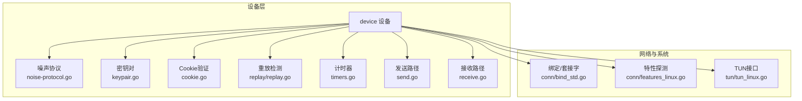
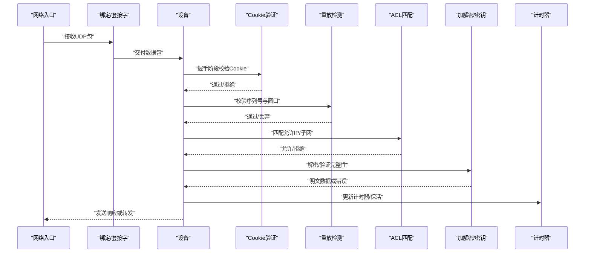
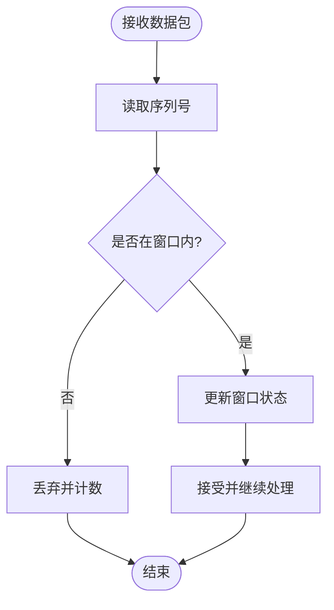
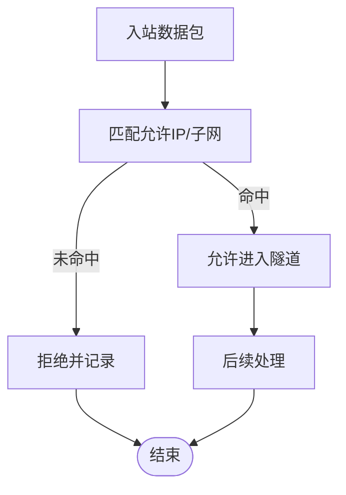
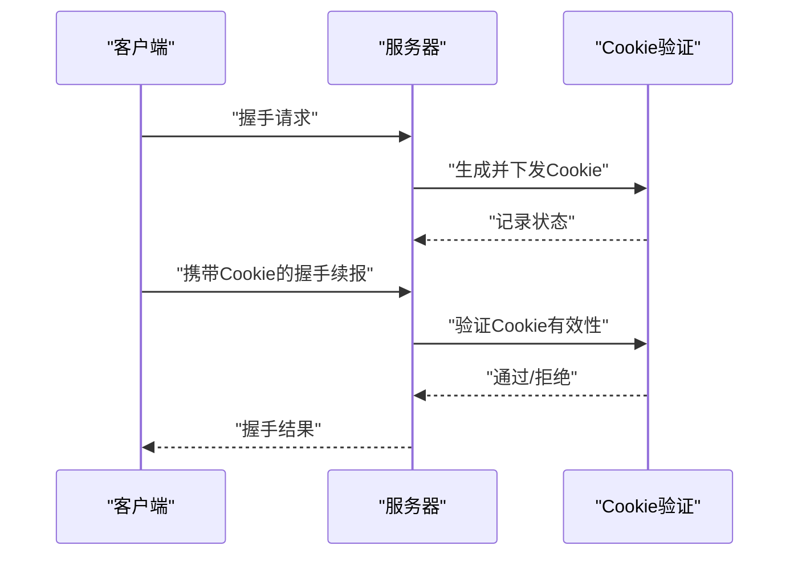
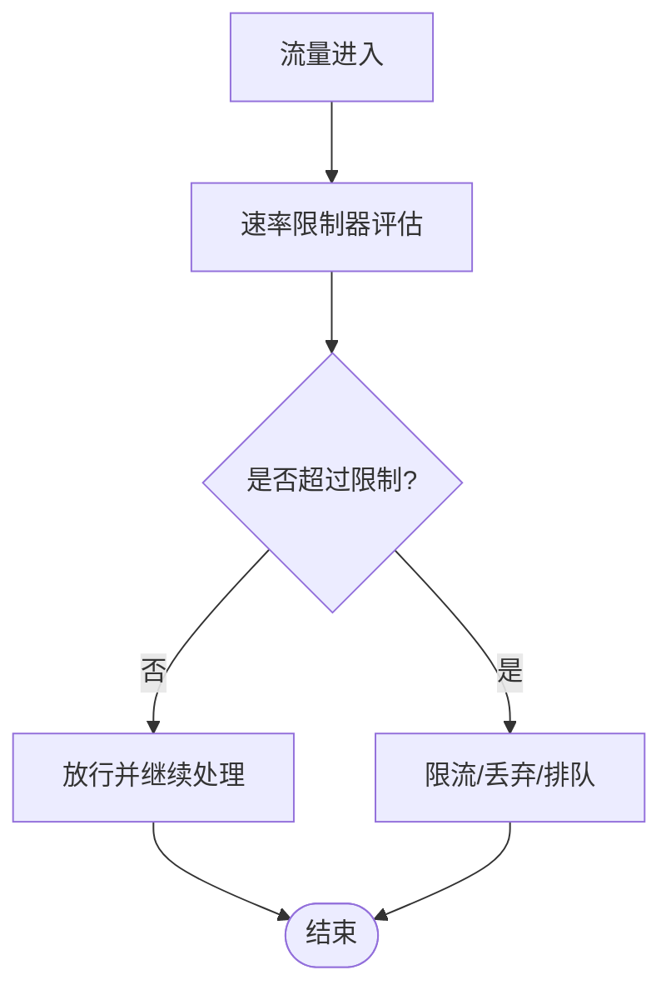
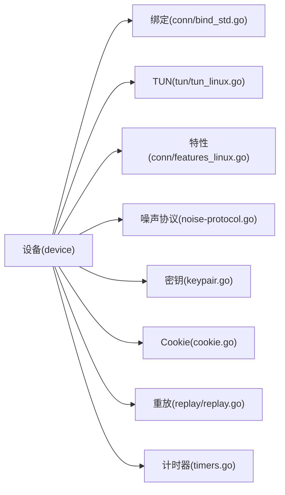

# 安全特性

<cite>
**本文引用的文件**
- [device/device.go](file://device/device.go)
- [device/cookie.go](file://device/cookie.go)
- [replay/replay.go](file://replay/replay.go)
- [ratelimiter/ratelimiter.go](file://ratelimiter/ratelimiter.go)
- [device/noise-protocol.go](file://device/noise-protocol.go)
- [device/keypair.go](file://device/keypair.go)
- [device/timers.go](file://device/timers.go)
- [device/send.go](file://device/send.go)
- [device/receive.go](file://device/receive.go)
- [device/constants.go](file://device/constants.go)
- [device/logger.go](file://device/logger.go)
- [conn/bind_std.go](file://conn/bind_std.go)
- [conn/features_linux.go](file://conn/features_linux.go)
- [tun/tun_linux.go](file://tun/tun_linux.go)
</cite>

## 目录
1. [简介](#简介)
2. [项目结构](#项目结构)
3. [核心组件](#核心组件)
4. [架构总览](#架构总览)
5. [详细组件分析](#详细组件分析)
6. [依赖关系分析](#依赖关系分析)
7. [性能考量](#性能考量)
8. [故障排查指南](#故障排查指南)
9. [结论](#结论)
10. [附录](#附录)

## 简介
本文件面向wireguard-go的安全特性，聚焦以下主题：重放攻击防护、访问控制列表（ACL）工作原理与配置要点、Cookie验证机制与SYN泛洪缓解、速率限制器的配置与调优、安全审计与日志记录最佳实践、常见安全威胁分析与防护措施、加密算法选择与实现细节，以及安全配置与合规性检查建议。内容基于代码库中的设备层、网络栈集成与系统调用封装进行说明，帮助读者理解并正确配置安全能力。

## 项目结构
与安全相关的关键目录与职责概览：
- device：WireGuard设备核心逻辑，包括噪声协议握手、密钥管理、收发流程、计时器、Cookie验证等
- replay：重放检测模块，维护序列号窗口以抵御重放攻击
- ratelimiter：通用速率限制器，用于流量整形与抗DDoS
- conn：绑定与套接字抽象，提供平台相关的网络I/O能力
- tun：TUN/TAP接口封装，负责内核态数据面交互
- ipc/uapi：用户态API接口（不在本次重点范围内）

**图表来源**
- [device/device.go:1-200](file://device/device.go#L1-L200)
- [device/noise-protocol.go:1-120](file://device/noise-protocol.go#L1-L120)
- [device/keypair.go:1-120](file://device/keypair.go#L1-L120)
- [device/cookie.go:1-120](file://device/cookie.go#L1-L120)
- [replay/replay.go:1-120](file://replay/replay.go#L1-L120)
- [device/timers.go:1-120](file://device/timers.go#L1-L120)
- [device/send.go:1-120](file://device/send.go#L1-L120)
- [device/receive.go:1-120](file://device/receive.go#L1-L120)
- [conn/bind_std.go:1-120](file://conn/bind_std.go#L1-L120)
- [conn/features_linux.go:1-120](file://conn/features_linux.go#L1-L120)
- [tun/tun_linux.go:1-120](file://tun/tun_linux.go#L1-L120)

**章节来源**
- [device/device.go:1-200](file://device/device.go#L1-L200)
- [conn/bind_std.go:1-120](file://conn/bind_std.go#L1-L120)
- [tun/tun_linux.go:1-120](file://tun/tun_linux.go#L1-L120)

## 核心组件
- 重放攻击防护：通过单调递增的序列号与滑动窗口校验，拒绝超出窗口的旧包或重复包，确保每条流的安全性。
- 访问控制列表（ACL）：在设备层对允许的IP/子网进行匹配，决定数据包是否允许进入隧道或被转发。
- Cookie验证：在握手阶段引入随机Cookie，要求客户端证明其拥有源地址，从而有效缓解SYN泛洪与伪造源地址攻击。
- 速率限制器：对入站/出站或特定事件进行限流，保护设备资源不被滥用。
- 加密与密钥管理：基于噪声协议与对称密钥轮换，保证前向保密与会话安全性。
- 计时器与超时：管理握手、保活、密钥轮换等生命周期事件。
- 日志与审计：记录关键安全事件，便于追踪与合规审计。

**章节来源**
- [replay/replay.go:1-120](file://replay/replay.go#L1-L120)
- [device/device.go:1-200](file://device/device.go#L1-L200)
- [device/cookie.go:1-120](file://device/cookie.go#L1-L120)
- [ratelimiter/ratelimiter.go:1-120](file://ratelimiter/ratelimiter.go#L1-L120)
- [device/noise-protocol.go:1-120](file://device/noise-protocol.go#L1-L120)
- [device/keypair.go:1-120](file://device/keypair.go#L1-L120)
- [device/timers.go:1-120](file://device/timers.go#L1-L120)
- [device/logger.go:1-120](file://device/logger.go#L1-L120)

## 架构总览
下图展示了从网络入口到设备处理的核心安全路径，包括Cookie验证、重放检测、ACL匹配、加密/解密与速率限制。

**图表来源**
- [device/receive.go:1-120](file://device/receive.go#L1-L120)
- [device/send.go:1-120](file://device/send.go#L1-L120)
- [device/cookie.go:1-120](file://device/cookie.go#L1-L120)
- [replay/replay.go:1-120](file://replay/replay.go#L1-L120)
- [device/keypair.go:1-120](file://device/keypair.go#L1-L120)
- [device/timers.go:1-120](file://device/timers.go#L1-L120)

## 详细组件分析

### 重放攻击防护机制
- 原理：每个数据包携带单调递增的序列号；接收端维护一个滑动窗口，仅接受窗口内的新序列号，拒绝重复或过旧的包。该机制确保即使攻击者捕获并重放历史包，也无法通过校验。
- 关键点：
  - 序列号空间与窗口大小需合理设置，兼顾吞吐与内存占用
  - 时间漂移容忍度与窗口对齐策略影响误判率
  - 与密钥轮换配合，避免跨会话重用序列号
- 配置与调优：
  - 调整窗口大小以平衡性能与安全性
  - 监控丢包与重传指标，优化窗口参数
  - 结合速率限制器防止恶意高并发触发窗口溢出

**图表来源**
- [replay/replay.go:1-120](file://replay/replay.go#L1-L120)

**章节来源**
- [replay/replay.go:1-120](file://replay/replay.go#L1-L120)
- [device/receive.go:1-120](file://device/receive.go#L1-L120)

### 访问控制列表（ACL）工作原理与配置要点
- 工作原理：设备维护“允许IP”集合（通常以高效数据结构存储），对入站/出站数据包的目的/源IP进行匹配，未匹配的包将被拒绝。
- 配置要点：
  - 使用最小权限原则，仅开放必要IP/子网
  - 定期审计ACL条目，清理过期或冗余规则
  - 将ACL与路由策略结合，避免意外暴露服务
- 性能考虑：
  - 使用树形或位图结构加速匹配
  - 批量更新时合并规则以减少匹配开销

**图表来源**
- [device/device.go:1-200](file://device/device.go#L1-L200)

**章节来源**
- [device/device.go:1-200](file://device/device.go#L1-L200)

### Cookie验证机制与SYN泛洪缓解
- 原理：在握手阶段为客户端生成随机Cookie，并要求其在后续消息中回显或计算证明，以确认其真实拥有源地址。这增加了伪造源地址的成本，有效缓解SYN泛洪。
- 关键点：
  - Cookie应包含时间戳与随机性，具备短期有效性
  - 服务端需维护Cookie状态与回收策略
  - 与速率限制器协同，限制频繁握手请求
- 配置与调优：
  - 调整Cookie有效期与重试阈值
  - 在高负载场景下提高Cookie验证优先级
  - 监控握手失败率与资源占用

**图表来源**
- [device/cookie.go:1-120](file://device/cookie.go#L1-L120)
- [device/noise-protocol.go:1-120](file://device/noise-protocol.go#L1-L120)

**章节来源**
- [device/cookie.go:1-120](file://device/cookie.go#L1-L120)
- [device/noise-protocol.go:1-120](file://device/noise-protocol.go#L1-L120)

### 速率限制器的配置与调优
- 作用：对入站/出站或特定事件进行限流，防止资源耗尽与滥用。
- 配置项建议：
  - 全局速率上限与每IP/每会话粒度限制
  - 突发容量与平滑速率参数
  - 不同阶段的差异化限制（如握手、数据传输）
- 调优方法：
  - 基于监控指标（CPU、内存、队列长度）动态调整
  - 结合业务峰值与延迟SLA设定阈值
  - 对异常流量实施更严格的限制

**图表来源**
- [ratelimiter/ratelimiter.go:1-120](file://ratelimiter/ratelimiter.go#L1-L120)

**章节来源**
- [ratelimiter/ratelimiter.go:1-120](file://ratelimiter/ratelimiter.go#L1-L120)

### 加密算法的选择与实现细节
- 选择依据：
  - 采用现代密码学套件，支持前向保密与会话隔离
  - 优先使用硬件加速支持的算法以提升性能
- 实现要点：
  - 密钥派生与轮换遵循噪声协议规范
  - 使用强随机数源生成会话密钥与Nonce
  - 严格校验完整性，拒绝篡改数据
- 安全建议：
  - 禁用已知弱算法与短密钥长度
  - 定期审计密钥管理与存储方式
  - 关注密码学库版本与漏洞公告

**章节来源**
- [device/noise-protocol.go:1-120](file://device/noise-protocol.go#L1-L120)
- [device/keypair.go:1-120](file://device/keypair.go#L1-L120)

### 安全审计与日志记录最佳实践
- 记录范围：
  - 握手成功/失败、Cookie验证结果、ACL拒绝事件、重放检测告警
  - 速率限制触发与资源告警
- 记录质量：
  - 结构化日志，包含时间戳、来源IP、会话ID、动作类型
  - 脱敏敏感信息，避免泄露密钥或隐私数据
- 审计与合规：
  - 集中收集日志至安全信息与事件管理系统（SIEM）
  - 定义保留策略与访问控制，满足合规要求
  - 定期审查日志模式，识别异常行为

**章节来源**
- [device/logger.go:1-120](file://device/logger.go#L1-L120)
- [device/device.go:1-200](file://device/device.go#L1-L200)

### 安全威胁分析与防护措施
- 重放攻击：通过序列号与滑动窗口防护，结合密钥轮换降低风险
- SYN泛洪：利用Cookie验证增加伪造成本，配合速率限制器抑制攻击
- ACL绕过：严格最小权限策略，定期审计规则，结合网络层过滤
- 密钥泄露：使用前向保密与会话隔离，及时轮换密钥，限制密钥暴露面
- 资源耗尽：启用速率限制与超时机制，监控资源使用并自动降级

**章节来源**
- [replay/replay.go:1-120](file://replay/replay.go#L1-L120)
- [device/cookie.go:1-120](file://device/cookie.go#L1-L120)
- [ratelimiter/ratelimiter.go:1-120](file://ratelimiter/ratelimiter.go#L1-L120)
- [device/timers.go:1-120](file://device/timers.go#L1-L120)

## 依赖关系分析
设备层依赖网络绑定、TUN接口与系统特性探测，形成完整的数据面与控制面闭环。

**图表来源**
- [device/device.go:1-200](file://device/device.go#L1-L200)
- [conn/bind_std.go:1-120](file://conn/bind_std.go#L1-L120)
- [tun/tun_linux.go:1-120](file://tun/tun_linux.go#L1-L120)
- [conn/features_linux.go:1-120](file://conn/features_linux.go#L1-L120)
- [device/noise-protocol.go:1-120](file://device/noise-protocol.go#L1-L120)
- [device/keypair.go:1-120](file://device/keypair.go#L1-L120)
- [device/cookie.go:1-120](file://device/cookie.go#L1-L120)
- [replay/replay.go:1-120](file://replay/replay.go#L1-L120)
- [device/timers.go:1-120](file://device/timers.go#L1-L120)

**章节来源**
- [device/device.go:1-200](file://device/device.go#L1-L200)
- [conn/bind_std.go:1-120](file://conn/bind_std.go#L1-L120)
- [tun/tun_linux.go:1-120](file://tun/tun_linux.go#L1-L120)
- [conn/features_linux.go:1-120](file://conn/features_linux.go#L1-L120)

## 性能考量
- 重放窗口：增大窗口提升容错但增加内存；需根据链路质量与吞吐目标权衡
- Cookie验证：在高并发场景下可能成为瓶颈，建议结合缓存与批处理优化
- 速率限制：细粒度限制带来额外开销，应根据业务需求选择合适的粒度
- 加密性能：优先使用硬件加速指令集，减少软件实现开销
- 日志写入：异步化与缓冲降低对主路径的影响，避免阻塞关键路径

[本节为通用指导，不直接分析具体文件]

## 故障排查指南
- 握手失败：检查Cookie有效期、随机性与客户端一致性；查看握手日志与失败原因
- 重放告警：确认时钟同步与窗口设置；分析丢包与重传情况
- ACL拒绝：核对允许IP/子网配置；检查路由与策略冲突
- 速率限制触发：观察流量峰值与限制阈值；调整限流参数或扩容资源
- 加密错误：验证密钥派生与随机数源；检查完整性校验失败原因

**章节来源**
- [device/cookie.go:1-120](file://device/cookie.go#L1-L120)
- [replay/replay.go:1-120](file://replay/replay.go#L1-L120)
- [device/device.go:1-200](file://device/device.go#L1-L200)
- [ratelimiter/ratelimiter.go:1-120](file://ratelimiter/ratelimiter.go#L1-L120)
- [device/logger.go:1-120](file://device/logger.go#L1-L120)

## 结论
wireguard-go在设备层实现了完善的安全能力：重放防护、Cookie验证、ACL匹配、速率限制、加密与密钥管理、计时器与日志审计。通过合理配置与持续监控，可有效抵御常见威胁并满足合规要求。建议在生产环境中结合业务特征调优参数，建立完善的审计与应急响应流程。

[本节为总结性内容，不直接分析具体文件]

## 附录
- 安全配置清单：
  - 启用Cookie验证并设置合理有效期
  - 配置最小权限ACL，定期审计
  - 启用速率限制并设定分级阈值
  - 使用现代加密套件与硬件加速
  - 开启结构化日志并集中收集
- 合规性检查建议：
  - 验证密钥轮换周期与存储安全
  - 审计日志保留策略与访问控制
  - 定期渗透测试与漏洞扫描
  - 跟踪密码学库更新与安全公告

[本节为补充信息，不直接分析具体文件]