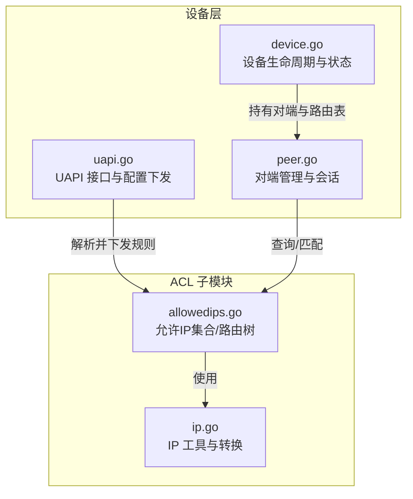
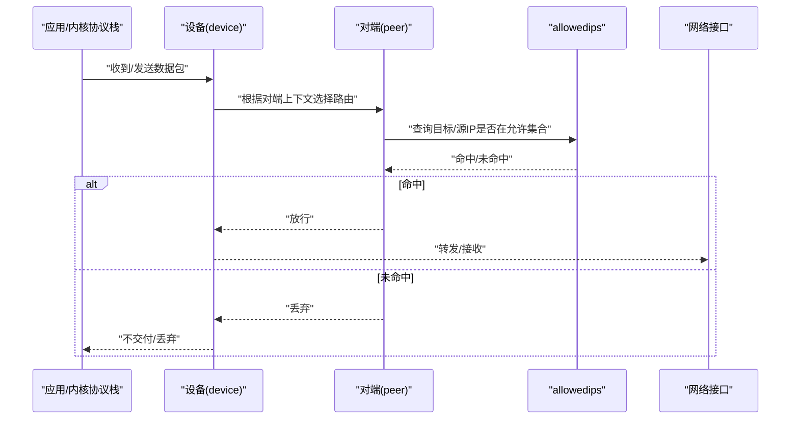
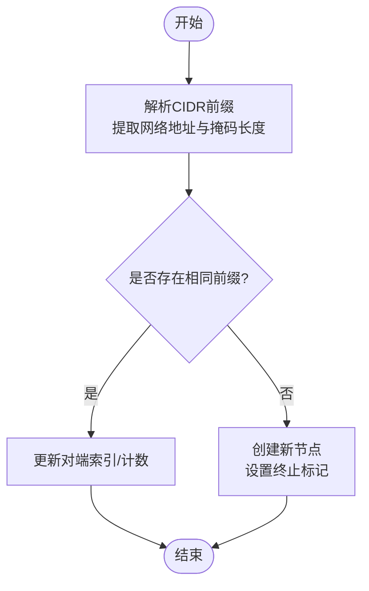
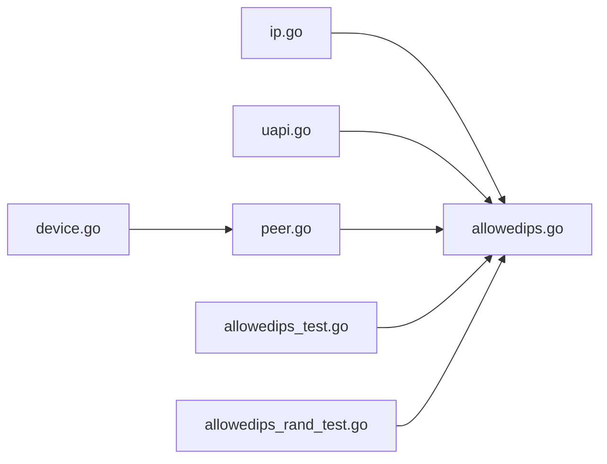

# 访问控制列表

<cite>
**本文引用的文件**
- [allowedips.go](file://device/allowedips.go)
- [allowedips_test.go](file://device/allowedips_test.go)
- [allowedips_rand_test.go](file://device/allowedips_rand_test.go)
- [device.go](file://device/device.go)
- [peer.go](file://device/peer.go)
- [uapi.go](file://device/uapi.go)
- [ip.go](file://device/ip.go)
</cite>

## 目录
1. [简介](#简介)
2. [项目结构](#项目结构)
3. [核心组件](#核心组件)
4. [架构总览](#架构总览)
5. [详细组件分析](#详细组件分析)
6. [依赖关系分析](#依赖关系分析)
7. [性能考虑](#性能考虑)
8. [故障排查指南](#故障排查指南)
9. [结论](#结论)
10. [附录](#附录)

## 简介
本文件围绕 wireguard-go 中的访问控制列表（ACL）实现，重点解析 allowedips 模块的 IP 地址匹配算法、CIDR 前缀处理与路由表优化策略；文档化 ACL 配置语法、规则优先级、IPv4/IPv6 支持情况；提供编写最佳实践、性能优化建议、动态更新与热重载机制说明，以及与设备状态管理的集成方式。文末给出常见用例与示例路径，便于快速上手与排障。

## 项目结构
ACL 相关代码集中在 device 包中，核心为 allowedips 模块，配合 peer、device、uapi 等模块完成规则的加载、匹配与生效。

图表来源
- [device.go:1-200](file://device/device.go#L1-L200)
- [peer.go:1-200](file://device/peer.go#L1-L200)
- [uapi.go:1-200](file://device/uapi.go#L1-L200)
- [allowedips.go:1-200](file://device/allowedips.go#L1-L200)
- [ip.go:1-200](file://device/ip.go#L1-L200)

章节来源
- [device.go:1-200](file://device/device.go#L1-L200)
- [peer.go:1-200](file://device/peer.go#L1-L200)
- [uapi.go:1-200](file://device/uapi.go#L1-L200)
- [allowedips.go:1-200](file://device/allowedips.go#L1-L200)
- [ip.go:1-200](file://device/ip.go#L1-L200)

## 核心组件
- allowedips：维护“允许访问的 IP/CIDR 集合”，提供插入、删除、查找与并发安全访问，内部采用高效的路由树结构以支持 O(log n) 级别的前缀匹配。
- ip：提供 IPv4/IPv6 的统一表示、比较、掩码计算与 CIDR 解析等基础能力。
- uapi：负责从外部（如 wg-quick、wg 命令或自定义客户端）接收配置，解析 AllowedIPs 字段并调用 allowedips 进行更新。
- peer/device：在数据包收发路径中，依据对端与路由表进行 ACL 判定，决定数据是否允许通过。

章节来源
- [allowedips.go:1-200](file://device/allowedips.go#L1-L200)
- [ip.go:1-200](file://device/ip.go#L1-L200)
- [uapi.go:1-200](file://device/uapi.go#L1-L200)
- [peer.go:1-200](file://device/peer.go#L1-L200)
- [device.go:1-200](file://device/device.go#L1-L200)

## 架构总览
ACL 在数据路径中的角色是“基于源/目的 IP 的白名单过滤”。典型流程如下：

图表来源
- [device.go:1-200](file://device/device.go#L1-L200)
- [peer.go:1-200](file://device/peer.go#L1-L200)
- [allowedips.go:1-200](file://device/allowedips.go#L1-L200)

## 详细组件分析

### allowedips：允许IP集合与路由树
- 数据结构
  - 采用前缀树（Trie）组织 IPv4/IPv6 的 CIDR 前缀，节点包含左右分支与“结束标记”（表示某前缀在此处终止）。
  - 每个叶子/终止节点关联一个“对端索引”，用于将匹配的 IP 映射到具体对端。
- 关键操作
  - 插入/删除：按位遍历前缀，创建或移除节点，维护计数与边界信息，保证并发安全。
  - 查找：自顶向下按位匹配，遇到终止节点即返回对应对端；若存在更具体的前缀优先匹配（最长前缀匹配）。
- 复杂度
  - 时间：插入/删除/查找均为 O(k)，k 为地址位数（IPv4=32，IPv6=128），近似常数级。
  - 空间：与 CIDR 数量线性相关，共享前缀可显著压缩内存占用。
- 并发与一致性
  - 读写分离或细粒度锁保护，确保在高吞吐下稳定。
- 路由优化
  - 合并相邻/重叠前缀以减少节点数。
  - 批量更新时延迟刷新，降低锁竞争。

图表来源
- [allowedips.go:1-200](file://device/allowedips.go#L1-L200)

章节来源
- [allowedips.go:1-200](file://device/allowedips.go#L1-L200)
- [allowedips_test.go:1-200](file://device/allowedips_test.go#L1-L200)
- [allowedips_rand_test.go:1-200](file://device/allowedips_rand_test.go#L1-L200)

### ip：IP 工具与 CIDR 解析
- 功能
  - IPv4/IPv6 统一封装、字节序转换、比较、掩码生成、CIDR 字符串解析。
  - 提供“是否为回环/私有/链路本地”等辅助判断，便于策略组合。
- 复杂度
  - 解析与运算均为 O(k)，k 为地址位数。
- 与 allowedips 的关系
  - 为 allowedips 提供统一的 IP 表示与前缀处理能力。

章节来源
- [ip.go:1-200](file://device/ip.go#L1-L200)

### uapi：配置下发与动态更新
- 职责
  - 解析 AllowedIPs 字段（支持多条目），转换为内部结构后调用 allowedips 进行增量更新。
  - 支持“替换/追加/删除”语义，确保配置原子性。
- 热重载
  - 通过 UAPI 接口提交新配置，设备在后台构建新路由表并原子切换，避免服务中断。
- 错误处理
  - 非法 CIDR、重复条目、冲突对端等会返回明确错误，便于上层重试或修正。

章节来源
- [uapi.go:1-200](file://device/uapi.go#L1-L200)

### peer/device：ACL 与设备状态集成
- 对端管理
  - 每个对端维护其允许的 IP 集合（AllowedIPs），并在数据包路径中进行匹配。
- 设备状态
  - 设备持有所有对端与全局路由表，负责在收/发路径中执行 ACL 判定。
- 与 allowedips 的协作
  - 当对端 AllowedIPs 变更时，设备触发路由表重建或增量更新，保持最新状态。

章节来源
- [peer.go:1-200](file://device/peer.go#L1-L200)
- [device.go:1-200](file://device/device.go#L1-L200)

## 依赖关系分析
- allowedips 依赖 ip 提供的 IP 表示与 CIDR 解析。
- uapi 依赖 allowedips 进行配置落地。
- peer/device 在数据路径中调用 allowedips 进行匹配。
- 测试覆盖 allowedips 的正确性与性能（含随机压力测试）。

图表来源
- [ip.go:1-200](file://device/ip.go#L1-L200)
- [allowedips.go:1-200](file://device/allowedips.go#L1-L200)
- [uapi.go:1-200](file://device/uapi.go#L1-L200)
- [peer.go:1-200](file://device/peer.go#L1-L200)
- [device.go:1-200](file://device/device.go#L1-L200)
- [allowedips_test.go:1-200](file://device/allowedips_test.go#L1-L200)
- [allowedips_rand_test.go:1-200](file://device/allowedips_rand_test.go#L1-L200)

章节来源
- [allowedips.go:1-200](file://device/allowedips.go#L1-L200)
- [ip.go:1-200](file://device/ip.go#L1-L200)
- [uapi.go:1-200](file://device/uapi.go#L1-L200)
- [peer.go:1-200](file://device/peer.go#L1-L200)
- [device.go:1-200](file://device/device.go#L1-L200)

## 性能考虑
- 匹配复杂度
  - 单次匹配 O(k)，k 固定（32/128），实际接近常数时间。
- 内存占用
  - 大量 CIDR 时，尽量合并相邻/重叠前缀以减少节点数。
- 并发更新
  - 批量更新时采用延迟刷新与原子切换，减少锁竞争与服务抖动。
- 热点路径
  - 数据包路径中仅做一次查找，避免重复解析与多余拷贝。
- 监控建议
  - 统计命中率、平均深度、节点数、更新耗时，定位瓶颈。

[本节为通用性能指导，无需特定文件引用]

## 故障排查指南
- 常见问题
  - 规则不生效：检查 CIDR 格式是否正确、对端索引是否绑定成功。
  - 匹配异常：确认最长前缀匹配是否符合预期，避免重叠前缀导致误判。
  - 性能下降：检查 CIDR 数量与碎片化程度，必要时合并或精简规则。
- 定位方法
  - 通过 UAPI 查看当前路由表与对端绑定。
  - 借助测试用例思路构造最小复现场景，验证插入/删除/查找行为。
- 日志与指标
  - 记录更新失败原因（非法输入、冲突对端等）。
  - 暴露命中/未命中计数，辅助容量规划。

章节来源
- [allowedips_test.go:1-200](file://device/allowedips_test.go#L1-L200)
- [allowedips_rand_test.go:1-200](file://device/allowedips_rand_test.go#L1-L200)
- [uapi.go:1-200](file://device/uapi.go#L1-L200)

## 结论
allowedips 模块以高效的前缀树实现 ACL 路由表，提供稳定的 IPv4/IPv6 支持与 O(k) 匹配性能；结合 UAPI 的动态更新与原子切换，满足生产环境的热重载需求。通过合理的规则设计与性能调优，可在大规模对端与海量 CIDR 场景下保持稳定与高效。

[本节为总结性内容，无需特定文件引用]

## 附录

### ACL 配置语法与规则优先级
- 语法要点
  - AllowedIPs 字段支持多个条目，每个条目为 CIDR 形式（如 10.0.0.0/24、::/0）。
  - 支持 IPv4 与 IPv6 混合配置。
- 规则优先级
  - 最长前缀匹配优先：更具体的子网优先于更大范围的父网。
  - 同一前缀的多次声明应合并，避免冗余。
- 最佳实践
  - 尽量使用聚合前缀，减少规则数量。
  - 避免过度重叠与冲突，定期审计规则集。
  - 对高频流量段使用更具体的前缀以提升命中率。

章节来源
- [uapi.go:1-200](file://device/uapi.go#L1-L200)
- [allowedips.go:1-200](file://device/allowedips.go#L1-L200)

### IPv4 与 IPv6 支持
- 同时支持 IPv4 与 IPv6 地址与 CIDR。
- 统一在前缀树中按位匹配，IPv6 路径更长但复杂度仍为 O(128)。
- 建议在配置中明确区分双栈场景，避免歧义。

章节来源
- [ip.go:1-200](file://device/ip.go#L1-L200)
- [allowedips.go:1-200](file://device/allowedips.go#L1-L200)

### 动态更新与热重载
- 动态更新
  - 通过 UAPI 提交新 AllowedIPs，底层进行增量更新与原子切换。
- 热重载
  - 新路由表构建完成后一次性替换，避免半生效状态。
- 回滚策略
  - 若新配置校验失败，保持旧配置不变，并返回错误提示。

章节来源
- [uapi.go:1-200](file://device/uapi.go#L1-L200)
- [device.go:1-200](file://device/device.go#L1-L200)

### 与设备状态管理的集成
- 对端维度
  - 每个对端维护其 AllowedIPs，设备在收/发路径中按对端上下文进行 ACL 判定。
- 设备维度
  - 设备持有全局路由表，协调对端间的规则冲突与优先级。
- 状态同步
  - 配置变更后，设备同步更新对端与路由表，确保一致性与可见性。

章节来源
- [peer.go:1-200](file://device/peer.go#L1-L200)
- [device.go:1-200](file://device/device.go#L1-L200)

### 示例与常见用例
- 示例路径
  - 单元测试与随机压力测试展示了常用插入、删除、查找与并发场景。
- 常见用例
  - 单对端全通：配置 ::/0 或 0.0.0.0/0。
  - 子网隔离：为不同对端分配不同子网前缀。
  - 双栈共存：同时配置 IPv4 与 IPv6 前缀。
  - 热点优化：对高频子网使用更具体的前缀提升命中率。

章节来源
- [allowedips_test.go:1-200](file://device/allowedips_test.go#L1-L200)
- [allowedips_rand_test.go:1-200](file://device/allowedips_rand_test.go#L1-L200)