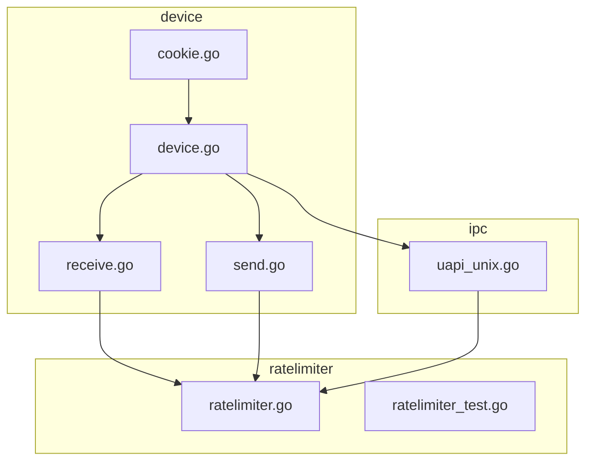
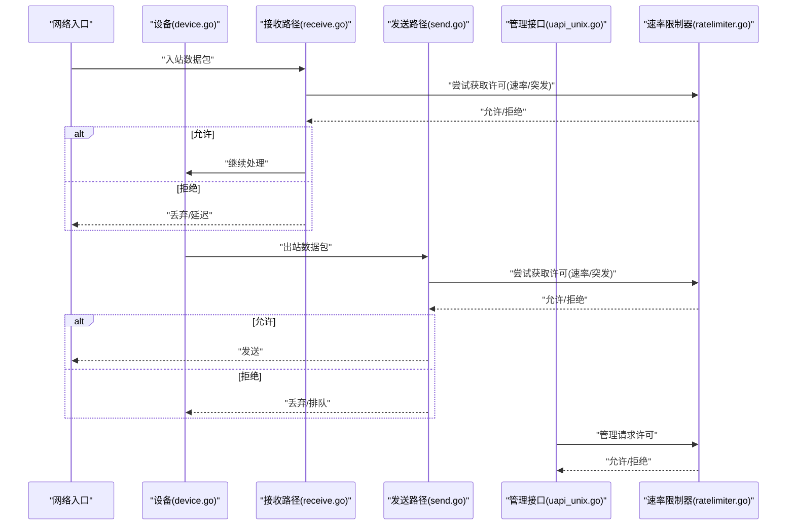
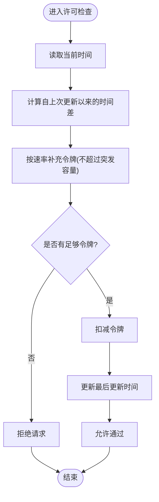
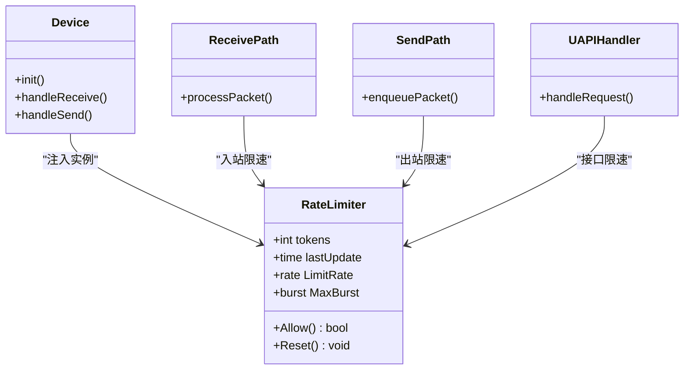
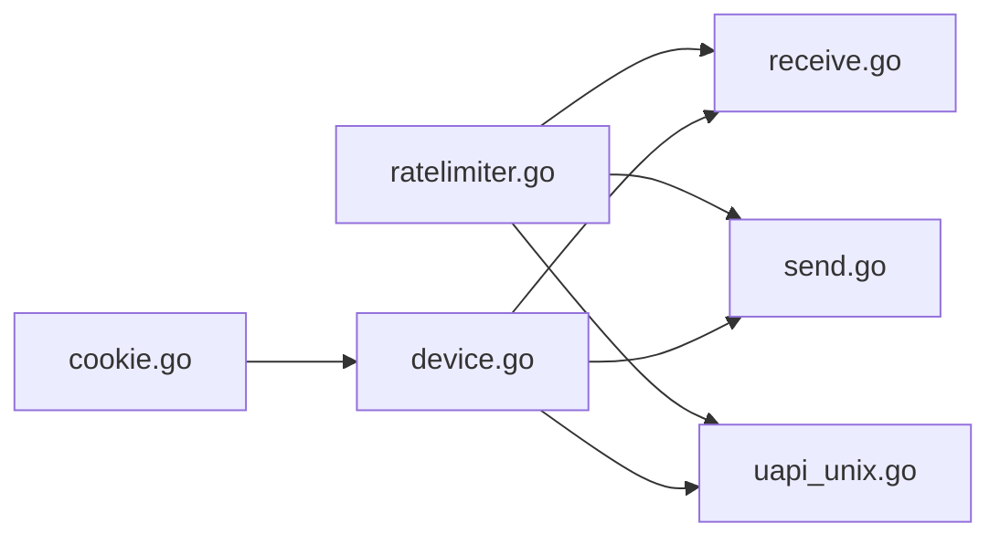

# 速率限制器

<cite>
**本文引用的文件**
- [ratelimiter.go](file://ratelimiter/ratelimiter.go)
- [ratelimiter_test.go](file://ratelimiter/ratelimiter_test.go)
- [device.go](file://device/device.go)
- [receive.go](file://device/receive.go)
- [send.go](file://device/send.go)
- [uapi_unix.go](file://ipc/uapi_unix.go)
- [cookie.go](file://device/cookie.go)
</cite>

## 目录
1. [简介](#简介)
2. [项目结构](#项目结构)
3. [核心组件](#核心组件)
4. [架构总览](#架构总览)
5. [详细组件分析](#详细组件分析)
6. [依赖关系分析](#依赖关系分析)
7. [性能考量](#性能考量)
8. [故障排查指南](#故障排查指南)
9. [结论](#结论)
10. [附录](#附录)

## 简介
本文件围绕 wireguard-go 中的 ratelimiter 包，系统性说明其实现原理、配置参数、使用场景与调优方法，并给出监控指标与告警建议，以及与 DDoS 防护的集成思路。重点覆盖：
- 令牌桶算法与滑动窗口限流的设计与权衡
- 并发控制机制（原子计数、无锁队列、超时与取消）
- 关键配置项：限制速率、突发大小、超时设置
- 典型应用场景：连接建立、数据包处理、管理接口访问
- 调优指导与基准测试要点
- 监控指标与告警配置
- 与 DDoS 防护的集成方案

## 项目结构
ratelimiter 位于仓库根目录下的 ratelimiter 子模块中，包含核心实现与单元测试；在 device 层通过接收/发送路径与管理接口进行调用，形成从网络到设备的完整限流闭环。

图表来源
- [ratelimiter.go:1-200](file://ratelimiter/ratelimiter.go#L1-L200)
- [device.go:1-200](file://device/device.go#L1-L200)
- [receive.go:1-200](file://device/receive.go#L1-L200)
- [send.go:1-200](file://device/send.go#L1-L200)
- [uapi_unix.go:1-200](file://ipc/uapi_unix.go#L1-L200)
- [cookie.go:1-200](file://device/cookie.go#L1-L200)

章节来源
- [ratelimiter.go:1-200](file://ratelimiter/ratelimiter.go#L1-L200)
- [device.go:1-200](file://device/device.go#L1-L200)
- [receive.go:1-200](file://device/receive.go#L1-L200)
- [send.go:1-200](file://device/send.go#L1-L200)
- [uapi_unix.go:1-200](file://ipc/uapi_unix.go#L1-L200)
- [cookie.go:1-200](file://device/cookie.go#L1-L200)

## 核心组件
- 速率限制器核心（ratelimiter.go）
  - 提供基于时间窗口的请求许可判定与扣减逻辑，支持按速率与突发容量进行限制。
  - 内部维护当前可用令牌数与最近一次更新时间，采用原子操作保证并发安全。
  - 暴露“尝试获取许可”的方法，返回是否允许通过以及剩余容量信息。
- 设备层接入点（device.go, receive.go, send.go）
  - 在接收路径对入站数据包进行限速，防止恶意洪泛消耗 CPU/内存。
  - 在发送路径对出站流量进行限速，避免拥塞或滥用带宽。
  - 在设备初始化时注入速率限制器实例，贯穿生命周期。
- 管理接口接入点（uapi_unix.go）
  - 对管理接口请求进行限速，防止配置变更风暴或枚举攻击。
- Cookie 机制（cookie.go）
  - 与速率限制配合，对握手/认证阶段进行额外保护，降低资源被滥用的风险。

章节来源
- [ratelimiter.go:1-200](file://ratelimiter/ratelimiter.go#L1-L200)
- [device.go:1-200](file://device/device.go#L1-L200)
- [receive.go:1-200](file://device/receive.go#L1-L200)
- [send.go:1-200](file://device/send.go#L1-L200)
- [uapi_unix.go:1-200](file://ipc/uapi_unix.go#L1-L200)
- [cookie.go:1-200](file://device/cookie.go#L1-L200)

## 架构总览
下图展示从网络入口到设备处理的限流流程，包括接收、发送与管理接口的统一限流策略。

图表来源
- [receive.go:1-200](file://device/receive.go#L1-L200)
- [send.go:1-200](file://device/send.go#L1-L200)
- [uapi_unix.go:1-200](file://ipc/uapi_unix.go#L1-L200)
- [ratelimiter.go:1-200](file://ratelimiter/ratelimiter.go#L1-L200)

## 详细组件分析

### 令牌桶与滑动窗口限流
- 令牌桶思想
  - 以固定速率向桶中添加令牌，每次请求需消费一个或多个令牌。
  - 桶容量即突发大小，超过容量的请求将被拒绝或延后。
- 滑动窗口思想
  - 将时间划分为多个小窗口，统计每个窗口内的请求数，整体不超过上限。
  - 相比固定窗口，能更平滑地削峰填谷，减少边界抖动。
- 在本实现中的结合
  - 使用原子计数器记录“当前可用令牌”，并以高精度时间戳计算“应补充的令牌”。
  - 每次请求先根据时间差补充令牌，再尝试扣减；若不足则拒绝。
  - 通过窗口化的统计与令牌补充，近似实现滑动窗口效果。

图表来源
- [ratelimiter.go:1-200](file://ratelimiter/ratelimiter.go#L1-L200)

章节来源
- [ratelimiter.go:1-200](file://ratelimiter/ratelimiter.go#L1-L200)

### 并发控制机制
- 原子操作
  - 使用原子变量维护令牌计数与时间戳，避免互斥锁带来的上下文切换开销。
- 无阻塞设计
  - 许可检查为 O(1) 操作，不阻塞线程，适合高吞吐场景。
- 超时与取消
  - 上层调用可结合超时与取消信号，避免长时间等待导致的资源占用。
- 隔离性
  - 不同维度（如每源地址、每协议、每接口）可创建独立实例，避免相互影响。

章节来源
- [ratelimiter.go:1-200](file://ratelimiter/ratelimiter.go#L1-L200)

### 配置参数
- 限制速率
  - 定义每秒允许的请求/数据包数量，决定长期平均吞吐。
- 突发大小
  - 定义桶的最大容量，允许短时峰值通过，但需考虑系统承载能力。
- 超时设置
  - 对需要等待的场景（如队列满），设置最大等待时间，超时则降级处理。
- 其他可选参数
  - 时间精度、统计采样间隔、告警阈值等，可根据部署环境调整。

章节来源
- [ratelimiter.go:1-200](file://ratelimiter/ratelimiter.go#L1-L200)

### 应用场景
- 连接建立
  - 对新建连接进行速率限制，防止 SYN Flood 或握手风暴耗尽资源。
  - 结合 cookie 机制，进一步验证客户端真实性。
- 数据包处理
  - 在接收路径对入站包进行限速，丢弃超额包，保护内核与用户态处理栈。
  - 在发送路径对出站包进行限速，避免拥塞和带宽滥用。
- 管理接口访问
  - 对配置变更、状态查询等接口进行限速，防止误用或恶意探测。

章节来源
- [device.go:1-200](file://device/device.go#L1-L200)
- [receive.go:1-200](file://device/receive.go#L1-L200)
- [send.go:1-200](file://device/send.go#L1-L200)
- [uapi_unix.go:1-200](file://ipc/uapi_unix.go#L1-L200)
- [cookie.go:1-200](file://device/cookie.go#L1-L200)

### 类图（概念映射）

图表来源
- [device.go:1-200](file://device/device.go#L1-L200)
- [receive.go:1-200](file://device/receive.go#L1-L200)
- [send.go:1-200](file://device/send.go#L1-L200)
- [uapi_unix.go:1-200](file://ipc/uapi_unix.go#L1-L200)
- [ratelimiter.go:1-200](file://ratelimiter/ratelimiter.go#L1-L200)

## 依赖关系分析
- 模块内依赖
  - ratelimiter 提供基础限流能力，被 device、receive、send、uapi 等多处复用。
- 外部依赖
  - 高精度时间源用于令牌补充计算。
  - 原子操作库用于并发安全。
- 耦合与内聚
  - ratelimiter 保持低耦合，仅暴露最小接口；各调用方按需配置实例，提升内聚性。
- 循环依赖
  - 通过分层设计避免循环依赖，ratelimiter 不反向依赖调用方。

图表来源
- [ratelimiter.go:1-200](file://ratelimiter/ratelimiter.go#L1-L200)
- [device.go:1-200](file://device/device.go#L1-L200)
- [receive.go:1-200](file://device/receive.go#L1-L200)
- [send.go:1-200](file://device/send.go#L1-L200)
- [uapi_unix.go:1-200](file://ipc/uapi_unix.go#L1-L200)
- [cookie.go:1-200](file://device/cookie.go#L1-L200)

章节来源
- [ratelimiter.go:1-200](file://ratelimiter/ratelimiter.go#L1-L200)
- [device.go:1-200](file://device/device.go#L1-L200)
- [receive.go:1-200](file://device/receive.go#L1-L200)
- [send.go:1-200](file://device/send.go#L1-L200)
- [uapi_unix.go:1-200](file://ipc/uapi_unix.go#L1-L200)
- [cookie.go:1-200](file://device/cookie.go#L1-L200)

## 性能考量
- 时间复杂度
  - 许可检查为 O(1)，适合高吞吐场景。
- 空间复杂度
  - 仅维护少量原子变量，内存占用极低。
- 并发特性
  - 无锁设计减少争用，提高多核利用率。
- 调优建议
  - 合理设置突发大小，避免瞬时峰值导致丢包过多。
  - 根据业务特征调整速率，平衡用户体验与系统稳定性。
  - 在高负载下优先保证关键路径（如握手）的可用性。
- 基准测试要点
  - 测量不同速率/突发下的吞吐与时延分布。
  - 评估在不同并发度下的 CPU 使用率与内存增长。
  - 对比开启/关闭限流时的丢包率与重传率。

章节来源
- [ratelimiter.go:1-200](file://ratelimiter/ratelimiter.go#L1-L200)
- [ratelimiter_test.go:1-200](file://ratelimiter/ratelimiter_test.go#L1-L200)

## 故障排查指南
- 常见问题
  - 频繁拒绝：检查速率与突发设置是否过低，或是否存在异常流量。
  - 时延升高：检查队列长度与超时设置，必要时增加缓冲或放宽限制。
  - 资源泄漏：确认未使用的限流实例已释放，避免持有过多状态。
- 诊断步骤
  - 采集指标：查看拒绝次数、平均时延、CPU/内存使用。
  - 定位热点：通过堆栈与火焰图定位瓶颈函数。
  - 复现实验：在测试环境模拟相同负载，逐步调整参数。
- 日志与追踪
  - 记录关键事件（如超限、超时、重置）。
  - 使用分布式追踪关联跨模块调用链。

章节来源
- [ratelimiter.go:1-200](file://ratelimiter/ratelimiter.go#L1-L200)
- [device.go:1-200](file://device/device.go#L1-L200)
- [receive.go:1-200](file://device/receive.go#L1-L200)
- [send.go:1-200](file://device/send.go#L1-L200)
- [uapi_unix.go:1-200](file://ipc/uapi_unix.go#L1-L200)

## 结论
ratelimiter 通过令牌桶与滑动窗口的结合，提供了高效、可扩展的速率限制能力。其在接收、发送与管理接口中的统一应用，有效提升了系统的鲁棒性与安全性。通过合理的配置与监控，可在保障用户体验的同时抵御恶意流量与资源滥用。

## 附录

### 监控指标与告警配置
- 关键指标
  - 请求总量、允许量、拒绝量、拒绝率
  - 平均/分位时延、队列长度、超时次数
  - CPU/内存使用、GC 频率
- 告警规则
  - 拒绝率超过阈值（如 >5%）持续一定时间
  - 时延 P99 超过阈值（如 >10ms）
  - CPU 使用率突增且伴随高拒绝率
- 可视化
  - 仪表盘展示实时吞吐与时延曲线
  - 告警面板聚合多维度指标，便于快速定位问题

[本节为通用指导，不直接分析具体文件]

### 与 DDoS 防护的集成方案
- 多层限流
  - 边缘网关：IP/端口级限速，拦截大规模洪泛。
  - 应用层：会话/请求级限速，保护后端资源。
  - 设备层：ratelimiter 作为最后一道防线，确保稳定运行。
- 动态调整
  - 根据流量特征自动调整速率与突发，适应攻击变化。
  - 结合威胁情报与行为分析，动态封禁恶意源。
- 协同策略
  - 与防火墙、WAF、CDN 联动，形成纵深防御。
  - 上报指标至 SIEM/SOAR，自动化响应。

[本节为通用指导，不直接分析具体文件]