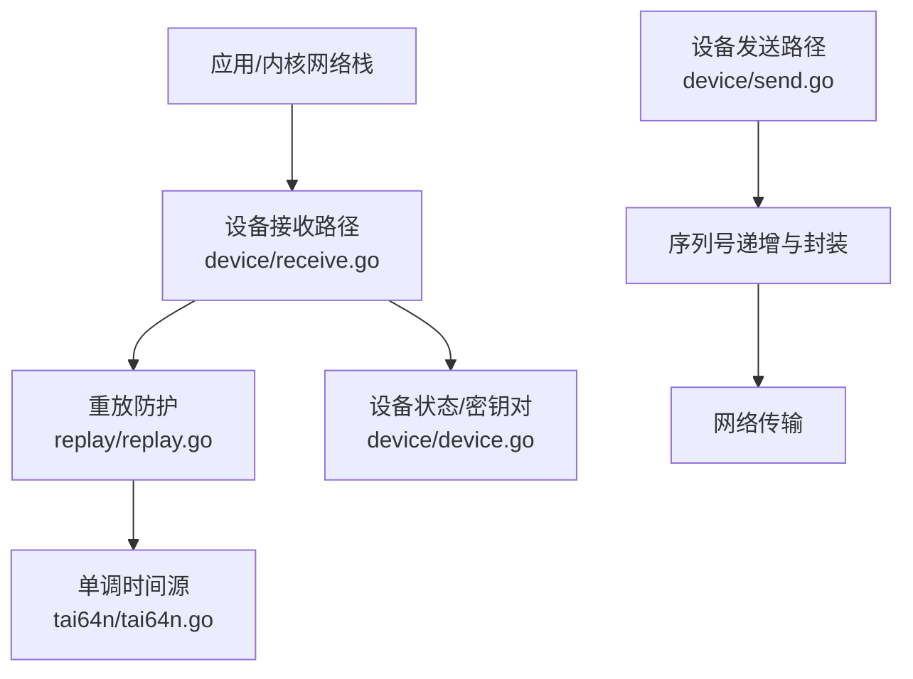
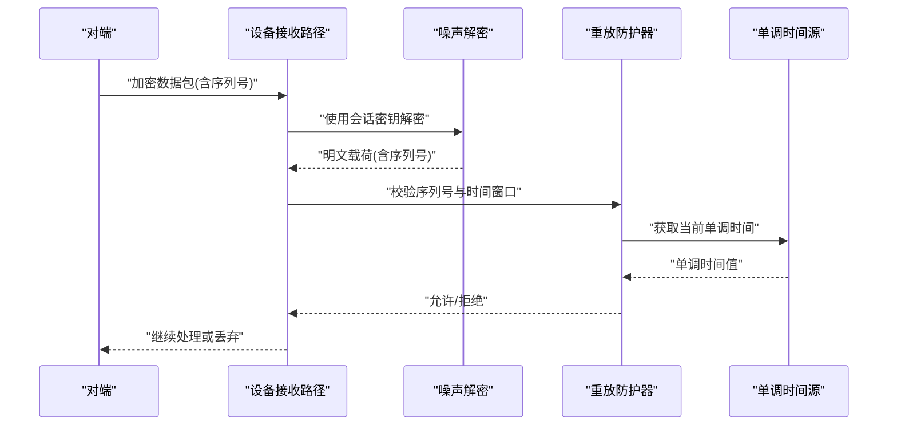
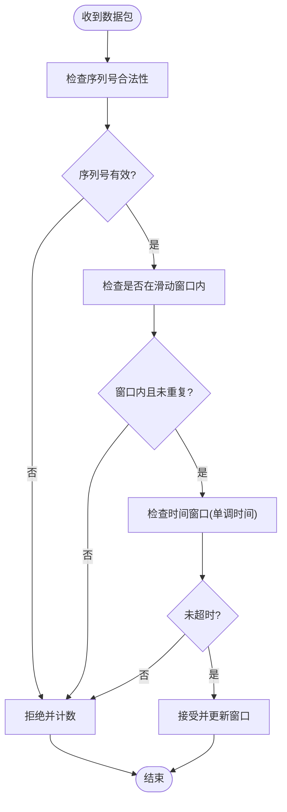
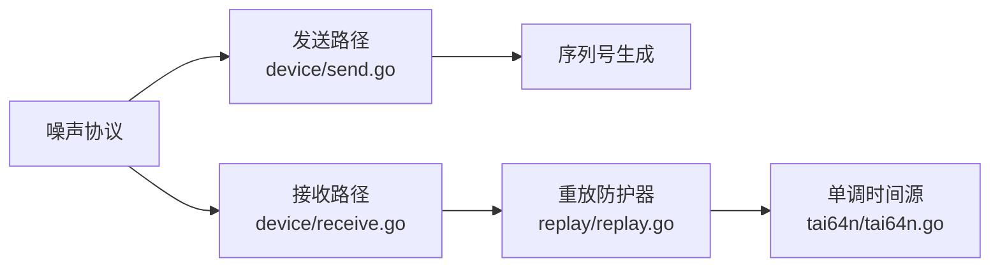

# 重放攻击防护

<cite>
**本文引用的文件**
- [replay.go](file://replay/replay.go)
- [replay_test.go](file://replay/replay_test.go)
- [tai64n.go](file://tai64n/tai64n.go)
- [device.go](file://device/device.go)
- [receive.go](file://device/receive.go)
- [send.go](file://device/send.go)
- [constants.go](file://device/constants.go)
</cite>

## 目录
1. [简介](#简介)
2. [项目结构](#项目结构)
3. [核心组件](#核心组件)
4. [架构总览](#架构总览)
5. [详细组件分析](#详细组件分析)
6. [依赖关系分析](#依赖关系分析)
7. [性能考量](#性能考量)
8. [故障排除指南](#故障排除指南)
9. [结论](#结论)
10. [附录](#附录)

## 简介
本文件聚焦WireGuard中的重放攻击防护机制，围绕“基于时间戳与序列号”的防御策略进行系统化说明。内容涵盖：
- 重放攻击的基本原理与威胁模型
- WireGuard中重放防护的核心思想（时间窗口、单调时间、序列号）
- replay包的数据包序列号验证、时间窗口检查与重复检测算法
- 配置参数与性能影响
- 重放攻击的检测与响应策略
- 测试方法与故障排除
- 与其他安全组件（噪声协议、设备层收发流程）的协作关系

## 项目结构
与重放防护直接相关的代码主要位于以下模块：
- replay：实现数据包序列号去重与滑动窗口管理
- tai64n：提供单调时间源，用于时间窗口判断
- device：在接收路径中调用replay进行校验，并在发送路径中维护序列号
- constants：定义与重放防护相关的常量（如窗口大小等）

图表来源
- [receive.go:1-200](file://device/receive.go#L1-L200)
- [replay.go:1-200](file://replay/replay.go#L1-L200)
- [tai64n.go:1-200](file://tai64n/tai64n.go#L1-L200)
- [send.go:1-200](file://device/send.go#L1-L200)
- [device.go:1-200](file://device/device.go#L1-L200)

章节来源
- [replay.go:1-200](file://replay/replay.go#L1-L200)
- [tai64n.go:1-200](file://tai64n/tai64n.go#L1-L200)
- [receive.go:1-200](file://device/receive.go#L1-L200)
- [send.go:1-200](file://device/send.go#L1-L200)
- [device.go:1-200](file://device/device.go#L1-L200)
- [constants.go:1-200](file://device/constants.go#L1-L200)

## 核心组件
- 重放防护器（Replay Detector）：维护一个固定大小的滑动窗口，记录最近接收到的数据包序列号，防止重复或乱序重放。
- 单调时间源（TAI64N）：提供不可回拨的单调时钟，用于判断数据包是否超出时间窗口。
- 设备收发路径集成：接收路径在解密后调用重放防护器校验；发送路径为每个数据包分配单调递增的序列号。

章节来源
- [replay.go:1-200](file://replay/replay.go#L1-L200)
- [tai64n.go:1-200](file://tai64n/tai64n.go#L1-L200)
- [receive.go:1-200](file://device/receive.go#L1-L200)
- [send.go:1-200](file://device/send.go#L1-L200)

## 架构总览
WireGuard的重放防护采用“序列号+时间窗口”的双重机制：
- 序列号：每个数据包携带唯一且单调递增的序号，接收端通过滑动窗口去重。
- 时间窗口：使用单调时间源限制可接受的时间范围，避免历史包被重用。
- 设备层集成：在噪声层解密之后、上层处理之前执行重放校验，确保只有合法新包进入业务逻辑。

图表来源
- [receive.go:1-200](file://device/receive.go#L1-L200)
- [replay.go:1-200](file://replay/replay.go#L1-L200)
- [tai64n.go:1-200](file://tai64n/tai64n.go#L1-L200)

## 详细组件分析

### 重放防护器（replay包）
- 功能职责
  - 维护固定大小的滑动窗口，记录已接收的序列号集合
  - 校验新包的序列号是否落在窗口内且未重复
  - 结合单调时间源判断数据包是否过期
- 关键数据结构
  - 位图/集合：高效存储窗口内的序列号，支持快速重复检测
  - 窗口指针：跟踪窗口起始位置，随新包推进
- 复杂度分析
  - 插入与查询：近似O(1)（位图操作）
  - 空间：与窗口大小成正比
- 错误处理
  - 序列号过小或过大：视为潜在重放或异常，直接拒绝
  - 时间越界：拒绝处理，避免历史包重用
- 优化机会
  - 位图分片与批量更新，减少锁竞争
  - 预分配内存，降低GC压力

图表来源
- [replay.go:1-200](file://replay/replay.go#L1-L200)
- [tai64n.go:1-200](file://tai64n/tai64n.go#L1-L200)

章节来源
- [replay.go:1-200](file://replay/replay.go#L1-L200)
- [tai64n.go:1-200](file://tai64n/tai64n.go#L1-L200)

### 单调时间源（tai64n包）
- 功能职责
  - 提供单调递增、不可回拨的时间源，用于时间窗口判断
- 设计要点
  - 避免系统时钟调整导致的安全问题
  - 高精度与低开销
- 与重放防护的关系
  - 作为时间窗口的基准，决定数据包的可接受范围

章节来源
- [tai64n.go:1-200](file://tai64n/tai64n.go#L1-L200)

### 设备层集成（receive/send）
- 接收路径
  - 在噪声层解密后，将序列号交给重放防护器校验
  - 校验失败则丢弃并统计
- 发送路径
  - 为每个数据包分配单调递增的序列号
  - 序列号与时间戳嵌入到载荷中，供对端校验
- 与密钥对/会话管理
  - 重放防护与密钥轮换配合，避免跨会话重用序列号

章节来源
- [receive.go:1-200](file://device/receive.go#L1-L200)
- [send.go:1-200](file://device/send.go#L1-L200)
- [device.go:1-200](file://device/device.go#L1-L200)

### 配置参数与性能影响
- 窗口大小
  - 影响重复检测能力与内存占用
  - 较大窗口提升抗丢包能力，但增加内存与扫描成本
- 时间窗口长度
  - 平衡延迟容忍与重放风险
  - 过长可能放宽重放窗口，过短可能误判正常延迟
- 性能影响
  - 位图操作接近常数时间，整体开销较低
  - 在高吞吐场景下注意内存分配与锁粒度

章节来源
- [constants.go:1-200](file://device/constants.go#L1-L200)
- [replay.go:1-200](file://replay/replay.go#L1-L200)

## 依赖关系分析
- 组件耦合
  - 设备层依赖replay进行校验，replay依赖tai64n提供单调时间
  - 发送路径与接收路径通过序列号约定协同工作
- 外部依赖
  - 单调时间源需保证不可回拨
  - 噪声协议负责加解密与会话管理
- 循环依赖
  - 无直接循环依赖，职责清晰分层

图表来源
- [send.go:1-200](file://device/send.go#L1-L200)
- [receive.go:1-200](file://device/receive.go#L1-L200)
- [replay.go:1-200](file://replay/replay.go#L1-L200)
- [tai64n.go:1-200](file://tai64n/tai64n.go#L1-L200)

章节来源
- [send.go:1-200](file://device/send.go#L1-L200)
- [receive.go:1-200](file://device/receive.go#L1-L200)
- [replay.go:1-200](file://replay/replay.go#L1-L200)
- [tai64n.go:1-200](file://tai64n/tai64n.go#L1-L200)

## 性能考量
- 时间复杂度
  - 序列号去重与窗口推进近似O(1)
- 空间复杂度
  - 与窗口大小线性相关，需权衡内存与安全性
- 高吞吐优化
  - 批量化更新窗口位图
  - 减少锁竞争与内存分配
- 监控指标
  - 拒绝率、窗口利用率、时间越界比例

[本节为通用性能指导，不直接分析具体文件]

## 故障排除指南
- 常见问题
  - 大量拒绝：检查网络抖动、窗口大小是否过小
  - 时间越界：确认单调时间源可用性与系统时间设置
  - 序列号异常：检查发送端序列号生成逻辑与对端接收端对齐
- 诊断步骤
  - 启用日志与计数器，观察拒绝原因分布
  - 逐步调整窗口大小与时间窗口长度，评估影响
  - 复现重放场景，验证防护有效性
- 恢复策略
  - 重置会话与密钥对，避免跨会话污染
  - 临时放宽窗口以恢复服务，随后收紧策略

章节来源
- [replay_test.go:1-200](file://replay/replay_test.go#L1-L200)
- [replay.go:1-200](file://replay/replay.go#L1-L200)

## 结论
WireGuard通过“序列号+单调时间”的组合机制，构建了高效且健壮的重放攻击防护。replay包提供核心的滑动窗口与重复检测，tai64n提供可靠的单调时间源，设备层在收发路径中紧密集成，确保安全与性能的平衡。合理配置窗口大小与时间窗口长度，并结合监控与测试，可有效抵御重放攻击并维持高吞吐通信。

[本节为总结性内容，不直接分析具体文件]

## 附录

### 重放攻击检测与响应策略
- 检测
  - 序列号重复或越界：立即拒绝并记录
  - 时间越界：拒绝并上报
- 响应
  - 统计与告警：累计拒绝次数，触发阈值告警
  - 动态调整：根据网络状况微调窗口参数
  - 会话重置：在异常持续时重置会话与密钥

章节来源
- [replay.go:1-200](file://replay/replay.go#L1-L200)
- [receive.go:1-200](file://device/receive.go#L1-L200)

### 测试方法
- 单元测试
  - 覆盖窗口边界、重复序列号、时间越界等场景
- 集成测试
  - 模拟高延迟与丢包，验证窗口与时间窗口效果
  - 注入重放包，验证拒绝行为
- 性能测试
  - 高吞吐下的CPU与内存占用，窗口更新延迟

章节来源
- [replay_test.go:1-200](file://replay/replay_test.go#L1-L200)

### 与其他安全组件的协作
- 噪声协议
  - 负责加解密与会话建立，重放防护在其之后执行
- 密钥轮换
  - 每次会话切换重置重放状态，避免跨会话重用
- 访问控制
  - 与允许的IP列表、Cookie校验等组合，形成纵深防御

章节来源
- [device.go:1-200](file://device/device.go#L1-L200)
- [receive.go:1-200](file://device/receive.go#L1-L200)
- [send.go:1-200](file://device/send.go#L1-L200)