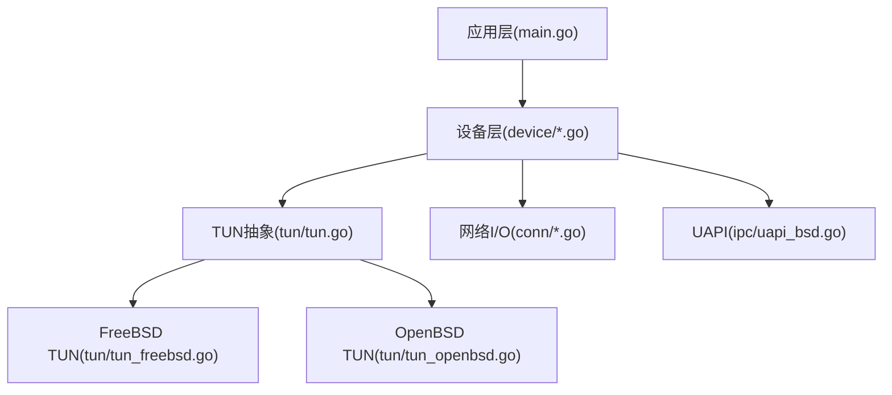
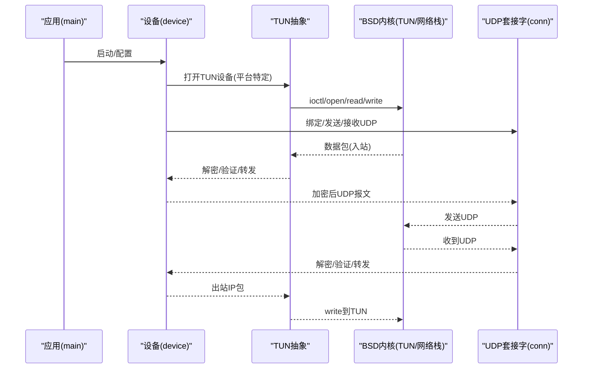
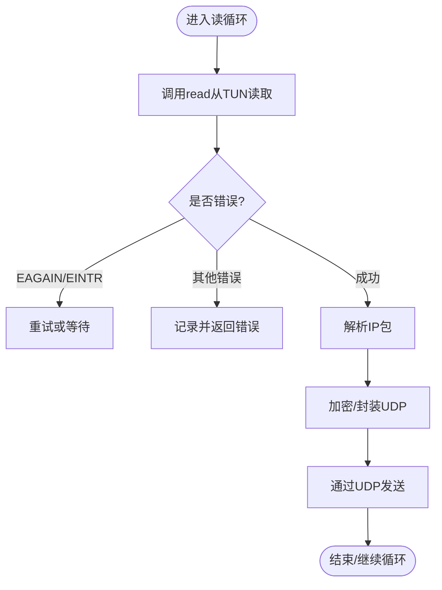
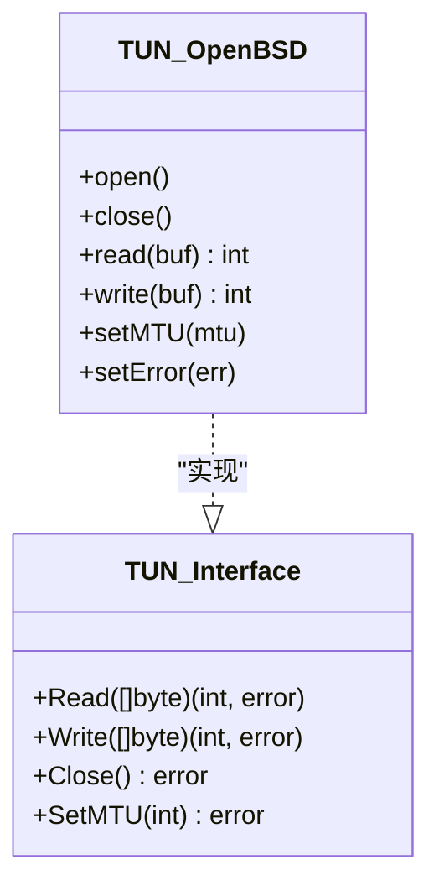
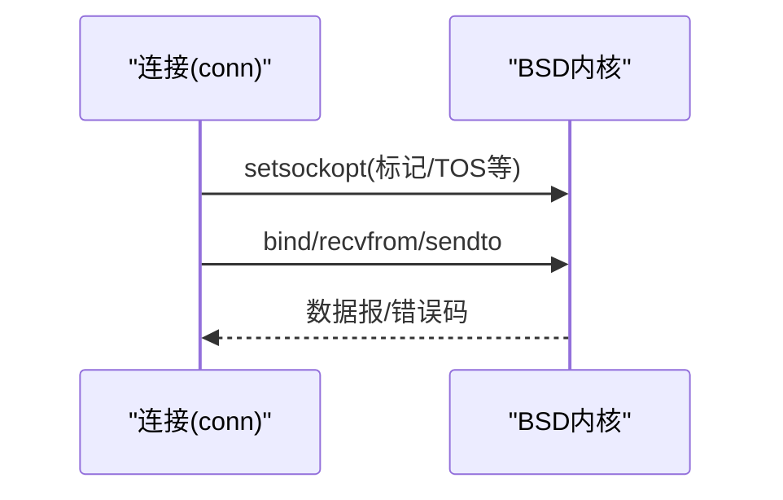
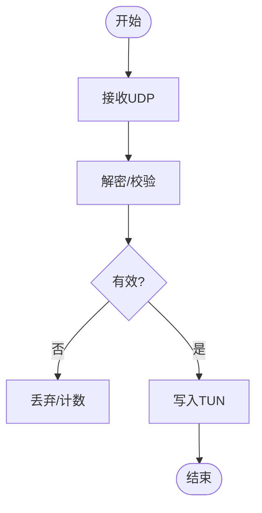
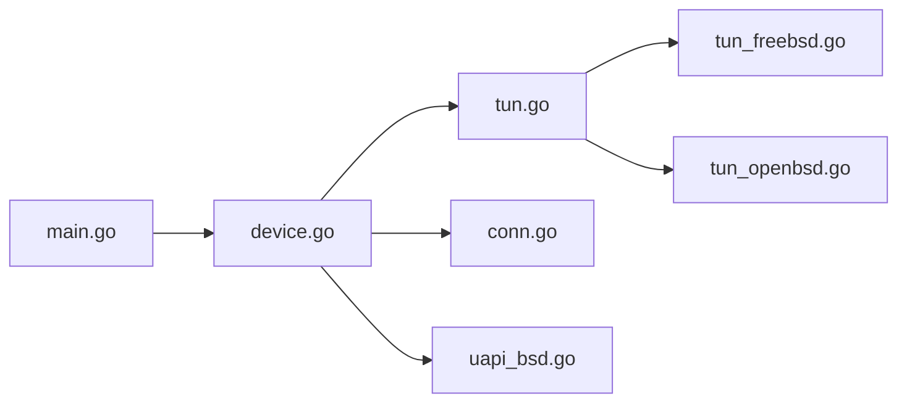

# BSD系列平台适配

<cite>
**本文引用的文件**
- [tun_freebsd.go](file://tun/tun_freebsd.go)
- [tun_openbsd.go](file://tun/tun_openbsd.go)
- [tun_linux.go](file://tun/tun_linux.go)
- [tun.go](file://tun/tun.go)
- [conn.go](file://conn/conn.go)
- [controlfns_unix.go](file://conn/controlfns_unix.go)
- [uapi_bsd.go](file://ipc/uapi_bsd.go)
- [device.go](file://device/device.go)
- [send.go](file://device/send.go)
- [receive.go](file://device/receive.go)
- [Makefile](file://Makefile)
- [main.go](file://main.go)
</cite>

## 目录
1. [简介](#简介)
2. [项目结构](#项目结构)
3. [核心组件](#核心组件)
4. [架构总览](#架构总览)
5. [详细组件分析](#详细组件分析)
6. [依赖关系分析](#依赖关系分析)
7. [性能考量](#性能考量)
8. [故障排除指南](#故障排除指南)
9. [结论](#结论)
10. [附录](#附录)

## 简介
本文件聚焦于BSD系列平台（FreeBSD、OpenBSD）在wireguard-go中的适配实现，重点说明TUN设备的实现差异与优化策略，解释BSD系统特有的网络栈集成方式与内核接口使用，文档化BSD平台的性能特性与调优参数，并阐述内存管理与并发处理的特殊考虑。同时提供编译配置与依赖要求、故障排除与性能分析指南，以及与Linux平台的差异和迁移注意事项。

## 项目结构
本项目采用按功能域划分的目录组织：
- tun：各平台TUN设备抽象与实现（含FreeBSD、OpenBSD、Linux、Darwin、Windows）
- conn：网络套接字绑定、控制函数、GSO等特性封装
- ipc：UAPI通信（BSD/Linux/Windows等平台分支）
- device：WireGuard协议核心逻辑（发送/接收、对端管理、计时器等）
- main：入口程序
- Makefile：构建脚本

图表来源
- [main.go:1-50](file://main.go#L1-L50)
- [device.go:1-120](file://device/device.go#L1-L120)
- [tun.go:1-120](file://tun/tun.go#L1-L120)
- [tun_freebsd.go:1-120](file://tun/tun_freebsd.go#L1-L120)
- [tun_openbsd.go:1-120](file://tun/tun_openbsd.go#L1-L120)
- [conn.go:1-120](file://conn/conn.go#L1-L120)
- [uapi_bsd.go:1-120](file://ipc/uapi_bsd.go#L1-L120)

章节来源
- [main.go:1-50](file://main.go#L1-L50)
- [Makefile:1-120](file://Makefile#L1-L120)

## 核心组件
- TUN抽象层：统一读写接口，屏蔽平台差异，负责包入出隧道。
- 平台TUN实现：FreeBSD/OpenBSD通过各自的内核接口创建/操作TUN设备，处理MTU、队列、错误码映射等。
- 网络I/O：基于BSD socket API的UDP收发，支持可选的GSO/标记/粘性等特性。
- UAPI：BSD分支提供用户态接口，用于配置与状态查询。
- 设备层：协议栈核心，维护对端、密钥、队列、定时器，协调TUN与网络I/O。

章节来源
- [tun.go:1-120](file://tun/tun.go#L1-L120)
- [tun_freebsd.go:1-120](file://tun/tun_freebsd.go#L1-L120)
- [tun_openbsd.go:1-120](file://tun/tun_openbsd.go#L1-L120)
- [conn.go:1-120](file://conn/conn.go#L1-L120)
- [uapi_bsd.go:1-120](file://ipc/uapi_bsd.go#L1-L120)
- [device.go:1-120](file://device/device.go#L1-L120)

## 架构总览
下图展示了BSD平台上从TUN到网络栈的数据流与控制流。

图表来源
- [device.go:1-120](file://device/device.go#L1-L120)
- [tun.go:1-120](file://tun/tun.go#L1-L120)
- [tun_freebsd.go:1-120](file://tun/tun_freebsd.go#L1-L120)
- [tun_openbsd.go:1-120](file://tun/tun_openbsd.go#L1-L120)
- [conn.go:1-120](file://conn/conn.go#L1-L120)

## 详细组件分析

### FreeBSD TUN实现
- 设备创建与配置：通过FreeBSD特定的ioctl调用创建TUN设备，设置名称、标志位、MTU等。
- 数据路径：read/write与内核TUN队列交互，注意缓冲区对齐与批量IO以减少系统调用次数。
- 错误处理：将内核错误码映射为Go error，区分EAGAIN/EINTR等可恢复错误。
- 性能要点：合理设置队列长度、避免频繁重建设备；必要时结合零拷贝或批量读写。

图表来源
- [tun_freebsd.go:1-120](file://tun/tun_freebsd.go#L1-L120)
- [device.go:1-120](file://device/device.go#L1-L120)

章节来源
- [tun_freebsd.go:1-120](file://tun/tun_freebsd.go#L1-L120)
- [device.go:1-120](file://device/device.go#L1-L120)

### OpenBSD TUN实现
- 设备创建与配置：OpenBSD使用自身ioctl族进行TUN初始化，可能涉及不同的标志位与权限模型。
- 数据路径：同样遵循read/write语义，但需注意OpenBSD的内存与队列行为差异。
- 安全与权限：OpenBSD更严格的默认权限，可能需要调整设备节点访问策略。
- 性能要点：关注内核队列深度与批处理；避免不必要的上下文切换。

图表来源
- [tun_openbsd.go:1-120](file://tun/tun_openbsd.go#L1-L120)
- [tun.go:1-120](file://tun/tun.go#L1-L120)

章节来源
- [tun_openbsd.go:1-120](file://tun/tun_openbsd.go#L1-L120)
- [tun.go:1-120](file://tun/tun.go#L1-L120)

### BSD网络栈集成与内核接口
- 套接字选项：通过BSD控制函数设置socket选项（如TOS/TTL、绑定接口等）。
- UDP收发：使用标准BSD socket API，配合非阻塞模式与epoll/kqueue事件驱动。
- 特性开关：根据平台能力启用GSO、标记、粘性路由等特性。

图表来源
- [conn.go:1-120](file://conn/conn.go#L1-L120)
- [controlfns_unix.go:1-120](file://conn/controlfns_unix.go#L1-L120)

章节来源
- [conn.go:1-120](file://conn/conn.go#L1-L120)
- [controlfns_unix.go:1-120](file://conn/controlfns_unix.go#L1-L120)

### UAPI（BSD分支）
- 提供用户态配置接口，用于添加/删除对端、查看统计信息等。
- 与Linux分支的差异在于底层IPC机制与权限模型。

章节来源
- [uapi_bsd.go:1-120](file://ipc/uapi_bsd.go#L1-L120)

### 设备层与数据路径
- 发送路径：从TUN读取IP包，加密后通过UDP发送。
- 接收路径：从UDP接收密文，解密后写入TUN。
- 队列与定时器：管理重传、心跳、超时等。

图表来源
- [receive.go:1-120](file://device/receive.go#L1-L120)
- [send.go:1-120](file://device/send.go#L1-L120)
- [tun.go:1-120](file://tun/tun.go#L1-L120)

章节来源
- [receive.go:1-120](file://device/receive.go#L1-L120)
- [send.go:1-120](file://device/send.go#L1-L120)
- [device.go:1-120](file://device/device.go#L1-L120)

## 依赖关系分析
- 平台相关源文件通过构建标签选择：FreeBSD使用tun_freebsd.go，OpenBSD使用tun_openbsd.go。
- 通用逻辑集中在tun.go、conn.go、device.go中，确保跨平台一致性。
- UAPI在BSD分支使用uapi_bsd.go，与Linux分支分离。

图表来源
- [main.go:1-50](file://main.go#L1-L50)
- [device.go:1-120](file://device/device.go#L1-L120)
- [tun.go:1-120](file://tun/tun.go#L1-L120)
- [tun_freebsd.go:1-120](file://tun/tun_freebsd.go#L1-L120)
- [tun_openbsd.go:1-120](file://tun/tun_openbsd.go#L1-L120)
- [conn.go:1-120](file://conn/conn.go#L1-L120)
- [uapi_bsd.go:1-120](file://ipc/uapi_bsd.go#L1-L120)

章节来源
- [Makefile:1-120](file://Makefile#L1-L120)
- [main.go:1-50](file://main.go#L1-L50)

## 性能考量
- 批量IO：尽量合并read/write以降低系统调用开销。
- 队列深度：根据负载调整TUN队列与内核缓冲，避免丢包与抖动。
- 零拷贝/减少复制：在可能的情况下利用内核提供的零拷贝路径。
- 事件驱动：使用kqueue/epoll等非阻塞I/O提升吞吐。
- 内存池：复用缓冲区减少GC压力。
- 平台差异：FreeBSD与OpenBSD在内核队列与内存管理上存在差异，需分别调优。

[本节为通用指导，不直接分析具体文件]

## 故障排除指南
- 权限问题：检查TUN设备节点权限与SELinux/AppArmor策略（若启用）。
- MTU不匹配：导致分片或丢包，需在TUN与应用间保持一致。
- 错误码映射：确认EAGAIN/EINTR等错误被正确处理并重试。
- 日志与调试：启用详细日志，观察发送/接收路径瓶颈。
- 工具链：使用系统工具（如netstat、dtrace/ktrace）分析网络栈行为。

章节来源
- [tun_freebsd.go:1-120](file://tun/tun_freebsd.go#L1-L120)
- [tun_openbsd.go:1-120](file://tun/tun_openbsd.go#L1-L120)
- [conn.go:1-120](file://conn/conn.go#L1-L120)

## 结论
BSD系列平台在wireguard-go中通过统一的TUN抽象与平台特定实现，实现了高效的VPN隧道。FreeBSD与OpenBSD在TUN接口、权限模型与内核行为上存在差异，需要针对性调优。结合合理的队列设置、批量IO与事件驱动，可在BSD平台上获得稳定且高性能的网络传输。

[本节为总结性内容，不直接分析具体文件]

## 附录

### 编译配置与依赖要求
- 构建目标：针对FreeBSD与OpenBSD分别构建，使用平台特定的TUN实现。
- 依赖：标准C库、BSD socket API、TUN设备支持。
- 构建命令：参考Makefile中的目标与标签。

章节来源
- [Makefile:1-120](file://Makefile#L1-L120)

### 与Linux平台的差异与迁移注意事项
- TUN接口：Linux使用tun/tap字符设备与iovec批量读写，BSD使用ioctl与read/write语义。
- 套接字选项：Linux与BSD在某些socket选项上的命名与行为不同。
- 权限模型：BSD更严格，需关注设备节点与进程权限。
- 迁移建议：优先使用抽象层接口，避免直接依赖平台细节；在测试环境验证队列与MTU设置。

章节来源
- [tun_linux.go:1-120](file://tun/tun_linux.go#L1-L120)
- [tun.go:1-120](file://tun/tun.go#L1-L120)
- [conn.go:1-120](file://conn/conn.go#L1-L120)