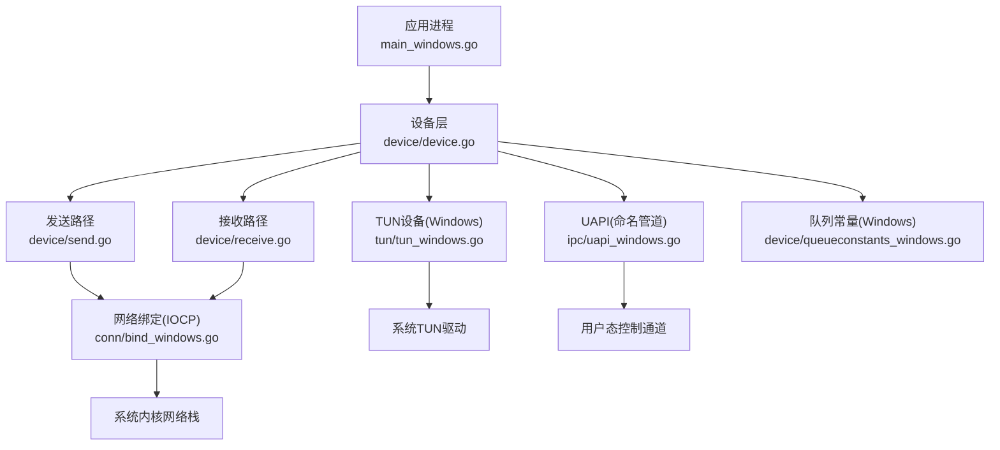
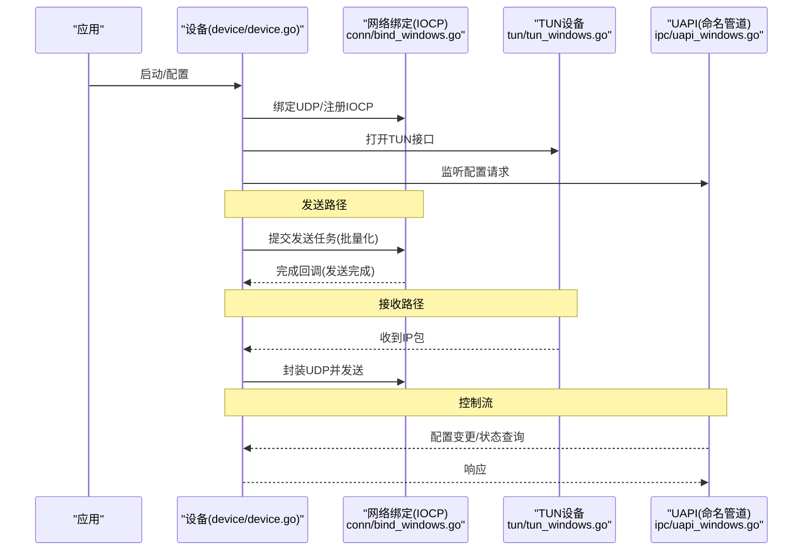
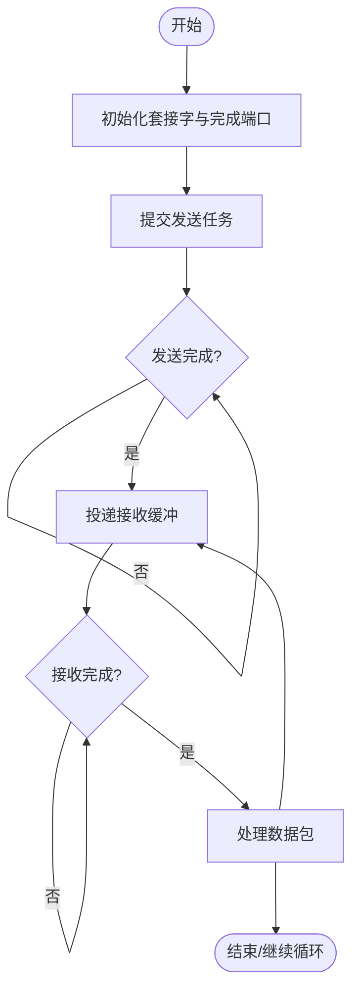
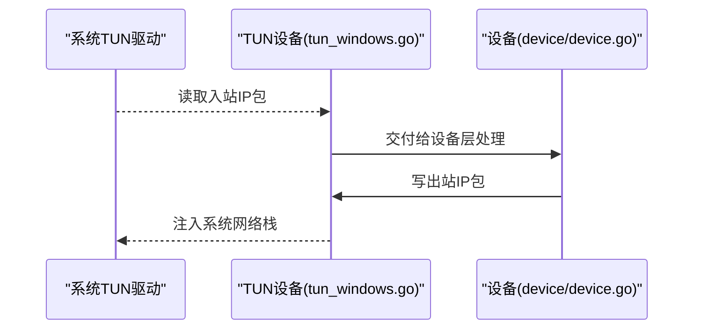
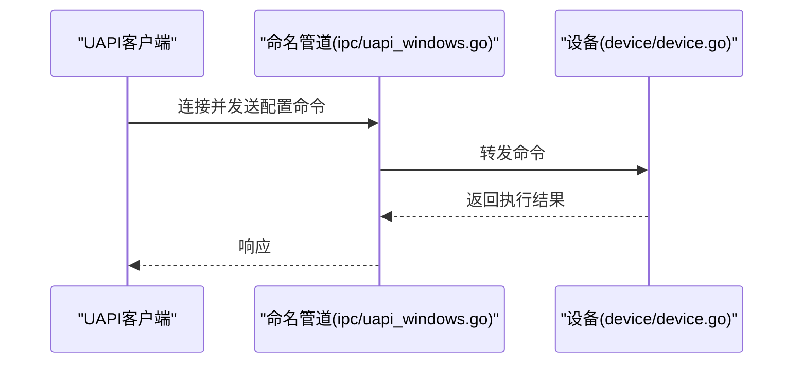
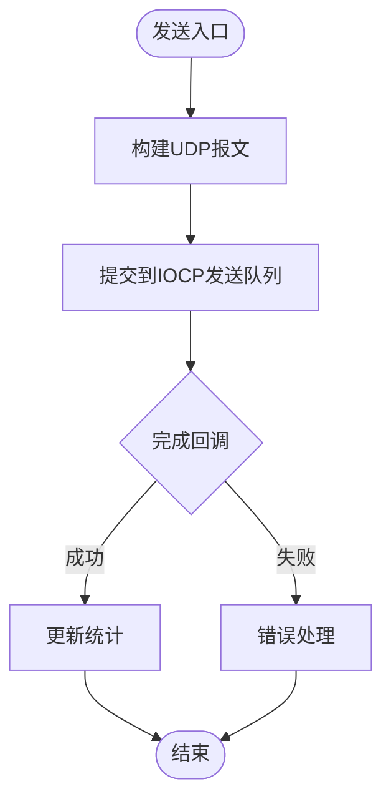
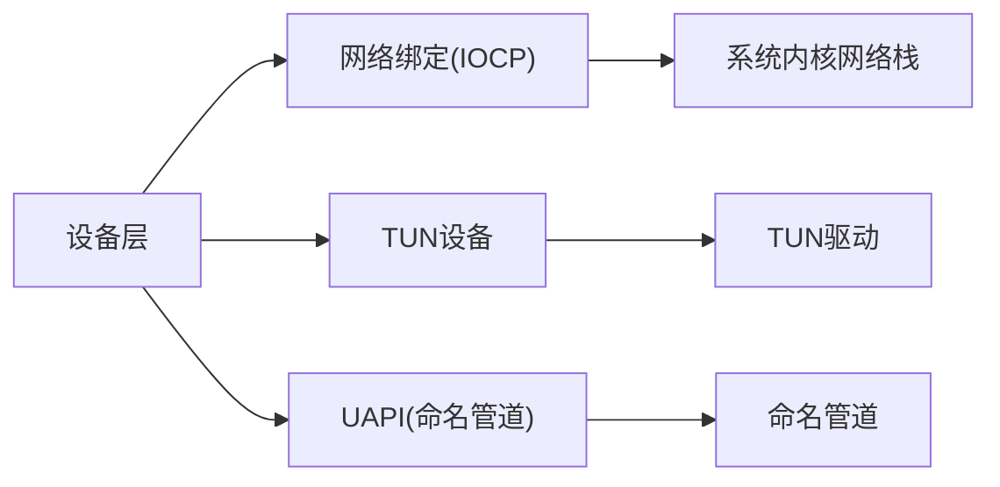

# Windows平台适配

<cite>
**本文引用的文件**
- [main_windows.go](file://main_windows.go)
- [conn/bind_windows.go](file://conn/bind_windows.go)
- [conn/controlfns_windows.go](file://conn/controlfns_windows.go)
- [device/queueconstants_windows.go](file://device/queueconstants_windows.go)
- [tun/tun_windows.go](file://tun/tun_windows.go)
- [ipc/uapi_windows.go](file://ipc/uapi_windows.go)
- [device/device.go](file://device/device.go)
- [device/uapi.go](file://device/uapi.go)
- [device/send.go](file://device/send.go)
- [device/receive.go](file://device/receive.go)
- [device/constants.go](file://device/constants.go)
- [go.mod](file://go.mod)
</cite>

## 目录
1. [简介](#简介)
2. [项目结构](#项目结构)
3. [核心组件](#核心组件)
4. [架构总览](#架构总览)
5. [详细组件分析](#详细组件分析)
6. [依赖关系分析](#依赖关系分析)
7. [性能考虑与调优](#性能考虑与调优)
8. [故障排查指南](#故障排查指南)
9. [结论](#结论)
10. [附录：部署与配置](#附录部署与配置)

## 简介
本文件面向在Windows平台上运行WireGuard Go的开发者与运维人员，系统性阐述Windows特有的异步I/O模型（IOCP）实现、TUN设备管理、UAPI接口在Windows上的特殊处理、队列常量优化、错误处理与调试技巧，以及部署与配置的最佳实践。目标是帮助读者理解并高效地在Windows上部署和调优WireGuard Go。

## 项目结构
本项目按功能分层组织，Windows相关的关键路径包括：
- 网络绑定与IOCP：conn/bind_windows.go、conn/controlfns_windows.go
- TUN设备抽象与Windows实现：tun/tun_windows.go
- UAPI在Windows上的命名管道实现：ipc/uapi_windows.go
- 队列常量与性能参数：device/queueconstants_windows.go
- 主程序入口（Windows特定）：main_windows.go
- 核心设备逻辑与收发流程：device/device.go、device/send.go、device/receive.go
- 全局常量与配置：device/constants.go
- 模块依赖：go.mod

图表来源
- [main_windows.go:1-200](file://main_windows.go#L1-L200)
- [device/device.go:1-300](file://device/device.go#L1-L300)
- [conn/bind_windows.go:1-200](file://conn/bind_windows.go#L1-L200)
- [tun/tun_windows.go:1-200](file://tun/tun_windows.go#L1-L200)
- [ipc/uapi_windows.go:1-200](file://ipc/uapi_windows.go#L1-L200)
- [device/queueconstants_windows.go:1-100](file://device/queueconstants_windows.go#L1-L100)

章节来源
- [main_windows.go:1-200](file://main_windows.go#L1-L200)
- [go.mod:1-200](file://go.mod#L1-L200)

## 核心组件
- IOCP网络绑定：基于Windows完成端口的高性能UDP套接字收发，支持批量提交与回收，减少系统调用开销。
- TUN设备：通过Windows TUN驱动创建虚拟网络接口，将IP包注入/捕获到用户态协议栈。
- UAPI接口：使用命名管道提供进程间通信，用于动态配置与状态查询。
- 队列常量：针对Windows优化的发送/接收队列大小、缓冲区池等参数，平衡吞吐与内存占用。
- 设备生命周期：初始化、监听、收发循环、对端管理与定时器。

章节来源
- [conn/bind_windows.go:1-200](file://conn/bind_windows.go#L1-L200)
- [tun/tun_windows.go:1-200](file://tun/tun_windows.go#L1-L200)
- [ipc/uapi_windows.go:1-200](file://ipc/uapi_windows.go#L1-L200)
- [device/queueconstants_windows.go:1-100](file://device/queueconstants_windows.go#L1-L100)
- [device/device.go:1-300](file://device/device.go#L1-L300)

## 架构总览
下图展示Windows平台下数据与控制流的总体架构：应用进程通过设备层协调网络与TUN，IOCP负责高性能网络I/O，UAPI通过命名管道暴露配置接口。

图表来源
- [device/device.go:1-300](file://device/device.go#L1-L300)
- [conn/bind_windows.go:1-200](file://conn/bind_windows.go#L1-L200)
- [tun/tun_windows.go:1-200](file://tun/tun_windows.go#L1-L200)
- [ipc/uapi_windows.go:1-200](file://ipc/uapi_windows.go#L1-L200)

## 详细组件分析

### IOCP网络绑定（连接绑定、控制函数与队列优化）
- 设计要点
  - 使用Windows完成端口进行异步UDP收发，避免阻塞。
  - 批量提交发送任务，降低上下文切换与系统调用成本。
  - 控制函数在Windows上提供必要的套接字选项设置（如广播、复用等）。
- 关键流程
  - 初始化：创建套接字、绑定端口、注册到完成端口。
  - 发送：构造IO操作并提交，等待完成回调。
  - 接收：预投递接收缓冲，完成后回调中处理数据包。
  - 资源回收：关闭套接字、释放缓冲池。
- 性能考量
  - 调整队列长度与缓冲区大小以匹配负载。
  - 合理设置并发度，避免过多竞争。
  - 监控完成端口队列深度与延迟。

图表来源
- [conn/bind_windows.go:1-200](file://conn/bind_windows.go#L1-L200)
- [device/queueconstants_windows.go:1-100](file://device/queueconstants_windows.go#L1-L100)

章节来源
- [conn/bind_windows.go:1-200](file://conn/bind_windows.go#L1-L200)
- [conn/controlfns_windows.go:1-200](file://conn/controlfns_windows.go#L1-L200)
- [device/queueconstants_windows.go:1-100](file://device/queueconstants_windows.go#L1-L100)

### TUN设备在Windows上的实现机制
- 设计要点
  - 通过Windows TUN驱动创建虚拟网络接口，实现二层或三层隧道。
  - 将来自系统的IP包读取到用户态，或将用户态报文注入系统网络栈。
  - 与设备层协作，完成封包/解包与路由。
- 关键流程
  - 打开TUN接口并配置属性（如MTU、名称）。
  - 启动读写循环：读取入站包、写入出站包。
  - 错误处理：驱动异常、权限问题、接口丢失等。
- 性能考量
  - 调整读/写缓冲大小与批处理策略。
  - 避免频繁创建/销毁接口，尽量复用。
  - 监控丢包率与延迟。

图表来源
- [tun/tun_windows.go:1-200](file://tun/tun_windows.go#L1-L200)
- [device/device.go:1-300](file://device/device.go#L1-L300)

章节来源
- [tun/tun_windows.go:1-200](file://tun/tun_windows.go#L1-L200)
- [device/device.go:1-300](file://device/device.go#L1-L300)

### UAPI接口在Windows平台的特殊处理
- 设计要点
  - 使用命名管道作为进程间通信通道，替代Unix域套接字。
  - 提供配置加载、状态查询、事件通知等能力。
  - 保证高可用与幂等性，支持重连与重试。
- 关键流程
  - 服务端：创建命名管道监听器，接受客户端连接。
  - 客户端：连接到命名管道，发送配置命令。
  - 设备层：解析命令并更新状态，返回结果。
- 安全与权限
  - 命名管道访问控制列表（ACL）限制访问主体。
  - 建议以最小权限原则运行服务。

图表来源
- [ipc/uapi_windows.go:1-200](file://ipc/uapi_windows.go#L1-L200)
- [device/uapi.go:1-200](file://device/uapi.go#L1-L200)

章节来源
- [ipc/uapi_windows.go:1-200](file://ipc/uapi_windows.go#L1-L200)
- [device/uapi.go:1-200](file://device/uapi.go#L1-L200)

### 队列常量与性能参数（Windows特定优化）
- 作用
  - 定义发送/接收队列长度、缓冲区数量、超时等参数。
  - 针对不同工作负载（低延迟/高吞吐）提供预设值。
- 调优建议
  - 在高吞吐场景增大队列与缓冲，减少丢弃。
  - 在低延迟场景减小队列，降低抖动。
  - 结合系统资源（CPU、内存）与实际负载逐步调优。

章节来源
- [device/queueconstants_windows.go:1-100](file://device/queueconstants_windows.go#L1-L100)
- [device/constants.go:1-200](file://device/constants.go#L1-L200)

### 发送与接收路径（与IOCP/TUN的交互）
- 发送路径
  - 设备层组装UDP报文，提交至IOCP发送队列。
  - 完成回调触发后，释放缓冲并统计指标。
- 接收路径
  - IOCP接收完成后，设备层解封装并交由TUN或上层处理。
  - 若为入站IP包，则通过TUN注入系统；否则交给加密/解密流程。

图表来源
- [device/send.go:1-200](file://device/send.go#L1-L200)
- [conn/bind_windows.go:1-200](file://conn/bind_windows.go#L1-L200)

章节来源
- [device/send.go:1-200](file://device/send.go#L1-L200)
- [device/receive.go:1-200](file://device/receive.go#L1-L200)
- [conn/bind_windows.go:1-200](file://conn/bind_windows.go#L1-L200)

## 依赖关系分析
- 模块耦合
  - 设备层依赖网络绑定与TUN设备，形成松耦合的接口。
  - UAPI独立于网络栈，仅通过设备接口进行配置。
- 外部依赖
  - Windows内核网络栈与TUN驱动。
  - 命名管道子系统。
- 潜在风险
  - 队列过大导致内存压力。
  - 命名管道权限不当导致配置失败。
  - TUN驱动版本差异影响行为。

图表来源
- [device/device.go:1-300](file://device/device.go#L1-L300)
- [conn/bind_windows.go:1-200](file://conn/bind_windows.go#L1-L200)
- [tun/tun_windows.go:1-200](file://tun/tun_windows.go#L1-L200)
- [ipc/uapi_windows.go:1-200](file://ipc/uapi_windows.go#L1-L200)

章节来源
- [device/device.go:1-300](file://device/device.go#L1-L300)
- [go.mod:1-200](file://go.mod#L1-L200)

## 性能考虑与调优
- 队列与缓冲
  - 根据负载调整发送/接收队列长度与缓冲数量。
  - 在高吞吐场景优先增大队列，在低延迟场景优先减小队列。
- IOCP并发
  - 控制并发提交与回调处理线程数，避免过度竞争。
  - 监控完成端口队列深度与平均延迟。
- TUN驱动
  - 选择稳定版本的TUN驱动，避免频繁重启接口。
  - 调整MTU与分片策略以减少开销。
- 命名管道
  - 合理设置缓冲区大小与超时，避免阻塞。
  - 使用ACL限制访问，提升安全性与稳定性。
- 监控指标
  - 发送/接收速率、丢包率、延迟分布、内存占用。
  - 使用系统工具（如性能计数器）与日志进行分析。

[本节为通用指导，不直接分析具体文件]

## 故障排查指南
- 常见问题
  - 无法绑定端口：检查防火墙、端口占用与权限。
  - TUN接口不可用：确认驱动安装与管理员权限。
  - UAPI连接失败：检查命名管道名称与ACL。
- 调试技巧
  - 启用详细日志，记录关键路径的错误码与堆栈。
  - 使用系统工具（如netstat、tcpview）观察连接状态。
  - 逐步缩小范围：先验证网络连通性，再验证TUN与UAPI。
- 恢复策略
  - 自动重试与退避，避免雪崩。
  - 优雅关闭：释放所有资源，确保无泄漏。

章节来源
- [conn/bind_windows.go:1-200](file://conn/bind_windows.go#L1-L200)
- [tun/tun_windows.go:1-200](file://tun/tun_windows.go#L1-L200)
- [ipc/uapi_windows.go:1-200](file://ipc/uapi_windows.go#L1-L200)

## 结论
Windows平台下的WireGuard Go通过IOCP实现高性能网络I/O，结合TUN设备与命名管道UAPI，提供了稳定且可扩展的VPN解决方案。通过合理的队列调优、权限配置与监控手段，可在不同负载下获得良好性能与可靠性。建议在部署前充分测试并建立完善的监控与告警体系。

[本节为总结，不直接分析具体文件]

## 附录：部署与配置
- 前置条件
  - 安装并启用Windows TUN驱动。
  - 以管理员权限运行服务，确保可创建/修改网络接口。
- 基本配置
  - 设置监听端口、对端地址与密钥。
  - 配置UAPI命名管道名称与访问控制。
- 启动流程
  - 初始化设备、绑定网络、打开TUN、启动UAPI监听。
  - 进入收发循环，处理配置变更。
- 最佳实践
  - 使用最小权限原则运行服务。
  - 定期备份配置与证书。
  - 监控关键指标并设置阈值告警。

[本节为通用指导，不直接分析具体文件]