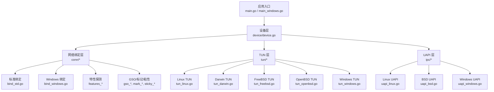
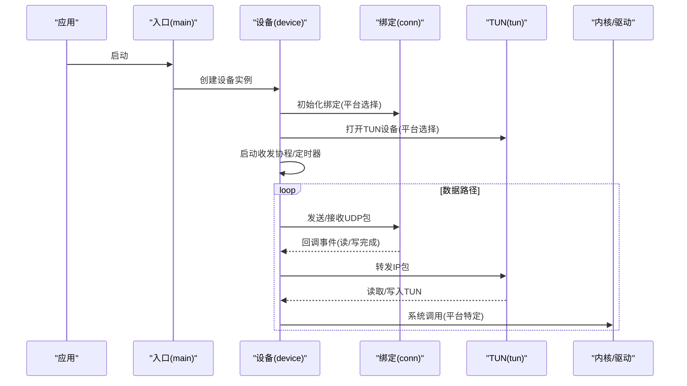
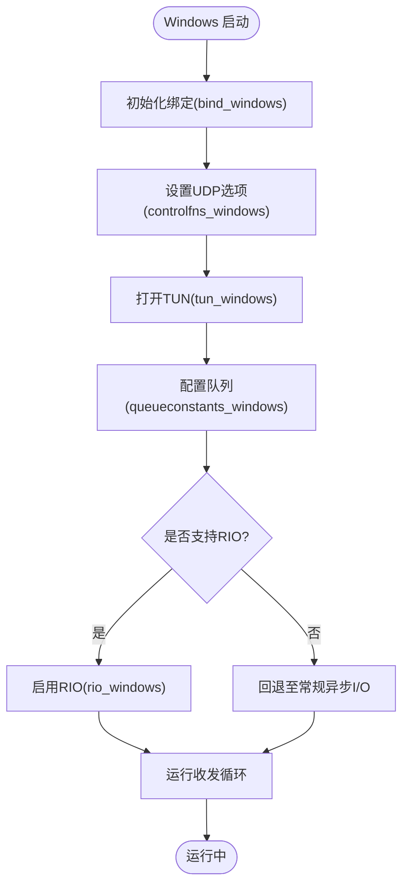
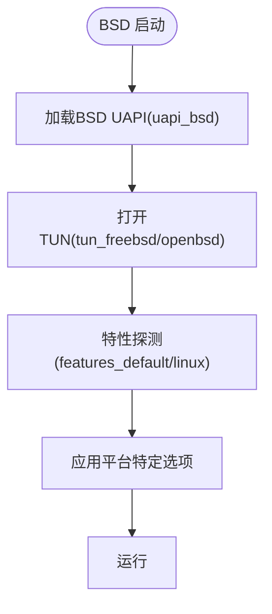
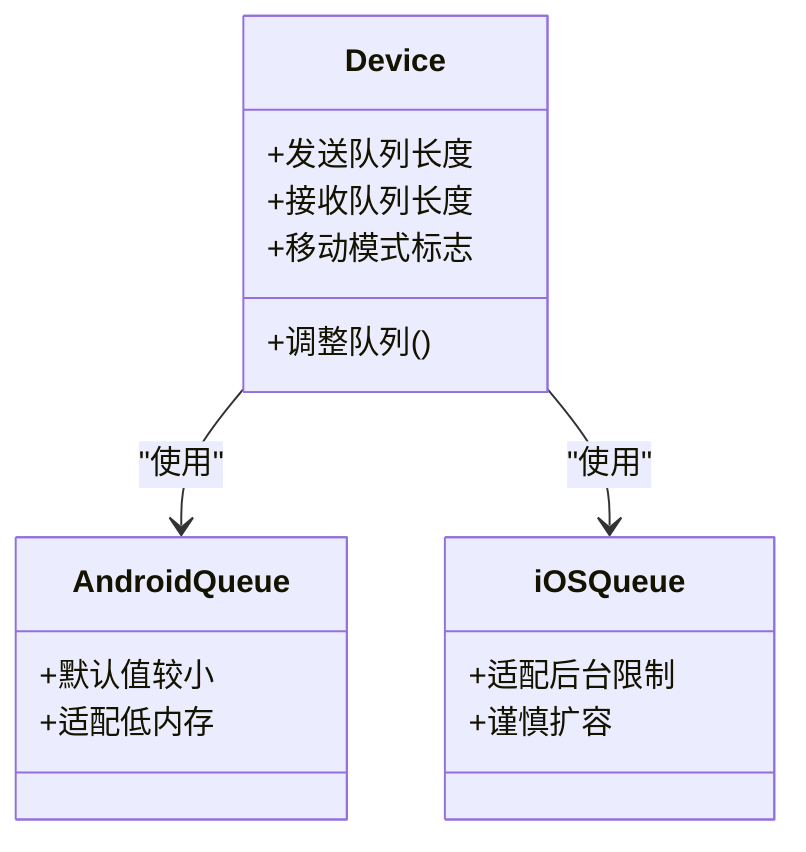
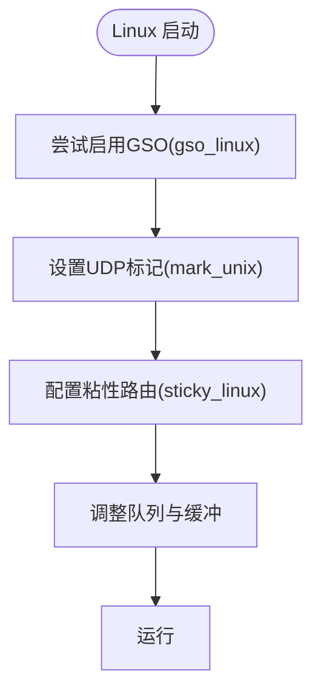
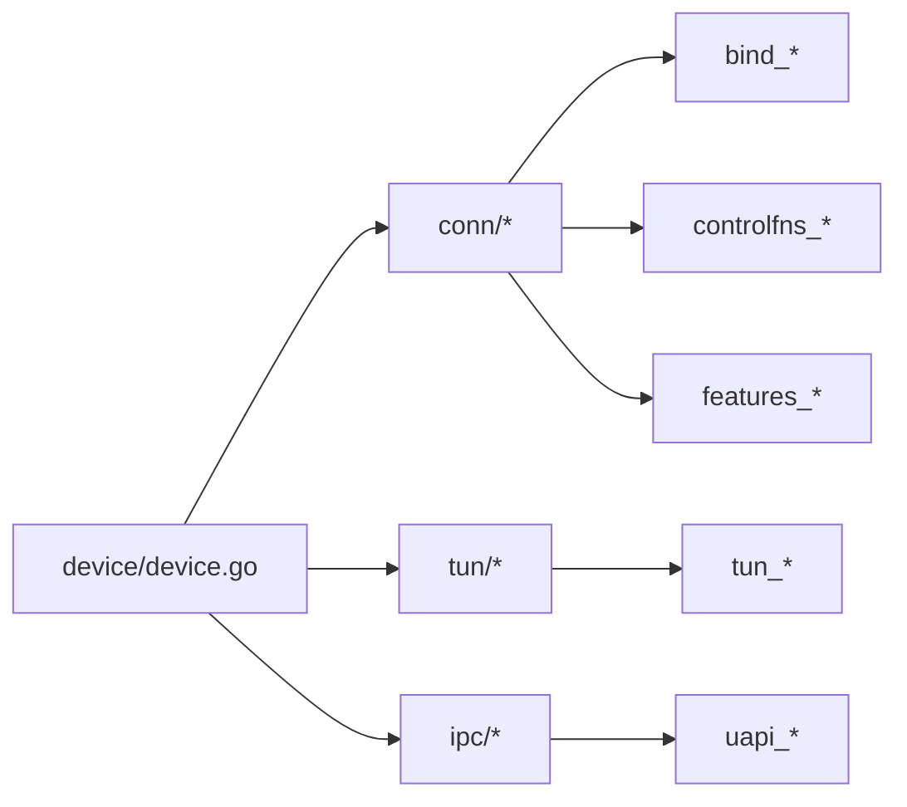

# 平台适配

<cite>
**本文引用的文件**
- [conn.go](file://conn/conn.go)
- [bind_std.go](file://conn/bind_std.go)
- [bind_windows.go](file://conn/bind_windows.go)
- [features_default.go](file://conn/features_default.go)
- [features_linux.go](file://conn/features_linux.go)
- [gso_default.go](file://conn/gso_default.go)
- [gso_linux.go](file://conn/gso_linux.go)
- [mark_unix.go](file://conn/mark_unix.go)
- [mark_default.go](file://conn/mark_default.go)
- [sticky_linux.go](file://conn/sticky_linux.go)
- [sticky_default.go](file://conn/sticky_default.go)
- [controlfns_windows.go](file://conn/controlfns_windows.go)
- [controlfns_unix.go](file://conn/controlfns_unix.go)
- [rio_windows.go](file://conn/winrio/rio_windows.go)
- [device.go](file://device/device.go)
- [queueconstants_android.go](file://device/queueconstants_android.go)
- [queueconstants_ios.go](file://device/queueconstants_ios.go)
- [queueconstants_windows.go](file://device/queueconstants_windows.go)
- [queueconstants_default.go](file://device/queueconstants_default.go)
- [mobilequirks.go](file://device/mobilequirks.go)
- [uapi_windows.go](file://ipc/uapi_windows.go)
- [uapi_bsd.go](file://ipc/uapi_bsd.go)
- [uapi_linux.go](file://ipc/uapi_linux.go)
- [tun_windows.go](file://tun/tun_windows.go)
- [tun_linux.go](file://tun/tun_linux.go)
- [tun_darwin.go](file://tun/tun_darwin.go)
- [tun_freebsd.go](file://tun/tun_freebsd.go)
- [tun_openbsd.go](file://tun/tun_openbsd.go)
- [main.go](file://main.go)
- [main_windows.go](file://main_windows.go)
</cite>

## 目录
1. [简介](#简介)
2. [项目结构](#项目结构)
3. [核心组件](#核心组件)
4. [架构总览](#架构总览)
5. [详细组件分析](#详细组件分析)
6. [依赖关系分析](#依赖关系分析)
7. [性能考虑](#性能考虑)
8. [故障排查指南](#故障排查指南)
9. [结论](#结论)
10. [附录：移植与最佳实践](#附录：移植与最佳实践)

## 简介
本文件面向跨平台开发与维护者，系统性说明 wireguard-go 在不同操作系统上的适配差异、优化策略与注意事项。重点覆盖：
- Windows 平台的特殊处理（IOCP、异步 I/O、命名管道 UAPI、队列参数调优）
- BSD 系列系统的适配方法与注意事项
- 移动平台（Android/iOS）的适配挑战与解决方案
- 平台检测与功能发现机制
- 新平台移植的开发指南
- 跨平台开发的最佳实践

## 项目结构
本项目采用“按平台分文件”的组织方式，通过 Go 构建标签将不同实现编译到同一接口中，从而在运行时自动选择对应平台实现。关键目录与职责：
- conn：网络套接字绑定、特性探测、GSO/标记/粘性路由等
- device：设备状态机、收发流程、队列常量、移动端特例
- ipc：UAPI 接口（Unix/Linux/BSD/Windows 各有一套实现）
- tun：TUN/TAP 驱动抽象（Linux/Darwin/FreeBSD/OpenBSD/Windows）
- main / main_windows：入口点与平台初始化

图表来源
- [main.go:1-200](file://main.go#L1-L200)
- [main_windows.go:1-200](file://main_windows.go#L1-L200)
- [device.go:1-200](file://device/device.go#L1-L200)
- [conn.go:1-200](file://conn/conn.go#L1-L200)
- [bind_std.go:1-200](file://conn/bind_std.go#L1-L200)
- [bind_windows.go:1-200](file://conn/bind_windows.go#L1-L200)
- [tun_linux.go:1-200](file://tun/tun_linux.go#L1-L200)
- [tun_darwin.go:1-200](file://tun/tun_darwin.go#L1-L200)
- [tun_freebsd.go:1-200](file://tun/tun_freebsd.go#L1-L200)
- [tun_openbsd.go:1-200](file://tun/tun_openbsd.go#L1-L200)
- [tun_windows.go:1-200](file://tun/tun_windows.go#L1-L200)
- [uapi_linux.go:1-200](file://ipc/uapi_linux.go#L1-L200)
- [uapi_bsd.go:1-200](file://ipc/uapi_bsd.go#L1-L200)
- [uapi_windows.go:1-200](file://ipc/uapi_windows.go#L1-L200)

章节来源
- [main.go:1-200](file://main.go#L1-L200)
- [main_windows.go:1-200](file://main_windows.go#L1-L200)
- [device.go:1-200](file://device/device.go#L1-L200)
- [conn.go:1-200](file://conn/conn.go#L1-L200)

## 核心组件
- 网络绑定层（conn）：提供统一的 Socket 绑定与收发接口，内部根据平台选择具体实现，并暴露特性探测（如 GSO、TSO、UDP 标记、粘性路由等）。
- 设备层（device）：封装 WireGuard 协议栈、对端管理、发送/接收流水线、定时器、队列大小等。
- TUN 层（tun）：抽象系统 TUN 设备读写，屏蔽 Linux/Darwin/FreeBSD/OpenBSD/Windows 的差异。
- UAPI 层（ipc）：提供配置与管理接口，Linux/BSD/Windows 分别使用 socket 或命名管道。

章节来源
- [conn.go:1-200](file://conn/conn.go#L1-L200)
- [device.go:1-200](file://device/device.go#L1-L200)
- [tun_linux.go:1-200](file://tun/tun_linux.go#L1-L200)
- [uapi_linux.go:1-200](file://ipc/uapi_linux.go#L1-L200)

## 架构总览
下图展示从应用入口到内核交互的关键路径，以及平台相关分支点。

图表来源
- [main.go:1-200](file://main.go#L1-L200)
- [main_windows.go:1-200](file://main_windows.go#L1-L200)
- [device.go:1-200](file://device/device.go#L1-L200)
- [conn.go:1-200](file://conn/conn.go#L1-L200)
- [tun_linux.go:1-200](file://tun/tun_linux.go#L1-L200)
- [tun_windows.go:1-200](file://tun/tun_windows.go#L1-L200)

## 详细组件分析

### Windows 平台适配与优化
- 绑定与异步 I/O
  - Windows 绑定使用 IOCP 风格的异步模型，提升高并发下的吞吐与延迟表现。
  - 通过平台特定的控制函数设置 UDP 选项（如广播、复用、缓冲等），以匹配 Windows 网络栈行为。
- UAPI 通信
  - 使用命名管道作为 UAPI 通道，便于与 Windows 服务/守护进程集成。
- TUN 驱动
  - 通过 Windows TUN 驱动进行 IP 包转发，注意对齐与内存拷贝路径优化。
- 队列与资源限制
  - 针对 Windows 调整发送/接收队列长度，避免拥塞与丢包。
- 可选加速
  - 若可用，启用 RIO（Receive Inline）以减少拷贝与上下文切换开销。

图表来源
- [bind_windows.go:1-200](file://conn/bind_windows.go#L1-L200)
- [controlfns_windows.go:1-200](file://conn/controlfns_windows.go#L1-L200)
- [tun_windows.go:1-200](file://tun/tun_windows.go#L1-L200)
- [queueconstants_windows.go:1-200](file://device/queueconstants_windows.go#L1-L200)
- [rio_windows.go:1-200](file://conn/winrio/rio_windows.go#L1-L200)

章节来源
- [bind_windows.go:1-200](file://conn/bind_windows.go#L1-L200)
- [controlfns_windows.go:1-200](file://conn/controlfns_windows.go#L1-L200)
- [tun_windows.go:1-200](file://tun/tun_windows.go#L1-L200)
- [queueconstants_windows.go:1-200](file://device/queueconstants_windows.go#L1-L200)
- [rio_windows.go:1-200](file://conn/winrio/rio_windows.go#L1-L200)

### BSD 系列系统适配
- UAPI 实现
  - BSD 使用 Unix Domain Socket 或类似机制实现 UAPI，注意权限与路径配置。
- TUN 与特性
  - 不同 BSD 变体（FreeBSD/OpenBSD）在 TUN 属性、校验卸载、GSO/TSO 支持上存在差异，需通过特性探测决定启用哪些优化。
- 网络栈差异
  - 某些 BSD 对 UDP 选项、多播、广播、SO_REUSEADDR 等行为有细微差异，需在绑定层做兼容处理。

图表来源
- [uapi_bsd.go:1-200](file://ipc/uapi_bsd.go#L1-L200)
- [tun_freebsd.go:1-200](file://tun/tun_freebsd.go#L1-L200)
- [tun_openbsd.go:1-200](file://tun/tun_openbsd.go#L1-L200)
- [features_default.go:1-200](file://conn/features_default.go#L1-L200)
- [features_linux.go:1-200](file://conn/features_linux.go#L1-L200)

章节来源
- [uapi_bsd.go:1-200](file://ipc/uapi_bsd.go#L1-L200)
- [tun_freebsd.go:1-200](file://tun/tun_freebsd.go#L1-L200)
- [tun_openbsd.go:1-200](file://tun/tun_openbsd.go#L1-L200)
- [features_default.go:1-200](file://conn/features_default.go#L1-L200)
- [features_linux.go:1-200](file://conn/features_linux.go#L1-L200)

### 移动平台适配（Android/iOS）
- 队列与内存约束
  - 移动平台对内存和队列长度敏感，需降低默认队列大小以避免 OOM 与抖动。
- 电源与后台限制
  - 需要处理后台任务被杀、网络切换、DNS 变化等场景，确保连接恢复与重连逻辑健壮。
- 特性降级
  - 在缺乏硬件卸载或内核特性的设备上，自动降级到通用路径，保证可用性。

图表来源
- [device.go:1-200](file://device/device.go#L1-L200)
- [queueconstants_android.go:1-200](file://device/queueconstants_android.go#L1-L200)
- [queueconstants_ios.go:1-200](file://device/queueconstants_ios.go#L1-L200)
- [mobilequirks.go:1-200](file://device/mobilequirks.go#L1-L200)

章节来源
- [queueconstants_android.go:1-200](file://device/queueconstants_android.go#L1-L200)
- [queueconstants_ios.go:1-200](file://device/queueconstants_ios.go#L1-L200)
- [mobilequirks.go:1-200](file://device/mobilequirks.go#L1-L200)

### Linux 平台特性与优化
- GSO/TSO 与零拷贝
  - 在支持的内核上启用 GSO/TSO，减少 CPU 占用与内存拷贝。
- UDP 标记与粘性路由
  - 通过 SO_MARK 实现策略路由；在移动热点/多网卡场景下保持会话稳定。
- 队列与缓冲区
  - 合理设置发送/接收队列长度，结合系统参数（如 net.core.*）调优。

图表来源
- [gso_linux.go:1-200](file://conn/gso_linux.go#L1-L200)
- [gso_default.go:1-200](file://conn/gso_default.go#L1-L200)
- [mark_unix.go:1-200](file://conn/mark_unix.go#L1-L200)
- [mark_default.go:1-200](file://conn/mark_default.go#L1-L200)
- [sticky_linux.go:1-200](file://conn/sticky_linux.go#L1-L200)
- [sticky_default.go:1-200](file://conn/sticky_default.go#L1-L200)

章节来源
- [gso_linux.go:1-200](file://conn/gso_linux.go#L1-L200)
- [gso_default.go:1-200](file://conn/gso_default.go#L1-L200)
- [mark_unix.go:1-200](file://conn/mark_unix.go#L1-L200)
- [mark_default.go:1-200](file://conn/mark_default.go#L1-L200)
- [sticky_linux.go:1-200](file://conn/sticky_linux.go#L1-L200)
- [sticky_default.go:1-200](file://conn/sticky_default.go#L1-L200)

## 依赖关系分析
- 平台选择由构建标签与运行时特性探测共同决定：
  - 构建期：Go 的 platform-specific files（如 *_windows.go、*_linux.go）决定编译产物。
  - 运行期：特性探测（features_*）动态决定是否启用 GSO/TSO、UDP 标记等。
- 模块耦合：
  - device 依赖 conn 与 tun，并通过 ipc 暴露管理接口。
  - conn 内部根据平台选择 bind_* 与 controlfns_*。
  - tun 层屏蔽各系统差异，向上提供统一读写接口。

图表来源
- [device.go:1-200](file://device/device.go#L1-L200)
- [conn.go:1-200](file://conn/conn.go#L1-L200)
- [tun_linux.go:1-200](file://tun/tun_linux.go#L1-L200)
- [uapi_linux.go:1-200](file://ipc/uapi_linux.go#L1-L200)

章节来源
- [device.go:1-200](file://device/device.go#L1-L200)
- [conn.go:1-200](file://conn/conn.go#L1-L200)

## 性能考虑
- Windows
  - 优先启用 RIO（若可用）以降低拷贝与上下文切换。
  - 调整发送/接收队列长度，避免拥塞与丢包。
  - 合理设置 UDP 选项（如广播、复用、缓冲）以提升吞吐。
- Linux
  - 启用 GSO/TSO，配合内核卸载能力降低 CPU 占用。
  - 使用 UDP 标记与粘性路由在多网卡/热点场景保持稳定。
  - 调整系统级网络缓冲与队列参数以获得更好吞吐。
- BSD
  - 依据内核版本与驱动能力，选择性启用特性；必要时回退到通用路径。
- 移动平台
  - 降低队列与内存占用，避免后台被杀；在网络切换时快速恢复。
- 通用
  - 通过特性探测动态启用/禁用优化，保证兼容性。
  - 监控丢包率、延迟、CPU 占用，结合平台参数微调。

[本节为通用指导，不直接分析具体文件]

## 故障排查指南
- 无法绑定端口或地址
  - 检查平台特定的 UDP 选项设置是否正确（Windows/BSD/Linux 行为差异）。
  - 确认权限与防火墙规则。
- 高延迟或吞吐不足
  - 检查是否启用了 GSO/TSO（Linux）、RIO（Windows）。
  - 调整队列长度与系统缓冲参数。
- 移动平台频繁断连
  - 检查后台限制与网络切换处理逻辑；适当降低队列与重试间隔。
- UAPI 不可用
  - Linux/BSD：检查 Unix Socket 路径与权限。
  - Windows：检查命名管道是否存在与访问权限。

章节来源
- [controlfns_windows.go:1-200](file://conn/controlfns_windows.go#L1-L200)
- [controlfns_unix.go:1-200](file://conn/controlfns_unix.go#L1-L200)
- [uapi_linux.go:1-200](file://ipc/uapi_linux.go#L1-L200)
- [uapi_bsd.go:1-200](file://ipc/uapi_bsd.go#L1-L200)
- [uapi_windows.go:1-200](file://ipc/uapi_windows.go#L1-L200)

## 结论
wireguard-go 通过“平台分文件 + 运行时特性探测”的方式实现了良好的跨平台兼容性与性能。Windows 侧重异步 I/O 与 RIO 优化；Linux 侧重内核卸载与标记路由；BSD 注重兼容与回退；移动平台强调资源受限下的稳定性。遵循本文档的调优建议与移植指南，可在不同平台上获得一致且高效的体验。

[本节为总结性内容，不直接分析具体文件]

## 附录：移植与最佳实践

### 平台检测与功能发现
- 构建期：利用 Go 的平台特定文件（如 *_windows.go、*_linux.go、*_android.go、*_ios.go）提供差异化实现。
- 运行期：通过 features_* 探测内核/驱动能力（如 GSO/TSO、UDP 标记、RIO），动态启用或降级。
- 建议：为新平台新增对应的 *_default.go 或 *_platform.go 文件，并在特性探测中声明支持项。

章节来源
- [features_default.go:1-200](file://conn/features_default.go#L1-L200)
- [features_linux.go:1-200](file://conn/features_linux.go#L1-L200)

### 新平台移植步骤
- 新增 TUN 实现：参考 tun_linux.go / tun_darwin.go / tun_freebsd.go / tun_openbsd.go / tun_windows.go，实现统一读写接口。
- 新增绑定实现：参考 bind_std.go / bind_windows.go，实现 Socket 绑定与选项设置。
- 新增 UAPI 实现：参考 uapi_linux.go / uapi_bsd.go / uapi_windows.go，实现配置与管理接口。
- 新增控制函数：参考 controlfns_unix.go / controlfns_windows.go，设置平台特定 UDP/TUN 选项。
- 新增队列常量：参考 queueconstants_*，根据平台资源情况设定合理的队列长度。
- 新增特性探测：在 features_* 中声明新平台支持的能力，以便上层动态启用优化。
- 测试验证：覆盖基本连通性、高负载、网络切换、后台恢复等场景。

章节来源
- [tun_linux.go:1-200](file://tun/tun_linux.go#L1-L200)
- [tun_darwin.go:1-200](file://tun/tun_darwin.go#L1-L200)
- [tun_freebsd.go:1-200](file://tun/tun_freebsd.go#L1-L200)
- [tun_openbsd.go:1-200](file://tun/tun_openbsd.go#L1-L200)
- [tun_windows.go:1-200](file://tun/tun_windows.go#L1-L200)
- [bind_std.go:1-200](file://conn/bind_std.go#L1-L200)
- [bind_windows.go:1-200](file://conn/bind_windows.go#L1-L200)
- [uapi_linux.go:1-200](file://ipc/uapi_linux.go#L1-L200)
- [uapi_bsd.go:1-200](file://ipc/uapi_bsd.go#L1-L200)
- [uapi_windows.go:1-200](file://ipc/uapi_windows.go#L1-L200)
- [controlfns_unix.go:1-200](file://conn/controlfns_unix.go#L1-L200)
- [controlfns_windows.go:1-200](file://conn/controlfns_windows.go#L1-L200)
- [queueconstants_android.go:1-200](file://device/queueconstants_android.go#L1-L200)
- [queueconstants_ios.go:1-200](file://device/queueconstants_ios.go#L1-L200)
- [queueconstants_windows.go:1-200](file://device/queueconstants_windows.go#L1-L200)
- [queueconstants_default.go:1-200](file://device/queueconstants_default.go#L1-L200)

### 跨平台最佳实践
- 始终通过接口抽象隔离平台差异，避免在业务逻辑中直接调用平台 API。
- 使用特性探测而非硬编码判断，提高可移植性与兼容性。
- 为每个平台提供最小可行实现，再逐步增强优化。
- 在移动平台保守设置队列与内存，确保稳定性优先。
- 在 Windows 平台充分利用异步 I/O 与 RIO，提升吞吐与降低延迟。
- 在 Linux 平台积极利用内核卸载能力（GSO/TSO）与策略路由（UDP 标记）。
- 在 BSD 平台关注内核版本差异，必要时回退到通用路径。
- 建立完善的回归测试与压力测试，覆盖网络切换、后台恢复、高负载场景。

[本节为通用指导，不直接分析具体文件]