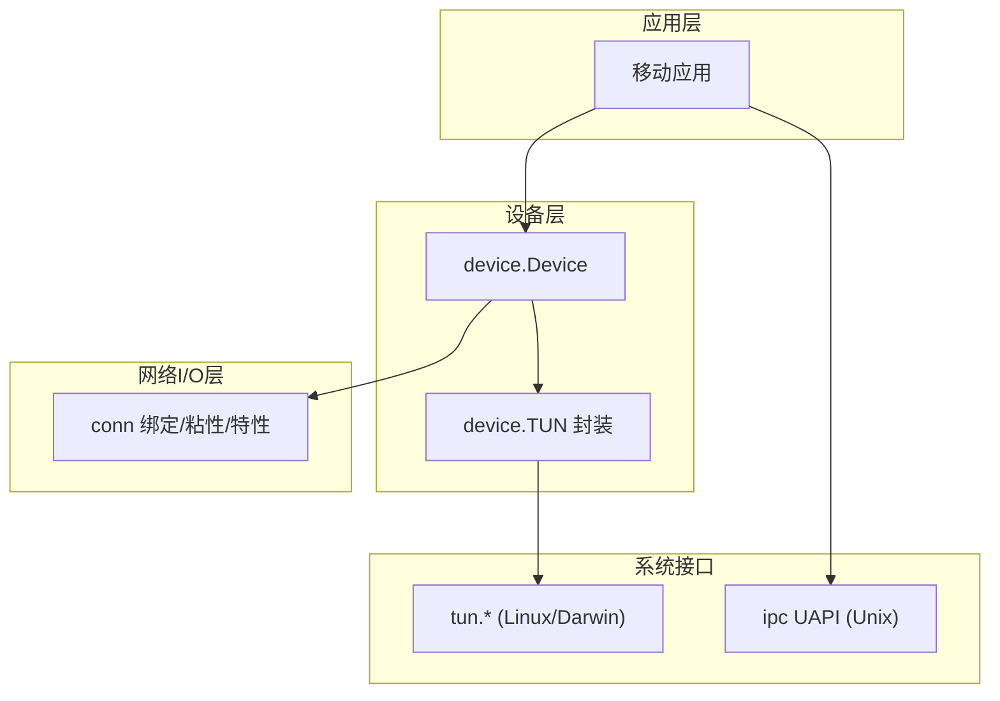
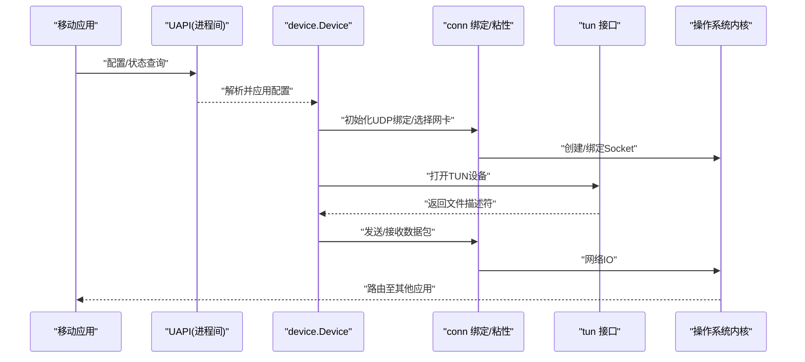
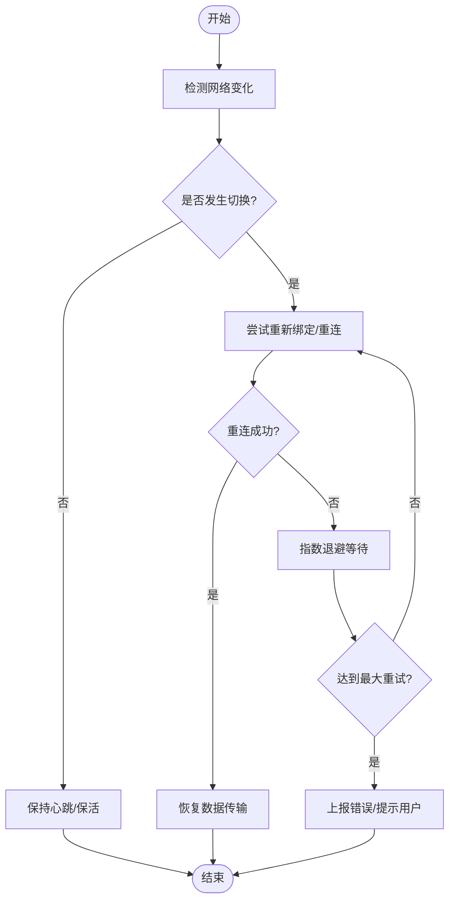
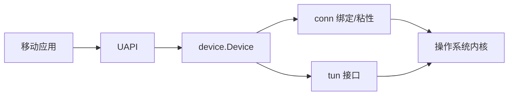

# 移动平台适配

<cite>
**本文引用的文件**
- [main.go](file://main.go)
- [README.md](file://README.md)
- [conn/conn.go](file://conn/conn.go)
- [conn/bind_std.go](file://conn/bind_std.go)
- [conn/boundif_android.go](file://conn/boundif_android.go)
- [conn/sticky_linux.go](file://conn/sticky_linux.go)
- [conn/features_linux.go](file://conn/features_linux.go)
- [device/device.go](file://device/device.go)
- [device/mobilequirks.go](file://device/mobilequirks.go)
- [device/queueconstants_ios.go](file://device/queueconstants_ios.go)
- [device/queueconstants_android.go](file://device/queueconstants_android.go)
- [device/tun.go](file://device/tun.go)
- [tun/tun_linux.go](file://tun/tun_linux.go)
- [tun/tun_darwin.go](file://tun/tun_darwin.go)
- [ipc/uapi_unix.go](file://ipc/uapi_unix.go)
</cite>

## 目录
1. [简介](#简介)
2. [项目结构](#项目结构)
3. [核心组件](#核心组件)
4. [架构总览](#架构总览)
5. [详细组件分析](#详细组件分析)
6. [依赖关系分析](#依赖关系分析)
7. [性能考虑](#性能考虑)
8. [故障排查指南](#故障排查指南)
9. [结论](#结论)
10. [附录](#附录)

## 简介
本文件面向在Android与iOS平台上集成wireguard-go的移动开发者，聚焦以下目标：
- 解释移动平台的网络限制、电池优化与安全沙箱对VPN实现的影响。
- 文档化TUN设备在移动端的创建、权限与生命周期管理。
- 说明连接粘性与网络切换（Wi-Fi/蜂窝）的处理机制。
- 提供性能调优与资源管理策略，以及开发与测试最佳实践。
- 给出部署流程与注意事项，帮助在移动端稳定运行WireGuard。

## 项目结构
仓库采用分层组织：设备层（device）、网络I/O抽象（conn）、TUN接口（tun）、IPC（ipc），以及平台特定适配文件。移动端适配的关键点包括：
- conn层：绑定到指定网卡、粘性连接、特性探测（如GSO）。
- device层：队列常量、移动设备特殊行为、TUN封装。
- tun层：各平台TUN驱动封装（Linux/Darwin等）。
- ipc层：Unix域套接字UAPI用于进程间控制。

图表来源
- [device/device.go:1-200](file://device/device.go#L1-L200)
- [conn/conn.go:1-200](file://conn/conn.go#L1-L200)
- [tun/tun_linux.go:1-200](file://tun/tun_linux.go#L1-L200)
- [tun/tun_darwin.go:1-200](file://tun/tun_darwin.go#L1-L200)
- [ipc/uapi_unix.go:1-200](file://ipc/uapi_unix.go#L1-L200)

章节来源
- [main.go:1-200](file://main.go#L1-L200)
- [README.md:1-200](file://README.md#L1-L200)

## 核心组件
- 设备与协议栈（device）：负责密钥协商、数据包收发、定时器、队列配置与移动设备特殊处理。
- 网络I/O抽象（conn）：统一UDP Socket绑定、网卡选择、粘性连接、内核特性探测（如GSO）。
- TUN接口（tun）：跨平台TUN封装，提供读写隧道数据包的抽象。
- IPC（ipc）：通过Unix域套接字暴露UAPI，供外部进程或系统服务进行配置与控制。

章节来源
- [device/device.go:1-200](file://device/device.go#L1-L200)
- [conn/conn.go:1-200](file://conn/conn.go#L1-L200)
- [tun/tun_linux.go:1-200](file://tun/tun_linux.go#L1-L200)
- [tun/tun_darwin.go:1-200](file://tun/tun_darwin.go#L1-L200)
- [ipc/uapi_unix.go:1-200](file://ipc/uapi_unix.go#L1-L200)

## 架构总览
下图展示移动端典型的数据流与控制流：应用通过UAPI下发配置，设备层建立加密通道，经conn层绑定到指定网卡并维持粘性连接，最终通过tun层将流量注入系统路由。

图表来源
- [ipc/uapi_unix.go:1-200](file://ipc/uapi_unix.go#L1-L200)
- [device/device.go:1-200](file://device/device.go#L1-L200)
- [conn/conn.go:1-200](file://conn/conn.go#L1-L200)
- [tun/tun_linux.go:1-200](file://tun/tun_linux.go#L1-L200)
- [tun/tun_darwin.go:1-200](file://tun/tun_darwin.go#L1-L200)

## 详细组件分析

### Android平台适配
- 网卡绑定与选择
  - 通过平台特定文件为Android提供按接口绑定的能力，确保流量进入正确的虚拟网卡或系统接口。
  - 结合粘性连接机制，在网络切换时尽量保持会话不中断。
- 队列与内存
  - Android专用队列常量定义，针对移动端内存与吞吐进行调优。
- 电池与后台限制
  - 需配合系统省电策略（Doze、后台网络限制）设计保活与重连逻辑；在应用层实现周期性唤醒与快速恢复。
- TUN与权限
  - 使用系统提供的TUN接口，需在应用清单中声明必要的VPN权限，并在运行时申请。
- 网络切换
  - 利用粘性连接与重试策略，在Wi-Fi/蜂窝切换时减少丢包与握手开销。

章节来源
- [conn/boundif_android.go:1-200](file://conn/boundif_android.go#L1-L200)
- [device/queueconstants_android.go:1-200](file://device/queueconstants_android.go#L1-L200)
- [device/mobilequirks.go:1-200](file://device/mobilequirks.go#L1-L200)
- [tun/tun_linux.go:1-200](file://tun/tun_linux.go#L1-L200)

### iOS平台适配
- 队列与内存
  - iOS专用队列常量定义，适配系统对内存与队列长度的限制。
- 电池与后台任务
  - 受限于iOS后台执行模型，应使用合适的后台模式（如VoIP或位置更新）以维持连接；合理设置心跳与超时。
- TUN与权限
  - 通过系统框架提供的TUN能力接入，遵循iOS的沙箱与权限模型。
- 网络切换
  - 借助粘性连接与快速重连，在蜂窝/Wi-Fi切换时保持会话连续性。

章节来源
- [device/queueconstants_ios.go:1-200](file://device/queueconstants_ios.go#L1-L200)
- [device/mobilequirks.go:1-200](file://device/mobilequirks.go#L1-L200)
- [tun/tun_darwin.go:1-200](file://tun/tun_darwin.go#L1-L200)

### 连接粘性与网络切换处理
- 粘性连接
  - 在conn层实现基于网卡/端口的粘性策略，尽量复用已有Socket与路径，降低切换成本。
- 网络切换
  - 当检测到网络变化时，触发重绑定与重连流程；结合指数退避与最大重试次数，避免风暴式重连。
- 错误恢复
  - 对常见错误（无网、DNS失败、认证失败）进行分类处理，提供可观测的指标与日志。

图表来源
- [conn/sticky_linux.go:1-200](file://conn/sticky_linux.go#L1-L200)
- [conn/conn.go:1-200](file://conn/conn.go#L1-L200)
- [device/device.go:1-200](file://device/device.go#L1-L200)

章节来源
- [conn/sticky_linux.go:1-200](file://conn/sticky_linux.go#L1-L200)
- [conn/conn.go:1-200](file://conn/conn.go#L1-L200)
- [device/device.go:1-200](file://device/device.go#L1-L200)

### TUN设备实现与权限管理
- Linux/TUN
  - 通过tun层打开TUN设备并进行读写；在Android上需要VPN权限与系统服务配合。
- Darwin/iOS
  - 通过Darwin/TUN接口访问系统TUN能力，遵循iOS沙箱与权限模型。
- 生命周期
  - 在应用启动时创建，退出时释放；异常情况下需具备自动恢复能力。

章节来源
- [tun/tun_linux.go:1-200](file://tun/tun_linux.go#L1-L200)
- [tun/tun_darwin.go:1-200](file://tun/tun_darwin.go#L1-L200)
- [device/tun.go:1-200](file://device/tun.go#L1-L200)

### 性能调优与资源管理
- 队列与缓冲区
  - 根据平台调整队列长度与缓冲区大小，平衡吞吐与内存占用。
- 内核特性
  - 启用GSO等特性以降低CPU开销（在支持的平台）。
- 电池优化
  - 合理设置心跳间隔与超时；在后台模式下降低频率，前台提升响应性。
- 并发与锁
  - 控制并发度，避免过多goroutine导致上下文切换开销。

章节来源
- [conn/features_linux.go:1-200](file://conn/features_linux.go#L1-L200)
- [device/queueconstants_android.go:1-200](file://device/queueconstants_android.go#L1-L200)
- [device/queueconstants_ios.go:1-200](file://device/queueconstants_ios.go#L1-L200)

### 沙箱限制与安全模型影响
- Android
  - 需要VPN权限；受限的后台网络访问；需遵守系统省电策略。
- iOS
  - 严格的后台执行限制；需使用合适的后台模式；遵循沙箱隔离。
- 通用建议
  - 最小权限原则；敏感数据不落盘；通信加密与证书校验。

章节来源
- [device/mobilequirks.go:1-200](file://device/mobilequirks.go#L1-L200)
- [tun/tun_linux.go:1-200](file://tun/tun_linux.go#L1-L200)
- [tun/tun_darwin.go:1-200](file://tun/tun_darwin.go#L1-L200)

### 开发与测试最佳实践
- 单元测试与集成测试
  - 覆盖网络切换、错误恢复、性能边界场景。
- 模拟环境
  - 使用网络模拟器构造弱网、高延迟、频繁切换场景。
- 监控与日志
  - 记录关键事件（重连、切换、错误码），便于定位问题。
- 兼容性
  - 多版本系统与不同厂商ROM的兼容性验证。

章节来源
- [device/device.go:1-200](file://device/device.go#L1-L200)
- [conn/conn.go:1-200](file://conn/conn.go#L1-L200)

### 部署流程与注意事项
- Android
  - 配置清单权限；构建签名；安装后授予VPN权限；后台策略适配。
- iOS
  - 配置Entitlements与后台模式；App Store审核要求；沙箱权限。
- 通用
  - 灰度发布；回滚策略；崩溃收集与遥测。

章节来源
- [ipc/uapi_unix.go:1-200](file://ipc/uapi_unix.go#L1-L200)
- [device/device.go:1-200](file://device/device.go#L1-L200)

## 依赖关系分析
移动端适配涉及多层依赖：应用通过UAPI与设备层交互，设备层依赖conn进行网络I/O，并通过tun访问系统TUN。粘性连接与特性探测进一步耦合到平台实现。

图表来源
- [ipc/uapi_unix.go:1-200](file://ipc/uapi_unix.go#L1-L200)
- [device/device.go:1-200](file://device/device.go#L1-L200)
- [conn/conn.go:1-200](file://conn/conn.go#L1-L200)
- [tun/tun_linux.go:1-200](file://tun/tun_linux.go#L1-L200)
- [tun/tun_darwin.go:1-200](file://tun/tun_darwin.go#L1-L200)

章节来源
- [device/device.go:1-200](file://device/device.go#L1-L200)
- [conn/conn.go:1-200](file://conn/conn.go#L1-L200)
- [tun/tun_linux.go:1-200](file://tun/tun_linux.go#L1-L200)
- [tun/tun_darwin.go:1-200](file://tun/tun_darwin.go#L1-L200)
- [ipc/uapi_unix.go:1-200](file://ipc/uapi_unix.go#L1-L200)

## 性能考虑
- 队列与缓冲
  - 根据平台调整队列长度，避免内存压力与丢包。
- 内核特性
  - 启用GSO以减少CPU占用（在支持的平台）。
- 心跳与超时
  - 根据网络质量动态调整心跳间隔，降低功耗同时保证连通性。
- 并发控制
  - 限制并发请求数，避免系统资源耗尽。

章节来源
- [conn/features_linux.go:1-200](file://conn/features_linux.go#L1-L200)
- [device/queueconstants_android.go:1-200](file://device/queueconstants_android.go#L1-L200)
- [device/queueconstants_ios.go:1-200](file://device/queueconstants_ios.go#L1-L200)

## 故障排查指南
- 常见问题
  - 无法获取VPN权限：检查应用权限与系统设置。
  - 频繁断连：检查网络切换与重连策略。
  - 性能下降：检查队列配置与内核特性。
- 诊断方法
  - 启用详细日志；采集网络抓包；监控内存与CPU。
- 恢复策略
  - 自动重连与降级；提示用户操作。

章节来源
- [device/device.go:1-200](file://device/device.go#L1-L200)
- [conn/conn.go:1-200](file://conn/conn.go#L1-L200)

## 结论
移动端适配需要在网络、电池、安全与性能之间取得平衡。通过合理的TUN管理、粘性连接、队列调优与后台策略，可以在Android与iOS上实现稳定高效的WireGuard体验。建议在开发阶段充分覆盖切换与异常场景，并在发布前进行全面的兼容性与性能测试。

## 附录
- 术语
  - TUN：网络隧道接口，用于转发IP数据包。
  - 粘性连接：在网络切换时尽量复用现有连接以减少中断。
  - GSO：分段卸载，降低CPU开销。
- 参考
  - 平台文档与SDK说明；系统权限与后台策略指南。