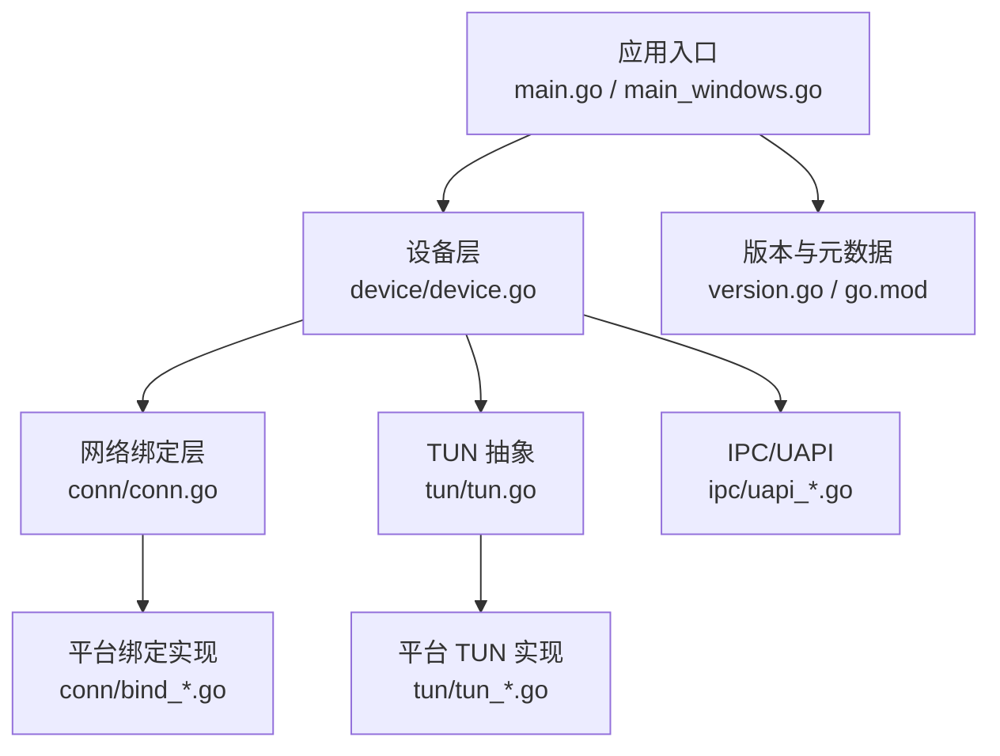
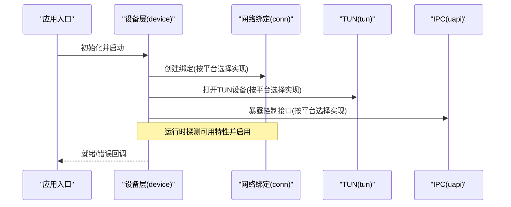
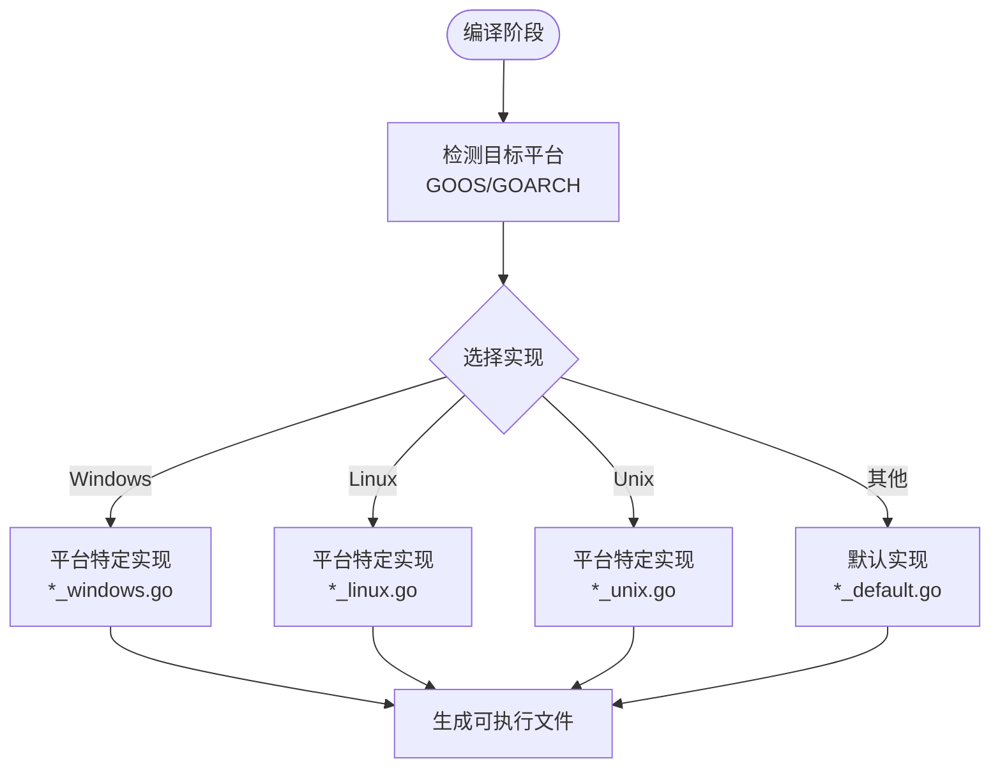
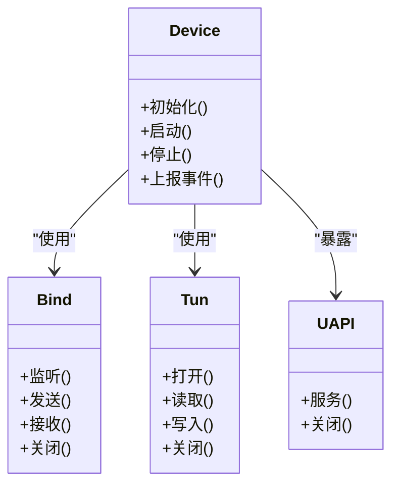
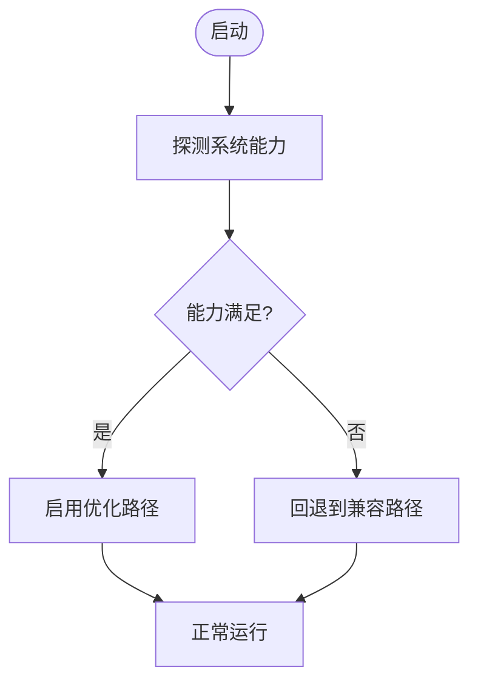
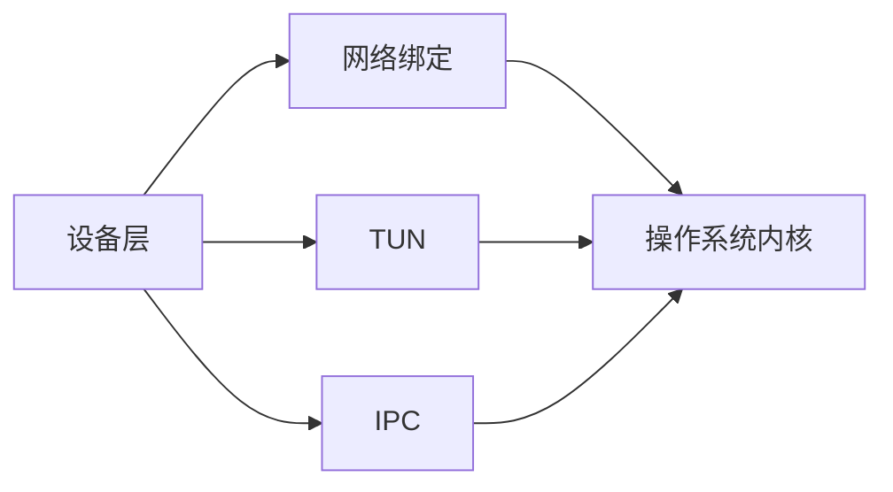

# 跨平台开发指南

<cite>
**本文引用的文件**
- [main.go](file://main.go)
- [main_windows.go](file://main_windows.go)
- [version.go](file://version.go)
- [go.mod](file://go.mod)
- [Makefile](file://Makefile)
- [README.md](file://README.md)
- [conn/conn.go](file://conn/conn.go)
- [conn/bind_std.go](file://conn/bind_std.go)
- [conn/bind_windows.go](file://conn/bind_windows.go)
- [conn/features_default.go](file://conn/features_default.go)
- [conn/features_linux.go](file://conn/features_linux.go)
- [conn/controlfns.go](file://conn/controlfns.go)
- [conn/controlfns_unix.go](file://conn/controlfns_unix.go)
- [conn/controlfns_linux.go](file://conn/controlfns_linux.go)
- [conn/controlfns_windows.go](file://conn/controlfns_windows.go)
- [conn/gso_default.go](file://conn/gso_default.go)
- [conn/gso_linux.go](file://conn/gso_linux.go)
- [conn/mark_default.go](file://conn/mark_default.go)
- [conn/mark_unix.go](file://conn/mark_unix.go)
- [conn/sticky_default.go](file://conn/sticky_default.go)
- [conn/sticky_linux.go](file://conn/sticky_linux.go)
- [device/device.go](file://device/device.go)
- [device/tun.go](file://device/tun.go)
- [device/queueconstants_default.go](file://device/queueconstants_default.go)
- [device/queueconstants_android.go](file://device/queueconstants_android.go)
- [device/queueconstants_ios.go](file://device/queueconstants_ios.go)
- [device/queueconstants_windows.go](file://device/queueconstants_windows.go)
- [ipc/uapi_unix.go](file://ipc/uapi_unix.go)
- [ipc/uapi_linux.go](file://ipc/uapi_linux.go)
- [ipc/uapi_wasm.go](file://ipc/uapi_wasm.go)
- [ipc/uapi_windows.go](file://ipc/uapi_windows.go)
- [tun/tun.go](file://tun/tun.go)
- [tun/tun_linux.go](file://tun/tun_linux.go)
- [tun/tun_darwin.go](file://tun/tun_darwin.go)
- [tun/tun_freebsd.go](file://tun/tun_freebsd.go)
- [tun/tun_openbsd.go](file://tun/tun_openbsd.go)
- [tun/tun_windows.go](file://tun/tun_windows.go)
</cite>

## 目录
1. [简介](#简介)
2. [项目结构](#项目结构)
3. [核心组件](#核心组件)
4. [架构总览](#架构总览)
5. [详细组件分析](#详细组件分析)
6. [依赖关系分析](#依赖关系分析)
7. [性能考量](#性能考量)
8. [故障排查指南](#故障排查指南)
9. [结论](#结论)
10. [附录](#附录)

## 简介
本指南面向希望在多操作系统与硬件平台上构建、测试与分发 WireGuard Go 实现的开发者。重点围绕以下主题：
- 构建标签（build tags）机制与平台特定代码组织方式
- 接口抽象设计与平台检测机制
- 跨平台兼容性检查与功能发现
- 不同平台 API 差异与版本兼容处理
- 跨平台测试策略与自动化测试框架
- 打包与分发策略
- 新平台移植流程与检查清单
- 跨平台性能基准测试与对比分析方法

本指南以仓库中的实际实现为依据，通过分层说明与图示帮助读者快速掌握跨平台开发要点。

## 项目结构
仓库采用按“功能域 + 平台变体”的目录组织方式：
- conn：网络套接字绑定、特性探测、GSO、标记、粘滞路由等
- device：WireGuard 协议栈核心逻辑、队列常量、TUN 抽象
- ipc：用户态控制接口（UAPI），按平台拆分实现
- tun：TUN/TAP 设备抽象，按平台提供具体实现
- 根目录：入口程序、版本信息、构建脚本与模块定义

图表来源
- [main.go:1-200](file://main.go#L1-L200)
- [main_windows.go:1-200](file://main_windows.go#L1-L200)
- [device/device.go:1-200](file://device/device.go#L1-L200)
- [conn/conn.go:1-200](file://conn/conn.go#L1-L200)
- [tun/tun.go:1-200](file://tun/tun.go#L1-L200)
- [ipc/uapi_unix.go:1-200](file://ipc/uapi_unix.go#L1-L200)
- [version.go:1-200](file://version.go#L1-L200)
- [go.mod:1-200](file://go.mod#L1-L200)

章节来源
- [main.go:1-200](file://main.go#L1-L200)
- [main_windows.go:1-200](file://main_windows.go#L1-L200)
- [device/device.go:1-200](file://device/device.go#L1-L200)
- [conn/conn.go:1-200](file://conn/conn.go#L1-L200)
- [tun/tun.go:1-200](file://tun/tun.go#L1-L200)
- [ipc/uapi_unix.go:1-200](file://ipc/uapi_unix.go#L1-L200)
- [version.go:1-200](file://version.go#L1-L200)
- [go.mod:1-200](file://go.mod#L1-L200)

## 核心组件
- 构建标签与平台选择：通过文件名后缀（如 _windows.go、_linux.go、_unix.go、_default.go）与构建标签组合，在编译期选择对应实现。
- 接口抽象：设备层通过统一接口屏蔽底层 TUN 与网络绑定差异；IPC 层提供统一的 UAPI 接口。
- 功能发现：在运行时探测内核/系统能力（如 GSO、TCP segmentation offload、SO_MARK 等），动态启用或降级功能。
- 队列与资源限制：针对不同平台调整队列大小与内存限制，避免 OOM 或性能瓶颈。
- 入口与平台初始化：Windows 与非 Windows 入口分别处理平台特定的启动流程。

章节来源
- [conn/features_default.go:1-200](file://conn/features_default.go#L1-L200)
- [conn/features_linux.go:1-200](file://conn/features_linux.go#L1-L200)
- [device/queueconstants_default.go:1-200](file://device/queueconstants_default.go#L1-L200)
- [device/queueconstants_windows.go:1-200](file://device/queueconstants_windows.go#L1-L200)
- [device/queueconstants_android.go:1-200](file://device/queueconstants_android.go#L1-L200)
- [device/queueconstants_ios.go:1-200](file://device/queueconstants_ios.go#L1-L200)
- [conn/gso_default.go:1-200](file://conn/gso_default.go#L1-L200)
- [conn/gso_linux.go:1-200](file://conn/gso_linux.go#L1-L200)
- [conn/mark_default.go:1-200](file://conn/mark_default.go#L1-L200)
- [conn/mark_unix.go:1-200](file://conn/mark_unix.go#L1-L200)
- [conn/sticky_default.go:1-200](file://conn/sticky_default.go#L1-L200)
- [conn/sticky_linux.go:1-200](file://conn/sticky_linux.go#L1-L200)
- [device/device.go:1-200](file://device/device.go#L1-L200)
- [tun/tun.go:1-200](file://tun/tun.go#L1-L200)
- [ipc/uapi_unix.go:1-200](file://ipc/uapi_unix.go#L1-L200)

## 架构总览
下图展示了从入口到设备、网络绑定、TUN 与 IPC 的整体调用关系，以及平台变体的选择位置。

图表来源
- [main.go:1-200](file://main.go#L1-L200)
- [main_windows.go:1-200](file://main_windows.go#L1-L200)
- [device/device.go:1-200](file://device/device.go#L1-L200)
- [conn/conn.go:1-200](file://conn/conn.go#L1-L200)
- [tun/tun.go:1-200](file://tun/tun.go#L1-L200)
- [ipc/uapi_unix.go:1-200](file://ipc/uapi_unix.go#L1-L200)

## 详细组件分析

### 构建标签与平台特定代码组织
- 命名约定：使用 _windows.go、_linux.go、_unix.go、_default.go 等后缀区分平台实现；默认实现放在 _default.go，平台特化覆盖默认行为。
- 典型场景：
  - 网络绑定：标准实现与 Windows 专用实现分离
  - 控制函数：Unix/Linux/Windows 各自封装系统调用
  - GSO/标记/粘滞路由：Linux 增强特性在其他平台回退为默认实现
  - 队列常量：Android/iOS/Windows/默认值差异化配置
  - TUN：各平台独立打开与读写实现
  - UAPI：Unix/WASM/Windows 分别实现

图表来源
- [conn/bind_std.go:1-200](file://conn/bind_std.go#L1-L200)
- [conn/bind_windows.go:1-200](file://conn/bind_windows.go#L1-L200)
- [conn/controlfns.go:1-200](file://conn/controlfns.go#L1-L200)
- [conn/controlfns_unix.go:1-200](file://conn/controlfns_unix.go#L1-L200)
- [conn/controlfns_linux.go:1-200](file://conn/controlfns_linux.go#L1-L200)
- [conn/controlfns_windows.go:1-200](file://conn/controlfns_windows.go#L1-L200)
- [conn/gso_default.go:1-200](file://conn/gso_default.go#L1-L200)
- [conn/gso_linux.go:1-200](file://conn/gso_linux.go#L1-L200)
- [conn/mark_default.go:1-200](file://conn/mark_default.go#L1-L200)
- [conn/mark_unix.go:1-200](file://conn/mark_unix.go#L1-L200)
- [conn/sticky_default.go:1-200](file://conn/sticky_default.go#L1-L200)
- [conn/sticky_linux.go:1-200](file://conn/sticky_linux.go#L1-L200)
- [device/queueconstants_default.go:1-200](file://device/queueconstants_default.go#L1-L200)
- [device/queueconstants_windows.go:1-200](file://device/queueconstants_windows.go#L1-L200)
- [device/queueconstants_android.go:1-200](file://device/queueconstants_android.go#L1-L200)
- [device/queueconstants_ios.go:1-200](file://device/queueconstants_ios.go#L1-L200)
- [tun/tun_linux.go:1-200](file://tun/tun_linux.go#L1-L200)
- [tun/tun_darwin.go:1-200](file://tun/tun_darwin.go#L1-L200)
- [tun/tun_freebsd.go:1-200](file://tun/tun_freebsd.go#L1-L200)
- [tun/tun_openbsd.go:1-200](file://tun/tun_openbsd.go#L1-L200)
- [tun/tun_windows.go:1-200](file://tun/tun_windows.go#L1-L200)
- [ipc/uapi_unix.go:1-200](file://ipc/uapi_unix.go#L1-L200)
- [ipc/uapi_linux.go:1-200](file://ipc/uapi_linux.go#L1-L200)
- [ipc/uapi_wasm.go:1-200](file://ipc/uapi_wasm.go#L1-L200)
- [ipc/uapi_windows.go:1-200](file://ipc/uapi_windows.go#L1-L200)

章节来源
- [conn/bind_std.go:1-200](file://conn/bind_std.go#L1-L200)
- [conn/bind_windows.go:1-200](file://conn/bind_windows.go#L1-L200)
- [conn/controlfns_unix.go:1-200](file://conn/controlfns_unix.go#L1-L200)
- [conn/controlfns_linux.go:1-200](file://conn/controlfns_linux.go#L1-L200)
- [conn/controlfns_windows.go:1-200](file://conn/controlfns_windows.go#L1-L200)
- [conn/gso_default.go:1-200](file://conn/gso_default.go#L1-L200)
- [conn/gso_linux.go:1-200](file://conn/gso_linux.go#L1-L200)
- [conn/mark_default.go:1-200](file://conn/mark_default.go#L1-L200)
- [conn/mark_unix.go:1-200](file://conn/mark_unix.go#L1-L200)
- [conn/sticky_default.go:1-200](file://conn/sticky_default.go#L1-L200)
- [conn/sticky_linux.go:1-200](file://conn/sticky_linux.go#L1-L200)
- [device/queueconstants_default.go:1-200](file://device/queueconstants_default.go#L1-L200)
- [device/queueconstants_windows.go:1-200](file://device/queueconstants_windows.go#L1-L200)
- [device/queueconstants_android.go:1-200](file://device/queueconstants_android.go#L1-L200)
- [device/queueconstants_ios.go:1-200](file://device/queueconstants_ios.go#L1-L200)
- [tun/tun_linux.go:1-200](file://tun/tun_linux.go#L1-L200)
- [tun/tun_darwin.go:1-200](file://tun/tun_darwin.go#L1-L200)
- [tun/tun_freebsd.go:1-200](file://tun/tun_freebsd.go#L1-L200)
- [tun/tun_openbsd.go:1-200](file://tun/tun_openbsd.go#L1-L200)
- [tun/tun_windows.go:1-200](file://tun/tun_windows.go#L1-L200)
- [ipc/uapi_unix.go:1-200](file://ipc/uapi_unix.go#L1-L200)
- [ipc/uapi_linux.go:1-200](file://ipc/uapi_linux.go#L1-L200)
- [ipc/uapi_wasm.go:1-200](file://ipc/uapi_wasm.go#L1-L200)
- [ipc/uapi_windows.go:1-200](file://ipc/uapi_windows.go#L1-L200)

### 接口抽象与平台检测机制
- 接口抽象：
  - 设备层对 TUN 与网络绑定进行统一抽象，屏蔽平台差异
  - IPC 层提供统一的 UAPI 接口，便于上层管理
- 平台检测与功能发现：
  - 在 conn 层根据运行环境探测内核/系统能力（例如 GSO、SO_MARK 等），动态启用或禁用相应优化
  - 通过默认与平台特化文件组合，确保在不支持特性的平台上安全降级

图表来源
- [device/device.go:1-200](file://device/device.go#L1-L200)
- [conn/conn.go:1-200](file://conn/conn.go#L1-L200)
- [tun/tun.go:1-200](file://tun/tun.go#L1-L200)
- [ipc/uapi_unix.go:1-200](file://ipc/uapi_unix.go#L1-L200)

章节来源
- [device/device.go:1-200](file://device/device.go#L1-L200)
- [conn/conn.go:1-200](file://conn/conn.go#L1-L200)
- [tun/tun.go:1-200](file://tun/tun.go#L1-L200)
- [ipc/uapi_unix.go:1-200](file://ipc/uapi_unix.go#L1-L200)

### 跨平台兼容性检查与功能发现
- 运行时能力探测：
  - 尝试设置/查询系统选项（如 GSO、标记位），失败则回退到通用路径
  - 依据探测结果记录可用特性集，供后续路径选择
- 降级策略：
  - 当某项特性不可用时，自动切换到兼容模式，保证基本连通性
  - 日志与指标输出有助于定位缺失特性

图表来源
- [conn/features_default.go:1-200](file://conn/features_default.go#L1-L200)
- [conn/features_linux.go:1-200](file://conn/features_linux.go#L1-L200)
- [conn/gso_default.go:1-200](file://conn/gso_default.go#L1-L200)
- [conn/gso_linux.go:1-200](file://conn/gso_linux.go#L1-L200)
- [conn/mark_default.go:1-200](file://conn/mark_default.go#L1-L200)
- [conn/mark_unix.go:1-200](file://conn/mark_unix.go#L1-L200)

章节来源
- [conn/features_default.go:1-200](file://conn/features_default.go#L1-L200)
- [conn/features_linux.go:1-200](file://conn/features_linux.go#L1-L200)
- [conn/gso_default.go:1-200](file://conn/gso_default.go#L1-L200)
- [conn/gso_linux.go:1-200](file://conn/gso_linux.go#L1-L200)
- [conn/mark_default.go:1-200](file://conn/mark_default.go#L1-L200)
- [conn/mark_unix.go:1-200](file://conn/mark_unix.go#L1-L200)

### 不同平台 API 差异与版本兼容处理
- 差异点：
  - TUN 设备打开方式、权限模型与命名空间差异
  - 网络栈特性（GSO、TSO、SO_MARK）可用性不同
  - IPC 通道（管道、命名管道、Unix Socket）实现不同
- 版本兼容：
  - 通过运行时探测与条件分支，适配新旧内核/系统版本
  - 对不存在的系统调用或参数进行兜底处理

章节来源
- [tun/tun_linux.go:1-200](file://tun/tun_linux.go#L1-L200)
- [tun/tun_darwin.go:1-200](file://tun/tun_darwin.go#L1-L200)
- [tun/tun_freebsd.go:1-200](file://tun/tun_freebsd.go#L1-L200)
- [tun/tun_openbsd.go:1-200](file://tun/tun_openbsd.go#L1-L200)
- [tun/tun_windows.go:1-200](file://tun/tun_windows.go#L1-L200)
- [ipc/uapi_unix.go:1-200](file://ipc/uapi_unix.go#L1-L200)
- [ipc/uapi_linux.go:1-200](file://ipc/uapi_linux.go#L1-L200)
- [ipc/uapi_wasm.go:1-200](file://ipc/uapi_wasm.go#L1-L200)
- [ipc/uapi_windows.go:1-200](file://ipc/uapi_windows.go#L1-L200)

### 跨平台测试策略与自动化测试框架
- 单元测试：
  - 针对算法与数据结构编写平台无关的测试
  - 利用 build tags 隔离平台相关测试
- 集成测试：
  - 在不同 OS/内核版本上运行端到端用例
  - 模拟网络异常与权限不足等边界情况
- 持续集成：
  - 在多平台矩阵中并行执行测试
  - 收集覆盖率与性能指标

章节来源
- [conn/bind_std_test.go:1-200](file://conn/bind_std_test.go#L1-L200)
- [conn/conn_test.go:1-200](file://conn/conn_test.go#L1-L200)
- [conn/sticky_linux_test.go:1-200](file://conn/sticky_linux_test.go#L1-L200)
- [device/device_test.go:1-200](file://device/device_test.go#L1-L200)
- [device/allowedips_test.go:1-200](file://device/allowedips_test.go#L1-L200)
- [device/cookie_test.go:1-200](file://device/cookie_test.go#L1-L200)
- [device/noise_test.go:1-200](file://device/noise_test.go#L1-L200)
- [device/pools_test.go:1-200](file://device/pools_test.go#L1-L200)
- [device/race_disabled_test.go:1-200](file://device/race_disabled_test.go#L1-L200)
- [device/race_enabled_test.go:1-200](file://device/race_enabled_test.go#L1-L200)
- [ipc/namedpipe/namedpipe_test.go:1-200](file://ipc/namedpipe/namedpipe_test.go#L1-L200)
- [tun/alignment_windows_test.go:1-200](file://tun/alignment_windows_test.go#L1-L200)
- [tun/checksum_test.go:1-200](file://tun/checksum_test.go#L1-L200)
- [tun/offload_linux_test.go:1-200](file://tun/offload_linux_test.go#L1-L200)

### 打包与分发策略
- 构建产物：
  - 使用 Makefile 与 go build 指定 GOOS/GOARCH 生成多平台二进制
  - 版本号由 version.go 注入，便于追踪发布
- 签名与校验：
  - 对关键平台产物进行签名与哈希校验
- 包管理器：
  - 提供安装包或容器镜像，简化部署

章节来源
- [Makefile:1-200](file://Makefile#L1-L200)
- [version.go:1-200](file://version.go#L1-L200)
- [go.mod:1-200](file://go.mod#L1-L200)

### 新平台移植流程与检查清单
- 步骤：
  1) 新增平台特定文件（如 *_newos.go），遵循现有命名约定
  2) 实现必要的接口（TUN、网络绑定、控制函数、UAPI）
  3) 添加队列常量与资源限制配置
  4) 编写平台测试用例
  5) 在 CI 中添加新平台构建与测试任务
- 检查清单：
  - 是否覆盖所有必要接口
  - 是否具备功能探测与降级逻辑
  - 是否通过基础连通性与压力测试
  - 是否完成打包与签名流程

章节来源
- [tun/tun.go:1-200](file://tun/tun.go#L1-L200)
- [conn/conn.go:1-200](file://conn/conn.go#L1-L200)
- [conn/controlfns.go:1-200](file://conn/controlfns.go#L1-L200)
- [ipc/uapi_unix.go:1-200](file://ipc/uapi_unix.go#L1-L200)
- [device/queueconstants_default.go:1-200](file://device/queueconstants_default.go#L1-L200)

### 跨平台性能基准测试与对比分析
- 基准设计：
  - 在同一工作负载下比较不同平台的吞吐、时延与 CPU 占用
  - 针对 GSO/TSO 开启与关闭两种场景分别测量
- 数据采集：
  - 使用系统工具与语言内置基准框架采集指标
  - 记录内核版本、驱动版本与网络拓扑
- 分析与报告：
  - 对比不同平台间的性能差异，定位瓶颈
  - 将结果纳入发布说明与回归测试

章节来源
- [conn/gso_default.go:1-200](file://conn/gso_default.go#L1-L200)
- [conn/gso_linux.go:1-200](file://conn/gso_linux.go#L1-L200)
- [tun/offload_linux_test.go:1-200](file://tun/offload_linux_test.go#L1-L200)

## 依赖关系分析
- 组件耦合：
  - 设备层依赖网络绑定与 TUN 抽象，保持松耦合
  - IPC 层与设备层解耦，通过统一接口通信
- 外部依赖：
  - 操作系统内核特性（GSO、TSO、SO_MARK）
  - 平台网络栈与 TUN 驱动
- 循环依赖：
  - 通过接口与分层避免直接循环引用

图表来源
- [device/device.go:1-200](file://device/device.go#L1-L200)
- [conn/conn.go:1-200](file://conn/conn.go#L1-L200)
- [tun/tun.go:1-200](file://tun/tun.go#L1-L200)
- [ipc/uapi_unix.go:1-200](file://ipc/uapi_unix.go#L1-L200)

章节来源
- [device/device.go:1-200](file://device/device.go#L1-L200)
- [conn/conn.go:1-200](file://conn/conn.go#L1-L200)
- [tun/tun.go:1-200](file://tun/tun.go#L1-L200)
- [ipc/uapi_unix.go:1-200](file://ipc/uapi_unix.go#L1-L200)

## 性能考量
- 启用内核卸载：在支持的平台优先启用 GSO/TSO，降低 CPU 占用
- 队列与缓冲：根据平台特性调整队列长度与缓冲区大小，避免拥塞
- 内存复用：重用对象池减少 GC 压力
- 监控与调优：采集关键指标（吞吐、时延、丢包率、CPU 使用率），持续优化

[本节为通用指导，无需列出具体文件来源]

## 故障排查指南
- 常见问题：
  - 权限不足导致无法打开 TUN 或设置 SO_MARK
  - 内核不支持 GSO/TSO，导致性能下降
  - IPC 通道建立失败（命名管道/Unix Socket）
- 诊断方法：
  - 查看日志与功能探测结果
  - 在目标平台复现并收集内核与驱动信息
  - 逐步禁用优化特性验证问题范围

章节来源
- [conn/features_default.go:1-200](file://conn/features_default.go#L1-L200)
- [conn/features_linux.go:1-200](file://conn/features_linux.go#L1-L200)
- [tun/tun.go:1-200](file://tun/tun.go#L1-L200)
- [ipc/uapi_unix.go:1-200](file://ipc/uapi_unix.go#L1-L200)

## 结论
本指南基于仓库的实际实现，总结了跨平台开发的构建标签机制、接口抽象、功能发现、兼容性处理、测试与打包策略，以及新平台移植流程与性能分析方法。遵循这些实践，可以在多平台上稳定、高效地交付 WireGuard Go 实现。

[本节为总结，无需列出具体文件来源]

## 附录
- 快速参考：
  - 构建标签与平台选择：通过文件名后缀与 GOOS/GOARCH 控制
  - 功能探测：在 conn 层统一实现，按需启用优化
  - 测试矩阵：在 CI 中覆盖多平台与多内核版本
  - 打包：使用 Makefile 与版本注入生成可分发包

[本节为补充信息，无需列出具体文件来源]