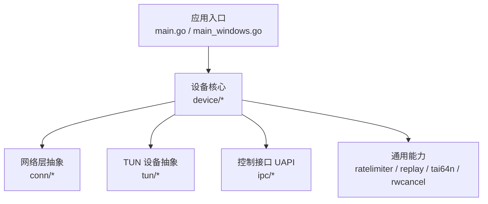
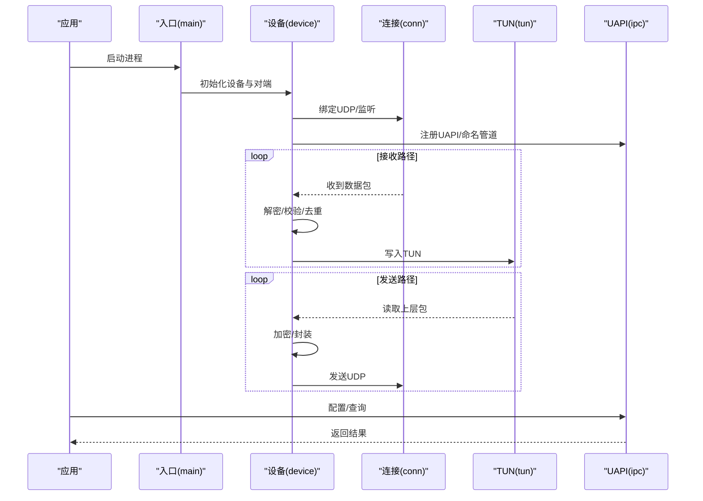
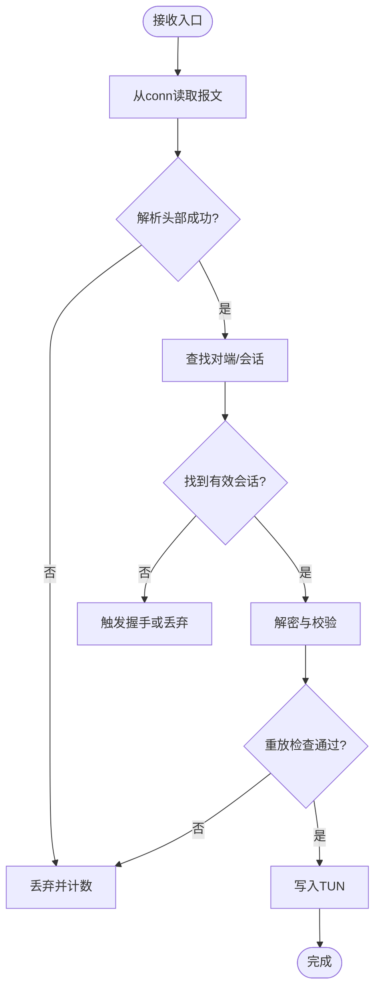
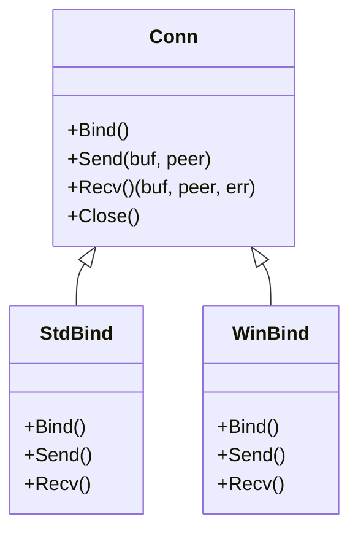
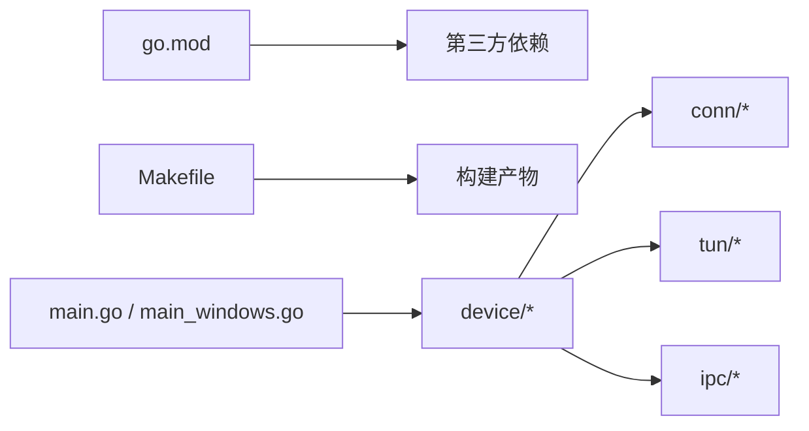

# 开发者指南

<cite>
**本文引用的文件**
- [README.md](file://README.md)
- [readme_cn.md](file://readme_cn.md)
- [Makefile](file://Makefile)
- [go.mod](file://go.mod)
- [main.go](file://main.go)
- [main_windows.go](file://main_windows.go)
- [version.go](file://version.go)
- [device/device.go](file://device/device.go)
- [device/send.go](file://device/send.go)
- [device/receive.go](file://device/receive.go)
- [device/peer.go](file://device/peer.go)
- [device/timers.go](file://device/timers.go)
- [device/uapi.go](file://device/uapi.go)
- [conn/conn.go](file://conn/conn.go)
- [conn/bind_std.go](file://conn/bind_std.go)
- [conn/bind_windows.go](file://conn/bind_windows.go)
- [tun/tun_linux.go](file://tun/tun_linux.go)
- [tun/tun_windows.go](file://tun/tun_windows.go)
- [ipc/uapi_unix.go](file://ipc/uapi_unix.go)
- [ipc/uapi_windows.go](file://ipc/uapi_windows.go)
- [ratelimiter/ratelimiter.go](file://ratelimiter/ratelimiter.go)
- [replay/replay.go](file://replay/replay.go)
- [tai64n/tai64n.go](file://tai64n/tai64n.go)
- [rwcancel/rwcancel.go](file://rwcancel/rwcancel.go)
- [tests/netns.sh](file://tests/netns.sh)
</cite>

## 目录
1. [简介](#简介)
2. [项目结构](#项目结构)
3. [核心组件](#核心组件)
4. [架构总览](#架构总览)
5. [详细组件分析](#详细组件分析)
6. [依赖关系分析](#依赖关系分析)
7. [性能考虑与剖析](#性能考虑与剖析)
8. [故障排查指南](#故障排查指南)
9. [结论](#结论)
10. [附录](#附录)

## 简介
本指南面向希望参与 WireGuard-Go 开发与维护的工程师，覆盖开发环境搭建、依赖管理、代码规范与贡献流程、调试技巧与常用工具、性能分析与剖析、版本管理与发布流程、重构与扩展指导、文档编写与维护要求，以及为新贡献者准备的入门路径。内容基于仓库现有结构与实现进行总结，帮助你在最短时间上手并高效协作。

## 项目结构
WireGuard-Go 采用按功能域划分的模块化组织方式：
- device：协议栈核心（噪声协议、密钥派生、对端状态机、收发队列、计时器等）
- conn：网络套接字抽象与平台绑定（标准库与 Windows 专用）
- tun：TUN/TAP 设备抽象与平台实现
- ipc：用户态控制接口（UAPI）与命名管道
- ratelimiter、replay、tai64n、rwcancel：通用能力模块（限速、重放保护、高精度时间、读写取消）
- tests：集成测试脚本
- 入口与构建：main.go、main_windows.go、Makefile、go.mod、version.go

图表来源
- [main.go:1-200](file://main.go#L1-L200)
- [main_windows.go:1-200](file://main_windows.go#L1-L200)
- [device/device.go:1-200](file://device/device.go#L1-L200)
- [conn/conn.go:1-200](file://conn/conn.go#L1-L200)
- [tun/tun_linux.go:1-200](file://tun/tun_linux.go#L1-L200)
- [ipc/uapi_unix.go:1-200](file://ipc/uapi_unix.go#L1-L200)

章节来源
- [README.md:1-200](file://README.md#L1-L200)
- [readme_cn.md:1-200](file://readme_cn.md#L1-L200)
- [Makefile:1-200](file://Makefile#L1-L200)
- [go.mod:1-200](file://go.mod#L1-L200)

## 核心组件
- 设备核心（device）：负责噪声握手、密钥派生、对端状态机、发送/接收流水线、定时器与队列管理。是协议栈的“大脑”。
- 连接抽象（conn）：封装 UDP 套接字操作，提供跨平台绑定、GSO、标记、粘性路由等特性。
- TUN 抽象（tun）：屏蔽操作系统差异，统一读写虚拟网卡数据。
- 控制接口（ipc）：通过 UAPI 或命名管道暴露配置与状态查询能力。
- 通用能力：限速器、重放窗口、高精度时间戳、读写取消等。

章节来源
- [device/device.go:1-200](file://device/device.go#L1-L200)
- [conn/conn.go:1-200](file://conn/conn.go#L1-L200)
- [tun/tun_linux.go:1-200](file://tun/tun_linux.go#L1-L200)
- [ipc/uapi_unix.go:1-200](file://ipc/uapi_unix.go#L1-L200)

## 架构总览
WireGuard-Go 的整体数据流从应用入口进入，经设备核心调度，在 conn 层与系统 UDP 交互，在 tun 层与内核 TUN 设备交互，并通过 ipc 暴露配置与状态。

图表来源
- [main.go:1-200](file://main.go#L1-L200)
- [device/device.go:1-200](file://device/device.go#L1-L200)
- [conn/conn.go:1-200](file://conn/conn.go#L1-L200)
- [tun/tun_linux.go:1-200](file://tun/tun_linux.go#L1-L200)
- [ipc/uapi_unix.go:1-200](file://ipc/uapi_unix.go#L1-L200)

## 详细组件分析

### 设备核心（device）
- 职责：噪声协议握手、密钥派生、对端生命周期管理、发送/接收队列、定时器、索引表与允许IP集合。
- 关键流程：
  - 接收：从 conn 读取报文 -> 解析头部 -> 查找对端/会话 -> 解密与校验 -> 重放检查 -> 投递到 tun。
  - 发送：从 tun 读取包 -> 选择对端与会话 -> 加密与封装 -> 通过 conn 发送。
  - 计时器：用于心跳、重传、超时清理等。
  - UAPI：暴露配置与状态查询。

图表来源
- [device/receive.go:1-200](file://device/receive.go#L1-L200)
- [device/send.go:1-200](file://device/send.go#L1-L200)
- [device/timers.go:1-200](file://device/timers.go#L1-L200)
- [device/peer.go:1-200](file://device/peer.go#L1-L200)

章节来源
- [device/device.go:1-200](file://device/device.go#L1-L200)
- [device/receive.go:1-200](file://device/receive.go#L1-L200)
- [device/send.go:1-200](file://device/send.go#L1-L200)
- [device/peer.go:1-200](file://device/peer.go#L1-L200)
- [device/timers.go:1-200](file://device/timers.go#L1-L200)
- [device/uapi.go:1-200](file://device/uapi.go#L1-L200)

### 连接抽象（conn）
- 职责：封装 UDP 套接字操作，提供跨平台绑定、GSO、标记、粘性路由等特性；Windows 使用专用优化路径。
- 关键点：
  - 标准实现（bind_std）：基于 net.PacketConn。
  - Windows 实现（bind_windows）：针对 Windows 优化的绑定与特性。
  - 特性开关：根据平台启用 GSO、标记等。

图表来源
- [conn/conn.go:1-200](file://conn/conn.go#L1-L200)
- [conn/bind_std.go:1-200](file://conn/bind_std.go#L1-L200)
- [conn/bind_windows.go:1-200](file://conn/bind_windows.go#L1-L200)

章节来源
- [conn/conn.go:1-200](file://conn/conn.go#L1-L200)
- [conn/bind_std.go:1-200](file://conn/bind_std.go#L1-L200)
- [conn/bind_windows.go:1-200](file://conn/bind_windows.go#L1-L200)

### TUN 抽象（tun）
- 职责：屏蔽 Linux/Darwin/FreeBSD/OpenBSD/Windows 等平台差异，统一读写虚拟网卡数据。
- 关键点：
  - Linux 实现：支持 offload 等特性。
  - Windows 实现：适配 Windows TUN 驱动。
  - 错误处理与对齐检查：确保跨平台一致性。

章节来源
- [tun/tun_linux.go:1-200](file://tun/tun_linux.go#L1-L200)
- [tun/tun_windows.go:1-200](file://tun/tun_windows.go#L1-L200)

### 控制接口（ipc）
- 职责：通过 UAPI（Unix）或命名管道（Windows）暴露配置与状态查询能力。
- 关键点：
  - Unix 平台：基于文件系统 UAPI。
  - Windows 平台：基于命名管道。

章节来源
- [ipc/uapi_unix.go:1-200](file://ipc/uapi_unix.go#L1-L200)
- [ipc/uapi_windows.go:1-200](file://ipc/uapi_windows.go#L1-L200)

### 通用能力
- 限速器（ratelimiter）：令牌桶/漏桶式速率限制，防止滥用。
- 重放保护（replay）：滑动窗口机制，抵御重放攻击。
- 高精度时间（tai64n）：单调时间表示，避免回拨问题。
- 读写取消（rwcancel）：安全取消阻塞 I/O 操作。

章节来源
- [ratelimiter/ratelimiter.go:1-200](file://ratelimiter/ratelimiter.go#L1-L200)
- [replay/replay.go:1-200](file://replay/replay.go#L1-L200)
- [tai64n/tai64n.go:1-200](file://tai64n/tai64n.go#L1-L200)
- [rwcancel/rwcancel.go:1-200](file://rwcancel/rwcancel.go#L1-L200)

## 依赖关系分析
- 语言与运行时：Go 语言，依赖 go.mod 中声明的第三方库。
- 构建系统：Makefile 提供常用构建目标；入口区分 main.go 与 main_windows.go。
- 平台相关：conn、tun、ipc 均按平台拆分实现，编译期选择。

图表来源
- [go.mod:1-200](file://go.mod#L1-L200)
- [Makefile:1-200](file://Makefile#L1-L200)
- [main.go:1-200](file://main.go#L1-L200)
- [main_windows.go:1-200](file://main_windows.go#L1-L200)

章节来源
- [go.mod:1-200](file://go.mod#L1-L200)
- [Makefile:1-200](file://Makefile#L1-L200)

## 性能考虑与剖析
- 热点定位
  - 使用 Go pprof 收集 CPU/内存/阻塞/互斥锁信息，结合火焰图定位瓶颈。
  - 关注发送/接收路径中的加解密、队列分配与拷贝。
- 零拷贝与缓冲池
  - 利用 pools 与对象复用减少 GC 压力。
  - 在 conn 层尽量复用缓冲区，减少分配。
- 系统调用与内核交互
  - 评估 TUN 读写开销，必要时调整 MTU 与批量大小。
  - 在 Linux 上可探索 GSO/GRO 等卸载特性。
- 并发与锁粒度
  - 细化锁范围，避免长临界区。
  - 使用无锁队列或分片锁降低竞争。
- 计时与监控
  - 使用 tai64n 保证单调时间。
  - 埋点统计丢包、重传、握手失败率等指标。

[本节为通用性能建议，不直接分析具体文件]

## 故障排查指南
- 常见问题
  - 无法绑定端口：检查权限与端口占用。
  - TUN 设备不可用：确认驱动加载与权限。
  - 握手失败：核对密钥、对端配置与网络连通性。
  - 高丢包/延迟：检查限速器、队列长度与系统资源。
- 调试技巧
  - 启用日志输出，聚焦设备、对端、定时器事件。
  - 使用 pprof 抓取 CPU/内存快照，结合 trace 分析阻塞。
  - 在 conn/tun 层增加打点，观察吞吐与时延。
- 测试与复现
  - 使用 tests/netns.sh 在网络命名空间内隔离复现。
  - 构造最小化用例，逐步缩小问题范围。

章节来源
- [tests/netns.sh:1-200](file://tests/netns.sh#L1-L200)
- [device/device.go:1-200](file://device/device.go#L1-L200)
- [conn/conn.go:1-200](file://conn/conn.go#L1-L200)
- [tun/tun_linux.go:1-200](file://tun/tun_linux.go#L1-L200)

## 结论
WireGuard-Go 以清晰的模块化设计与跨平台抽象实现了高性能的 VPN 协议栈。遵循本指南的环境搭建、代码规范、调试与性能分析方法，将有助于快速定位问题、稳定迭代与持续优化。建议在新增功能时同步完善测试与文档，保持代码质量与可维护性。

## 附录

### 开发环境与依赖管理
- 安装 Go 工具链，确保版本满足 go.mod 要求。
- 使用 go mod 管理依赖，更新前审查变更影响。
- 使用 Makefile 提供的目标进行构建与打包。

章节来源
- [go.mod:1-200](file://go.mod#L1-L200)
- [Makefile:1-200](file://Makefile#L1-L200)

### 代码规范与贡献流程
- 遵循 Go 官方风格与静态检查工具（如 gofmt、staticcheck）。
- 提交前运行单元测试与集成测试，确保回归通过。
- 提交信息清晰描述变更动机与影响范围。
- 大型变更建议先讨论设计再实施。

[本节为通用规范建议，不直接分析具体文件]

### 调试技巧与常用工具
- 日志：在关键路径添加结构化日志，便于追踪。
- 性能剖析：pprof、trace、block profile。
- 网络抓包：配合 tcpdump/Wireshark 分析报文。
- 容器/命名空间：使用 netns 隔离环境复现问题。

章节来源
- [tests/netns.sh:1-200](file://tests/netns.sh#L1-L200)
- [device/device.go:1-200](file://device/device.go#L1-L200)

### 性能分析与 Profiling
- 采集 CPU 与内存 profile，识别热点函数。
- 分析阻塞与锁竞争，优化并发模型。
- 评估系统调用开销，调整批量与缓冲策略。
- 建立基准测试，持续验证优化效果。

[本节为通用性能建议，不直接分析具体文件]

### 版本管理与发布流程
- 版本号定义位于 version.go，发布前更新版本号与变更日志。
- 使用 Makefile 构建多平台产物，并进行签名与校验。
- 发布说明包含兼容性、已知问题与升级指引。

章节来源
- [version.go:1-200](file://version.go#L1-L200)
- [Makefile:1-200](file://Makefile#L1-L200)

### 代码重构与扩展指导
- 优先在小范围内重构，保持行为不变，补充测试覆盖。
- 扩展新平台时，遵循现有分层（conn/tun/ipc），新增平台特定实现。
- 引入新功能需评估性能影响与内存分配，必要时提供开关。

[本节为通用重构建议，不直接分析具体文件]

### 文档编写与维护要求
- 更新 README 与中文说明，保持与实现一致。
- 新增 API 或配置项需补充使用说明与示例。
- 重大变更同步更新架构图与流程图。

章节来源
- [README.md:1-200](file://README.md#L1-L200)
- [readme_cn.md:1-200](file://readme_cn.md#L1-L200)

### 新贡献者入门
- 阅读 README 与 readme_cn，了解项目背景与用法。
- 搭建本地环境，运行基础测试与示例。
- 从小修复入手，熟悉代码结构与提交流程。
- 遇到问题在 Issue 中提问，附上复现步骤与日志。

章节来源
- [README.md:1-200](file://README.md#L1-L200)
- [readme_cn.md:1-200](file://readme_cn.md#L1-L200)
- [Makefile:1-200](file://Makefile#L1-L200)