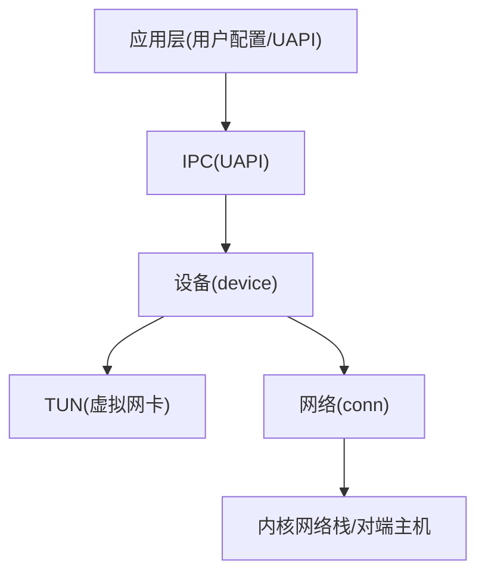
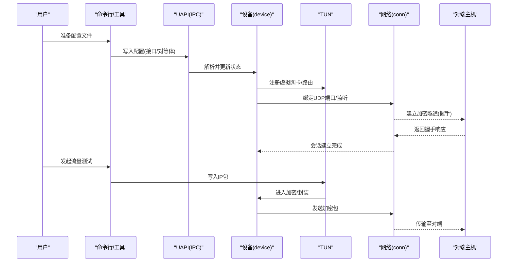
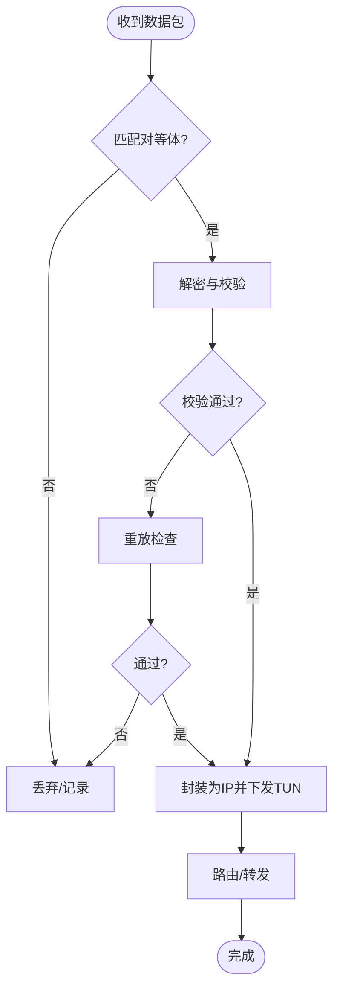
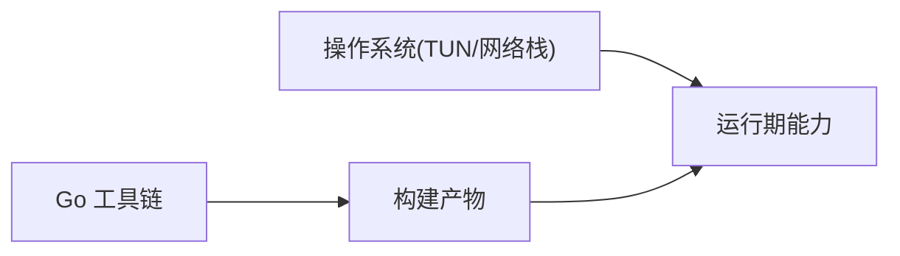

# 快速开始

<cite>
**本文引用的文件**
- [README.md](file://README.md)
- [readme_cn.md](file://readme_cn.md)
- [main.go](file://main.go)
- [main_windows.go](file://main_windows.go)
- [version.go](file://version.go)
- [Makefile](file://Makefile)
- [go.mod](file://go.mod)
- [device/device.go](file://device/device.go)
- [device/uapi.go](file://device/uapi.go)
- [tun/tun_linux.go](file://tun/tun_linux.go)
- [tun/tun_windows.go](file://tun/tun_windows.go)
- [ipc/uapi_unix.go](file://ipc/uapi_unix.go)
- [ipc/uapi_windows.go](file://ipc/uapi_windows.go)
</cite>

## 目录
1. [简介](#简介)
2. [项目结构](#项目结构)
3. [核心组件](#核心组件)
4. [架构总览](#架构总览)
5. [详细组件分析](#详细组件分析)
6. [依赖关系分析](#依赖关系分析)
7. [性能注意事项](#性能注意事项)
8. [故障排除指南](#故障排除指南)
9. [结论](#结论)
10. [附录](#附录)

## 简介
本指南面向初次接触 WireGuard-Go 的用户，提供从安装到基本使用的完整路径。你将学会：
- 通过源码编译或下载预编译二进制的方式安装
- 在 Linux、Windows 等系统上运行并创建虚拟网卡
- 配置客户端与服务端并完成点对点连接
- 扩展为多节点网络
- 排查常见问题与优化建议

本指南同时兼顾初学者与高级用户：基础部分逐步引导，高级部分提供可自定义的参数与扩展点。

## 项目结构
WireGuard-Go 采用分层模块化设计，核心职责划分清晰：
- device：实现 WireGuard 协议栈（密钥协商、加密隧道、对等体管理、计时器、收发队列等）
- tun：跨平台 TUN/TAP 抽象，负责将数据包注入/捕获操作系统内核网络栈
- ipc：UAPI 接口，供外部进程通过标准输入输出或命名管道与守护进程通信
- conn：网络套接字绑定与特性探测（如 GSO、标记等）
- ratelimiter/replay/tai64n/rwcancel：辅助模块（限速、重放保护、时间戳、读写取消）
- main/main_windows：程序入口与平台初始化

图表来源
- [device/device.go:1-200](file://device/device.go#L1-L200)
- [tun/tun_linux.go:1-120](file://tun/tun_linux.go#L1-L120)
- [tun/tun_windows.go:1-120](file://tun/tun_windows.go#L1-L120)
- [ipc/uapi_unix.go:1-120](file://ipc/uapi_unix.go#L1-L120)
- [ipc/uapi_windows.go:1-120](file://ipc/uapi_windows.go#L1-L120)

章节来源
- [main.go:1-120](file://main.go#L1-L120)
- [main_windows.go:1-120](file://main_windows.go#L1-L120)
- [device/device.go:1-200](file://device/device.go#L1-L200)
- [tun/tun_linux.go:1-120](file://tun/tun_linux.go#L1-L120)
- [tun/tun_windows.go:1-120](file://tun/tun_windows.go#L1-L120)
- [ipc/uapi_unix.go:1-120](file://ipc/uapi_unix.go#L1-L120)
- [ipc/uapi_windows.go:1-120](file://ipc/uapi_windows.go#L1-L120)

## 核心组件
- 设备(device)：维护对等体列表、密钥对、会话状态、定时器、发送/接收流水线，是协议栈的核心。
- TUN：封装不同平台的虚拟网卡操作，使上层无需关心底层差异。
- IPC(UAPI)：提供标准 I/O 或命名管道的控制通道，用于动态配置与查询。
- 网络(conn)：负责 UDP 套接字绑定、端口复用、GSO/标记等特性。
- 辅助模块：ratelimiter 防滥用、replay 抗重放、tai64n 高精度时间、rwcancel 取消 IO。

章节来源
- [device/device.go:1-200](file://device/device.go#L1-L200)
- [device/uapi.go:1-200](file://device/uapi.go#L1-L200)
- [tun/tun_linux.go:1-120](file://tun/tun_linux.go#L1-L120)
- [tun/tun_windows.go:1-120](file://tun/tun_windows.go#L1-L120)
- [ipc/uapi_unix.go:1-120](file://ipc/uapi_unix.go#L1-L120)
- [ipc/uapi_windows.go:1-120](file://ipc/uapi_windows.go#L1-L120)

## 架构总览
下图展示了从配置到数据转发的端到端流程：

图表来源
- [device/device.go:1-200](file://device/device.go#L1-L200)
- [device/uapi.go:1-200](file://device/uapi.go#L1-L200)
- [tun/tun_linux.go:1-120](file://tun/tun_linux.go#L1-L120)
- [tun/tun_windows.go:1-120](file://tun/tun_windows.go#L1-L120)
- [ipc/uapi_unix.go:1-120](file://ipc/uapi_unix.go#L1-L120)
- [ipc/uapi_windows.go:1-120](file://ipc/uapi_windows.go#L1-L120)

## 详细组件分析

### 安装与运行
- 从源码编译
  - 使用 Makefile 构建目标，生成可执行文件。
  - 或使用 Go 工具链直接构建。
- 预编译二进制
  - 参考仓库说明获取对应平台的预编译版本。
- 运行方式
  - 以管理员/root 权限启动，以便创建 TUN 设备。
  - 通过 UAPI 写入配置，或通过命令行参数指定配置源。

章节来源
- [Makefile:1-200](file://Makefile#L1-L200)
- [README.md:1-200](file://README.md#L1-L200)
- [readme_cn.md:1-200](file://readme_cn.md#L1-L200)
- [main.go:1-120](file://main.go#L1-L120)
- [main_windows.go:1-120](file://main_windows.go#L1-L120)

### 基本用法：客户端与服务端
- 服务端
  - 生成私钥与公钥
  - 配置监听端口、私钥、允许的 IP 段
  - 启动服务并暴露 UDP 端口
- 客户端
  - 生成私钥与公钥
  - 配置对端地址、公钥、允许的 IP 段
  - 启动后与服务器建立隧道

提示：具体字段与语法请参考 UAPI 文档与示例配置位置。

章节来源
- [device/uapi.go:1-200](file://device/uapi.go#L1-L200)
- [ipc/uapi_unix.go:1-120](file://ipc/uapi_unix.go#L1-L120)
- [ipc/uapi_windows.go:1-120](file://ipc/uapi_windows.go#L1-L120)

### 配置文件关键参数说明
- 接口(Interface)
  - 私钥：用于密钥协商的本地私钥
  - 监听端口：本机 UDP 监听端口
  - 允许 IP：该接口可路由的 IP/CIDR 范围
- 对等体(Peer)
  - 公钥：对端的公钥
  - 对端地址：远端可达的 IP:Port
  - 允许 IP：该对等体可访问的 IP/CIDR 范围
  - 持久保持心跳：保活间隔
  - 前置/后置脚本：事件钩子（可选）
- 其他
  - 路由策略：结合系统路由表与 TUN 配置
  - 日志级别：调试与排错

注意：以上为通用语义说明，具体键名与行为以 UAPI 定义为准。

章节来源
- [device/uapi.go:1-200](file://device/uapi.go#L1-L200)
- [ipc/uapi_unix.go:1-120](file://ipc/uapi_unix.go#L1-L120)
- [ipc/uapi_windows.go:1-120](file://ipc/uapi_windows.go#L1-L120)

### 常见场景演示
- 点对点连接
  - 两端各生成密钥对，互填对方公钥与地址，配置允许 IP 互通。
- 多节点网络
  - 中心节点作为“服务器”，多个客户端分别配置指向中心；或采用 Mesh 拓扑，节点间两两配置。
- NAT/防火墙穿透
  - 启用 Keepalive，确保 NAT 映射存活；必要时调整 MTU 与分片策略。

章节来源
- [device/device.go:1-200](file://device/device.go#L1-L200)
- [device/uapi.go:1-200](file://device/uapi.go#L1-L200)

### 数据流与处理逻辑

图表来源
- [device/device.go:1-200](file://device/device.go#L1-L200)
- [device/receive.go:1-200](file://device/receive.go#L1-L200)
- [device/send.go:1-200](file://device/send.go#L1-L200)

## 依赖关系分析
- 运行时依赖
  - 操作系统支持 TUN 设备（Linux、Windows、macOS、BSD 等）
  - 需要管理员/root 权限以创建/管理 TUN
- 构建依赖
  - Go 工具链
  - Makefile 提供的构建目标
- 平台差异
  - Windows 使用命名管道进行 UAPI 通信
  - Unix-like 使用标准 I/O 或 socket

图表来源
- [go.mod:1-200](file://go.mod#L1-L200)
- [Makefile:1-200](file://Makefile#L1-L200)
- [tun/tun_linux.go:1-120](file://tun/tun_linux.go#L1-L120)
- [tun/tun_windows.go:1-120](file://tun/tun_windows.go#L1-L120)
- [ipc/uapi_windows.go:1-120](file://ipc/uapi_windows.go#L1-L120)

章节来源
- [go.mod:1-200](file://go.mod#L1-L200)
- [Makefile:1-200](file://Makefile#L1-L200)

## 性能注意事项
- 合理设置 MTU，避免分片导致吞吐下降
- 启用 Keepalive 维持 NAT 映射，降低握手开销
- 在高并发场景下关注队列长度与内存占用
- 利用系统特性（如 GSO）提升转发效率（受平台支持影响）
- 日志级别按需调整，生产环境减少冗余输出

[本节为通用指导，不直接引用具体文件]

## 故障排除指南
- 无法创建 TUN 设备
  - 确认以管理员/root 权限运行
  - 检查系统是否加载了必要的内核模块或驱动
- 无法绑定端口
  - 确认端口未被占用，且具备绑定权限
- 无法建立隧道
  - 核对双方公钥、对端地址、端口是否正确
  - 检查防火墙/NAT 规则是否放行 UDP
- 频繁断连
  - 调整 Keepalive 间隔
  - 检查中间网络设备是否丢弃空闲连接
- 速度慢/丢包
  - 调整 MTU
  - 关闭不必要的日志
  - 评估链路质量与拥塞情况

章节来源
- [tun/tun_linux.go:1-120](file://tun/tun_linux.go#L1-L120)
- [tun/tun_windows.go:1-120](file://tun/tun_windows.go#L1-L120)
- [device/device.go:1-200](file://device/device.go#L1-L200)
- [device/uapi.go:1-200](file://device/uapi.go#L1-L200)

## 结论
通过本指南，你可以快速完成 WireGuard-Go 的安装、配置与基本使用，并理解其核心组件与数据流。对于更复杂的网络拓扑与性能调优，可基于 UAPI 与设备状态进行扩展与定制。建议在正式环境前充分测试连通性与稳定性。

[本节为总结性内容，不直接引用具体文件]

## 附录

### 从源码编译
- 使用 Makefile 构建
- 使用 Go 工具链构建
- 交叉编译与平台适配

章节来源
- [Makefile:1-200](file://Makefile#L1-L200)
- [go.mod:1-200](file://go.mod#L1-L200)

### 预编译二进制
- 获取对应平台的预编译版本
- 验证版本与签名（如有）
- 赋予执行权限并运行

章节来源
- [README.md:1-200](file://README.md#L1-L200)
- [readme_cn.md:1-200](file://readme_cn.md#L1-L200)

### 版本信息
- 查看当前构建版本与平台信息

章节来源
- [version.go:1-200](file://version.go#L1-L200)