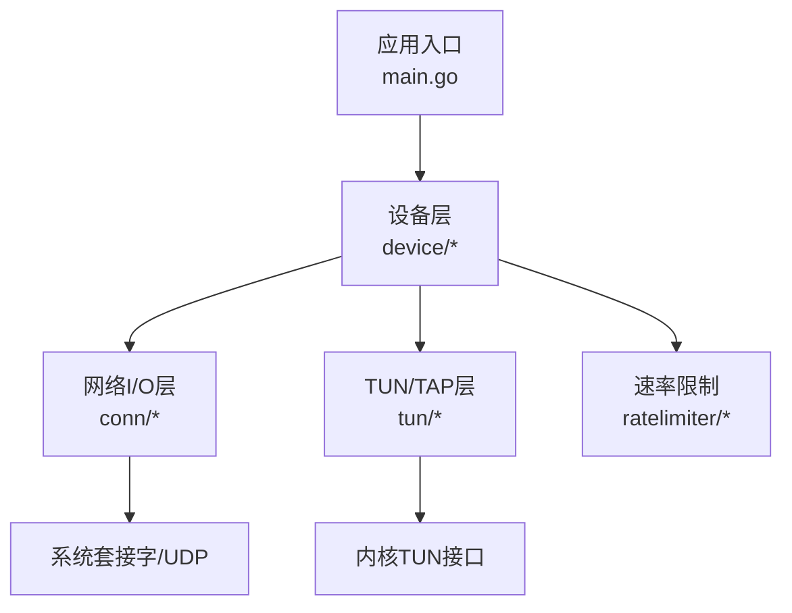
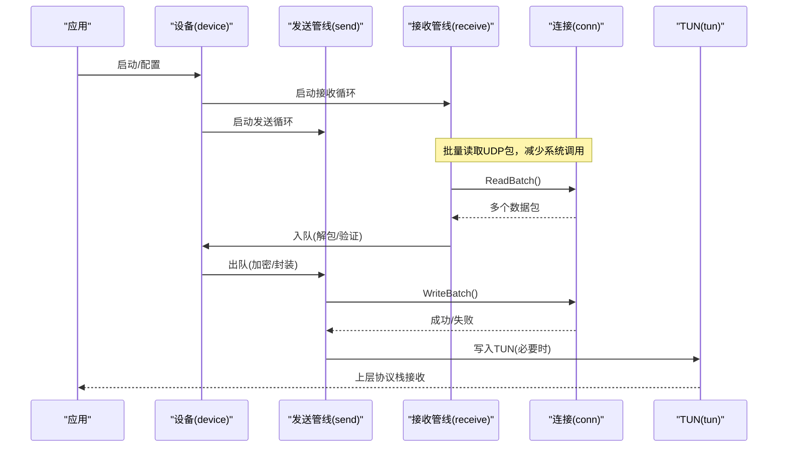
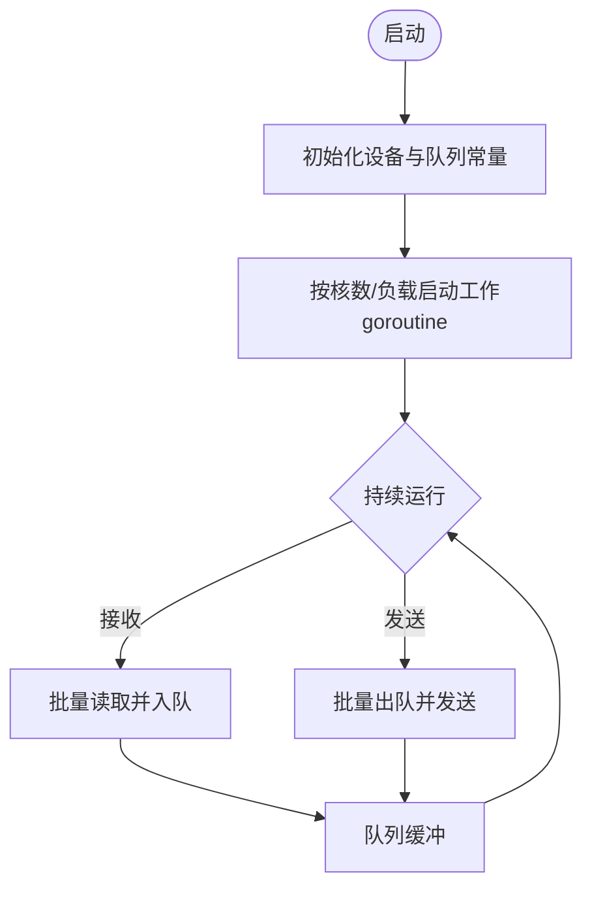
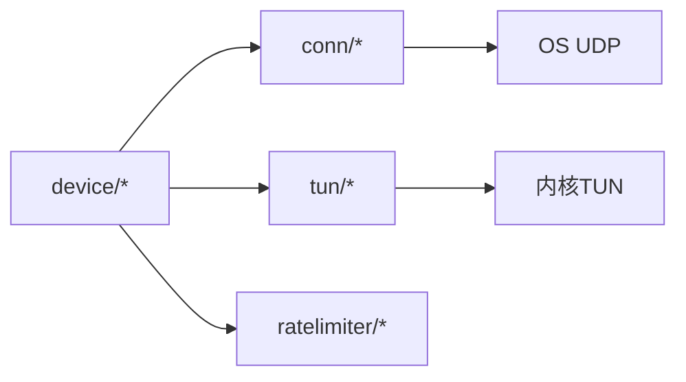

# CPU优化

<cite>
**本文引用的文件**
- [main.go](file://main.go)
- [device/device.go](file://device/device.go)
- [device/send.go](file://device/send.go)
- [device/receive.go](file://device/receive.go)
- [device/pools.go](file://device/pools.go)
- [device/queueconstants_default.go](file://device/queueconstants_default.go)
- [conn/conn.go](file://conn/conn.go)
- [conn/bind_std.go](file://conn/bind_std.go)
- [tun/tun_linux.go](file://tun/tun_linux.go)
- [ratelimiter/ratelimiter.go](file://ratelimiter/ratelimiter.go)
</cite>

## 目录
1. [简介](#简介)
2. [项目结构](#项目结构)
3. [核心组件](#核心组件)
4. [架构总览](#架构总览)
5. [详细组件分析](#详细组件分析)
6. [依赖关系分析](#依赖关系分析)
7. [性能考量](#性能考量)
8. [故障排查指南](#故障排查指南)
9. [结论](#结论)
10. [附录](#附录)

## 简介
本文件聚焦于在WireGuard-Go中实现CPU优化的实践与策略，涵盖goroutine调度优化、CPU亲和性设置、多核利用与负载均衡、锁竞争优化与无锁数据结构、缓存友好的数据布局、上下文切换优化与减少策略、以及CPU性能分析与profiling方法。文档同时给出在高并发场景下的最佳实践建议，帮助读者在不牺牲安全与正确性的前提下获得更高的吞吐与更低的延迟。

## 项目结构
本项目采用分层模块化组织：设备层负责加密/解密、队列与定时器；网络I/O层负责绑定套接字与系统调用；TUN/TAP层负责内核接口；辅助模块提供速率限制等能力。CPU优化贯穿这些层次，重点体现在：
- 设备层的并发模型与队列容量配置
- I/O层的批量读写与零拷贝路径
- TUN层的批处理与GSO/TSO卸载
- 全局资源池与对象复用降低分配开销

图表来源
- [main.go:1-200](file://main.go#L1-L200)
- [device/device.go:1-200](file://device/device.go#L1-L200)
- [conn/conn.go:1-200](file://conn/conn.go#L1-L200)
- [tun/tun_linux.go:1-200](file://tun/tun_linux.go#L1-L200)

章节来源
- [main.go:1-200](file://main.go#L1-L200)
- [device/device.go:1-200](file://device/device.go#L1-L200)
- [conn/conn.go:1-200](file://conn/conn.go#L1-L200)
- [tun/tun_linux.go:1-200](file://tun/tun_linux.go#L1-L200)

## 核心组件
- 设备与对端管理：维护对端状态、密钥对、定时器与队列，是CPU调度的核心单元。
- 发送/接收管线：将数据包从网络侧或TUN侧进入，进行加/解密并转发到对端或上层协议栈。
- 连接绑定：封装不同平台的UDP绑定与特性探测（如GSO）。
- TUN驱动：平台相关的TUN读写与卸载能力（Linux下GSO/TSO）。
- 资源池：预分配与复用常见对象，减少GC压力与分配热点。
- 速率限制：基于令牌桶的限速器，避免突发流量导致CPU抖动。

章节来源
- [device/device.go:1-200](file://device/device.go#L1-L200)
- [device/send.go:1-200](file://device/send.go#L1-L200)
- [device/receive.go:1-200](file://device/receive.go#L1-L200)
- [conn/conn.go:1-200](file://conn/conn.go#L1-L200)
- [tun/tun_linux.go:1-200](file://tun/tun_linux.go#L1-L200)
- [device/pools.go:1-200](file://device/pools.go#L1-L200)
- [ratelimiter/ratelimiter.go:1-200](file://ratelimiter/ratelimiter.go#L1-L200)

## 架构总览
下图展示数据包从TUN/网络进入，经设备层加/解密，再回到TUN/网络的完整路径，标注了关键CPU优化点（批处理、零拷贝、队列容量、卸载）。

图表来源
- [device/receive.go:1-200](file://device/receive.go#L1-L200)
- [device/send.go:1-200](file://device/send.go#L1-L200)
- [conn/conn.go:1-200](file://conn/conn.go#L1-L200)
- [tun/tun_linux.go:1-200](file://tun/tun_linux.go#L1-L200)

## 详细组件分析

### goroutine调度优化与多核利用
- 每设备一个主goroutine协调对端与定时器，发送/接收使用固定数量的工作goroutine，避免动态创建销毁带来的调度开销。
- 通过队列常量控制缓冲大小，匹配CPU核数与内存带宽，减少阻塞与抢占。
- 使用对象池减少频繁分配导致的GC停顿，提升整体吞吐。

图表来源
- [device/device.go:1-200](file://device/device.go#L1-L200)
- [device/queueconstants_default.go:1-200](file://device/queueconstants_default.go#L1-L200)
- [device/pools.go:1-200](file://device/pools.go#L1-L200)

章节来源
- [device/device.go:1-200](file://device/device.go#L1-L200)
- [device/queueconstants_default.go:1-200](file://device/queueconstants_default.go#L1-L200)
- [device/pools.go:1-200](file://device/pools.go#L1-L200)

### CPU亲和性与NUMA感知
- 在支持的平台可通过操作系统API将工作goroutine绑定到特定CPU核，减少跨核迁移与缓存失效。
- 结合NUMA拓扑，尽量让同一设备的收发工作集落在同一节点，降低跨节点访问延迟。
- 注意亲和性设置的粒度与可移植性，建议在部署脚本或进程管理器中统一配置。

章节来源
- [device/device.go:1-200](file://device/device.go#L1-L200)
- [conn/bind_std.go:1-200](file://conn/bind_std.go#L1-L200)

### 多核负载均衡策略
- 以“每设备一队列”的方式隔离热点，避免单设备拥塞影响其他设备。
- 根据队列长度与CPU利用率动态调整工作goroutine数量，保持低延迟与高吞吐平衡。
- 对于大流量对端，优先将其路由到空闲核，减少争用。

章节来源
- [device/device.go:1-200](file://device/device.go#L1-L200)
- [device/send.go:1-200](file://device/send.go#L1-L200)
- [device/receive.go:1-200](file://device/receive.go#L1-L200)

### 锁竞争优化与无锁数据结构
- 尽量减少共享可变状态的临界区，优先使用通道与队列进行消息传递。
- 对必须共享的状态，采用细粒度锁或原子操作，避免长事务持有锁。
- 在热点路径上尝试无锁队列或环形缓冲，降低锁开销。

章节来源
- [device/device.go:1-200](file://device/device.go#L1-L200)
- [device/send.go:1-200](file://device/send.go#L1-L200)
- [device/receive.go:1-200](file://device/receive.go#L1-L200)

### 缓存友好的数据布局
- 将热点字段紧凑排列，减少伪共享；对齐到缓存行边界，避免跨行访问。
- 使用对象池复用缓冲区，减少碎片化与分配热点。
- 在发送/接收路径中尽量顺序访问内存，提高预取命中率。

章节来源
- [device/pools.go:1-200](file://device/pools.go#L1-L200)
- [device/send.go:1-200](file://device/send.go#L1-L200)
- [device/receive.go:1-200](file://device/receive.go#L1-L200)

### 上下文切换优化与减少策略
- 批量I/O：一次系统调用处理多个包，显著减少syscall次数与上下文切换。
- 固定工作集：为每个设备分配固定goroutine集合，避免频繁创建销毁。
- 合理队列深度：过浅导致忙等，过深增加延迟与内存占用，需按负载调优。

章节来源
- [conn/conn.go:1-200](file://conn/conn.go#L1-L200)
- [device/receive.go:1-200](file://device/receive.go#L1-L200)
- [device/send.go:1-200](file://device/send.go#L1-L200)

### 内核卸载与零拷贝路径
- 在Linux上使用GSO/TSO将分片与校验和计算卸载到网卡，减少CPU参与。
- 尽可能使用零拷贝路径传输数据，避免用户态与内核态之间的多余拷贝。

章节来源
- [tun/tun_linux.go:1-200](file://tun/tun_linux.go#L1-L200)
- [conn/features_linux.go:1-200](file://conn/features_linux.go#L1-L200)

### 速率限制与CPU保护
- 使用令牌桶算法对入/出站流量限速，防止突发流量引发CPU抖动与丢包。
- 将限速与队列深度联动，避免过载时队列膨胀。

章节来源
- [ratelimiter/ratelimiter.go:1-200](file://ratelimiter/ratelimiter.go#L1-L200)
- [device/queueconstants_default.go:1-200](file://device/queueconstants_default.go#L1-L200)

## 依赖关系分析
设备层依赖连接层进行网络I/O，依赖TUN层进行隧道读写，依赖速率限制器进行流量整形。各层之间通过明确的接口交互，便于替换实现与优化。

图表来源
- [device/device.go:1-200](file://device/device.go#L1-L200)
- [conn/conn.go:1-200](file://conn/conn.go#L1-L200)
- [tun/tun_linux.go:1-200](file://tun/tun_linux.go#L1-L200)
- [ratelimiter/ratelimiter.go:1-200](file://ratelimiter/ratelimiter.go#L1-L200)

章节来源
- [device/device.go:1-200](file://device/device.go#L1-L200)
- [conn/conn.go:1-200](file://conn/conn.go#L1-L200)
- [tun/tun_linux.go:1-200](file://tun/tun_linux.go#L1-L200)
- [ratelimiter/ratelimiter.go:1-200](file://ratelimiter/ratelimiter.go#L1-L200)

## 性能考量
- 批处理优先：尽量使用批量读/写，减少系统调用与上下文切换。
- 队列深度调优：依据CPU核数与内存带宽设定合适的队列容量，避免过深或过浅。
- 对象复用：使用对象池减少分配与GC压力，提升稳定吞吐。
- 卸载启用：在支持的平台开启GSO/TSO，降低CPU参与。
- 亲和性设置：将工作goroutine绑定到固定核，减少跨核迁移。
- 速率限制：合理限速，避免突发流量造成抖动。

[本节为通用指导，不直接分析具体文件]

## 故障排查指南
- 高CPU使用率：检查是否未启用批处理、队列过浅导致忙等、或未启用内核卸载。
- 高延迟：检查队列深度是否过大、是否存在锁争用热点、是否频繁跨核迁移。
- 丢包与抖动：检查速率限制是否过严、队列是否溢出、是否缺少亲和性设置。
- 定位工具：使用pprof采集CPU profile，结合火焰图定位热点函数；使用go tool trace观察goroutine调度与系统调用。

章节来源
- [device/device.go:1-200](file://device/device.go#L1-L200)
- [device/send.go:1-200](file://device/send.go#L1-L200)
- [device/receive.go:1-200](file://device/receive.go#L1-L200)
- [conn/conn.go:1-200](file://conn/conn.go#L1-L200)
- [tun/tun_linux.go:1-200](file://tun/tun_linux.go#L1-L200)

## 结论
通过对goroutine调度、队列容量、对象池、批处理I/O、内核卸载与亲和性设置的综合优化，可在高并发场景下显著提升CPU利用率与吞吐，同时降低延迟与抖动。建议在生产环境结合pprof与trace进行持续监控与调优，并根据实际负载动态调整参数。

[本节为总结，不直接分析具体文件]

## 附录
- 常用命令与工具
  - pprof：采集与分析CPU profile，生成火焰图。
  - go tool trace：观察goroutine调度、系统调用与锁等待。
  - perf/top：在Linux上分析CPU热点与上下文切换。
- 部署建议
  - 使用容器或进程管理器设置CPU亲和性。
  - 在支持的平台启用GSO/TSO。
  - 根据核数与内存设置队列深度与worker数量。

[本节为补充信息，不直接分析具体文件]