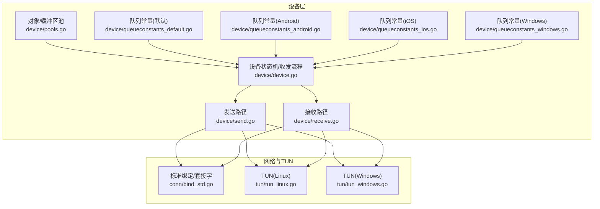
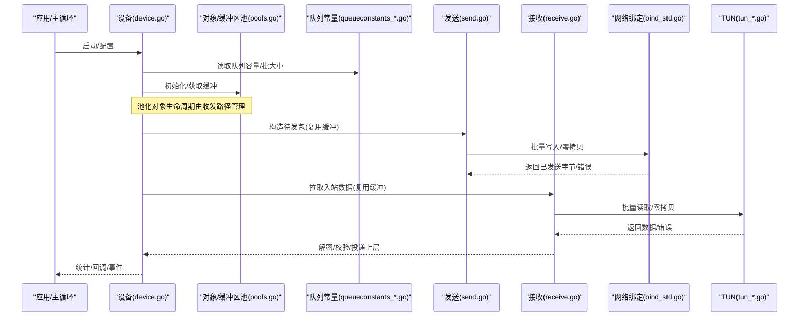
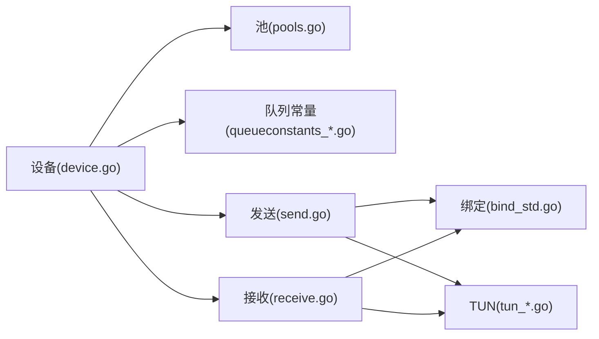

# 内存优化

<cite>
**本文引用的文件**
- [device/pools.go](file://device/pools.go)
- [device/queueconstants_default.go](file://device/queueconstants_default.go)
- [device/queueconstants_android.go](file://device/queueconstants_android.go)
- [device/queueconstants_ios.go](file://device/queueconstants_ios.go)
- [device/queueconstants_windows.go](file://device/queueconstants_windows.go)
- [device/device.go](file://device/device.go)
- [device/send.go](file://device/send.go)
- [device/receive.go](file://device/receive.go)
- [conn/bind_std.go](file://conn/bind_std.go)
- [tun/tun_linux.go](file://tun/tun_linux.go)
- [tun/tun_windows.go](file://tun/tun_windows.go)
- [main.go](file://main.go)
</cite>

## 目录
1. [简介](#简介)
2. [项目结构](#项目结构)
3. [核心组件](#核心组件)
4. [架构总览](#架构总览)
5. [详细组件分析](#详细组件分析)
6. [依赖关系分析](#依赖关系分析)
7. [性能考量](#性能考量)
8. [故障排查指南](#故障排查指南)
9. [结论](#结论)
10. [附录](#附录)

## 简介
本文件聚焦于 WireGuard-Go 的内存优化实践，围绕以下主题展开：
- 内存池与对象池、缓冲区池的设计模式与实现要点
- 队列常量配置参数与调优策略（不同平台）
- 内存分配器的选择与配置选项
- 内存泄漏检测与预防策略
- 内存使用监控与分析工具使用方法
- 不同工作负载下的内存优化技巧
- 高并发场景下的内存管理最佳实践

## 项目结构
本项目在设备层集中实现了内存池与队列缓冲复用机制，并通过平台相关的队列常量进行容量与批大小调优。网络 I/O 与 TUN 层也涉及零拷贝或批量缓冲的使用，进一步降低分配与拷贝开销。

图表来源
- [device/pools.go](file://device/pools.go)
- [device/queueconstants_default.go](file://device/queueconstants_default.go)
- [device/queueconstants_android.go](file://device/queueconstants_android.go)
- [device/queueconstants_ios.go](file://device/queueconstants_ios.go)
- [device/queueconstants_windows.go](file://device/queueconstants_windows.go)
- [device/device.go](file://device/device.go)
- [device/send.go](file://device/send.go)
- [device/receive.go](file://device/receive.go)
- [conn/bind_std.go](file://conn/bind_std.go)
- [tun/tun_linux.go](file://tun/tun_linux.go)
- [tun/tun_windows.go](file://tun/tun_windows.go)

章节来源
- [device/pools.go](file://device/pools.go)
- [device/queueconstants_default.go](file://device/queueconstants_default.go)
- [device/queueconstants_android.go](file://device/queueconstants_android.go)
- [device/queueconstants_ios.go](file://device/queueconstants_ios.go)
- [device/queueconstants_windows.go](file://device/queueconstants_windows.go)
- [device/device.go](file://device/device.go)
- [device/send.go](file://device/send.go)
- [device/receive.go](file://device/receive.go)
- [conn/bind_std.go](file://conn/bind_std.go)
- [tun/tun_linux.go](file://tun/tun_linux.go)
- [tun/tun_windows.go](file://tun/tun_windows.go)

## 核心组件
- 对象/缓冲区池：用于复用加密帧、噪声消息、数据包等高频小对象，减少 GC 压力与系统分配次数。
- 队列常量：定义收发队列、环形缓冲、批处理大小等关键容量参数，按平台差异化设置以适配内核与驱动特性。
- 收发路径：发送与接收侧通过池化缓冲与批量读写，降低锁竞争与内存碎片。
- 绑定与 TUN：在网络与 TUN 层尽量使用零拷贝或批量 I/O，配合池化缓冲提升吞吐并降低延迟抖动。

章节来源
- [device/pools.go](file://device/pools.go)
- [device/send.go](file://device/send.go)
- [device/receive.go](file://device/receive.go)
- [conn/bind_std.go](file://conn/bind_std.go)
- [tun/tun_linux.go](file://tun/tun_linux.go)
- [tun/tun_windows.go](file://tun/tun_windows.go)

## 架构总览
下图展示了从应用入口到设备层、再到网络与 TUN 层的内存流与控制流。池化对象贯穿收发路径，队列常量决定缓冲容量与批大小，从而在不同平台上取得平衡的性能表现。

图表来源
- [device/device.go](file://device/device.go)
- [device/pools.go](file://device/pools.go)
- [device/queueconstants_default.go](file://device/queueconstants_default.go)
- [device/queueconstants_android.go](file://device/queueconstants_android.go)
- [device/queueconstants_ios.go](file://device/queueconstants_ios.go)
- [device/queueconstants_windows.go](file://device/queueconstants_windows.go)
- [device/send.go](file://device/send.go)
- [device/receive.go](file://device/receive.go)
- [conn/bind_std.go](file://conn/bind_std.go)
- [tun/tun_linux.go](file://tun/tun_linux.go)
- [tun/tun_windows.go](file://tun/tun_windows.go)

## 详细组件分析

### 对象/缓冲区池（pools.go）
- 设计目标
  - 复用高频小对象（如加密帧、噪声消息、数据包），降低分配与 GC 频率。
  - 提供线程安全的获取/归还接口，避免锁粒度过大。
  - 支持预分配与按需扩容，兼顾冷启动与峰值负载。
- 关键行为
  - 获取：优先从池中取出空闲对象；若为空则创建新对象。
  - 归还：将对象重置后放回池，确保下次可复用。
  - 清理：在关闭或异常路径中释放所有未归还对象，防止泄漏。
- 复杂度与性能
  - 获取/归还在均摊意义上接近 O(1)。
  - 通过减少分配次数显著降低 GC 停顿与碎片。
- 注意事项
  - 必须严格配对获取与归还，避免悬空引用。
  - 对大对象应谨慎放入池，避免长期驻留导致内存峰值升高。
  - 池大小应与队列容量和并发度匹配，避免过度放大。

章节来源
- [device/pools.go](file://device/pools.go)

### 队列常量与平台差异（queueconstants_*.go）
- 作用
  - 定义收发队列长度、环形缓冲大小、批处理数量等关键容量参数。
  - 针对不同平台（Android/iOS/Windows/默认）调整默认值，以适配内核与驱动特性。
- 调优建议
  - 低延迟场景：适当减小队列长度以降低尾延迟，但需保证不丢包。
  - 高吞吐场景：增大队列与批大小，提高批量 I/O 效率。
  - 内存受限环境：缩小队列与批大小，控制峰值内存占用。
- 平台差异
  - Android/iOS：受限于移动系统与内核限制，通常采用更保守的默认值。
  - Windows：结合 NDIS/TAP 驱动特性，可能需要更大的批大小以获得更好吞吐。
  - 默认：通用 Linux/Unix 环境的折中配置。

章节来源
- [device/queueconstants_default.go](file://device/queueconstants_default.go)
- [device/queueconstants_android.go](file://device/queueconstants_android.go)
- [device/queueconstants_ios.go](file://device/queueconstants_ios.go)
- [device/queueconstants_windows.go](file://device/queueconstants_windows.go)

### 发送路径（send.go）
- 流程要点
  - 从池中获取缓冲，组装加密帧/噪声消息。
  - 根据队列常量进行批量打包，调用网络绑定进行发送。
  - 发送完成后归还缓冲至池，记录统计信息。
- 内存优化点
  - 批量发送减少系统调用次数与锁竞争。
  - 复用缓冲避免频繁分配，降低 GC 压力。
  - 合理设置批大小以平衡延迟与吞吐。

章节来源
- [device/send.go](file://device/send.go)
- [device/pools.go](file://device/pools.go)
- [device/queueconstants_default.go](file://device/queueconstants_default.go)

### 接收路径（receive.go）
- 流程要点
  - 从网络绑定批量读取数据，放入池中分配的缓冲。
  - 解密、校验后投递给上层，随后归还缓冲。
  - 遇到错误或 EOF 时进行资源清理与错误上报。
- 内存优化点
  - 批量读取减少系统调用与上下文切换。
  - 池化缓冲避免重复分配，降低内存碎片。
  - 及时归还缓冲，防止内存泄漏。

章节来源
- [device/receive.go](file://device/receive.go)
- [device/pools.go](file://device/pools.go)
- [device/queueconstants_default.go](file://device/queueconstants_default.go)

### 网络绑定与 TUN（bind_std.go, tun_*.go）
- 绑定层
  - 使用标准库或平台特定实现进行 UDP 收发，支持批量 I/O。
  - 与发送/接收路径协作，尽可能减少拷贝与分配。
- TUN 层
  - Linux/Windows 等平台利用内核能力进行零拷贝或批量读写。
  - 与队列常量协同，控制读写的批次大小与缓冲深度。

章节来源
- [conn/bind_std.go](file://conn/bind_std.go)
- [tun/tun_linux.go](file://tun/tun_linux.go)
- [tun/tun_windows.go](file://tun/tun_windows.go)

### 设备主流程（device.go）
- 职责
  - 协调收发路径、池化对象与队列常量。
  - 维护连接状态、定时器与统计信息。
  - 在启动/关闭阶段完成池与队列的初始化与释放。
- 内存管理
  - 启动时按队列常量预分配必要缓冲。
  - 运行中通过池化对象维持稳定内存占用。
  - 关闭时彻底释放所有资源，避免泄漏。

章节来源
- [device/device.go](file://device/device.go)

## 依赖关系分析
- 组件耦合
  - 设备层依赖池与队列常量，发送/接收路径依赖池与绑定/TUN。
  - 绑定与 TUN 为底层 I/O 抽象，向上提供批量读写能力。
- 外部依赖
  - 操作系统内核与驱动（UDP/TUN/NDIS）影响批大小与零拷贝效果。
  - Go 运行时 GC 与内存分配器（GOGC、Pacer）影响整体内存曲线。
- 潜在风险
  - 队列过大导致内存峰值升高。
  - 池对象未正确归还导致泄漏。
  - 批大小不当导致延迟抖动或吞吐下降。

图表来源
- [device/device.go](file://device/device.go)
- [device/pools.go](file://device/pools.go)
- [device/queueconstants_default.go](file://device/queueconstants_default.go)
- [device/send.go](file://device/send.go)
- [device/receive.go](file://device/receive.go)
- [conn/bind_std.go](file://conn/bind_std.go)
- [tun/tun_linux.go](file://tun/tun_linux.go)
- [tun/tun_windows.go](file://tun/tun_windows.go)

章节来源
- [device/device.go](file://device/device.go)
- [device/pools.go](file://device/pools.go)
- [device/queueconstants_default.go](file://device/queueconstants_default.go)
- [device/send.go](file://device/send.go)
- [device/receive.go](file://device/receive.go)
- [conn/bind_std.go](file://conn/bind_std.go)
- [tun/tun_linux.go](file://tun/tun_linux.go)
- [tun/tun_windows.go](file://tun/tun_windows.go)

## 性能考量
- 批大小与队列长度
  - 高吞吐：增大批大小与队列长度，充分利用内核缓冲与网卡聚合。
  - 低延迟：减小批大小与队列长度，降低排队延迟。
- 零拷贝与批量 I/O
  - 在 Linux/Windows 上尽量使用零拷贝或批量读写，减少用户态拷贝。
- GC 与分配
  - 通过池化对象减少短生命周期分配，降低 GC 频率。
  - 合理设置 GOGC 与启用 Pacer，平滑 GC 停顿。
- 平台差异
  - 移动端（Android/iOS）：保守的队列与批大小，避免内存抖动。
  - 桌面/服务器（Windows/Linux）：更大批大小与队列，追求吞吐。

[本节为通用指导，不直接分析具体文件]

## 故障排查指南
- 常见症状
  - 内存持续增长：检查是否有池对象未归还或队列溢出。
  - 延迟抖动：检查批大小是否过大或队列过深。
  - 吞吐不足：检查批大小与队列长度是否过小，或内核限制。
- 诊断步骤
  - 观察队列常量与池大小的配置是否匹配当前负载。
  - 使用 Go 运行时指标（pprof、memstats）定位热点与峰值。
  - 在发送/接收路径增加日志，追踪缓冲获取与归还情况。
- 修复建议
  - 确保每个获取都有对应归还，必要时在异常路径强制释放。
  - 调整队列常量与批大小，平衡延迟与吞吐。
  - 针对平台特性优化 I/O 路径（如启用零拷贝）。

章节来源
- [device/pools.go](file://device/pools.go)
- [device/send.go](file://device/send.go)
- [device/receive.go](file://device/receive.go)
- [device/queueconstants_default.go](file://device/queueconstants_default.go)

## 结论
WireGuard-Go 通过对象/缓冲区池与平台相关的队列常量，实现了高效的内存管理与 I/O 批处理。在高并发与不同工作负载下，合理配置队列容量与批大小，并结合零拷贝与池化技术，可在保证低延迟的同时提升吞吐。遵循严格的获取/归还规范与平台调优策略，可有效避免内存泄漏与性能抖动。

[本节为总结性内容，不直接分析具体文件]

## 附录

### 内存池与对象池使用要点
- 适用对象
  - 高频、小尺寸、生命周期短的对象（如加密帧、噪声消息、数据包）。
- 使用模式
  - 获取：在发送/接收前从池获取缓冲。
  - 使用：填充数据并进行加密/封装。
  - 归还：发送/接收完成后立即归还，确保可复用。
- 注意事项
  - 避免将大对象放入池，防止长期驻留。
  - 在异常路径也要归还对象，防止泄漏。
  - 池大小应与并发度与队列容量匹配。

章节来源
- [device/pools.go](file://device/pools.go)

### 队列常量配置与调优
- 关键参数
  - 队列长度：影响吞吐与延迟，过大增加内存占用，过小可能丢包。
  - 批大小：影响系统调用次数与 CPU 利用率，需结合内核与驱动特性。
- 平台策略
  - Android/iOS：保守默认值，避免内存抖动。
  - Windows：较大批大小以提升吞吐。
  - 默认：通用折中配置。
- 调优方法
  - 压测不同负载，观察延迟分布与内存曲线。
  - 逐步调整队列长度与批大小，找到最优平衡点。

章节来源
- [device/queueconstants_default.go](file://device/queueconstants_default.go)
- [device/queueconstants_android.go](file://device/queueconstants_android.go)
- [device/queueconstants_ios.go](file://device/queueconstants_ios.go)
- [device/queueconstants_windows.go](file://device/queueconstants_windows.go)

### 内存分配器选择与配置
- Go 运行时
  - GOGC：控制 GC 触发阈值，过高可能导致峰值内存上升，过低增加 GC 频率。
  - Pacer：平滑 GC 停顿，适合实时性要求较高的场景。
- 应用层
  - 使用池化对象减少分配，降低 GC 压力。
  - 避免全局大对象常驻，按需分配与释放。

[本节为通用指导，不直接分析具体文件]

### 内存泄漏检测与预防
- 检测方法
  - 使用 pprof 的 heap 快照对比，定位增长热点。
  - 在关键路径添加日志，追踪对象获取与归还。
- 预防措施
  - 严格配对获取与归还，异常路径也要释放。
  - 定期巡检池大小与队列长度，避免过度放大。
  - 在关闭流程中彻底释放所有资源。

章节来源
- [device/pools.go](file://device/pools.go)
- [device/send.go](file://device/send.go)
- [device/receive.go](file://device/receive.go)

### 内存使用监控与分析工具
- Go 运行时
  - memstats：查看堆、栈、GC 统计。
  - pprof：CPU、内存、阻塞分析。
- 系统级
  - Linux：top、htop、perf、bpftrace。
  - Windows：Performance Monitor、Process Explorer。
- 实践建议
  - 在生产环境开启采样与指标导出。
  - 结合业务指标与内存指标进行关联分析。

[本节为通用指导，不直接分析具体文件]

### 不同工作负载下的优化技巧
- 低延迟
  - 减小队列长度与批大小，避免排队延迟。
  - 使用池化对象减少分配停顿。
- 高吞吐
  - 增大队列长度与批大小，充分利用内核缓冲。
  - 启用零拷贝与批量 I/O。
- 移动设备
  - 保守配置，避免内存抖动与电量消耗。
  - 关注后台任务限制与内核调度策略。

[本节为通用指导，不直接分析具体文件]

### 高并发场景的最佳实践
- 并发模型
  - 每协程独立缓冲，避免共享锁竞争。
  - 使用无锁或细粒度锁的队列与池。
- 资源管理
  - 严格控制池大小与队列长度，防止内存爆炸。
  - 在关闭与异常路径统一释放资源。
- 监控与告警
  - 监控内存峰值与 GC 频率，设置告警阈值。
  - 结合业务指标进行容量规划。

[本节为通用指导，不直接分析具体文件]

### 入口与集成（main.go）
- 作用
  - 程序入口，负责初始化设备、加载配置、启动收发循环。
- 内存相关
  - 在启动时按队列常量与池配置初始化资源。
  - 在退出时释放所有资源，确保无泄漏。

章节来源
- [main.go](file://main.go)