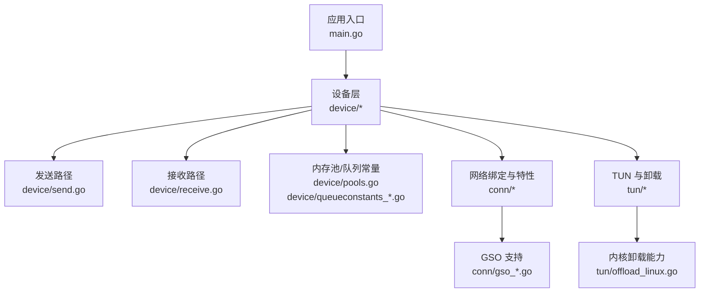
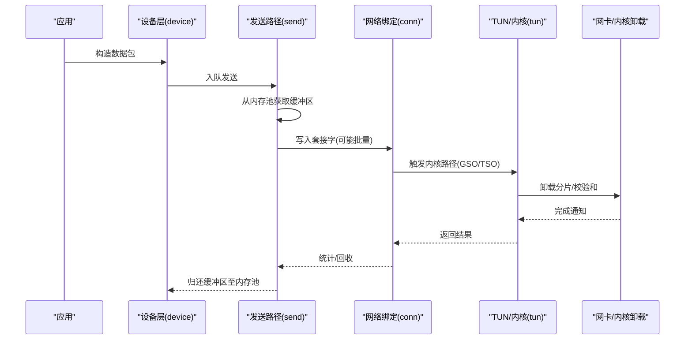
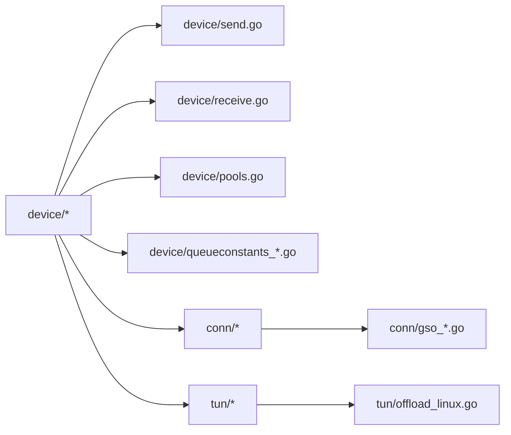

# 性能优化

<cite>
**本文引用的文件**
- [device/pools.go](file://device/pools.go)
- [device/queueconstants_default.go](file://device/queueconstants_default.go)
- [device/send.go](file://device/send.go)
- [device/receive.go](file://device/receive.go)
- [conn/gso_linux.go](file://conn/gso_linux.go)
- [conn/gso_default.go](file://conn/gso_default.go)
- [tun/offload_linux.go](file://tun/offload_linux.go)
- [conn/bind_std.go](file://conn/bind_std.go)
- [conn/features_linux.go](file://conn/features_linux.go)
- [main.go](file://main.go)
</cite>

## 目录
1. [简介](#简介)
2. [项目结构](#项目结构)
3. [核心组件](#核心组件)
4. [架构总览](#架构总览)
5. [详细组件分析](#详细组件分析)
6. [依赖关系分析](#依赖关系分析)
7. [性能考量](#性能考量)
8. [故障排查指南](#故障排查指南)
9. [结论](#结论)
10. [附录](#附录)

## 简介
本指南面向生产环境下的 wireguard-go 性能调优，聚焦以下主题：内存池与内存管理策略、GSO（分段卸载）与 TSO（TCP分段卸载）的优化效果、队列常量配置与调优、CPU 亲和性与 NUMA 感知优化、网络 I/O 监控与分析方法、基准测试方法与工具、不同工作负载下的优化策略。内容基于代码库中的实现与平台相关特性进行系统化梳理，帮助读者在真实场景中取得稳定且可复现的性能收益。

## 项目结构
wireguard-go 将网络栈、设备状态、I/O 绑定与内核卸载能力解耦，便于在不同平台上启用相应的加速路径。与性能密切相关的模块包括：
- device：协议栈核心逻辑、发送/接收路径、内存池与队列常量
- conn：网络套接字绑定、特性探测、GSO 支持
- tun：TUN 设备抽象与内核卸载（如 GSO/TSO）能力暴露
- main：入口与启动流程

图表来源
- [main.go:1-200](file://main.go#L1-L200)
- [device/send.go:1-200](file://device/send.go#L1-L200)
- [device/receive.go:1-200](file://device/receive.go#L1-L200)
- [device/pools.go:1-200](file://device/pools.go#L1-L200)
- [device/queueconstants_default.go:1-200](file://device/queueconstants_default.go#L1-L200)
- [conn/gso_linux.go:1-200](file://conn/gso_linux.go#L1-L200)
- [conn/gso_default.go:1-200](file://conn/gso_default.go#L1-L200)
- [tun/offload_linux.go:1-200](file://tun/offload_linux.go#L1-L200)

章节来源
- [main.go:1-200](file://main.go#L1-L200)

## 核心组件
- 内存池与对象复用：通过集中化的内存池减少分配/释放开销，降低 GC 压力，提升高吞吐场景下的稳定性。
- 队列常量：控制收发环形缓冲大小、批处理粒度等，直接影响延迟与吞吐权衡。
- 发送/接收路径：封装了加密/解密、分片/重组、与内核交互的关键流程。
- GSO/TSO 卸载：在 Linux 等平台利用内核与网卡能力，减少 CPU 参与的数据拷贝与分片计算。
- 特性探测与回退：运行时检测可用能力并选择最优路径，保证兼容性与性能。

章节来源
- [device/pools.go:1-200](file://device/pools.go#L1-L200)
- [device/queueconstants_default.go:1-200](file://device/queueconstants_default.go#L1-L200)
- [device/send.go:1-200](file://device/send.go#L1-L200)
- [device/receive.go:1-200](file://device/receive.go#L1-L200)
- [conn/gso_linux.go:1-200](file://conn/gso_linux.go#L1-L200)
- [conn/gso_default.go:1-200](file://conn/gso_default.go#L1-L200)
- [tun/offload_linux.go:1-200](file://tun/offload_linux.go#L1-L200)

## 架构总览
下图展示了从应用到内核卸载的关键数据流，突出内存池、队列与 GSO/TSO 的作用点。

图表来源
- [device/send.go:1-200](file://device/send.go#L1-L200)
- [device/pools.go:1-200](file://device/pools.go#L1-L200)
- [conn/gso_linux.go:1-200](file://conn/gso_linux.go#L1-L200)
- [tun/offload_linux.go:1-200](file://tun/offload_linux.go#L1-L200)

## 详细组件分析

### 内存池与内存管理策略
- 目标：在高并发/高吞吐下减少频繁分配带来的系统调用与 GC 抖动。
- 关键点：
  - 预分配与复用：为常见大小的缓冲区提供池化存储，避免热点路径上的分配。
  - 生命周期管理：明确“借出-使用-归还”的语义，确保异常路径也能归还资源。
  - 尺寸分类：按典型包大小划分池，减少碎片与浪费。
  - 并发安全：池内部采用无锁或细粒度锁设计，降低争用。
- 调优建议：
  - 根据峰值 QPS 与平均包长估算池容量，预留一定冗余以应对突发。
  - 观察 GC 指标（分配次数、停顿时间），结合压测调整池大小。
  - 对超大包路径考虑独立池或直配策略，避免污染小对象池。

章节来源
- [device/pools.go:1-200](file://device/pools.go#L1-L200)

### 队列常量配置与调优
- 作用：控制发送/接收环形缓冲的大小、批处理阈值等，影响吞吐与延迟。
- 关键维度：
  - 队列长度：越大吞吐越高但延迟增加；过小会导致丢包或阻塞。
  - 批大小：增大批处理可降低系统调用次数，提高吞吐。
  - 背压策略：当队列接近满时的行为（丢弃、等待、限速）。
- 调参方法：
  - 基线设置：使用默认值作为起点，逐步放大队列与批大小。
  - 观测指标：队列占用率、丢包率、端到端延迟、CPU 利用率。
  - 回归验证：每次调整后运行基准测试，确认收益与稳定性。

章节来源
- [device/queueconstants_default.go:1-200](file://device/queueconstants_default.go#L1-L200)

### 发送路径与批处理
- 职责：将加密后的报文组织成可发送的批次，尽可能合并写操作。
- 优化点：
  - 批量写入：减少 writev/sendmsg 调用次数。
  - 零拷贝倾向：配合内核卸载路径，尽量将数据交给内核处理。
  - 错误恢复：对部分失败进行重试或降级。
- 与内存池协作：发送前从池中取缓冲，完成后归还，避免泄漏。

章节来源
- [device/send.go:1-200](file://device/send.go#L1-L200)
- [device/pools.go:1-200](file://device/pools.go#L1-L200)

### 接收路径与批处理
- 职责：从网络读取报文，进行解密、重组与转发。
- 优化点：
  - 批量读取：一次 read 多包，减少系统调用。
  - 快速路径：对已知模式的数据包走最快分支。
  - 内存复用：接收缓冲同样来自内存池，降低分配成本。
- 与队列联动：接收到的包入队给上层处理，注意背压与丢弃策略。

章节来源
- [device/receive.go:1-200](file://device/receive.go#L1-L200)
- [device/pools.go:1-200](file://device/pools.go#L1-L200)

### GSO（分段卸载）与 TSO（TCP分段卸载）
- 概念：
  - GSO：允许应用一次性提交大段数据，由内核/网卡负责分段，减少 CPU 参与。
  - TSO：针对 TCP 的分段卸载，进一步降低 CPU 负担。
- 在代码中的体现：
  - conn 层提供 GSO 的启用与回退逻辑，Linux 平台具备专用实现。
  - tun 层暴露内核卸载能力，供上层决定是否使用。
- 收益：
  - 显著降低 CPU 使用率，尤其在高速链路与大包场景。
  - 提升吞吐，减少上下文切换与拷贝。
- 注意事项：
  - 需要内核与网卡驱动支持；不支持时自动回退。
  - 与 MTU、路径中间设备兼容性需关注。

章节来源
- [conn/gso_linux.go:1-200](file://conn/gso_linux.go#L1-L200)
- [conn/gso_default.go:1-200](file://conn/gso_default.go#L1-L200)
- [tun/offload_linux.go:1-200](file://tun/offload_linux.go#L1-L200)

### 特性探测与回退机制
- 目的：在不支持某些加速能力的平台上优雅降级，保证功能正确性。
- 做法：
  - 运行时探测内核/驱动能力（如 GSO/TSO）。
  - 根据结果选择最优路径，必要时回退到通用路径。
- 价值：兼顾性能与兼容性，避免在生产环境出现不可预期的退化。

章节来源
- [conn/features_linux.go:1-200](file://conn/features_linux.go#L1-L200)

### CPU 亲和性与 NUMA 感知
- CPU 亲和性：
  - 将关键线程绑定到特定 CPU 核，减少缓存失效与迁移开销。
  - 建议将收发线程、加密线程分别绑定到不同核，避免争用。
- NUMA 感知：
  - 在 NUMA 架构上，优先使用本地内存节点，减少跨节点访问延迟。
  - 内存池与队列应尽量在本地节点分配，避免远端访问。
- 实践要点：
  - 使用系统提供的亲和性 API（如 sched_setaffinity）进行绑定。
  - 结合 NUMA 拓扑信息（如 numactl）规划线程与内存分配。
  - 通过 perf/top 等工具验证绑定效果与缓存命中率。

[本节为通用指导，不直接分析具体文件]

### 网络 I/O 性能监控与分析
- 指标：
  - 吞吐（bps/Mbps）、延迟（p50/p95/p99）、丢包率、重传率。
  - CPU 使用率、上下文切换、页缺失、GC 停顿。
- 工具：
  - 系统级：perf、top、pidstat、netstat/ss、ethtool。
  - 内核追踪：bpftrace、ftrace、eBPF 脚本。
  - 应用级：埋点日志、自定义计数器（队列占用、池命中率）。
- 分析方法：
  - 建立基线，对比优化前后差异。
  - 定位瓶颈：CPU、内存、I/O、内核路径。
  - 结合 eBPF 深入分析系统调用与内核态耗时。

[本节为通用指导，不直接分析具体文件]

### 基准测试方法与工具
- 目标：量化优化效果，确保改进有效且不引入退化。
- 方法：
  - 单流/多流吞吐测试：模拟不同带宽与包大小分布。
  - 延迟测试：测量端到端 RTT 与 P99 尾延迟。
  - 混合负载：小包+大包、突发流量、长连接。
- 工具：
  - 网络基准：iperf3、qperf、pktgen。
  - 自定义压测：基于 wireguard-go 的测试套件或自研脚本。
- 报告：
  - 记录环境信息（内核版本、驱动、CPU、NUMA 拓扑）。
  - 输出关键指标与趋势图，便于回归比较。

[本节为通用指导，不直接分析具体文件]

### 不同工作负载下的优化策略
- 小包高频（如 DNS/信令）：
  - 减小队列与批大小以降低延迟。
  - 开启零拷贝/GSO（若适用）以减少拷贝。
  - 关注 GC 与锁竞争，必要时分离热点路径。
- 大包高吞吐（如文件传输）：
  - 增大队列与批大小，充分利用带宽。
  - 启用 GSO/TSO，降低 CPU 占用。
  - 关注内存占用与 NUMA 本地分配。
- 混合/突发负载：
  - 动态调整队列与批大小，平衡延迟与吞吐。
  - 加强背压与丢弃策略，防止雪崩。
  - 监控尾部延迟，避免长尾问题。

[本节为通用指导，不直接分析具体文件]

### 生产环境调优指导
- 启动前：
  - 确认内核与驱动支持 GSO/TSO，检查 MTU 与路径兼容性。
  - 规划 CPU 亲和与 NUMA 布局，预热内存池。
- 运行中：
  - 持续监控关键指标，设置告警阈值。
  - 定期执行基准测试，回归验证变更。
- 变更后：
  - 灰度发布，观察线上指标变化。
  - 保留回滚方案，确保稳定性。

[本节为通用指导，不直接分析具体文件]

## 依赖关系分析
- 模块耦合：
  - device 层依赖 conn 的网络绑定与特性探测，以及 tun 的卸载能力。
  - send/receive 路径依赖内存池与队列常量，形成紧密协作。
- 外部依赖：
  - 内核与网卡驱动对 GSO/TSO 的支持决定最终性能上限。
  - 操作系统提供的亲和性 API 与 NUMA 工具链影响调优空间。
- 潜在风险：
  - 过度依赖卸载能力可能导致兼容性问题，需做好回退。
  - 队列过大可能引发内存压力，需结合监控动态调整。

图表来源
- [device/send.go:1-200](file://device/send.go#L1-L200)
- [device/receive.go:1-200](file://device/receive.go#L1-L200)
- [device/pools.go:1-200](file://device/pools.go#L1-L200)
- [device/queueconstants_default.go:1-200](file://device/queueconstants_default.go#L1-L200)
- [conn/gso_linux.go:1-200](file://conn/gso_linux.go#L1-L200)
- [conn/gso_default.go:1-200](file://conn/gso_default.go#L1-L200)
- [tun/offload_linux.go:1-200](file://tun/offload_linux.go#L1-L200)

章节来源
- [device/send.go:1-200](file://device/send.go#L1-L200)
- [device/receive.go:1-200](file://device/receive.go#L1-L200)
- [device/pools.go:1-200](file://device/pools.go#L1-L200)
- [device/queueconstants_default.go:1-200](file://device/queueconstants_default.go#L1-L200)
- [conn/gso_linux.go:1-200](file://conn/gso_linux.go#L1-L200)
- [conn/gso_default.go:1-200](file://conn/gso_default.go#L1-L200)
- [tun/offload_linux.go:1-200](file://tun/offload_linux.go#L1-L200)

## 性能考量
- 内存池：合理尺寸与生命周期管理是降低 GC 与分配开销的关键。
- 队列常量：根据负载特征调整，平衡延迟与吞吐。
- GSO/TSO：在支持环境下显著提升性能，需关注兼容性与回退。
- CPU/NUMA：亲和与本地分配减少延迟与抖动。
- 监控与基准：持续度量与回归验证确保优化有效。

[本节为通用指导，不直接分析具体文件]

## 故障排查指南
- 常见问题：
  - 高延迟：检查队列是否过小、批大小是否过低、是否存在锁竞争。
  - 低吞吐：确认 GSO/TSO 是否启用、网卡驱动是否支持、MTU 是否合适。
  - 内存压力：观察内存池命中率与 GC 频率，调整池大小与回收策略。
- 诊断步骤：
  - 使用 perf/top 定位热点函数与系统调用。
  - 通过 ethtool 查看网卡卸载能力与统计。
  - 结合 eBPF 追踪内核路径耗时与丢包原因。
- 回退策略：
  - 禁用 GSO/TSO 验证是否为卸载路径导致的问题。
  - 降低队列与批大小，观察延迟与吞吐变化。

章节来源
- [conn/gso_linux.go:1-200](file://conn/gso_linux.go#L1-L200)
- [conn/gso_default.go:1-200](file://conn/gso_default.go#L1-L200)
- [tun/offload_linux.go:1-200](file://tun/offload_linux.go#L1-L200)

## 结论
通过内存池与队列常量的精细化配置、GSO/TSO 的合理利用、CPU 亲和与 NUMA 感知的优化，以及完善的监控与基准体系，可以在生产环境中获得稳定且可复现的性能提升。建议在每次变更后进行回归测试，并结合线上监控持续迭代优化。

[本节为总结性内容，不直接分析具体文件]

## 附录
- 常用命令参考：
  - 亲和性：taskset、numactl
  - 性能分析：perf top、perf stat、pidstat
  - 网络统计：ss、ethtool -k
- 环境变量与配置：
  - 根据平台与需求调整队列常量与批大小。
  - 在支持的平台启用 GSO/TSO，并在不支持时回退。

[本节为补充信息，不直接分析具体文件]