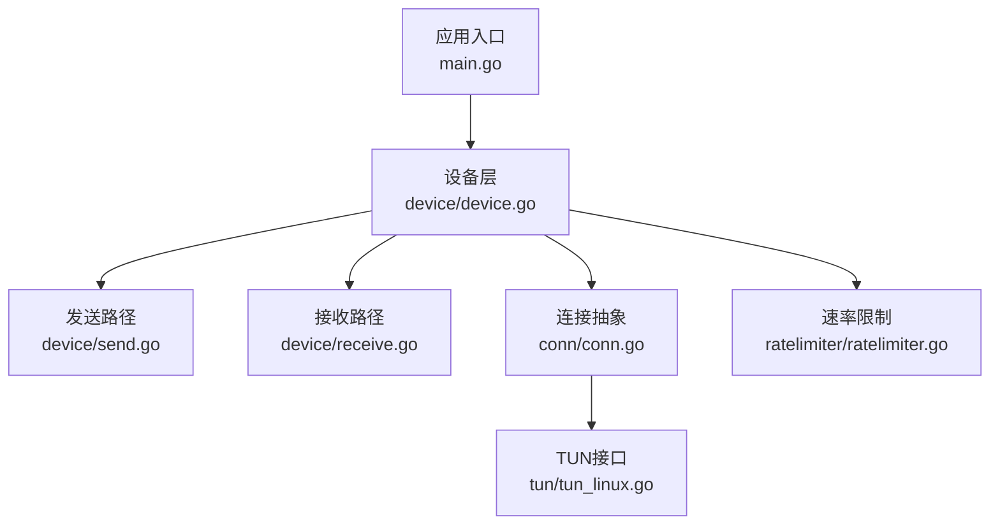
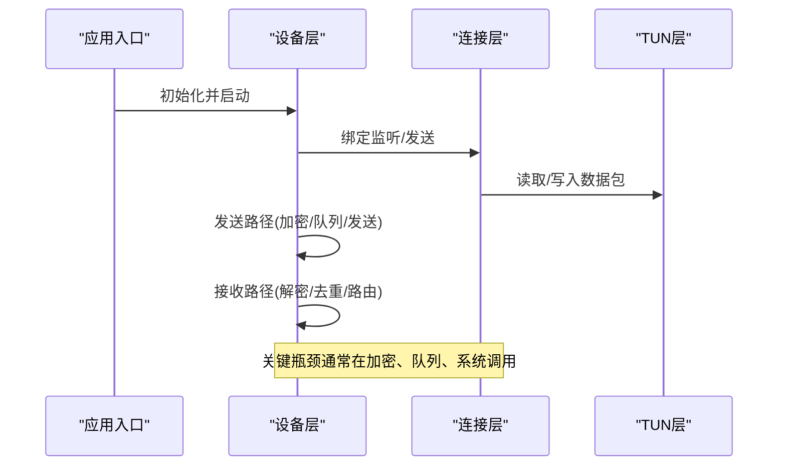
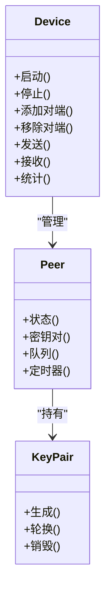
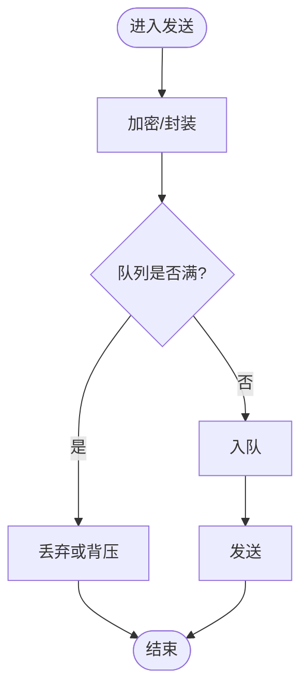
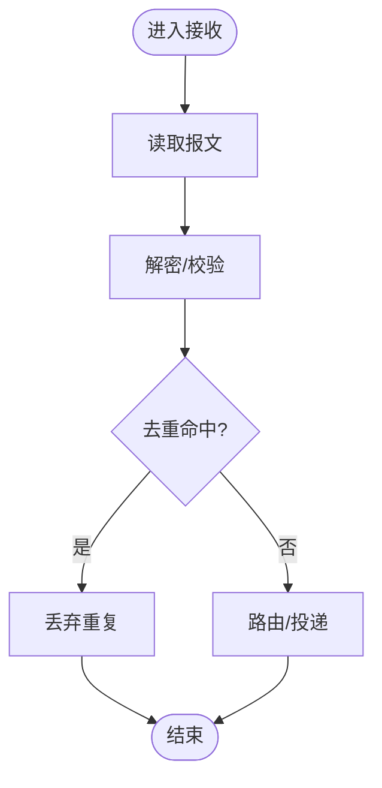
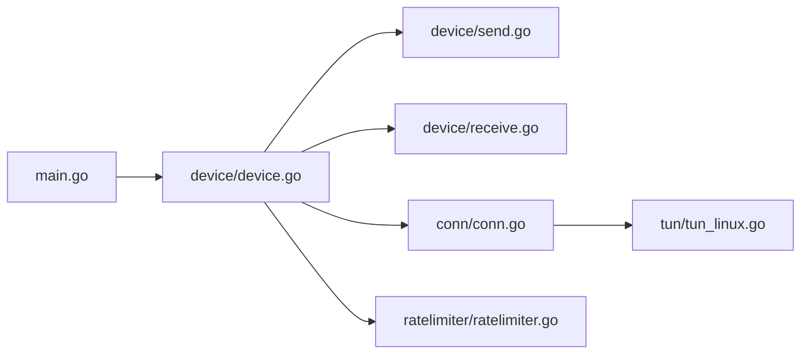

# 性能监控与分析

<cite>
**本文引用的文件**
- [main.go](file://main.go)
- [device/device.go](file://device/device.go)
- [device/send.go](file://device/send.go)
- [device/receive.go](file://device/receive.go)
- [conn/conn.go](file://conn/conn.go)
- [tun/tun_linux.go](file://tun/tun_linux.go)
- [ratelimiter/ratelimiter.go](file://ratelimiter/ratelimiter.go)
- [Makefile](file://Makefile)
- [go.mod](file://go.mod)
</cite>

## 目录
1. [简介](#简介)
2. [项目结构](#项目结构)
3. [核心组件](#核心组件)
4. [架构总览](#架构总览)
5. [详细组件分析](#详细组件分析)
6. [依赖关系分析](#依赖关系分析)
7. [性能考量](#性能考量)
8. [故障排查指南](#故障排查指南)
9. [结论](#结论)
10. [附录](#附录)

## 简介
本指南面向wireguard-go的性能监控与优化，围绕关键性能指标（KPI）定义、基准测试构建与执行、分析工具使用（pprof、trace）、性能回归检测与问题定位、生产环境最佳实践、数据收集存储与可视化方案，以及系统化诊断方法论展开。文档结合代码仓库中的设备层、连接层、TUN驱动与速率限制等核心模块，提供可操作的落地建议。

## 项目结构
wireguard-go采用分层设计：应用入口负责启动与配置；设备层实现WireGuard协议栈的核心逻辑（加密、密钥交换、队列管理、定时器、对端状态等）；连接层抽象网络套接字绑定与特性探测；TUN层对接内核隧道接口；辅助模块包括速率限制、重放保护、时间戳等。

图表来源
- [main.go:1-200](file://main.go#L1-L200)
- [device/device.go:1-200](file://device/device.go#L1-L200)
- [device/send.go:1-200](file://device/send.go#L1-L200)
- [device/receive.go:1-200](file://device/receive.go#L1-L200)
- [conn/conn.go:1-200](file://conn/conn.go#L1-L200)
- [tun/tun_linux.go:1-200](file://tun/tun_linux.go#L1-L200)
- [ratelimiter/ratelimiter.go:1-200](file://ratelimiter/ratelimiter.go#L1-L200)

章节来源
- [main.go:1-200](file://main.go#L1-L200)
- [device/device.go:1-200](file://device/device.go#L1-L200)
- [conn/conn.go:1-200](file://conn/conn.go#L1-L200)
- [tun/tun_linux.go:1-200](file://tun/tun_linux.go#L1-L200)
- [ratelimiter/ratelimiter.go:1-200](file://ratelimiter/ratelimiter.go#L1-L200)

## 核心组件
- 设备层（device）：封装WireGuard协议栈，维护对端表、密钥对、队列、定时器、Cookie验证等，是吞吐、时延、CPU占用的主要影响点。
- 发送路径（send）：负责数据包封装、加密、分片、队列调度与发送。
- 接收路径（receive）：负责解封装、解密、去重、路由与上送。
- 连接层（conn）：抽象UDP/TCP等传输绑定、GSO/GRO、标记、粘性路由等特性。
- TUN层（tun）：与内核TUN交互，处理零拷贝、校验和卸载、批量读写等。
- 速率限制（ratelimiter）：控制ICMP等控制报文频率，避免滥用。

章节来源
- [device/device.go:1-200](file://device/device.go#L1-L200)
- [device/send.go:1-200](file://device/send.go#L1-L200)
- [device/receive.go:1-200](file://device/receive.go#L1-L200)
- [conn/conn.go:1-200](file://conn/conn.go#L1-L200)
- [tun/tun_linux.go:1-200](file://tun/tun_linux.go#L1-L200)
- [ratelimiter/ratelimiter.go:1-200](file://ratelimiter/ratelimiter.go#L1-L200)

## 架构总览
下图展示从用户态到内核的关键调用链，突出性能敏感点：应用入口初始化设备，设备通过连接层读写TUN，收发路径分别进行加解密与队列调度。

图表来源
- [main.go:1-200](file://main.go#L1-L200)
- [device/device.go:1-200](file://device/device.go#L1-L200)
- [conn/conn.go:1-200](file://conn/conn.go#L1-L200)
- [tun/tun_linux.go:1-200](file://tun/tun_linux.go#L1-L200)

## 详细组件分析

### 设备层（device）
- 职责：维护对端表、密钥对、队列、定时器、Cookie验证、统计计数等。
- 性能关注点：
  - 并发安全与锁粒度：避免热点锁竞争。
  - 队列长度与背压：防止内存膨胀与丢包。
  - 定时器精度与唤醒开销：影响时延抖动。
  - Cookie验证成本：在高QPS下需评估哈希计算与缓存策略。

图表来源
- [device/device.go:1-200](file://device/device.go#L1-L200)

章节来源
- [device/device.go:1-200](file://device/device.go#L1-L200)

### 发送路径（send）
- 职责：将上层数据封装为WireGuard报文，进行加密、分片、入队、发送。
- 性能关注点：
  - 批量操作与零拷贝：减少系统调用次数。
  - 队列调度：高吞吐下的公平性与延迟。
  - 加密算法选择与硬件加速：AES-NI等。
  - 网络拥塞与丢包回退。

图表来源
- [device/send.go:1-200](file://device/send.go#L1-L200)

章节来源
- [device/send.go:1-200](file://device/send.go#L1-L200)

### 接收路径（receive）
- 职责：从连接层读取报文，解密、去重、路由到对应对端，必要时触发重传或状态更新。
- 性能关注点：
  - 去重表大小与清理策略：避免内存泄漏。
  - 解密性能：算法与并行度。
  - 路由查找效率：允许IP集合的查找复杂度。
  - 错误与异常路径：避免频繁分配与阻塞。

图表来源
- [device/receive.go:1-200](file://device/receive.go#L1-L200)

章节来源
- [device/receive.go:1-200](file://device/receive.go#L1-L200)

### 连接层（conn）
- 职责：抽象底层网络绑定，支持多平台特性（如GSO、标记、粘性路由）。
- 性能关注点：
  - 批量读写与零拷贝：降低系统调用开销。
  - 特性探测与降级：在不同内核/驱动上的自适应。
  - 端口复用与地址族：IPv4/IPv6双栈性能。

章节来源
- [conn/conn.go:1-200](file://conn/conn.go#L1-L200)

### TUN层（tun）
- 职责：与内核TUN设备交互，处理数据包读写、校验和卸载、批量IO。
- 性能关注点：
  - 批量读写：提高吞吐，降低上下文切换。
  - 内存对齐与拷贝：减少额外拷贝。
  - 内核参数调优：如缓冲区大小、中断合并等。

章节来源
- [tun/tun_linux.go:1-200](file://tun/tun_linux.go#L1-L200)

### 速率限制（ratelimiter）
- 职责：限制控制报文（如ICMP）频率，防止滥用。
- 性能关注点：
  - 令牌桶/漏桶实现效率：避免热点锁。
  - 过期清理：定期回收以控制内存。

章节来源
- [ratelimiter/ratelimiter.go:1-200](file://ratelimiter/ratelimiter.go#L1-L200)

## 依赖关系分析
- 应用入口依赖设备层进行协议栈初始化与生命周期管理。
- 设备层依赖连接层进行网络IO，依赖TUN层进行隧道IO。
- 发送/接收路径在设备层内协作，共享队列与状态。
- 速率限制作为横切能力被设备层调用。

图表来源
- [main.go:1-200](file://main.go#L1-L200)
- [device/device.go:1-200](file://device/device.go#L1-L200)
- [device/send.go:1-200](file://device/send.go#L1-L200)
- [device/receive.go:1-200](file://device/receive.go#L1-L200)
- [conn/conn.go:1-200](file://conn/conn.go#L1-L200)
- [tun/tun_linux.go:1-200](file://tun/tun_linux.go#L1-L200)
- [ratelimiter/ratelimiter.go:1-200](file://ratelimiter/ratelimiter.go#L1-L200)

章节来源
- [main.go:1-200](file://main.go#L1-L200)
- [device/device.go:1-200](file://device/device.go#L1-L200)
- [conn/conn.go:1-200](file://conn/conn.go#L1-L200)
- [tun/tun_linux.go:1-200](file://tun/tun_linux.go#L1-L200)
- [ratelimiter/ratelimiter.go:1-200](file://ratelimiter/ratelimiter.go#L1-L200)

## 性能考量
- 关键性能指标（KPI）
  - 吞吐：每秒字节数/数据包数，关注峰值与稳态。
  - 时延：端到端P50/P95/P99，区分控制面与数据面。
  - CPU占用：用户态与内核态占比，热点函数分布。
  - 内存使用：堆/栈/页缓存，增长趋势与泄漏迹象。
  - 丢包率：发送/接收侧丢包，队列溢出比例。
  - 抖动：时延方差，受GC、锁竞争、系统调用影响。
- 采集方法
  - pprof：CPU/内存/阻塞/互斥剖析，采样与直方图。
  - trace：事件级追踪，观察goroutine调度、系统调用、网络IO。
  - 计数器：自定义指标（如队列长度、加密耗时、去重命中率）。
  - 系统指标：netstat/ss、ethtool、perf、bpftrace等。
- 基准测试
  - 单流/多流吞吐与时延基准，覆盖不同MTU与负载模型。
  - 压力测试：突发流量、长尾时延、丢包恢复。
  - 回归检测：对比历史基线，阈值告警。
- 优化方向
  - 减少系统调用：批量读写、零拷贝、GSO/GRO。
  - 加密优化：启用硬件加速、合理密钥轮换。
  - 队列与背压：动态调整队列长度，避免OOM。
  - 锁与并发：缩小临界区，无锁数据结构优先。
  - 内核参数：缓冲、中断合并、NAPI调优。

[本节为通用指导，不直接分析具体文件]

## 故障排查指南
- 常见问题定位
  - 吞吐下降：检查队列长度、丢包、加密耗时、锁竞争。
  - 时延升高：观察GC停顿、goroutine阻塞、系统调用等待。
  - 内存增长：定位未释放对象、大对象分配、缓存未清理。
  - 丢包严重：确认对端拥塞、队列溢出、内核缓冲区不足。
- 工具与方法
  - pprof：CPU/内存剖析，识别热点函数与分配热点。
  - trace：定位慢路径，分析goroutine调度与系统调用。
  - 日志与指标：记录关键路径耗时、队列深度、错误码。
  - 回归分析：对比版本差异，定位引入问题的变更。
- 生产最佳实践
  - 灰度发布与A/B测试：小流量验证性能变化。
  - 持续监控：建立SLO/SLI，设置阈值告警。
  - 容量规划：预留余量，应对突发流量。
  - 可观测性：统一指标、日志、追踪，便于跨团队协同。

章节来源
- [device/device.go:1-200](file://device/device.go#L1-L200)
- [device/send.go:1-200](file://device/send.go#L1-L200)
- [device/receive.go:1-200](file://device/receive.go#L1-L200)
- [conn/conn.go:1-200](file://conn/conn.go#L1-L200)
- [tun/tun_linux.go:1-200](file://tun/tun_linux.go#L1-L200)
- [ratelimiter/ratelimiter.go:1-200](file://ratelimiter/ratelimiter.go#L1-L200)

## 结论
通过对设备层、发送/接收路径、连接层与TUN层的系统性分析与监控，结合pprof与trace等工具，可以高效定位性能瓶颈并制定优化策略。在生产环境中，应建立完善的指标体系与回归检测机制，确保性能稳定与可演进。

[本节为总结性内容，不直接分析具体文件]

## 附录

### 关键性能指标定义与监控方法
- 吞吐：单位时间内成功发送/接收的数据量，监控队列长度与丢包。
- 时延：端到端时延分布，关注P95/P99，结合trace分析慢路径。
- CPU：用户态/内核态占比，热点函数定位，优化锁与分配。
- 内存：堆增长、分配热点、缓存清理策略。
- 丢包：发送/接收侧丢包原因，队列溢出、拥塞控制。
- 抖动：时延方差，GC与锁竞争影响。

[本节为通用指导，不直接分析具体文件]

### 基准测试构建与执行流程
- 设计用例：单流/多流、不同MTU、不同负载模型。
- 执行步骤：构建二进制、运行基准、采集指标、生成报告。
- 回归检测：对比历史基线，阈值告警，自动阻断。
- 工具链：Go测试框架、外部压测工具、指标采集与可视化。

[本节为通用指导，不直接分析具体文件]

### 性能分析工具使用（pprof、trace）
- pprof：CPU/内存/阻塞/互斥剖析，采样与直方图。
- trace：事件级追踪，观察goroutine调度、系统调用、网络IO。
- 集成方式：在应用中暴露pprof端点，定时抓取快照，自动化分析。

[本节为通用指导，不直接分析具体文件]

### 性能回归检测与问题定位
- 基线管理：保存历史性能数据，设定阈值。
- 自动化：CI中运行基准，失败即阻断。
- 定位：结合pprof与trace，缩小范围，快速修复。

[本节为通用指导，不直接分析具体文件]

### 生产环境性能监控最佳实践
- 指标体系：SLO/SLI定义，关键路径埋点。
- 告警：阈值与趋势告警，避免误报。
- 容量：弹性扩容，预留余量。
- 可观测性：统一指标、日志、追踪，便于协同。

[本节为通用指导，不直接分析具体文件]

### 性能数据收集、存储与可视化
- 收集：应用内指标、系统指标、网络指标。
- 存储：时序数据库（如Prometheus），长期保留。
- 可视化：仪表盘、告警面板、趋势分析。
- 自动化：报表生成、回归检测、通知。

[本节为通用指导，不直接分析具体文件]

### 构建与运行（Makefile与模块）
- Makefile：提供构建、测试、基准等目标。
- go.mod：声明依赖与版本，保证可复现构建。

章节来源
- [Makefile:1-200](file://Makefile#L1-L200)
- [go.mod:1-200](file://go.mod#L1-L200)