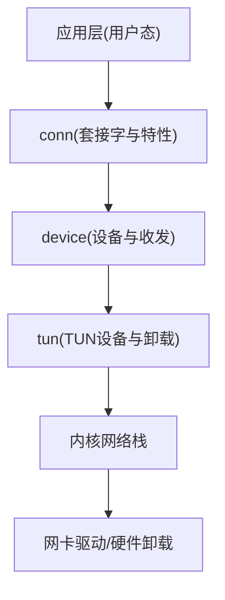
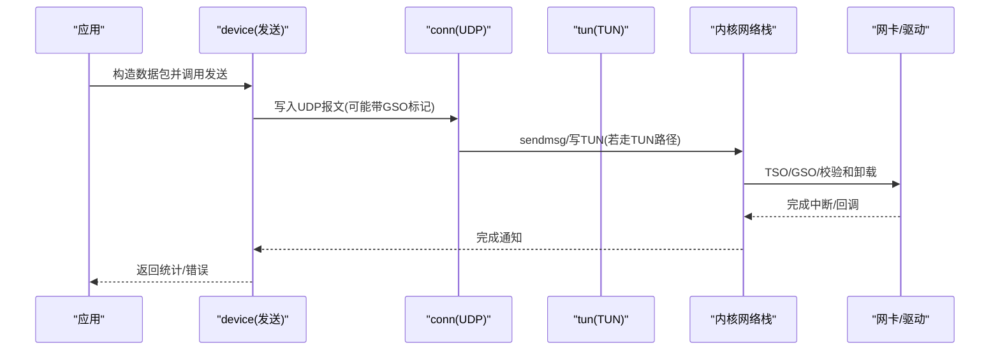
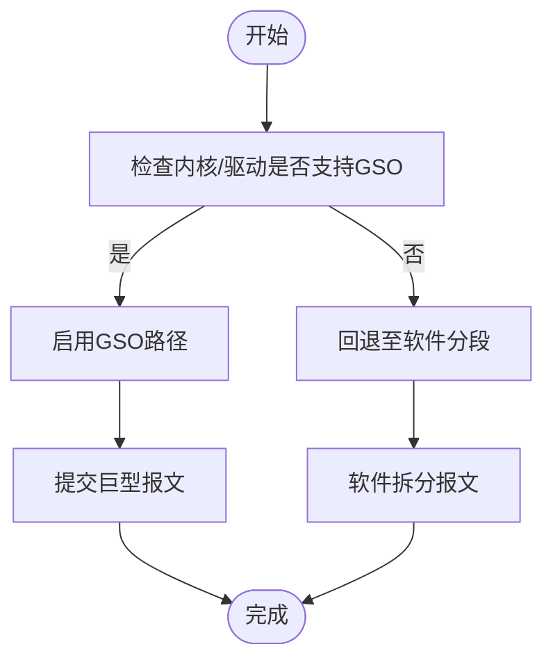
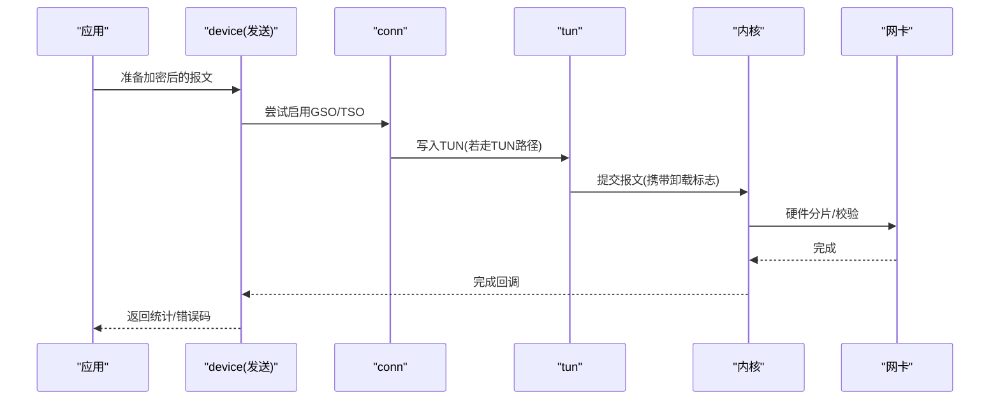
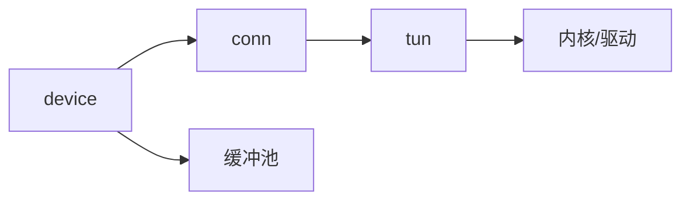

# 网络I/O优化

<cite>
**本文引用的文件**
- [conn.go](file://conn/conn.go)
- [bind_std.go](file://conn/bind_std.go)
- [gso_linux.go](file://conn/gso_linux.go)
- [gso_default.go](file://conn/gso_default.go)
- [features_linux.go](file://conn/features_linux.go)
- [device.go](file://device/device.go)
- [send.go](file://device/send.go)
- [receive.go](file://device/receive.go)
- [tun_linux.go](file://tun/tun_linux.go)
- [offload_linux.go](file://tun/offload_linux.go)
- [queueconstants_default.go](file://device/queueconstants_default.go)
- [main.go](file://main.go)
</cite>

## 目录
1. [简介](#简介)
2. [项目结构](#项目结构)
3. [核心组件](#核心组件)
4. [架构总览](#架构总览)
5. [详细组件分析](#详细组件分析)
6. [依赖关系分析](#依赖关系分析)
7. [性能考虑](#性能考虑)
8. [故障排查指南](#故障排查指南)
9. [结论](#结论)
10. [附录](#附录)

## 简介
本指南面向高吞吐、低延迟的网络I/O场景，围绕GSO（分段卸载）与TSO（TCP分段卸载）、内核网络栈参数调优、零拷贝技术、缓冲区优化、批量处理与监控排障等方面，结合wireguard-go在Linux上的实现路径，提供可落地的优化策略与最佳实践。文档同时给出架构图、流程图与调用序列图，帮助读者快速定位瓶颈并制定调优方案。

## 项目结构
本项目将网络I/O相关能力分布在以下模块：
- conn：封装底层套接字与平台特性探测，包含GSO支持检测与默认回退逻辑
- device：WireGuard设备状态机、收发通道、队列常量与发送/接收流水线
- tun：TUN/TAP设备抽象与Linux平台的卸载能力（如Checksum/GSO/TSO）暴露
- main：进程入口与初始化流程

图表来源
- [conn.go:1-200](file://conn/conn.go#L1-L200)
- [device.go:1-200](file://device/device.go#L1-L200)
- [tun_linux.go:1-200](file://tun/tun_linux.go#L1-L200)

章节来源
- [main.go:1-120](file://main.go#L1-L120)
- [conn.go:1-200](file://conn/conn.go#L1-L200)
- [device.go:1-200](file://device/device.go#L1-L200)
- [tun_linux.go:1-200](file://tun/tun_linux.go#L1-L200)

## 核心组件
- 连接与特性探测（conn）
  - 负责创建/绑定UDP套接字，探测内核是否支持GSO/TSO等卸载能力，并在不支持时回退到软件路径
- 设备收发（device）
  - 维护对端、密钥、队列与定时器；组织加密/解密、分片与重组；通过TUN读写数据
- TUN与卸载（tun）
  - 在Linux上打开TUN设备，暴露校验和卸载、GSO/TSO能力给上层使用
- 队列与缓冲（device）
  - 定义发送/接收队列大小、批处理阈值等常量，影响吞吐与延迟权衡

章节来源
- [conn.go:1-200](file://conn/conn.go#L1-L200)
- [features_linux.go:1-200](file://conn/features_linux.go#L1-L200)
- [device.go:1-200](file://device/device.go#L1-L200)
- [tun_linux.go:1-200](file://tun/tun_linux.go#L1-L200)
- [queueconstants_default.go:1-200](file://device/queueconstants_default.go#L1-L200)

## 架构总览
下图展示从应用到内核的完整I/O路径，标注了可能启用卸载的位置（TSO/GSO/CheckSum）。

图表来源
- [send.go:1-200](file://device/send.go#L1-L200)
- [conn.go:1-200](file://conn/conn.go#L1-L200)
- [tun_linux.go:1-200](file://tun/tun_linux.go#L1-L200)
- [offload_linux.go:1-200](file://tun/offload_linux.go#L1-L200)

## 详细组件分析

### GSO（通用分段卸载）
- 工作原理
  - 应用一次性提交一个“巨型”报文，由内核或网卡将其拆分为多个符合MTU的分段，减少系统调用与上下文切换
  - 在Linux上，可通过套接字选项或TUN属性开启GSO；当内核/驱动不支持时，需回退到软件分段
- 在本项目中的体现
  - conn层探测GSO能力并提供默认回退
  - tun层在Linux上暴露卸载能力，供上层决定是否启用
- 性能收益
  - 显著降低CPU占用与系统调用次数，提升高吞吐下的端到端吞吐
- 注意事项
  - 需要内核与驱动均支持；否则应自动降级
  - 与MTU、路径PMTU发现配合，避免分片

图表来源
- [gso_linux.go:1-200](file://conn/gso_linux.go#L1-L200)
- [gso_default.go:1-200](file://conn/gso_default.go#L1-L200)
- [tun_linux.go:1-200](file://tun/tun_linux.go#L1-L200)

章节来源
- [gso_linux.go:1-200](file://conn/gso_linux.go#L1-L200)
- [gso_default.go:1-200](file://conn/gso_default.go#L1-L200)
- [features_linux.go:1-200](file://conn/features_linux.go#L1-L200)
- [tun_linux.go:1-200](file://tun/tun_linux.go#L1-L200)

### TSO（TCP分段卸载）
- 工作原理
  - 应用提交一个大块TCP载荷，由内核/网卡负责按MSS切分并计算校验和，减少CPU负担
- 在本项目中的体现
  - 通过tun与conn的特性探测，判断是否可用TSO；不可用时回退
- 适用场景
  - 长连接、大流量、对CPU敏感的高吞吐服务
- 注意事项
  - 与拥塞控制、RTT、丢包重传策略共同作用；需关注队列深度与背压

章节来源
- [features_linux.go:1-200](file://conn/features_linux.go#L1-L200)
- [tun_linux.go:1-200](file://tun/tun_linux.go#L1-L200)
- [offload_linux.go:1-200](file://tun/offload_linux.go#L1-L200)

### 零拷贝技术与应用场景
- 概念
  - 尽量避免在内核与用户态之间复制数据，例如通过io_uring、mmap、splice、sendfile、DPDK/AF_XDP等
- 在本项目中的体现
  - 通过TUN与套接字的卸载能力，尽可能让内核/网卡承担分片与校验，减少用户态拷贝
  - 合理复用缓冲区池，降低分配开销
- 建议
  - 在高吞吐路径优先选择内核卸载；必要时引入更底层的零拷贝框架
  - 注意内存对齐与页边界，避免额外拷贝

章节来源
- [tun_linux.go:1-200](file://tun/tun_linux.go#L1-L200)
- [device/pools.go:1-200](file://device/pools.go#L1-L200)

### 网络缓冲区优化与大小调优
- 关键指标
  - 发送/接收队列长度、单包最大长度、批处理大小、内存上限
- 调优思路
  - 根据带宽×延迟积估算合适队列深度，避免队头阻塞与丢包
  - 在高吞吐下适当增大队列与批大小，换取更高吞吐；在低延迟场景适度减小
- 在本项目中的体现
  - 通过队列常量与设备配置控制收发行为

章节来源
- [queueconstants_default.go:1-200](file://device/queueconstants_default.go#L1-L200)
- [device.go:1-200](file://device/device.go#L1-L200)

### 批量处理与网络批次配置
- 目标
  - 合并多次系统调用，提高吞吐，降低CPU抖动
- 方法
  - 聚合多个小报文一次提交；设置合适的批大小与超时触发条件
  - 结合GSO/TSO进一步放大批量效果
- 在本项目中的体现
  - 设备层组织发送/接收循环，结合队列与定时器进行批处理

章节来源
- [send.go:1-200](file://device/send.go#L1-L200)
- [receive.go:1-200](file://device/receive.go#L1-L200)
- [device.go:1-200](file://device/device.go#L1-L200)

### 内核网络栈优化与参数调优
- 常见参数（示例）
  - net.core.rmem_max/net.core.wmem_max：最大收发缓冲
  - net.core.netdev_budget：每轮软中断处理包数
  - net.ipv4.tcp_congestion_control：拥塞控制算法（如bbr）
  - net.core.somaxconn：监听队列上限
  - net.core.optmem_max：套接字选项内存上限
- 调优原则
  - 依据链路带宽与RTT调整缓冲；在高带宽高延迟网络中增大缓冲
  - 选择合适的拥塞控制算法以匹配网络环境
  - 监控丢包、重传、乱序等指标验证效果

章节来源
- [conn.go:1-200](file://conn/conn.go#L1-L200)
- [device.go:1-200](file://device/device.go#L1-L200)

### 发送路径序列（含卸载）

图表来源
- [send.go:1-200](file://device/send.go#L1-L200)
- [conn.go:1-200](file://conn/conn.go#L1-L200)
- [tun_linux.go:1-200](file://tun/tun_linux.go#L1-L200)
- [offload_linux.go:1-200](file://tun/offload_linux.go#L1-L200)

## 依赖关系分析
- 模块耦合
  - device依赖conn提供的套接字与特性探测；conn依赖tun的卸载能力
  - 各平台差异通过条件编译与特性探测解耦
- 外部依赖
  - 内核版本与网卡驱动能力决定能否启用GSO/TSO
  - 系统参数影响缓冲与调度行为

图表来源
- [device.go:1-200](file://device/device.go#L1-L200)
- [conn.go:1-200](file://conn/conn.go#L1-L200)
- [tun_linux.go:1-200](file://tun/tun_linux.go#L1-L200)

章节来源
- [device.go:1-200](file://device/device.go#L1-L200)
- [conn.go:1-200](file://conn/conn.go#L1-L200)
- [tun_linux.go:1-200](file://tun/tun_linux.go#L1-L200)

## 性能考虑
- 启用卸载
  - 优先启用GSO/TSO，减少CPU与系统调用；不可用时确保回退路径高效
- 缓冲与队列
  - 根据带宽×延迟积设置合理的收发缓冲与队列深度，避免丢包与队头阻塞
- 批处理
  - 合并小包，设置合适的批大小与超时，平衡吞吐与延迟
- 拥塞控制
  - 在高延迟高带宽网络中考虑BBR等现代算法
- 零拷贝
  - 尽量利用内核卸载与TUN特性，减少用户态拷贝与内存分配

[本节为通用指导，不直接分析具体文件]

## 故障排查指南
- 现象与定位
  - 吞吐不达标：检查是否启用了GSO/TSO；查看内核/驱动支持情况
  - CPU偏高：确认是否回退到软件分段；评估批大小与队列深度
  - 丢包/重传：检查拥塞控制、缓冲大小、队列溢出
- 工具与方法
  - 使用ss/netstat观察队列与连接状态
  - 使用perf/top/cpustat定位热点
  - 使用ethtool查看网卡卸载能力
  - 使用tc/iptables进行限速与抓包分析
- 回退策略
  - 当卸载不可用时，确保软件路径的性能与稳定性；逐步放宽批大小与队列

章节来源
- [features_linux.go:1-200](file://conn/features_linux.go#L1-L200)
- [gso_default.go:1-200](file://conn/gso_default.go#L1-L200)
- [offload_linux.go:1-200](file://tun/offload_linux.go#L1-L200)

## 结论
在高吞吐场景下，优先启用GSO/TSO等内核卸载能力，并结合合理的缓冲与队列配置、批处理策略与拥塞控制算法，可显著提升吞吐并降低CPU占用。通过特性探测与回退机制保证兼容性，借助监控与工具链持续优化，最终达到稳定、高效的网络I/O性能。

[本节为总结性内容，不直接分析具体文件]

## 附录
- 快速检查清单
  - 确认内核与驱动支持GSO/TSO
  - 调整net.core.*与tcp拥塞控制参数
  - 设置合适的队列与批大小
  - 监控吞吐、延迟、丢包与CPU占用
  - 针对异常场景制定回退与限流策略

[本节为补充信息，不直接分析具体文件]