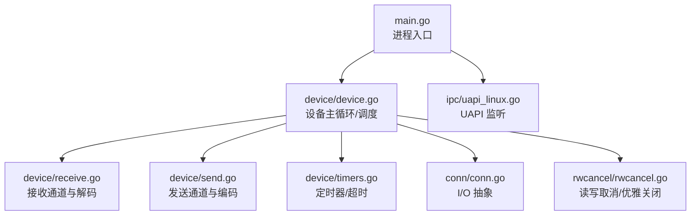
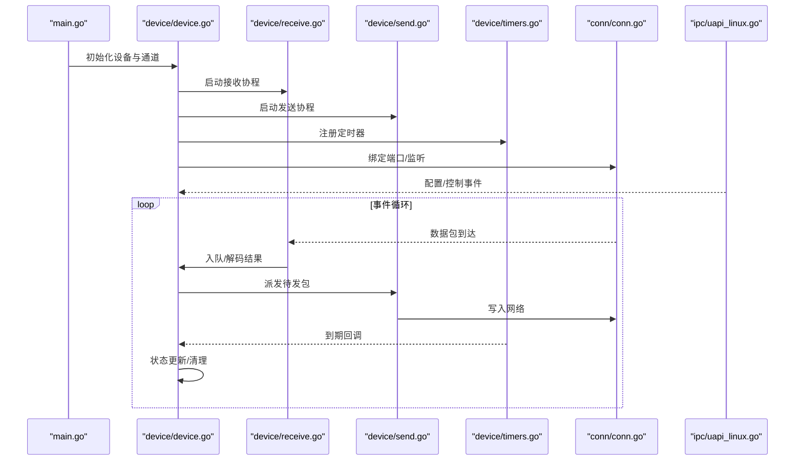
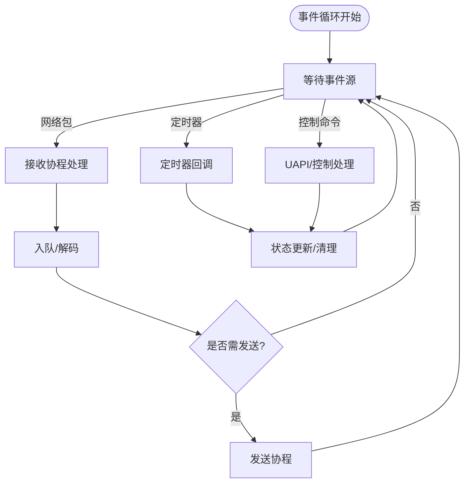
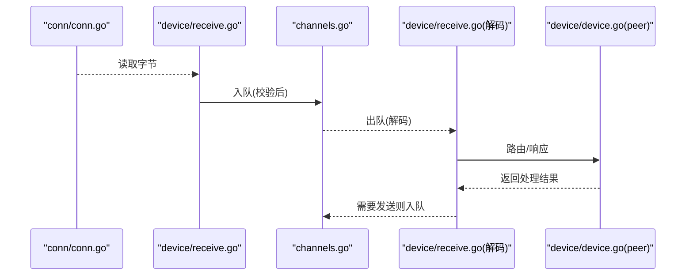
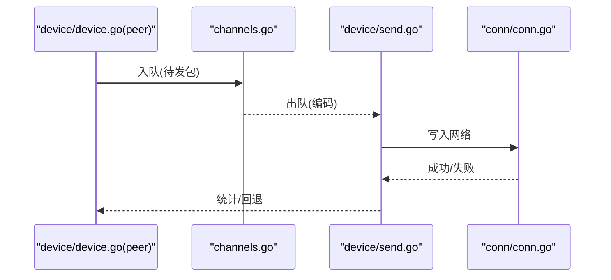
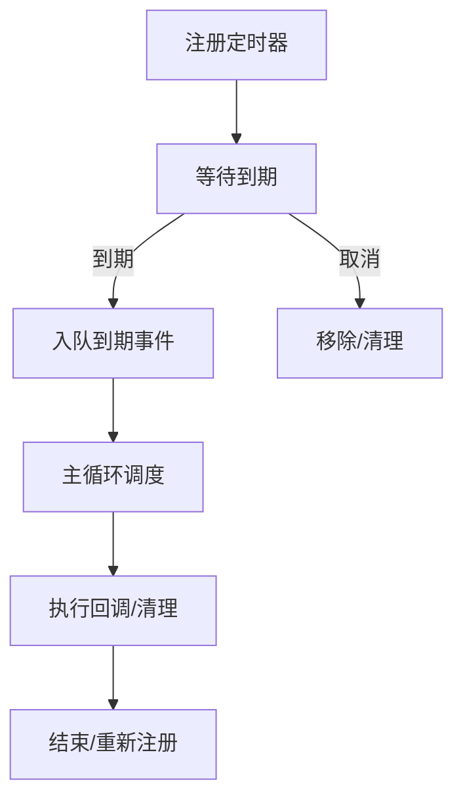
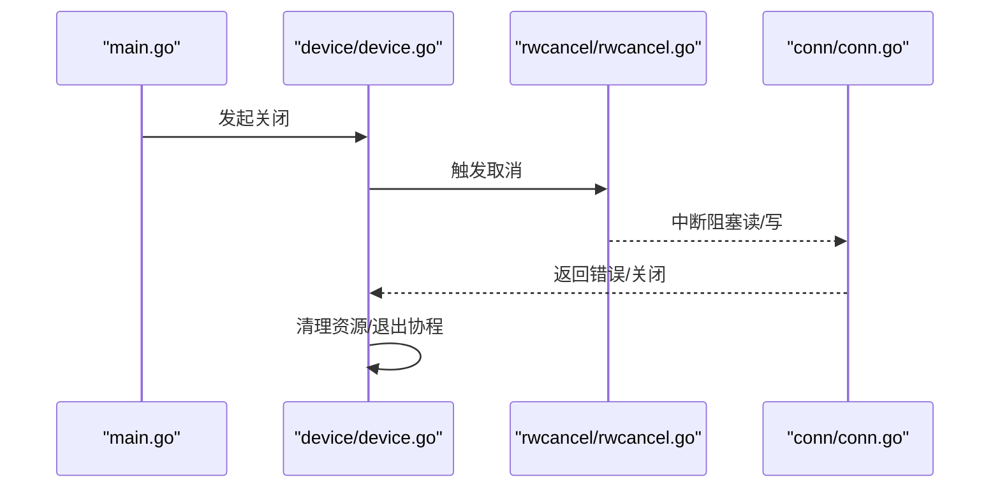
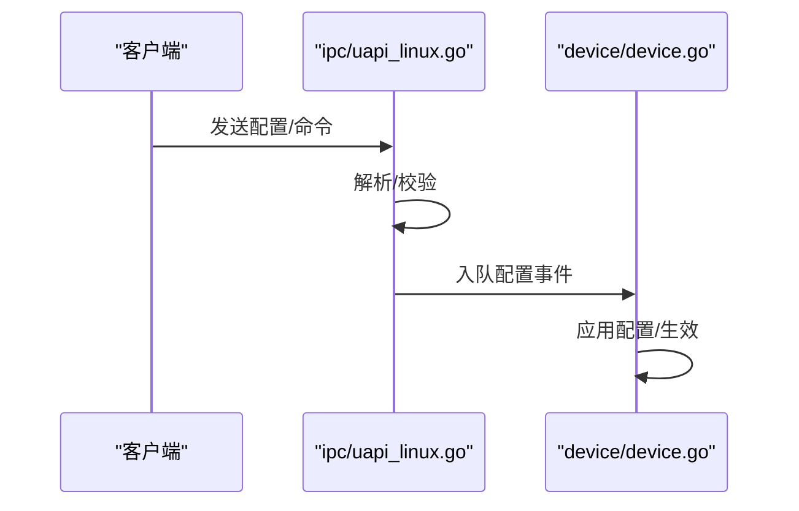
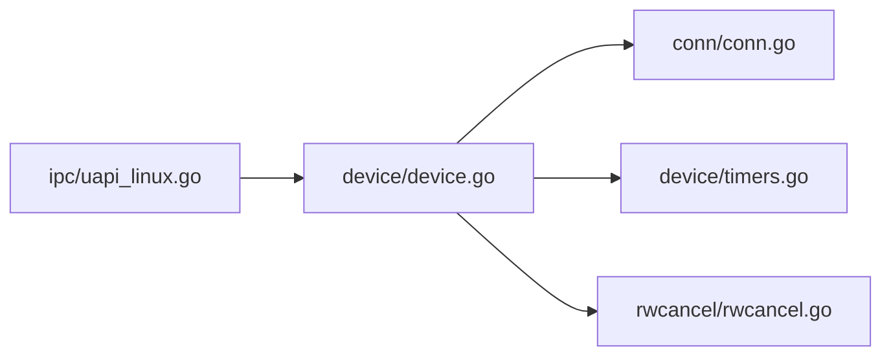

# 并发模型

<cite>
**本文引用的文件**
- [main.go](file://main.go)
- [device/device.go](file://device/device.go)
- [device/channels.go](file://device/channels.go)
- [device/receive.go](file://device/receive.go)
- [device/send.go](file://device/send.go)
- [device/timers.go](file://device/timers.go)
- [rwcancel/rwcancel.go](file://rwcancel/rwcancel.go)
- [conn/conn.go](file://conn/conn.go)
- [ipc/uapi_linux.go](file://ipc/uapi_linux.go)
</cite>

## 目录
1. [简介](#简介)
2. [项目结构](#项目结构)
3. [核心组件](#核心组件)
4. [架构总览](#架构总览)
5. [详细组件分析](#详细组件分析)
6. [依赖关系分析](#依赖关系分析)
7. [性能考量](#性能考量)
8. [故障排查指南](#故障排查指南)
9. [结论](#结论)
10. [附录](#附录)

## 简介
本文件聚焦于该项目的并发模型，围绕基于 goroutine 与 channel 的事件驱动架构、定时器与超时处理、读写取消器与优雅关闭、并发安全原则与实践、死锁预防与资源泄漏防护，以及并发调试与性能分析方法进行系统化说明。目标是帮助读者理解系统如何在高并发网络场景下保持低延迟、可观测性与稳定性。

## 项目结构
本项目采用分层与按功能域组织的方式：
- 设备层（device）：封装隧道设备的状态机、收发管线、定时器、队列常量等，是并发模型的核心。
- 连接层（conn）：抽象底层套接字绑定与特性，提供跨平台 I/O 能力。
- IPC/UAPI：提供用户态接口，通常以独立 goroutine 监听并转发请求。
- 取消器（rwcancel）：提供统一的读写取消语义，用于优雅关闭。
- 入口（main）：启动各子系统并协调生命周期。

图表来源
- [main.go:1-200](file://main.go#L1-L200)
- [device/device.go:1-300](file://device/device.go#L1-L300)
- [device/receive.go:1-200](file://device/receive.go#L1-L200)
- [device/send.go:1-200](file://device/send.go#L1-L200)
- [device/timers.go:1-200](file://device/timers.go#L1-L200)
- [conn/conn.go:1-200](file://conn/conn.go#L1-L200)
- [ipc/uapi_linux.go:1-200](file://ipc/uapi_linux.go#L1-L200)
- [rwcancel/rwcancel.go:1-200](file://rwcancel/rwcancel.go#L1-L200)

章节来源
- [main.go:1-200](file://main.go#L1-L200)
- [device/device.go:1-300](file://device/device.go#L1-L300)

## 核心组件
- 设备主循环与事件总线：集中管理 peer、endpoint、队列与定时器，通过 channel 将“接收”“发送”“计时器到期”“控制命令”等事件分派到对应协程。
- 接收管线：从底层 I/O 读取数据，入队后由解码协程消费，完成解密、校验、路由与响应生成。
- 发送管线：将待发包入队，由编码协程串行化发送，避免竞争与乱序。
- 定时器与超时：为密钥轮换、保活、重传等提供精确的定时触发与清理。
- 读写取消器：在关闭时中断阻塞的 I/O 调用，确保资源释放与 goroutine 退出。
- UAPI 监听：独立协程接受配置变更，转化为设备内部事件。

章节来源
- [device/device.go:1-300](file://device/device.go#L1-L300)
- [device/channels.go:1-200](file://device/channels.go#L1-L200)
- [device/receive.go:1-200](file://device/receive.go#L1-L200)
- [device/send.go:1-200](file://device/send.go#L1-L200)
- [device/timers.go:1-200](file://device/timers.go#L1-L200)
- [rwcancel/rwcancel.go:1-200](file://rwcancel/rwcancel.go#L1-L200)
- [ipc/uapi_linux.go:1-200](file://ipc/uapi_linux.go#L1-L200)

## 架构总览
下图展示了事件驱动的主循环如何协调接收、发送、定时器与 I/O，并通过 channel 实现无锁或细粒度锁的数据流转。

图表来源
- [device/device.go:1-300](file://device/device.go#L1-L300)
- [device/receive.go:1-200](file://device/receive.go#L1-L200)
- [device/send.go:1-200](file://device/send.go#L1-L200)
- [device/timers.go:1-200](file://device/timers.go#L1-L200)
- [conn/conn.go:1-200](file://conn/conn.go#L1-L200)
- [ipc/uapi_linux.go:1-200](file://ipc/uapi_linux.go#L1-L200)

## 详细组件分析

### 事件驱动主循环与通道模型
- 设计要点
  - 使用有界 channel 作为任务队列，背压保护避免内存膨胀。
  - 单写多读或多写单读模式明确职责边界，减少锁竞争。
  - 所有外部事件（网络、定时器、控制）统一转换为内部事件进入主循环。
- 关键流程
  - 接收路径：底层 I/O -> 接收协程 -> 入队 -> 解码协程 -> 路由/响应。
  - 发送路径：业务侧 -> 入队 -> 发送协程 -> 底层 I/O。
  - 定时器：到期事件入队，主循环调度执行。
- 并发安全
  - 共享状态尽量通过 channel 传递所有权，避免共享可变状态。
  - 必须共享时使用互斥锁，且锁粒度最小化。

图表来源
- [device/device.go:1-300](file://device/device.go#L1-L300)
- [device/channels.go:1-200](file://device/channels.go#L1-L200)
- [device/receive.go:1-200](file://device/receive.go#L1-L200)
- [device/send.go:1-200](file://device/send.go#L1-L200)
- [device/timers.go:1-200](file://device/timers.go#L1-L200)

章节来源
- [device/device.go:1-300](file://device/device.go#L1-L300)
- [device/channels.go:1-200](file://device/channels.go#L1-L200)

### 接收管线（goroutine + channel）
- 职责
  - 从 conn 读取原始报文，做基本校验后入队。
  - 解码协程负责解密、去重、序列号检查、路由决策与响应构造。
- 并发模型
  - 接收与解码分离，通过 channel 解耦；解码阶段可能涉及 CPU 密集操作，单独协程避免阻塞 I/O。
- 错误与恢复
  - 对非法包、校验失败、重复包等进行计数与丢弃，不中断主循环。
  - 遇到致命错误时上报并尝试恢复或关闭相关端点。

图表来源
- [device/receive.go:1-200](file://device/receive.go#L1-L200)
- [device/channels.go:1-200](file://device/channels.go#L1-L200)
- [conn/conn.go:1-200](file://conn/conn.go#L1-L200)

章节来源
- [device/receive.go:1-200](file://device/receive.go#L1-L200)
- [device/channels.go:1-200](file://device/channels.go#L1-L200)

### 发送管线（goroutine + channel）
- 职责
  - 将待发包序列化并写入网络，保证顺序与一致性。
- 并发模型
  - 单发送协程串行化写入，避免并发写同一 socket 导致的交错与竞争。
  - 入队前进行大小限制与拥塞控制（如有）。
- 错误与恢复
  - 写失败时记录指标，必要时回退策略或重试。

图表来源
- [device/send.go:1-200](file://device/send.go#L1-L200)
- [device/channels.go:1-200](file://device/channels.go#L1-L200)
- [conn/conn.go:1-200](file://conn/conn.go#L1-L200)

章节来源
- [device/send.go:1-200](file://device/send.go#L1-L200)
- [device/channels.go:1-200](file://device/channels.go#L1-L200)

### 定时器机制与超时处理
- 职责
  - 维护密钥轮换、保活、重传、会话过期等时间相关的逻辑。
- 设计要点
  - 使用高精度定时器，支持一次性与周期性任务。
  - 到期事件通过 channel 进入主循环，避免在定时器回调中直接修改共享状态。
  - 清理过期任务，防止定时器泄漏。
- 超时策略
  - 区分 I/O 超时与应用层超时，分别设置上下文或取消信号。

图表来源
- [device/timers.go:1-200](file://device/timers.go#L1-L200)
- [device/device.go:1-300](file://device/device.go#L1-L300)

章节来源
- [device/timers.go:1-200](file://device/timers.go#L1-L200)
- [device/device.go:1-300](file://device/device.go#L1-L300)

### 读写取消器与优雅关闭
- 作用
  - 在关闭时中断阻塞的 I/O 调用，确保 goroutine 能尽快退出并释放资源。
- 实现要点
  - 提供统一的取消接口，结合上下文取消与文件描述符级中断。
  - 关闭顺序：先停止新任务入队，再取消正在进行的 I/O，最后释放资源。
- 最佳实践
  - 所有阻塞 I/O 都应在上下文中进行，并在关闭时显式取消。
  - 使用带缓冲的 channel 承载关闭信号，避免丢失关闭指令。

图表来源
- [rwcancel/rwcancel.go:1-200](file://rwcancel/rwcancel.go#L1-L200)
- [conn/conn.go:1-200](file://conn/conn.go#L1-L200)
- [device/device.go:1-300](file://device/device.go#L1-L300)

章节来源
- [rwcancel/rwcancel.go:1-200](file://rwcancel/rwcancel.go#L1-L200)
- [conn/conn.go:1-200](file://conn/conn.go#L1-L200)
- [device/device.go:1-300](file://device/device.go#L1-L300)

### UAPI 监听与配置下发
- 职责
  - 监听用户态接口，解析配置/控制命令，转换为设备内部事件。
- 并发模型
  - 独立 goroutine 处理连接，避免阻塞设备主循环。
  - 通过 channel 将配置变更发送到设备层，由主循环统一应用。

图表来源
- [ipc/uapi_linux.go:1-200](file://ipc/uapi_linux.go#L1-L200)
- [device/device.go:1-300](file://device/device.go#L1-L300)

章节来源
- [ipc/uapi_linux.go:1-200](file://ipc/uapi_linux.go#L1-L200)
- [device/device.go:1-300](file://device/device.go#L1-L300)

## 依赖关系分析
- 模块耦合
  - device 依赖 conn 进行 I/O，依赖 timers 管理时间事件，依赖 rwcancel 进行优雅关闭。
  - ipc 仅向 device 注入事件，降低耦合度。
- 外部依赖
  - 操作系统网络栈与内核特性通过 conn 抽象，屏蔽平台差异。
- 潜在环路与风险
  - 避免在定时器回调中直接反向触发 I/O，应通过事件入队。
  - 关闭链路上避免循环引用，确保单向传播。

图表来源
- [device/device.go:1-300](file://device/device.go#L1-L300)
- [conn/conn.go:1-200](file://conn/conn.go#L1-L200)
- [device/timers.go:1-200](file://device/timers.go#L1-L200)
- [rwcancel/rwcancel.go:1-200](file://rwcancel/rwcancel.go#L1-L200)
- [ipc/uapi_linux.go:1-200](file://ipc/uapi_linux.go#L1-L200)

章节来源
- [device/device.go:1-300](file://device/device.go#L1-L300)
- [conn/conn.go:1-200](file://conn/conn.go#L1-L200)
- [device/timers.go:1-200](file://device/timers.go#L1-L200)
- [rwcancel/rwcancel.go:1-200](file://rwcancel/rwcancel.go#L1-L200)
- [ipc/uapi_linux.go:1-200](file://ipc/uapi_linux.go#L1-L200)

## 性能考量
- 通道容量与背压
  - 合理设置 channel 容量，平衡吞吐与内存占用；过大导致延迟增加，过小造成阻塞。
- 协程数量
  - 根据 CPU 核数与 I/O 特性调整接收/解码/发送协程数，避免过度并行。
- 锁粒度
  - 尽量无锁或细粒度锁；优先用 channel 传递所有权。
- 零拷贝与缓冲池
  - 复用缓冲区，减少分配与 GC 压力。
- 监控与指标
  - 统计通道长度、丢包率、超时次数、GC 停顿等，指导调优。

[本节为通用指导，不直接分析具体文件]

## 故障排查指南
- 常见症状
  - 高延迟：通道阻塞、锁竞争、定时器未清理。
  - 内存增长：channel 堆积、缓冲区未释放、定时器泄漏。
  - 偶发崩溃：并发写 socket、越界访问、空指针。
- 定位方法
  - 使用 pprof 采集 CPU/内存/阻塞 profile，定位热点与泄漏。
  - 开启 race detector 检测数据竞争。
  - 打印关键路径日志与指标，结合 eBPF/内核工具观察 I/O 行为。
- 修复建议
  - 为所有阻塞 I/O 添加超时与取消。
  - 确保关闭顺序正确：停止入队 -> 取消 I/O -> 释放资源。
  - 对定时器进行生命周期管理，避免悬挂。

章节来源
- [device/device.go:1-300](file://device/device.go#L1-L300)
- [device/timers.go:1-200](file://device/timers.go#L1-L200)
- [rwcancel/rwcancel.go:1-200](file://rwcancel/rwcancel.go#L1-L200)

## 结论
该项目采用以 goroutine 和 channel 为核心的事件驱动并发模型，将 I/O、解码、编码、定时器与控制面解耦，通过有界通道与明确的职责划分实现高吞吐与低延迟。配合读写取消器与严格的关闭顺序，保障优雅退出与资源回收。遵循无共享/最小共享、背压保护、锁粒度最小化等原则，可有效预防死锁与资源泄漏。借助 pprof 与 race detector 等工具，持续优化性能与稳定性。

## 附录
- 并发安全原则与最佳实践
  - 优先使用 channel 传递消息，避免共享可变状态。
  - 若必须共享，使用互斥锁并缩小临界区。
  - 所有 I/O 操作支持取消与超时。
  - 使用有界 channel 实现背压，防止内存爆炸。
  - 协程生命周期清晰，启动与退出成对出现。
- 死锁预防
  - 避免循环等待；统一加锁顺序。
  - 不在持有锁时进行阻塞 I/O。
  - 使用超时与取消打破长等待。
- 资源泄漏防护
  - 定时器注册与注销配对。
  - 关闭时显式释放文件描述符、缓冲区与 goroutine。
- 调试与分析
  - 启用 race detector 进行并发问题定位。
  - 使用 pprof 分析 CPU/内存/阻塞热点。
  - 结合日志与指标建立可观测性体系。

[本节为通用指导，不直接分析具体文件]