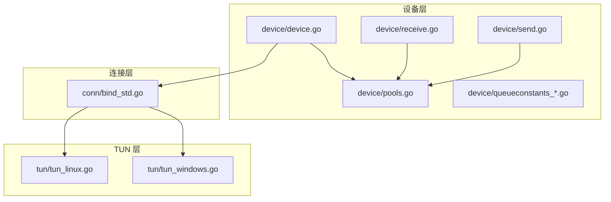
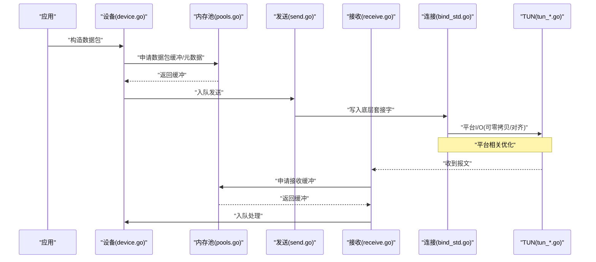
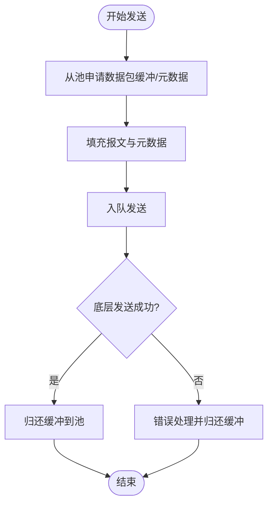
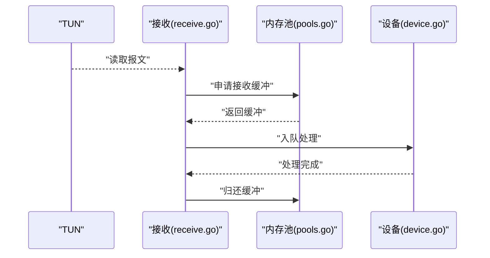
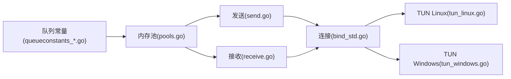

# 内存池管理

<cite>
**本文引用的文件**
- [device/pools.go](file://device/pools.go)
- [device/device.go](file://device/device.go)
- [device/send.go](file://device/send.go)
- [device/receive.go](file://device/receive.go)
- [device/queueconstants_default.go](file://device/queueconstants_default.go)
- [device/queueconstants_android.go](file://device/queueconstants_android.go)
- [device/queueconstants_ios.go](file://device/queueconstants_ios.go)
- [device/queueconstants_windows.go](file://device/queueconstants_windows.go)
- [conn/bind_std.go](file://conn/bind_std.go)
- [tun/tun_linux.go](file://tun/tun_linux.go)
- [tun/tun_windows.go](file://tun/tun_windows.go)
- [go.mod](file://go.mod)
</cite>

## 目录
1. [简介](#简介)
2. [项目结构](#项目结构)
3. [核心组件](#核心组件)
4. [架构总览](#架构总览)
5. [详细组件分析](#详细组件分析)
6. [依赖关系分析](#依赖关系分析)
7. [性能考量](#性能考量)
8. [故障排查指南](#故障排查指南)
9. [结论](#结论)
10. [附录](#附录)

## 简介
本文件聚焦于 WireGuard Go 实现中的内存池管理，系统性阐述预分配策略、动态扩容机制、不同类型缓冲区（数据包缓冲区、元数据缓冲区、临时对象池）的管理方式，以及跨平台优化（零拷贝、内存对齐）、内存泄漏检测与使用监控方法。同时提供性能分析与调优建议，并给出实际代码示例的引用路径，帮助读者快速定位与理解关键实现。

## 项目结构
本项目采用分层组织：设备层负责协议处理与队列管理；连接层封装网络 I/O；TUN 层对接操作系统内核接口；各平台通过条件编译适配差异。内存池主要位于设备层，围绕发送/接收路径进行预分配与复用，以降低 GC 压力与系统调用开销。

图表来源
- [device/device.go](file://device/device.go)
- [device/pools.go](file://device/pools.go)
- [device/send.go](file://device/send.go)
- [device/receive.go](file://device/receive.go)
- [device/queueconstants_default.go](file://device/queueconstants_default.go)
- [conn/bind_std.go](file://conn/bind_std.go)
- [tun/tun_linux.go](file://tun/tun_linux.go)
- [tun/tun_windows.go](file://tun/tun_windows.go)

章节来源
- [device/pools.go](file://device/pools.go)
- [device/device.go](file://device/device.go)
- [device/send.go](file://device/send.go)
- [device/receive.go](file://device/receive.go)
- [device/queueconstants_default.go](file://device/queueconstants_default.go)
- [conn/bind_std.go](file://conn/bind_std.go)
- [tun/tun_linux.go](file://tun/tun_linux.go)
- [tun/tun_windows.go](file://tun/tun_windows.go)

## 核心组件
- 内存池与缓冲池：集中管理数据包缓冲区、元数据缓冲区和临时对象池，提供预分配、复用与回收能力。
- 队列常量配置：不同平台定义队列大小等参数，影响内存占用与吞吐。
- 发送/接收路径：在收发流程中从池中获取/归还缓冲，减少分配与释放成本。
- 平台 I/O 抽象：连接层与 TUN 层在不同平台上对零拷贝、内存对齐等进行差异化优化。

章节来源
- [device/pools.go](file://device/pools.go)
- [device/queueconstants_default.go](file://device/queueconstants_default.go)
- [device/send.go](file://device/send.go)
- [device/receive.go](file://device/receive.go)
- [conn/bind_std.go](file://conn/bind_std.go)
- [tun/tun_linux.go](file://tun/tun_linux.go)
- [tun/tun_windows.go](file://tun/tun_windows.go)

## 架构总览
下图展示内存池在发送/接收路径中的位置及与平台 I/O 的关系。发送路径将加密后的数据包放入发送队列，必要时从池获取缓冲；接收路径从内核读取报文后入队，交由设备层处理。

图表来源
- [device/device.go](file://device/device.go)
- [device/pools.go](file://device/pools.go)
- [device/send.go](file://device/send.go)
- [device/receive.go](file://device/receive.go)
- [conn/bind_std.go](file://conn/bind_std.go)
- [tun/tun_linux.go](file://tun/tun_linux.go)
- [tun/tun_windows.go](file://tun/tun_windows.go)

## 详细组件分析

### 内存池与缓冲池设计
- 预分配策略：在启动或首次使用时按平台配置的队列容量预先分配一批缓冲，覆盖典型峰值负载，降低运行时分配频率。
- 动态扩容机制：当队列接近上限或突发流量导致池耗尽时，按需扩展池容量，但受最大限制保护，避免无限增长。
- 类型化缓冲：
  - 数据包缓冲区：用于承载加密后的报文段，通常固定大小，便于对齐与零拷贝。
  - 元数据缓冲区：保存与报文相关的控制信息（如端点、时间戳、序列号等），生命周期短，频繁复用。
  - 临时对象池：用于编解码中间对象、哈希表节点等短期存在对象，减少 GC 压力。
- 回收与复用：所有缓冲在退出临界区或完成处理后统一归还至池，避免悬挂引用。

章节来源
- [device/pools.go](file://device/pools.go)
- [device/queueconstants_default.go](file://device/queueconstants_default.go)
- [device/queueconstants_android.go](file://device/queueconstants_android.go)
- [device/queueconstants_ios.go](file://device/queueconstants_ios.go)
- [device/queueconstants_windows.go](file://device/queueconstants_windows.go)

### 发送路径中的内存池使用
- 发送前从池申请数据包缓冲与元数据，填充内容后入队。
- 批量发送时尽量复用同一批缓冲，减少分配次数。
- 发送失败或超时场景需确保缓冲及时归还，防止泄漏。

图表来源
- [device/send.go](file://device/send.go)
- [device/pools.go](file://device/pools.go)

章节来源
- [device/send.go](file://device/send.go)
- [device/pools.go](file://device/pools.go)

### 接收路径中的内存池使用
- 从 TUN/套接字读取报文后，立即从池申请接收缓冲，复制/映射数据。
- 将报文与元数据入队供设备层处理。
- 处理完成后归还缓冲，保证池稳定。

图表来源
- [device/receive.go](file://device/receive.go)
- [device/pools.go](file://device/pools.go)
- [tun/tun_linux.go](file://tun/tun_linux.go)
- [tun/tun_windows.go](file://tun/tun_windows.go)

章节来源
- [device/receive.go](file://device/receive.go)
- [device/pools.go](file://device/pools.go)
- [tun/tun_linux.go](file://tun/tun_linux.go)
- [tun/tun_windows.go](file://tun/tun_windows.go)

### 平台 I/O 与零拷贝/对齐优化
- Linux：优先使用零拷贝技术（如 splice、sendmsg/recvmsg 配合 IOV），减少用户态与内核态拷贝；注意页面对齐与 DMA 友好布局。
- Windows：利用系统提供的缓冲管理与内存对齐特性，结合 TUN 驱动优化传输路径。
- 连接层：在不同平台选择最优 I/O 模式，尽可能复用缓冲，避免额外拷贝。

章节来源
- [conn/bind_std.go](file://conn/bind_std.go)
- [tun/tun_linux.go](file://tun/tun_linux.go)
- [tun/tun_windows.go](file://tun/tun_windows.go)

### 队列常量与动态扩容
- 队列常量：不同平台定义默认队列长度与上限，影响内存占用与吞吐。
- 动态扩容：当队列接近上限时触发扩容，扩容步长与上限由平台常量决定，避免抖动。

章节来源
- [device/queueconstants_default.go](file://device/queueconstants_default.go)
- [device/queueconstants_android.go](file://device/queueconstants_android.go)
- [device/queueconstants_ios.go](file://device/queueconstants_ios.go)
- [device/queueconstants_windows.go](file://device/queueconstants_windows.go)

## 依赖关系分析
内存池依赖平台队列常量以决定初始容量与扩容策略；发送/接收路径依赖内存池进行缓冲管理；连接层与 TUN 层为 I/O 提供平台优化。整体耦合度低、职责清晰。

图表来源
- [device/queueconstants_default.go](file://device/queueconstants_default.go)
- [device/pools.go](file://device/pools.go)
- [device/send.go](file://device/send.go)
- [device/receive.go](file://device/receive.go)
- [conn/bind_std.go](file://conn/bind_std.go)
- [tun/tun_linux.go](file://tun/tun_linux.go)
- [tun/tun_windows.go](file://tun/tun_windows.go)

章节来源
- [device/pools.go](file://device/pools.go)
- [device/send.go](file://device/send.go)
- [device/receive.go](file://device/receive.go)
- [device/queueconstants_default.go](file://device/queueconstants_default.go)
- [conn/bind_std.go](file://conn/bind_std.go)
- [tun/tun_linux.go](file://tun/tun_linux.go)
- [tun/tun_windows.go](file://tun/tun_windows.go)

## 性能考量
- 预分配与复用：合理设置初始池大小，覆盖常见峰值，显著降低分配与 GC 压力。
- 零拷贝：在支持的平台启用零拷贝路径，减少 CPU 与内存带宽消耗。
- 内存对齐：确保缓冲对齐到缓存行或 DMA 边界，提升吞吐。
- 动态扩容：平滑应对突发流量，避免频繁扩容带来的抖动。
- 监控指标：跟踪池命中率、扩容次数、平均/最大队列长度、GC 暂停时间等。

[本节为通用指导，不直接分析具体文件]

## 故障排查指南
- 内存泄漏检测
  - 使用运行时 pprof 的 heap/profile 采样，定位未归还的缓冲。
  - 检查发送/接收异常分支是否遗漏归还逻辑。
  - 关注长时间运行下的堆增长趋势。
- 内存使用监控
  - 观察进程 RSS/Heap 变化，结合 GC 统计判断是否存在异常分配。
  - 记录队列长度与池大小，评估是否需要调整常量或扩容策略。
- 常见问题
  - 高延迟：可能由于池过小导致频繁扩容或阻塞等待。
  - 高 CPU：可能由于过多拷贝或未启用零拷贝。
  - 崩溃：检查对齐与越界访问，确认平台 I/O 返回值与错误码。

章节来源
- [device/send.go](file://device/send.go)
- [device/receive.go](file://device/receive.go)
- [device/pools.go](file://device/pools.go)

## 结论
WireGuard Go 的内存池通过预分配、类型化缓冲与平台 I/O 优化，有效降低了分配与拷贝成本，提升了吞吐与稳定性。合理配置队列常量、启用零拷贝与对齐优化，并结合监控与压测，可在不同平台上获得良好性能表现。

[本节为总结性内容，不直接分析具体文件]

## 附录
- 实际代码示例（引用路径）
  - 发送路径中使用内存池：[device/send.go](file://device/send.go)
  - 接收路径中使用内存池：[device/receive.go](file://device/receive.go)
  - 内存池与缓冲管理实现：[device/pools.go](file://device/pools.go)
  - 平台队列常量配置：[device/queueconstants_default.go](file://device/queueconstants_default.go)、[device/queueconstants_android.go](file://device/queueconstants_android.go)、[device/queueconstants_ios.go](file://device/queueconstants_ios.go)、[device/queueconstants_windows.go](file://device/queueconstants_windows.go)
  - 平台 I/O 与零拷贝优化：[conn/bind_std.go](file://conn/bind_std.go)、[tun/tun_linux.go](file://tun/tun_linux.go)、[tun/tun_windows.go](file://tun/tun_windows.go)
  - 模块依赖与版本：[go.mod](file://go.mod)