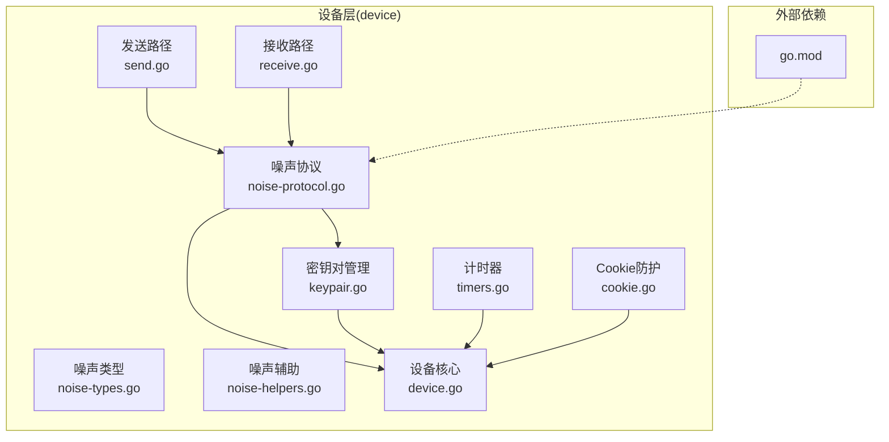
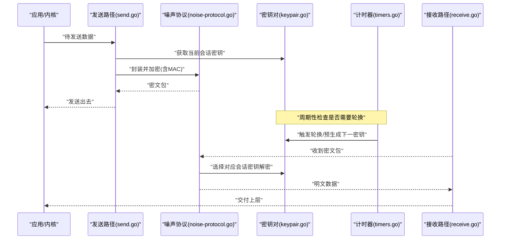
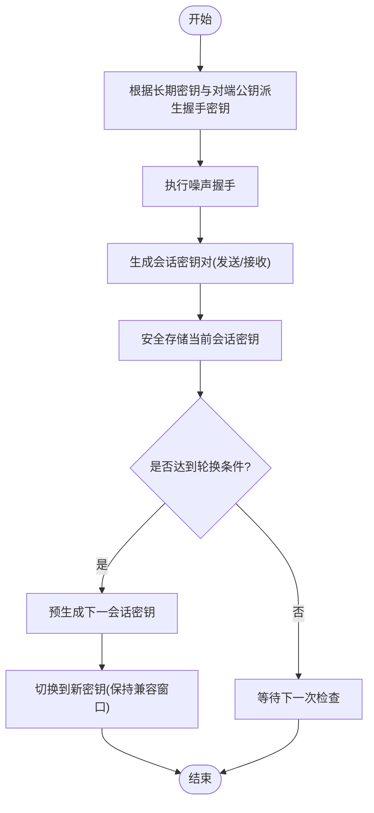
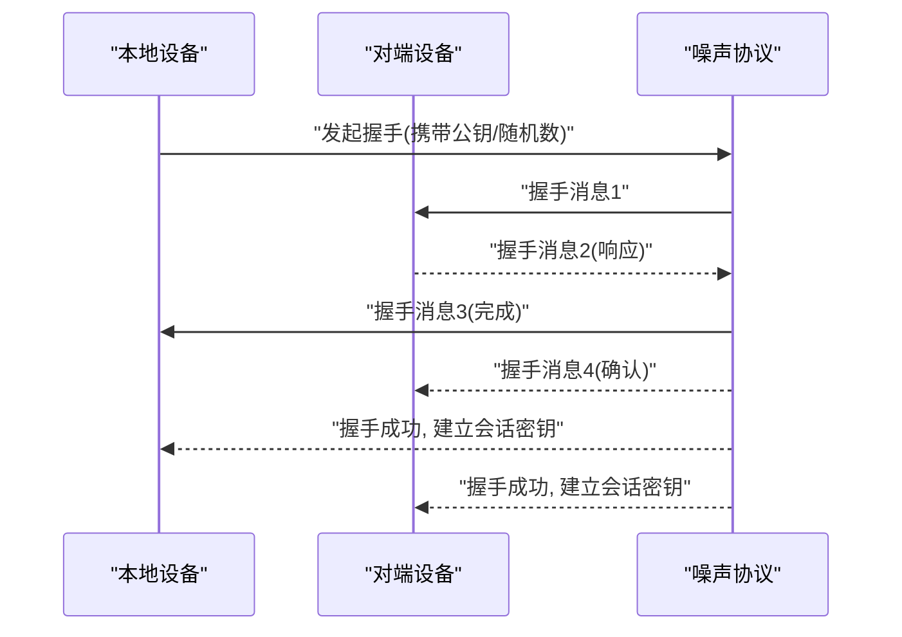
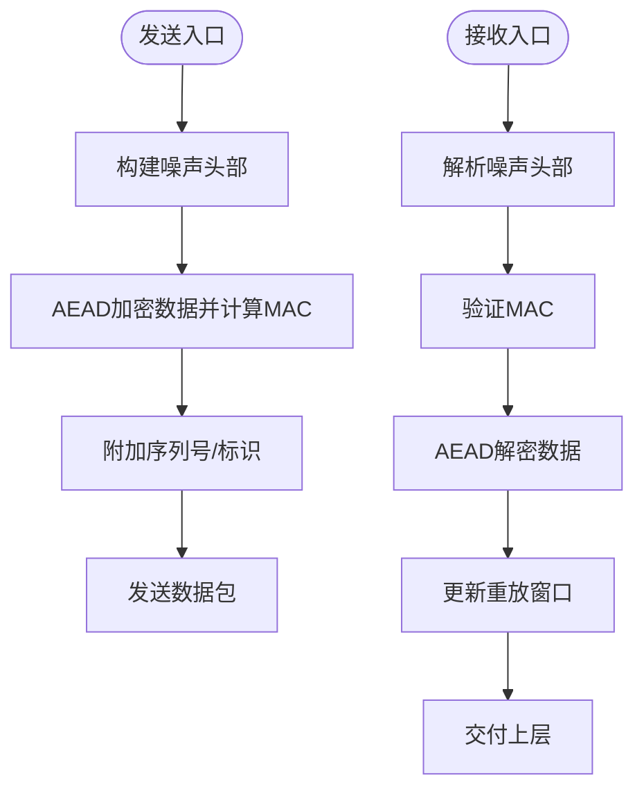
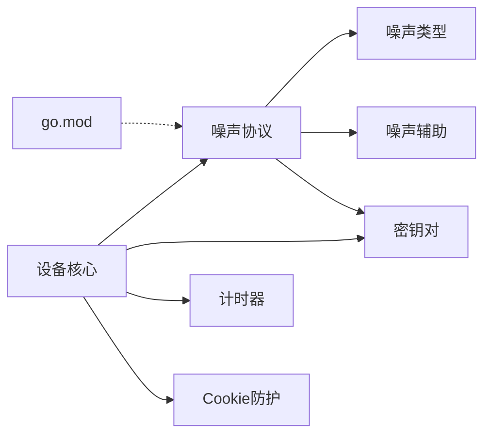

# 加密解密处理

<cite>
**本文引用的文件**
- [device/noise-protocol.go](file://device/noise-protocol.go)
- [device/noise-helpers.go](file://device/noise-helpers.go)
- [device/noise-types.go](file://device/noise-types.go)
- [device/keypair.go](file://device/keypair.go)
- [device/device.go](file://device/device.go)
- [device/send.go](file://device/send.go)
- [device/receive.go](file://device/receive.go)
- [device/cookie.go](file://device/cookie.go)
- [device/timers.go](file://device/timers.go)
- [go.mod](file://go.mod)
</cite>

## 目录
1. [简介](#简介)
2. [项目结构](#项目结构)
3. [核心组件](#核心组件)
4. [架构总览](#架构总览)
5. [详细组件分析](#详细组件分析)
6. [依赖关系分析](#依赖关系分析)
7. [性能考虑](#性能考虑)
8. [故障排查指南](#故障排查指南)
9. [结论](#结论)
10. [附录](#附录)

## 简介
本文件聚焦于WireGuard-Go中的加密与解密处理，系统性说明密钥对管理、主密钥派生、会话密钥生成与轮换策略；Noise协议集成实现（握手流程与状态维护）；对称加密算法在数据包加解密中的应用；密钥安全存储与访问控制；以及性能优化与安全审计方法。文档面向不同技术背景的读者，提供从高层到代码级的渐进式说明，并辅以流程图与时序图帮助理解。

## 项目结构
本项目采用分层与按功能模块组织的方式：
- device层：封装WireGuard设备核心逻辑，包括噪声协议、密钥对、发送/接收流水线、计时器与Cookie防护等。
- conn层：网络绑定与传输抽象。
- tun层：TUN接口适配。
- ipc/uapi：用户态API。
- 其他：速率限制、重放保护、时间戳等工具。

与加密相关的关键文件集中在device目录，涵盖噪声协议实现、密钥派生、密钥对生命周期管理与数据面加解密路径。

图表来源
- [device/noise-protocol.go:1-200](file://device/noise-protocol.go#L1-L200)
- [device/keypair.go:1-200](file://device/keypair.go#L1-L200)
- [device/device.go:1-200](file://device/device.go#L1-L200)
- [device/send.go:1-200](file://device/send.go#L1-L200)
- [device/receive.go:1-200](file://device/receive.go#L1-L200)
- [device/timers.go:1-200](file://device/timers.go#L1-L200)
- [device/cookie.go:1-200](file://device/cookie.go#L1-L200)
- [go.mod:1-50](file://go.mod#L1-L50)

章节来源
- [device/noise-protocol.go:1-200](file://device/noise-protocol.go#L1-L200)
- [device/keypair.go:1-200](file://device/keypair.go#L1-L200)
- [device/device.go:1-200](file://device/device.go#L1-L200)

## 核心组件
- 噪声协议栈：负责握手、密钥派生、消息认证与加密、状态机推进。
- 密钥对管理：维护长期私钥/公钥、会话密钥对、当前/下一密钥对切换与轮换。
- 发送路径：将上层数据封装为噪声包，进行对称加密与认证，必要时触发握手或密钥轮换。
- 接收路径：解析噪声包，验证MAC，解密数据，推进状态机，处理重放与过期。
- Cookie防护：缓解DoS攻击，要求客户端携带可验证的Cookie。
- 计时器：管理握手超时、密钥轮换周期、心跳保活等。

章节来源
- [device/noise-protocol.go:1-200](file://device/noise-protocol.go#L1-L200)
- [device/keypair.go:1-200](file://device/keypair.go#L1-L200)
- [device/send.go:1-200](file://device/send.go#L1-L200)
- [device/receive.go:1-200](file://device/receive.go#L1-L200)
- [device/cookie.go:1-200](file://device/cookie.go#L1-L200)
- [device/timers.go:1-200](file://device/timers.go#L1-L200)

## 架构总览
下图展示设备层各组件在加解密流程中的交互关系：发送路径调用噪声协议进行封装与加密，接收路径进行反操作；密钥对由设备统一管理，计时器驱动轮换；Cookie防护在握手前校验客户端能力。

图表来源
- [device/send.go:1-200](file://device/send.go#L1-L200)
- [device/receive.go:1-200](file://device/receive.go#L1-L200)
- [device/noise-protocol.go:1-200](file://device/noise-protocol.go#L1-L200)
- [device/keypair.go:1-200](file://device/keypair.go#L1-L200)
- [device/timers.go:1-200](file://device/timers.go#L1-L200)

## 详细组件分析

### 密钥对管理机制
- 主密钥派生：使用设备的长期私钥与对端公钥参与噪声握手，通过KDF派生出初始握手密钥与后续会话密钥材料。
- 会话密钥生成：每次握手成功后生成一对会话密钥（发送/接收方向），用于数据面的对称加密与认证。
- 密钥轮换策略：基于时间或包计数阈值触发轮换；支持“当前/下一”双密钥窗口，确保无缝切换与旧密钥的有限容忍期。
- 安全存储与访问控制：私钥仅以最小权限暴露给必要组件；会话密钥在内存中受保护，避免泄露；日志与调试输出需脱敏。

图表来源
- [device/noise-protocol.go:1-200](file://device/noise-protocol.go#L1-L200)
- [device/keypair.go:1-200](file://device/keypair.go#L1-L200)
- [device/timers.go:1-200](file://device/timers.go#L1-L200)

章节来源
- [device/keypair.go:1-200](file://device/keypair.go#L1-L200)
- [device/noise-protocol.go:1-200](file://device/noise-protocol.go#L1-L200)
- [device/timers.go:1-200](file://device/timers.go#L1-L200)

### Noise协议集成实现
- 握手过程：包含身份交换、密钥协商、挑战应答与完整性校验；完成后进入稳定数据传输阶段。
- 状态维护：维护握手状态机、序列号、重放窗口、已确认的密钥材料；支持失败重试与超时重置。
- 错误恢复：握手失败时清理临时状态，记录事件，必要时回退到空闲状态。

图表来源
- [device/noise-protocol.go:1-200](file://device/noise-protocol.go#L1-L200)
- [device/noise-types.go:1-200](file://device/noise-types.go#L1-L200)
- [device/noise-helpers.go:1-200](file://device/noise-helpers.go#L1-L200)

章节来源
- [device/noise-protocol.go:1-200](file://device/noise-protocol.go#L1-L200)
- [device/noise-types.go:1-200](file://device/noise-types.go#L1-L200)
- [device/noise-helpers.go:1-200](file://device/noise-helpers.go#L1-L200)

### 对称加密算法与数据包流程
- 算法使用：数据面采用现代AEAD算法进行加密与认证，保证机密性与完整性。
- 发送流程：组装噪声头部、填充数据、计算MAC、附加序列号与标识，最终发送。
- 接收流程：解析头部、校验MAC、解密数据、更新重放窗口、交付上层。

图表来源
- [device/send.go:1-200](file://device/send.go#L1-L200)
- [device/receive.go:1-200](file://device/receive.go#L1-L200)
- [device/noise-protocol.go:1-200](file://device/noise-protocol.go#L1-L200)

章节来源
- [device/send.go:1-200](file://device/send.go#L1-L200)
- [device/receive.go:1-200](file://device/receive.go#L1-L200)
- [device/noise-protocol.go:1-200](file://device/noise-protocol.go#L1-L200)

### 密钥安全存储与访问控制
- 私钥最小暴露：仅在初始化与握手阶段访问长期私钥；运行时不持久化敏感信息。
- 会话密钥隔离：每个对端拥有独立密钥上下文，避免跨会话污染。
- 访问控制：通过设备对象集中管理密钥生命周期；日志与监控不包含明文密钥。
- 内存安全：尽量使用不可变结构与一次性缓冲，减少密钥驻留时间。

章节来源
- [device/device.go:1-200](file://device/device.go#L1-L200)
- [device/keypair.go:1-200](file://device/keypair.go#L1-L200)

### Cookie防护与抗DoS
- 目的：防止恶意大量握手请求耗尽资源。
- 机制：服务器向客户端下发Cookie，客户端在后续握手携带；服务器验证Cookie有效性后再继续握手。
- 影响：增加握手往返但显著提升安全性。

章节来源
- [device/cookie.go:1-200](file://device/cookie.go#L1-L200)

### 计时器与轮换调度
- 任务：握手超时、心跳保活、密钥轮换周期、重放窗口清理。
- 行为：定时触发检查，满足条件则触发轮换或清理；异常时重置或告警。

章节来源
- [device/timers.go:1-200](file://device/timers.go#L1-L200)

## 依赖关系分析
- 噪声协议依赖：
  - 噪声类型定义与辅助函数，提供数据结构与通用操作。
  - 密钥对管理，提供会话密钥与长期密钥的存取。
- 设备核心协调：
  - 统一调度发送/接收路径、计时器与Cookie防护。
- 外部依赖：
  - 通过go.mod声明加密库与系统依赖，确保一致版本与兼容性。

图表来源
- [device/noise-protocol.go:1-200](file://device/noise-protocol.go#L1-L200)
- [device/noise-types.go:1-200](file://device/noise-types.go#L1-L200)
- [device/noise-helpers.go:1-200](file://device/noise-helpers.go#L1-L200)
- [device/keypair.go:1-200](file://device/keypair.go#L1-L200)
- [device/device.go:1-200](file://device/device.go#L1-L200)
- [device/timers.go:1-200](file://device/timers.go#L1-L200)
- [device/cookie.go:1-200](file://device/cookie.go#L1-L200)
- [go.mod:1-50](file://go.mod#L1-L50)

章节来源
- [go.mod:1-50](file://go.mod#L1-L50)
- [device/device.go:1-200](file://device/device.go#L1-L200)

## 性能考虑
- 零拷贝与缓冲池：复用缓冲区减少分配开销，降低GC压力。
- 并行与批处理：尽可能批量处理数据包，减少锁竞争与上下文切换。
- 密钥轮换阈值：合理设置时间与包计数阈值，平衡安全性与性能。
- 硬件加速：利用平台提供的AEAD指令集提升吞吐。
- 日志与监控：在生产环境关闭详细日志，启用关键指标采集。

[本节为通用指导，无需特定文件引用]

## 故障排查指南
- 握手失败：
  - 检查双方公钥配置是否正确。
  - 查看握手超时与重试次数。
  - 确认Cookie是否有效且未过期。
- 数据包解密失败：
  - 核查序列号与重放窗口。
  - 确认MAC校验失败原因（可能为密钥不一致或篡改）。
- 密钥轮换问题：
  - 检查定时器是否正常运行。
  - 观察新旧密钥窗口是否重叠。
- 性能退化：
  - 评估缓冲池命中率与锁争用。
  - 检查是否有异常流量导致频繁握手。

章节来源
- [device/noise-protocol.go:1-200](file://device/noise-protocol.go#L1-L200)
- [device/receive.go:1-200](file://device/receive.go#L1-L200)
- [device/timers.go:1-200](file://device/timers.go#L1-L200)
- [device/cookie.go:1-200](file://device/cookie.go#L1-L200)

## 结论
WireGuard-Go通过噪声协议实现了高效、安全的端到端通信。其密钥对管理、会话密钥生成与轮换策略确保了前向保密与后向恢复；数据包加解密流程简洁可靠；Cookie防护增强了抗DoS能力；计时器驱动了关键生命周期管理。结合合理的性能优化与安全审计实践，可在生产环境中获得高吞吐与强安全保障。

[本节为总结性内容，无需特定文件引用]

## 附录

### 实际代码示例（路径指引）
- 密钥管理与派生：
  - 参考路径：[device/keypair.go:1-200](file://device/keypair.go#L1-L200)、[device/noise-protocol.go:1-200](file://device/noise-protocol.go#L1-L200)
- 噪声握手流程：
  - 参考路径：[device/noise-protocol.go:1-200](file://device/noise-protocol.go#L1-L200)、[device/noise-types.go:1-200](file://device/noise-types.go#L1-L200)
- 数据包加密/解密：
  - 参考路径：[device/send.go:1-200](file://device/send.go#L1-L200)、[device/receive.go:1-200](file://device/receive.go#L1-L200)
- Cookie防护：
  - 参考路径：[device/cookie.go:1-200](file://device/cookie.go#L1-L200)
- 计时器与轮换：
  - 参考路径：[device/timers.go:1-200](file://device/timers.go#L1-L200)

[本节为索引性内容，无需特定文件引用]