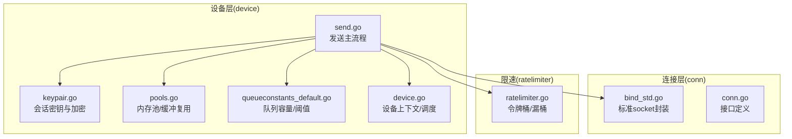
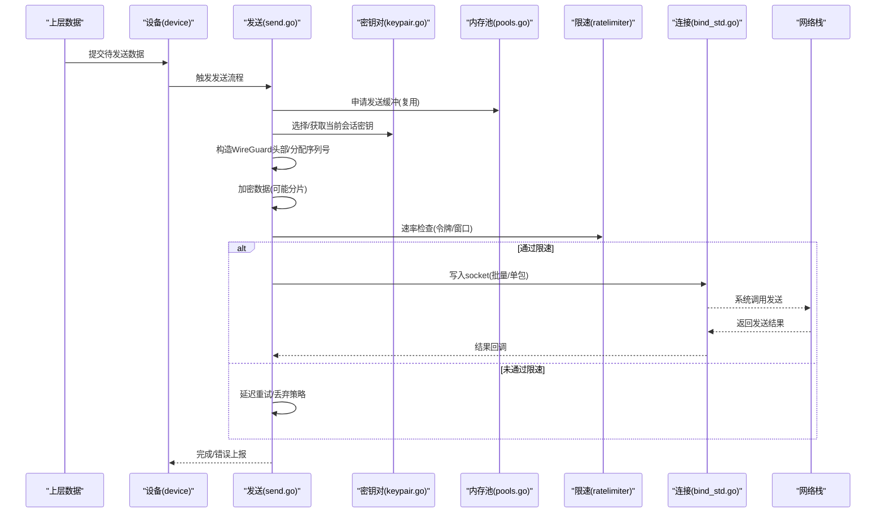
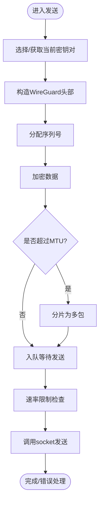
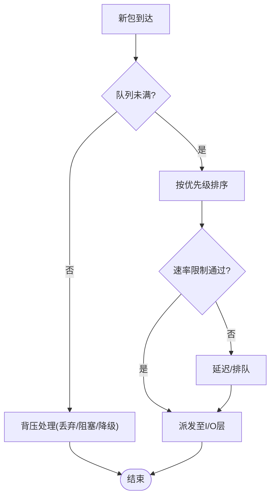
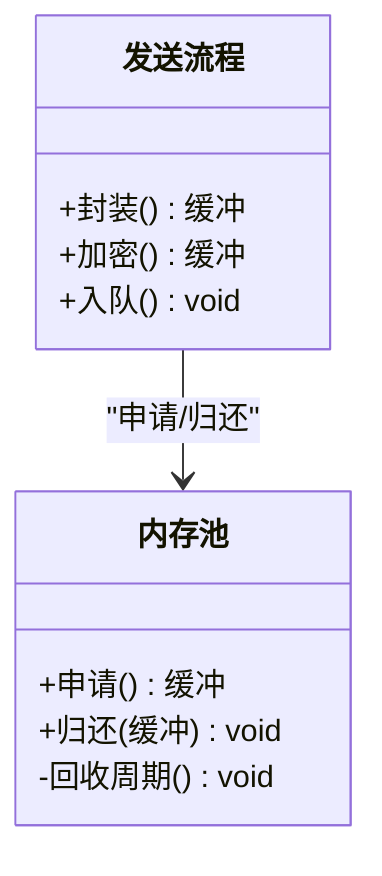
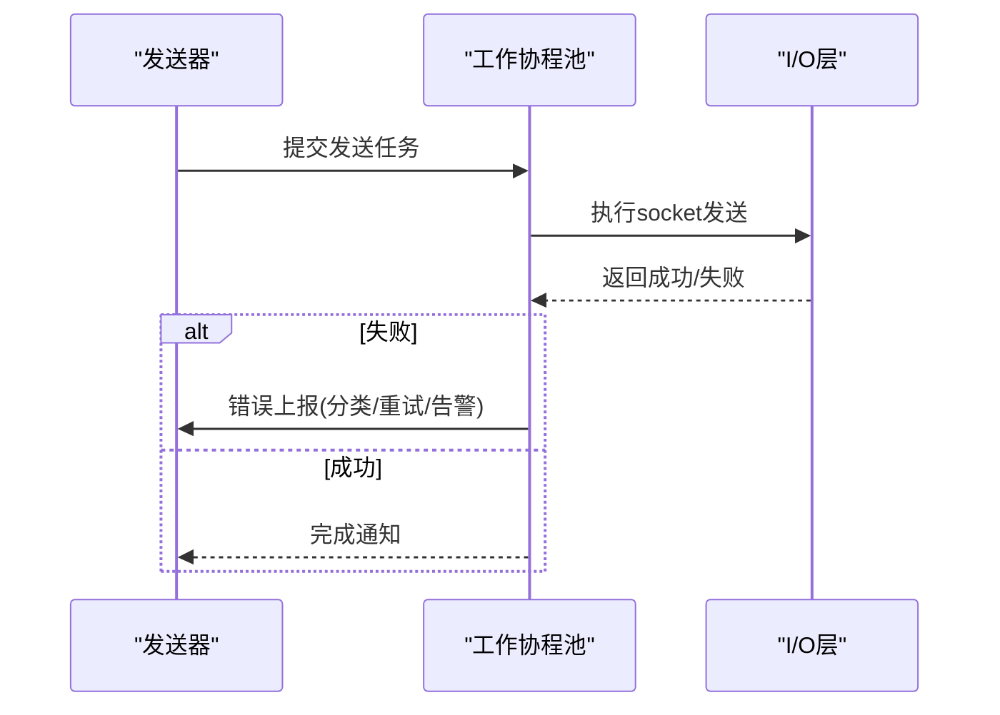
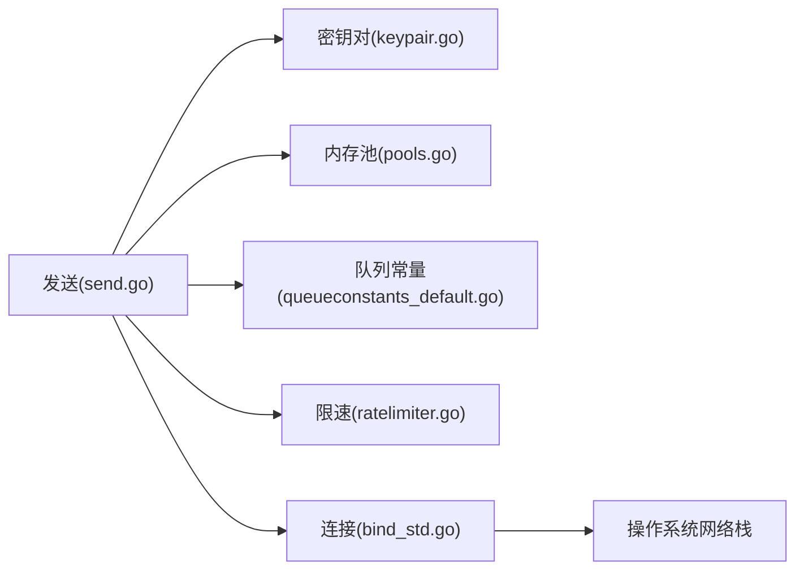

# 数据包发送处理

<cite>
**本文引用的文件**
- [device/send.go](file://device/send.go)
- [device/pools.go](file://device/pools.go)
- [device/queueconstants_default.go](file://device/queueconstants_default.go)
- [device/keypair.go](file://device/keypair.go)
- [device/device.go](file://device/device.go)
- [conn/bind_std.go](file://conn/bind_std.go)
- [conn/conn.go](file://conn/conn.go)
- [ratelimiter/ratelimiter.go](file://ratelimiter/ratelimiter.go)
</cite>

## 目录
1. [简介](#简介)
2. [项目结构](#项目结构)
3. [核心组件](#核心组件)
4. [架构总览](#架构总览)
5. [详细组件分析](#详细组件分析)
6. [依赖关系分析](#依赖关系分析)
7. [性能考虑](#性能考虑)
8. [故障排查指南](#故障排查指南)
9. [结论](#结论)
10. [附录](#附录)

## 简介
本文件聚焦于 WireGuard-go 的数据包发送路径，系统性说明从上层数据到网络栈的完整流程：协议头封装、序列号分配、加密与分片、发送队列管理（优先级与流量控制）、内存池与缓冲区复用、并发发送与错误处理，以及监控与调优方法。文档以代码级视角展开，配合流程图与时序图帮助读者快速定位关键实现位置。

## 项目结构
围绕“发送”这一主题，仓库中与发送相关的关键模块分布如下：
- device 层：负责协议封装、密钥对管理、队列常量、内存池、定时器与设备状态等。
- conn 层：抽象底层 socket I/O，屏蔽平台差异。
- ratelimiter 层：提供速率限制能力，用于发送侧限速。
- main 入口：启动设备并驱动收发循环。

图表来源
- [device/send.go:1-200](file://device/send.go#L1-L200)
- [device/keypair.go:1-200](file://device/keypair.go#L1-L200)
- [device/pools.go:1-200](file://device/pools.go#L1-L200)
- [device/queueconstants_default.go:1-200](file://device/queueconstants_default.go#L1-L200)
- [device/device.go:1-200](file://device/device.go#L1-L200)
- [conn/bind_std.go:1-200](file://conn/bind_std.go#L1-L200)
- [conn/conn.go:1-200](file://conn/conn.go#L1-L200)
- [ratelimiter/ratelimiter.go:1-200](file://ratelimiter/ratelimiter.go#L1-L200)

章节来源
- [device/send.go:1-200](file://device/send.go#L1-L200)
- [device/device.go:1-200](file://device/device.go#L1-L200)
- [conn/conn.go:1-200](file://conn/conn.go#L1-L200)

## 核心组件
- 发送主流程：负责将上层数据按 WireGuard 协议进行封装，包括添加头部、分配序列号、选择密钥对、执行加密与分片，然后入队并异步发送。
- 密钥对与会话：维护当前活跃密钥对，支持密钥轮换；加密时绑定对应会话上下文。
- 内存池：为发送路径提供零拷贝或低拷贝的缓冲复用，减少 GC 压力。
- 队列与常量：定义发送队列容量、批大小、超时等参数，支撑优先级与流量控制。
- 连接抽象：统一不同平台的 socket 发送接口，屏蔽系统差异。
- 速率限制：在发送前进行速率控制，避免拥塞和丢包。

章节来源
- [device/send.go:1-200](file://device/send.go#L1-L200)
- [device/keypair.go:1-200](file://device/keypair.go#L1-L200)
- [device/pools.go:1-200](file://device/pools.go#L1-L200)
- [device/queueconstants_default.go:1-200](file://device/queueconstants_default.go#L1-L200)
- [conn/bind_std.go:1-200](file://conn/bind_std.go#L1-L200)
- [ratelimiter/ratelimiter.go:1-200](file://ratelimiter/ratelimiter.go#L1-L200)

## 架构总览
下图展示了从应用数据到网络发出的端到端发送路径，涵盖封装、加密、队列、限速与I/O。

图表来源
- [device/send.go:1-200](file://device/send.go#L1-L200)
- [device/keypair.go:1-200](file://device/keypair.go#L1-L200)
- [device/pools.go:1-200](file://device/pools.go#L1-L200)
- [conn/bind_std.go:1-200](file://conn/bind_std.go#L1-L200)
- [ratelimiter/ratelimiter.go:1-200](file://ratelimiter/ratelimiter.go#L1-L200)

## 详细组件分析

### 发送主流程与协议封装
- 协议头添加：根据目标对端与当前会话，填充 WireGuard 报文头部字段（如类型、标识等）。
- 序列号分配：为每个加密后的报文分配单调递增的序列号，用于接收端重放保护。
- 加密与分片：使用当前会话密钥对数据进行加密；当数据超过MTU时进行分片，保证每片独立可解密。
- 入队与调度：将待发包放入发送队列，由调度器按优先级与流量控制策略派发。

图表来源
- [device/send.go:1-200](file://device/send.go#L1-L200)
- [device/keypair.go:1-200](file://device/keypair.go#L1-L200)

章节来源
- [device/send.go:1-200](file://device/send.go#L1-L200)
- [device/keypair.go:1-200](file://device/keypair.go#L1-L200)

### 发送队列管理与优先级/流量控制
- 队列容量与阈值：通过队列常量配置最大队列长度、批大小、超时等，防止内存膨胀与尾延抖动。
- 优先级：可为不同类别的流量设置优先级（如控制面优先），在高负载时保障关键消息及时发出。
- 流量控制：结合速率限制器与拥塞感知，动态调整发送速率，避免丢包与重传风暴。
- 背压机制：当队列满时，可选择丢弃、阻塞或降级策略，确保系统稳定性。

图表来源
- [device/queueconstants_default.go:1-200](file://device/queueconstants_default.go#L1-L200)
- [ratelimiter/ratelimiter.go:1-200](file://ratelimiter/ratelimiter.go#L1-L200)

章节来源
- [device/queueconstants_default.go:1-200](file://device/queueconstants_default.go#L1-L200)
- [ratelimiter/ratelimiter.go:1-200](file://ratelimiter/ratelimiter.go#L1-L200)

### 内存池与缓冲复用
- 缓冲复用：发送路径通过内存池复用固定大小的缓冲，减少频繁分配与GC。
- 生命周期管理：发送完成后立即归还缓冲，避免悬挂引用导致内存泄漏。
- 安全清理：在归还前对敏感数据进行覆写，降低信息泄露风险。
- 尺寸适配：根据常见报文大小预分配多种尺寸缓冲，提高命中率。

图表来源
- [device/pools.go:1-200](file://device/pools.go#L1-L200)
- [device/send.go:1-200](file://device/send.go#L1-L200)

章节来源
- [device/pools.go:1-200](file://device/pools.go#L1-L200)
- [device/send.go:1-200](file://device/send.go#L1-L200)

### 并发发送与错误处理
- goroutine 管理：发送任务通常以goroutine形式派发，配合工作池或扇出模型提升吞吐。
- 错误分类：区分网络错误、资源不足、协议错误等，采取重试、回退或告警策略。
- 优雅关闭：在设备关闭时，确保所有发送任务完成或取消，避免僵尸goroutine。
- 可观测性：记录关键指标（发送速率、丢包率、延迟分布）以便监控与调优。

图表来源
- [device/send.go:1-200](file://device/send.go#L1-L200)
- [conn/bind_std.go:1-200](file://conn/bind_std.go#L1-L200)

章节来源
- [device/send.go:1-200](file://device/send.go#L1-L200)
- [conn/bind_std.go:1-200](file://conn/bind_std.go#L1-L200)

### 实际代码示例（步骤指引）
以下以“步骤+文件路径”的方式展示发送流程的关键步骤，便于对照源码阅读：
- 选择/获取当前密钥对：[device/keypair.go:1-200](file://device/keypair.go#L1-L200)
- 构造WireGuard头部与分配序列号：[device/send.go:1-200](file://device/send.go#L1-L200)
- 加密与可能的分片：[device/send.go:1-200](file://device/send.go#L1-L200)
- 速率限制检查：[ratelimiter/ratelimiter.go:1-200](file://ratelimiter/ratelimiter.go#L1-L200)
- 入队与调度：[device/send.go:1-200](file://device/send.go#L1-L200)
- 调用socket发送：[conn/bind_std.go:1-200](file://conn/bind_std.go#L1-L200)
- 错误处理与指标上报：[device/send.go:1-200](file://device/send.go#L1-L200)

章节来源
- [device/send.go:1-200](file://device/send.go#L1-L200)
- [device/keypair.go:1-200](file://device/keypair.go#L1-L200)
- [conn/bind_std.go:1-200](file://conn/bind_std.go#L1-L200)
- [ratelimiter/ratelimiter.go:1-200](file://ratelimiter/ratelimiter.go#L1-L200)

## 依赖关系分析
发送路径依赖多个子系统，耦合点如下：
- 设备层依赖密钥对、内存池、队列常量与连接抽象。
- 连接层向上暴露统一的发送接口，向下对接操作系统网络栈。
- 速率限制器作为横切关注点，贯穿发送前的准入控制。

图表来源
- [device/send.go:1-200](file://device/send.go#L1-L200)
- [device/keypair.go:1-200](file://device/keypair.go#L1-L200)
- [device/pools.go:1-200](file://device/pools.go#L1-L200)
- [device/queueconstants_default.go:1-200](file://device/queueconstants_default.go#L1-L200)
- [conn/bind_std.go:1-200](file://conn/bind_std.go#L1-L200)
- [ratelimiter/ratelimiter.go:1-200](file://ratelimiter/ratelimiter.go#L1-L200)

章节来源
- [device/send.go:1-200](file://device/send.go#L1-L200)
- [conn/conn.go:1-200](file://conn/conn.go#L1-L200)

## 性能考虑
- 批处理与聚合：尽量合并小包以降低系统调用次数，提高吞吐。
- 零拷贝/少拷贝：利用内存池与缓冲复用减少复制开销。
- 合理队列尺寸：依据链路带宽与RTT调整队列容量，平衡延迟与吞吐。
- 速率限制：避免突发导致拥塞，采用平滑限流策略。
- 分片优化：控制分片粒度，避免过度分片造成头部开销过大。
- 监控指标：采集发送速率、丢包率、P95/P99延迟、队列深度、GC停顿等。

[本节为通用指导，不直接分析具体文件]

## 故障排查指南
- 发送失败：检查socket错误码、权限与路由可达性。
- 高延迟：观察队列深度与速率限制器状态，必要时扩容或调整阈值。
- 内存增长：确认缓冲是否正确归还，是否存在悬挂引用。
- 加密异常：核对密钥对状态与轮转逻辑，检查对端协商一致性。
- 丢包严重：评估链路质量与拥塞情况，调整队列与限速策略。

章节来源
- [device/send.go:1-200](file://device/send.go#L1-L200)
- [conn/bind_std.go:1-200](file://conn/bind_std.go#L1-L200)

## 结论
WireGuard-go 的发送路径以清晰的模块化设计实现了高效、安全的报文发送：通过协议头封装、序列号分配、加密与分片，结合内存池复用、队列与速率控制、并发调度与完善的错误处理，兼顾了性能与可靠性。建议在生产环境中结合监控指标持续调优，以获得最佳体验。

[本节为总结，不直接分析具体文件]

## 附录
- 关键实现位置速查
  - 发送主流程与封装：[device/send.go:1-200](file://device/send.go#L1-L200)
  - 密钥对与会话：[device/keypair.go:1-200](file://device/keypair.go#L1-L200)
  - 内存池与缓冲复用：[device/pools.go:1-200](file://device/pools.go#L1-L200)
  - 队列常量与阈值：[device/queueconstants_default.go:1-200](file://device/queueconstants_default.go#L1-L200)
  - 连接抽象与I/O：[conn/bind_std.go:1-200](file://conn/bind_std.go#L1-L200), [conn/conn.go:1-200](file://conn/conn.go#L1-L200)
  - 速率限制：[ratelimiter/ratelimiter.go:1-200](file://ratelimiter/ratelimiter.go#L1-L200)