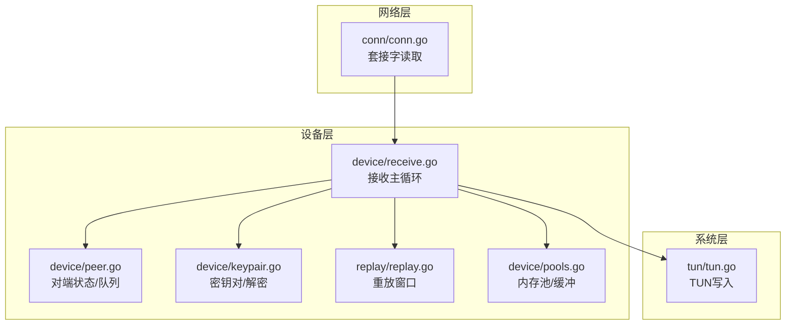
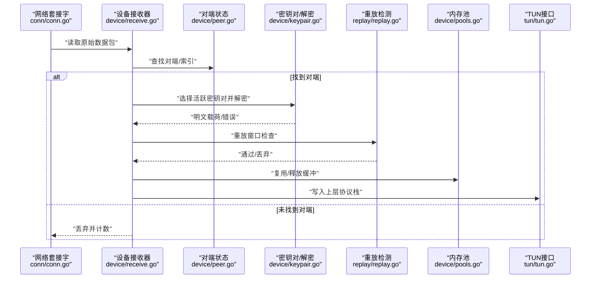
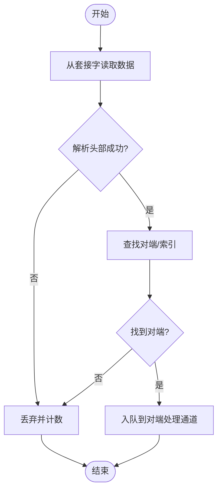
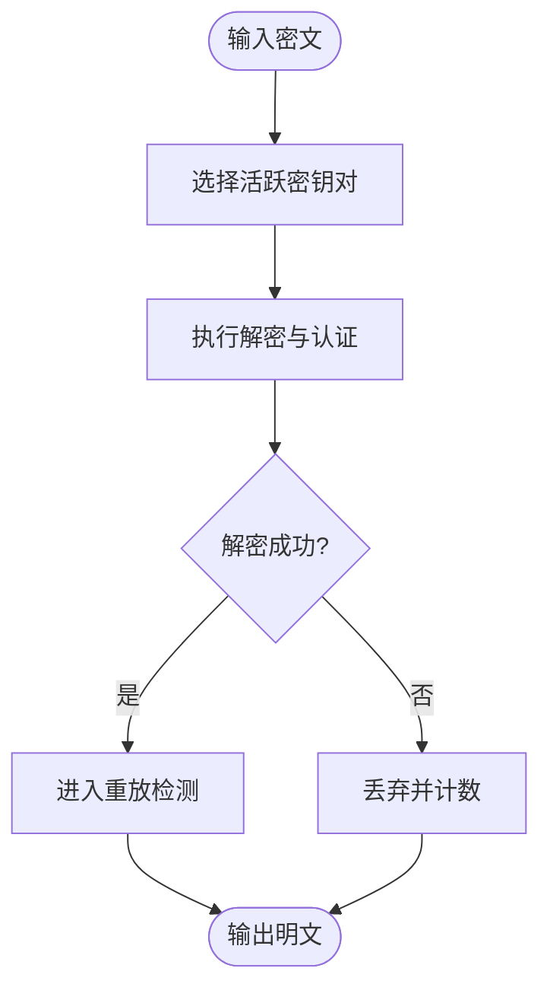
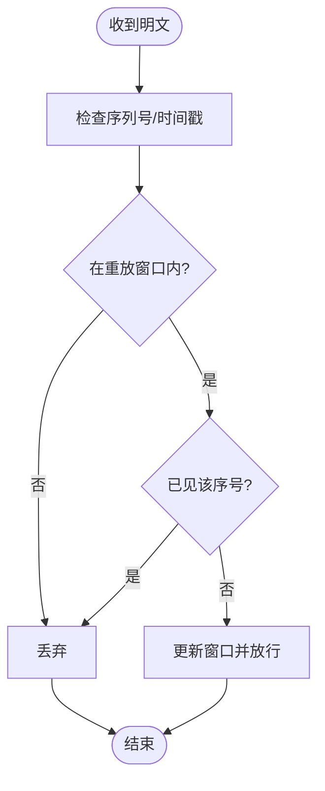
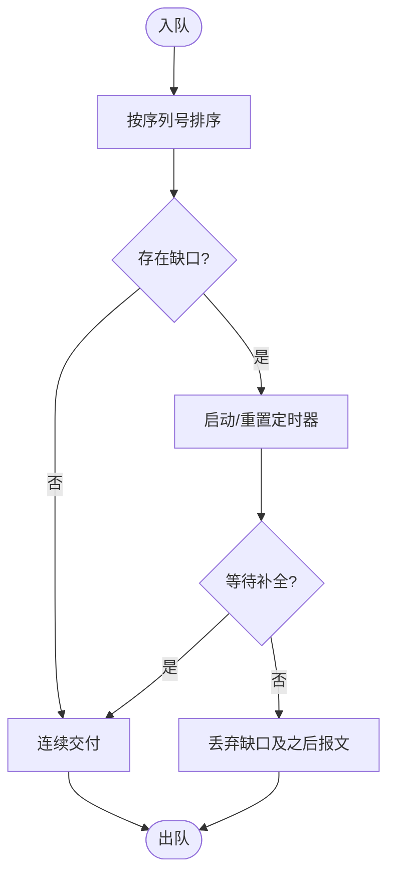
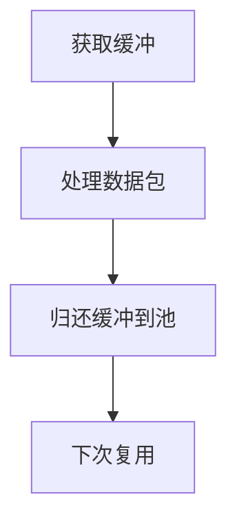
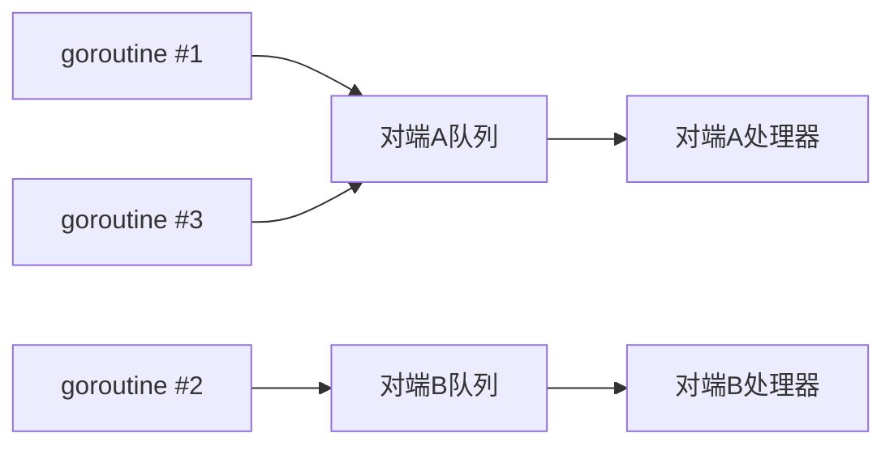
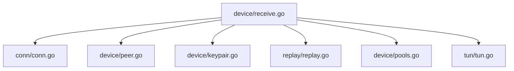

# 数据包接收处理

<cite>
**本文引用的文件**
- [device/receive.go](file://device/receive.go)
- [device/device.go](file://device/device.go)
- [device/peer.go](file://device/peer.go)
- [device/keypair.go](file://device/keypair.go)
- [device/pools.go](file://device/pools.go)
- [replay/replay.go](file://replay/replay.go)
- [conn/conn.go](file://conn/conn.go)
- [tun/tun.go](file://tun/tun.go)
</cite>

## 目录
1. [简介](#简介)
2. [项目结构](#项目结构)
3. [核心组件](#核心组件)
4. [架构总览](#架构总览)
5. [详细组件分析](#详细组件分析)
6. [依赖关系分析](#依赖关系分析)
7. [性能考量](#性能考量)
8. [故障诊断指南](#故障诊断指南)
9. [结论](#结论)
10. [附录](#附录)

## 简介
本文件聚焦 wireguard-go 的数据包接收处理流程，覆盖从网络层到内核协议栈的完整路径：多连接并发接收、协议头解析、解密与完整性校验、重放攻击检测、乱序包处理与超时管理、内存池回收策略，以及性能分析与故障定位方法。文档以代码级视角展开，配合流程图与时序图帮助读者快速理解关键步骤与边界条件。

## 项目结构
与数据包接收相关的关键模块分布如下：
- 设备与对端管理：device/device.go、device/peer.go
- 接收主流程与队列：device/receive.go
- 密钥对与解密验证：device/keypair.go
- 重放防护：replay/replay.go
- 内存池与缓冲复用：device/pools.go
- 网络套接字抽象：conn/conn.go
- TUN 接口（上层协议栈）：tun/tun.go

图表来源
- [conn/conn.go:1-200](file://conn/conn.go#L1-L200)
- [device/receive.go:1-300](file://device/receive.go#L1-L300)
- [device/peer.go:1-200](file://device/peer.go#L1-L200)
- [device/keypair.go:1-200](file://device/keypair.go#L1-L200)
- [replay/replay.go:1-200](file://replay/replay.go#L1-L200)
- [device/pools.go:1-200](file://device/pools.go#L1-L200)
- [tun/tun.go:1-200](file://tun/tun.go#L1-L200)

章节来源
- [device/receive.go:1-300](file://device/receive.go#L1-L300)
- [device/device.go:1-200](file://device/device.go#L1-L200)
- [device/peer.go:1-200](file://device/peer.go#L1-L200)
- [device/keypair.go:1-200](file://device/keypair.go#L1-L200)
- [replay/replay.go:1-200](file://replay/replay.go#L1-L200)
- [device/pools.go:1-200](file://device/pools.go#L1-L200)
- [conn/conn.go:1-200](file://conn/conn.go#L1-L200)
- [tun/tun.go:1-200](file://tun/tun.go#L1-L200)

## 核心组件
- 接收主循环：负责从多个监听端口读取数据帧，分派到对应对端，执行解封装、解密、重放检测、乱序重组与投递。
- 对端与队列：维护每个对端的接收队列、定时器、乱序窗口与统计信息。
- 密钥对与解密：基于当前会话密钥进行噪声协议解密与认证。
- 重放防护：基于单调时间戳或序列号的重放窗口，拒绝过期或重复报文。
- 内存池：预分配缓冲区与对象池，减少 GC 压力并提升吞吐。
- 并发模型：每连接独立 goroutine 读入，按对端哈希分片进入串行化队列，避免竞争。

章节来源
- [device/receive.go:1-300](file://device/receive.go#L1-L300)
- [device/peer.go:1-200](file://device/peer.go#L1-L200)
- [device/keypair.go:1-200](file://device/keypair.go#L1-L200)
- [replay/replay.go:1-200](file://replay/replay.go#L1-L200)
- [device/pools.go:1-200](file://device/pools.go#L1-L200)

## 架构总览
下图展示一次典型接收处理的端到端时序：从套接字读取到最终写入 TUN。

图表来源
- [conn/conn.go:1-200](file://conn/conn.go#L1-L200)
- [device/receive.go:1-300](file://device/receive.go#L1-L300)
- [device/peer.go:1-200](file://device/peer.go#L1-L200)
- [device/keypair.go:1-200](file://device/keypair.go#L1-L200)
- [replay/replay.go:1-200](file://replay/replay.go#L1-L200)
- [device/pools.go:1-200](file://device/pools.go#L1-L200)
- [tun/tun.go:1-200](file://tun/tun.go#L1-L200)

## 详细组件分析

### 接收主循环与协议头解析
- 入口与调度：接收循环从绑定套接字批量读取数据，依据头部字段识别对端索引，将数据包路由至对应对端处理通道。
- 协议头解析：解析噪声协议头部，提取对端标识、消息类型、序列号等关键字段，用于后续解密与重放检测。
- 错误与异常：对畸形包、长度不符、未知类型等进行计数与丢弃，避免影响整体吞吐。

图表来源
- [device/receive.go:1-300](file://device/receive.go#L1-L300)
- [conn/conn.go:1-200](file://conn/conn.go#L1-L200)

章节来源
- [device/receive.go:1-300](file://device/receive.go#L1-L300)
- [conn/conn.go:1-200](file://conn/conn.go#L1-L200)

### 解密与完整性验证
- 密钥对选择：根据对端索引与当前会话状态选择活跃密钥对。
- 解密流程：调用噪声协议解密函数，完成认证标签校验，确保数据来源与完整性。
- 失败处理：解密失败视为潜在攻击或密钥不同步，记录日志并丢弃。

图表来源
- [device/keypair.go:1-200](file://device/keypair.go#L1-L200)
- [device/receive.go:1-300](file://device/receive.go#L1-L300)

章节来源
- [device/keypair.go:1-200](file://device/keypair.go#L1-L200)
- [device/receive.go:1-300](file://device/receive.go#L1-L300)

### 重放攻击检测
- 机制：基于单调时间戳或序列号的滑动窗口，仅接受在窗口内且未出现过的报文。
- 行为：重复或过期报文直接丢弃；新报文更新窗口状态。
- 安全意义：防止历史报文被重放注入。

图表来源
- [replay/replay.go:1-200](file://replay/replay.go#L1-L200)
- [device/receive.go:1-300](file://device/receive.go#L1-L300)

章节来源
- [replay/replay.go:1-200](file://replay/replay.go#L1-L200)
- [device/receive.go:1-300](file://device/receive.go#L1-L300)

### 接收队列与乱序处理、超时管理
- 队列设计：每个对端拥有独立的接收队列，保证同对端顺序处理，避免竞争。
- 乱序处理：支持窗口内的乱序到达，按序列号排序后连续交付给上层。
- 超时管理：为等待缺失报文设置定时器，超时触发清理或告警，防止资源泄漏。

图表来源
- [device/peer.go:1-200](file://device/peer.go#L1-L200)
- [device/receive.go:1-300](file://device/receive.go#L1-L300)

章节来源
- [device/peer.go:1-200](file://device/peer.go#L1-L200)
- [device/receive.go:1-300](file://device/receive.go#L1-L300)

### 内存池与缓冲回收策略
- 预分配：使用对象池预分配固定大小的缓冲，降低频繁分配带来的开销。
- 生命周期：接收完成后立即归还缓冲至池中，避免持有引用导致无法回收。
- 高效利用：结合零拷贝思路与批量读写，减少内存复制与碎片化。

图表来源
- [device/pools.go:1-200](file://device/pools.go#L1-L200)
- [device/receive.go:1-300](file://device/receive.go#L1-L300)

章节来源
- [device/pools.go:1-200](file://device/pools.go#L1-L200)
- [device/receive.go:1-300](file://device/receive.go#L1-L300)

### 并发接收与资源竞争避免
- 多连接并发：每个监听端口由独立 goroutine 读取，提高并发度。
- 串行化：同一对端的所有报文进入其专属队列串行处理，避免竞态。
- 锁粒度：仅在必要处加锁（如密钥轮换、统计更新），降低锁竞争。

图表来源
- [device/receive.go:1-300](file://device/receive.go#L1-L300)
- [device/peer.go:1-200](file://device/peer.go#L1-L200)

章节来源
- [device/receive.go:1-300](file://device/receive.go#L1-L300)
- [device/peer.go:1-200](file://device/peer.go#L1-L200)

### 实际代码示例（步骤指引）
以下为接收流程的关键步骤与对应文件位置，便于对照阅读实现：
- 从套接字读取数据：[conn/conn.go:1-200](file://conn/conn.go#L1-L200)
- 解析头部并路由到对端：[device/receive.go:1-300](file://device/receive.go#L1-L300)
- 选择密钥对并解密：[device/keypair.go:1-200](file://device/keypair.go#L1-L200)
- 重放窗口检查：[replay/replay.go:1-200](file://replay/replay.go#L1-L200)
- 入队与乱序处理：[device/peer.go:1-200](file://device/peer.go#L1-L200)
- 缓冲回收：[device/pools.go:1-200](file://device/pools.go#L1-L200)
- 写入 TUN：[tun/tun.go:1-200](file://tun/tun.go#L1-L200)

章节来源
- [conn/conn.go:1-200](file://conn/conn.go#L1-L200)
- [device/receive.go:1-300](file://device/receive.go#L1-L300)
- [device/keypair.go:1-200](file://device/keypair.go#L1-L200)
- [replay/replay.go:1-200](file://replay/replay.go#L1-L200)
- [device/peer.go:1-200](file://device/peer.go#L1-L200)
- [device/pools.go:1-200](file://device/pools.go#L1-L200)
- [tun/tun.go:1-200](file://tun/tun.go#L1-L200)

## 依赖关系分析
接收流程涉及的模块依赖如下：
- device/receive.go 依赖 conn/conn.go 进行 I/O，依赖 device/peer.go 管理对端状态，依赖 device/keypair.go 进行解密，依赖 replay/replay.go 进行重放检测，依赖 device/pools.go 进行缓冲管理，最终通过 tun/tun.go 将数据交给上层协议栈。

图表来源
- [device/receive.go:1-300](file://device/receive.go#L1-L300)
- [conn/conn.go:1-200](file://conn/conn.go#L1-L200)
- [device/peer.go:1-200](file://device/peer.go#L1-L200)
- [device/keypair.go:1-200](file://device/keypair.go#L1-L200)
- [replay/replay.go:1-200](file://replay/replay.go#L1-L200)
- [device/pools.go:1-200](file://device/pools.go#L1-L200)
- [tun/tun.go:1-200](file://tun/tun.go#L1-L200)

章节来源
- [device/receive.go:1-300](file://device/receive.go#L1-L300)

## 性能考量
- 批处理与零拷贝：尽量批量读取与写入，减少系统调用次数；在可行路径上避免不必要的内存复制。
- 内存池优化：合理设置池大小，避免过大导致内存占用过高或过小导致频繁扩容。
- 锁与队列：对端串行化处理降低锁竞争；队列长度与超时参数需平衡延迟与丢包率。
- 监控指标：关注解密失败率、重放丢弃率、队列深度、超时次数、GC 频率与停顿时间。

[本节提供通用指导，不直接分析具体文件]

## 故障诊断指南
- 解密失败：检查密钥对是否同步、随机数与时间源是否正确、是否存在中间人攻击。
- 重放丢弃过多：确认两端时钟偏差、序列号生成逻辑与窗口大小配置。
- 队列堆积：排查对端处理瓶颈、超时阈值是否过短、是否有死锁或阻塞点。
- 内存增长：检查缓冲是否及时归还、是否存在长生命周期引用未释放。
- 定位方法：在关键路径添加计数与采样日志，结合系统工具观察 CPU、内存、网络 I/O 与 GC 行为。

章节来源
- [device/receive.go:1-300](file://device/receive.go#L1-L300)
- [device/keypair.go:1-200](file://device/keypair.go#L1-L200)
- [replay/replay.go:1-200](file://replay/replay.go#L1-L200)
- [device/pools.go:1-200](file://device/pools.go#L1-L200)

## 结论
wireguard-go 的接收处理以“并发读取、串行处理”为核心，结合严格的解密与重放检测、有序的乱序重组与高效的内存池，实现了高吞吐与安全性的平衡。通过合理的队列与超时策略、完善的监控与诊断手段，可在生产环境中稳定运行并持续优化。

[本节总结性内容，不直接分析具体文件]

## 附录
- 术语说明
  - 对端：通信的另一方，具有唯一索引与会话密钥。
  - 重放窗口：用于判断报文是否过期或重复的时间/序列号范围。
  - 内存池：预分配缓冲的对象池，用于减少分配开销。
- 参考路径
  - 接收主循环：[device/receive.go:1-300](file://device/receive.go#L1-L300)
  - 对端与队列：[device/peer.go:1-200](file://device/peer.go#L1-L200)
  - 解密与密钥对：[device/keypair.go:1-200](file://device/keypair.go#L1-L200)
  - 重放检测：[replay/replay.go:1-200](file://replay/replay.go#L1-L200)
  - 内存池：[device/pools.go:1-200](file://device/pools.go#L1-L200)
  - 套接字 I/O：[conn/conn.go:1-200](file://conn/conn.go#L1-L200)
  - TUN 写入：[tun/tun.go:1-200](file://tun/tun.go#L1-L200)