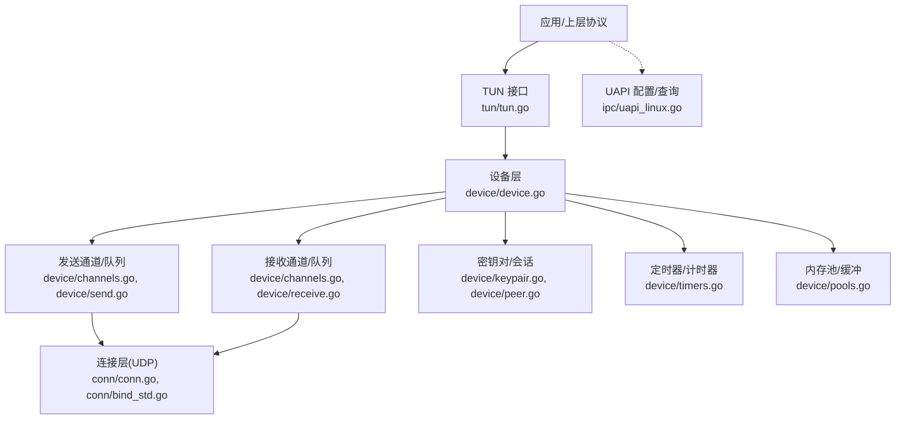
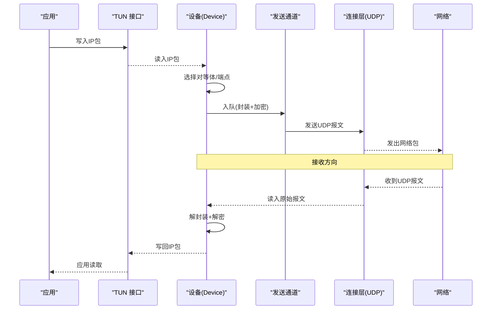
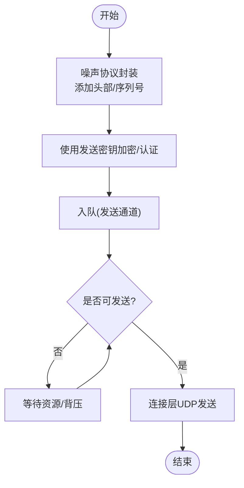
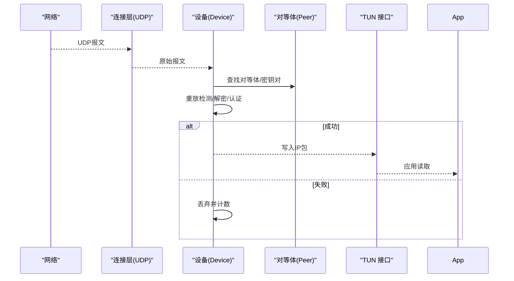
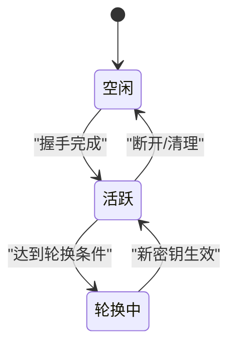
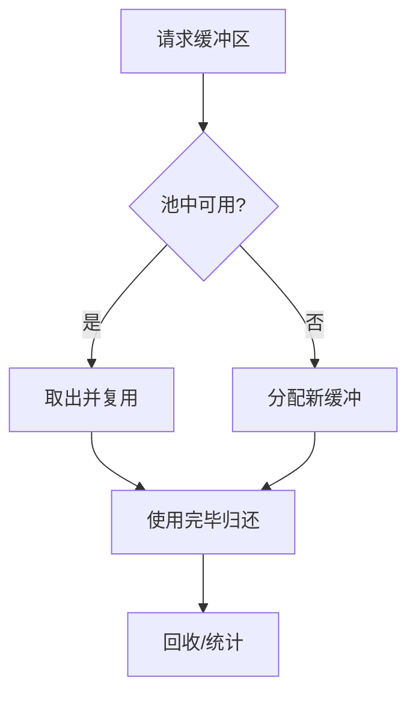
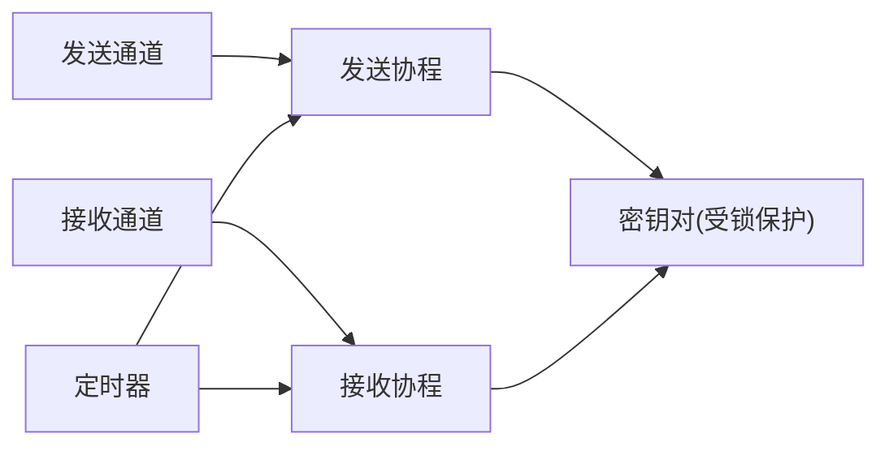
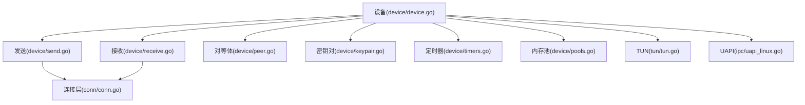

# 数据流处理

<cite>
**本文引用的文件**
- [main.go](file://main.go)
- [device/device.go](file://device/device.go)
- [device/send.go](file://device/send.go)
- [device/receive.go](file://device/receive.go)
- [device/keypair.go](file://device/keypair.go)
- [device/peer.go](file://device/peer.go)
- [device/channels.go](file://device/channels.go)
- [device/pools.go](file://device/pools.go)
- [device/constants.go](file://device/constants.go)
- [device/timers.go](file://device/timers.go)
- [conn/conn.go](file://conn/conn.go)
- [conn/bind_std.go](file://conn/bind_std.go)
- [tun/tun.go](file://tun/tun.go)
- [ipc/uapi_linux.go](file://ipc/uapi_linux.go)
</cite>

## 目录
1. [简介](#简介)
2. [项目结构](#项目结构)
3. [核心组件](#核心组件)
4. [架构总览](#架构总览)
5. [详细组件分析](#详细组件分析)
6. [依赖关系分析](#依赖关系分析)
7. [性能考量](#性能考量)
8. [故障排查指南](#故障排查指南)
9. [结论](#结论)
10. [附录](#附录)

## 简介
本文面向WireGuard Go的数据流处理，系统性说明数据包从应用侧到网络侧的完整路径，以及反向接收流程。重点覆盖：
- 发送与接收通道的实现机制
- 数据包的封装、解封装与转换过程
- 密钥对在加密/解密中的作用及轮换机制
- 内存池与缓冲区管理策略
- 并发处理与同步机制
- 数据流监控与调试方法

## 项目结构
本仓库采用分层组织：设备层（device）负责协议状态、加解密、队列与定时器；连接层（conn）抽象底层UDP套接字；TUN层（tun）对接系统虚拟网卡；IPC层（ipc）提供UAPI接口用于配置与查询。入口程序通过main初始化设备并启动收发循环。

图表来源
- [main.go:1-200](file://main.go#L1-L200)
- [device/device.go:1-300](file://device/device.go#L1-L300)
- [device/send.go:1-200](file://device/send.go#L1-L200)
- [device/receive.go:1-200](file://device/receive.go#L1-L200)
- [conn/conn.go:1-200](file://conn/conn.go#L1-L200)
- [tun/tun.go:1-200](file://tun/tun.go#L1-L200)
- [ipc/uapi_linux.go:1-200](file://ipc/uapi_linux.go#L1-L200)

章节来源
- [main.go:1-200](file://main.go#L1-L200)
- [device/device.go:1-300](file://device/device.go#L1-L300)

## 核心组件
- 设备（Device）：维护对等体集合、密钥对、定时器、统计信息，协调收/发流水线。
- 对等体（Peer）：保存端点、序列号、重放窗口、当前密钥对、计时器等。
- 密钥对（Keypair）：包含发送/接收方向的对称密钥、计数器、时间戳等。
- 发送通道（Send Queue）：将待发送报文排队，按优先级调度，进行噪声协议封装与加密。
- 接收通道（Receive Queue）：从网络读取报文，进行噪声协议解封装与解密，投递给TUN。
- 连接层（Conn）：抽象UDP读写，支持GSO/GRO、标记、粘性路由等特性。
- TUN接口：与内核虚拟网卡交互，完成IP包进出隧道。
- 定时器：管理握手、保活、重传、密钥轮换等超时事件。
- 内存池：复用缓冲区，降低分配开销，避免碎片化。

章节来源
- [device/device.go:1-300](file://device/device.go#L1-L300)
- [device/peer.go:1-200](file://device/peer.go#L1-L200)
- [device/keypair.go:1-200](file://device/keypair.go#L1-L200)
- [device/channels.go:1-200](file://device/channels.go#L1-L200)
- [device/send.go:1-200](file://device/send.go#L1-L200)
- [device/receive.go:1-200](file://device/receive.go#L1-L200)
- [conn/conn.go:1-200](file://conn/conn.go#L1-L200)
- [tun/tun.go:1-200](file://tun/tun.go#L1-L200)
- [device/timers.go:1-200](file://device/timers.go#L1-L200)
- [device/pools.go:1-200](file://device/pools.go#L1-L200)

## 架构总览
下图展示数据从TUN进入设备层，经发送通道、连接层到达网络的完整路径，以及反向接收路径。

图表来源
- [device/device.go:1-300](file://device/device.go#L1-L300)
- [device/send.go:1-200](file://device/send.go#L1-L200)
- [device/receive.go:1-200](file://device/receive.go#L1-L200)
- [conn/conn.go:1-200](file://conn/conn.go#L1-L200)
- [tun/tun.go:1-200](file://tun/tun.go#L1-L200)

## 详细组件分析

### 发送通道与发送流水线
- 入队：设备将来自TUN的IP包封装为噪声协议载荷，计算序列号，使用当前发送密钥对数据进行认证加密，生成UDP报文后入队。
- 调度：发送通道按优先级和拥塞情况调度，批量发送以减少系统调用次数。
- 发送：连接层将UDP报文写出至网络，必要时启用GSO以聚合小包。
- 失败重试：根据定时器与对等体状态，触发重传或重新握手。

图表来源
- [device/send.go:1-200](file://device/send.go#L1-L200)
- [device/channels.go:1-200](file://device/channels.go#L1-L200)
- [conn/conn.go:1-200](file://conn/conn.go#L1-L200)

章节来源
- [device/send.go:1-200](file://device/send.go#L1-L200)
- [device/channels.go:1-200](file://device/channels.go#L1-L200)
- [conn/conn.go:1-200](file://conn/conn.go#L1-L200)

### 接收通道与接收流水线
- 读取：连接层从UDP读取原始报文。
- 解析：设备识别对等体与序列号，检查重放窗口，使用对应接收密钥解密并验证完整性。
- 投递：将解封装后的IP包写入TUN，供上层应用读取。
- 异常：对损坏、重复、过期报文进行丢弃与计数。

图表来源
- [device/receive.go:1-200](file://device/receive.go#L1-L200)
- [device/peer.go:1-200](file://device/peer.go#L1-L200)
- [device/keypair.go:1-200](file://device/keypair.go#L1-L200)
- [conn/conn.go:1-200](file://conn/conn.go#L1-L200)
- [tun/tun.go:1-200](file://tun/tun.go#L1-L200)

章节来源
- [device/receive.go:1-200](file://device/receive.go#L1-L200)
- [device/peer.go:1-200](file://device/peer.go#L1-L200)
- [device/keypair.go:1-200](file://device/keypair.go#L1-L200)
- [conn/conn.go:1-200](file://conn/conn.go#L1-L200)
- [tun/tun.go:1-200](file://tun/tun.go#L1-L200)

### 密钥对与轮换机制
- 角色：每个对等体维护一对发送/接收密钥，分别用于出站加密认证与入站解密认证。
- 生命周期：初始握手建立密钥对；周期性或基于流量阈值触发轮换；旧密钥在过渡期内保留以处理延迟/乱序报文。
- 安全：轮换时更新计数器，确保单调递增，防止重放攻击。

图表来源
- [device/keypair.go:1-200](file://device/keypair.go#L1-L200)
- [device/peer.go:1-200](file://device/peer.go#L1-L200)
- [device/timers.go:1-200](file://device/timers.go#L1-L200)

章节来源
- [device/keypair.go:1-200](file://device/keypair.go#L1-L200)
- [device/peer.go:1-200](file://device/peer.go#L1-L200)
- [device/timers.go:1-200](file://device/timers.go#L1-L200)

### 内存池与缓冲区管理
- 目的：减少频繁分配/释放带来的GC压力与碎片化。
- 策略：预分配固定大小缓冲区；发送/接收路径复用；及时归还；限制单条消息最大长度。
- 影响：提升吞吐，降低延迟抖动；需配合合理的批处理与零拷贝优化。

图表来源
- [device/pools.go:1-200](file://device/pools.go#L1-L200)
- [device/constants.go:1-200](file://device/constants.go#L1-L200)

章节来源
- [device/pools.go:1-200](file://device/pools.go#L1-L200)
- [device/constants.go:1-200](file://device/constants.go#L1-L200)

### 并发处理与同步机制
- 通道：使用有界通道隔离生产/消费阶段，实现背压与流量控制。
- 锁粒度：细粒度锁保护对等体/密钥对状态，避免全局锁瓶颈。
- 原子操作：计数器、统计量使用原子变量，保证无锁更新。
- 定时器：独立协程驱动，触发握手、保活、轮换等事件。

图表来源
- [device/channels.go:1-200](file://device/channels.go#L1-L200)
- [device/timers.go:1-200](file://device/timers.go#L1-L200)
- [device/keypair.go:1-200](file://device/keypair.go#L1-L200)

章节来源
- [device/channels.go:1-200](file://device/channels.go#L1-L200)
- [device/timers.go:1-200](file://device/timers.go#L1-L200)
- [device/keypair.go:1-200](file://device/keypair.go#L1-L200)

### 监控与调试
- UAPI：通过IPC接口查询对等体状态、统计信息、配置参数，便于外部监控集成。
- 日志：关键路径打点（入队、出队、错误、重传），结合日志级别过滤。
- 指标：暴露丢包率、重传率、延迟分布、内存池命中率等。
- 工具：结合网络抓包与内核统计定位问题。

章节来源
- [ipc/uapi_linux.go:1-200](file://ipc/uapi_linux.go#L1-L200)
- [device/device.go:1-300](file://device/device.go#L1-L300)

## 依赖关系分析
设备层依赖连接层进行网络I/O，依赖TUN进行IP包注入/提取，依赖定时器与内存池支撑高吞吐与低延迟。对等体与密钥对构成状态核心，通道作为松耦合的通信边界。

图表来源
- [device/device.go:1-300](file://device/device.go#L1-L300)
- [device/send.go:1-200](file://device/send.go#L1-L200)
- [device/receive.go:1-200](file://device/receive.go#L1-L200)
- [device/peer.go:1-200](file://device/peer.go#L1-L200)
- [device/keypair.go:1-200](file://device/keypair.go#L1-L200)
- [device/timers.go:1-200](file://device/timers.go#L1-L200)
- [device/pools.go:1-200](file://device/pools.go#L1-L200)
- [conn/conn.go:1-200](file://conn/conn.go#L1-L200)
- [tun/tun.go:1-200](file://tun/tun.go#L1-L200)
- [ipc/uapi_linux.go:1-200](file://ipc/uapi_linux.go#L1-L200)

章节来源
- [device/device.go:1-300](file://device/device.go#L1-L300)

## 性能考量
- 批处理：合并小报文发送，减少系统调用与上下文切换。
- 零拷贝：尽量复用缓冲区，避免不必要的拷贝。
- 拥塞控制：依据网络状况调整发送速率与队列深度。
- 定时器精度：合理设置保活与轮换周期，平衡功耗与可靠性。
- 平台特性：利用GSO/GRO、套接字标记、粘性路由等能力。

[本节为通用指导，不直接分析具体文件]

## 故障排查指南
- 常见问题
  - 无法建立握手：检查端口、防火墙、NAT穿透与对端可达性。
  - 数据不通：确认TUN配置、路由表、允许IP列表。
  - 高丢包/重传：观察网络质量、MTU设置、拥塞控制参数。
  - 密钥轮换失败：核对时间同步、定时器与计数器单调性。
- 定位步骤
  - 抓取网络包，比对噪声协议头与序列号。
  - 查看UAPI统计与日志，定位异常阶段。
  - 检查内存池命中率与队列积压情况。
  - 逐步缩小范围：仅保留一个对等体测试。

章节来源
- [device/device.go:1-300](file://device/device.go#L1-L300)
- [ipc/uapi_linux.go:1-200](file://ipc/uapi_linux.go#L1-L200)

## 结论
WireGuard Go通过清晰的通道与状态分离、高效的内存池与定时器、严格的密钥轮换与重放防护，实现了高性能、安全的隧道数据流处理。理解发送/接收流水线、密钥对管理与并发同步机制，有助于在实际部署中进行调优与排障。

[本节为总结，不直接分析具体文件]

## 附录
- 术语
  - 噪声协议：轻量级握手与加密框架，提供前向保密与身份认证。
  - 重放窗口：滑动窗口机制，防止重复报文被接受。
  - GSO/GRO：内核侧分段/重组卸载，提升吞吐。
- 参考
  - 设备主循环与任务调度
  - 发送/接收通道与队列常量
  - 连接层UDP封装与特性开关
  - TUN接口读写与对齐要求

[本节为补充说明，不直接分析具体文件]