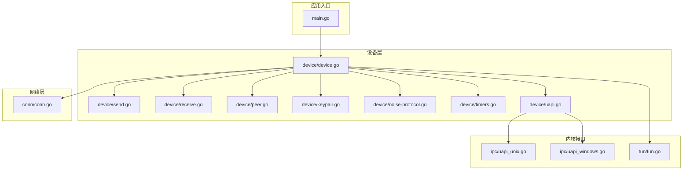
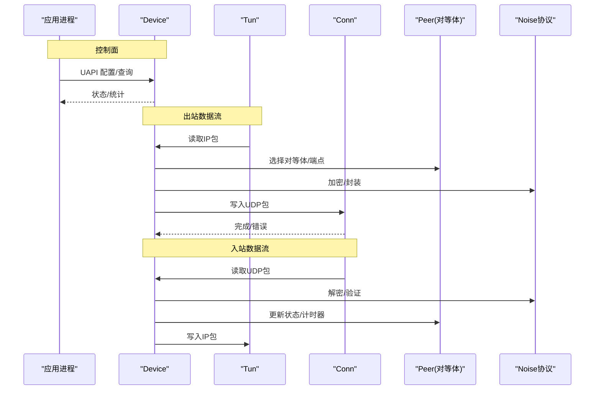
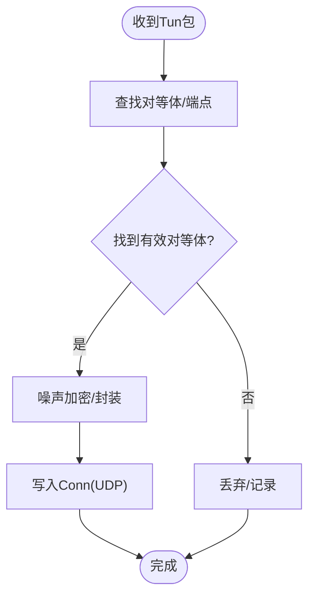
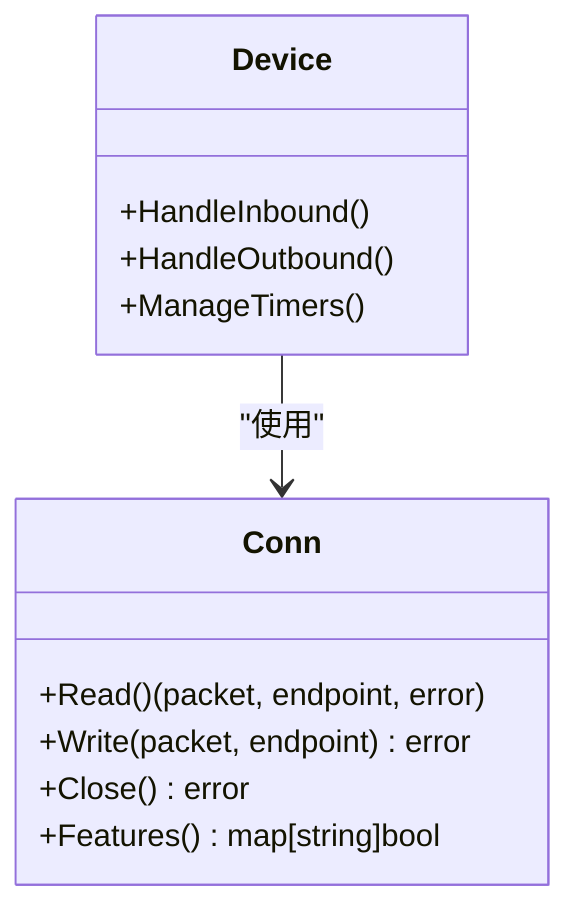
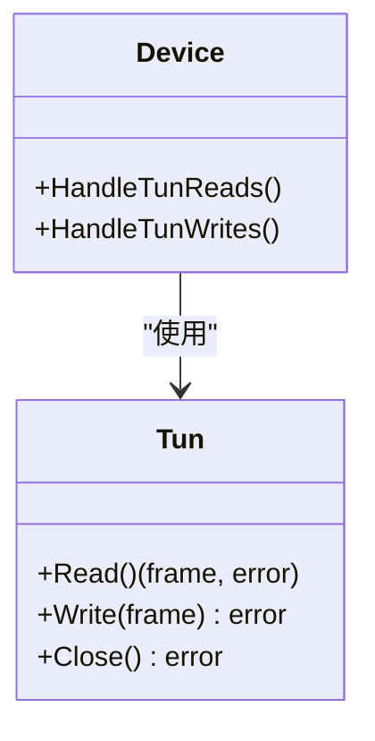
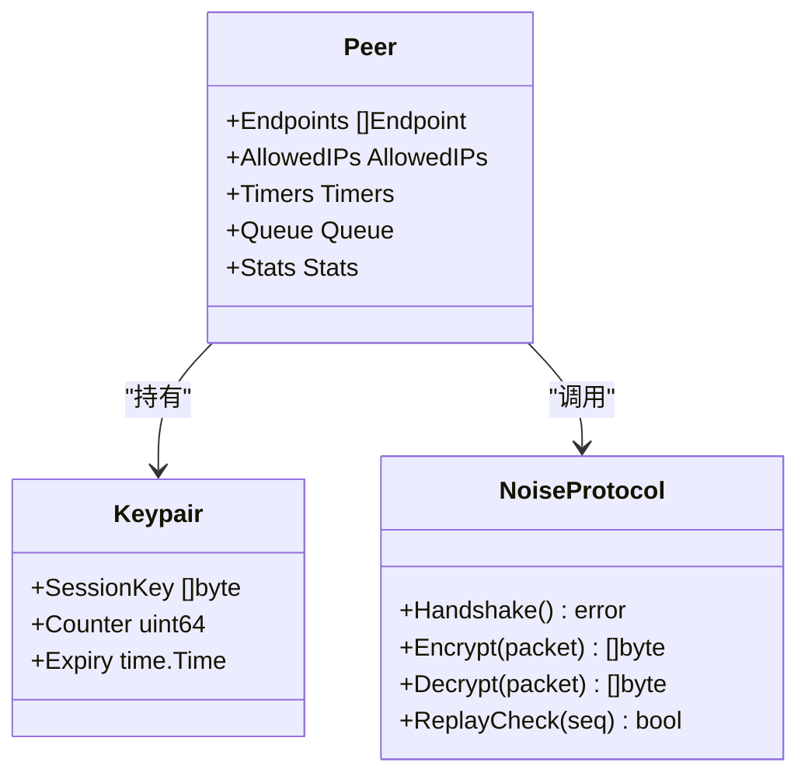
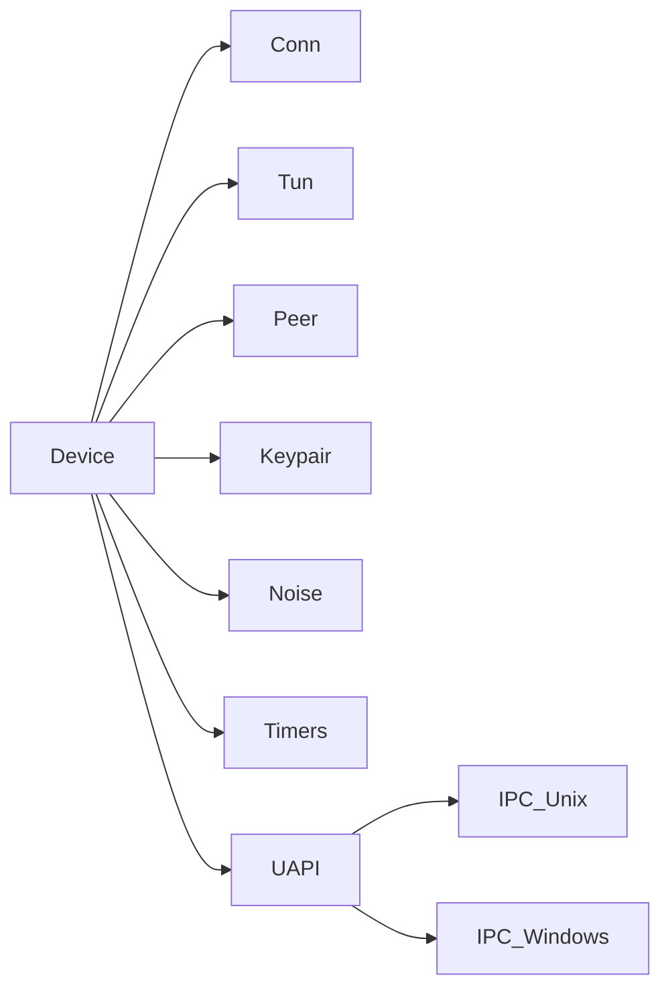
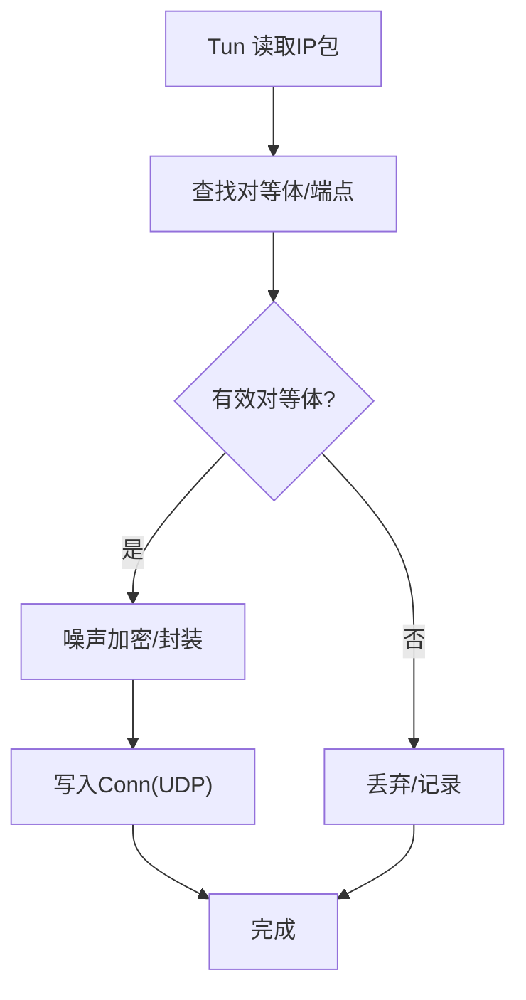

# 核心架构

<cite>
**本文档引用的文件**
- [main.go](file://main.go)
- [device/device.go](file://device/device.go)
- [device/send.go](file://device/send.go)
- [device/receive.go](file://device/receive.go)
- [device/peer.go](file://device/peer.go)
- [device/keypair.go](file://device/keypair.go)
- [device/noise-protocol.go](file://device/noise-protocol.go)
- [device/timers.go](file://device/timers.go)
- [device/uapi.go](file://device/uapi.go)
- [conn/conn.go](file://conn/conn.go)
- [tun/tun.go](file://tun/tun.go)
- [ipc/uapi_unix.go](file://ipc/uapi_unix.go)
- [ipc/uapi_windows.go](file://ipc/uapi_windows.go)
</cite>

## 目录
1. [简介](#简介)
2. [项目结构](#项目结构)
3. [核心组件](#核心组件)
4. [架构总览](#架构总览)
5. [详细组件分析](#详细组件分析)
6. [依赖关系分析](#依赖关系分析)
7. [性能考量](#性能考量)
8. [故障排查指南](#故障排查指南)
9. [结论](#结论)
10. [附录](#附录)

## 简介
本文件面向希望理解与扩展 WireGuard-Go 的开发者，聚焦其核心架构：分层设计、关键组件（Device、Conn、Tun）的职责与交互、数据流与控制流路径、并发模型与 goroutine 使用模式，以及可扩展点。文档提供架构图与数据流图，帮助快速建立整体认知并指导二次开发。

## 项目结构
WireGuard-Go 采用按功能域划分的模块化结构：
- device：设备状态机、对等体管理、加密协商、发送/接收流水线、定时器、UAPI 控制面。
- conn：网络套接字抽象与平台优化（绑定、GSO、标记、粘性路由等）。
- tun：虚拟网络接口抽象与平台实现（Linux/Darwin/Windows/BSD）。
- ipc：UAPI 服务在不同平台的实现（Unix/Windows/WASM）。
- 其他：速率限制、重放防护、时间戳格式、测试工具等。

图表来源
- [main.go:1-200](file://main.go#L1-L200)
- [device/device.go:1-300](file://device/device.go#L1-L300)
- [conn/conn.go:1-200](file://conn/conn.go#L1-L200)
- [tun/tun.go:1-200](file://tun/tun.go#L1-L200)
- [ipc/uapi_unix.go:1-200](file://ipc/uapi_unix.go#L1-L200)
- [ipc/uapi_windows.go:1-200](file://ipc/uapi_windows.go#L1-L200)

章节来源
- [main.go:1-200](file://main.go#L1-L200)

## 核心组件
- Device（设备管理器）
  - 职责：维护全局设备状态、对等体集合、密钥对、定时器、收发通道、UAPI 控制面；协调数据包从 Tun 到 Conn 的出站路径和从 Conn 到 Tun 的入站路径。
  - 关键点：基于事件/通道的异步处理；每对等体独立状态机；安全相关操作（噪声协议、密钥派生、Cookie 验证）集中管理。
- Conn（网络连接抽象）
  - 职责：封装 UDP/TCP（视平台）套接字读写、端口复用、GSO/TSO 卸载、包标记、粘滞路由等；屏蔽平台差异。
  - 关键点：面向包的读写接口；支持批量/零拷贝优化；错误与关闭语义清晰。
- Tun（虚拟网络接口）
  - 职责：在用户态模拟网络接口，向上层暴露标准以太网帧读写；向下对接系统内核或 netstack。
  - 关键点：跨平台实现；对齐与校验和计算；可选卸载能力。

章节来源
- [device/device.go:1-300](file://device/device.go#L1-L300)
- [conn/conn.go:1-200](file://conn/conn.go#L1-L200)
- [tun/tun.go:1-200](file://tun/tun.go#L1-L200)

## 架构总览
WireGuard-Go 采用“控制面 + 数据面”的分层架构：
- 控制面（UAPI）：配置对等体、密钥、路由策略、统计信息；触发状态迁移与密钥轮换。
- 数据面（收发流水线）：Tun 与 Conn 之间的高性能数据通路，包含加解密、序列号、重放保护、限速等。

图表来源
- [device/device.go:1-300](file://device/device.go#L1-L300)
- [device/send.go:1-200](file://device/send.go#L1-L200)
- [device/receive.go:1-200](file://device/receive.go#L1-L200)
- [device/noise-protocol.go:1-200](file://device/noise-protocol.go#L1-L200)
- [conn/conn.go:1-200](file://conn/conn.go#L1-L200)
- [tun/tun.go:1-200](file://tun/tun.go#L1-L200)

## 详细组件分析

### Device（设备管理器）
- 设计理念
  - 以“设备-对等体”为核心组织状态，每个对等体拥有独立的密钥对、端点、定时器、队列等。
  - 通过通道将不同阶段解耦：Tun 读、入站解析、出站封装、定时器回调、UAPI 命令。
- 关键流程
  - 出站：Tun 读包 → 查找对等体 → 选择端点 → 噪声加密 → 写 Conn。
  - 入站：Conn 读包 → 识别对等体 → 噪声解密 → 重放检查 → 写 Tun。
  - 控制：UAPI 修改对等体/密钥/路由 → 触发状态迁移与密钥轮换。
- 并发模型
  - 多个 goroutine 分别处理 Tun 读、Conn 读、定时器、UAPI；内部使用无锁队列/缓冲通道减少竞争。
  - 对等体级状态机保证同一对等体的有序处理。

图表来源
- [device/device.go:1-300](file://device/device.go#L1-L300)
- [device/send.go:1-200](file://device/send.go#L1-L200)
- [device/receive.go:1-200](file://device/receive.go#L1-L200)

章节来源
- [device/device.go:1-300](file://device/device.go#L1-L300)
- [device/send.go:1-200](file://device/send.go#L1-L200)
- [device/receive.go:1-200](file://device/receive.go#L1-L200)

### Conn（网络连接）
- 设计理念
  - 抽象底层套接字读写，统一错误与关闭语义；提供高性能路径（如 GSO/TSO、批量IO）。
  - 支持平台特性：包标记、粘滞路由、端口复用等。
- 关键能力
  - 读/写 UDP 包；错误分类（网络不可达、权限不足等）；关闭时清理资源。
  - 与 Device 协作：Device 负责业务逻辑，Conn 专注 IO。

图表来源
- [conn/conn.go:1-200](file://conn/conn.go#L1-L200)
- [device/device.go:1-300](file://device/device.go#L1-L300)

章节来源
- [conn/conn.go:1-200](file://conn/conn.go#L1-L200)

### Tun（虚拟网络接口）
- 设计理念
  - 在用户态提供标准网络接口行为，屏蔽平台差异；支持校验和卸载与内存对齐优化。
- 关键能力
  - Read/Write 以太网帧；错误与关闭语义；可选 netstack 集成。

图表来源
- [tun/tun.go:1-200](file://tun/tun.go#L1-L200)
- [device/device.go:1-300](file://device/device.go#L1-L300)

章节来源
- [tun/tun.go:1-200](file://tun/tun.go#L1-L200)

### 对等体与密钥管理（Peer/Keypair/Noise）
- 对等体（Peer）
  - 维护端点列表、允许 IP 表、定时器、队列、最近活动时间与统计。
- 密钥对（Keypair）
  - 存储会话密钥、计数器、过期时间；支持滚动更新。
- 噪声协议（Noise Protocol）
  - 握手、密钥交换、消息加密/解密、重放窗口管理。

图表来源
- [device/peer.go:1-200](file://device/peer.go#L1-L200)
- [device/keypair.go:1-200](file://device/keypair.go#L1-L200)
- [device/noise-protocol.go:1-200](file://device/noise-protocol.go#L1-L200)

章节来源
- [device/peer.go:1-200](file://device/peer.go#L1-L200)
- [device/keypair.go:1-200](file://device/keypair.go#L1-L200)
- [device/noise-protocol.go:1-200](file://device/noise-protocol.go#L1-L200)

### 定时器与超时管理
- 职责：心跳、密钥轮换、连接保活、统计刷新等。
- 模式：基于时间轮/最小堆的定时任务调度；与对等体生命周期绑定。

章节来源
- [device/timers.go:1-200](file://device/timers.go#L1-L200)

### UAPI 控制面
- 职责：提供配置接口（添加/删除对等体、设置公钥/私钥、路由、统计查询）。
- 平台实现：Unix/Windows 管道或 socket；与 Device 通信触发状态变更。

章节来源
- [device/uapi.go:1-200](file://device/uapi.go#L1-L200)
- [ipc/uapi_unix.go:1-200](file://ipc/uapi_unix.go#L1-L200)
- [ipc/uapi_windows.go:1-200](file://ipc/uapi_windows.go#L1-L200)

## 依赖关系分析
- Device 依赖：
  - Conn：用于网络 IO。
  - Tun：用于虚拟接口 IO。
  - Peer/Keypair/Noise：用于对等体状态与安全。
  - Timers/UAPI：用于控制与生命周期管理。
- Conn 依赖：
  - 平台网络栈（UDP/TCP），可能启用 GSO/TSO。
- Tun 依赖：
  - 平台虚拟接口驱动或 netstack。

图表来源
- [device/device.go:1-300](file://device/device.go#L1-L300)
- [conn/conn.go:1-200](file://conn/conn.go#L1-L200)
- [tun/tun.go:1-200](file://tun/tun.go#L1-L200)
- [ipc/uapi_unix.go:1-200](file://ipc/uapi_unix.go#L1-L200)
- [ipc/uapi_windows.go:1-200](file://ipc/uapi_windows.go#L1-L200)

章节来源
- [device/device.go:1-300](file://device/device.go#L1-L300)
- [conn/conn.go:1-200](file://conn/conn.go#L1-L200)
- [tun/tun.go:1-200](file://tun/tun.go#L1-L200)
- [ipc/uapi_unix.go:1-200](file://ipc/uapi_unix.go#L1-L200)
- [ipc/uapi_windows.go:1-200](file://ipc/uapi_windows.go#L1-L200)

## 性能考量
- 零拷贝与批量 IO：利用 Conn 的 GSO/TSO 与批量读写降低 CPU 占用。
- 无锁队列与缓冲通道：减少锁竞争，提升高吞吐场景稳定性。
- 对等体级隔离：避免热点对等体影响其他链路。
- 内存池与对象复用：减少 GC 压力（参考 pools 模块的使用方式）。
- 建议：在高丢包或高延迟网络中，合理调整定时器与队列长度；监控 Conn 错误率与 Tun 吞吐。

[本节为通用性能指导，不直接分析具体文件]

## 故障排查指南
- 常见问题定位
  - 无法建立连接：检查 UAPI 配置、对等体公钥/私钥匹配、防火墙/NAT 规则。
  - 收不到包：确认 Tun 已正确配置 IP/路由；检查 Conn 绑定端口与权限。
  - 频繁断线：关注定时器与心跳；检查网络抖动与 MTU。
- 日志与指标
  - 启用设备日志级别；收集对等体统计（发送/接收字节数、错误计数）。
  - 观察 Conn 错误类型（超时、拒绝、重置）与 Tun 错误（无效帧、权限不足）。
- 调试步骤
  - 逐步缩小范围：先验证 Tun 连通性，再验证 Conn 可达性，最后检查噪声握手。
  - 使用抓包工具对比两端报文，确认加密/解密是否对称。

章节来源
- [device/device.go:1-300](file://device/device.go#L1-L300)
- [device/receive.go:1-200](file://device/receive.go#L1-L200)
- [device/send.go:1-200](file://device/send.go#L1-L200)
- [conn/conn.go:1-200](file://conn/conn.go#L1-L200)
- [tun/tun.go:1-200](file://tun/tun.go#L1-L200)

## 结论
WireGuard-Go 通过清晰的层次划分与组件职责分离，实现了高性能、可移植且安全的 VPN 隧道。Device 作为中枢协调收发与控制面；Conn 与 Tun 分别承担网络 IO 与虚拟接口；对等体与密钥管理确保安全性与可扩展性。遵循本文档的架构与并发模型，开发者可以高效地扩展功能或定制平台特性。

[本节为总结性内容，不直接分析具体文件]

## 附录
- 扩展点建议
  - 新增平台特性：在 Conn 层实现新特性（如新的卸载能力），并在 Device 中按需启用。
  - 自定义对等体策略：在 Peer 层扩展路由/负载均衡策略。
  - 增强监控：在 Device 中暴露更多统计指标，便于外部观测。
- 参考流程图（出站）

图表来源
- [device/send.go:1-200](file://device/send.go#L1-L200)
- [device/device.go:1-300](file://device/device.go#L1-L300)