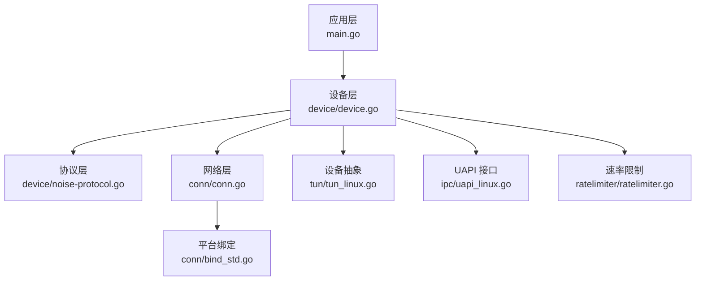
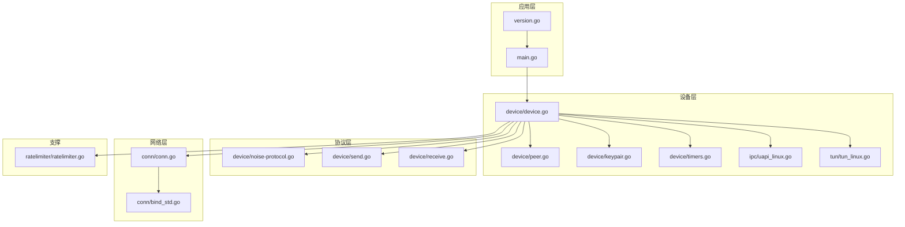
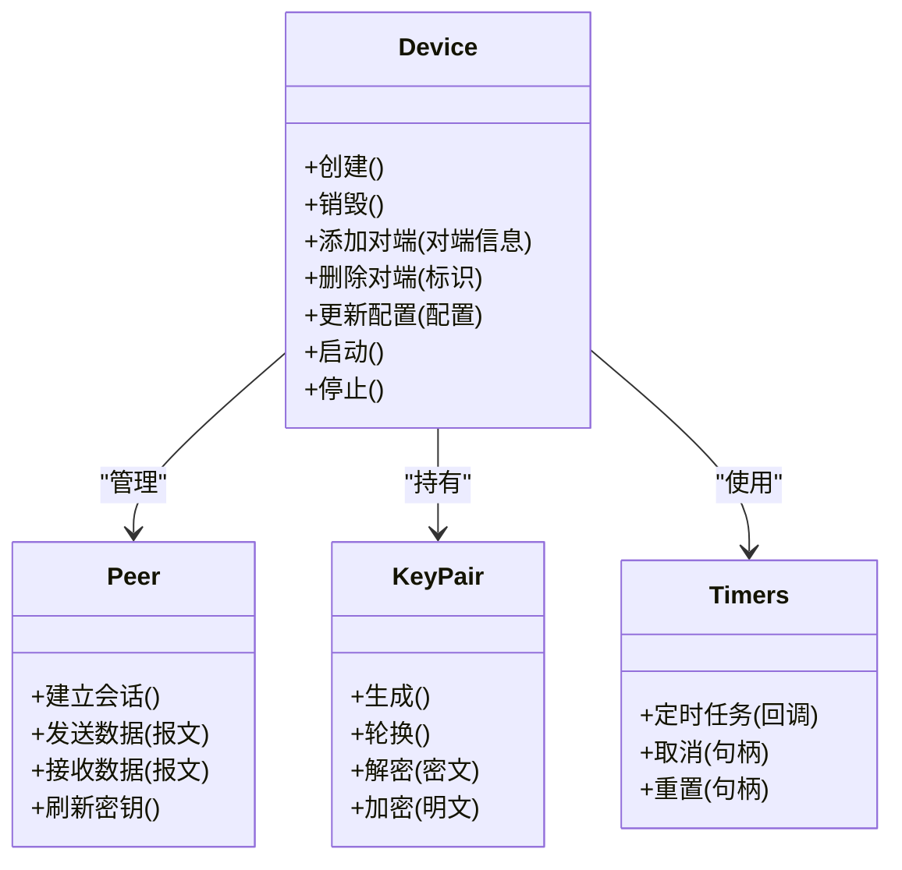
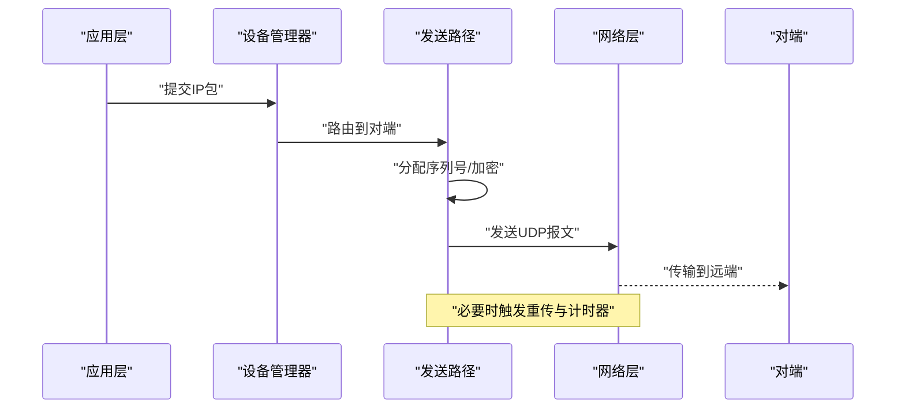
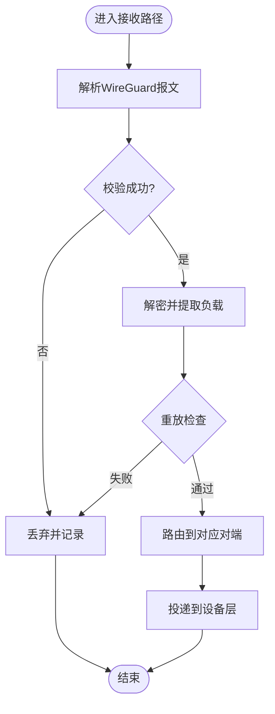
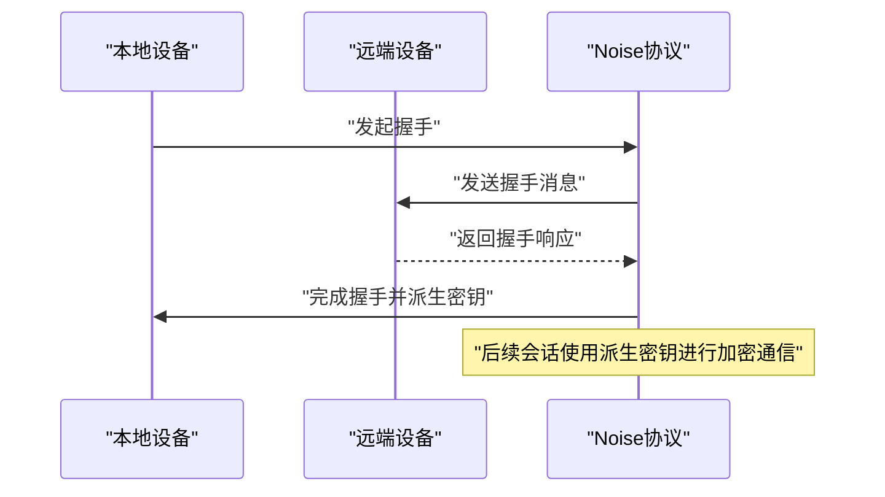
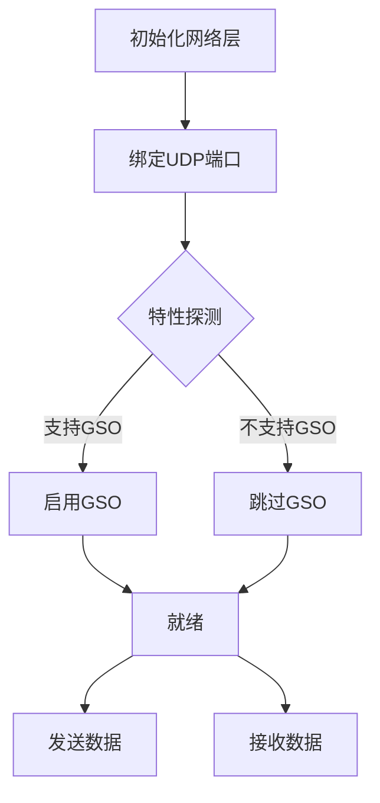
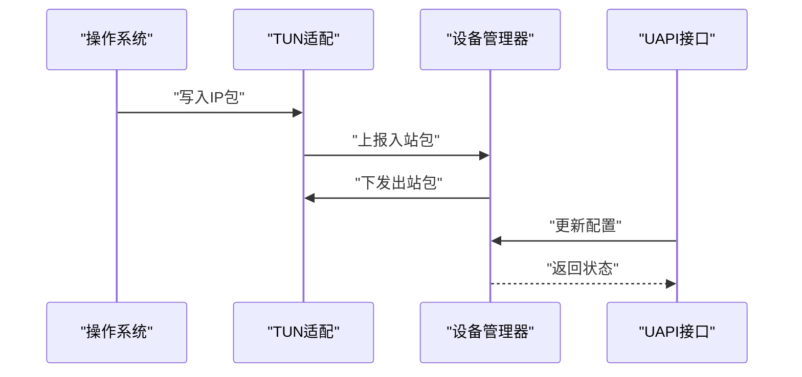
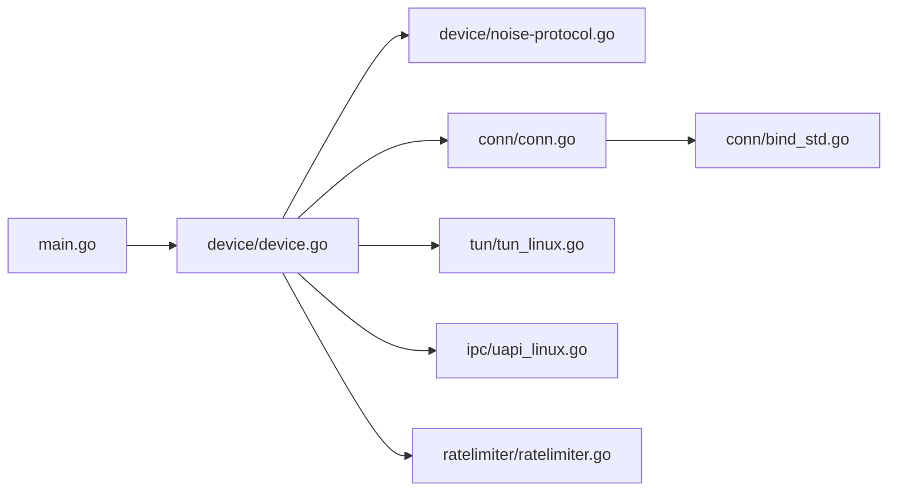

# 系统概览

<cite>
**本文引用的文件**
- [main.go](file://main.go)
- [README.md](file://README.md)
- [version.go](file://version.go)
- [device/device.go](file://device/device.go)
- [device/send.go](file://device/send.go)
- [device/receive.go](file://device/receive.go)
- [device/peer.go](file://device/peer.go)
- [device/keypair.go](file://device/keypair.go)
- [device/noise-protocol.go](file://device/noise-protocol.go)
- [device/timers.go](file://device/timers.go)
- [device/uapi.go](file://device/uapi.go)
- [conn/conn.go](file://conn/conn.go)
- [conn/bind_std.go](file://conn/bind_std.go)
- [tun/tun_linux.go](file://tun/tun_linux.go)
- [ipc/uapi_linux.go](file://ipc/uapi_linux.go)
- [ratelimiter/ratelimiter.go](file://ratelimiter/ratelimiter.go)
</cite>

## 目录
1. [简介](#简介)
2. [项目结构](#项目结构)
3. [核心组件](#核心组件)
4. [架构总览](#架构总览)
5. [详细组件分析](#详细组件分析)
6. [依赖关系分析](#依赖关系分析)
7. [性能考量](#性能考量)
8. [故障排查指南](#故障排查指南)
9. [结论](#结论)
10. [附录](#附录)

## 简介
本文件为 WireGuard-Go 系统的整体概览，面向初学者与有经验的开发者。内容涵盖项目目标、核心功能与设计哲学；解释 WireGuard 协议的基本原理与优势；说明应用层、协议层、网络层、设备层的职责划分；梳理主要组件之间的关系与数据流向；并提供系统架构图以展示模块交互方式。

WireGuard 的目标是构建一个简单、现代、快速且安全的虚拟专用网（VPN）实现。其设计哲学强调“少即是多”：通过最小化的代码面、严格的加密原语选择、以及清晰的层次化接口，提供高安全、高性能的隧道能力。相比传统 VPN，WireGuard 在密钥管理、握手流程、数据包封装与内核态集成方面具有显著优势，具备更少的攻击面与更高的可审计性。

## 项目结构
仓库采用按功能域划分的目录组织方式，核心分层如下：
- 应用层：进程入口、版本信息、平台初始化与生命周期管理
- 协议层：Noise 协议实现、会话状态机、计时器与重传控制
- 网络层：UDP 套接字绑定、端口复用、特性探测与错误处理
- 设备层：虚拟网络设备抽象、TUN/TAP 驱动适配、用户态 UAPI 接口
- 支撑模块：速率限制、时间戳、队列与内存池等

图表来源
- [main.go:1-200](file://main.go#L1-L200)
- [device/device.go:1-200](file://device/device.go#L1-L200)
- [device/noise-protocol.go:1-200](file://device/noise-protocol.go#L1-L200)
- [conn/conn.go:1-200](file://conn/conn.go#L1-L200)
- [tun/tun_linux.go:1-200](file://tun/tun_linux.go#L1-L200)
- [ipc/uapi_linux.go:1-200](file://ipc/uapi_linux.go#L1-L200)
- [ratelimiter/ratelimiter.go:1-200](file://ratelimiter/ratelimiter.go#L1-L200)

章节来源
- [main.go:1-200](file://main.go#L1-L200)
- [README.md:1-200](file://README.md#L1-L200)
- [version.go:1-200](file://version.go#L1-L200)

## 核心组件
- 设备管理器：负责创建、配置与维护虚拟网络设备的生命周期，协调对端、密钥对、计时器与收发队列。
- 发送路径：将上层 IP 包封装为 WireGuard 报文，进行加密、序列号分配与发送调度。
- 接收路径：从网络层解封装报文，验证完整性与重放保护，还原为 IP 包并投递到设备层。
- 协议栈：基于 Noise 协议的握手与密钥派生，维护会话状态与计时器。
- 网络绑定：跨平台的 UDP 绑定与特性检测，支持端口复用、GSO、标记等优化。
- TUN 适配：在不同操作系统上暴露虚拟网卡接口，完成内核态与用户态的数据交换。
- UAPI：提供用户态配置与管理接口，便于动态更新对端、密钥与策略。
- 速率限制：对控制消息或特定流量进行限速，防止滥用与资源耗尽。

章节来源
- [device/device.go:1-200](file://device/device.go#L1-L200)
- [device/send.go:1-200](file://device/send.go#L1-L200)
- [device/receive.go:1-200](file://device/receive.go#L1-L200)
- [device/peer.go:1-200](file://device/peer.go#L1-L200)
- [device/keypair.go:1-200](file://device/keypair.go#L1-L200)
- [device/noise-protocol.go:1-200](file://device/noise-protocol.go#L1-L200)
- [device/timers.go:1-200](file://device/timers.go#L1-L200)
- [conn/conn.go:1-200](file://conn/conn.go#L1-L200)
- [conn/bind_std.go:1-200](file://conn/bind_std.go#L1-L200)
- [tun/tun_linux.go:1-200](file://tun/tun_linux.go#L1-L200)
- [ipc/uapi_linux.go:1-200](file://ipc/uapi_linux.go#L1-L200)
- [ratelimiter/ratelimiter.go:1-200](file://ratelimiter/ratelimiter.go#L1-L200)

## 架构总览
WireGuard-Go 的分层架构清晰明确：
- 应用层：进程启动、配置加载、平台相关初始化与退出清理
- 协议层：Noise 握手、密钥派生、会话状态机与计时器
- 网络层：UDP 套接字绑定、端口复用、特性探测、错误与重试
- 设备层：TUN 设备抽象、IP 包入站/出站、UAPI 配置接口

图表来源
- [main.go:1-200](file://main.go#L1-L200)
- [version.go:1-200](file://version.go#L1-L200)
- [device/device.go:1-200](file://device/device.go#L1-L200)
- [device/peer.go:1-200](file://device/peer.go#L1-L200)
- [device/keypair.go:1-200](file://device/keypair.go#L1-L200)
- [device/timers.go:1-200](file://device/timers.go#L1-L200)
- [device/noise-protocol.go:1-200](file://device/noise-protocol.go#L1-L200)
- [device/send.go:1-200](file://device/send.go#L1-L200)
- [device/receive.go:1-200](file://device/receive.go#L1-L200)
- [conn/conn.go:1-200](file://conn/conn.go#L1-L200)
- [conn/bind_std.go:1-200](file://conn/bind_std.go#L1-L200)
- [ipc/uapi_linux.go:1-200](file://ipc/uapi_linux.go#L1-L200)
- [tun/tun_linux.go:1-200](file://tun/tun_linux.go#L1-L200)
- [ratelimiter/ratelimiter.go:1-200](file://ratelimiter/ratelimiter.go#L1-L200)

## 详细组件分析

### 设备管理器（Device）
设备管理器是整个系统的中枢，负责：
- 创建与销毁虚拟设备实例
- 管理对端列表、密钥对与状态机
- 协调发送/接收路径、计时器与 UAPI 事件
- 与网络层和设备层交互，确保数据流正确转发

图表来源
- [device/device.go:1-200](file://device/device.go#L1-L200)
- [device/peer.go:1-200](file://device/peer.go#L1-L200)
- [device/keypair.go:1-200](file://device/keypair.go#L1-L200)
- [device/timers.go:1-200](file://device/timers.go#L1-L200)

章节来源
- [device/device.go:1-200](file://device/device.go#L1-L200)
- [device/peer.go:1-200](file://device/peer.go#L1-L200)
- [device/keypair.go:1-200](file://device/keypair.go#L1-L200)
- [device/timers.go:1-200](file://device/timers.go#L1-L200)

### 发送路径（Send）
发送路径负责将上层 IP 包转换为 WireGuard 报文：
- 查找对端与会话
- 分配序列号并进行加密
- 通过网络层发送
- 处理超时与重传

图表来源
- [device/send.go:1-200](file://device/send.go#L1-L200)
- [conn/conn.go:1-200](file://conn/conn.go#L1-L200)
- [device/peer.go:1-200](file://device/peer.go#L1-L200)

章节来源
- [device/send.go:1-200](file://device/send.go#L1-L200)
- [device/peer.go:1-200](file://device/peer.go#L1-L200)
- [conn/conn.go:1-200](file://conn/conn.go#L1-L200)

### 接收路径（Receive）
接收路径负责从网络层接收报文并还原为 IP 包：
- 校验报文完整性与重放保护
- 解密并提取负载
- 根据对端映射投递到设备层
- 触发会话更新或密钥轮换

图表来源
- [device/receive.go:1-200](file://device/receive.go#L1-L200)
- [device/keypair.go:1-200](file://device/keypair.go#L1-L200)
- [device/peer.go:1-200](file://device/peer.go#L1-L200)

章节来源
- [device/receive.go:1-200](file://device/receive.go#L1-L200)
- [device/keypair.go:1-200](file://device/keypair.go#L1-L200)
- [device/peer.go:1-200](file://device/peer.go#L1-L200)

### 协议层（Noise 协议）
协议层实现 Noise 协议握手与密钥派生：
- 处理握手消息，建立安全通道
- 派生会话密钥，支持定期轮换
- 维护计时器，处理超时与重试

图表来源
- [device/noise-protocol.go:1-200](file://device/noise-protocol.go#L1-L200)
- [device/timers.go:1-200](file://device/timers.go#L1-L200)

章节来源
- [device/noise-protocol.go:1-200](file://device/noise-protocol.go#L1-L200)
- [device/timers.go:1-200](file://device/timers.go#L1-L200)

### 网络层（连接与绑定）
网络层提供跨平台的 UDP 绑定与特性探测：
- 绑定端口、启用端口复用
- 探测 GSO、标记等特性以提升性能
- 统一错误处理与重试机制

图表来源
- [conn/conn.go:1-200](file://conn/conn.go#L1-L200)
- [conn/bind_std.go:1-200](file://conn/bind_std.go#L1-L200)

章节来源
- [conn/conn.go:1-200](file://conn/conn.go#L1-L200)
- [conn/bind_std.go:1-200](file://conn/bind_std.go#L1-L200)

### 设备层（TUN 与 UAPI）
设备层负责与操作系统交互：
- TUN 适配：在不同平台上打开虚拟网卡，读写 IP 包
- UAPI：提供用户态配置接口，动态更新对端、密钥与策略

图表来源
- [tun/tun_linux.go:1-200](file://tun/tun_linux.go#L1-L200)
- [ipc/uapi_linux.go:1-200](file://ipc/uapi_linux.go#L1-L200)
- [device/device.go:1-200](file://device/device.go#L1-L200)

章节来源
- [tun/tun_linux.go:1-200](file://tun/tun_linux.go#L1-L200)
- [ipc/uapi_linux.go:1-200](file://ipc/uapi_linux.go#L1-L200)
- [device/device.go:1-200](file://device/device.go#L1-L200)

### 速率限制
速率限制模块用于控制控制消息或特定流量的速率，防止滥用与资源耗尽：
- 令牌桶算法实现
- 可配置的速率与突发限制
- 与设备层集成，应用于关键路径

章节来源
- [ratelimiter/ratelimiter.go:1-200](file://ratelimiter/ratelimiter.go#L1-L200)

## 依赖关系分析
各模块之间的依赖关系如下：
- 应用层依赖设备层进行生命周期管理
- 设备层依赖协议层、网络层、设备抽象与 UAPI
- 网络层依赖平台绑定与特性探测
- 设备层依赖 TUN 适配与速率限制

图表来源
- [main.go:1-200](file://main.go#L1-L200)
- [device/device.go:1-200](file://device/device.go#L1-L200)
- [device/noise-protocol.go:1-200](file://device/noise-protocol.go#L1-L200)
- [conn/conn.go:1-200](file://conn/conn.go#L1-L200)
- [tun/tun_linux.go:1-200](file://tun/tun_linux.go#L1-L200)
- [ipc/uapi_linux.go:1-200](file://ipc/uapi_linux.go#L1-L200)
- [conn/bind_std.go:1-200](file://conn/bind_std.go#L1-L200)
- [ratelimiter/ratelimiter.go:1-200](file://ratelimiter/ratelimiter.go#L1-L200)

章节来源
- [main.go:1-200](file://main.go#L1-L200)
- [device/device.go:1-200](file://device/device.go#L1-L200)
- [conn/conn.go:1-200](file://conn/conn.go#L1-L200)
- [tun/tun_linux.go:1-200](file://tun/tun_linux.go#L1-L200)
- [ipc/uapi_linux.go:1-200](file://ipc/uapi_linux.go#L1-L200)
- [ratelimiter/ratelimiter.go:1-200](file://ratelimiter/ratelimiter.go#L1-L200)

## 性能考量
- 使用 GSO（分段卸载）减少内核拷贝与上下文切换
- 合理设置队列长度与缓冲区大小，避免丢包与拥塞
- 启用端口复用与标记，提升多实例并发能力
- 控制握手频率与密钥轮换周期，平衡安全与开销
- 利用速率限制保护关键路径，防止恶意流量影响

[本节提供通用指导，不直接分析具体文件]

## 故障排查指南
常见问题与定位思路：
- 无法建立连接：检查对端地址、端口与防火墙策略；确认 UAPI 配置是否正确
- 频繁断连：查看计时器与重传日志；检查网络质量与丢包率
- 性能瓶颈：评估是否启用 GSO；调整队列与缓冲区；分析 CPU 与内存占用
- 权限问题：确认 TUN 设备访问权限；检查平台相关绑定能力

章节来源
- [device/timers.go:1-200](file://device/timers.go#L1-L200)
- [device/receive.go:1-200](file://device/receive.go#L1-L200)
- [conn/conn.go:1-200](file://conn/conn.go#L1-L200)
- [ipc/uapi_linux.go:1-200](file://ipc/uapi_linux.go#L1-L200)

## 结论
WireGuard-Go 通过清晰的分层架构与最小化的实现，提供了高效、安全的 VPN 能力。设备管理器作为中枢协调各模块，发送与接收路径保证数据的可靠传输，协议层确保安全性，网络层与设备层提供跨平台兼容性与性能优化。对于初学者，理解分层与数据流有助于快速上手；对于有经验开发者，关注噪声协议、队列与特性探测可实现深度定制与优化。

[本节总结性内容，不直接分析具体文件]

## 附录
- 术语表
  - 对端（Peer）：远端的 WireGuard 节点
  - 密钥对（KeyPair）：用于加密与解密的对称密钥集合
  - 会话（Session）：一次握手的产物，包含派生密钥与状态
  - TUN：操作系统提供的虚拟网络接口
  - UAPI：用户态配置与管理接口
- 参考路径
  - 入口与版本：[main.go](file://main.go), [version.go](file://version.go)
  - 设备与协议：[device/device.go](file://device/device.go), [device/noise-protocol.go](file://device/noise-protocol.go)
  - 收发路径：[device/send.go](file://device/send.go), [device/receive.go](file://device/receive.go)
  - 网络与绑定：[conn/conn.go](file://conn/conn.go), [conn/bind_std.go](file://conn/bind_std.go)
  - 设备与接口：[tun/tun_linux.go](file://tun/tun_linux.go), [ipc/uapi_linux.go](file://ipc/uapi_linux.go)
  - 速率限制：[ratelimiter/ratelimiter.go](file://ratelimiter/ratelimiter.go)

[本节为补充信息，不直接分析具体文件]