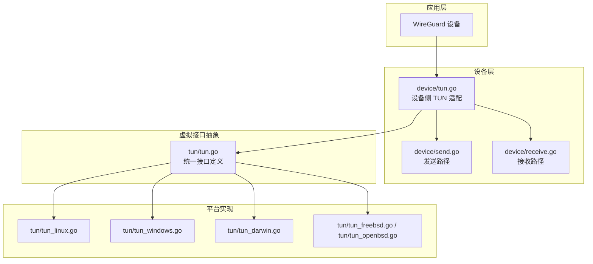
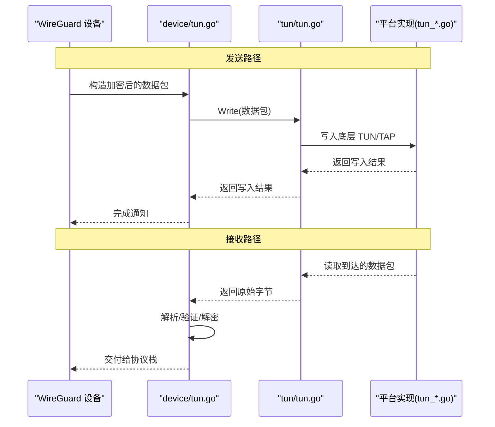
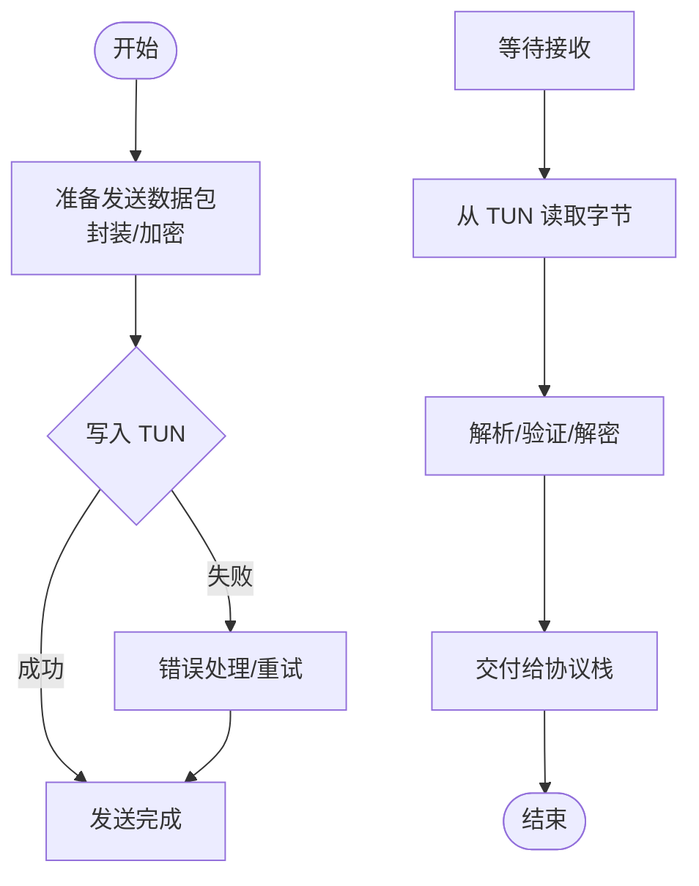
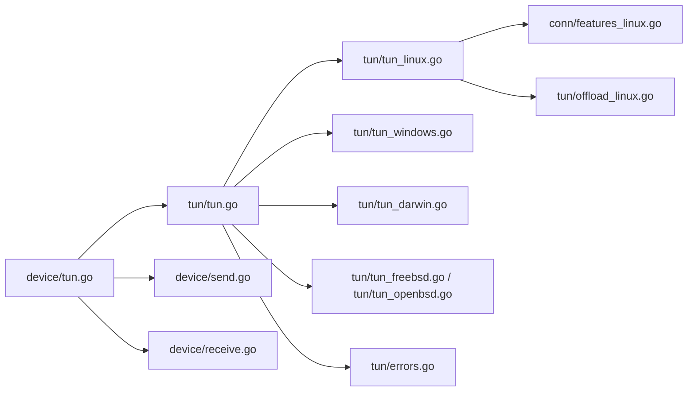

# 虚拟网络接口

<cite>
**本文引用的文件**
- [tun/tun.go](file://tun/tun.go)
- [tun/tun_linux.go](file://tun/tun_linux.go)
- [tun/tun_windows.go](file://tun/tun_windows.go)
- [tun/tun_darwin.go](file://tun/tun_darwin.go)
- [tun/tun_freebsd.go](file://tun/tun_freebsd.go)
- [tun/tun_openbsd.go](file://tun/tun_openbsd.go)
- [device/tun.go](file://device/tun.go)
- [device/device.go](file://device/device.go)
- [device/send.go](file://device/send.go)
- [device/receive.go](file://device/receive.go)
- [conn/bind_std.go](file://conn/bind_std.go)
- [conn/controlfns_unix.go](file://conn/controlfns_unix.go)
- [conn/features_linux.go](file://conn/features_linux.go)
- [tun/checksum.go](file://tun/checksum.go)
- [tun/offload_linux.go](file://tun/offload_linux.go)
- [tun/errors.go](file://tun/errors.go)
</cite>

## 目录
1. [简介](#简介)
2. [项目结构](#项目结构)
3. [核心组件](#核心组件)
4. [架构总览](#架构总览)
5. [详细组件分析](#详细组件分析)
6. [依赖关系分析](#依赖关系分析)
7. [性能考量](#性能考量)
8. [故障排除指南](#故障排除指南)
9. [结论](#结论)
10. [附录](#附录)

## 简介
本文件聚焦于虚拟网络接口层（TUN/TAP）在 wireguard-go 中的抽象设计与跨平台实现，系统阐述数据包在虚拟接口中的读写流程、不同操作系统平台的差异、接口配置与 IP/路由管理、过滤与队列机制、以及性能优化策略。同时提供配置示例与排障指引，并说明如何扩展支持新的操作系统平台。

## 项目结构
虚拟网络接口相关代码主要位于 tun 与 device 两个目录：
- tun：定义统一的 TUN/TAP 接口抽象，并提供 Linux、Windows、macOS、BSD 等平台的特定实现。
- device：将 TUN/TAP 接入 WireGuard 设备栈，负责收发数据包的调度、加密/解密、队列管理与计时器等。

图表来源
- [device/tun.go:1-200](file://device/tun.go#L1-L200)
- [tun/tun.go:1-200](file://tun/tun.go#L1-L200)
- [tun/tun_linux.go:1-200](file://tun/tun_linux.go#L1-L200)
- [tun/tun_windows.go:1-200](file://tun/tun_windows.go#L1-L200)
- [tun/tun_darwin.go:1-200](file://tun/tun_darwin.go#L1-L200)
- [tun/tun_freebsd.go:1-200](file://tun/tun_freebsd.go#L1-L200)
- [tun/tun_openbsd.go:1-200](file://tun/tun_openbsd.go#L1-L200)

章节来源
- [device/tun.go:1-200](file://device/tun.go#L1-L200)
- [tun/tun.go:1-200](file://tun/tun.go#L1-L200)

## 核心组件
- 统一接口抽象（tun/tun.go）
  - 定义 Read/Write 等基础 I/O 方法，屏蔽平台差异，供上层 device 调用。
  - 暴露错误类型与常量，便于上层统一处理。
- 平台实现（各平台 tun_*.go）
  - Linux：通过 netlink/socket 控制 TUN 设备，支持 GSO/Checksum Offload 等特性。
  - Windows：使用 NDIS/LWF 或内核模式驱动交互，封装为用户态句柄。
  - macOS/BSD：基于系统提供的 TUN 接口进行封装。
- 设备侧适配（device/tun.go）
  - 将 TUN 的字节流转换为 WireGuard 协议包，组织发送/接收队列，协调定时器与状态机。
- 辅助能力
  - 校验和计算（tun/checksum.go）
  - 卸载特性探测与启用（tun/offload_linux.go）
  - 通用错误定义（tun/errors.go）

章节来源
- [tun/tun.go:1-200](file://tun/tun.go#L1-L200)
- [tun/checksum.go:1-200](file://tun/checksum.go#L1-L200)
- [tun/offload_linux.go:1-200](file://tun/offload_linux.go#L1-L200)
- [tun/errors.go:1-200](file://tun/errors.go#L1-L200)
- [device/tun.go:1-200](file://device/tun.go#L1-L200)

## 架构总览
下图展示从应用层到虚拟接口的完整数据通路，包括发送与接收两条路径。

图表来源
- [device/tun.go:1-200](file://device/tun.go#L1-L200)
- [tun/tun.go:1-200](file://tun/tun.go#L1-L200)
- [tun/tun_linux.go:1-200](file://tun/tun_linux.go#L1-L200)
- [tun/tun_windows.go:1-200](file://tun/tun_windows.go#L1-L200)

## 详细组件分析

### 统一接口抽象（tun/tun.go）
- 职责
  - 定义 Read/Write 等最小化 I/O 接口，屏蔽平台差异。
  - 提供错误类型与常量，便于上层统一处理。
- 设计要点
  - 面向字节流的 I/O，不关心上层协议细节。
  - 通过平台特定的实现文件注入具体行为。
- 复杂度
  - Read/Write 的时间复杂度取决于底层系统调用与队列长度；通常近似 O(n)，n 为数据包大小。

章节来源
- [tun/tun.go:1-200](file://tun/tun.go#L1-L200)

### 平台实现差异

#### Linux（tun/tun_linux.go）
- 特点
  - 使用 netlink 与 socket 组合创建/配置 TUN 设备。
  - 支持 GSO（Generic Segmentation Offload）与 Checksum Offload，提升吞吐。
  - 可结合 conn/features_linux.go 探测并启用卸载能力。
- 关键流程
  - 打开 TUN 设备 -> 设置 MTU/IP/路由 -> 注册事件监听 -> 进入收发循环。
- 性能
  - 借助卸载能力减少 CPU 开销，适合高吞吐场景。

章节来源
- [tun/tun_linux.go:1-200](file://tun/tun_linux.go#L1-L200)
- [conn/features_linux.go:1-200](file://conn/features_linux.go#L1-L200)

#### Windows（tun/tun_windows.go）
- 特点
  - 通过 NDIS/LWF 或内核驱动交互，封装为用户态句柄。
  - 需要处理驱动回调、缓冲区管理与内存对齐。
- 关键流程
  - 初始化驱动 -> 分配缓冲 -> 启动收发 -> 处理异步回调。
- 性能
  - 注意零拷贝与批量 I/O，避免频繁上下文切换。

章节来源
- [tun/tun_windows.go:1-200](file://tun/tun_windows.go#L1-L200)

#### macOS（tun/tun_darwin.go）
- 特点
  - 基于系统 TUN 接口，遵循 BSD 风格 API。
  - 配置方式与 Linux 类似但参数略有差异。
- 关键流程
  - 打开 TUN -> 设置属性 -> 进入收发循环。

章节来源
- [tun/tun_darwin.go:1-200](file://tun/tun_darwin.go#L1-L200)

#### BSD（tun/tun_freebsd.go, tun/tun_openbsd.go）
- 特点
  - 遵循 BSD TUN 接口规范，API 与 macOS 相近。
  - 路由与 IP 配置通过系统命令或 netlink 变体完成。
- 关键流程
  - 打开 TUN -> 配置 -> 收发循环。

章节来源
- [tun/tun_freebsd.go:1-200](file://tun/tun_freebsd.go#L1-L200)
- [tun/tun_openbsd.go:1-200](file://tun/tun_openbsd.go#L1-L200)

### 设备侧适配（device/tun.go）
- 职责
  - 将 TUN 的字节流映射为 WireGuard 协议包。
  - 管理发送/接收队列、定时器、状态同步。
- 关键流程
  - 启动时创建/绑定 TUN 设备，注册读/写回调。
  - 发送路径：组装加密包 -> 写入 TUN。
  - 接收路径：从 TUN 读取 -> 解析/解密 -> 交给协议栈。
- 复杂度
  - 队列操作通常为 O(1) 入队/出队；解析与加解密复杂度与包长线性相关。

章节来源
- [device/tun.go:1-200](file://device/tun.go#L1-L200)
- [device/send.go:1-200](file://device/send.go#L1-L200)
- [device/receive.go:1-200](file://device/receive.go#L1-L200)

### 数据包读写流程（发送与接收）

图表来源
- [device/send.go:1-200](file://device/send.go#L1-L200)
- [device/receive.go:1-200](file://device/receive.go#L1-L200)
- [tun/tun.go:1-200](file://tun/tun.go#L1-L200)

章节来源
- [device/send.go:1-200](file://device/send.go#L1-L200)
- [device/receive.go:1-200](file://device/receive.go#L1-L200)
- [tun/tun.go:1-200](file://tun/tun.go#L1-L200)

### 接口配置、IP 地址管理与路由设置
- 接口配置
  - 通过平台特定的 netlink/系统调用设置 MTU、标志位等。
  - 在 Linux 上可通过 netlink 动态更新配置。
- IP 地址管理
  - 为 TUN 接口分配 IPv4/IPv6 地址，维护地址表。
  - 根据 AllowedIPs 决定路由命中。
- 路由设置
  - 基于 AllowedIPs 插入/更新路由条目，确保对端网段流量走隧道。
  - 在 Windows/macOS/BSD 上使用对应系统的工具或 API 设置路由。

章节来源
- [tun/tun_linux.go:1-200](file://tun/tun_linux.go#L1-L200)
- [tun/tun_windows.go:1-200](file://tun/tun_windows.go#L1-L200)
- [tun/tun_darwin.go:1-200](file://tun/tun_darwin.go#L1-L200)
- [tun/tun_freebsd.go:1-200](file://tun/tun_freebsd.go#L1-L200)
- [tun/tun_openbsd.go:1-200](file://tun/tun_openbsd.go#L1-L200)

### 数据包过滤与队列管理
- 过滤
  - 基于 AllowedIPs 进行匹配，未命中的包丢弃。
  - 可在设备层实现更细粒度的策略（如按端口/协议）。
- 队列管理
  - 发送/接收队列用于解耦 I/O 与处理逻辑，防止阻塞。
  - 限制队列长度以避免内存占用过高；满队时采取丢包或背压策略。
- 错误与回退
  - 队列满时记录日志并统计丢包计数。
  - 遇到瞬时错误（如资源不足）进行重试或降级。

章节来源
- [device/device.go:1-200](file://device/device.go#L1-L200)
- [device/tun.go:1-200](file://device/tun.go#L1-L200)

### 性能优化策略
- 卸载能力
  - Linux 下启用 GSO/Checksum Offload，减少 CPU 负载。
  - 通过 conn/features_linux.go 探测并启用。
- 批量 I/O
  - 合并小包发送，减少系统调用次数。
  - 使用零拷贝或内存池降低分配开销。
- 队列调优
  - 根据负载调整队列深度，平衡延迟与吞吐。
  - 监控队列长度与丢包率，动态调参。
- 平台差异
  - Windows 下关注驱动回调与缓冲对齐。
  - macOS/BSD 下注意系统限制与最佳实践。

章节来源
- [tun/offload_linux.go:1-200](file://tun/offload_linux.go#L1-L200)
- [conn/features_linux.go:1-200](file://conn/features_linux.go#L1-L200)
- [tun/checksum.go:1-200](file://tun/checksum.go#L1-L200)

## 依赖关系分析
虚拟接口层依赖关系如下：

图表来源
- [device/tun.go:1-200](file://device/tun.go#L1-L200)
- [tun/tun.go:1-200](file://tun/tun.go#L1-L200)
- [tun/tun_linux.go:1-200](file://tun/tun_linux.go#L1-L200)
- [tun/tun_windows.go:1-200](file://tun/tun_windows.go#L1-L200)
- [tun/tun_darwin.go:1-200](file://tun/tun_darwin.go#L1-L200)
- [tun/tun_freebsd.go:1-200](file://tun/tun_freebsd.go#L1-L200)
- [tun/tun_openbsd.go:1-200](file://tun/tun_openbsd.go#L1-L200)
- [conn/features_linux.go:1-200](file://conn/features_linux.go#L1-L200)
- [tun/offload_linux.go:1-200](file://tun/offload_linux.go#L1-L200)
- [tun/errors.go:1-200](file://tun/errors.go#L1-L200)

章节来源
- [device/tun.go:1-200](file://device/tun.go#L1-L200)
- [tun/tun.go:1-200](file://tun/tun.go#L1-L200)

## 性能考量
- 高吞吐场景建议
  - 启用 Linux 卸载能力（GSO/Checksum Offload）。
  - 增大队列深度以吸收突发流量。
  - 使用批量 I/O 与内存池减少分配与拷贝。
- 低延迟场景建议
  - 减小队列深度以降低排队延迟。
  - 优先保证小包及时发送。
- 监控指标
  - 队列长度、丢包率、CPU 使用率、系统调用次数。
- 平台注意事项
  - Windows 下避免频繁驱动交互。
  - macOS/BSD 下遵循系统最佳实践。

[本节为通用指导，不直接分析具体文件]

## 故障排除指南
- 常见问题
  - 无法创建 TUN 设备：检查权限与内核模块加载。
  - 路由未生效：确认 AllowedIPs 与系统路由表一致。
  - 高丢包：检查队列是否满，适当调大队列或优化处理速度。
  - 校验和错误：确认卸载能力是否启用且驱动支持。
- 诊断步骤
  - 查看错误码与日志，定位失败阶段（打开/配置/读写）。
  - 使用系统工具检查接口状态与路由。
  - 在 Linux 上启用调试开关，观察 netlink 交互。
- 参考错误定义
  - 使用 tun/errors.go 中的错误类型进行分类与处理。

章节来源
- [tun/errors.go:1-200](file://tun/errors.go#L1-L200)

## 结论
虚拟网络接口层通过统一的抽象屏蔽了平台差异，使 WireGuard 能在多平台上稳定运行。Linux 平台具备更强的卸载能力，适合高性能场景；Windows/macOS/BSD 则需关注各自的最佳实践。合理配置队列、路由与卸载能力，可显著提升吞吐与稳定性。未来扩展新平台时，只需实现统一接口并适配系统特性即可。

[本节为总结性内容，不直接分析具体文件]

## 附录

### 配置示例（概念性）
- Linux
  - 创建 TUN 设备，设置 MTU 与 IP 地址。
  - 添加路由条目，指向对端网段。
  - 启用 GSO/Checksum Offload。
- Windows
  - 安装并启用虚拟网卡驱动。
  - 配置 IP 与路由。
- macOS/BSD
  - 创建 TUN 接口，配置 IP 与路由。

[本节为概念性示例，不直接分析具体文件]

### 扩展新平台支持
- 步骤
  - 在 tun 目录下新增平台实现文件（如 tun_newos.go）。
  - 实现统一接口（Read/Write 等）。
  - 适配 IP/路由配置与卸载能力探测。
  - 编写测试用例验证功能与性能。
- 注意事项
  - 保持与现有接口契约一致。
  - 处理平台特定的错误与边界情况。
  - 考虑内存对齐与零拷贝优化。

[本节为概念性指导，不直接分析具体文件]