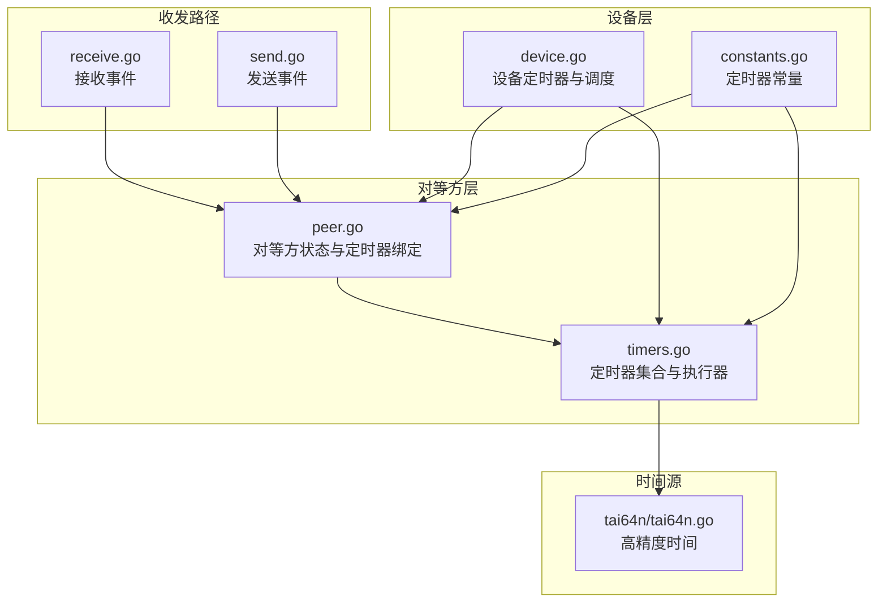
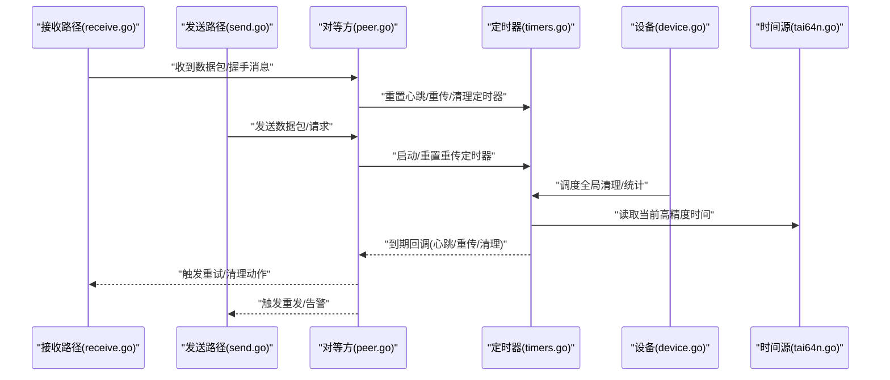
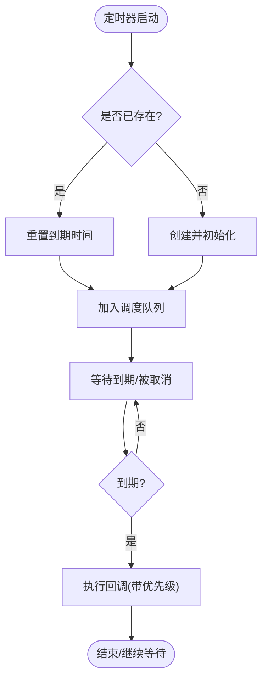
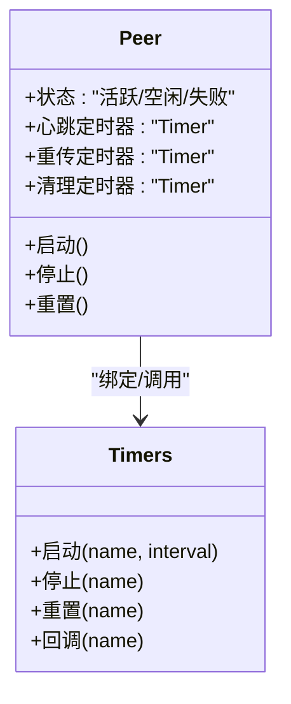
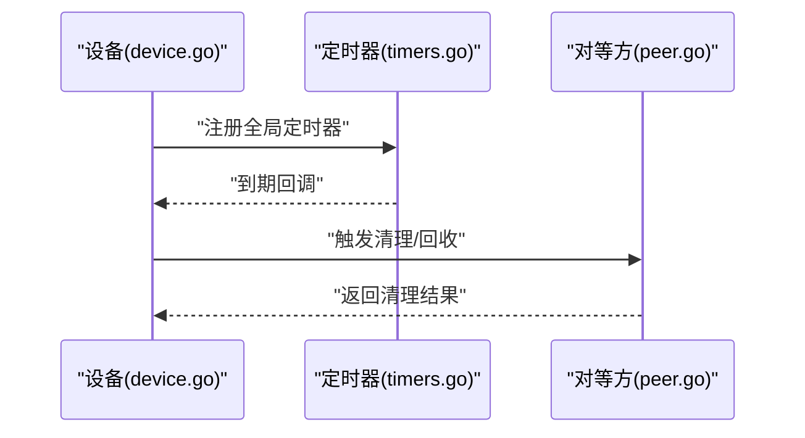
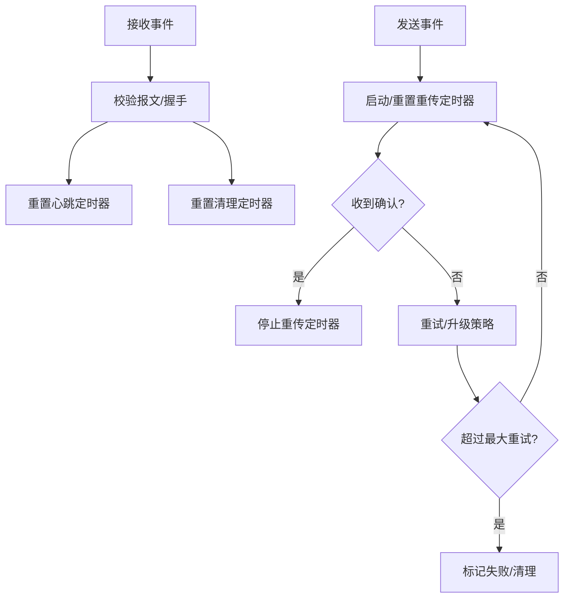
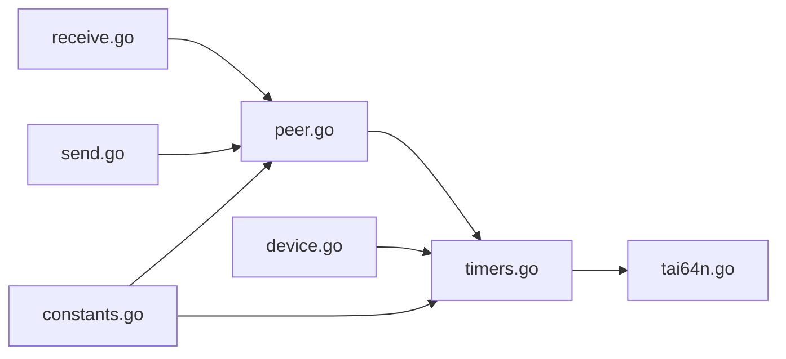

# 定时器系统

<cite>
**本文档引用的文件**
- [device/timers.go](file://device/timers.go)
- [device/peer.go](file://device/peer.go)
- [device/device.go](file://device/device.go)
- [device/constants.go](file://device/constants.go)
- [device/receive.go](file://device/receive.go)
- [device/send.go](file://device/send.go)
- [tai64n/tai64n.go](file://tai64n/tai64n.go)
</cite>

## 目录
1. [简介](#简介)
2. [项目结构](#项目结构)
3. [核心组件](#核心组件)
4. [架构总览](#架构总览)
5. [详细组件分析](#详细组件分析)
6. [依赖关系分析](#依赖关系分析)
7. [性能考虑](#性能考虑)
8. [故障排查指南](#故障排查指南)
9. [结论](#结论)
10. [附录](#附录)

## 简介
本文件面向对等方（Peer）相关的定时器子系统，系统性说明心跳检测、重传、超时清理等定时器的实现与调度机制，覆盖启动/停止/重置流程、并发安全保证、精度控制与性能优化策略，以及故障检测与自愈、监控与调优方法。文档以代码为依据，提供可视化图表帮助理解数据流与控制流。

## 项目结构
定时器相关逻辑主要位于 device 包中：
- timers.go：定时器定义、调度与生命周期管理
- peer.go：对等方状态机与定时器绑定
- device.go：设备级定时器与全局调度入口
- constants.go：定时器常量（间隔、阈值等）
- receive.go / send.go：触发定时器的事件来源（接收/发送路径）
- tai64n/tai64n.go：高精度时间源（用于避免时钟回拨影响）

**图示来源**
- [device/device.go:1-200](file://device/device.go#L1-L200)
- [device/timers.go:1-200](file://device/timers.go#L1-L200)
- [device/peer.go:1-200](file://device/peer.go#L1-L200)
- [device/constants.go:1-120](file://device/constants.go#L1-L120)
- [device/receive.go:1-200](file://device/receive.go#L1-L200)
- [device/send.go:1-200](file://device/send.go#L1-L200)
- [tai64n/tai64n.go:1-120](file://tai64n/tai64n.go#L1-L120)

**章节来源**
- [device/timers.go:1-200](file://device/timers.go#L1-L200)
- [device/peer.go:1-200](file://device/peer.go#L1-L200)
- [device/device.go:1-200](file://device/device.go#L1-L200)
- [device/constants.go:1-120](file://device/constants.go#L1-L120)
- [device/receive.go:1-200](file://device/receive.go#L1-L200)
- [device/send.go:1-200](file://device/send.go#L1-L200)
- [tai64n/tai64n.go:1-120](file://tai64n/tai64n.go#L1-L120)

## 核心组件
- 定时器集合与执行器：集中管理多个定时器实例，负责调度、优先级与并发安全
- 对等方定时器绑定：将心跳、重传、超时清理等定时器与对等方状态关联
- 设备级定时器：处理全局或跨对等方的定时任务（如清理过期会话、统计刷新）
- 时间源：使用高精度单调时间，避免系统时钟调整导致的误判
- 事件驱动：接收/发送路径在关键事件发生时触发或重置相应定时器

**章节来源**
- [device/timers.go:1-200](file://device/timers.go#L1-L200)
- [device/peer.go:1-200](file://device/peer.go#L1-L200)
- [device/device.go:1-200](file://device/device.go#L1-L200)
- [tai64n/tai64n.go:1-120](file://tai64n/tai64n.go#L1-L120)

## 架构总览
下图展示定时器系统的整体架构：设备层维护全局定时器与调度器；对等方层为每个 Peer 绑定一组业务定时器；收发路径在事件发生时触发或重置定时器；时间源提供高精度单调时间。

**图示来源**
- [device/receive.go:1-200](file://device/receive.go#L1-L200)
- [device/send.go:1-200](file://device/send.go#L1-L200)
- [device/peer.go:1-200](file://device/peer.go#L1-L200)
- [device/timers.go:1-200](file://device/timers.go#L1-L200)
- [device/device.go:1-200](file://device/device.go#L1-L200)
- [tai64n/tai64n.go:1-120](file://tai64n/tai64n.go#L1-L120)

## 详细组件分析

### 定时器集合与执行器（timers.go）
- 职责：统一管理多个定时器实例，提供启动、停止、重置接口；维护执行队列与优先级；确保并发安全
- 调度机制：基于高精度单调时间计算下次触发时刻；按优先级顺序执行回调；支持批量调度减少唤醒次数
- 并发安全：通过互斥锁保护定时器状态变更；回调执行时避免重入；对临界区最小化持有锁的时间
- 精度控制：使用单调时钟避免系统时间回拨；必要时进行抖动抑制与合并调度
- 性能优化：惰性创建、复用定时器对象；批量更新下一次触发时间；减少不必要的唤醒

**图示来源**
- [device/timers.go:1-200](file://device/timers.go#L1-L200)

**章节来源**
- [device/timers.go:1-200](file://device/timers.go#L1-L200)

### 对等方定时器绑定（peer.go）
- 职责：为每个对等方绑定心跳检测、重传、超时清理等定时器；根据状态机切换启用/禁用
- 启动/停止/重置：
  - 启动：建立连接或握手开始时启动心跳与重传定时器
  - 停止：断开连接或进入空闲态时停止相关定时器
  - 重置：收到新报文或成功重传后重置对应定时器
- 状态联动：根据对等方状态（活跃、空闲、失败）动态调整定时器周期与阈值
- 错误处理：定时器回调中记录错误并触发恢复流程（如重试、清理）

**图示来源**
- [device/peer.go:1-200](file://device/peer.go#L1-L200)
- [device/timers.go:1-200](file://device/timers.go#L1-L200)

**章节来源**
- [device/peer.go:1-200](file://device/peer.go#L1-L200)
- [device/timers.go:1-200](file://device/timers.go#L1-L200)

### 设备级定时器（device.go）
- 职责：维护全局定时器（如会话清理、统计刷新、健康检查），协调多对等方资源
- 调度入口：统一入口负责周期性扫描与清理过期条目；触发对等方级别的回收
- 与对等方交互：通知对等方进行资源释放或状态迁移；聚合指标上报

**图示来源**
- [device/device.go:1-200](file://device/device.go#L1-L200)
- [device/timers.go:1-200](file://device/timers.go#L1-L200)
- [device/peer.go:1-200](file://device/peer.go#L1-L200)

**章节来源**
- [device/device.go:1-200](file://device/device.go#L1-L200)
- [device/timers.go:1-200](file://device/timers.go#L1-L200)
- [device/peer.go:1-200](file://device/peer.go#L1-L200)

### 事件驱动与定时器触发（receive.go / send.go）
- 接收路径：收到握手/数据报文时重置心跳与清理定时器；异常时触发重传或告警
- 发送路径：发送请求或数据时启动/重置重传定时器；超时未确认则重试或标记失败
- 一致性：确保同一事件不会重复触发相同定时器；避免竞态条件

**图示来源**
- [device/receive.go:1-200](file://device/receive.go#L1-L200)
- [device/send.go:1-200](file://device/send.go#L1-L200)
- [device/timers.go:1-200](file://device/timers.go#L1-L200)

**章节来源**
- [device/receive.go:1-200](file://device/receive.go#L1-L200)
- [device/send.go:1-200](file://device/send.go#L1-L200)
- [device/timers.go:1-200](file://device/timers.go#L1-L200)

### 时间源与精度控制（tai64n/tai64n.go）
- 高精度单调时间：避免系统时钟回拨导致定时器提前或延迟触发
- 精度策略：结合抖动抑制与批量调度，降低系统唤醒频率
- 兼容性：在不同平台提供一致的时间语义，确保跨环境稳定性

**章节来源**
- [tai64n/tai64n.go:1-120](file://tai64n/tai64n.go#L1-L120)

## 依赖关系分析
- 对等方依赖定时器集合：通过名称或标识绑定具体定时器
- 设备依赖定时器集合：注册全局定时器并协调对等方行为
- 收发路径依赖对等方：事件触发后由对等方决定定时器操作
- 所有定时器依赖时间源：确保时间一致性与单调性

**图示来源**
- [device/receive.go:1-200](file://device/receive.go#L1-L200)
- [device/send.go:1-200](file://device/send.go#L1-L200)
- [device/peer.go:1-200](file://device/peer.go#L1-L200)
- [device/timers.go:1-200](file://device/timers.go#L1-L200)
- [device/device.go:1-200](file://device/device.go#L1-L200)
- [device/constants.go:1-120](file://device/constants.go#L1-L120)
- [tai64n/tai64n.go:1-120](file://tai64n/tai64n.go#L1-L120)

**章节来源**
- [device/peer.go:1-200](file://device/peer.go#L1-L200)
- [device/timers.go:1-200](file://device/timers.go#L1-L200)
- [device/device.go:1-200](file://device/device.go#L1-L200)
- [device/constants.go:1-120](file://device/constants.go#L1-L120)
- [device/receive.go:1-200](file://device/receive.go#L1-L200)
- [device/send.go:1-200](file://device/send.go#L1-L200)
- [tai64n/tai64n.go:1-120](file://tai64n/tai64n.go#L1-L120)

## 性能考虑
- 调度合并：将相近时间的定时器合并调度，减少唤醒次数
- 懒加载：仅在需要时创建定时器，避免空转开销
- 锁粒度：缩小临界区范围，提高并发吞吐
- 时间源选择：使用单调时间避免系统时钟调整带来的额外处理
- 自适应周期：根据网络状况动态调整定时器周期，平衡响应速度与资源消耗

[本节为通用性能指导，不直接分析具体文件]

## 故障排查指南
- 常见问题
  - 定时器未触发：检查时间源是否正确；确认调度队列未被阻塞
  - 频繁触发：检查重置逻辑是否被正确调用；确认事件去重机制
  - 内存泄漏：确认定时器停止与释放路径；检查回调中的引用释放
- 诊断步骤
  - 查看定时器状态：枚举当前活跃的定时器及其到期时间
  - 跟踪事件链路：从收发路径到对等方再到定时器集合的调用链
  - 验证时间一致性：对比单调时间与系统时间，排除回拨影响
- 恢复策略
  - 自动重试：对可恢复错误进行指数退避重试
  - 清理过期：定期清理无效的对等方与定时器资源
  - 降级模式：在高负载下降低定时器精度或频率

**章节来源**
- [device/timers.go:1-200](file://device/timers.go#L1-L200)
- [device/peer.go:1-200](file://device/peer.go#L1-L200)
- [device/device.go:1-200](file://device/device.go#L1-L200)

## 结论
定时器系统通过对等方与设备层的协同设计，实现了心跳检测、重传与超时清理等关键功能。借助高精度时间源与并发安全的调度机制，系统在复杂网络环境下保持稳定与高效。通过合理的启动/停止/重置策略、精度控制与性能优化，能够有效应对高并发与低延迟场景。建议在生产环境中结合监控指标持续调优，确保最佳运行效果。

[本节为总结性内容，不直接分析具体文件]

## 附录
- 监控指标建议
  - 定时器数量与存活时长
  - 触发次数与失败率
  - 平均/最大延迟与抖动
  - 资源占用（CPU、内存）
- 调优建议
  - 根据网络质量调整心跳与重传周期
  - 在高负载场景下启用批量调度与降频策略
  - 定期审计定时器配置，避免过度或不足

[本节为通用指导，不直接分析具体文件]