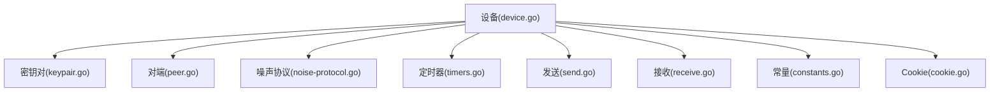
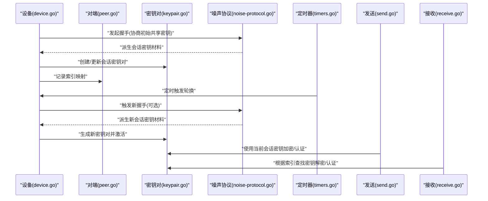
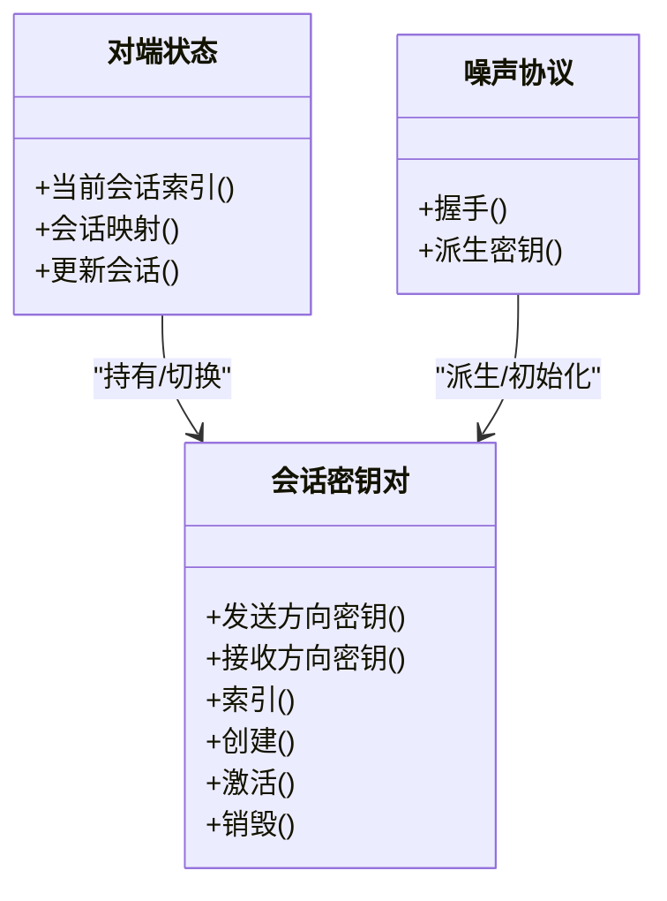
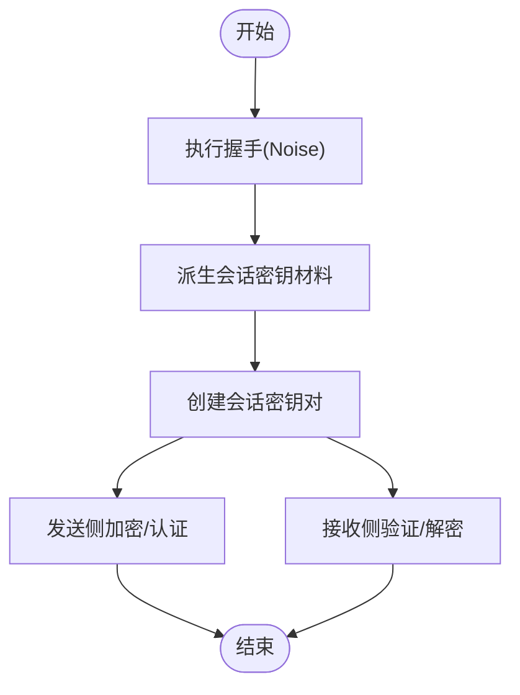
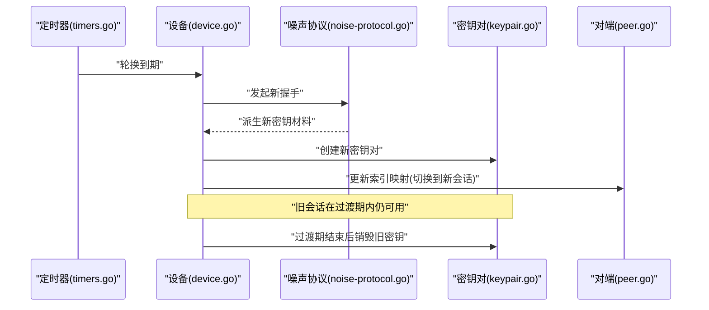
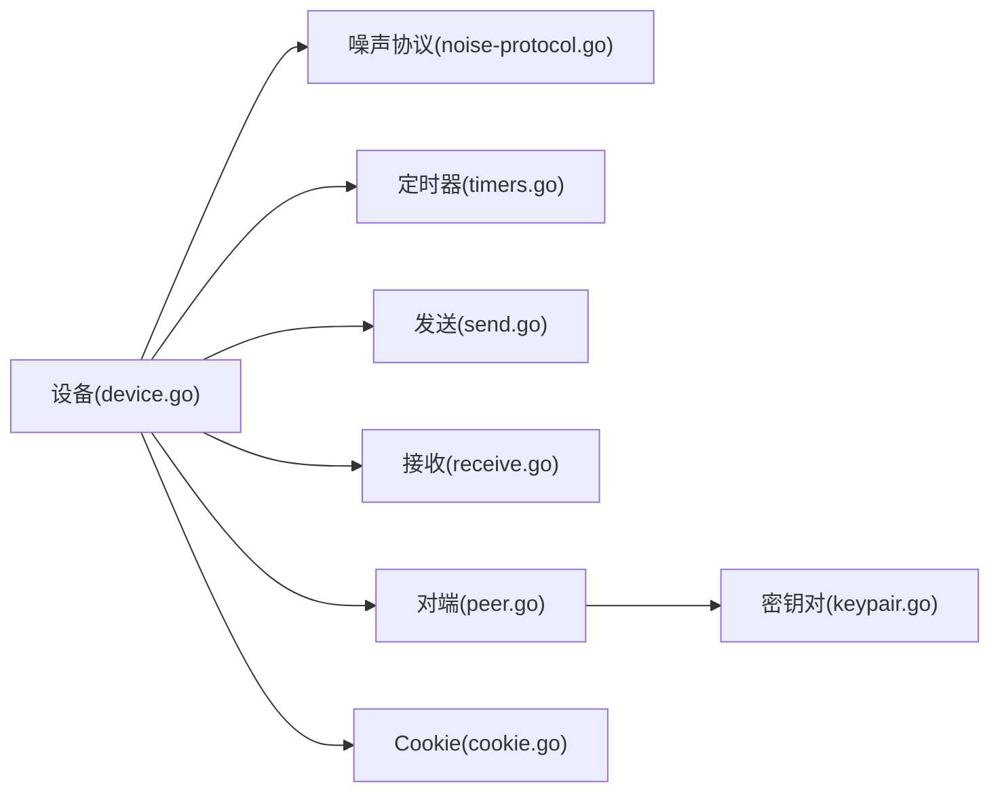

# 密钥对管理

<cite>
**本文引用的文件**
- [device/keypair.go](file://device/keypair.go)
- [device/device.go](file://device/device.go)
- [device/peer.go](file://device/peer.go)
- [device/noise-protocol.go](file://device/noise-protocol.go)
- [device/noise-helpers.go](file://device/noise-helpers.go)
- [device/timers.go](file://device/timers.go)
- [device/send.go](file://device/send.go)
- [device/receive.go](file://device/receive.go)
- [device/constants.go](file://device/constants.go)
- [device/cookie.go](file://device/cookie.go)
</cite>

## 目录
1. [简介](#简介)
2. [项目结构](#项目结构)
3. [核心组件](#核心组件)
4. [架构总览](#架构总览)
5. [详细组件分析](#详细组件分析)
6. [依赖关系分析](#依赖关系分析)
7. [性能考量](#性能考量)
8. [故障排查指南](#故障排查指南)
9. [结论](#结论)
10. [附录](#附录)

## 简介
本文件聚焦于 wireguard-go 中的“密钥对管理”，围绕会话密钥对的生成、存储与轮换机制展开，解释公钥验证、私钥保护、密钥派生算法的实现要点，并文档化安全存储策略（内存安全处理与临时数据清理）、轮换触发条件与执行流程、通信安全保障、密钥同步与故障恢复策略，以及 API 使用示例与安全最佳实践。内容基于代码库中 device 子模块的密钥相关实现进行梳理与归纳。

## 项目结构
wireguard-go 的密钥管理主要位于 device 目录：
- keypair.go：会话密钥对的数据结构与生命周期管理
- device.go：设备主控制器，协调密钥、定时器、收发队列等
- peer.go：对端状态与密钥索引映射
- noise-protocol.go / noise-helpers.go：Noise 协议握手、密钥派生与消息封装
- timers.go：密钥轮换相关的定时器与超时控制
- send.go / receive.go：发送/接收路径中对密钥的使用与校验
- constants.go：时间常量、轮转周期等配置常量
- cookie.go：防重放/抗放大攻击的 Cookie 机制（与密钥轮换协同）

图表来源
- [device/device.go](file://device/device.go)
- [device/keypair.go](file://device/keypair.go)
- [device/peer.go](file://device/peer.go)
- [device/noise-protocol.go](file://device/noise-protocol.go)
- [device/timers.go](file://device/timers.go)
- [device/send.go](file://device/send.go)
- [device/receive.go](file://device/receive.go)
- [device/constants.go](file://device/constants.go)
- [device/cookie.go](file://device/cookie.go)

章节来源
- [device/keypair.go](file://device/keypair.go)
- [device/device.go](file://device/device.go)
- [device/peer.go](file://device/peer.go)
- [device/noise-protocol.go](file://device/noise-protocol.go)
- [device/timers.go](file://device/timers.go)
- [device/send.go](file://device/send.go)
- [device/receive.go](file://device/receive.go)
- [device/constants.go](file://device/constants.go)
- [device/cookie.go](file://device/cookie.go)

## 核心组件
- 会话密钥对与会话索引
  - 会话密钥对用于单条或一批数据包的对称加密与认证，包含发送与接收方向的密钥材料，并通过索引表快速定位。
  - 会话通过短索引标识，避免在每条消息中携带长密钥，降低带宽开销。
- 对端状态与密钥映射
  - 每个对端维护当前活跃会话的索引映射，支持多会话并发与切换。
- Noise 协议与密钥派生
  - 通过 Noise 握手建立初始共享密钥，并派生出会话所需的对称密钥材料；后续按协议规范进行消息封装与解密。
- 定时器与轮换
  - 基于固定周期或事件触发的定时器驱动密钥轮换，确保前向保密与长期安全性。
- 收发路径集成
  - 发送侧选择当前会话密钥进行加密与认证；接收侧根据消息头中的索引查找对应会话密钥并进行解密与认证。
- Cookie 机制
  - 在握手阶段引入 Cookie，缓解资源耗尽与放大攻击，与密钥轮换共同保障通信安全。

章节来源
- [device/keypair.go](file://device/keypair.go)
- [device/peer.go](file://device/peer.go)
- [device/noise-protocol.go](file://device/noise-protocol.go)
- [device/timers.go](file://device/timers.go)
- [device/send.go](file://device/send.go)
- [device/receive.go](file://device/receive.go)
- [device/constants.go](file://device/constants.go)
- [device/cookie.go](file://device/cookie.go)

## 架构总览
下图展示了密钥对在设备、对端、噪声协议、定时器与收发路径之间的交互关系。

图表来源
- [device/device.go](file://device/device.go)
- [device/peer.go](file://device/peer.go)
- [device/keypair.go](file://device/keypair.go)
- [device/noise-protocol.go](file://device/noise-protocol.go)
- [device/timers.go](file://device/timers.go)
- [device/send.go](file://device/send.go)
- [device/receive.go](file://device/receive.go)

## 详细组件分析

### 会话密钥对数据结构与生命周期
- 设计要点
  - 会话密钥对包含发送与接收方向的密钥材料，并提供索引以快速检索。
  - 生命周期包括创建、激活、使用、轮换与销毁，期间需保证内存安全与最小暴露面。
- 关键职责
  - 提供安全的密钥访问接口，限制直接暴露原始密钥。
  - 支持多会话并发，允许旧会话在过渡期内继续工作以确保无缝切换。
  - 在销毁时清理敏感数据，防止残留泄露。

图表来源
- [device/keypair.go](file://device/keypair.go)
- [device/peer.go](file://device/peer.go)
- [device/noise-protocol.go](file://device/noise-protocol.go)

章节来源
- [device/keypair.go](file://device/keypair.go)
- [device/peer.go](file://device/peer.go)
- [device/noise-protocol.go](file://device/noise-protocol.go)

### 公钥验证与私钥保护
- 公钥验证
  - 在握手阶段验证对端公钥的有效性，确保身份可信后再进行密钥派生与会话建立。
  - 结合设备配置与对端白名单，拒绝非法或未知公钥参与握手。
- 私钥保护
  - 私钥在内存中以最小权限和最短生命周期存在，避免持久化到磁盘。
  - 使用安全的随机源生成私钥，并在不再需要时立即清零内存。
  - 限制对私钥的直接访问，仅通过受控接口进行必要操作。

章节来源
- [device/noise-protocol.go](file://device/noise-protocol.go)
- [device/device.go](file://device/device.go)

### 密钥派生算法与消息封装
- 密钥派生
  - 基于 Noise 协议完成初始共享密钥协商后，按协议规范派生出会话所需的对称密钥材料。
  - 派生过程遵循标准算法族，确保兼容性与安全性。
- 消息封装
  - 发送侧将载荷与认证标签一起封装，接收侧先验证再解密，确保完整性与机密性。
  - 使用会话索引标识当前会话，减少头部开销。

图表来源
- [device/noise-protocol.go](file://device/noise-protocol.go)
- [device/keypair.go](file://device/keypair.go)
- [device/send.go](file://device/send.go)
- [device/receive.go](file://device/receive.go)

章节来源
- [device/noise-protocol.go](file://device/noise-protocol.go)
- [device/send.go](file://device/send.go)
- [device/receive.go](file://device/receive.go)

### 安全存储策略与临时数据清理
- 内存安全
  - 密钥仅在内存中驻留，避免写入持久化存储。
  - 使用不可分页或受保护的内存区域（如平台支持）存放敏感数据。
- 最小暴露
  - 通过接口封装访问，禁止直接拷贝或导出原始密钥。
  - 日志与调试输出严格过滤敏感信息。
- 临时数据清理
  - 在会话销毁或轮换完成后，立即清零临时缓冲区与中间结果。
  - 确保异常路径也能正确清理，避免泄漏。

章节来源
- [device/keypair.go](file://device/keypair.go)
- [device/device.go](file://device/device.go)

### 密钥轮换：触发条件与执行流程
- 触发条件
  - 周期性定时器到期（依据配置的时间常数）。
  - 握手失败或检测到异常（例如重放或认证失败）时主动轮换。
  - 对端状态变化或网络拓扑变更可能触发重新协商。
- 执行流程
  - 定时器触发后，启动新握手流程，派生新的会话密钥材料。
  - 创建新密钥对并标记为活跃，同时保留旧密钥一段时间以处理延迟到达的消息。
  - 更新对端索引映射，使后续数据包使用新密钥。
  - 旧密钥在过渡期结束后被销毁并清理内存。

图表来源
- [device/timers.go](file://device/timers.go)
- [device/device.go](file://device/device.go)
- [device/noise-protocol.go](file://device/noise-protocol.go)
- [device/keypair.go](file://device/keypair.go)
- [device/peer.go](file://device/peer.go)

章节来源
- [device/timers.go](file://device/timers.go)
- [device/device.go](file://device/device.go)
- [device/noise-protocol.go](file://device/noise-protocol.go)
- [device/keypair.go](file://device/keypair.go)
- [device/peer.go](file://device/peer.go)

### 密钥同步机制与故障恢复
- 密钥同步
  - 对端之间通过握手消息同步会话状态与索引，确保双方使用一致的密钥材料。
  - 在切换过程中，允许短暂的多会话并存，以容忍网络抖动与乱序。
- 故障恢复
  - 当认证失败或重放检测命中时，丢弃错误消息并触发重试或轮换。
  - Cookie 机制用于抵御资源耗尽攻击，在握手失败时返回挑战，要求客户端携带有效 Cookie 重试。
  - 定时器与重试逻辑确保在异常情况下能自动恢复。

章节来源
- [device/noise-protocol.go](file://device/noise-protocol.go)
- [device/cookie.go](file://device/cookie.go)
- [device/timers.go](file://device/timers.go)

### API 使用示例与安全最佳实践
- 使用示例（概念性）
  - 初始化设备并加载本地私钥。
  - 添加对端公钥并建立连接。
  - 发送数据时，系统自动选择当前会话密钥进行加密与认证。
  - 接收数据时，系统根据索引查找会话密钥进行验证与解密。
  - 定期轮换密钥，或在异常时主动触发轮换。
- 安全最佳实践
  - 始终使用最新稳定版本，关注安全公告。
  - 最小化私钥暴露面，避免日志、调试输出与持久化存储。
  - 启用并合理配置 Cookie 与速率限制，抵御放大与耗尽攻击。
  - 监控密钥轮换与健康状态，及时处理异常。
  - 在容器或受限环境中，使用平台提供的安全内存特性。

[本节为概念性说明，不直接分析具体文件]

## 依赖关系分析
- 组件耦合
  - 设备作为中心协调者，依赖噪声协议进行握手与派生，依赖定时器驱动轮换，依赖收发路径使用密钥。
  - 对端状态与密钥对紧密耦合，索引映射是高效路由的关键。
- 外部依赖
  - 噪声协议栈与密码学原语（由底层库提供）。
  - 操作系统提供的安全内存与随机数服务。
- 潜在循环依赖
  - 通过分层设计避免循环：设备层协调，协议层专注握手与派生，收发层专注加解密。

图表来源
- [device/device.go](file://device/device.go)
- [device/noise-protocol.go](file://device/noise-protocol.go)
- [device/timers.go](file://device/timers.go)
- [device/send.go](file://device/send.go)
- [device/receive.go](file://device/receive.go)
- [device/peer.go](file://device/peer.go)
- [device/keypair.go](file://device/keypair.go)
- [device/cookie.go](file://device/cookie.go)

章节来源
- [device/device.go](file://device/device.go)
- [device/noise-protocol.go](file://device/noise-protocol.go)
- [device/timers.go](file://device/timers.go)
- [device/send.go](file://device/send.go)
- [device/receive.go](file://device/receive.go)
- [device/peer.go](file://device/peer.go)
- [device/keypair.go](file://device/keypair.go)
- [device/cookie.go](file://device/cookie.go)

## 性能考量
- 会话索引优化
  - 使用短索引替代长密钥，减少包头部开销，提升吞吐。
- 多会话并行
  - 允许新旧会话并存，降低切换时的丢包与重传。
- 内存与缓存
  - 复用缓冲区与对象池，减少分配与拷贝成本。
- 定时器精度
  - 合理设置轮换周期，平衡安全性与性能。
- Cookie 与速率限制
  - 减轻握手阶段的压力，提高抗攻击能力。

[本节提供一般性指导，不直接分析具体文件]

## 故障排查指南
- 常见问题
  - 握手失败：检查对端公钥是否合法、网络连通性与防火墙规则。
  - 认证失败：确认双方时钟与序列号一致，检查重放防护。
  - 轮换异常：查看定时器配置与日志，确认新旧会话过渡是否正常。
- 诊断步骤
  - 启用详细日志（注意脱敏），观察握手与轮换流程。
  - 检查 Cookie 挑战与响应是否正确。
  - 验证对端索引映射是否及时更新。
- 恢复策略
  - 触发手动轮换或重启握手。
  - 重置对端状态并重新建立连接。

章节来源
- [device/noise-protocol.go](file://device/noise-protocol.go)
- [device/cookie.go](file://device/cookie.go)
- [device/timers.go](file://device/timers.go)
- [device/device.go](file://device/device.go)

## 结论
wireguard-go 的密钥对管理通过噪声协议握手、严格的内存安全策略、高效的索引机制与可靠的轮换流程，实现了高安全性的会话密钥生命周期管理。配合 Cookie 与定时器，系统在对抗攻击与异常恢复方面具备良好韧性。遵循本文的最佳实践与故障排查建议，可进一步提升部署的安全性与稳定性。

[本节为总结性内容，不直接分析具体文件]

## 附录
- 术语
  - 会话密钥对：用于对称加密与认证的短期密钥集合。
  - 索引：会话的短标识，用于快速查找密钥。
  - 轮换：定期或事件驱动的密钥更换过程。
  - Cookie：握手阶段的挑战令牌，用于抵御资源耗尽攻击。
- 参考
  - 噪声协议规范与实现细节参见噪声协议相关文件。
  - 平台安全内存与随机数服务请参考操作系统文档。

[本节为补充信息，不直接分析具体文件]