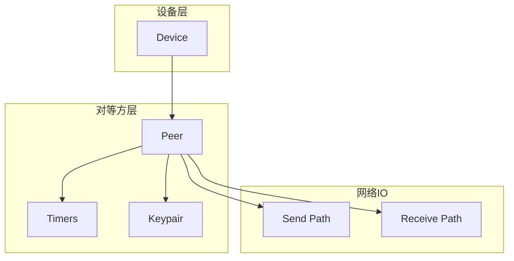
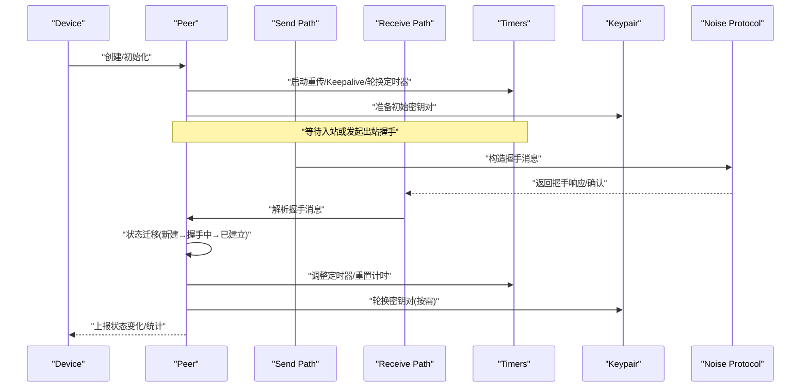
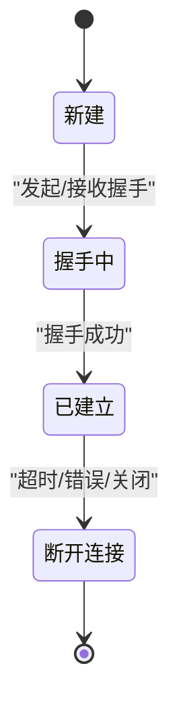
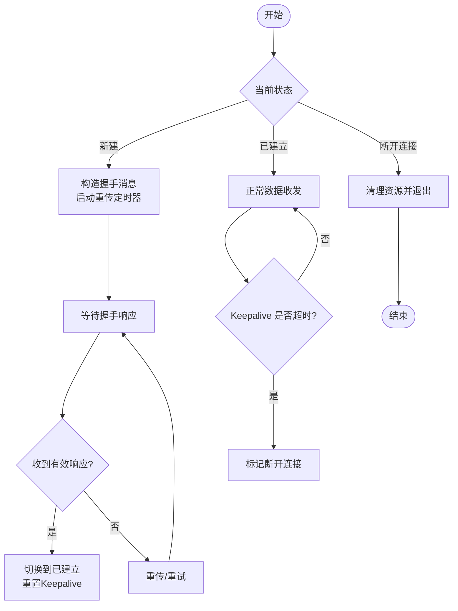
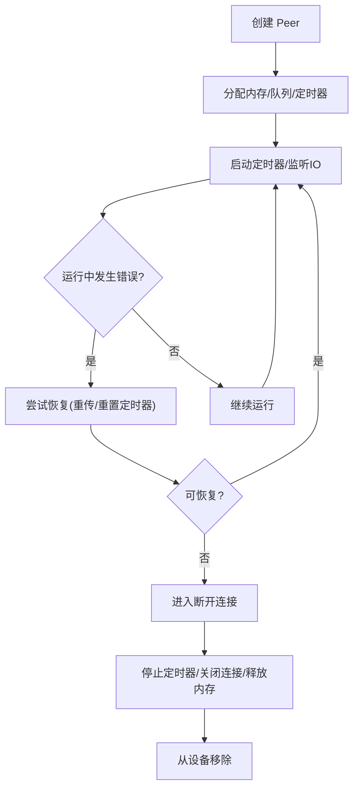
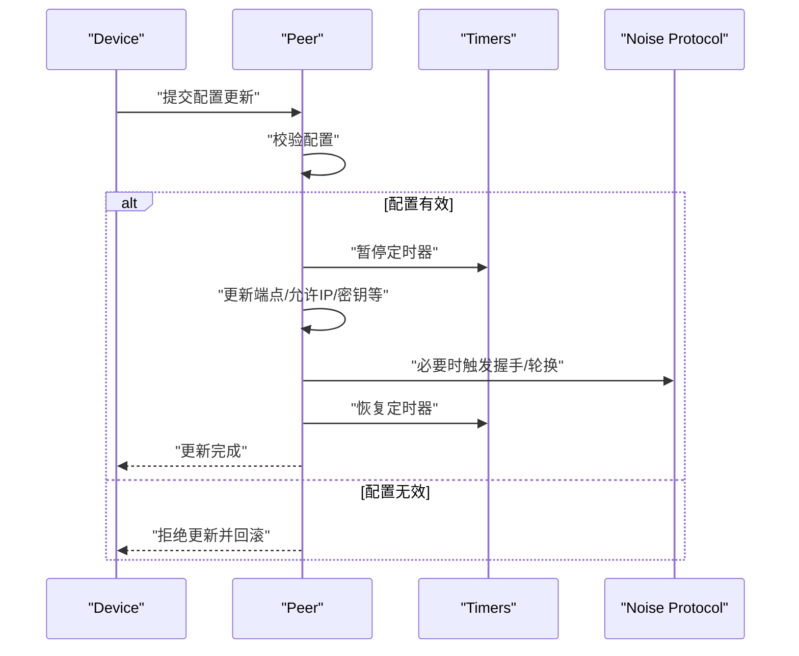
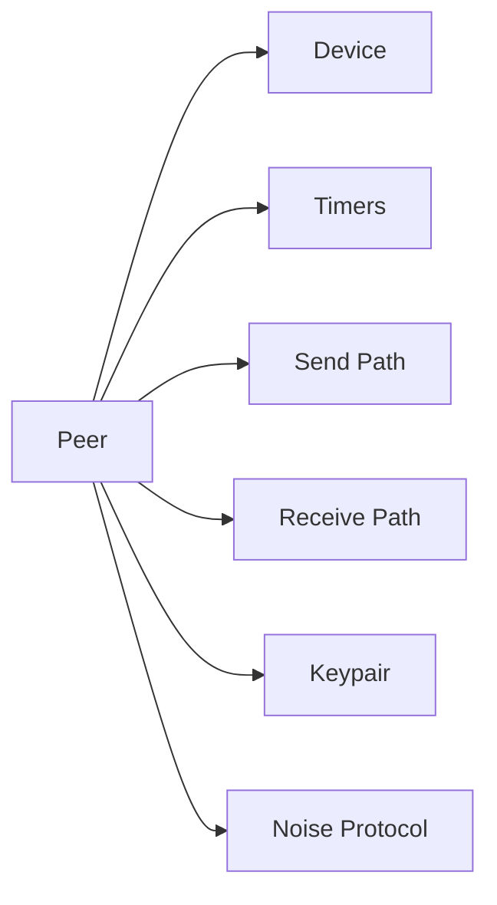

# 对等方生命周期管理

<cite>
**本文引用的文件**
- [device/peer.go](file://device/peer.go)
- [device/device.go](file://device/device.go)
- [device/timers.go](file://device/timers.go)
- [device/send.go](file://device/send.go)
- [device/receive.go](file://device/receive.go)
- [device/keypair.go](file://device/keypair.go)
- [device/noise-protocol.go](file://device/noise-protocol.go)
- [device/constants.go](file://device/constants.go)
</cite>

## 目录
1. [简介](#简介)
2. [项目结构](#项目结构)
3. [核心组件](#核心组件)
4. [架构总览](#架构总览)
5. [详细组件分析](#详细组件分析)
6. [依赖关系分析](#依赖关系分析)
7. [性能考虑](#性能考虑)
8. [故障排查指南](#故障排查指南)
9. [结论](#结论)
10. [附录](#附录)

## 简介
本文件聚焦于 wireguard-go 中对等方（Peer）的生命周期管理，涵盖创建、初始化、运行期状态转换、资源分配与释放、配置更新与错误恢复，以及监控与调试方法。目标是帮助读者理解 Peer 从新建到销毁的完整流程，并掌握关键实现要点与最佳实践。

## 项目结构
与对等方生命周期相关的代码主要位于 device 包中：
- peer.go：定义 Peer 结构体及生命周期核心逻辑（创建、启动、关闭、状态机、定时器、队列等）。
- device.go：设备级上下文与对等方集合管理，负责 Peer 的注册、查找、调度与清理。
- timers.go：对等方相关定时器（重传、Keepalive、密钥轮换等）的实现与管理。
- send.go / receive.go：发送与接收路径，驱动握手、数据报文处理，触发状态迁移。
- keypair.go：会话密钥对管理与轮换。
- noise-protocol.go：Noise 协议握手流程，驱动握手状态机。
- constants.go：常量定义（如超时时间、队列大小等），影响生命周期行为。

图表来源
- [device/device.go:1-200](file://device/device.go#L1-L200)
- [device/peer.go:1-200](file://device/peer.go#L1-L200)
- [device/timers.go:1-120](file://device/timers.go#L1-L120)
- [device/send.go:1-120](file://device/send.go#L1-L120)
- [device/receive.go:1-120](file://device/receive.go#L1-L120)

章节来源
- [device/device.go:1-200](file://device/device.go#L1-L200)
- [device/peer.go:1-200](file://device/peer.go#L1-L200)

## 核心组件
- Peer 结构体：封装对等方的连接状态、密钥对、定时器、队列、端点信息等，是生命周期管理的核心。
- Device：维护所有 Peer 的集合，提供添加、删除、查找、调度能力，协调 Peer 与底层 IO。
- Timers：为每个 Peer 维护重传、Keepalive、密钥轮换等定时器，驱动状态迁移与资源回收。
- Send/Receive：分别处理出站和入站报文，触发握手、数据转发、状态更新。
- Keypair：管理当前与下一轮会话密钥对，支持无缝轮换。
- Noise 协议：实现握手消息的构造与解析，驱动握手状态机。

章节来源
- [device/peer.go:1-200](file://device/peer.go#L1-L200)
- [device/device.go:1-200](file://device/device.go#L1-L200)
- [device/timers.go:1-120](file://device/timers.go#L1-L120)
- [device/send.go:1-120](file://device/send.go#L1-L120)
- [device/receive.go:1-120](file://device/receive.go#L1-L120)
- [device/keypair.go:1-120](file://device/keypair.go#L1-L120)
- [device/noise-protocol.go:1-120](file://device/noise-protocol.go#L1-L120)

## 架构总览
下图展示了 Peer 在设备中的位置及其与发送/接收路径、定时器、密钥对的交互关系。

图表来源
- [device/device.go:1-200](file://device/device.go#L1-L200)
- [device/peer.go:1-200](file://device/peer.go#L1-L200)
- [device/send.go:1-120](file://device/send.go#L1-L120)
- [device/receive.go:1-120](file://device/receive.go#L1-L120)
- [device/timers.go:1-120](file://device/timers.go#L1-L120)
- [device/keypair.go:1-120](file://device/keypair.go#L1-L120)
- [device/noise-protocol.go:1-120](file://device/noise-protocol.go#L1-L120)

## 详细组件分析

### Peer 结构体与生命周期阶段
- 创建与初始化
  - 由 Device 创建 Peer 实例，分配内存、初始化队列、定时器、密钥对、端点信息。
  - 设置初始状态为“新建”，并注册到设备对等方表。
- 运行期
  - 根据入站/出站事件进行状态迁移：新建 → 握手中 → 已建立。
  - 定时任务驱动 Keepalive、重传、密钥轮换。
- 销毁
  - 收到关闭信号或异常退出时，停止定时器、释放队列、清理网络连接、释放密钥材料。

图表来源
- [device/peer.go:1-200](file://device/peer.go#L1-L200)
- [device/constants.go:1-120](file://device/constants.go#L1-L120)

章节来源
- [device/peer.go:1-200](file://device/peer.go#L1-L200)
- [device/constants.go:1-120](file://device/constants.go#L1-L120)

### 状态转换机制
- 新建 → 握手中
  - 触发条件：首次出站数据或入站握手请求。
  - 动作：构造握手消息、启动重传定时器、记录握手序列号。
- 握手中 → 已建立
  - 触发条件：收到有效的握手完成消息。
  - 动作：切换至活跃密钥对、重置 Keepalive 定时器、更新统计。
- 已建立 → 断开连接
  - 触发条件：Keepalive 超时、重传失败、网络错误、显式关闭。
  - 动作：停止定时器、清理队列、释放资源、通知设备移除。

图表来源
- [device/peer.go:1-200](file://device/peer.go#L1-L200)
- [device/timers.go:1-120](file://device/timers.go#L1-L120)
- [device/send.go:1-120](file://device/send.go#L1-L120)
- [device/receive.go:1-120](file://device/receive.go#L1-L120)

章节来源
- [device/peer.go:1-200](file://device/peer.go#L1-L200)
- [device/timers.go:1-120](file://device/timers.go#L1-L120)
- [device/send.go:1-120](file://device/send.go#L1-L120)
- [device/receive.go:1-120](file://device/receive.go#L1-L120)

### 资源分配与释放策略
- 内存管理
  - Peer 对象、队列缓冲区、密钥材料在创建时分配，在销毁时释放。
  - 使用池化或复用策略减少频繁分配开销（参考 pools 模块）。
- 网络连接清理
  - 关闭 UDP/TUN 句柄、取消读写回调、清空待发送队列。
- 定时器清理
  - 停止重传、Keepalive、密钥轮换定时器，避免泄漏。
- 错误恢复
  - 捕获网络错误并尝试恢复（如重连、重置定时器）。
  - 若不可恢复则进入断开连接并执行清理。

图表来源
- [device/peer.go:1-200](file://device/peer.go#L1-L200)
- [device/timers.go:1-120](file://device/timers.go#L1-L120)
- [device/send.go:1-120](file://device/send.go#L1-L120)
- [device/receive.go:1-120](file://device/receive.go#L1-L120)

章节来源
- [device/peer.go:1-200](file://device/peer.go#L1-L200)
- [device/timers.go:1-120](file://device/timers.go#L1-L120)

### 配置更新的处理流程
- 触发场景：对等方公钥、端点、允许 IP、持久密钥等配置变更。
- 处理步骤：
  - 校验新配置合法性。
  - 暂停相关定时器与队列操作。
  - 更新内部状态（如端点、允许列表）。
  - 必要时触发重新握手或密钥轮换。
  - 恢复定时器与队列。
- 错误恢复：
  - 若配置无效，回滚到旧配置并记录错误。
  - 若更新过程中出现 IO 错误，延迟重试并告警。

图表来源
- [device/peer.go:1-200](file://device/peer.go#L1-L200)
- [device/timers.go:1-120](file://device/timers.go#L1-L120)
- [device/noise-protocol.go:1-120](file://device/noise-protocol.go#L1-L120)

章节来源
- [device/peer.go:1-200](file://device/peer.go#L1-L200)
- [device/timers.go:1-120](file://device/timers.go#L1-L120)
- [device/noise-protocol.go:1-120](file://device/noise-protocol.go#L1-L120)

### 监控与调试方法
- 日志与指标
  - 记录状态迁移、定时器触发、握手结果、错误码。
  - 暴露统计指标（握手次数、重传次数、丢包率、延迟）。
- 运行时诊断
  - 查询当前 Peer 状态、定时器剩余时间、队列长度。
  - 抓取最近握手报文与错误堆栈。
- 工具建议
  - 结合系统网络工具（如 tcpdump）验证报文。
  - 通过 UAPI 接口获取对等方信息与状态。

章节来源
- [device/peer.go:1-200](file://device/peer.go#L1-L200)
- [device/device.go:1-200](file://device/device.go#L1-L200)

## 依赖关系分析
Peer 依赖 Device、Timers、Send/Receive、Keypair、Noise 协议。各组件职责清晰，耦合度适中。

图表来源
- [device/peer.go:1-200](file://device/peer.go#L1-L200)
- [device/device.go:1-200](file://device/device.go#L1-L200)
- [device/timers.go:1-120](file://device/timers.go#L1-L120)
- [device/send.go:1-120](file://device/send.go#L1-L120)
- [device/receive.go:1-120](file://device/receive.go#L1-L120)
- [device/keypair.go:1-120](file://device/keypair.go#L1-L120)
- [device/noise-protocol.go:1-120](file://device/noise-protocol.go#L1-L120)

章节来源
- [device/peer.go:1-200](file://device/peer.go#L1-L200)
- [device/device.go:1-200](file://device/device.go#L1-L200)

## 性能考虑
- 定时器精度与频率：合理设置 Keepalive 与重传间隔，避免过多 CPU 占用。
- 队列长度与背压：限制队列大小，防止内存膨胀；必要时丢弃低优先级报文。
- 密钥轮换时机：在流量低谷或空闲时段轮换，降低中断影响。
- 并发安全：确保 Peer 状态与资源访问的互斥保护，避免竞态。

[本节为通用指导，不直接分析具体文件]

## 故障排查指南
- 常见问题
  - 握手失败：检查对端可达性、端口映射、防火墙规则。
  - 频繁断开：关注 Keepalive 超时、重传失败、网络抖动。
  - 配置更新失败：核对配置格式、权限、依赖项。
- 定位方法
  - 查看日志中的状态迁移与错误码。
  - 抓取握手报文，比对期望字段。
  - 检查定时器状态与队列积压情况。
- 恢复策略
  - 重启 Peer 或设备服务。
  - 重置定时器与队列。
  - 回滚配置并逐步应用。

章节来源
- [device/peer.go:1-200](file://device/peer.go#L1-L200)
- [device/timers.go:1-120](file://device/timers.go#L1-L120)
- [device/send.go:1-120](file://device/send.go#L1-L120)
- [device/receive.go:1-120](file://device/receive.go#L1-L120)

## 结论
通过对 Peer 结构体的创建、初始化、状态迁移、资源管理与销毁流程的系统化梳理，可以清晰地把握 wireguard-go 中对等方生命周期的核心机制。结合定时器、密钥轮换与错误恢复策略，能够在复杂网络环境下保持连接的稳定性与安全性。建议在部署与运维中加强监控与日志采集，以便快速定位与解决问题。

[本节为总结性内容，不直接分析具体文件]

## 附录
- 术语
  - 对等方（Peer）：与本地设备建立加密隧道的远端实体。
  - 握手：建立会话密钥的过程。
  - Keepalive：周期性保活报文，维持 NAT 映射与连接活性。
  - 密钥轮换：定期更换会话密钥以提升安全性。
- 参考
  - Noise 协议规范与实现细节。
  - 系统网络栈与 TUN 接口文档。

[本节为概念性内容，不直接分析具体文件]