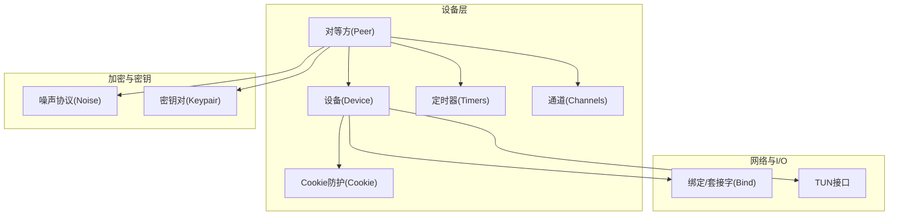
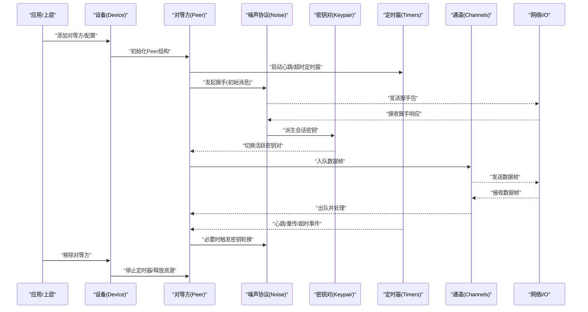
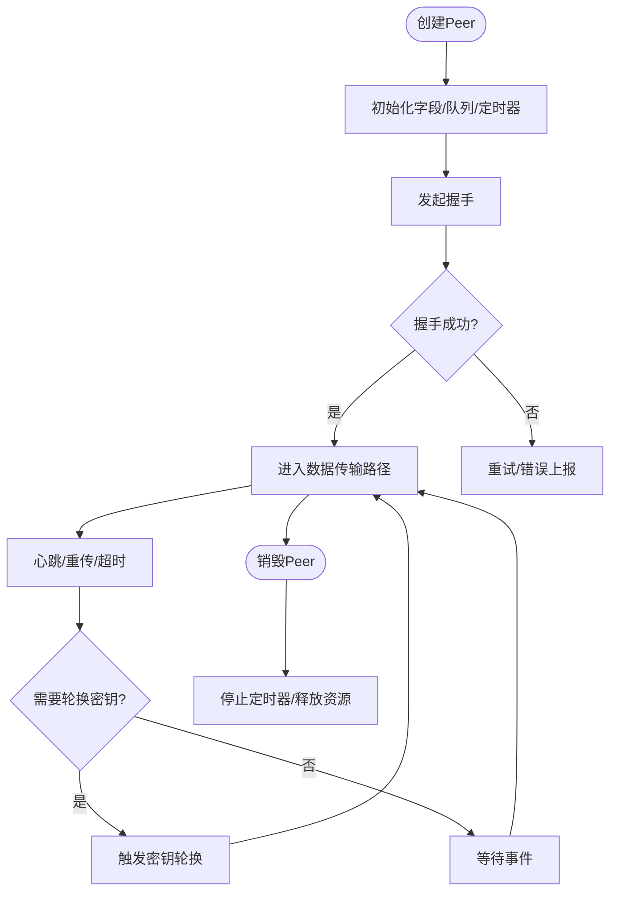
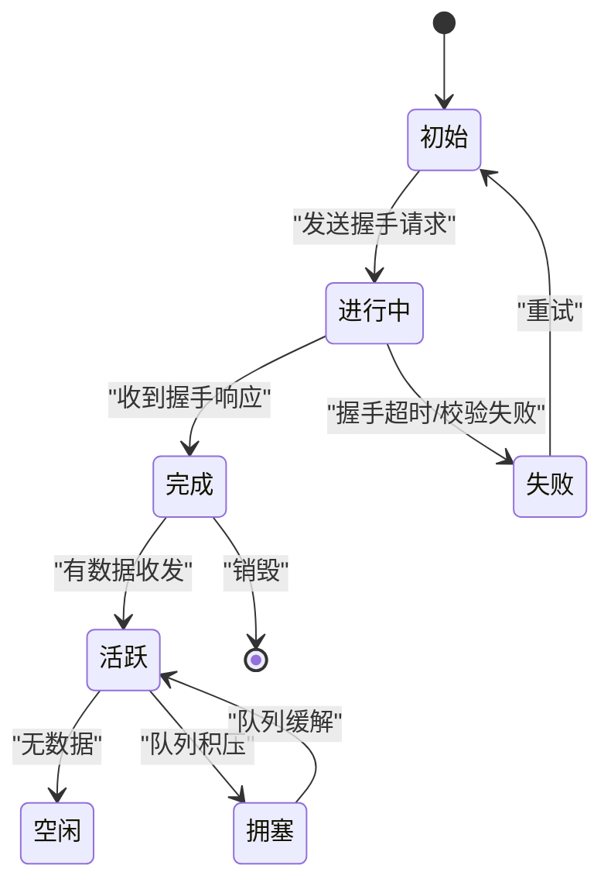
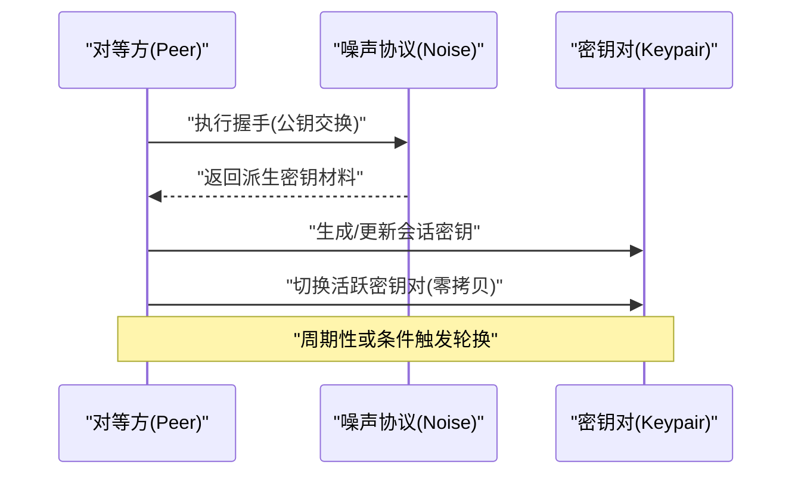
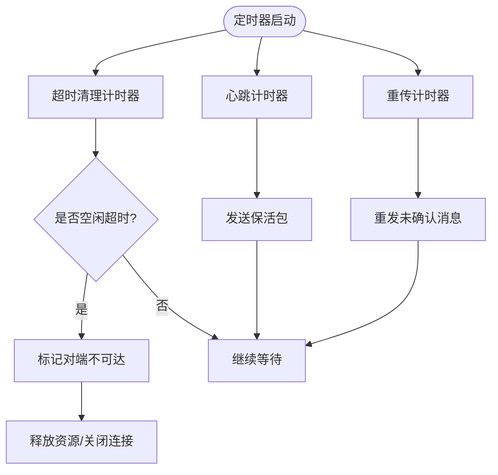
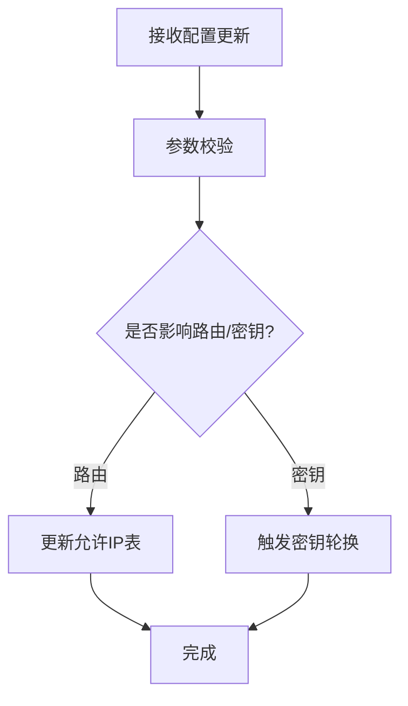
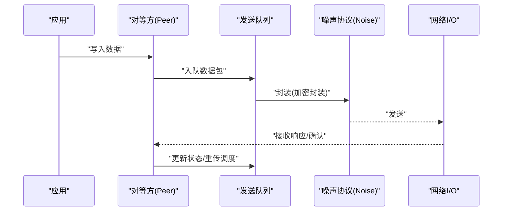
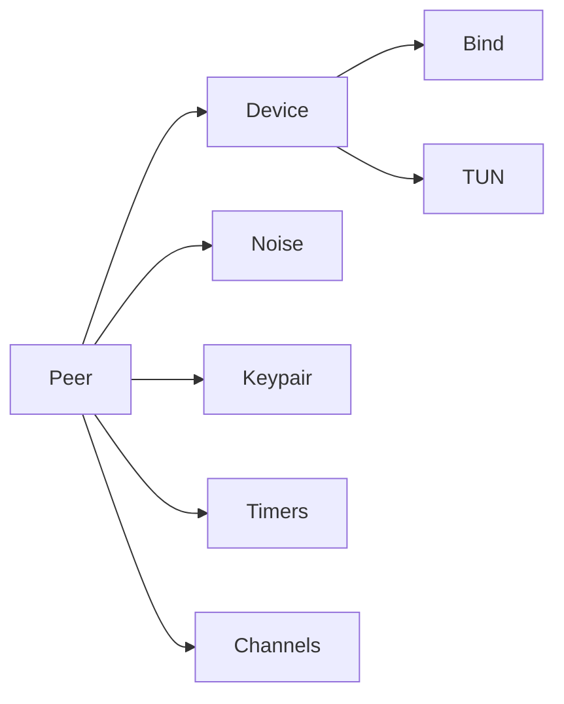

# 对等方管理

<cite>
**本文引用的文件**
- [device/peer.go](file://device/peer.go)
- [device/device.go](file://device/device.go)
- [device/timers.go](file://device/timers.go)
- [device/send.go](file://device/send.go)
- [device/receive.go](file://device/receive.go)
- [device/noise-protocol.go](file://device/noise-protocol.go)
- [device/keypair.go](file://device/keypair.go)
- [device/constants.go](file://device/constants.go)
- [device/channels.go](file://device/channels.go)
- [device/cookie.go](file://device/cookie.go)
</cite>

## 目录
1. [简介](#简介)
2. [项目结构](#项目结构)
3. [核心组件](#核心组件)
4. [架构总览](#架构总览)
5. [详细组件分析](#详细组件分析)
6. [依赖关系分析](#依赖关系分析)
7. [性能考量](#性能考量)
8. [故障排除指南](#故障排除指南)
9. [结论](#结论)
10. [附录：API与使用示例](#附录api与使用示例)

## 简介
本文件聚焦于 wireguard-go 中对等方（Peer）管理的完整生命周期与实现细节，涵盖对等方的建立、维护与销毁；握手状态机、数据传输状态与超时处理；密钥管理机制（公钥交换、会话密钥生成与轮换）；定时器系统（心跳检测、重传与超时清理）；以及配置更新与动态调整。文档同时提供面向使用者的 API 使用示例与故障排除建议，帮助读者快速理解并正确使用对等方管理功能。

## 项目结构
wireguard-go 的对等方管理主要位于 device 子模块中，围绕设备（Device）、对等方（Peer）、噪声协议（Noise Protocol）、密钥对（Keypair）、收发通道（Channels）、定时器（Timers）等模块协同工作。整体组织遵循“按职责分层”的方式：网络 I/O 抽象在 conn 层，隧道接口在 tun 层，核心逻辑集中在 device 层。

图表来源
- [device/device.go:1-200](file://device/device.go#L1-L200)
- [device/peer.go:1-200](file://device/peer.go#L1-L200)
- [device/timers.go:1-200](file://device/timers.go#L1-L200)
- [device/channels.go:1-200](file://device/channels.go#L1-L200)
- [device/noise-protocol.go:1-200](file://device/noise-protocol.go#L1-L200)
- [device/keypair.go:1-200](file://device/keypair.go#L1-L200)
- [device/cookie.go:1-200](file://device/cookie.go#L1-L200)

章节来源
- [device/device.go:1-200](file://device/device.go#L1-L200)
- [device/peer.go:1-200](file://device/peer.go#L1-L200)

## 核心组件
- 对等方（Peer）：表示一个远端节点的生命周期对象，持有其状态、定时器、密钥对、发送/接收队列、端点信息等。
- 设备（Device）：管理多个对等方，协调握手、数据转发、资源回收与全局配置。
- 噪声协议（Noise）：负责握手流程、消息封装与解密、密钥派生。
- 密钥对（Keypair）：当前与下一轮会话的对称密钥材料，支持零拷贝切换。
- 定时器（Timers）：心跳、重传、超时清理等时间驱动任务。
- 通道（Channels）：内部消息队列，解耦收发路径。
- Cookie：防重放与抗 DoS 的令牌机制。

章节来源
- [device/peer.go:1-200](file://device/peer.go#L1-L200)
- [device/device.go:1-200](file://device/device.go#L1-L200)
- [device/noise-protocol.go:1-200](file://device/noise-protocol.go#L1-L200)
- [device/keypair.go:1-200](file://device/keypair.go#L1-L200)
- [device/timers.go:1-200](file://device/timers.go#L1-L200)
- [device/channels.go:1-200](file://device/channels.go#L1-L200)
- [device/cookie.go:1-200](file://device/cookie.go#L1-L200)

## 架构总览
下图展示了对等方从创建到销毁的关键交互，包括握手、数据收发、密钥轮换与定时器触发。

图表来源
- [device/device.go:1-200](file://device/device.go#L1-L200)
- [device/peer.go:1-200](file://device/peer.go#L1-L200)
- [device/noise-protocol.go:1-200](file://device/noise-protocol.go#L1-L200)
- [device/keypair.go:1-200](file://device/keypair.go#L1-L200)
- [device/timers.go:1-200](file://device/timers.go#L1-L200)
- [device/channels.go:1-200](file://device/channels.go#L1-L200)

## 详细组件分析

### 对等方（Peer）结构与生命周期
- 设计要点
  - 持有对端公钥、端点、允许IP集合、发送/接收队列、定时器句柄、当前与下一轮密钥对、握手状态等。
  - 通过设备提供的通道进行消息传递，避免直接耦合网络栈。
  - 生命周期由设备统一管理：创建时注册、运行时维护、销毁时清理。
- 关键流程
  - 建立：设备根据配置创建 Peer，初始化定时器与通道，开始握手。
  - 维护：定时器驱动心跳与重传；收发包路径更新状态与统计。
  - 销毁：停止所有定时器，清空队列，释放密钥与内存。

图表来源
- [device/peer.go:1-200](file://device/peer.go#L1-L200)
- [device/timers.go:1-200](file://device/timers.go#L1-L200)
- [device/noise-protocol.go:1-200](file://device/noise-protocol.go#L1-L200)

章节来源
- [device/peer.go:1-200](file://device/peer.go#L1-L200)

### 握手状态机与数据传输状态
- 握手状态
  - 初始：未开始或等待首次握手消息。
  - 进行中：已发送握手请求，等待响应。
  - 完成：握手成功，会话密钥可用。
  - 失败：握手失败，需重试或上报错误。
- 数据传输状态
  - 空闲：无活动数据。
  - 活跃：有数据正在发送/接收。
  - 拥塞：队列积压，触发限速或丢弃策略。
- 超时处理
  - 握手超时：重置状态并重试。
  - 数据包超时：丢弃或触发重传。
  - 心跳超时：判定对端不可达，标记为断开。

图表来源
- [device/noise-protocol.go:1-200](file://device/noise-protocol.go#L1-L200)
- [device/peer.go:1-200](file://device/peer.go#L1-L200)

章节来源
- [device/noise-protocol.go:1-200](file://device/noise-protocol.go#L1-L200)
- [device/peer.go:1-200](file://device/peer.go#L1-L200)

### 密钥管理机制（公钥交换、会话密钥生成与轮换）
- 公钥交换
  - 基于噪声协议进行身份认证与密钥协商，确保前向保密与后向保密。
- 会话密钥生成
  - 握手完成后派生出对称密钥，用于后续数据包的加密封装与解密。
- 密钥轮换
  - 定期或在达到阈值时触发轮换，生成新密钥对并无缝切换，保证长期安全性。
- 安全属性
  - 零拷贝切换减少开销。
  - 旧密钥在窗口期内保留以兼容延迟到达的数据包。

图表来源
- [device/noise-protocol.go:1-200](file://device/noise-protocol.go#L1-L200)
- [device/keypair.go:1-200](file://device/keypair.go#L1-L200)

章节来源
- [device/noise-protocol.go:1-200](file://device/noise-protocol.go#L1-L200)
- [device/keypair.go:1-200](file://device/keypair.go#L1-L200)

### 定时器系统（心跳检测、重传机制、超时清理）
- 心跳检测
  - 周期性发送保活消息，维持连接活性。
- 重传机制
  - 对未确认的握手或控制消息设置重传计时器，避免单点丢失导致失败。
- 超时清理
  - 长时间无活动的对等方将被标记并清理资源，防止内存泄漏。

图表来源
- [device/timers.go:1-200](file://device/timers.go#L1-L200)
- [device/peer.go:1-200](file://device/peer.go#L1-L200)

章节来源
- [device/timers.go:1-200](file://device/timers.go#L1-L200)
- [device/peer.go:1-200](file://device/peer.go#L1-L200)

### 配置更新与动态调整
- 动态更新
  - 允许运行时修改对等方的允许IP列表、端点、密钥等配置。
- 一致性保障
  - 更新操作需原子化，避免中间态导致的乱序或丢包。
- 影响范围
  - 路由表（允许IP）更新后立即生效。
  - 密钥更新需配合握手与轮换流程。

图表来源
- [device/device.go:1-200](file://device/device.go#L1-L200)
- [device/peer.go:1-200](file://device/peer.go#L1-L200)

章节来源
- [device/device.go:1-200](file://device/device.go#L1-L200)
- [device/peer.go:1-200](file://device/peer.go#L1-L200)

### 发送与接收路径（数据流）
- 发送路径
  - 应用数据入队 -> 选择活跃密钥对 -> 封装并发送 -> 记录序列号与重传计时。
- 接收路径
  - 接收数据包 -> 验证序列号与重放保护 -> 解密 -> 出队并交付上层。
- 反压与限流
  - 队列满时触发限速或丢弃策略，避免内存爆炸。

图表来源
- [device/send.go:1-200](file://device/send.go#L1-L200)
- [device/receive.go:1-200](file://device/receive.go#L1-L200)
- [device/channels.go:1-200](file://device/channels.go#L1-L200)

章节来源
- [device/send.go:1-200](file://device/send.go#L1-L200)
- [device/receive.go:1-200](file://device/receive.go#L1-L200)
- [device/channels.go:1-200](file://device/channels.go#L1-L200)

## 依赖关系分析
- 组件耦合
  - Peer 依赖 Device 进行生命周期管理与全局配置。
  - Peer 依赖 Noise 进行握手与加解密。
  - Peer 依赖 Keypair 进行密钥切换。
  - Peer 依赖 Timers 进行时间驱动任务。
  - Peer 依赖 Channels 进行内部消息传递。
- 外部依赖
  - 网络 I/O 通过 bind 层抽象。
  - 隧道接口通过 tun 层抽象。
- 潜在循环依赖
  - 通过通道与事件模型解耦，降低循环依赖风险。

图表来源
- [device/peer.go:1-200](file://device/peer.go#L1-L200)
- [device/device.go:1-200](file://device/device.go#L1-L200)

章节来源
- [device/peer.go:1-200](file://device/peer.go#L1-L200)
- [device/device.go:1-200](file://device/device.go#L1-L200)

## 性能考量
- 零拷贝密钥切换：减少内存复制，提升吞吐。
- 队列与缓冲：合理设置队列大小与阈值，避免拥塞。
- 定时器粒度：心跳与重传间隔需平衡可靠性与开销。
- 并发模型：收/发路径分离，减少锁竞争。
- 资源回收：及时清理空闲对等方与过期密钥，防止内存泄漏。

[本节为通用指导，不直接分析具体文件]

## 故障排除指南
- 握手失败
  - 检查对端公钥与端点配置是否正确。
  - 查看握手超时日志，确认网络连通性与防火墙规则。
  - 确认 Cookie 机制未被误拦截。
- 数据不通
  - 检查允许IP列表是否包含目标地址。
  - 观察发送/接收队列长度，排查拥塞。
  - 确认密钥轮换是否正常，避免新旧密钥不一致。
- 频繁断连
  - 调整心跳间隔与超时阈值。
  - 检查网络抖动与丢包率。
  - 查看定时器是否被系统调度异常影响。

章节来源
- [device/cookie.go:1-200](file://device/cookie.go#L1-L200)
- [device/timers.go:1-200](file://device/timers.go#L1-L200)
- [device/peer.go:1-200](file://device/peer.go#L1-L200)

## 结论
wireguard-go 的对等方管理以 Peer 为核心，结合噪声协议、密钥对、定时器与通道，实现了高可靠、高性能且安全的对端通信。通过清晰的状态机、严格的超时处理与灵活的配置更新能力，系统能够在复杂网络环境下保持稳定运行。使用者应关注握手与密钥轮换的正确性，合理调优定时器与队列参数，以获得最佳性能与稳定性。

[本节为总结，不直接分析具体文件]

## 附录：API与使用示例
- 常见操作
  - 添加对等方：传入对端公钥、端点与允许IP列表，设备将创建并启动握手。
  - 更新配置：动态修改允许IP或端点，系统将立即生效。
  - 移除对等方：停止定时器并释放资源。
- 示例流程
  - 初始化设备 -> 添加对等方 -> 等待握手完成 -> 发送数据 -> 监控状态 -> 移除对等方。
- 注意事项
  - 确保对端公钥正确且匹配。
  - 合理设置超时与重传参数。
  - 监控队列与定时器状态，避免资源耗尽。

章节来源
- [device/device.go:1-200](file://device/device.go#L1-L200)
- [device/peer.go:1-200](file://device/peer.go#L1-L200)
- [device/timers.go:1-200](file://device/timers.go#L1-L200)