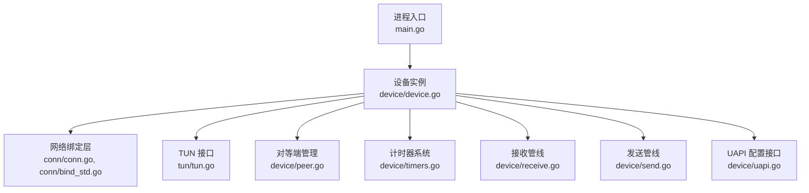
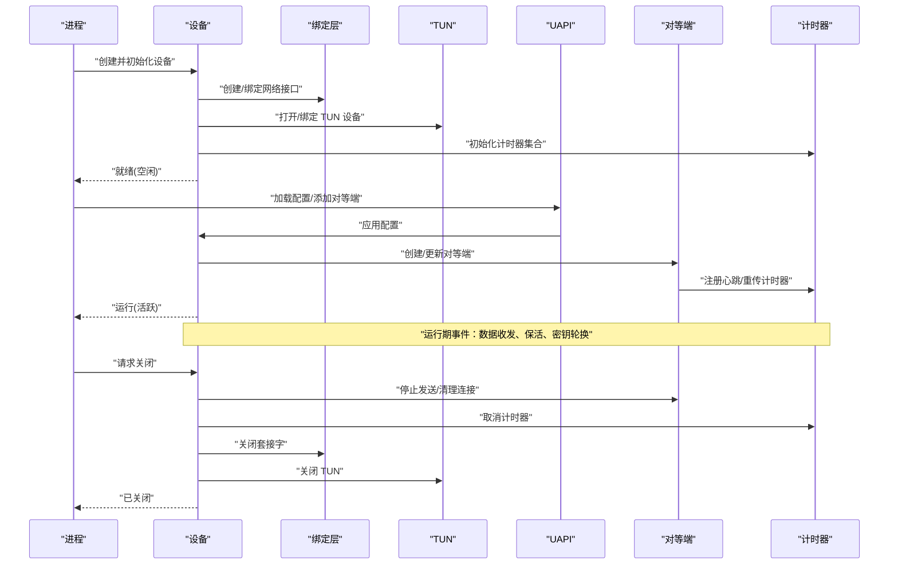
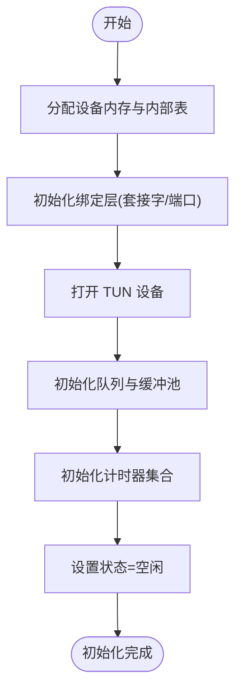
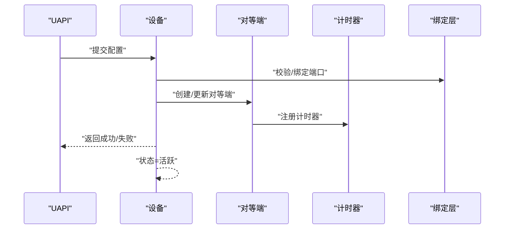
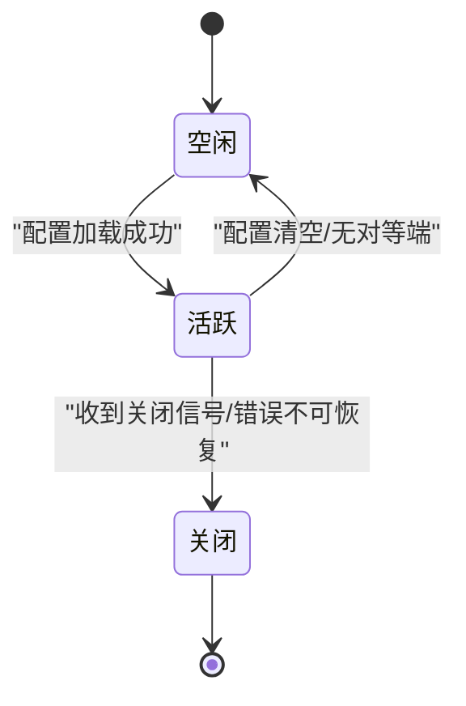
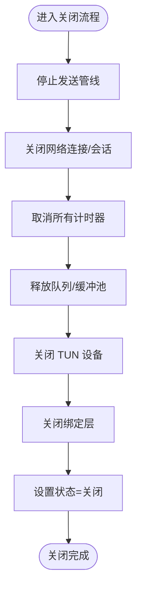
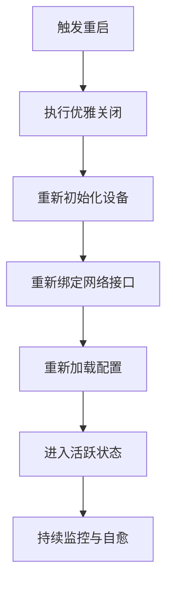
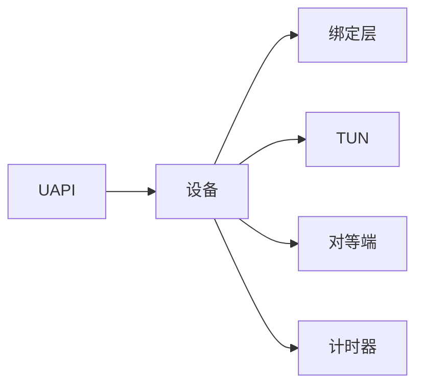

# 设备生命周期管理

<cite>
**本文引用的文件**
- [device/device.go](file://device/device.go)
- [device/timers.go](file://device/timers.go)
- [device/peer.go](file://device/peer.go)
- [device/receive.go](file://device/receive.go)
- [device/send.go](file://device/send.go)
- [device/uapi.go](file://device/uapi.go)
- [conn/conn.go](file://conn/conn.go)
- [conn/bind_std.go](file://conn/bind_std.go)
- [tun/tun.go](file://tun/tun.go)
- [main.go](file://main.go)
</cite>

## 目录
1. [简介](#简介)
2. [项目结构](#项目结构)
3. [核心组件](#核心组件)
4. [架构总览](#架构总览)
5. [详细组件分析](#详细组件分析)
6. [依赖关系分析](#依赖关系分析)
7. [性能考虑](#性能考虑)
8. [故障排查指南](#故障排查指南)
9. [结论](#结论)
10. [附录](#附录)

## 简介
本文件聚焦于 wireguard-go 中“设备”的生命周期管理，围绕 Device 结构体的初始化、启动、运行状态机、优雅关闭与重启、错误恢复策略以及监控诊断方法展开。文档以代码级为依据，结合时序图、流程图和类图帮助读者理解从进程入口到内核 TUN/TAP 接口、网络绑定层、对等端管理与计时器系统的完整链路。

## 项目结构
设备生命周期涉及以下关键模块：
- 设备核心：device/device.go（设备主体、生命周期控制）
- 定时器：device/timers.go（各类超时与重传计时器）
- 对等端：device/peer.go（对等端状态、密钥轮换、发送/接收调度）
- 收发管线：device/receive.go、device/send.go（数据包处理流水线）
- UAPI：device/uapi.go（配置加载、运行时变更）
- 网络绑定：conn/conn.go、conn/bind_std.go（套接字绑定、端口复用）
- TUN 接口：tun/tun.go（系统 TUN/TAP 抽象）
- 进程入口：main.go（启动流程编排）

图表来源
- [main.go:1-200](file://main.go#L1-L200)
- [device/device.go:1-300](file://device/device.go#L1-L300)
- [conn/conn.go:1-200](file://conn/conn.go#L1-L200)
- [conn/bind_std.go:1-200](file://conn/bind_std.go#L1-L200)
- [tun/tun.go:1-200](file://tun/tun.go#L1-L200)
- [device/timers.go:1-200](file://device/timers.go#L1-L200)
- [device/peer.go:1-200](file://device/peer.go#L1-L200)
- [device/receive.go:1-200](file://device/receive.go#L1-L200)
- [device/send.go:1-200](file://device/send.go#L1-L200)
- [device/uapi.go:1-200](file://device/uapi.go#L1-L200)

章节来源
- [main.go:1-200](file://main.go#L1-L200)
- [device/device.go:1-300](file://device/device.go#L1-L300)

## 核心组件
- 设备（Device）：封装了所有对等端、密钥对、索引表、队列、计时器、绑定句柄与 TUN 句柄，是生命周期的中心。
- 对等端（Peer）：维护单个远端的会话状态、密钥对、发送/接收队列、定时器等。
- 绑定层（Bind）：负责 UDP/TCP 套接字创建、端口绑定、多路复用、GSO/标记等特性。
- TUN 接口：提供内核隧道读写能力。
- 计时器：实现心跳、重传、密钥轮换、保活等时间驱动行为。
- UAPI：提供动态配置与运行时查询接口。

章节来源
- [device/device.go:1-300](file://device/device.go#L1-L300)
- [device/peer.go:1-200](file://device/peer.go#L1-L200)
- [conn/conn.go:1-200](file://conn/conn.go#L1-L200)
- [tun/tun.go:1-200](file://tun/tun.go#L1-L200)
- [device/timers.go:1-200](file://device/timers.go#L1-L200)
- [device/uapi.go:1-200](file://device/uapi.go#L1-L200)

## 架构总览
下图展示了设备生命周期在进程中的主要交互路径：进程入口创建并启动设备；设备初始化时分配内存、准备资源（绑定、TUN、队列、计时器），进入空闲态；通过 UAPI 加载配置后进入活跃态；运行期间周期性执行保活、重传、密钥轮换；收到关闭信号或主动关闭时进入关闭流程，清理连接、释放资源、同步状态。

图表来源
- [main.go:1-200](file://main.go#L1-L200)
- [device/device.go:1-300](file://device/device.go#L1-L300)
- [device/uapi.go:1-200](file://device/uapi.go#L1-L200)
- [device/peer.go:1-200](file://device/peer.go#L1-L200)
- [device/timers.go:1-200](file://device/timers.go#L1-L200)
- [conn/conn.go:1-200](file://conn/conn.go#L1-L200)
- [tun/tun.go:1-200](file://tun/tun.go#L1-L200)

## 详细组件分析

### 设备初始化与资源准备
- 内存分配与对象构造：设备在创建时分配内部数据结构（对等端表、索引表、队列、锁、原子状态等）。
- 资源准备：
  - 绑定层：创建/绑定 UDP/TCP 套接字，启用必要特性（如 GSO、标记、粘滞路由等）。
  - TUN：打开系统 TUN 设备，建立读写通道。
  - 队列与池：初始化发送/接收队列、缓冲区池，降低 GC 压力。
  - 计时器：初始化心跳、重传、保活、密钥轮换等计时器容器。
- 状态设置：初始状态为“空闲”，等待配置加载后转为“活跃”。

图表来源
- [device/device.go:1-300](file://device/device.go#L1-L300)
- [conn/conn.go:1-200](file://conn/conn.go#L1-L200)
- [tun/tun.go:1-200](file://tun/tun.go#L1-L200)
- [device/timers.go:1-200](file://device/timers.go#L1-L200)

章节来源
- [device/device.go:1-300](file://device/device.go#L1-L300)
- [conn/bind_std.go:1-200](file://conn/bind_std.go#L1-L200)
- [tun/tun.go:1-200](file://tun/tun.go#L1-L200)
- [device/timers.go:1-200](file://device/timers.go#L1-L200)

### 启动流程：配置加载、网络绑定与定时器初始化
- 配置加载：通过 UAPI 接口读取配置，解析对等端、公钥、允许 IP、持久保持等参数。
- 网络绑定：根据配置选择监听地址/端口，必要时进行端口复用与防火墙标记。
- 定时器初始化：为每个对等端注册心跳、重传、保活、密钥轮换等计时器。
- 状态转换：配置应用成功后，设备从“空闲”切换到“活跃”。

图表来源
- [device/uapi.go:1-200](file://device/uapi.go#L1-L200)
- [device/device.go:1-300](file://device/device.go#L1-L300)
- [device/peer.go:1-200](file://device/peer.go#L1-L200)
- [device/timers.go:1-200](file://device/timers.go#L1-L200)
- [conn/conn.go:1-200](file://conn/conn.go#L1-L200)

章节来源
- [device/uapi.go:1-200](file://device/uapi.go#L1-L200)
- [device/device.go:1-300](file://device/device.go#L1-L300)

### 运行状态机：空闲、活跃、关闭
设备在生命周期内经历如下状态转换：
- 空闲：初始化完成，等待配置。
- 活跃：配置已加载，收发管线工作，计时器运行。
- 关闭：收到关闭信号或异常退出，逐步清理资源。

图表来源
- [device/device.go:1-300](file://device/device.go#L1-L300)

章节来源
- [device/device.go:1-300](file://device/device.go#L1-L300)

### 优雅关闭机制：连接清理、资源释放与状态同步
- 连接清理：停止对等端发送，断开/重置网络连接，清理会话与密钥缓存。
- 资源释放：关闭 TUN 设备、释放绑定层套接字、回收队列与缓冲池。
- 状态同步：将设备状态置为“关闭”，通知各子系统停止工作，确保无悬挂 goroutine。
- 幂等性：关闭操作应支持多次调用且不会重复释放资源。

图表来源
- [device/device.go:1-300](file://device/device.go#L1-L300)
- [device/peer.go:1-200](file://device/peer.go#L1-L200)
- [device/timers.go:1-200](file://device/timers.go#L1-L200)
- [conn/conn.go:1-200](file://conn/conn.go#L1-L200)
- [tun/tun.go:1-200](file://tun/tun.go#L1-L200)

章节来源
- [device/device.go:1-300](file://device/device.go#L1-L300)
- [device/peer.go:1-200](file://device/peer.go#L1-L200)
- [device/timers.go:1-200](file://device/timers.go#L1-L200)

### 设备重启流程与错误恢复策略
- 重启流程：
  - 触发条件：配置变更、网络不可用、对等端长时间无响应等。
  - 步骤：先执行优雅关闭，再重新初始化设备、绑定网络、加载新配置。
- 错误恢复：
  - 可恢复错误：网络抖动、临时 DNS 解析失败、对端未可达——重试与退避。
  - 不可恢复错误：权限不足、端口占用、TUN 设备不存在——记录日志并终止进程。
  - 一致性保障：在切换密钥、更新对等端时采用原子替换与版本控制，避免中间态不一致。

图表来源
- [device/device.go:1-300](file://device/device.go#L1-L300)
- [device/uapi.go:1-200](file://device/uapi.go#L1-L200)
- [conn/conn.go:1-200](file://conn/conn.go#L1-L200)

章节来源
- [device/device.go:1-300](file://device/device.go#L1-L300)
- [device/uapi.go:1-200](file://device/uapi.go#L1-L200)

### 监控与诊断方法
- 指标采集：
  - 对等端状态、最近握手时间、发送/接收字节数、丢包率、重传次数。
  - 计时器统计：心跳超时、重传计数、保活间隔。
  - 资源使用：队列长度、缓冲池大小、goroutine 数量。
- 诊断手段：
  - 通过 UAPI 查询设备与对等端信息。
  - 观察日志关键字：握手失败、重传超限、绑定失败、TUN 读写错误。
  - 抓包分析：在绑定端口侧捕获加密流量，验证握手与数据流。
- 健康检查：
  - 周期性 ping/保活探测，超过阈值触发告警或自动重启。
  - 基于指标阈值的自愈策略：自动重试、回退旧密钥、切换备用接口。

章节来源
- [device/uapi.go:1-200](file://device/uapi.go#L1-L200)
- [device/device.go:1-300](file://device/device.go#L1-L300)
- [device/peer.go:1-200](file://device/peer.go#L1-L200)
- [device/timers.go:1-200](file://device/timers.go#L1-L200)

## 依赖关系分析
设备与其子系统的依赖关系如下：
- 设备依赖绑定层进行网络通信。
- 设备依赖 TUN 进行内核隧道数据交换。
- 设备依赖对等端管理会话与密钥。
- 设备依赖计时器驱动保活与重传。
- UAPI 作为外部配置入口，影响设备状态与对等端集合。

图表来源
- [device/device.go:1-300](file://device/device.go#L1-L300)
- [conn/conn.go:1-200](file://conn/conn.go#L1-L200)
- [tun/tun.go:1-200](file://tun/tun.go#L1-L200)
- [device/peer.go:1-200](file://device/peer.go#L1-L200)
- [device/timers.go:1-200](file://device/timers.go#L1-L200)
- [device/uapi.go:1-200](file://device/uapi.go#L1-L200)

章节来源
- [device/device.go:1-300](file://device/device.go#L1-L300)

## 性能考虑
- 队列与缓冲池：预分配与复用减少 GC 压力，提升吞吐。
- 零拷贝优化：尽可能利用系统提供的 GSO/TSO 能力。
- 计时器粒度：合理设置保活与重传间隔，平衡延迟与带宽。
- 并发模型：对等端独立调度，避免热点竞争。
- 内存占用：限制最大对等端数量与队列深度，防止内存泄漏。

[本节为通用指导，不直接分析具体文件]

## 故障排查指南
- 常见问题：
  - 绑定失败：端口被占用、权限不足、IPv6 不支持。
  - TUN 错误：设备不存在、权限不足、内核模块未加载。
  - 握手失败：密钥不匹配、NAT 穿透问题、防火墙拦截。
  - 重传过多：网络质量差、MTU 过大、对端离线。
- 定位步骤：
  - 查看 UAPI 输出，确认对等端状态与最近握手时间。
  - 检查日志中的错误码与堆栈，定位失败阶段。
  - 抓包验证握手报文与数据报文是否到达。
  - 调整 MTU、禁用/启用 GSO、切换 IPv4/IPv6 测试。
- 恢复建议：
  - 重启设备或仅重启受影响的对等端。
  - 更新密钥与配置，确保两端一致。
  - 增加重传上限与退避策略，提高鲁棒性。

章节来源
- [device/device.go:1-300](file://device/device.go#L1-L300)
- [device/uapi.go:1-200](file://device/uapi.go#L1-L200)
- [conn/conn.go:1-200](file://conn/conn.go#L1-L200)
- [tun/tun.go:1-200](file://tun/tun.go#L1-L200)

## 结论
设备生命周期管理围绕“初始化—启动—运行—关闭—重启”的闭环展开。通过清晰的职责划分（设备、对等端、绑定层、TUN、计时器、UAPI）与严格的资源管理（队列、缓冲池、计时器、连接），wireguard-go 实现了高效、可靠且可观测的隧道服务。建议在部署中结合 UAPI 监控与日志分析，制定自动化自愈策略，以提升整体稳定性。

[本节为总结，不直接分析具体文件]

## 附录
- 术语：
  - 对等端：远端 WireGuard 节点。
  - 绑定层：负责网络套接字创建与复用的抽象层。
  - TUN：内核虚拟网络接口，用于隧道数据转发。
  - UAPI：用户空间 API，用于配置与查询。
- 参考路径：
  - 设备核心：[device/device.go](file://device/device.go)
  - 定时器：[device/timers.go](file://device/timers.go)
  - 对等端：[device/peer.go](file://device/peer.go)
  - 收发管线：[device/receive.go](file://device/receive.go)、[device/send.go](file://device/send.go)
  - UAPI：[device/uapi.go](file://device/uapi.go)
  - 绑定层：[conn/conn.go](file://conn/conn.go)、[conn/bind_std.go](file://conn/bind_std.go)
  - TUN：[tun/tun.go](file://tun/tun.go)
  - 进程入口：[main.go](file://main.go)

[本节为附录，不直接分析具体文件]