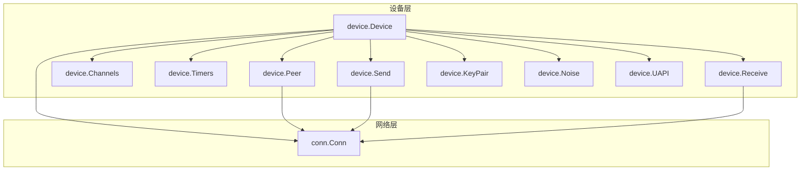
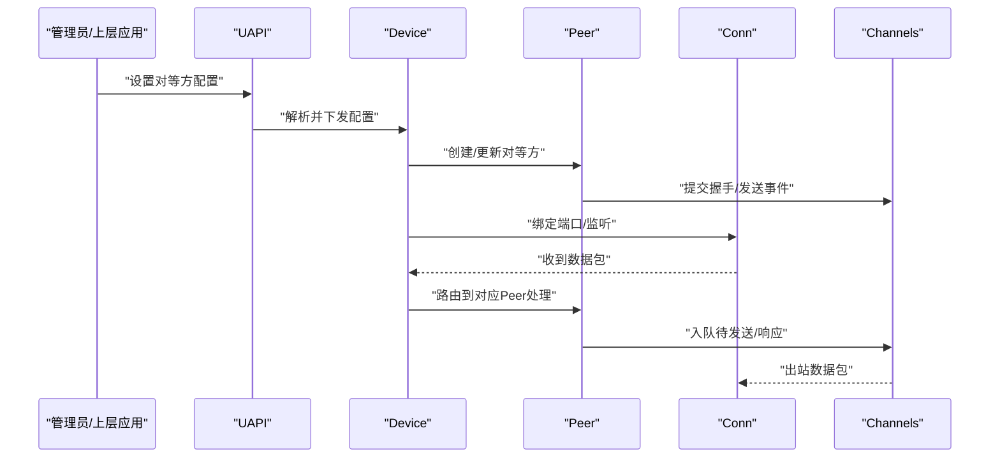
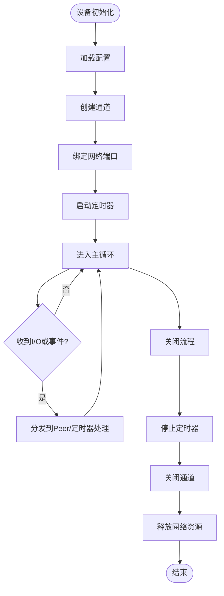
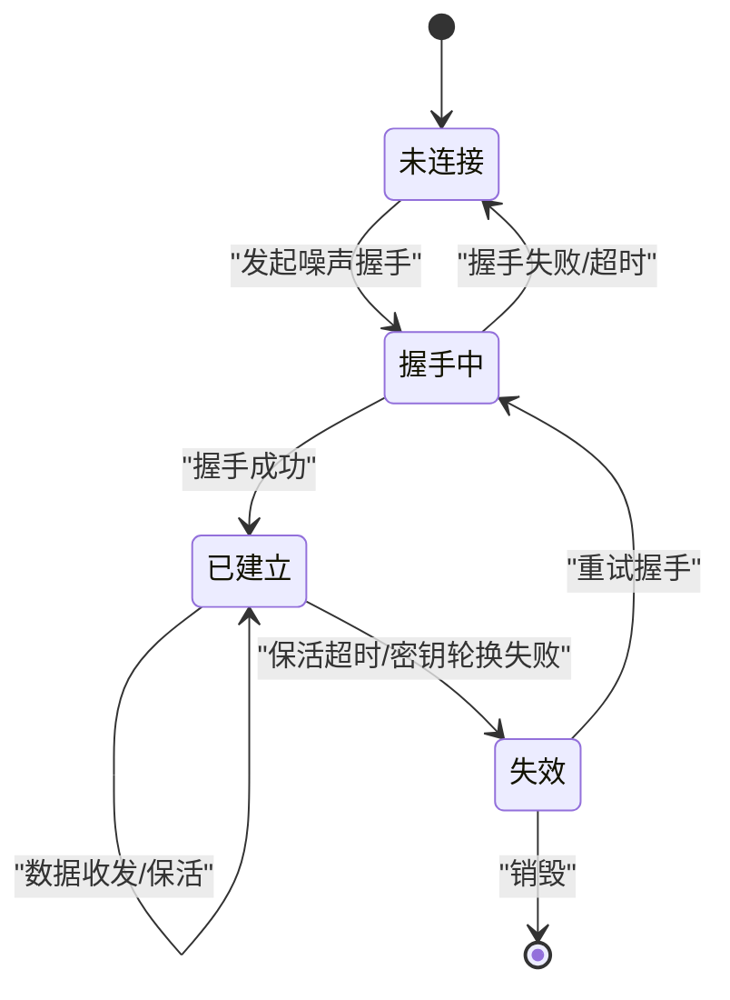
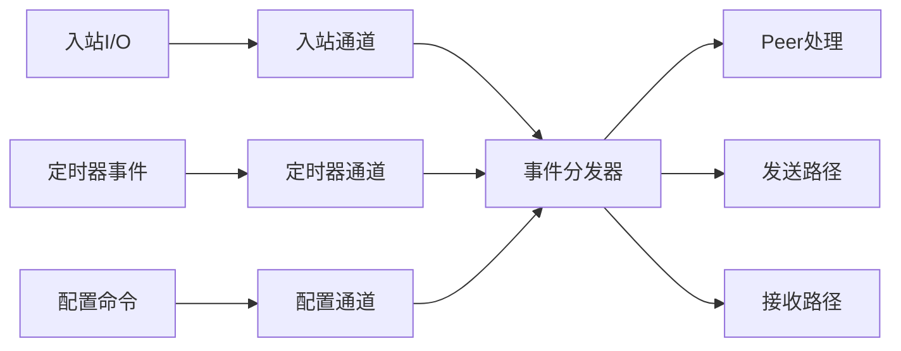
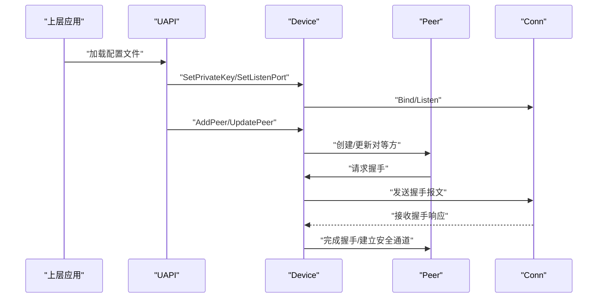
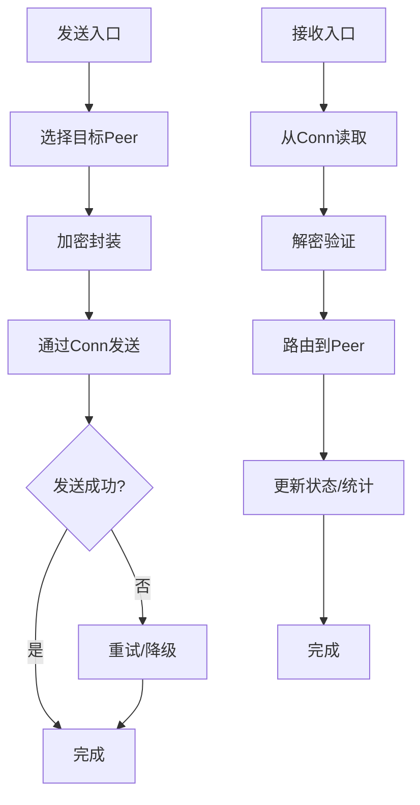
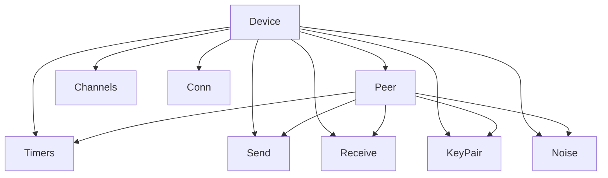

# 设备管理

<cite>
**本文引用的文件**
- [device/device.go](file://device/device.go)
- [device/peer.go](file://device/peer.go)
- [device/channels.go](file://device/channels.go)
- [device/constants.go](file://device/constants.go)
- [device/timers.go](file://device/timers.go)
- [device/send.go](file://device/send.go)
- [device/receive.go](file://device/receive.go)
- [device/keypair.go](file://device/keypair.go)
- [device/noise-protocol.go](file://device/noise-protocol.go)
- [device/uapi.go](file://device/uapi.go)
- [conn/conn.go](file://conn/conn.go)
</cite>

## 目录
1. [简介](#简介)
2. [项目结构](#项目结构)
3. [核心组件](#核心组件)
4. [架构总览](#架构总览)
5. [详细组件分析](#详细组件分析)
6. [依赖关系分析](#依赖关系分析)
7. [性能考量](#性能考量)
8. [故障排查指南](#故障排查指南)
9. [结论](#结论)
10. [附录](#附录)

## 简介
本文件面向wireguard-go的设备管理模块，系统性阐述Device结构体的设计与实现、对等方（Peer）管理机制、通道（channels）在设备通信中的作用、设备初始化与配置加载流程、错误处理机制，以及API使用示例与最佳实践。文档以“从概念到代码”的方式组织，既帮助初学者快速上手，也为深入开发者提供可追溯的源码定位。

## 项目结构
设备管理相关代码主要位于device目录，围绕以下关键文件展开：
- device/device.go：设备主体结构与生命周期控制
- device/peer.go：对等方状态机与密钥交换、会话维护
- device/channels.go：设备内部消息通道与队列
- device/constants.go：常量定义（超时、队列大小等）
- device/timers.go：定时器管理（重传、保活、密钥轮换）
- device/send.go / receive.go：发送与接收路径
- device/keypair.go：密钥对与密钥派生
- device/noise-protocol.go：Noise协议封装
- device/uapi.go：用户态接口（UAPI）配置入口
- conn/conn.go：网络套接字抽象层

图表来源
- [device/device.go:1-200](file://device/device.go#L1-L200)
- [device/peer.go:1-200](file://device/peer.go#L1-L200)
- [device/channels.go:1-200](file://device/channels.go#L1-L200)
- [device/timers.go:1-200](file://device/timers.go#L1-L200)
- [device/send.go:1-200](file://device/send.go#L1-L200)
- [device/receive.go:1-200](file://device/receive.go#L1-L200)
- [device/keypair.go:1-200](file://device/keypair.go#L1-L200)
- [device/noise-protocol.go:1-200](file://device/noise-protocol.go#L1-L200)
- [device/uapi.go:1-200](file://device/uapi.go#L1-L200)
- [conn/conn.go:1-200](file://conn/conn.go#L1-L200)

章节来源
- [device/device.go:1-200](file://device/device.go#L1-L200)
- [device/peer.go:1-200](file://device/peer.go#L1-L200)
- [device/channels.go:1-200](file://device/channels.go#L1-L200)
- [device/constants.go:1-200](file://device/constants.go#L1-L200)
- [device/timers.go:1-200](file://device/timers.go#L1-L200)
- [device/send.go:1-200](file://device/send.go#L1-L200)
- [device/receive.go:1-200](file://device/receive.go#L1-L200)
- [device/keypair.go:1-200](file://device/keypair.go#L1-L200)
- [device/noise-protocol.go:1-200](file://device/noise-protocol.go#L1-L200)
- [device/uapi.go:1-200](file://device/uapi.go#L1-L200)
- [conn/conn.go:1-200](file://conn/conn.go#L1-L200)

## 核心组件
- Device：设备主结构体，负责全局资源、定时器、通道、对等方集合、网络绑定、日志与统计。
- Peer：对等方实体，包含身份、地址、状态机、密钥材料、计时器、发送/接收队列。
- Channels：设备内部消息通道，解耦收发、定时任务与对等方事件。
- Timers：基于时间的事件调度，用于重传、保活、密钥轮换等。
- Send/Receive：数据面路径，分别负责出站与入站的数据包处理。
- KeyPair/Noise：加密与握手协议支撑。
- UAPI：配置与查询接口，供外部进程动态更新设备和对等方配置。

章节来源
- [device/device.go:1-200](file://device/device.go#L1-L200)
- [device/peer.go:1-200](file://device/peer.go#L1-L200)
- [device/channels.go:1-200](file://device/channels.go#L1-L200)
- [device/timers.go:1-200](file://device/timers.go#L1-L200)
- [device/send.go:1-200](file://device/send.go#L1-L200)
- [device/receive.go:1-200](file://device/receive.go#L1-L200)
- [device/keypair.go:1-200](file://device/keypair.go#L1-L200)
- [device/noise-protocol.go:1-200](file://device/noise-protocol.go#L1-L200)
- [device/uapi.go:1-200](file://device/uapi.go#L1-L200)

## 架构总览
设备采用分层与事件驱动相结合的设计：
- 控制面：UAPI接收配置变更，触发对等方创建/更新/销毁；定时器驱动状态迁移。
- 数据面：Send/Receive通过Conn抽象与底层网络交互；Peer状态机决定是否允许转发。
- 通道：Channels作为内部消息总线，将网络I/O、定时器事件、配置命令解耦为事件流。

图表来源
- [device/uapi.go:1-200](file://device/uapi.go#L1-L200)
- [device/device.go:1-200](file://device/device.go#L1-L200)
- [device/peer.go:1-200](file://device/peer.go#L1-L200)
- [device/channels.go:1-200](file://device/channels.go#L1-L200)
- [conn/conn.go:1-200](file://conn/conn.go#L1-L200)

## 详细组件分析

### Device结构体与生命周期管理
- 设计要点
  - 集中管理对等方集合、定时器、通道、网络绑定、统计与日志。
  - 提供统一的初始化、启动、停止接口，确保资源有序分配与释放。
  - 通过通道将网络事件、定时器事件、配置事件统一调度。
- 生命周期
  - 初始化：加载配置、创建通道、注册定时器、绑定网络端口。
  - 运行：持续处理入站/出站数据，驱动对等方状态机。
  - 关闭：停止定时器、关闭通道、释放网络资源、清理对等方。
- 运行时状态
  - 监听端口、对等方列表、统计计数器、错误计数、日志级别等。

图表来源
- [device/device.go:1-200](file://device/device.go#L1-L200)
- [device/channels.go:1-200](file://device/channels.go#L1-L200)
- [device/timers.go:1-200](file://device/timers.go#L1-L200)
- [conn/conn.go:1-200](file://conn/conn.go#L1-L200)

章节来源
- [device/device.go:1-200](file://device/device.go#L1-L200)
- [device/channels.go:1-200](file://device/channels.go#L1-L200)
- [device/timers.go:1-200](file://device/timers.go#L1-L200)
- [conn/conn.go:1-200](file://conn/conn.go#L1-L200)

### Peer状态机与控制
- 状态机要点
  - 未连接/握手/已建立/失效等状态转换，由握手结果、保活超时、密钥轮换驱动。
  - 每个Peer拥有独立的定时器与队列，避免相互影响。
- 建立与维护
  - 通过UAPI配置创建Peer，触发噪声握手；成功后建立安全通道。
  - 保活定时器周期性探测，失败则回退至握手或标记失效。
- 销毁过程
  - 显式删除或超时回收，清理密钥、定时器、队列与网络资源。

图表来源
- [device/peer.go:1-200](file://device/peer.go#L1-L200)
- [device/timers.go:1-200](file://device/timers.go#L1-L200)
- [device/noise-protocol.go:1-200](file://device/noise-protocol.go#L1-L200)

章节来源
- [device/peer.go:1-200](file://device/peer.go#L1-L200)
- [device/timers.go:1-200](file://device/timers.go#L1-L200)
- [device/noise-protocol.go:1-200](file://device/noise-protocol.go#L1-L200)

### 通道（Channels）在设备通信中的作用
- 作用
  - 将网络I/O、定时器事件、配置命令转换为统一的事件流，降低耦合度。
  - 支持背压与限流，避免突发流量导致内存暴涨。
- 设计
  - 按方向或类型划分通道，如入站、出站、握手、定时器事件等。
  - 消费者模型：设备主循环消费通道事件，分发给相应处理器。
- 性能
  - 使用缓冲通道与对象池减少GC压力。
  - 批量处理与零拷贝优化提升吞吐。

图表来源
- [device/channels.go:1-200](file://device/channels.go#L1-L200)
- [device/device.go:1-200](file://device/device.go#L1-L200)
- [device/timers.go:1-200](file://device/timers.go#L1-L200)

章节来源
- [device/channels.go:1-200](file://device/channels.go#L1-L200)
- [device/device.go:1-200](file://device/device.go#L1-L200)

### 设备初始化流程与配置加载
- 初始化步骤
  - 解析配置（私钥、监听端口、对等方列表）。
  - 创建通道与定时器，绑定网络端口。
  - 启动主循环，开始处理事件。
- 配置加载
  - UAPI接收配置变更，校验参数合法性。
  - 增量更新对等方：新增、修改、删除。
  - 触发必要的握手或密钥轮换。
- 错误处理
  - 配置校验失败返回明确错误码。
  - 网络绑定失败记录日志并重试策略。
  - 对等方创建失败清理部分资源，避免泄漏。

图表来源
- [device/uapi.go:1-200](file://device/uapi.go#L1-L200)
- [device/device.go:1-200](file://device/device.go#L1-L200)
- [device/peer.go:1-200](file://device/peer.go#L1-L200)
- [conn/conn.go:1-200](file://conn/conn.go#L1-L200)

章节来源
- [device/uapi.go:1-200](file://device/uapi.go#L1-L200)
- [device/device.go:1-200](file://device/device.go#L1-L200)
- [device/peer.go:1-200](file://device/peer.go#L1-L200)
- [conn/conn.go:1-200](file://conn/conn.go#L1-L200)

### 发送与接收路径
- 发送路径
  - 从上层或Peer队列取出数据包，选择目标Peer与端点。
  - 进行序列号、窗口检查、加密封装后通过Conn发送。
  - 失败时记录错误并可能触发重传或状态回退。
- 接收路径
  - 从Conn读取原始报文，解密验证后交给Peer处理。
  - 根据源IP/端口路由到对应Peer，更新统计与状态。
  - 异常报文丢弃并记录错误。

图表来源
- [device/send.go:1-200](file://device/send.go#L1-L200)
- [device/receive.go:1-200](file://device/receive.go#L1-L200)
- [device/peer.go:1-200](file://device/peer.go#L1-L200)
- [conn/conn.go:1-200](file://conn/conn.go#L1-L200)

章节来源
- [device/send.go:1-200](file://device/send.go#L1-L200)
- [device/receive.go:1-200](file://device/receive.go#L1-L200)
- [device/peer.go:1-200](file://device/peer.go#L1-L200)
- [conn/conn.go:1-200](file://conn/conn.go#L1-L200)

### 错误处理机制
- 配置错误：参数校验失败立即返回，避免无效状态。
- 网络错误：记录错误码与上下文，必要时触发重试或告警。
- 握手失败：记录原因，回退到未连接或失效状态，等待重试。
- 资源泄漏防护：在错误分支中确保定时器、通道、网络句柄正确释放。

章节来源
- [device/device.go:1-200](file://device/device.go#L1-L200)
- [device/peer.go:1-200](file://device/peer.go#L1-L200)
- [device/uapi.go:1-200](file://device/uapi.go#L1-L200)

## 依赖关系分析
- 组件耦合
  - Device依赖Peer、Channels、Timers、Send/Receive、KeyPair/Noise、Conn。
  - Peer依赖Timers、Send/Receive、KeyPair/Noise。
  - Channels作为中间件，降低各组件直接耦合。
- 外部依赖
  - Conn抽象屏蔽平台差异，提供统一网络接口。
  - UAPI提供配置与查询能力，便于运维集成。

图表来源
- [device/device.go:1-200](file://device/device.go#L1-L200)
- [device/peer.go:1-200](file://device/peer.go#L1-L200)
- [device/channels.go:1-200](file://device/channels.go#L1-L200)
- [device/timers.go:1-200](file://device/timers.go#L1-L200)
- [device/send.go:1-200](file://device/send.go#L1-L200)
- [device/receive.go:1-200](file://device/receive.go#L1-L200)
- [device/keypair.go:1-200](file://device/keypair.go#L1-L200)
- [device/noise-protocol.go:1-200](file://device/noise-protocol.go#L1-L200)
- [conn/conn.go:1-200](file://conn/conn.go#L1-L200)

章节来源
- [device/device.go:1-200](file://device/device.go#L1-L200)
- [device/peer.go:1-200](file://device/peer.go#L1-L200)
- [device/channels.go:1-200](file://device/channels.go#L1-L200)
- [device/timers.go:1-200](file://device/timers.go#L1-L200)
- [device/send.go:1-200](file://device/send.go#L1-L200)
- [device/receive.go:1-200](file://device/receive.go#L1-L200)
- [device/keypair.go:1-200](file://device/keypair.go#L1-L200)
- [device/noise-protocol.go:1-200](file://device/noise-protocol.go#L1-L200)
- [conn/conn.go:1-200](file://conn/conn.go#L1-L200)

## 性能考量
- 通道与队列
  - 合理设置通道缓冲大小，平衡延迟与内存占用。
  - 使用对象池复用数据结构，减少GC压力。
- 定时器
  - 精细化调整保活与重传间隔，避免过多心跳或频繁重传。
- 数据面
  - 尽量零拷贝与批量处理，减少系统调用次数。
  - 针对高吞吐场景启用GSO/TSO等特性（平台支持时）。
- 统计与监控
  - 暴露关键指标（丢包率、握手失败率、队列长度），便于容量规划与问题定位。

[本节为通用性能建议，不直接分析具体文件]

## 故障排查指南
- 常见问题
  - 无法绑定端口：检查权限与端口占用，确认防火墙规则。
  - 握手失败：核对公钥/私钥匹配、NAT穿透、MTU设置。
  - 对等方频繁失效：检查保活间隔、网络抖动、时钟同步。
- 诊断步骤
  - 查看UAPI输出与日志，定位配置与状态。
  - 抓取网络报文，分析握手与数据面异常。
  - 检查通道与队列长度，评估背压与拥塞。
- 恢复策略
  - 重置对等方配置，触发重新握手。
  - 调整定时器与队列参数，缓解拥塞。
  - 重启设备服务，清理残留状态。

章节来源
- [device/uapi.go:1-200](file://device/uapi.go#L1-L200)
- [device/device.go:1-200](file://device/device.go#L1-L200)
- [device/peer.go:1-200](file://device/peer.go#L1-L200)

## 结论
设备管理模块以Device为核心，结合Peer状态机、Channels事件总线、Timers调度与Send/Receive数据面，实现了高内聚、低耦合的可扩展架构。通过UAPI进行配置管理，配合完善的错误处理与性能优化，能够满足生产环境的稳定性与吞吐需求。建议在部署时关注通道与定时器参数调优，并结合监控指标持续优化。

[本节为总结性内容，不直接分析具体文件]

## 附录
- API使用示例与最佳实践
  - 初始化设备：设置私钥与监听端口，启动设备。
  - 添加对等方：配置公钥、端点、允许的IP范围。
  - 更新配置：动态修改对等方参数，触发握手或密钥轮换。
  - 删除对等方：移除配置并清理资源。
  - 查询状态：获取对等方状态、统计信息、错误计数。
  - 最佳实践
    - 使用最小权限原则配置对等方访问范围。
    - 定期轮换密钥，缩短密钥有效期。
    - 监控通道与队列长度，及时扩容或限流。
    - 在NAT环境下合理设置保活间隔与超时阈值。

章节来源
- [device/uapi.go:1-200](file://device/uapi.go#L1-L200)
- [device/device.go:1-200](file://device/device.go#L1-L200)
- [device/peer.go:1-200](file://device/peer.go#L1-L200)