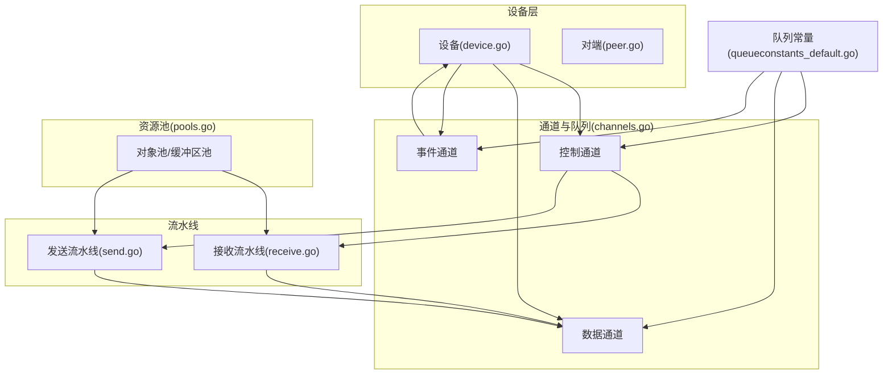
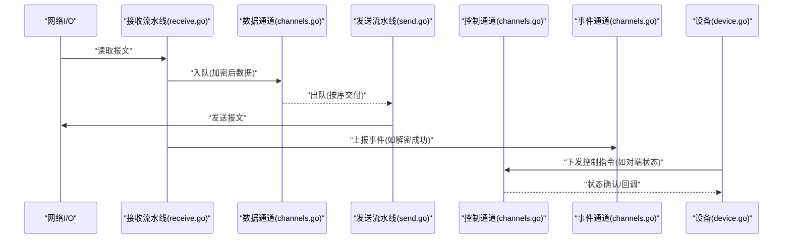
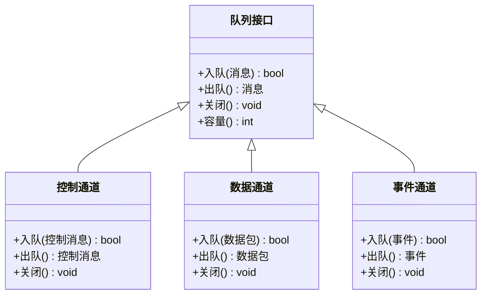
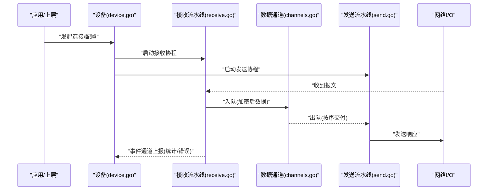
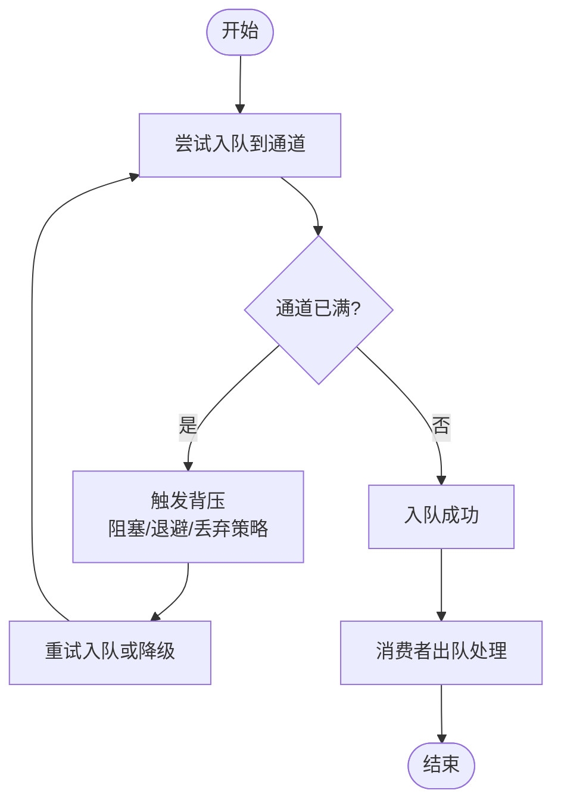
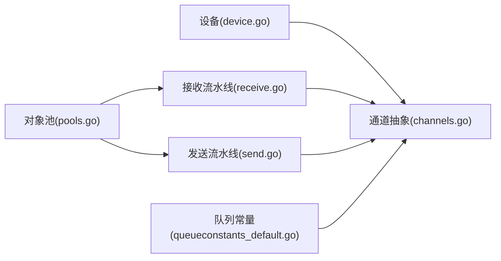

# 通道通信机制

<cite>
**本文引用的文件**
- [channels.go](file://device/channels.go)
- [pools.go](file://device/pools.go)
- [queueconstants_default.go](file://device/queueconstants_default.go)
- [receive.go](file://device/receive.go)
- [send.go](file://device/send.go)
- [device.go](file://device/device.go)
- [peer.go](file://device/peer.go)
</cite>

## 目录
1. [简介](#简介)
2. [项目结构](#项目结构)
3. [核心组件](#核心组件)
4. [架构总览](#架构总览)
5. [详细组件分析](#详细组件分析)
6. [依赖关系分析](#依赖关系分析)
7. [性能考量](#性能考量)
8. [故障排查指南](#故障排查指南)
9. [结论](#结论)
10. [附录](#附录)

## 简介
本文件聚焦于 wireguard-go 中基于 goroutine 的通道通信机制，系统性阐述其设计原理、消息传递模式、通道类型分工（控制通道、数据通道、事件通道）、通道池与内存复用、缓冲策略与背压、错误处理与超时控制，以及最佳实践与常见陷阱。文档面向不同技术背景的读者，既提供高层概览，也给出代码级映射与可视化图示。

## 项目结构
与通道通信密切相关的模块主要位于 device 包：
- channels.go：定义并实现各类队列/通道抽象与工厂方法，提供统一的生产者-消费者模型。
- pools.go：对象池与缓冲区池，降低分配开销，提升吞吐。
- queueconstants_default.go：默认队列容量等常量配置，影响缓冲与背压行为。
- receive.go / send.go：接收与发送流水线，使用通道串联各阶段，形成无锁或低锁的数据流。
- device.go / peer.go：设备与对端状态机，通过通道协调收发、计时器、重传等。

图表来源
- [device.go:1-200](file://device/device.go#L1-L200)
- [peer.go:1-200](file://device/peer.go#L1-L200)
- [channels.go:1-200](file://device/channels.go#L1-L200)
- [receive.go:1-200](file://device/receive.go#L1-L200)
- [send.go:1-200](file://device/send.go#L1-L200)
- [pools.go:1-200](file://device/pools.go#L1-L200)
- [queueconstants_default.go:1-100](file://device/queueconstants_default.go#L1-L100)

章节来源
- [channels.go:1-200](file://device/channels.go#L1-L200)
- [pools.go:1-200](file://device/pools.go#L1-L200)
- [queueconstants_default.go:1-100](file://device/queueconstants_default.go#L1-L100)
- [receive.go:1-200](file://device/receive.go#L1-L200)
- [send.go:1-200](file://device/send.go#L1-L200)
- [device.go:1-200](file://device/device.go#L1-L200)
- [peer.go:1-200](file://device/peer.go#L1-L200)

## 核心组件
- 通道/队列抽象：在 channels.go 中定义了统一的队列接口与具体实现，用于承载控制消息、数据包与事件。典型能力包括入队、出队、关闭通知、容量限制与背压。
- 对象池与缓冲区池：在 pools.go 中提供可复用的对象与字节缓冲，减少 GC 压力，提高高并发下的吞吐。
- 队列容量常量：在 queueconstants_default.go 中定义默认缓冲大小，直接影响背压触发点与内存占用。
- 收发流水线：receive.go 与 send.go 将网络 I/O、加解密、封装/解封装、路由等步骤以通道串联，形成清晰的数据流。
- 设备与对端：device.go 与 peer.go 作为调度中心，订阅事件通道、驱动控制通道、管理数据通道生命周期。

章节来源
- [channels.go:1-200](file://device/channels.go#L1-L200)
- [pools.go:1-200](file://device/pools.go#L1-L200)
- [queueconstants_default.go:1-100](file://device/queueconstants_default.go#L1-L100)
- [receive.go:1-200](file://device/receive.go#L1-L200)
- [send.go:1-200](file://device/send.go#L1-L200)
- [device.go:1-200](file://device/device.go#L1-L200)
- [peer.go:1-200](file://device/peer.go#L1-L200)

## 架构总览
wireguard-go 采用“生产者-消费者 + 流水线”的通道架构：
- 控制通道：用于设备生命周期管理、对端状态变更、定时器触发等控制信号。
- 数据通道：承载加密后的数据包或明文数据在不同阶段间流转。
- 事件通道：向上层或调度器上报关键事件（如连接建立、密钥轮换、重传完成）。

图表来源
- [receive.go:1-200](file://device/receive.go#L1-L200)
- [send.go:1-200](file://device/send.go#L1-L200)
- [channels.go:1-200](file://device/channels.go#L1-L200)
- [device.go:1-200](file://device/device.go#L1-L200)

## 详细组件分析

### 通道与队列抽象（channels.go）
- 设计要点
  - 统一队列接口：屏蔽底层 channel/map/环形缓冲差异，对外暴露一致的入队/出队/关闭语义。
  - 多通道类型：控制通道、数据通道、事件通道分别承担不同职责，便于独立调优与监控。
  - 关闭传播：支持优雅关闭，确保消费者能感知终止并清理资源。
- 复杂度与特性
  - 入队/出队通常为 O(1)，受缓冲大小影响；关闭为广播式通知。
  - 可通过容量参数调节缓冲深度，配合背压避免内存膨胀。
- 优化机会
  - 结合对象池减少临时对象分配。
  - 针对热点路径选择更合适的队列实现（如环形缓冲）。

章节来源
- [channels.go:1-200](file://device/channels.go#L1-L200)

### 通道池与内存复用（pools.go）
- 设计要点
  - 对象池：复用数据包结构体、会话上下文等频繁创建销毁的对象。
  - 缓冲区池：复用字节切片，避免重复分配与拷贝。
- 性能收益
  - 显著降低 GC 频率与峰值内存占用，提升高吞吐场景稳定性。
- 注意事项
  - 池化对象需正确重置状态，避免脏数据泄露。
  - 合理设置池大小，防止过度放大常驻内存。

章节来源
- [pools.go:1-200](file://device/pools.go#L1-L200)

### 队列容量与背压（queueconstants_default.go）
- 设计要点
  - 定义控制/数据/事件通道的默认缓冲容量。
  - 容量越大，延迟越低但内存占用越高；容量越小，更易触发背压。
- 背压策略
  - 当通道满时，生产者应阻塞或退避，避免丢弃关键消息。
  - 可根据负载动态调整容量或切换降级策略。

章节来源
- [queueconstants_default.go:1-100](file://device/queueconstants_default.go#L1-L100)

### 接收流水线（receive.go）
- 流程概述
  - 从网络读取原始报文，进行校验、解密、去重、分片重组等处理。
  - 处理后数据经数据通道投递给上层或发送流水线。
  - 关键事件（如解密成功、丢包统计）通过事件通道上报。
- 错误与超时
  - 对校验失败、解密失败等异常进行分类处理与计数。
  - 对慢消费者实施超时保护，避免阻塞整个接收循环。

章节来源
- [receive.go:1-200](file://device/receive.go#L1-L200)

### 发送流水线（send.go）
- 流程概述
  - 从数据通道取出待发包，执行封装、加密、路由选择。
  - 通过系统调用发送，必要时排队等待拥塞窗口或队列空间。
  - 发送结果与重传事件通过事件通道反馈。
- 错误与超时
  - 对发送失败进行重试与告警。
  - 对慢网络或拥塞场景设置退避与超时。

章节来源
- [send.go:1-200](file://device/send.go#L1-L200)

### 设备与对端协调（device.go, peer.go）
- 角色分工
  - 设备：全局调度，维护对端集合，订阅事件通道，驱动控制通道。
  - 对端：维护连接状态、密钥、定时器、队列句柄等。
- 协作方式
  - 控制通道用于下发配置、切换对端、触发重传等。
  - 事件通道用于上报连接变化、统计信息、错误事件。
  - 数据通道承载实际业务数据流。

章节来源
- [device.go:1-200](file://device/device.go#L1-L200)
- [peer.go:1-200](file://device/peer.go#L1-L200)

### 类图：通道与队列抽象

图表来源
- [channels.go:1-200](file://device/channels.go#L1-L200)

### 序列图：一次完整收发流程

图表来源
- [device.go:1-200](file://device/device.go#L1-L200)
- [receive.go:1-200](file://device/receive.go#L1-L200)
- [send.go:1-200](file://device/send.go#L1-L200)
- [channels.go:1-200](file://device/channels.go#L1-L200)

### 流程图：背压与缓冲策略

图表来源
- [channels.go:1-200](file://device/channels.go#L1-L200)
- [queueconstants_default.go:1-100](file://device/queueconstants_default.go#L1-L100)

## 依赖关系分析
- 组件耦合
  - 设备与对端强依赖通道抽象，但不关心具体实现，利于替换与测试。
  - 收发流水线仅依赖通道接口，松耦合，便于并行扩展。
- 外部依赖
  - 网络栈与内核接口通过 I/O 层接入，通道负责解耦 I/O 与处理逻辑。
- 潜在循环依赖
  - 通过事件与控制通道单向通信，避免直接循环引用。

图表来源
- [device.go:1-200](file://device/device.go#L1-L200)
- [channels.go:1-200](file://device/channels.go#L1-L200)
- [receive.go:1-200](file://device/receive.go#L1-L200)
- [send.go:1-200](file://device/send.go#L1-L200)
- [pools.go:1-200](file://device/pools.go#L1-L200)
- [queueconstants_default.go:1-100](file://device/queueconstants_default.go#L1-L100)

章节来源
- [device.go:1-200](file://device/device.go#L1-L200)
- [channels.go:1-200](file://device/channels.go#L1-L200)
- [receive.go:1-200](file://device/receive.go#L1-L200)
- [send.go:1-200](file://device/send.go#L1-L200)
- [pools.go:1-200](file://device/pools.go#L1-L200)
- [queueconstants_default.go:1-100](file://device/queueconstants_default.go#L1-L100)

## 性能考量
- 缓冲与延迟权衡
  - 增大缓冲可降低尾延迟，但增加内存占用与 GC 压力；需根据工作负载调优。
- 对象池与零拷贝
  - 优先复用缓冲区与数据结构，减少分配与拷贝。
- 背压与公平性
  - 对慢消费者实施退避，避免单一路径拖垮整体吞吐。
- 批处理
  - 批量出队/入队可减少同步开销，提高缓存局部性。
- 监控与可观测性
  - 记录通道长度、入队/出队速率、丢弃计数，辅助定位瓶颈。

[本节为通用指导，不直接分析具体文件]

## 故障排查指南
- 常见问题
  - 通道满导致阻塞：检查消费者是否及时出队，适当增大缓冲或优化处理耗时。
  - 内存持续增长：排查未释放的缓冲区或对象，确认池化是否正确归还。
  - 事件丢失：确认事件通道容量与关闭时机，避免在关闭后继续入队。
  - 超时未生效：检查超时设置与取消机制，确保 goroutine 能被及时退出。
- 定位方法
  - 打印通道长度与入队/出队速率，观察拐点。
  - 使用 pprof 分析 CPU/内存热点，定位慢路径。
  - 在关键路径添加日志，追踪消息流向。

章节来源
- [channels.go:1-200](file://device/channels.go#L1-L200)
- [receive.go:1-200](file://device/receive.go#L1-L200)
- [send.go:1-200](file://device/send.go#L1-L200)
- [pools.go:1-200](file://device/pools.go#L1-L200)

## 结论
wireguard-go 的通道通信机制以清晰的职责划分与松耦合设计为核心，通过控制/数据/事件三类通道协同工作，结合对象池与缓冲策略，在高并发与高吞吐场景下保持良好性能与稳定性。合理的背压、错误处理与超时控制是保障系统健壮性的关键。建议在生产环境中结合监控指标持续调优通道容量与处理逻辑，避免常见陷阱。

[本节为总结性内容，不直接分析具体文件]

## 附录
- 最佳实践
  - 明确通道职责：控制、数据、事件分离，避免混用。
  - 设置合理缓冲：依据峰值流量与内存预算确定容量。
  - 始终处理关闭：确保消费者能优雅退出并释放资源。
  - 使用池化：高频对象与缓冲区务必池化。
  - 超时与取消：为所有阻塞操作设置超时与取消信号。
- 常见陷阱
  - 忘记关闭通道导致 goroutine 泄漏。
  - 在关闭通道后继续入队引发 panic。
  - 无限增长缓冲导致内存溢出。
  - 忽略背压导致雪崩效应。
  - 未重置池化对象状态造成数据污染。

[本节为通用指导，不直接分析具体文件]