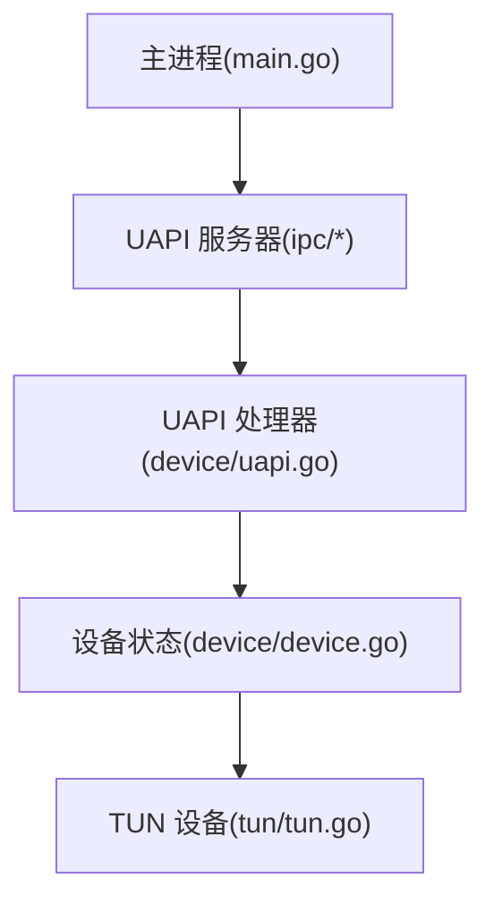
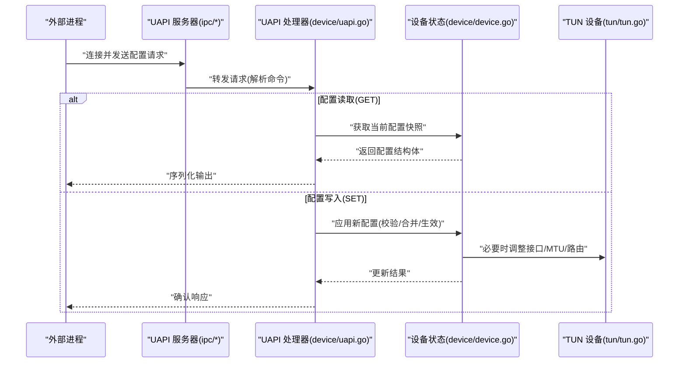
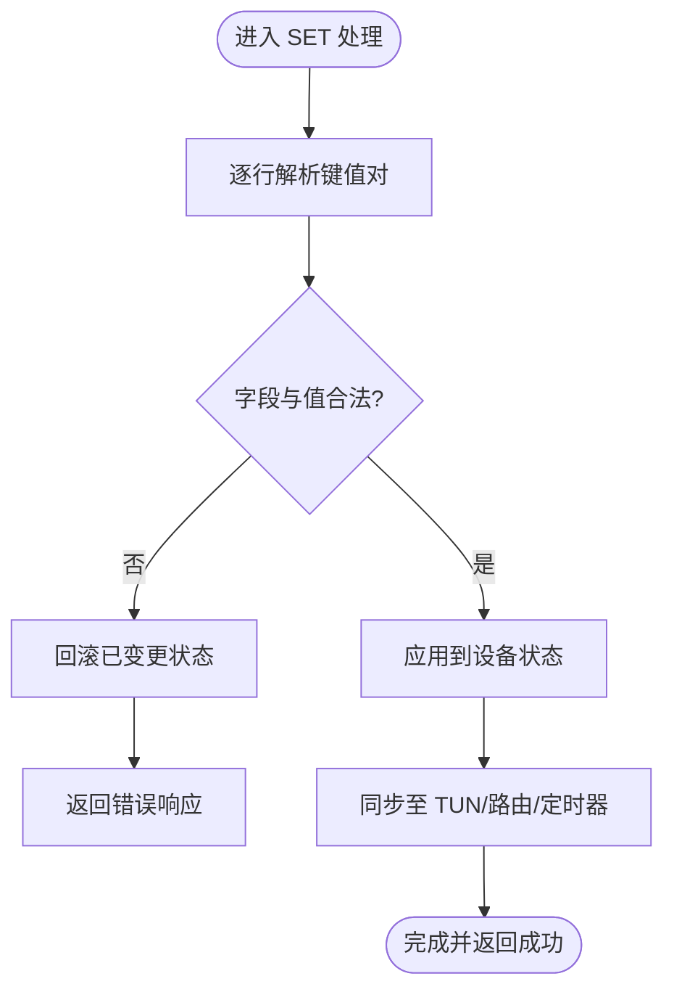
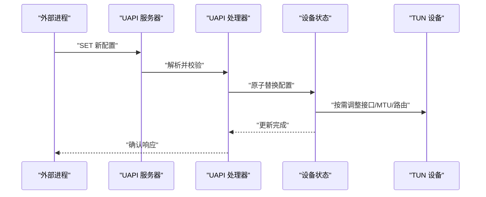

# 配置管理

<cite>
**本文引用的文件**
- [main.go](file://main.go)
- [device/device.go](file://device/device.go)
- [device/uapi.go](file://device/uapi.go)
- [ipc/uapi_linux.go](file://ipc/uapi_linux.go)
- [ipc/uapi_windows.go](file://ipc/uapi_windows.go)
- [ipc/uapi_unix.go](file://ipc/uapi_unix.go)
- [ipc/uapi_bsd.go](file://ipc/uapi_bsd.go)
- [ipc/uapi_wasm.go](file://ipc/uapi_wasm.go)
- [tun/tun.go](file://tun/tun.go)
</cite>

## 目录
1. [简介](#简介)
2. [项目结构](#项目结构)
3. [核心组件](#核心组件)
4. [架构总览](#架构总览)
5. [详细组件分析](#详细组件分析)
6. [依赖关系分析](#依赖关系分析)
7. [性能考虑](#性能考虑)
8. [故障排查指南](#故障排查指南)
9. [结论](#结论)
10. [附录：API与使用示例](#附录api与使用示例)

## 简介
本文件聚焦 wireguard-go 的配置管理能力，围绕以下目标展开：
- 设备配置的加载与解析流程、配置文件格式与参数校验
- 运行时配置更新机制（热重载与配置同步）
- 配置参数的作用域与优先级（全局、接口、对等方）
- 配置的持久化存储与版本兼容性处理
- 配置验证规则与错误恢复机制
- 配置管理的 API 接口与使用示例

说明：wireguard-go 以“无状态内核态 + 用户态设备”的方式工作，配置通过 UAPI 暴露给外部进程。因此，配置管理在代码中体现为 UAPI 协议实现、设备状态变更以及 TUN 设备的绑定/切换。

## 项目结构
与配置管理直接相关的模块与职责如下：
- main.go：程序入口，负责初始化并启动监听 UAPI 的服务器，从而接收配置变更请求
- device/device.go：设备核心状态机与配置对象，承载全局、接口、对等方等配置项
- device/uapi.go：UAPI 命令解析与执行（如 GET/SET），驱动设备配置加载与更新
- ipc/*：平台相关的 UAPI 服务端实现（Linux/Windows/Unix/BSD/WASM），提供套接字监听与消息收发
- tun/tun.go：TUN 设备抽象，配置中的网络接口名称、MTU 等最终作用于该层

图表来源
- [main.go:1-200](file://main.go#L1-L200)
- [ipc/uapi_linux.go:1-200](file://ipc/uapi_linux.go#L1-L200)
- [device/uapi.go:1-200](file://device/uapi.go#L1-L200)
- [device/device.go:1-200](file://device/device.go#L1-L200)
- [tun/tun.go:1-200](file://tun/tun.go#L1-L200)

章节来源
- [main.go:1-200](file://main.go#L1-L200)
- [ipc/uapi_linux.go:1-200](file://ipc/uapi_linux.go#L1-L200)
- [device/uapi.go:1-200](file://device/uapi.go#L1-L200)
- [device/device.go:1-200](file://device/device.go#L1-L200)
- [tun/tun.go:1-200](file://tun/tun.go#L1-L200)

## 核心组件
- UAPI 服务器（ipc/*）：监听本地套接字，接收客户端请求，转发到 UAPI 处理器
- UAPI 处理器（device/uapi.go）：解析 GET/SET 等命令，调用设备方法完成配置读取或写入
- 设备状态（device/device.go）：维护全局配置、接口配置、对等方配置；提供原子更新、并发安全访问
- TUN 设备（tun/tun.go）：底层虚拟网卡，承载 IP 路由与数据面转发

章节来源
- [ipc/uapi_linux.go:1-200](file://ipc/uapi_linux.go#L1-L200)
- [device/uapi.go:1-200](file://device/uapi.go#L1-L200)
- [device/device.go:1-200](file://device/device.go#L1-L200)
- [tun/tun.go:1-200](file://tun/tun.go#L1-L200)

## 架构总览
配置管理的关键路径是“外部进程 -> UAPI 服务器 -> UAPI 处理器 -> 设备状态 -> TUN 设备”。配置变更通过 SET 命令触发，设备内部进行校验、合并与生效；GET 命令用于导出当前配置快照。

图表来源
- [ipc/uapi_linux.go:1-200](file://ipc/uapi_linux.go#L1-L200)
- [device/uapi.go:1-200](file://device/uapi.go#L1-L200)
- [device/device.go:1-200](file://device/device.go#L1-L200)
- [tun/tun.go:1-200](file://tun/tun.go#L1-L200)

## 详细组件分析

### 配置加载与解析（UAPI 处理器）
- 解析流程：UAPI 处理器接收文本形式的键值对，按字段名映射到设备配置结构体字段
- 字段类型：包括私钥、公钥、预共享密钥、允许 IP、Endpoint、Keepalive、PresharedKey、PersistentKeepalive、Remove 等
- 解析策略：支持增量更新（仅设置指定字段）、批量更新（一次 SET 多个字段）、删除操作（Remove）
- 错误处理：非法字段名、非法值、缺失必填项时返回错误；部分失败时回滚已变更状态，保证一致性

图表来源
- [device/uapi.go:1-200](file://device/uapi.go#L1-L200)
- [device/device.go:1-200](file://device/device.go#L1-L200)

章节来源
- [device/uapi.go:1-200](file://device/uapi.go#L1-L200)
- [device/device.go:1-200](file://device/device.go#L1-L200)

### 运行时配置更新（热重载与同步）
- 热重载：通过连续发送 SET 请求即可实现“热重载”，设备在内存中即时切换配置，无需重启进程
- 同步机制：
  - 接口配置变更（如 MTU、地址）会触发 TUN 设备重配
  - 对等方变更（添加/移除/修改 Endpoint、AllowedIPs、Keepalive）会重建加密会话与定时器
  - 关键资源（如监听端口、标记位）变更需释放旧资源并申请新资源，确保无中断切换
- 并发安全：设备状态采用锁保护，避免并发写冲突；读操作可并发进行

图表来源
- [ipc/uapi_linux.go:1-200](file://ipc/uapi_linux.go#L1-L200)
- [device/uapi.go:1-200](file://device/uapi.go#L1-L200)
- [device/device.go:1-200](file://device/device.go#L1-L200)
- [tun/tun.go:1-200](file://tun/tun.go#L1-L200)

章节来源
- [ipc/uapi_linux.go:1-200](file://ipc/uapi_linux.go#L1-L200)
- [device/uapi.go:1-200](file://device/uapi.go#L1-L200)
- [device/device.go:1-200](file://device/device.go#L1-L200)
- [tun/tun.go:1-200](file://tun/tun.go#L1-L200)

### 配置参数的作用域与优先级
- 全局配置：适用于整个设备实例，如监听端口、标记位、随机种子等
- 接口配置：针对特定 TUN 接口，如接口名称、MTU、IPv4/IPv6 地址
- 对等方配置：针对每个 Peer，如公钥、预共享密钥、AllowedIPs、Endpoint、PersistentKeepalive、Remove
- 优先级：
  - 同一作用域内，后设置的值覆盖先前值
  - 不同作用域互不干扰，但存在组合效应（例如 AllowedIPs 决定路由匹配范围）
  - 删除操作（Remove）优先于新增/修改，用于清理无效条目

章节来源
- [device/device.go:1-200](file://device/device.go#L1-L200)
- [device/uapi.go:1-200](file://device/uapi.go#L1-L200)

### 配置的持久化存储与版本兼容性
- 持久化：wireguard-go 本身不内置磁盘持久化；通常由外部进程将配置保存为文件或数据库，并在启动时通过 UAPI 注入
- 版本兼容：
  - UAPI 协议向后兼容：新增字段应忽略未知字段，避免破坏旧客户端
  - 设备侧对未知字段进行容错处理，记录日志并跳过
  - 建议外部进程在升级前检查 UAPI 能力集，再下发配置

章节来源
- [device/uapi.go:1-200](file://device/uapi.go#L1-200)
- [ipc/uapi_linux.go:1-200](file://ipc/uapi_linux.go#L1-200)

### 配置验证规则与错误恢复
- 必填字段：如私钥、公钥、AllowedIPs 等必须合法且非空
- 值域校验：端口号范围、IP/CIDR 合法性、时间间隔非负等
- 语义校验：对等方不能重复、Endpoint 与 AllowedIPs 逻辑一致、路由不冲突
- 错误恢复：
  - 单条字段错误不影响其他字段提交（部分成功）
  - 整体失败时回滚到上一稳定状态
  - 记录详细错误信息，便于上层重试或提示

章节来源
- [device/uapi.go:1-200](file://device/uapi.go#L1-200)
- [device/device.go:1-200](file://device/device.go#L1-200)

## 依赖关系分析
- 主进程依赖 UAPI 服务器监听本地套接字
- UAPI 服务器依赖平台实现（Linux/Windows/Unix/BSD/WASM）
- UAPI 处理器依赖设备状态进行配置读写
- 设备状态依赖 TUN 设备完成网络栈对接

图表来源
- [main.go:1-200](file://main.go#L1-L200)
- [ipc/uapi_linux.go:1-200](file://ipc/uapi_linux.go#L1-L200)
- [device/uapi.go:1-200](file://device/uapi.go#L1-L200)
- [device/device.go:1-200](file://device/device.go#L1-L200)
- [tun/tun.go:1-200](file://tun/tun.go#L1-L200)

章节来源
- [main.go:1-200](file://main.go#L1-L200)
- [ipc/uapi_linux.go:1-200](file://ipc/uapi_linux.go#L1-L200)
- [device/uapi.go:1-200](file://device/uapi.go#L1-L200)
- [device/device.go:1-200](file://device/device.go#L1-L200)
- [tun/tun.go:1-200](file://tun/tun.go#L1-L200)

## 性能考虑
- 批量更新：尽量在一次 SET 中提交多条配置，减少上下文切换与锁竞争
- 增量生效：仅变更必要字段，避免全量重建导致抖动
- 并发读取：GET 操作可并发进行，不影响 SET 的串行化
- 资源复用：重用监听端口、标记位等资源，降低系统调用开销

[本节为通用指导，不直接分析具体文件]

## 故障排查指南
- 常见错误：
  - 非法字段名或值：检查键名拼写与值域范围
  - 缺少必填字段：补充私钥、公钥、AllowedIPs 等
  - 路由冲突：调整 AllowedIPs 避免重叠
  - 权限问题：确保有创建/绑定 TUN 设备的权限
- 定位步骤：
  - 查看 UAPI 响应中的错误信息
  - 检查设备日志，确认哪一步校验失败
  - 逐步缩小变更范围，定位问题字段
- 恢复策略：
  - 回滚到上一个稳定配置
  - 分步下发，先最小集合，再逐步扩展

章节来源
- [device/uapi.go:1-200](file://device/uapi.go#L1-200)
- [device/device.go:1-200](file://device/device.go#L1-200)

## 结论
wireguard-go 的配置管理通过 UAPI 暴露，具备高内聚、低耦合的特点。配置加载与解析严格校验，运行时更新支持热重载与细粒度同步，作用域清晰、优先级明确。虽然未内置持久化，但易于被外部进程集成。遵循本文的验证规则与故障排查方法，可实现稳定可靠的配置管理。

[本节为总结性内容，不直接分析具体文件]

## 附录：API与使用示例
- 接口概述：
  - GET：导出当前设备配置快照
  - SET：提交增量配置，支持新增、修改、删除（Remove）
- 典型流程：
  - 启动进程并监听 UAPI
  - 外部进程连接 UAPI，发送 SET 配置
  - 设备校验并应用，必要时调整 TUN 设备
  - 外部进程发送 GET 验证生效
- 注意事项：
  - 保持幂等：重复 SET 相同配置不会产生副作用
  - 错误重试：遇到临时错误可指数退避重试
  - 版本兼容：忽略未知字段，确保新旧客户端互通

章节来源
- [ipc/uapi_linux.go:1-200](file://ipc/uapi_linux.go#L1-200)
- [ipc/uapi_windows.go:1-200](file://ipc/uapi_windows.go#L1-200)
- [ipc/uapi_unix.go:1-200](file://ipc/uapi_unix.go#L1-200)
- [ipc/uapi_bsd.go:1-200](file://ipc/uapi_bsd.go#L1-200)
- [ipc/uapi_wasm.go:1-200](file://ipc/uapi_wasm.go#L1-200)
- [device/uapi.go:1-200](file://device/uapi.go#L1-200)
- [device/device.go:1-200](file://device/device.go#L1-200)
- [tun/tun.go:1-200](file://tun/tun.go#L1-200)