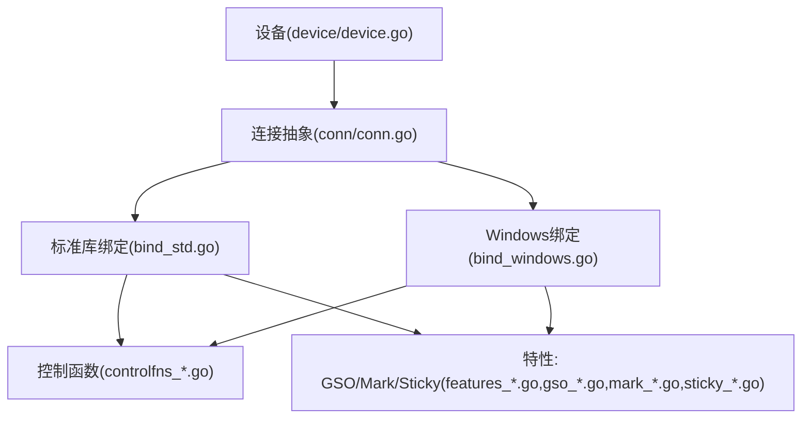
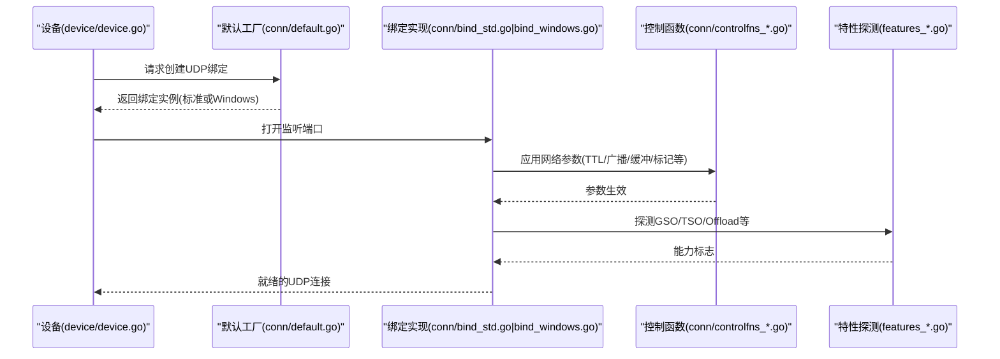
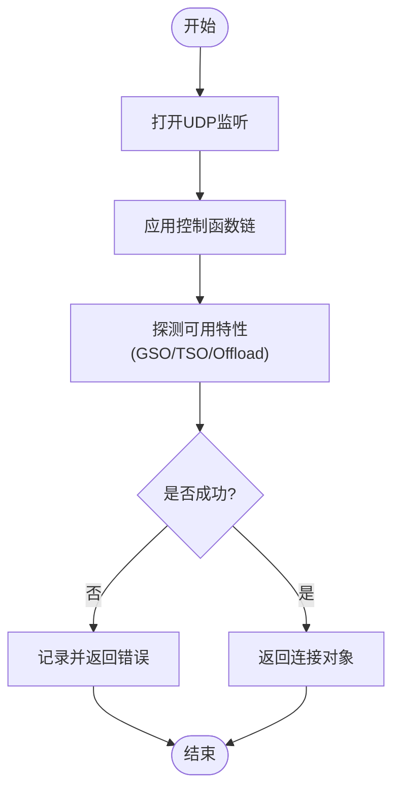
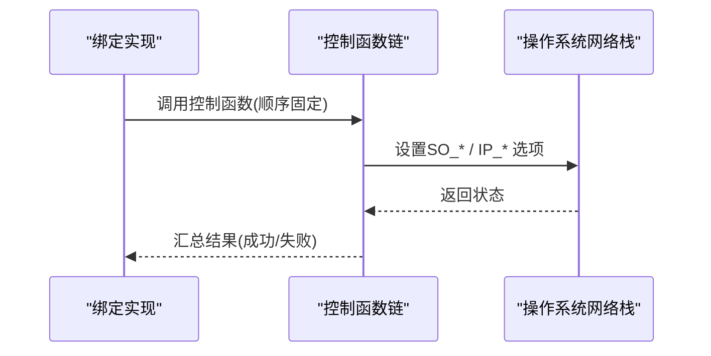
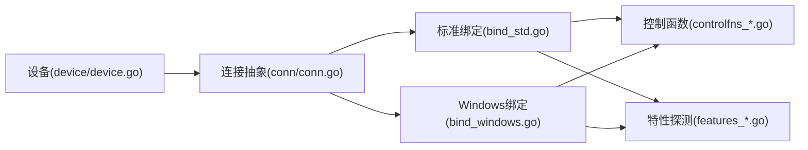

# UDP绑定机制

<cite>
**本文引用的文件**
- [conn/bind_std.go](file://conn/bind_std.go)
- [conn/bind_windows.go](file://conn/bind_windows.go)
- [conn/controlfns.go](file://conn/controlfns.go)
- [conn/controlfns_linux.go](file://conn/controlfns_linux.go)
- [conn/controlfns_unix.go](file://conn/controlfns_unix.go)
- [conn/controlfns_windows.go](file://conn/controlfns_windows.go)
- [conn/conn.go](file://conn/conn.go)
- [conn/default.go](file://conn/default.go)
- [conn/features_default.go](file://conn/features_default.go)
- [conn/features_linux.go](file://conn/features_linux.go)
- [conn/gso_default.go](file://conn/gso_default.go)
- [conn/gso_linux.go](file://conn/gso_linux.go)
- [conn/mark_default.go](file://conn/mark_default.go)
- [conn/mark_unix.go](file://conn/mark_unix.go)
- [conn/sticky_default.go](file://conn/sticky_default.go)
- [conn/sticky_linux.go](file://conn/sticky_linux.go)
- [device/device.go](file://device/device.go)
</cite>

## 目录
1. [简介](#简介)
2. [项目结构](#项目结构)
3. [核心组件](#核心组件)
4. [架构总览](#架构总览)
5. [详细组件分析](#详细组件分析)
6. [依赖关系分析](#依赖关系分析)
7. [性能考量](#性能考量)
8. [故障排查指南](#故障排查指南)
9. [结论](#结论)
10. [附录](#附录)

## 简介
本文件系统性梳理 wireguard-go 中 UDP 绑定的实现原理、跨平台差异与兼容性处理，并文档化绑定过程中的网络参数配置（如缓冲区大小、TTL、广播等）、控制函数执行顺序、失败处理与重试策略，以及 Windows 平台的特定优化与限制。同时提供性能调优建议与最佳实践，帮助读者在不同平台上稳定高效地运行 WireGuard。

## 项目结构
UDP 绑定相关代码集中在 conn 包下，按平台与功能拆分：
- 标准库实现：bind_std.go
- Windows 专用实现：bind_windows.go
- 控制函数与平台差异：controlfns*.go
- 特性探测与能力开关：features_*.go, gso_*.go, mark_*.go, sticky_*.go
- 设备集成入口：device/device.go

图表来源
- [conn/conn.go](file://conn/conn.go)
- [conn/bind_std.go](file://conn/bind_std.go)
- [conn/bind_windows.go](file://conn/bind_windows.go)
- [conn/controlfns.go](file://conn/controlfns.go)
- [conn/features_default.go](file://conn/features_default.go)
- [conn/features_linux.go](file://conn/features_linux.go)
- [conn/gso_default.go](file://conn/gso_default.go)
- [conn/gso_linux.go](file://conn/gso_linux.go)
- [conn/mark_default.go](file://conn/mark_default.go)
- [conn/mark_unix.go](file://conn/mark_unix.go)
- [conn/sticky_default.go](file://conn/sticky_default.go)
- [conn/sticky_linux.go](file://conn/sticky_linux.go)
- [device/device.go](file://device/device.go)

章节来源
- [conn/conn.go](file://conn/conn.go)
- [conn/bind_std.go](file://conn/bind_std.go)
- [conn/bind_windows.go](file://conn/bind_windows.go)
- [conn/controlfns.go](file://conn/controlfns.go)
- [device/device.go](file://device/device.go)

## 核心组件
- 绑定接口与默认实现：conn/conn.go 定义了统一的 UDP 套接字抽象；conn/default.go 提供默认工厂与初始化流程。
- 标准库绑定：conn/bind_std.go 基于 net.ListenPacket 创建 UDP 监听，设置系统级选项，暴露读写接口。
- Windows 绑定：conn/bind_windows.go 在标准库基础上叠加 Windows 专属优化（如 RIO、内核队列等）。
- 控制函数：controlfns.go 定义统一控制点；controlfns_linux.go / controlfns_unix.go / controlfns_windows.go 实现平台相关参数配置（TTL、广播、缓冲、标记等）。
- 特性探测与启用：features_*.go 探测 GSO、TSO、Checksum Offload 等；gso_*.go 封装 GSO 路径；mark_*.go 管理 socket mark；sticky_*.go 管理粘滞路由。

章节来源
- [conn/conn.go](file://conn/conn.go)
- [conn/default.go](file://conn/default.go)
- [conn/bind_std.go](file://conn/bind_std.go)
- [conn/bind_windows.go](file://conn/bind_windows.go)
- [conn/controlfns.go](file://conn/controlfns.go)
- [conn/controlfns_linux.go](file://conn/controlfns_linux.go)
- [conn/controlfns_unix.go](file://conn/controlfns_unix.go)
- [conn/controlfns_windows.go](file://conn/controlfns_windows.go)
- [conn/features_default.go](file://conn/features_default.go)
- [conn/features_linux.go](file://conn/features_linux.go)
- [conn/gso_default.go](file://conn/gso_default.go)
- [conn/gso_linux.go](file://conn/gso_linux.go)
- [conn/mark_default.go](file://conn/mark_default.go)
- [conn/mark_unix.go](file://conn/mark_unix.go)
- [conn/sticky_default.go](file://conn/sticky_default.go)
- [conn/sticky_linux.go](file://conn/sticky_linux.go)

## 架构总览
WireGuard 通过统一的连接抽象屏蔽底层差异，设备层仅依赖 conn 接口进行收发。绑定阶段由 default.go 选择具体实现（标准或 Windows），随后依次执行控制函数以配置网络参数，再根据特性探测结果启用加速路径。

图表来源
- [device/device.go](file://device/device.go)
- [conn/default.go](file://conn/default.go)
- [conn/bind_std.go](file://conn/bind_std.go)
- [conn/bind_windows.go](file://conn/bind_windows.go)
- [conn/controlfns.go](file://conn/controlfns.go)
- [conn/features_default.go](file://conn/features_default.go)
- [conn/features_linux.go](file://conn/features_linux.go)

## 详细组件分析

### 标准库绑定实现（bind_std.go）
- 使用 net.ListenPacket 创建 UDP 监听，支持 IPv4/IPv6 双栈。
- 调用控制函数链设置系统级选项：TTL、广播、接收/发送缓冲区、可能的 Mark 等。
- 暴露 ReadFrom/WriteTo 接口供上层收发数据。
- 错误处理：捕获系统调用错误，向上层返回可诊断的错误信息。

图表来源
- [conn/bind_std.go](file://conn/bind_std.go)
- [conn/controlfns.go](file://conn/controlfns.go)
- [conn/features_default.go](file://conn/features_default.go)

章节来源
- [conn/bind_std.go](file://conn/bind_std.go)
- [conn/controlfns.go](file://conn/controlfns.go)
- [conn/features_default.go](file://conn/features_default.go)

### Windows 绑定实现（bind_windows.go）
- 在标准库之上叠加 Windows 优化：RIO（Receive Inline）、内核队列、批量收发等。
- 针对 Windows 的网络栈特性调整缓冲与超时策略。
- 控制函数在 Windows 上侧重 SO_REUSEADDR、广播、TTL、可能的 QoS/DSCP 等。
- 错误处理结合 Windows 错误码，提供更明确的诊断信息。

章节来源
- [conn/bind_windows.go](file://conn/bind_windows.go)
- [conn/controlfns_windows.go](file://conn/controlfns_windows.go)

### 控制函数与执行顺序（controlfns*.go）
- 统一入口：controlfns.go 定义控制函数类型与注册/执行机制。
- 平台实现：
  - Linux/Unix：controlfns_linux.go / controlfns_unix.go 负责 TTL、广播、接收/发送缓冲区、SO_MARK、IP_TRANSPARENT 等。
  - Windows：controlfns_windows.go 负责 Windows 特有选项（如重用地址、广播、TTL、可能的 QoS 等）。
- 执行顺序：绑定成功后，按固定顺序依次调用控制函数，确保参数一致性与幂等性。典型顺序为：复用/广播 -> TTL -> 缓冲 -> 标记/透明 -> 其他特性。

图表来源
- [conn/controlfns.go](file://conn/controlfns.go)
- [conn/controlfns_linux.go](file://conn/controlfns_linux.go)
- [conn/controlfns_unix.go](file://conn/controlfns_unix.go)
- [conn/controlfns_windows.go](file://conn/controlfns_windows.go)

章节来源
- [conn/controlfns.go](file://conn/controlfns.go)
- [conn/controlfns_linux.go](file://conn/controlfns_linux.go)
- [conn/controlfns_unix.go](file://conn/controlfns_unix.go)
- [conn/controlfns_windows.go](file://conn/controlfns_windows.go)

### 特性探测与加速路径（features_*.go, gso_*.go, mark_*.go, sticky_*.go）
- 特性探测：features_default.go / features_linux.go 检测 GSO、TSO、Checksum Offload、UDP GRO 等能力，决定后续路径。
- GSO：gso_default.go / gso_linux.go 封装 GSO 发送/接收逻辑，减少拷贝与上下文切换。
- 标记：mark_default.go / mark_unix.go 设置 socket mark，用于策略路由与防火墙规则匹配。
- 粘滞路由：sticky_default.go / sticky_linux.go 维护源地址/路由粘性，提升多宿主场景稳定性。

章节来源
- [conn/features_default.go](file://conn/features_default.go)
- [conn/features_linux.go](file://conn/features_linux.go)
- [conn/gso_default.go](file://conn/gso_default.go)
- [conn/gso_linux.go](file://conn/gso_linux.go)
- [conn/mark_default.go](file://conn/mark_default.go)
- [conn/mark_unix.go](file://conn/mark_unix.go)
- [conn/sticky_default.go](file://conn/sticky_default.go)
- [conn/sticky_linux.go](file://conn/sticky_linux.go)

### 设备集成（device/device.go）
- 设备启动时创建 UDP 绑定，作为所有对端通信的入口。
- 将绑定实例注入到收发管线，配合队列与定时器完成加密/解密与重传。
- 若绑定失败，设备应回退或上报错误，避免静默失败。

章节来源
- [device/device.go](file://device/device.go)

## 依赖关系分析
- 设备依赖 conn 抽象，不感知底层平台差异。
- 绑定实现依赖控制函数与特性探测模块，形成“绑定 -> 控制 -> 特性”的单向依赖。
- Windows 绑定额外依赖 Windows 专属优化模块。

图表来源
- [device/device.go](file://device/device.go)
- [conn/conn.go](file://conn/conn.go)
- [conn/bind_std.go](file://conn/bind_std.go)
- [conn/bind_windows.go](file://conn/bind_windows.go)
- [conn/controlfns.go](file://conn/controlfns.go)
- [conn/features_default.go](file://conn/features_default.go)

章节来源
- [device/device.go](file://device/device.go)
- [conn/conn.go](file://conn/conn.go)
- [conn/bind_std.go](file://conn/bind_std.go)
- [conn/bind_windows.go](file://conn/bind_windows.go)
- [conn/controlfns.go](file://conn/controlfns.go)
- [conn/features_default.go](file://conn/features_default.go)

## 性能考量
- 缓冲区大小：合理增大接收/发送缓冲区可降低丢包率与系统调用次数；过大可能增加内存占用与延迟。
- GSO/TSO/Offload：在支持的平台启用 GSO/TSO/校验卸载，显著降低 CPU 占用与拷贝开销。
- 批处理：Windows 上的 RIO/内核队列可减少上下文切换；Linux 上可利用 GRO 聚合。
- TTL 与广播：按需设置 TTL 与广播，避免不必要的广播风暴与跨网段泄漏。
- 粘滞路由：在多网卡/多宿主环境中启用粘滞路由，提升会话稳定性。
- 监控与调优：观察内核统计（如 drop、retransmit）与应用指标（吞吐、延迟、CPU），动态调整参数。

[本节为通用指导，不直接分析具体文件]

## 故障排查指南
- 绑定失败常见原因：端口占用、权限不足、系统资源耗尽、非法参数（如不支持的选项）。
- 重试机制：建议在设备层实现指数退避重试，避免频繁重试导致雪崩；记录每次失败的系统错误码与上下文。
- 诊断步骤：
  - 检查端口占用与防火墙规则。
  - 验证控制函数是否全部成功（TTL、广播、缓冲、标记等）。
  - 确认特性探测结果是否符合预期（GSO/TSO/Offload）。
  - 在 Windows 上检查 RIO/内核队列初始化状态。
- 日志与指标：输出关键阶段的错误与耗时，便于定位瓶颈与问题根因。

章节来源
- [conn/bind_std.go](file://conn/bind_std.go)
- [conn/bind_windows.go](file://conn/bind_windows.go)
- [conn/controlfns.go](file://conn/controlfns.go)
- [device/device.go](file://device/device.go)

## 结论
wireguard-go 的 UDP 绑定通过统一抽象屏蔽平台差异，借助控制函数链与特性探测实现跨平台一致性与高性能。标准库实现简洁稳健，Windows 实现叠加了更多内核级优化。合理配置网络参数、启用可用特性、完善错误处理与重试机制，可在不同环境下获得稳定高效的传输体验。

[本节为总结，不直接分析具体文件]

## 附录

### 网络参数配置清单（按控制函数职责）
- TTL：单播/组播生存时间，影响跨路由器转发。
- 广播：是否允许广播发送，需结合安全策略。
- 接收/发送缓冲区：影响吞吐与丢包率，需平衡内存与延迟。
- Socket Mark：用于策略路由与防火墙匹配。
- 透明代理/IP_TRANSPARENT：在部分平台用于透明代理场景。
- Windows 特有：重用地址、QoS/DSCP、RIO/内核队列等。

章节来源
- [conn/controlfns_linux.go](file://conn/controlfns_linux.go)
- [conn/controlfns_unix.go](file://conn/controlfns_unix.go)
- [conn/controlfns_windows.go](file://conn/controlfns_windows.go)

### 控制函数执行顺序（建议）
1) 复用与广播（SO_REUSEADDR/SO_BROADCAST）
2) TTL（IP_TTL/IPV6_UNICAST_HOPS）
3) 缓冲区（SO_RCVBUF/SO_SNDBUF）
4) 标记（SO_MARK）
5) 透明代理（IP_TRANSPARENT，视平台）
6) 其他特性（如 QoS/DSCP）

章节来源
- [conn/controlfns.go](file://conn/controlfns.go)
- [conn/controlfns_linux.go](file://conn/controlfns_linux.go)
- [conn/controlfns_unix.go](file://conn/controlfns_unix.go)
- [conn/controlfns_windows.go](file://conn/controlfns_windows.go)

### 绑定失败处理与重试机制（建议）
- 失败分类：端口占用、权限、系统资源、非法参数。
- 重试策略：指数退避 + 最大重试次数；记录错误上下文。
- 降级策略：关闭非关键特性（如 GSO/TSO）后重试。
- 告警与回滚：失败时通知上层并清理已分配资源。

章节来源
- [device/device.go](file://device/device.go)
- [conn/bind_std.go](file://conn/bind_std.go)
- [conn/bind_windows.go](file://conn/bind_windows.go)

### Windows 平台特定优化与限制
- 优化：RIO、内核队列、批量收发、DSCP/QoS。
- 限制：某些系统调用不可用或行为不同；需要管理员权限；驱动/内核版本差异。
- 建议：优先启用 RIO/内核队列；谨慎设置 TTL/广播；监控内核队列深度与丢弃。

章节来源
- [conn/bind_windows.go](file://conn/bind_windows.go)
- [conn/controlfns_windows.go](file://conn/controlfns_windows.go)