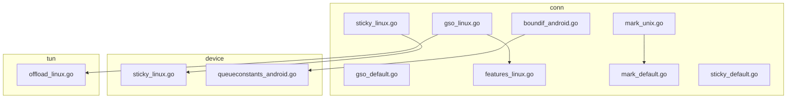
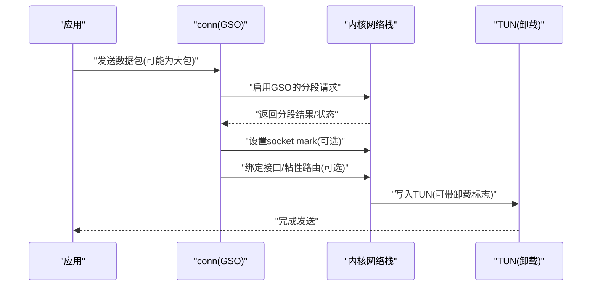
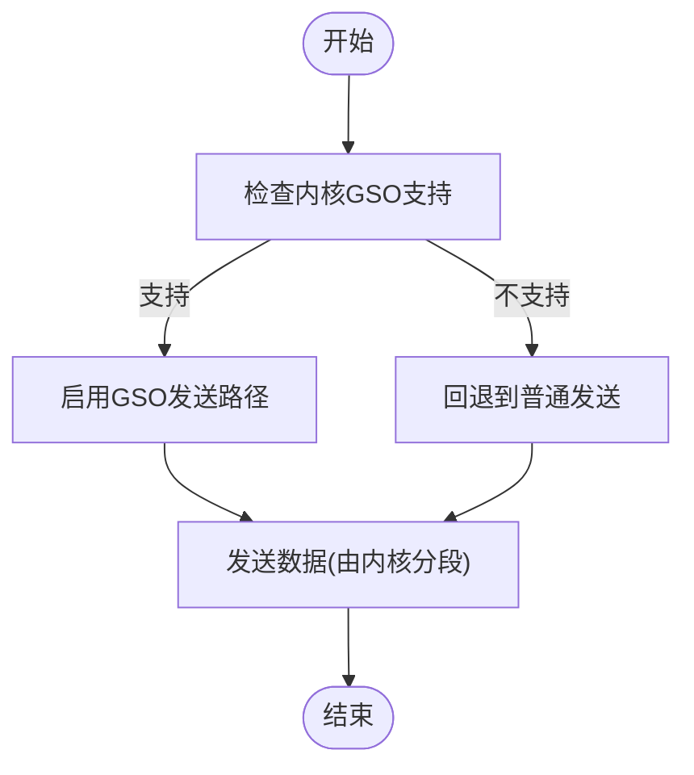
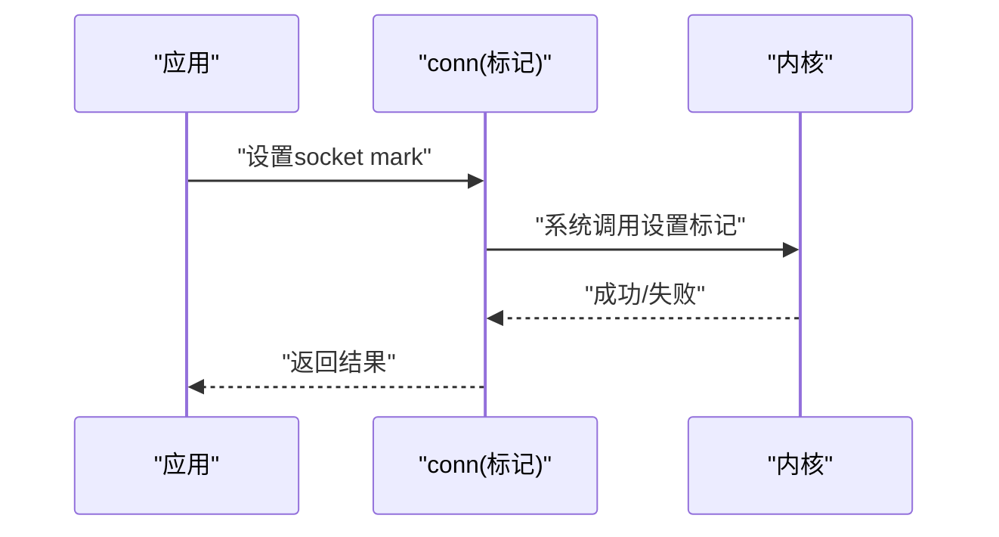
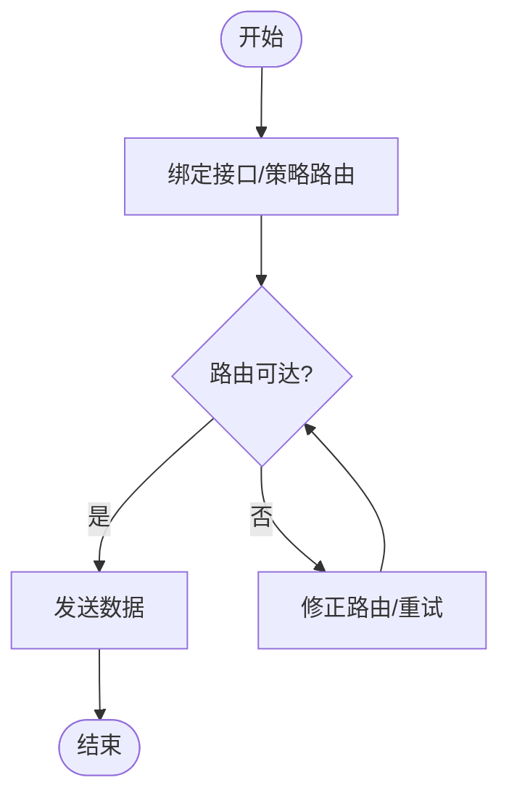
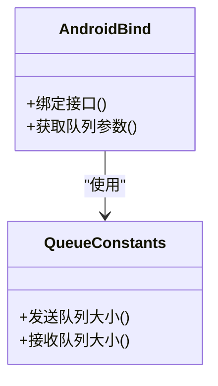
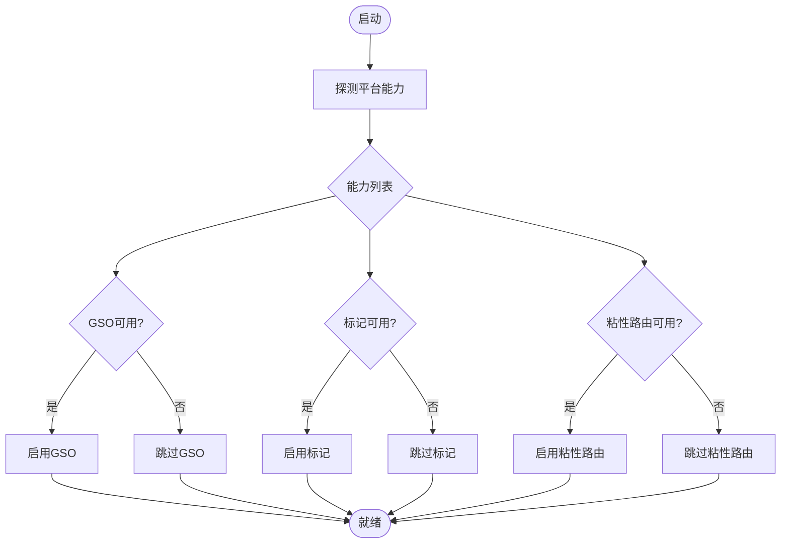
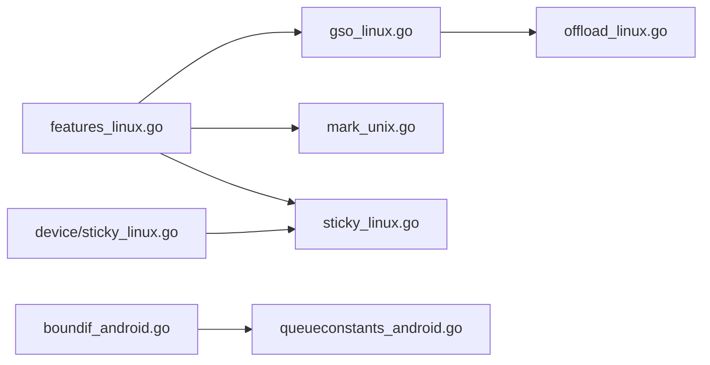

# 平台特定优化

<cite>
**本文引用的文件**
- [conn/gso_linux.go](file://conn/gso_linux.go)
- [conn/gso_default.go](file://conn/gso_default.go)
- [conn/features_linux.go](file://conn/features_linux.go)
- [conn/mark_unix.go](file://conn/mark_unix.go)
- [conn/mark_default.go](file://conn/mark_default.go)
- [conn/sticky_linux.go](file://conn/sticky_linux.go)
- [conn/sticky_default.go](file://conn/sticky_default.go)
- [conn/boundif_android.go](file://conn/boundif_android.go)
- [device/sticky_linux.go](file://device/sticky_linux.go)
- [device/queueconstants_android.go](file://device/queueconstants_android.go)
- [tun/offload_linux.go](file://tun/offload_linux.go)
</cite>

## 目录
1. [简介](#简介)
2. [项目结构](#项目结构)
3. [核心组件](#核心组件)
4. [架构总览](#架构总览)
5. [详细组件分析](#详细组件分析)
6. [依赖关系分析](#依赖关系分析)
7. [性能考量](#性能考量)
8. [故障排查指南](#故障排查指南)
9. [结论](#结论)
10. [附录](#附录)

## 简介
本文件聚焦于 wireguard-go 在不同操作系统上的平台特定优化，重点覆盖：
- Linux 平台的 GSO（通用分段卸载）优化实现与使用方式
- 网络标记（mark）功能的实现与应用场景
- 粘性路由（sticky routing）的配置与使用方法
- Android 平台的网络接口绑定优化
- 各平台性能对比与选择建议
- 平台检测与功能可用性检查机制
- 跨平台性能调优方法
- 平台兼容性的测试与验证方法

## 项目结构
本项目将平台相关能力按“conn”“device”“tun”等模块分层组织：
- conn：封装底层套接字、GSO、标记、粘性路由、接口绑定等平台差异
- device：设备层队列常量、粘性路由策略等
- tun：TUN 层的分段卸载能力

**图表来源**
- [conn/gso_linux.go:1-200](file://conn/gso_linux.go#L1-L200)
- [conn/gso_default.go:1-200](file://conn/gso_default.go#L1-L200)
- [conn/features_linux.go:1-200](file://conn/features_linux.go#L1-L200)
- [conn/mark_unix.go:1-200](file://conn/mark_unix.go#L1-L200)
- [conn/mark_default.go:1-200](file://conn/mark_default.go#L1-L200)
- [conn/sticky_linux.go:1-200](file://conn/sticky_linux.go#L1-L200)
- [conn/sticky_default.go:1-200](file://conn/sticky_default.go#L1-L200)
- [conn/boundif_android.go:1-200](file://conn/boundif_android.go#L1-L200)
- [device/sticky_linux.go:1-200](file://device/sticky_linux.go#L1-L200)
- [device/queueconstants_android.go:1-200](file://device/queueconstants_android.go#L1-L200)
- [tun/offload_linux.go:1-200](file://tun/offload_linux.go#L1-L200)

**章节来源**
- [conn/gso_linux.go:1-200](file://conn/gso_linux.go#L1-L200)
- [conn/gso_default.go:1-200](file://conn/gso_default.go#L1-L200)
- [conn/features_linux.go:1-200](file://conn/features_linux.go#L1-L200)
- [conn/mark_unix.go:1-200](file://conn/mark_unix.go#L1-L200)
- [conn/mark_default.go:1-200](file://conn/mark_default.go#L1-L200)
- [conn/sticky_linux.go:1-200](file://conn/sticky_linux.go#L1-L200)
- [conn/sticky_default.go:1-200](file://conn/sticky_default.go#L1-L200)
- [conn/boundif_android.go:1-200](file://conn/boundif_android.go#L1-L200)
- [device/sticky_linux.go:1-200](file://device/sticky_linux.go#L1-L200)
- [device/queueconstants_android.go:1-200](file://device/queueconstants_android.go#L1-L200)
- [tun/offload_linux.go:1-200](file://tun/offload_linux.go#L1-L200)

## 核心组件
- Linux GSO 支持：通过 conn 层提供发送路径的 GSO 封装，减少内核分片开销；默认平台回退到非 GSO 实现。
- 网络标记（mark）：在 Unix 类系统上设置 socket mark，用于路由/防火墙策略匹配；非 Unix 平台提供空实现或回退。
- 粘性路由：Linux 下基于 SO_BINDTODEVICE 和路由表策略，使连接保持固定出口；其他平台提供默认回退。
- Android 接口绑定：Android 专用接口绑定实现，结合队列常量优化。
- TUN 卸载：Linux TUN 层提供分段卸载能力，配合 conn GSO 提升吞吐。

**章节来源**
- [conn/gso_linux.go:1-200](file://conn/gso_linux.go#L1-L200)
- [conn/gso_default.go:1-200](file://conn/gso_default.go#L1-L200)
- [conn/mark_unix.go:1-200](file://conn/mark_unix.go#L1-L200)
- [conn/mark_default.go:1-200](file://conn/mark_default.go#L1-L200)
- [conn/sticky_linux.go:1-200](file://conn/sticky_linux.go#L1-L200)
- [conn/sticky_default.go:1-200](file://conn/sticky_default.go#L1-L200)
- [conn/boundif_android.go:1-200](file://conn/boundif_android.go#L1-L200)
- [device/queueconstants_android.go:1-200](file://device/queueconstants_android.go#L1-L200)
- [tun/offload_linux.go:1-200](file://tun/offload_linux.go#L1-L200)

## 架构总览
下图展示 Linux 平台发送路径中 GSO、标记、粘性路由与 TUN 卸载的协作关系。

**图表来源**
- [conn/gso_linux.go:1-200](file://conn/gso_linux.go#L1-L200)
- [conn/mark_unix.go:1-200](file://conn/mark_unix.go#L1-L200)
- [conn/sticky_linux.go:1-200](file://conn/sticky_linux.go#L1-L200)
- [tun/offload_linux.go:1-200](file://tun/offload_linux.go#L1-L200)

## 详细组件分析

### Linux GSO（通用分段卸载）
- 目标：在发送路径上将大包交由内核进行分段，降低用户态 CPU 占用并提高吞吐。
- 关键点：
  - 检测内核是否支持 GSO，并在可用时启用。
  - 对不支持的平台回退为普通发送路径。
  - 与 TUN 卸载协同，进一步减少拷贝与上下文切换。
- 适用场景：高带宽、大包传输、CPU 敏感环境。

**图表来源**
- [conn/gso_linux.go:1-200](file://conn/gso_linux.go#L1-L200)
- [conn/gso_default.go:1-200](file://conn/gso_default.go#L1-L200)
- [tun/offload_linux.go:1-200](file://tun/offload_linux.go#L1-L200)

**章节来源**
- [conn/gso_linux.go:1-200](file://conn/gso_linux.go#L1-L200)
- [conn/gso_default.go:1-200](file://conn/gso_default.go#L1-L200)
- [tun/offload_linux.go:1-200](file://tun/offload_linux.go#L1-L200)

### 网络标记（Socket Mark）
- 目标：为 socket 设置标记，便于路由/防火墙策略匹配，实现流量分类与策略路由。
- 关键点：
  - Unix 平台通过系统调用设置 socket mark。
  - 非 Unix 平台提供空实现或回退，确保跨平台一致性。
- 应用场景：多租户隔离、策略路由、QoS 标记、审计与计费。

**图表来源**
- [conn/mark_unix.go:1-200](file://conn/mark_unix.go#L1-L200)
- [conn/mark_default.go:1-200](file://conn/mark_default.go#L1-L200)

**章节来源**
- [conn/mark_unix.go:1-200](file://conn/mark_unix.go#L1-L200)
- [conn/mark_default.go:1-200](file://conn/mark_default.go#L1-L200)

### 粘性路由（Sticky Routing）
- 目标：使连接在生命周期内固定从指定接口/路由发出，避免多路径导致的乱序与重传。
- 关键点：
  - Linux 下结合 SO_BINDTODEVICE 与策略路由，确保出站流量稳定。
  - 其他平台提供默认回退实现。
  - 设备层提供 Linux 特定的粘性路由策略。
- 配置要点：
  - 明确绑定接口名称或策略规则。
  - 与路由表、策略路由规则一致。
  - 在容器/命名空间环境中注意权限与可见性。

**图表来源**
- [conn/sticky_linux.go:1-200](file://conn/sticky_linux.go#L1-L200)
- [conn/sticky_default.go:1-200](file://conn/sticky_default.go#L1-L200)
- [device/sticky_linux.go:1-200](file://device/sticky_linux.go#L1-L200)

**章节来源**
- [conn/sticky_linux.go:1-200](file://conn/sticky_linux.go#L1-L200)
- [conn/sticky_default.go:1-200](file://conn/sticky_default.go#L1-L200)
- [device/sticky_linux.go:1-200](file://device/sticky_linux.go#L1-L200)

### Android 网络接口绑定优化
- 目标：在 Android 平台上提供更稳定的接口绑定与队列参数调优。
- 关键点：
  - 使用 Android 专用的接口绑定实现。
  - 调整队列常量以适配移动端资源限制。
- 适用场景：移动设备、电池敏感、多网络切换环境。

**图表来源**
- [conn/boundif_android.go:1-200](file://conn/boundif_android.go#L1-L200)
- [device/queueconstants_android.go:1-200](file://device/queueconstants_android.go#L1-L200)

**章节来源**
- [conn/boundif_android.go:1-200](file://conn/boundif_android.go#L1-L200)
- [device/queueconstants_android.go:1-200](file://device/queueconstants_android.go#L1-L200)

### 平台检测与功能可用性检查
- 目标：在运行时检测平台能力（如 GSO、标记、粘性路由），动态启用或回退。
- 关键点：
  - 使用平台特性探测函数判断能力。
  - 根据检测结果选择最优路径或降级方案。
- 建议：
  - 启动阶段执行能力探测并缓存结果。
  - 对外暴露能力查询接口，便于上层决策。

**图表来源**
- [conn/features_linux.go:1-200](file://conn/features_linux.go#L1-L200)
- [conn/gso_linux.go:1-200](file://conn/gso_linux.go#L1-L200)
- [conn/mark_unix.go:1-200](file://conn/mark_unix.go#L1-L200)
- [conn/sticky_linux.go:1-200](file://conn/sticky_linux.go#L1-L200)

**章节来源**
- [conn/features_linux.go:1-200](file://conn/features_linux.go#L1-L200)
- [conn/gso_linux.go:1-200](file://conn/gso_linux.go#L1-L200)
- [conn/mark_unix.go:1-200](file://conn/mark_unix.go#L1-L200)
- [conn/sticky_linux.go:1-200](file://conn/sticky_linux.go#L1-L200)

## 依赖关系分析
- conn 层依赖平台特性探测，决定 GSO、标记、粘性路由的启用。
- device 层提供队列常量与粘性路由策略，影响整体吞吐与稳定性。
- tun 层提供卸载能力，与 conn GSO 协同提升性能。

**图表来源**
- [conn/features_linux.go:1-200](file://conn/features_linux.go#L1-L200)
- [conn/gso_linux.go:1-200](file://conn/gso_linux.go#L1-L200)
- [conn/mark_unix.go:1-200](file://conn/mark_unix.go#L1-L200)
- [conn/sticky_linux.go:1-200](file://conn/sticky_linux.go#L1-L200)
- [device/sticky_linux.go:1-200](file://device/sticky_linux.go#L1-L200)
- [conn/boundif_android.go:1-200](file://conn/boundif_android.go#L1-L200)
- [device/queueconstants_android.go:1-200](file://device/queueconstants_android.go#L1-L200)
- [tun/offload_linux.go:1-200](file://tun/offload_linux.go#L1-L200)

**章节来源**
- [conn/features_linux.go:1-200](file://conn/features_linux.go#L1-L200)
- [conn/gso_linux.go:1-200](file://conn/gso_linux.go#L1-L200)
- [conn/mark_unix.go:1-200](file://conn/mark_unix.go#L1-L200)
- [conn/sticky_linux.go:1-200](file://conn/sticky_linux.go#L1-L200)
- [device/sticky_linux.go:1-200](file://device/sticky_linux.go#L1-L200)
- [conn/boundif_android.go:1-200](file://conn/boundif_android.go#L1-L200)
- [device/queueconstants_android.go:1-200](file://device/queueconstants_android.go#L1-L200)
- [tun/offload_linux.go:1-200](file://tun/offload_linux.go#L1-L200)

## 性能考量
- Linux 平台：
  - 优先启用 GSO 与 TUN 卸载，在高吞吐场景显著降低 CPU 占用。
  - 合理设置 socket mark 与粘性路由，避免多路径导致的乱序与重传。
- Android 平台：
  - 使用专用接口绑定与队列常量，平衡功耗与吞吐。
  - 在网络切换频繁的场景，粘性路由有助于维持连接稳定性。
- 其他平台：
  - 回退到通用实现，关注内存与拷贝成本。
- 选择建议：
  - 服务器/数据中心：Linux + GSO + TUN 卸载 + 粘性路由。
  - 移动设备：Android 绑定 + 队列调优 + 谨慎使用粘性路由。
  - 桌面/云主机：根据内核能力启用 GSO，必要时使用标记做策略路由。

[本节为通用指导，不直接分析具体文件]

## 故障排查指南
- GSO 不可用：
  - 检查内核版本与驱动支持；确认未禁用相关选项。
  - 观察回退路径是否被正确启用。
- 标记无效：
  - 确认系统权限与 netfilter/路由策略是否正确配置。
  - 在非 Unix 平台确认回退行为是否符合预期。
- 粘性路由失效：
  - 校验接口名称、路由表与策略规则一致性。
  - 在容器/命名空间环境中检查可见性与权限。
- Android 绑定问题：
  - 检查接口枚举与权限；调整队列常量以适配设备。

**章节来源**
- [conn/gso_linux.go:1-200](file://conn/gso_linux.go#L1-L200)
- [conn/mark_unix.go:1-200](file://conn/mark_unix.go#L1-L200)
- [conn/sticky_linux.go:1-200](file://conn/sticky_linux.go#L1-L200)
- [conn/boundif_android.go:1-200](file://conn/boundif_android.go#L1-L200)

## 结论
- Linux 平台通过 GSO、标记与粘性路由可实现高性能与可控的路由策略。
- Android 平台通过专用绑定与队列调优提升稳定性与能效。
- 建议在启动阶段进行能力探测，动态启用最优路径，并提供回退机制。
- 在生产环境中结合监控与压测，持续评估不同组合的性能与稳定性。

[本节为总结，不直接分析具体文件]

## 附录
- 性能调优建议：
  - Linux：启用 GSO/TUN 卸载；合理设置 socket mark；配置粘性路由避免多路径乱序。
  - Android：使用专用绑定；调整队列常量；在网络切换场景启用粘性路由。
  - 其他平台：关注内存与拷贝成本；必要时引入批量发送。
- 兼容性测试与验证：
  - 在不同内核版本与设备上运行能力探测，记录启用/回退情况。
  - 针对 GSO、标记、粘性路由分别设计用例，验证功能与性能。
  - 在容器/命名空间环境中验证权限与可见性。

[本节为补充信息，不直接分析具体文件]