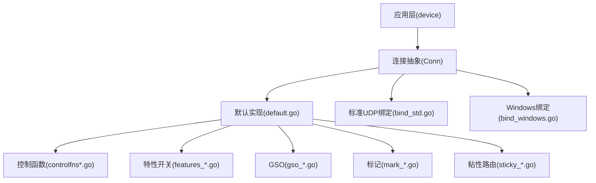
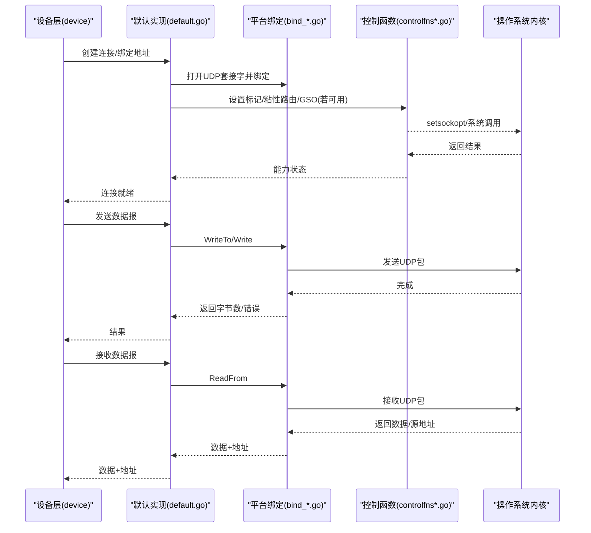
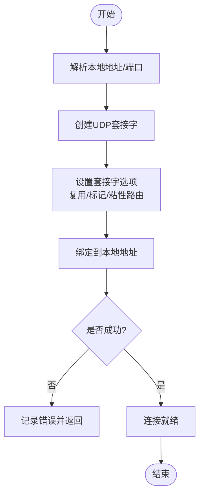
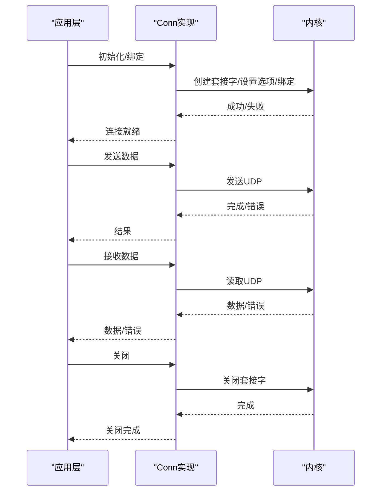
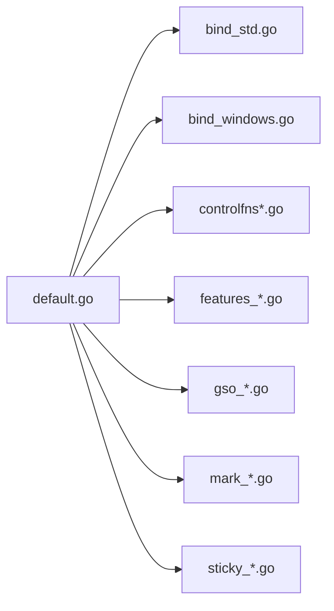

# 连接层

<cite>
**本文引用的文件**
- [conn.go](file://conn/conn.go)
- [bind_std.go](file://conn/bind_std.go)
- [bind_windows.go](file://conn/bind_windows.go)
- [controlfns.go](file://conn/controlfns.go)
- [controlfns_linux.go](file://conn/controlfns_linux.go)
- [controlfns_unix.go](file://conn/controlfns_unix.go)
- [controlfns_windows.go](file://conn/controlfns_windows.go)
- [default.go](file://conn/default.go)
- [errors_default.go](file://conn/errors_default.go)
- [errors_linux.go](file://conn/errors_linux.go)
- [features_default.go](file://conn/features_default.go)
- [features_linux.go](file://conn/features_linux.go)
- [gso_default.go](file://conn/gso_default.go)
- [gso_linux.go](file://conn/gso_linux.go)
- [mark_default.go](file://conn/mark_default.go)
- [mark_unix.go](file://conn/mark_unix.go)
- [sticky_default.go](file://conn/sticky_default.go)
- [sticky_linux.go](file://conn/sticky_linux.go)
</cite>

## 目录
1. [简介](#简介)
2. [项目结构](#项目结构)
3. [核心组件](#核心组件)
4. [架构总览](#架构总览)
5. [详细组件分析](#详细组件分析)
6. [依赖关系分析](#依赖关系分析)
7. [性能考量](#性能考量)
8. [故障排查指南](#故障排查指南)
9. [结论](#结论)
10. [附录](#附录)

## 简介
本章节面向 wireguard-go 的网络连接层，聚焦于 Conn 接口的设计与抽象、UDP 连接的绑定/监听/管理、连接池与复用策略、控制函数与网络参数配置、连接建立/维护/关闭的完整流程，以及平台特定的优化与扩展指南。目标是帮助读者在不深入源码细节的前提下，理解连接层的职责边界、关键机制与可定制点。

## 项目结构
连接层位于 conn 目录，采用“接口 + 平台适配”的分层组织方式：
- 接口与默认实现：定义统一的连接抽象（Conn）和默认行为（default.go），屏蔽底层差异。
- 平台绑定实现：针对标准库 UDP 与 Windows 特定实现（bind_std.go、bind_windows.go）。
- 控制函数：提供系统调用封装，用于设置套接字选项、标记、粘性路由等（controlfns*.go）。
- 特性开关与错误处理：按平台启用 GSO、标记、粘性路由等能力（features_*.go、errors_*.go）。
- 辅助能力：GSO、标记、粘性路由等具体实现（gso_*.go、mark_*.go、sticky_*.go）。

图表来源
- [conn.go:1-200](file://conn/conn.go#L1-L200)
- [default.go:1-200](file://conn/default.go#L1-L200)
- [bind_std.go:1-200](file://conn/bind_std.go#L1-L200)
- [bind_windows.go:1-200](file://conn/bind_windows.go#L1-L200)
- [controlfns.go:1-200](file://conn/controlfns.go#L1-L200)
- [features_default.go:1-200](file://conn/features_default.go#L1-L200)
- [gso_default.go:1-200](file://conn/gso_default.go#L1-L200)
- [mark_default.go:1-200](file://conn/mark_default.go#L1-L200)
- [sticky_default.go:1-200](file://conn/sticky_default.go#L1-L200)

章节来源
- [conn.go:1-200](file://conn/conn.go#L1-L200)
- [default.go:1-200](file://conn/default.go#L1-L200)

## 核心组件
- Conn 接口：统一抽象出 UDP 套接字的读写、绑定、监听、关闭、可选的 GSO/标记/粘性路由能力。上层 device 仅依赖该接口，不关心底层实现。
- 默认实现：封装了连接生命周期管理、错误处理、能力探测与降级、以及与平台绑定的组合。
- 平台绑定：
  - 标准库绑定：基于 net.ListenUDP/net.DialUDP，适用于大多数平台。
  - Windows 绑定：利用 Windows 特定 API 以获取更好的性能或功能（如 IOCP 相关优化）。
- 控制函数：集中封装 setsockopt/getsockopt、标记、粘性路由等系统调用，跨平台通过构建标签选择实现。
- 特性开关：按平台启用/禁用 GSO、标记、粘性路由等高级特性。
- 错误处理：提供平台相关的错误类型与语义映射。

章节来源
- [conn.go:1-200](file://conn/conn.go#L1-L200)
- [default.go:1-200](file://conn/default.go#L1-L200)
- [bind_std.go:1-200](file://conn/bind_std.go#L1-L200)
- [bind_windows.go:1-200](file://conn/bind_windows.go#L1-L200)
- [controlfns.go:1-200](file://conn/controlfns.go#L1-L200)
- [features_default.go:1-200](file://conn/features_default.go#L1-L200)
- [gso_default.go:1-200](file://conn/gso_default.go#L1-L200)
- [mark_default.go:1-200](file://conn/mark_default.go#L1-L200)
- [sticky_default.go:1-200](file://conn/sticky_default.go#L1-L200)

## 架构总览
连接层将“协议无关的 UDP 传输”抽象为 Conn 接口，并通过默认实现聚合平台绑定与控制函数。设备层通过 Conn 进行数据报收发，无需感知平台差异。

图表来源
- [default.go:1-200](file://conn/default.go#L1-L200)
- [bind_std.go:1-200](file://conn/bind_std.go#L1-L200)
- [bind_windows.go:1-200](file://conn/bind_windows.go#L1-L200)
- [controlfns.go:1-200](file://conn/controlfns.go#L1-L200)

## 详细组件分析

### Conn 接口设计与抽象层次
- 设计目标：为设备层提供统一的 UDP 传输抽象，屏蔽平台差异；支持可选的高级特性（GSO、标记、粘性路由）。
- 主要职责：
  - 绑定与监听：绑定本地端口/地址，支持多路复用。
  - 读写数据报：面向无连接的 UDP 数据报收发。
  - 资源管理：连接的创建、配置、关闭与错误处理。
  - 能力探测：根据平台与内核能力启用/禁用特性。
- 抽象层次：
  - 接口层：Conn 定义最小必要方法集。
  - 默认实现层：组合平台绑定与控制函数，提供通用逻辑与降级策略。
  - 平台适配层：针对不同操作系统的具体实现。

章节来源
- [conn.go:1-200](file://conn/conn.go#L1-L200)
- [default.go:1-200](file://conn/default.go#L1-L200)

### UDP 连接的绑定、监听与管理
- 绑定流程：
  - 解析本地地址与端口，创建 UDP 套接字。
  - 设置必要的套接字选项（如复用、标记、粘性路由）。
  - 绑定到指定地址，进入监听状态。
- 监听与复用：
  - 支持在同一端口上被多个连接共享（取决于平台与选项）。
  - 接收路径从同一套接字读取数据报，交由设备层分发。
- 管理要点：
  - 错误重试与降级：当某些特性不可用时自动回退。
  - 资源清理：确保在关闭时释放套接字与系统资源。

图表来源
- [bind_std.go:1-200](file://conn/bind_std.go#L1-L200)
- [bind_windows.go:1-200](file://conn/bind_windows.go#L1-L200)
- [controlfns.go:1-200](file://conn/controlfns.go#L1-L200)

章节来源
- [bind_std.go:1-200](file://conn/bind_std.go#L1-L200)
- [bind_windows.go:1-200](file://conn/bind_windows.go#L1-L200)

### 连接池与连接复用策略
- 复用模型：
  - 由于 UDP 是无连接协议，通常不需要传统意义上的“连接池”。
  - 复用体现在：同一本地端口/套接字可被多个对端使用；设备层可按远端地址/端口进行逻辑复用。
- 策略建议：
  - 避免频繁创建/销毁套接字，尽量复用已绑定的 UDP 套接字。
  - 在高并发场景下，结合平台特性（如 IOCP、epoll）提升吞吐。
  - 合理设置缓冲区大小与超时，减少阻塞与抖动。

章节来源
- [default.go:1-200](file://conn/default.go#L1-L200)
- [features_default.go:1-200](file://conn/features_default.go#L1-L200)

### 控制函数的作用与网络参数配置
- 控制函数职责：
  - 封装 setsockopt/getsockopt 等系统调用，提供一致的接口。
  - 支持标记（mark）、粘性路由（sticky routing）、GSO 等特性开关。
- 常见配置项：
  - 套接字复用：允许同一端口被多个实例绑定。
  - 数据包标记：用于路由策略或防火墙规则匹配。
  - 粘性路由：固定出站路径，提高一致性。
  - GSO：分段卸载，降低 CPU 开销。
- 平台差异：
  - Linux 提供丰富的套接字选项与内核卸载能力。
  - Windows 通过特定 API 获得类似能力。
  - 其他平台可能部分能力不可用，需降级处理。

章节来源
- [controlfns.go:1-200](file://conn/controlfns.go#L1-L200)
- [controlfns_linux.go:1-200](file://conn/controlfns_linux.go#L1-L200)
- [controlfns_unix.go:1-200](file://conn/controlfns_unix.go#L1-L200)
- [controlfns_windows.go:1-200](file://conn/controlfns_windows.go#L1-L200)
- [features_default.go:1-200](file://conn/features_default.go#L1-L200)
- [features_linux.go:1-200](file://conn/features_linux.go#L1-L200)

### 连接建立、维护与关闭的完整流程
- 建立：
  - 解析地址 -> 创建套接字 -> 设置选项 -> 绑定 -> 能力探测 -> 就绪。
- 维护：
  - 发送：写入数据报，处理部分发送与重试。
  - 接收：从套接字读取数据报，解析源地址并交给设备层。
  - 监控：检测错误、超时与资源泄漏，必要时重建。
- 关闭：
  - 停止接收/发送 -> 关闭套接字 -> 释放资源 -> 通知上层。

图表来源
- [default.go:1-200](file://conn/default.go#L1-L200)
- [bind_std.go:1-200](file://conn/bind_std.go#L1-L200)
- [bind_windows.go:1-200](file://conn/bind_windows.go#L1-L200)

章节来源
- [default.go:1-200](file://conn/default.go#L1-L200)

### 平台特定的连接优化与性能调优选项
- Linux：
  - 启用 GSO 以降低 CPU 占用。
  - 使用套接字标记配合路由表/策略路由。
  - 调整缓冲区大小与队列长度以提升吞吐。
- Windows：
  - 使用 IOCP 与异步 I/O 提升高并发性能。
  - 合理设置超时与重试策略。
- 通用：
  - 复用套接字，避免频繁创建/销毁。
  - 根据负载动态调整缓冲与超时。
  - 监控丢包与延迟，及时告警。

章节来源
- [gso_linux.go:1-200](file://conn/gso_linux.go#L1-L200)
- [gso_default.go:1-200](file://conn/gso_default.go#L1-L200)
- [mark_unix.go:1-200](file://conn/mark_unix.go#L1-L200)
- [mark_default.go:1-200](file://conn/mark_default.go#L1-L200)
- [sticky_linux.go:1-200](file://conn/sticky_linux.go#L1-L200)
- [sticky_default.go:1-200](file://conn/sticky_default.go#L1-L200)

### 连接层的扩展指南与自定义实现示例
- 扩展点：
  - 实现 Conn 接口以替换默认实现。
  - 新增控制函数以支持新的套接字选项。
  - 添加平台特性开关以启用新能力。
- 自定义步骤：
  - 定义新的绑定实现（如基于特定网络栈或代理）。
  - 在默认实现中集成新绑定与控制函数。
  - 提供测试用例验证正确性与性能。
- 注意事项：
  - 保持向后兼容，避免破坏现有接口契约。
  - 明确能力探测与降级策略。
  - 完善错误处理与日志记录。

章节来源
- [conn.go:1-200](file://conn/conn.go#L1-L200)
- [default.go:1-200](file://conn/default.go#L1-L200)
- [controlfns.go:1-200](file://conn/controlfns.go#L1-L200)

## 依赖关系分析
连接层内部模块之间的依赖关系如下：
- default.go 依赖 bind_* 与 controlfns*，并组合 features_*、gso_*、mark_*、sticky_*。
- bind_std.go 与 bind_windows.go 分别实现平台特定的绑定逻辑。
- controlfns*.go 提供跨平台的系统调用封装。
- features_*.go 控制特性开关。
- gso_*.go、mark_*.go、sticky_*.go 提供具体能力实现。

图表来源
- [default.go:1-200](file://conn/default.go#L1-L200)
- [bind_std.go:1-200](file://conn/bind_std.go#L1-L200)
- [bind_windows.go:1-200](file://conn/bind_windows.go#L1-L200)
- [controlfns.go:1-200](file://conn/controlfns.go#L1-L200)
- [features_default.go:1-200](file://conn/features_default.go#L1-L200)
- [gso_default.go:1-200](file://conn/gso_default.go#L1-L200)
- [mark_default.go:1-200](file://conn/mark_default.go#L1-L200)
- [sticky_default.go:1-200](file://conn/sticky_default.go#L1-L200)

章节来源
- [default.go:1-200](file://conn/default.go#L1-L200)

## 性能考量
- 套接字复用：减少上下文切换与资源分配开销。
- GSO：在 Linux 上显著降低 CPU 占用，提高吞吐。
- 缓冲区大小：根据带宽与延迟调整，避免拥塞或浪费。
- 超时与重试：平衡实时性与可靠性。
- 平台优化：充分利用 IOCP（Windows）或 epoll（Linux）等异步 I/O。

[本节为通用指导，不直接分析具体文件]

## 故障排查指南
- 常见问题：
  - 绑定失败：检查端口占用与权限。
  - 发送失败：检查路由与防火墙规则。
  - 接收异常：检查地址解析与缓冲区大小。
- 诊断步骤：
  - 启用详细日志，记录错误码与堆栈。
  - 使用网络抓包工具验证数据流。
  - 逐步禁用特性（如 GSO、标记）定位问题。
- 恢复策略：
  - 自动重试与降级。
  - 重启连接或切换备用路径。

章节来源
- [errors_default.go:1-200](file://conn/errors_default.go#L1-L200)
- [errors_linux.go:1-200](file://conn/errors_linux.go#L1-L200)

## 结论
连接层通过 Conn 接口实现了 UDP 传输的统一抽象，结合平台绑定与控制函数，提供了可扩展、高性能且易于维护的网络传输基础。在实际部署中，应根据平台特性与业务需求选择合适的优化选项，并建立完善的监控与故障排查机制。

[本节为总结性内容，不直接分析具体文件]

## 附录
- 术语表：
  - GSO：分段卸载，减少 CPU 开销。
  - 标记：用于路由或策略匹配的套接字标记。
  - 粘性路由：固定出站路径，提高一致性。
- 参考链接：
  - 平台文档与最佳实践。
  - 相关 RFC 与内核文档。

[本节为补充信息，不直接分析具体文件]