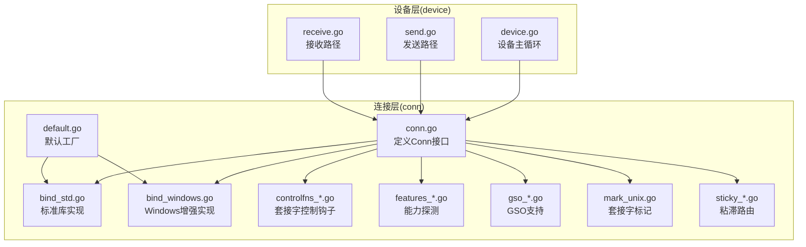
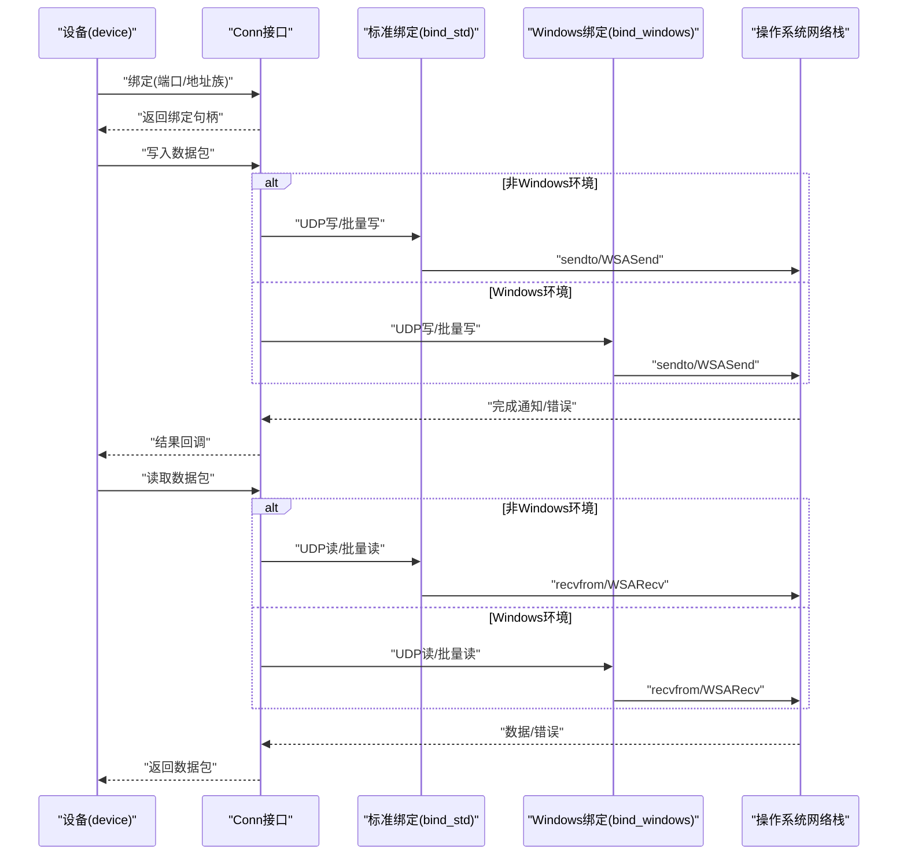
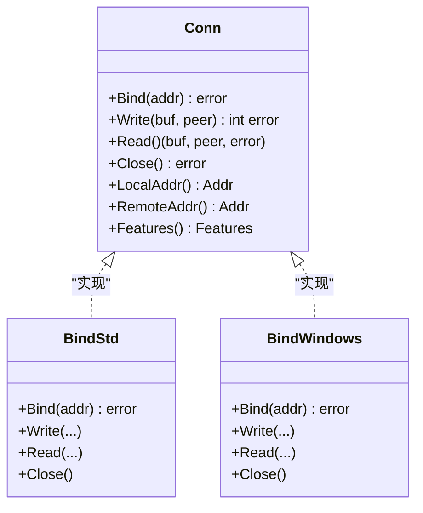
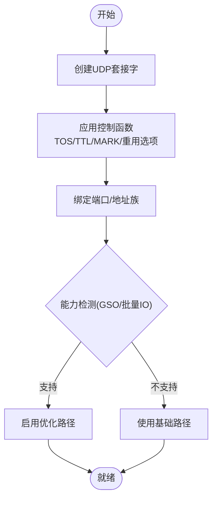
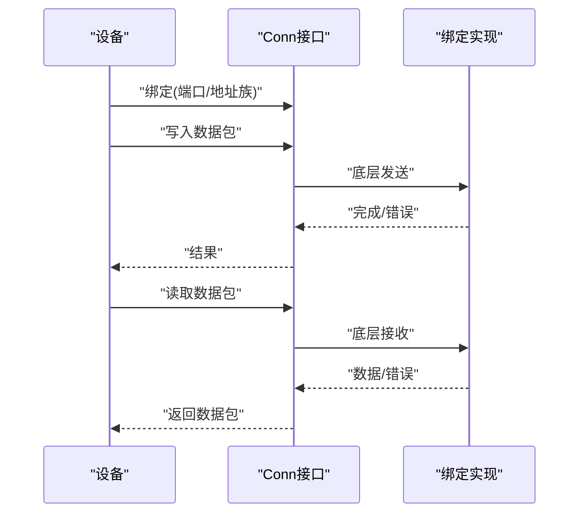
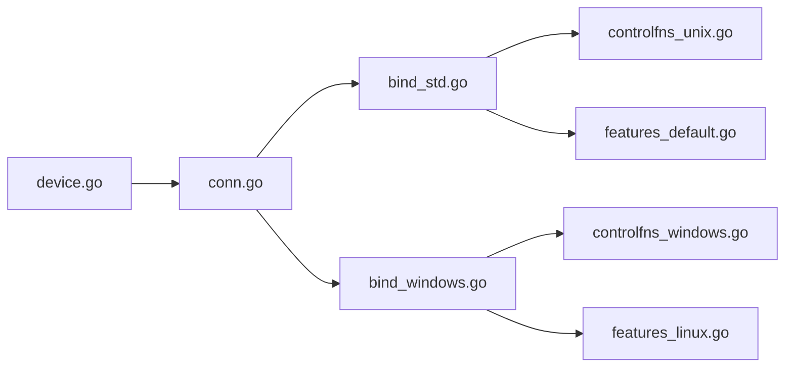

# 连接接口设计

<cite>
**本文引用的文件**
- [conn.go](file://conn/conn.go)
- [bind_std.go](file://conn/bind_std.go)
- [bind_windows.go](file://conn/bind_windows.go)
- [default.go](file://conn/default.go)
- [controlfns_unix.go](file://conn/controlfns_unix.go)
- [controlfns_linux.go](file://conn/controlfns_linux.go)
- [controlfns_windows.go](file://conn/controlfns_windows.go)
- [features_default.go](file://conn/features_default.go)
- [features_linux.go](file://conn/features_linux.go)
- [gso_default.go](file://conn/gso_default.go)
- [gso_linux.go](file://conn/gso_linux.go)
- [mark_unix.go](file://conn/mark_unix.go)
- [sticky_default.go](file://conn/sticky_default.go)
- [sticky_linux.go](file://conn/sticky_linux.go)
- [device.go](file://device/device.go)
- [send.go](file://device/send.go)
- [receive.go](file://device/receive.go)
</cite>

## 目录
1. [简介](#简介)
2. [项目结构](#项目结构)
3. [核心组件](#核心组件)
4. [架构总览](#架构总览)
5. [详细组件分析](#详细组件分析)
6. [依赖关系分析](#依赖关系分析)
7. [性能考量](#性能考量)
8. [故障排查指南](#故障排查指南)
9. [结论](#结论)
10. [附录](#附录)

## 简介
本文件面向 wireguard-go 的连接层抽象，聚焦于 conn 包中的“连接接口”设计。文档解释 Conn 接口的核心抽象与职责边界，说明绑定、监听、读写等方法的分工；阐述连接状态与生命周期管理；解释如何通过平台特定的实现适配不同传输协议与网络栈；提供扩展机制与自定义实现的指引；并给出与上层设备交互模式及错误处理策略的说明。

## 项目结构
连接层位于 conn 包中，采用“接口 + 平台特定实现”的组织方式：
- 接口定义集中在 conn/conn.go，统一暴露绑定、监听、读写、特性查询等方法。
- 默认/通用实现位于 bind_std.go（基于标准库 net），用于跨平台基础能力。
- 平台增强实现位于 bind_windows.go 以及若干 *_linux.go、*_windows.go 文件，提供系统级优化（如 GSO、标记、粘滞路由等）。
- 控制函数 controlfns_* 提供可插拔的网络套接字配置钩子。
- 特性探测 features_* 提供运行时能力检测（例如是否支持 GSO）。
- 默认工厂 default.go 负责选择并创建合适的绑定实例。
- 上层 device 通过统一的绑定接口进行收发，屏蔽底层差异。

图表来源
- [conn.go:1-200](file://conn/conn.go#L1-L200)
- [bind_std.go:1-200](file://conn/bind_std.go#L1-L200)
- [bind_windows.go:1-200](file://conn/bind_windows.go#L1-L200)
- [default.go:1-200](file://conn/default.go#L1-L200)
- [device.go:1-200](file://device/device.go#L1-L200)
- [send.go:1-200](file://device/send.go#L1-L200)
- [receive.go:1-200](file://device/receive.go#L1-L200)

章节来源
- [conn.go:1-200](file://conn/conn.go#L1-L200)
- [default.go:1-200](file://conn/default.go#L1-L200)

## 核心组件
- 连接接口（Conn）：定义绑定、监听、读写、关闭、地址获取、特性查询等统一方法集，屏蔽底层网络栈差异。
- 绑定实现（Bind）：具体网络端点的绑定与数据面操作，包括 UDP 套接字封装、系统调用优化、队列与缓冲管理。
- 控制函数（Control Functions）：在创建/复用套接字时注入平台相关配置（如 TOS、TTL、MARK、SO_REUSEADDR 等）。
- 特性探测（Features）：运行时检测是否支持 GSO、零拷贝、批量 IO 等能力，驱动上层行为切换。
- 默认工厂（Default Bind）：根据运行环境与编译标签选择最优绑定实现。

职责划分要点
- 绑定与监听：负责端口绑定、多路复用、地址族选择（IPv4/IPv6）、回环/外网区分。
- 读写操作：提供面向数据包的数据面读写，包含超时、取消、批量收发、错误分类。
- 状态与生命周期：封装打开、关闭、重绑、资源清理，保证并发安全。
- 协议与网络栈适配：通过平台特定实现与特性探测，适配不同内核与网络栈。

章节来源
- [conn.go:1-200](file://conn/conn.go#L1-L200)
- [bind_std.go:1-200](file://conn/bind_std.go#L1-L200)
- [bind_windows.go:1-200](file://conn/bind_windows.go#L1-L200)
- [features_default.go:1-200](file://conn/features_default.go#L1-L200)
- [features_linux.go:1-200](file://conn/features_linux.go#L1-L200)
- [default.go:1-200](file://conn/default.go#L1-L200)

## 架构总览
连接层向上为 device 提供统一的绑定接口，向下通过平台特定实现对接操作系统网络栈。设备侧的发送与接收路径仅依赖接口，不感知具体实现细节。

图表来源
- [device.go:1-200](file://device/device.go#L1-L200)
- [send.go:1-200](file://device/send.go#L1-L200)
- [receive.go:1-200](file://device/receive.go#L1-L200)
- [bind_std.go:1-200](file://conn/bind_std.go#L1-L200)
- [bind_windows.go:1-200](file://conn/bind_windows.go#L1-L200)

## 详细组件分析

### 连接接口（Conn）抽象与职责
- 绑定与监听：统一入口，接受地址族与端口参数，返回可用于读写的绑定对象。
- 读写操作：提供面向数据包的读写方法，支持超时、取消、批量收发；对底层错误进行分类与包装。
- 地址与特性：暴露本地/远端地址信息，以及运行时能力（如 GSO、批量IO）查询。
- 生命周期：封装打开、关闭、重绑等操作，确保资源释放与并发安全。

图表来源
- [conn.go:1-200](file://conn/conn.go#L1-L200)
- [bind_std.go:1-200](file://conn/bind_std.go#L1-L200)
- [bind_windows.go:1-200](file://conn/bind_windows.go#L1-L200)

章节来源
- [conn.go:1-200](file://conn/conn.go#L1-L200)

### 绑定实现（标准与Windows）
- 标准绑定（bind_std.go）：基于标准库 net 的 UDP 套接字，提供跨平台的基础绑定、读写、关闭能力。
- Windows 绑定（bind_windows.go）：在标准能力之上，利用 Windows 网络栈特性（如重叠IO、批量收发）提升吞吐与降低延迟。
- 共同点：均遵循 Conn 接口契约，对外暴露一致的语义；内部使用缓冲池、队列与超时控制，避免阻塞与内存抖动。

图表来源
- [bind_std.go:1-200](file://conn/bind_std.go#L1-L200)
- [bind_windows.go:1-200](file://conn/bind_windows.go#L1-L200)
- [controlfns_unix.go:1-200](file://conn/controlfns_unix.go#L1-L200)
- [controlfns_linux.go:1-200](file://conn/controlfns_linux.go#L1-L200)
- [controlfns_windows.go:1-200](file://conn/controlfns_windows.go#L1-L200)
- [features_default.go:1-200](file://conn/features_default.go#L1-L200)
- [features_linux.go:1-200](file://conn/features_linux.go#L1-L200)

章节来源
- [bind_std.go:1-200](file://conn/bind_std.go#L1-L200)
- [bind_windows.go:1-200](file://conn/bind_windows.go#L1-L200)
- [controlfns_unix.go:1-200](file://conn/controlfns_unix.go#L1-L200)
- [controlfns_linux.go:1-200](file://conn/controlfns_linux.go#L1-L200)
- [controlfns_windows.go:1-200](file://conn/controlfns_windows.go#L1-L200)
- [features_default.go:1-200](file://conn/features_default.go#L1-L200)
- [features_linux.go:1-200](file://conn/features_linux.go#L1-L200)

### 控制函数与特性探测
- 控制函数（controlfns_*）：在套接字创建或复用时注入平台相关配置，如 TOS、TTL、MARK、SO_REUSEADDR、粘滞路由等。
- 特性探测（features_*）：运行时检测内核/栈能力（如 GSO），决定启用优化路径或降级到兼容路径。
- 作用：在不改变上层接口的前提下，最大化利用平台能力，同时保持向后兼容。

章节来源
- [controlfns_unix.go:1-200](file://conn/controlfns_unix.go#L1-L200)
- [controlfns_linux.go:1-200](file://conn/controlfns_linux.go#L1-L200)
- [controlfns_windows.go:1-200](file://conn/controlfns_windows.go#L1-L200)
- [features_default.go:1-200](file://conn/features_default.go#L1-L200)
- [features_linux.go:1-200](file://conn/features_linux.go#L1-L200)

### 默认工厂与平台选择
- 默认工厂（default.go）：根据编译标签与运行环境选择最合适的绑定实现（标准或 Windows 增强）。
- 目标：简化上层集成，自动获得最佳实践与平台优化。

章节来源
- [default.go:1-200](file://conn/default.go#L1-L200)

### 与上层设备的交互模式
- 设备侧（device.go）通过 Conn 接口进行绑定与读写，不关心具体实现。
- 发送路径（send.go）将加密后的数据包交给绑定层发送，处理超时与错误。
- 接收路径（receive.go）从绑定层读取数据包，解封装后进入设备状态机。

图表来源
- [device.go:1-200](file://device/device.go#L1-L200)
- [send.go:1-200](file://device/send.go#L1-L200)
- [receive.go:1-200](file://device/receive.go#L1-L200)
- [conn.go:1-200](file://conn/conn.go#L1-L200)

章节来源
- [device.go:1-200](file://device/device.go#L1-L200)
- [send.go:1-200](file://device/send.go#L1-L200)
- [receive.go:1-200](file://device/receive.go#L1-L200)

### 连接状态管理与生命周期
- 状态：未绑定 -> 已绑定 -> 使用中 -> 关闭。
- 生命周期：
  - 绑定阶段：创建套接字、应用控制函数、绑定端口、能力检测。
  - 使用阶段：并发安全的读写、超时与取消、错误分类。
  - 关闭阶段：释放套接字、清空缓冲、通知等待者。
- 并发模型：读写操作需线程安全；关闭应中断所有阻塞操作。

章节来源
- [conn.go:1-200](file://conn/conn.go#L1-L200)
- [bind_std.go:1-200](file://conn/bind_std.go#L1-L200)
- [bind_windows.go:1-200](file://conn/bind_windows.go#L1-L200)

### 扩展机制与自定义实现指南
- 扩展点：
  - 实现 Conn 接口以替换默认绑定。
  - 注册新的控制函数以定制套接字行为。
  - 扩展特性探测以启用新优化路径。
- 步骤建议：
  - 定义新的绑定类型，实现绑定、读写、关闭、地址与特性方法。
  - 在默认工厂中增加条件分支以选择新实现。
  - 编写测试覆盖关键路径（绑定、读写、关闭、错误）。
  - 逐步引入平台优化（GSO、批量IO、标记等）。

章节来源
- [conn.go:1-200](file://conn/conn.go#L1-L200)
- [default.go:1-200](file://conn/default.go#L1-L200)
- [controlfns_unix.go:1-200](file://conn/controlfns_unix.go#L1-L200)
- [features_default.go:1-200](file://conn/features_default.go#L1-L200)

### 错误处理策略
- 错误分类：网络不可达、权限不足、超时、取消、缓冲区溢出等。
- 传播策略：向上传播结构化错误，便于上层重试或降级。
- 恢复策略：在适当时机尝试重绑或切换路径；记录诊断信息以便排障。

章节来源
- [conn.go:1-200](file://conn/conn.go#L1-L200)
- [bind_std.go:1-200](file://conn/bind_std.go#L1-L200)
- [bind_windows.go:1-200](file://conn/bind_windows.go#L1-L200)

## 依赖关系分析
- 设备层依赖 Conn 接口，不直接依赖具体绑定实现。
- 绑定实现依赖控制函数与特性探测，动态启用优化。
- 平台特定文件通过编译标签与运行时检测组合，形成最小化依赖。

图表来源
- [device.go:1-200](file://device/device.go#L1-L200)
- [conn.go:1-200](file://conn/conn.go#L1-L200)
- [bind_std.go:1-200](file://conn/bind_std.go#L1-L200)
- [bind_windows.go:1-200](file://conn/bind_windows.go#L1-L200)
- [controlfns_unix.go:1-200](file://conn/controlfns_unix.go#L1-L200)
- [controlfns_windows.go:1-200](file://conn/controlfns_windows.go#L1-L200)
- [features_default.go:1-200](file://conn/features_default.go#L1-L200)
- [features_linux.go:1-200](file://conn/features_linux.go#L1-L200)

章节来源
- [device.go:1-200](file://device/device.go#L1-L200)
- [conn.go:1-200](file://conn/conn.go#L1-L200)

## 性能考量
- 批量收发：在支持的平台启用批量读写以降低系统调用开销。
- GSO 支持：减少分片与拷贝，提高吞吐。
- 缓冲池：复用缓冲区，减少分配与 GC 压力。
- 超时与取消：避免长时间阻塞，提升响应性。
- 平台优化：Windows 下利用重叠IO与队列，Linux 下利用内核特性。

[本节为通用性能讨论，不直接分析具体文件]

## 故障排查指南
- 常见问题：
  - 绑定失败：检查端口占用、权限、地址族兼容性。
  - 读写超时：检查网络连通性、MTU、防火墙规则。
  - 性能下降：确认是否启用了批量IO/GSO，检查内核版本与驱动。
- 诊断手段：
  - 启用日志与错误分类，定位失败阶段。
  - 使用抓包工具验证数据包流向。
  - 切换绑定实现对比性能与稳定性。

章节来源
- [conn.go:1-200](file://conn/conn.go#L1-L200)
- [bind_std.go:1-200](file://conn/bind_std.go#L1-L200)
- [bind_windows.go:1-200](file://conn/bind_windows.go#L1-L200)

## 结论
Conn 接口通过统一的抽象屏蔽了底层网络栈差异，使设备层能够专注于协议逻辑。平台特定的绑定实现与控制函数、特性探测相结合，既保证了兼容性，又实现了高性能。通过扩展机制，开发者可以按需定制连接行为，满足多样化场景需求。

[本节为总结性内容，不直接分析具体文件]

## 附录
- 自定义连接类型示例（概念性步骤）：
  - 定义新类型并实现 Conn 接口方法。
  - 在默认工厂中注册新实现的选择逻辑。
  - 添加控制函数与特性探测以启用优化。
  - 编写单元测试与集成测试覆盖关键路径。
- 参考路径（不包含代码内容）：
  - 接口定义：[conn.go:1-200](file://conn/conn.go#L1-L200)
  - 标准实现：[bind_std.go:1-200](file://conn/bind_std.go#L1-L200)
  - Windows 实现：[bind_windows.go:1-200](file://conn/bind_windows.go#L1-L200)
  - 控制函数：[controlfns_unix.go:1-200](file://conn/controlfns_unix.go#L1-L200), [controlfns_linux.go:1-200](file://conn/controlfns_linux.go#L1-L200), [controlfns_windows.go:1-200](file://conn/controlfns_windows.go#L1-L200)
  - 特性探测：[features_default.go:1-200](file://conn/features_default.go#L1-L200), [features_linux.go:1-200](file://conn/features_linux.go#L1-L200)
  - 默认工厂：[default.go:1-200](file://conn/default.go#L1-L200)
  - 设备交互：[device.go:1-200](file://device/device.go#L1-L200), [send.go:1-200](file://device/send.go#L1-L200), [receive.go:1-200](file://device/receive.go#L1-L200)