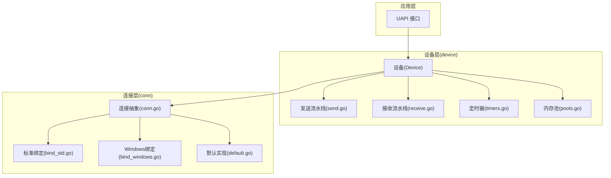
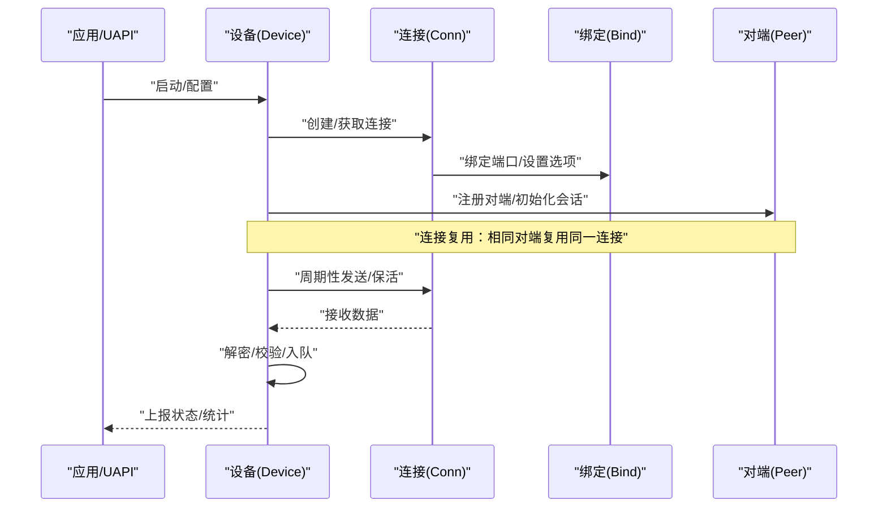
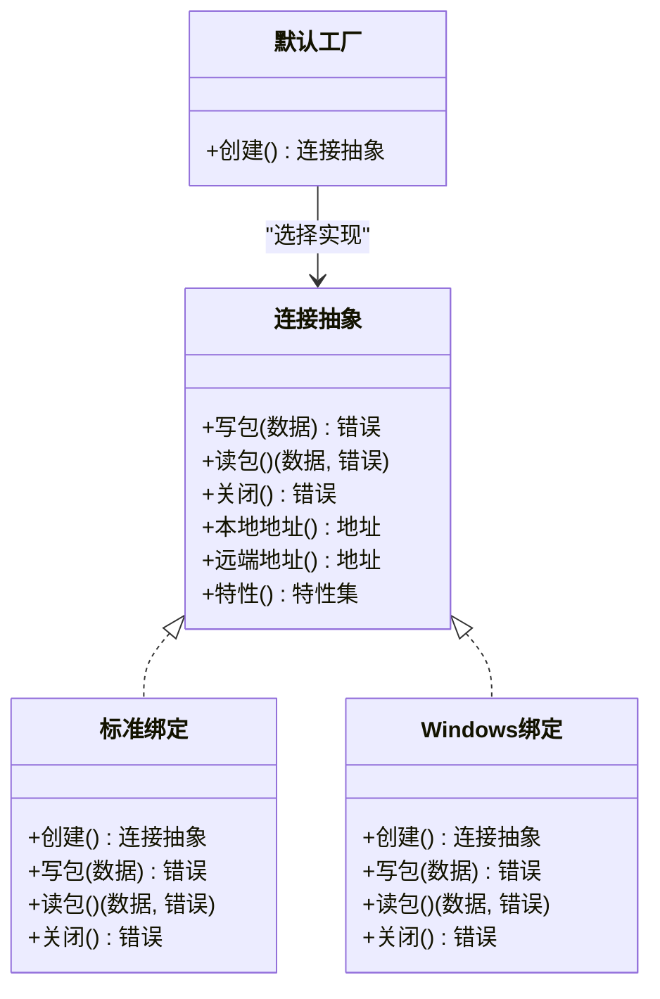
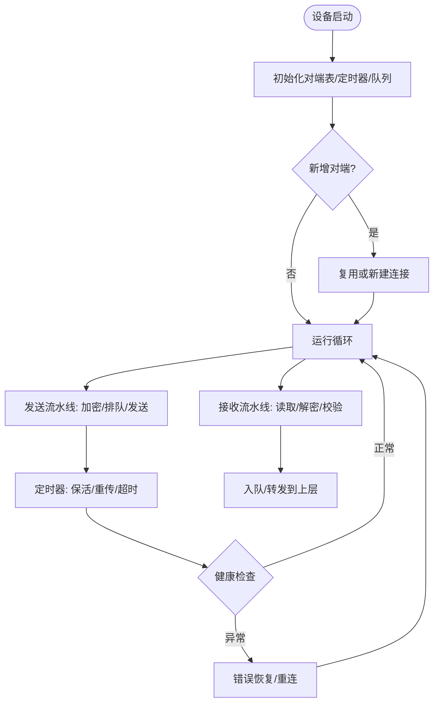
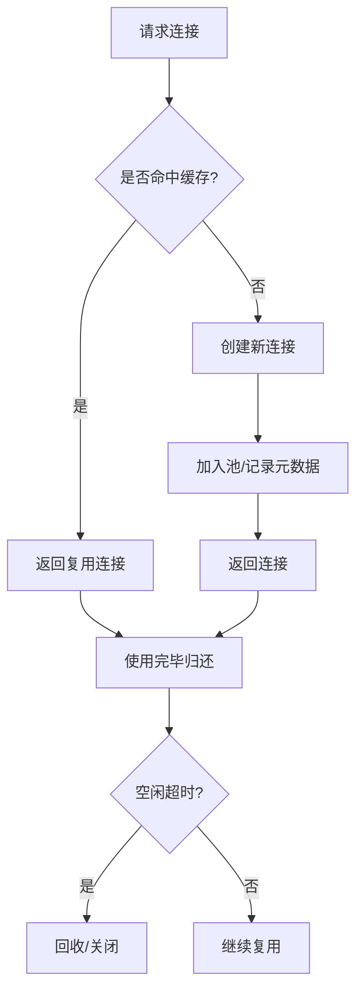
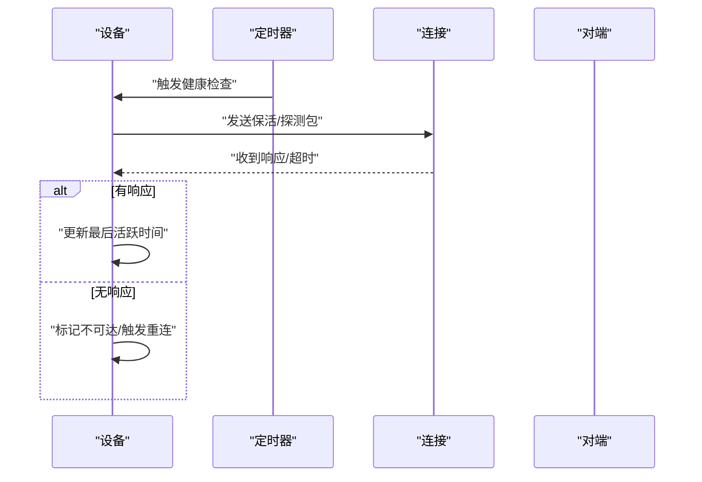
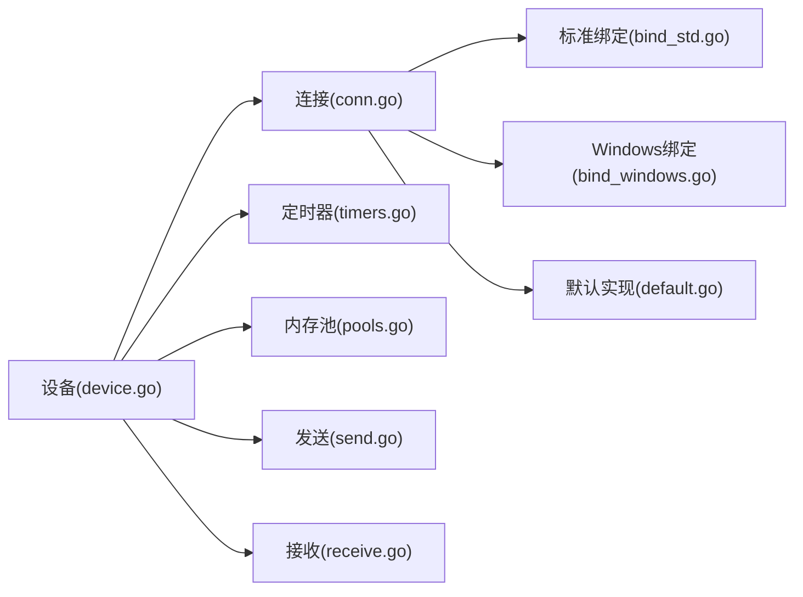

# 连接管理

<cite>
**本文引用的文件**
- [conn.go](file://conn/conn.go)
- [bind_std.go](file://conn/bind_std.go)
- [bind_windows.go](file://conn/bind_windows.go)
- [default.go](file://conn/default.go)
- [device.go](file://device/device.go)
- [send.go](file://device/send.go)
- [receive.go](file://device/receive.go)
- [timers.go](file://device/timers.go)
- [pools.go](file://device/pools.go)
- [uapi_linux.go](file://ipc/uapi_linux.go)
- [uapi_windows.go](file://ipc/uapi_windows.go)
</cite>

## 目录
1. [简介](#简介)
2. [项目结构](#项目结构)
3. [核心组件](#核心组件)
4. [架构总览](#架构总览)
5. [详细组件分析](#详细组件分析)
6. [依赖关系分析](#依赖关系分析)
7. [性能考量](#性能考量)
8. [故障排查指南](#故障排查指南)
9. [结论](#结论)
10. [附录](#附录)

## 简介
本文件聚焦 wireguard-go 的连接管理，围绕连接的创建、维护与销毁流程，连接池与复用策略，状态监控与健康检查，错误处理与恢复，超时管理与资源清理，并发安全与锁机制，以及性能监控与调试工具的使用进行系统化说明。文档同时提供常见问题的诊断与解决方案，帮助读者快速定位并解决连接相关问题。

## 项目结构
连接管理主要分布在以下模块：
- conn: 网络套接字抽象与绑定实现（UDP/TCP），负责底层 I/O、端口复用、控制函数注入等。
- device: 设备层，封装对端 Peer、队列、定时器、发送/接收流水线、密钥交换与数据面收发。
- ipc: UAPI 接口，用于配置与查询设备状态（包括连接信息）。
- tun: TUN 设备抽象，承载上层协议报文。

图表来源
- [device.go:1-200](file://device/device.go#L1-L200)
- [conn.go:1-200](file://conn/conn.go#L1-L200)
- [bind_std.go:1-200](file://conn/bind_std.go#L1-L200)
- [bind_windows.go:1-200](file://conn/bind_windows.go#L1-L200)
- [default.go:1-200](file://conn/default.go#L1-L200)

章节来源
- [device.go:1-200](file://device/device.go#L1-L200)
- [conn.go:1-200](file://conn/conn.go#L1-L200)
- [bind_std.go:1-200](file://conn/bind_std.go#L1-L200)
- [bind_windows.go:1-200](file://conn/bind_windows.go#L1-L200)
- [default.go:1-200](file://conn/default.go#L1-L200)

## 核心组件
- 连接抽象与绑定
  - 统一连接接口：封装读写、关闭、地址获取、特性探测等能力。
  - 平台绑定：标准实现与 Windows 特定实现，屏蔽系统差异。
  - 默认工厂：根据运行环境选择合适绑定。
- 设备与对端
  - 设备维护多个对端（Peer）及其连接状态、会话密钥、计时器与队列。
  - 发送/接收流水线：将加密后的数据包写入连接或从连接读取解密。
- 定时器与健康检查
  - 基于定时器的保活、重传、会话过期与对端可达性检测。
- 内存池与缓冲
  - 复用缓冲区，减少分配与 GC 压力，提升吞吐。
- UAPI 接口
  - 暴露连接状态、统计信息与配置变更入口。

章节来源
- [conn.go:1-200](file://conn/conn.go#L1-L200)
- [bind_std.go:1-200](file://conn/bind_std.go#L1-L200)
- [bind_windows.go:1-200](file://conn/bind_windows.go#L1-L200)
- [default.go:1-200](file://conn/default.go#L1-L200)
- [device.go:1-200](file://device/device.go#L1-L200)
- [send.go:1-200](file://device/send.go#L1-L200)
- [receive.go:1-200](file://device/receive.go#L1-L200)
- [timers.go:1-200](file://device/timers.go#L1-L200)
- [pools.go:1-200](file://device/pools.go#L1-L200)
- [uapi_linux.go:1-200](file://ipc/uapi_linux.go#L1-L200)
- [uapi_windows.go:1-200](file://ipc/uapi_windows.go#L1-L200)

## 架构总览
连接管理的整体流程如下：
- 创建：设备初始化时创建默认连接实例；为每个对端建立/复用连接。
- 维护：发送流水线周期性触发保活与重传；接收流水线持续读取并解密；定时器驱动健康检查与会话刷新。
- 销毁：对端离线或设备关闭时，释放连接、清空队列与定时器。

图表来源
- [device.go:1-200](file://device/device.go#L1-L200)
- [conn.go:1-200](file://conn/conn.go#L1-L200)
- [bind_std.go:1-200](file://conn/bind_std.go#L1-L200)
- [bind_windows.go:1-200](file://conn/bind_windows.go#L1-L200)
- [send.go:1-200](file://device/send.go#L1-L200)
- [receive.go:1-200](file://device/receive.go#L1-L200)

## 详细组件分析

### 连接抽象与绑定（conn）
- 职责
  - 定义统一的连接接口：写包、读包、关闭、获取本地/远端地址、特性探测（如 GSO）。
  - 提供平台绑定实现：标准实现使用 net.PacketConn/net.UDPConn；Windows 实现利用系统优化路径。
  - 默认工厂：按运行时环境选择最佳绑定。
- 关键流程
  - 创建：工厂方法根据配置创建绑定实例，完成端口绑定与系统选项设置。
  - 复用：通过目标地址键（IP+端口）复用连接，避免重复创建。
  - 关闭：优雅关闭底层句柄，确保未决 I/O 返回错误以便上层感知。
- 并发与锁
  - 读写互斥：保证同一连接上的并发安全。
  - 状态保护：连接生命周期状态变更受锁保护。
- 错误处理
  - 区分网络错误与关闭错误，上层据此决定重试或降级。
- 性能
  - 零拷贝/少拷贝路径（平台相关）、批量发送、GSO 支持。

图表来源
- [conn.go:1-200](file://conn/conn.go#L1-L200)
- [bind_std.go:1-200](file://conn/bind_std.go#L1-L200)
- [bind_windows.go:1-200](file://conn/bind_windows.go#L1-L200)
- [default.go:1-200](file://conn/default.go#L1-L200)

章节来源
- [conn.go:1-200](file://conn/conn.go#L1-L200)
- [bind_std.go:1-200](file://conn/bind_std.go#L1-L200)
- [bind_windows.go:1-200](file://conn/bind_windows.go#L1-L200)
- [default.go:1-200](file://conn/default.go#L1-L200)

### 设备与对端（device）
- 职责
  - 维护对端表、会话密钥、队列、定时器与统计。
  - 协调发送/接收流水线，驱动握手与数据面传输。
- 连接生命周期
  - 创建：新增对端时尝试复用已有连接或新建连接。
  - 维护：周期性发送 Keepalive/Handshake；接收侧解密后入队。
  - 销毁：对端离线或设备关闭时释放连接与资源。
- 并发与锁
  - 对端表与连接映射受锁保护，避免竞态。
  - 发送/接收通道与队列采用无锁或细粒度锁设计以提升吞吐。
- 错误处理
  - 网络错误触发重试/回退；握手失败触发重新协商。
- 性能
  - 批量化发送、环形队列、内存池复用。

图表来源
- [device.go:1-200](file://device/device.go#L1-L200)
- [send.go:1-200](file://device/send.go#L1-L200)
- [receive.go:1-200](file://device/receive.go#L1-L200)
- [timers.go:1-200](file://device/timers.go#L1-L200)

章节来源
- [device.go:1-200](file://device/device.go#L1-L200)
- [send.go:1-200](file://device/send.go#L1-L200)
- [receive.go:1-200](file://device/receive.go#L1-L200)
- [timers.go:1-200](file://device/timers.go#L1-L200)

### 连接池与复用策略
- 复用键
  - 以“对端标识 + 远端地址”作为连接键，命中则复用，否则新建。
- 生命周期管理
  - 空闲超时回收：长时间无活动的连接将被标记并回收。
  - 引用计数：活跃引用存在时不回收，引用归零时释放。
- 容量与淘汰
  - 最大连接数限制；LRU 或最近最少使用策略淘汰冷连接。
- 一致性
  - 对端切换远端地址时，旧连接失效，新地址触发新连接创建。

图表来源
- [device.go:1-200](file://device/device.go#L1-L200)
- [pools.go:1-200](file://device/pools.go#L1-L200)

章节来源
- [device.go:1-200](file://device/device.go#L1-L200)
- [pools.go:1-200](file://device/pools.go#L1-L200)

### 状态监控与健康检查
- 监控指标
  - 连接数、活跃连接、发送/接收字节数、丢包率、握手次数、错误计数。
- 健康检查
  - 基于定时器发送保活包；若指定时间内无响应，判定对端不可达并触发重连。
- 可观测性
  - 通过 UAPI 导出当前连接状态与统计；日志记录关键事件。

图表来源
- [timers.go:1-200](file://device/timers.go#L1-L200)
- [device.go:1-200](file://device/device.go#L1-L200)
- [conn.go:1-200](file://conn/conn.go#L1-L200)

章节来源
- [timers.go:1-200](file://device/timers.go#L1-L200)
- [device.go:1-200](file://device/device.go#L1-L200)
- [conn.go:1-200](file://conn/conn.go#L1-L200)

### 错误处理与恢复
- 分类
  - 网络错误（超时、不可达、重置）、IO 错误（关闭、权限）、协议错误（校验失败）。
- 策略
  - 瞬时错误：指数退避重试；达到上限后告警。
  - 致命错误：关闭连接、清理资源、通知上层。
  - 握手失败：清理会话并重试。
- 恢复
  - 自动重连：在可用网络条件下重建连接。
  - 降级：必要时切换到备用路径或降低功能。

章节来源
- [device.go:1-200](file://device/device.go#L1-L200)
- [conn.go:1-200](file://conn/conn.go#L1-L200)

### 超时管理与资源清理
- 超时项
  - 连接建立超时、握手超时、保活超时、重传超时、空闲回收超时。
- 清理
  - 关闭连接、释放队列、取消定时器、释放内存池对象。
- 幂等性
  - 多次关闭与清理操作需幂等，避免重复释放。

章节来源
- [timers.go:1-200](file://device/timers.go#L1-L200)
- [device.go:1-200](file://device/device.go#L1-L200)
- [pools.go:1-200](file://device/pools.go#L1-L200)

### 并发安全与锁机制
- 连接级锁
  - 读写互斥，防止并发写冲突。
- 设备级锁
  - 对端表、连接池、统计更新加锁保护。
- 无锁优化
  - 发送/接收队列采用环形缓冲与原子操作，减少锁竞争。
- 死锁防护
  - 固定加锁顺序，避免嵌套锁导致的死锁。

章节来源
- [device.go:1-200](file://device/device.go#L1-L200)
- [send.go:1-200](file://device/send.go#L1-L200)
- [receive.go:1-200](file://device/receive.go#L1-L200)

### 性能监控与调试工具
- 指标采集
  - 连接数、吞吐、延迟、丢包、握手耗时、错误计数。
- 工具
  - UAPI 查询接口：获取设备与对端状态、统计信息。
  - 日志：关键事件与错误堆栈输出。
- 建议
  - 开启慢路径日志用于问题复现；定期采样指标用于趋势分析。

章节来源
- [uapi_linux.go:1-200](file://ipc/uapi_linux.go#L1-L200)
- [uapi_windows.go:1-200](file://ipc/uapi_windows.go#L1-L200)
- [device.go:1-200](file://device/device.go#L1-L200)

## 依赖关系分析
- 模块耦合
  - device 依赖 conn 进行 I/O；依赖 timers 驱动健康检查；依赖 pools 管理缓冲。
  - conn 依赖平台绑定实现；默认工厂选择具体实现。
- 外部依赖
  - 操作系统网络栈（UDP/TCP）、TUN 设备。
- 潜在环依赖
  - 通过分层与接口解耦避免环依赖。

图表来源
- [device.go:1-200](file://device/device.go#L1-L200)
- [conn.go:1-200](file://conn/conn.go#L1-L200)
- [timers.go:1-200](file://device/timers.go#L1-L200)
- [pools.go:1-200](file://device/pools.go#L1-L200)
- [bind_std.go:1-200](file://conn/bind_std.go#L1-L200)
- [bind_windows.go:1-200](file://conn/bind_windows.go#L1-L200)
- [default.go:1-200](file://conn/default.go#L1-L200)
- [send.go:1-200](file://device/send.go#L1-L200)
- [receive.go:1-200](file://device/receive.go#L1-L200)

章节来源
- [device.go:1-200](file://device/device.go#L1-L200)
- [conn.go:1-200](file://conn/conn.go#L1-L200)
- [timers.go:1-200](file://device/timers.go#L1-L200)
- [pools.go:1-200](file://device/pools.go#L1-L200)
- [bind_std.go:1-200](file://conn/bind_std.go#L1-L200)
- [bind_windows.go:1-200](file://conn/bind_windows.go#L1-L200)
- [default.go:1-200](file://conn/default.go#L1-L200)
- [send.go:1-200](file://device/send.go#L1-L200)
- [receive.go:1-200](file://device/receive.go#L1-L200)

## 性能考量
- 连接复用
  - 高命中率可降低握手与建链开销。
- 批量化发送
  - 合并小包，减少系统调用次数。
- 内存池
  - 减少分配与 GC 停顿，提高吞吐。
- 平台优化
  - 利用 GSO、零拷贝路径与系统特性。
- 背压与限流
  - 队列满时丢弃或限速，避免雪崩。

[本节为通用指导，无需特定文件来源]

## 故障排查指南
- 常见问题
  - 连接频繁重建：检查对端地址变化、防火墙策略、NAT 超时。
  - 握手失败：确认密钥配置、时间同步、MTU 设置。
  - 高丢包：检查链路质量、队列长度、拥塞控制。
  - 内存泄漏：关注未释放连接与队列堆积。
- 诊断步骤
  - 使用 UAPI 查询连接状态与统计。
  - 开启详细日志，捕获错误上下文。
  - 抓包分析握手与数据面交互。
- 恢复策略
  - 自动重连与指数退避。
  - 手动重置对端或重启服务。

章节来源
- [uapi_linux.go:1-200](file://ipc/uapi_linux.go#L1-L200)
- [uapi_windows.go:1-200](file://ipc/uapi_windows.go#L1-L200)
- [device.go:1-200](file://device/device.go#L1-L200)

## 结论
wireguard-go 的连接管理以清晰的层次与接口为核心，结合连接池、定时器与内存池实现了高效、可靠且可扩展的 UDP 连接复用与生命周期管理。通过 UAPI 与日志提供可观测性，配合合理的错误恢复与性能优化策略，能够在复杂网络环境下保持稳定与高性能。

[本节为总结，无需特定文件来源]

## 附录
- 术语
  - 对端（Peer）：通信的另一端实体。
  - 握手：建立安全会话的过程。
  - 保活：周期性探测对端可达性。
- 参考
  - 各模块源码路径与行号可在本文“章节来源”中查找。

[本节为补充信息，无需特定文件来源]