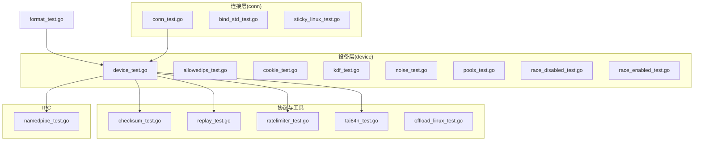
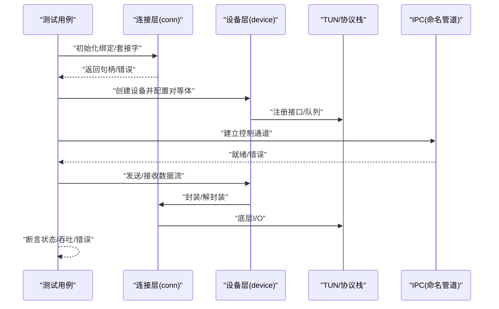
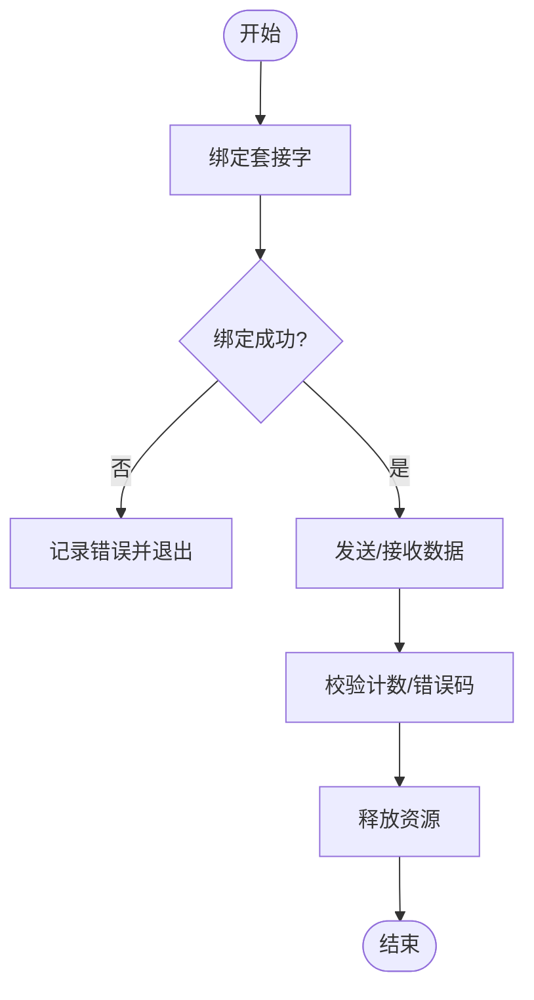
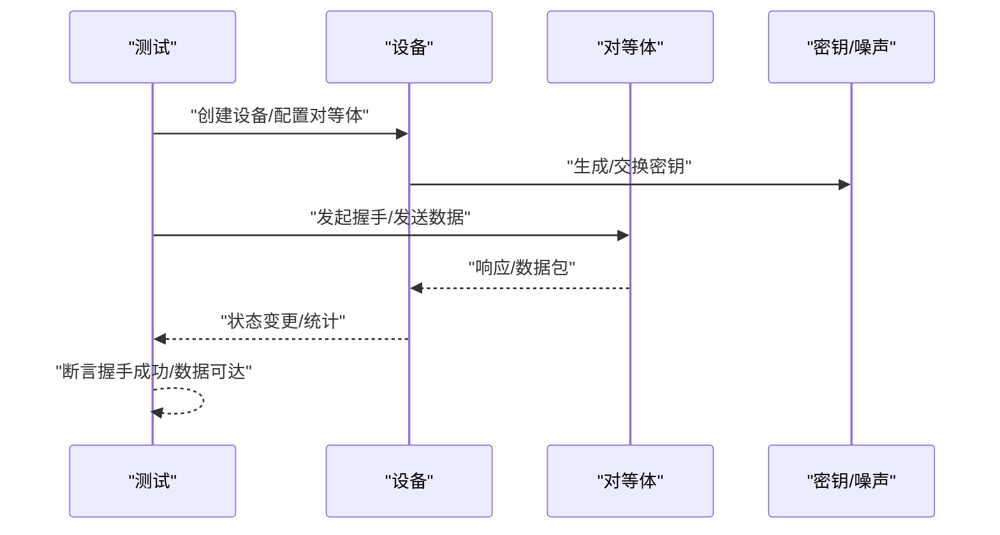
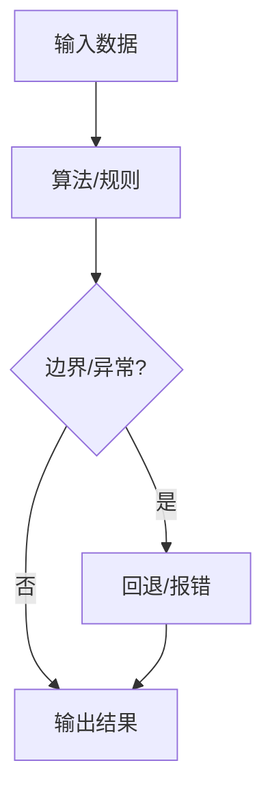
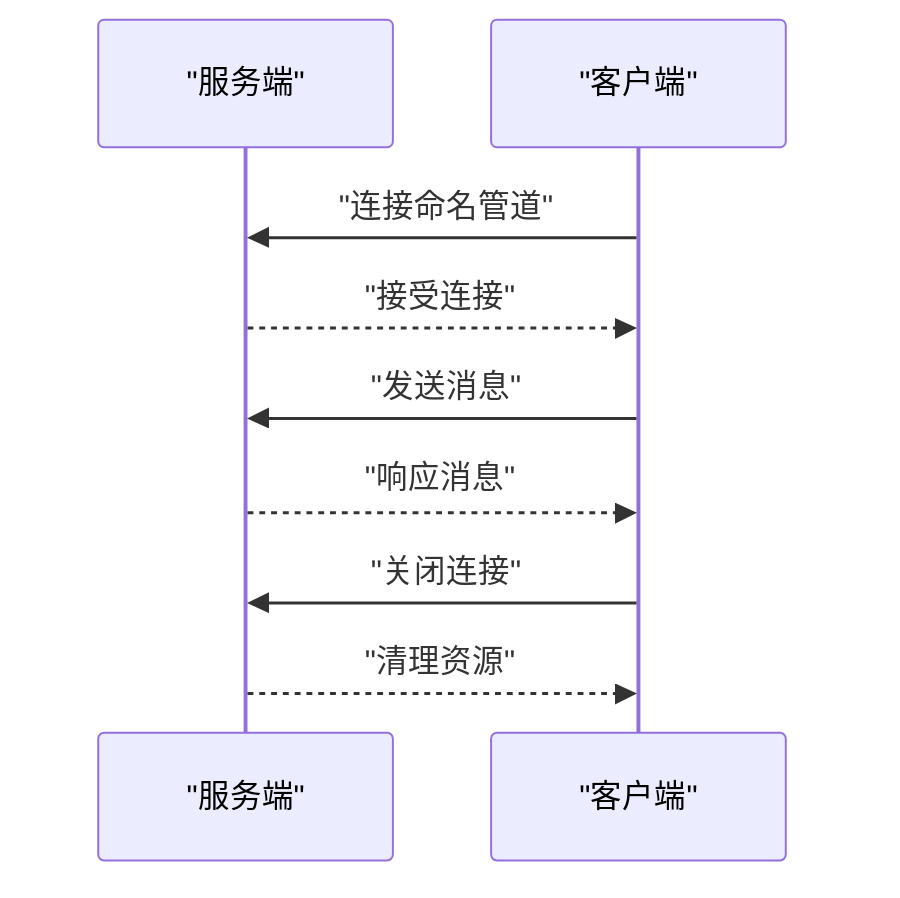
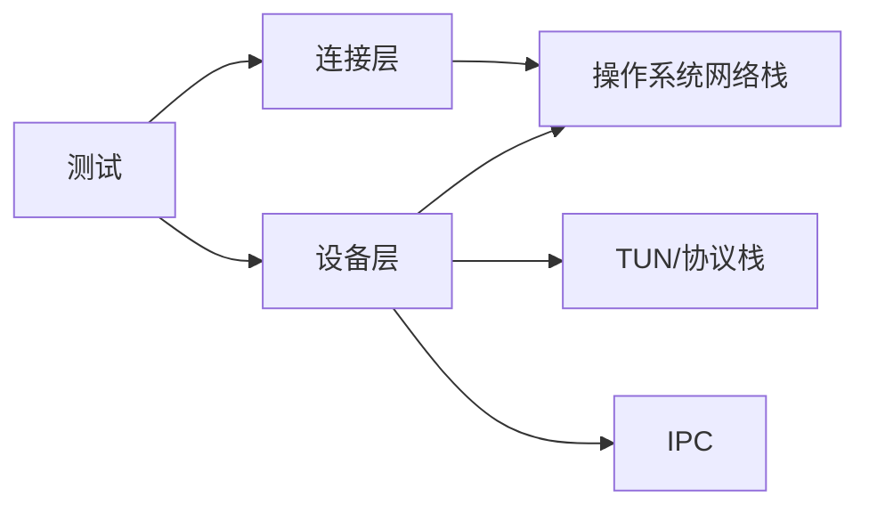

# 单元测试

<cite>
**本文引用的文件**
- [conn/conn_test.go](file://conn/conn_test.go)
- [conn/bind_std_test.go](file://conn/bind_std_test.go)
- [conn/sticky_linux_test.go](file://conn/sticky_linux_test.go)
- [device/device_test.go](file://device/device_test.go)
- [device/allowedips_test.go](file://device/allowedips_test.go)
- [device/cookie_test.go](file://device/cookie_test.go)
- [device/kdf_test.go](file://device/kdf_test.go)
- [device/noise_test.go](file://device/noise_test.go)
- [device/pools_test.go](file://device/pools_test.go)
- [device/race_disabled_test.go](file://device/race_disabled_test.go)
- [device/race_enabled_test.go](file://device/race_enabled_test.go)
- [replay/replay_test.go](file://replay/replay_test.go)
- [ratelimiter/ratelimiter_test.go](file://ratelimiter/ratelimiter_test.go)
- [tai64n/tai64n_test.go](file://tai64n/tai64n_test.go)
- [tun/checksum_test.go](file://tun/checksum_test.go)
- [tun/offload_linux_test.go](file://tun/offload_linux_test.go)
- [ipc/namedpipe/namedpipe_test.go](file://ipc/namedpipe/namedpipe_test.go)
- [format_test.go](file://format_test.go)
</cite>

## 目录
1. [简介](#简介)
2. [项目结构](#项目结构)
3. [核心组件](#核心组件)
4. [架构总览](#架构总览)
5. [详细组件分析](#详细组件分析)
6. [依赖关系分析](#依赖关系分析)
7. [性能考虑](#性能考虑)
8. [故障排查指南](#故障排查指南)
9. [结论](#结论)
10. [附录](#附录)

## 简介
本文件面向WireGuard-Go项目的单元测试，目标是：
- 说明测试编写规范与最佳实践
- 解释测试用例的组织结构与命名约定
- 文档化mock与stub的使用方法与适用场景
- 覆盖设备层、连接层等核心模块的测试示例与要点
- 明确测试覆盖率要求与工具使用方式
- 提供新功能测试用例开发指导
- 总结并发测试的注意事项与调试方法

## 项目结构
仓库采用按功能域划分的目录组织，测试文件与源码同目录或位于子目录中，便于就近维护与聚焦。关键测试位置概览：
- 连接层（conn）：网络绑定、套接字特性、粘性路由等测试
- 设备层（device）：设备生命周期、密钥派生、噪声协议、允许IP表、Cookie校验、内存池等
- 传输与协议（tun、replay、ratelimiter、tai64n）：校验和、重放检测、速率限制、时间戳格式
- IPC（ipc/namedpipe）：命名管道通信测试
- 根级：代码格式化检查测试

图表来源
- [conn/conn_test.go:1-200](file://conn/conn_test.go#L1-L200)
- [device/device_test.go:1-200](file://device/device_test.go#L1-L200)
- [tun/checksum_test.go:1-200](file://tun/checksum_test.go#L1-L200)
- [replay/replay_test.go:1-200](file://replay/replay_test.go#L1-L200)
- [ratelimiter/ratelimiter_test.go:1-200](file://ratelimiter/ratelimiter_test.go#L1-L200)
- [tai64n/tai64n_test.go:1-200](file://tai64n/tai64n_test.go#L1-L200)
- [ipc/namedpipe/namedpipe_test.go:1-200](file://ipc/namedpipe/namedpipe_test.go#L1-L200)
- [format_test.go:1-200](file://format_test.go#L1-L200)

章节来源
- [conn/conn_test.go:1-200](file://conn/conn_test.go#L1-L200)
- [device/device_test.go:1-200](file://device/device_test.go#L1-L200)
- [tun/checksum_test.go:1-200](file://tun/checksum_test.go#L1-L200)
- [replay/replay_test.go:1-200](file://replay/replay_test.go#L1-L200)
- [ratelimiter/ratelimiter_test.go:1-200](file://ratelimiter/ratelimiter_test.go#L1-L200)
- [tai64n/tai64n_test.go:1-200](file://tai64n/tai64n_test.go#L1-L200)
- [ipc/namedpipe/namedpipe_test.go:1-200](file://ipc/namedpipe/namedpipe_test.go#L1-L200)
- [format_test.go:1-200](file://format_test.go#L1-L200)

## 核心组件
本节从“测试目标—输入—断言—副作用”的角度，梳理各模块测试的关键点与常见模式。

- 连接层（conn）
  - 套接字绑定与端口复用：验证在不同平台下绑定行为、错误路径与资源释放
  - 粘性路由（Linux）：验证SO_MARK/SO_BINDTODEVICE等特性的可用性与回退策略
  - 标准绑定实现：验证收发路径、缓冲区处理、错误码映射

- 设备层（device）
  - 设备生命周期：创建、启动、停止、清理；并发安全与资源泄漏防护
  - 密钥派生与噪声协议：向量一致性、边界条件、随机源不可用时的降级
  - 允许IP表：插入、查找、删除、前缀匹配、性能回归
  - Cookie校验：防重放与DoS保护路径
  - 内存池：分配/回收、碎片化、并发争用

- 协议与工具
  - 校验和：RFC一致性、大报文分片、零拷贝路径
  - 重放检测：窗口滑动、序列号回绕、边界值
  - 速率限制：令牌桶/漏桶参数调优、突发流量
  - 时间戳格式：跨平台一致性与解析容错
  - 卸载能力（Linux）：GSO/GRO等特性探测与回退

- IPC（命名管道）
  - 进程间通信：打开/关闭、读写阻塞、错误恢复、权限与命名冲突

章节来源
- [conn/conn_test.go:1-200](file://conn/conn_test.go#L1-L200)
- [conn/bind_std_test.go:1-200](file://conn/bind_std_test.go#L1-L200)
- [conn/sticky_linux_test.go:1-200](file://conn/sticky_linux_test.go#L1-L200)
- [device/device_test.go:1-200](file://device/device_test.go#L1-L200)
- [device/allowedips_test.go:1-200](file://device/allowedips_test.go#L1-L200)
- [device/cookie_test.go:1-200](file://device/cookie_test.go#L1-L200)
- [device/kdf_test.go:1-200](file://device/kdf_test.go#L1-L200)
- [device/noise_test.go:1-200](file://device/noise_test.go#L1-L200)
- [device/pools_test.go:1-200](file://device/pools_test.go#L1-L200)
- [tun/checksum_test.go:1-200](file://tun/checksum_test.go#L1-L200)
- [replay/replay_test.go:1-200](file://replay/replay_test.go#L1-L200)
- [ratelimiter/ratelimiter_test.go:1-200](file://ratelimiter/ratelimiter_test.go#L1-L200)
- [tai64n/tai64n_test.go:1-200](file://tai64n/tai64n_test.go#L1-L200)
- [ipc/namedpipe/namedpipe_test.go:1-200](file://ipc/namedpipe/namedpipe_test.go#L1-L200)

## 架构总览
下图展示测试如何围绕“设备—连接—协议栈—IPC”的主链路进行端到端与单元级验证。

图表来源
- [conn/conn_test.go:1-200](file://conn/conn_test.go#L1-L200)
- [device/device_test.go:1-200](file://device/device_test.go#L1-L200)
- [ipc/namedpipe/namedpipe_test.go:1-200](file://ipc/namedpipe/namedpipe_test.go#L1-L200)

## 详细组件分析

### 连接层测试（conn）
- 关注点
  - 绑定失败、端口占用、权限不足等错误路径
  - 不同平台下的特性差异与回退逻辑
  - 粘性与多路复用行为的正确性
- 典型流程
  - 构造绑定器 -> 绑定端口 -> 发送/接收 -> 校验计数与错误码 -> 释放资源
- 并发注意
  - 避免共享全局套接字状态
  - 使用隔离端口或动态端口分配
  - 合理设置超时，防止测试挂起

图表来源
- [conn/conn_test.go:1-200](file://conn/conn_test.go#L1-L200)
- [conn/bind_std_test.go:1-200](file://conn/bind_std_test.go#L1-L200)
- [conn/sticky_linux_test.go:1-200](file://conn/sticky_linux_test.go#L1-L200)

章节来源
- [conn/conn_test.go:1-200](file://conn/conn_test.go#L1-L200)
- [conn/bind_std_test.go:1-200](file://conn/bind_std_test.go#L1-L200)
- [conn/sticky_linux_test.go:1-200](file://conn/sticky_linux_test.go#L1-L200)

### 设备层测试（device）
- 关注点
  - 设备生命周期管理、并发安全、内存与句柄泄漏
  - 噪声握手、密钥派生的确定性与边界条件
  - 允许IP表的高效查找与前缀匹配
  - Cookie机制对重放与DoS的保护
  - 内存池在高并发下的稳定性
- 典型流程
  - 准备对等体与密钥 -> 启动设备 -> 触发握手 -> 验证状态机转换 -> 压测收发 -> 清理
- 并发注意
  - 使用goroutine并发模拟对等体
  - 通过channel同步事件与断言
  - 使用race detector运行以发现竞态

图表来源
- [device/device_test.go:1-200](file://device/device_test.go#L1-L200)
- [device/noise_test.go:1-200](file://device/noise_test.go#L1-L200)
- [device/kdf_test.go:1-200](file://device/kdf_test.go#L1-L200)
- [device/allowedips_test.go:1-200](file://device/allowedips_test.go#L1-L200)
- [device/cookie_test.go:1-200](file://device/cookie_test.go#L1-L200)
- [device/pools_test.go:1-200](file://device/pools_test.go#L1-L200)

章节来源
- [device/device_test.go:1-200](file://device/device_test.go#L1-L200)
- [device/noise_test.go:1-200](file://device/noise_test.go#L1-L200)
- [device/kdf_test.go:1-200](file://device/kdf_test.go#L1-L200)
- [device/allowedips_test.go:1-200](file://device/allowedips_test.go#L1-L200)
- [device/cookie_test.go:1-200](file://device/cookie_test.go#L1-L200)
- [device/pools_test.go:1-200](file://device/pools_test.go#L1-L200)
- [device/race_disabled_test.go:1-200](file://device/race_disabled_test.go#L1-L200)
- [device/race_enabled_test.go:1-200](file://device/race_enabled_test.go#L1-L200)

### 协议与工具测试（tun、replay、ratelimiter、tai64n）
- 校验和：验证RFC计算、分片重组、异常输入
- 重放检测：窗口大小、序列号回绕、边界值
- 速率限制：突发与稳态吞吐、参数敏感性
- 时间戳：解析/格式化一致性、越界处理
- 卸载能力：特性探测、回退路径

图表来源
- [tun/checksum_test.go:1-200](file://tun/checksum_test.go#L1-L200)
- [replay/replay_test.go:1-200](file://replay/replay_test.go#L1-L200)
- [ratelimiter/ratelimiter_test.go:1-200](file://ratelimiter/ratelimiter_test.go#L1-L200)
- [tai64n/tai64n_test.go:1-200](file://tai64n/tai64n_test.go#L1-L200)
- [tun/offload_linux_test.go:1-200](file://tun/offload_linux_test.go#L1-L200)

章节来源
- [tun/checksum_test.go:1-200](file://tun/checksum_test.go#L1-L200)
- [replay/replay_test.go:1-200](file://replay/replay_test.go#L1-L200)
- [ratelimiter/ratelimiter_test.go:1-200](file://ratelimiter/ratelimiter_test.go#L1-L200)
- [tai64n/tai64n_test.go:1-200](file://tai64n/tai64n_test.go#L1-L200)
- [tun/offload_linux_test.go:1-200](file://tun/offload_linux_test.go#L1-L200)

### IPC测试（命名管道）
- 关注点：打开/关闭、读写阻塞、权限、命名冲突、错误恢复
- 典型流程：服务端监听 -> 客户端连接 -> 双向通信 -> 断开与清理

图表来源
- [ipc/namedpipe/namedpipe_test.go:1-200](file://ipc/namedpipe/namedpipe_test.go#L1-L200)

章节来源
- [ipc/namedpipe/namedpipe_test.go:1-200](file://ipc/namedpipe/namedpipe_test.go#L1-L200)

## 依赖关系分析
- 测试与源码耦合度
  - 连接层测试依赖底层套接字与系统调用，需考虑平台差异
  - 设备层测试依赖噪声协议、密钥派生、TUN接口，需隔离外部依赖
  - 工具层测试多为纯函数或轻量数据结构，易于单测
- 外部依赖
  - 操作系统网络栈、TUN/TAP、命名管道
  - 随机数源、时间源、内存分配器
- 循环依赖
  - 测试应避免引入生产循环依赖，通过接口抽象与桩对象隔离

图表来源
- [conn/conn_test.go:1-200](file://conn/conn_test.go#L1-L200)
- [device/device_test.go:1-200](file://device/device_test.go#L1-L200)
- [ipc/namedpipe/namedpipe_test.go:1-200](file://ipc/namedpipe/namedpipe_test.go#L1-L200)

章节来源
- [conn/conn_test.go:1-200](file://conn/conn_test.go#L1-L200)
- [device/device_test.go:1-200](file://device/device_test.go#L1-L200)
- [ipc/namedpipe/namedpipe_test.go:1-200](file://ipc/namedpipe/namedpipe_test.go#L1-L200)

## 性能考虑
- 基准与压力测试
  - 使用基准测试评估热点路径（如允许IP表查找、校验和计算）
  - 通过并发压测暴露锁竞争与内存分配热点
- 资源管理
  - 确保每个测试在Teardown阶段释放所有句柄与内存
  - 避免长时间持有全局资源导致测试间干扰
- 可重复性
  - 固定随机种子或可控随机源，保证确定性
  - 使用虚拟时钟或可控时间源，避免时序相关的不稳定

[本节为通用指导，不直接分析具体文件]

## 故障排查指南
- 常见问题
  - 端口占用：使用动态端口或重试机制
  - 权限不足：提升权限或跳过需要特权的测试
  - 竞态条件：启用race detector定位
  - 资源泄漏：使用leak检测或手动验证句柄关闭
- 调试技巧
  - 增加日志与断点，缩小问题范围
  - 将复杂流程拆分为多个小测试，逐步定位
  - 使用平台特定的构建标签，仅运行相关测试

章节来源
- [device/race_disabled_test.go:1-200](file://device/race_disabled_test.go#L1-L200)
- [device/race_enabled_test.go:1-200](file://device/race_enabled_test.go#L1-L200)

## 结论
- 本项目测试覆盖连接层、设备层、协议与工具、IPC等关键模块
- 建议遵循统一的测试组织与命名规范，强化边界与错误路径覆盖
- 通过mock/stub隔离外部依赖，提高测试稳定性与可移植性
- 重视并发测试与资源清理，结合race detector与覆盖率工具保障质量

[本节为总结性内容，不直接分析具体文件]

## 附录

### 测试编写规范与最佳实践
- 文件与命名
  - 测试文件命名为 xxx_test.go，与源码同目录
  - 测试函数以 TestXxx(t *testing.T) 命名
  - 子测试使用 t.Run("描述", func...) 组织
- 用例设计
  - 每个用例只验证一个职责，保持原子性
  - 覆盖正常路径、边界值、异常路径
  - 使用表格驱动测试减少重复
- 资源管理
  - 使用defer确保资源释放
  - 避免共享全局可变状态
- 可重复性
  - 固定随机种子或使用可控随机源
  - 避免依赖外部服务或网络时延

[本节为通用指导，不直接分析具体文件]

### 组织结构与命名约定
- 按功能域划分目录，测试就近放置
- 使用子测试分组：Setup/Run/Teardown
- 使用Table-Driven Tests组织多组输入输出
- 对平台相关逻辑使用构建标签区分

[本节为通用指导，不直接分析具体文件]

### Mock与Stub使用方法与场景
- 何时使用
  - 外部依赖不稳定或昂贵（网络、文件系统、随机源）
  - 需要精确控制输入输出与时序
- 如何使用
  - 定义接口，注入实现
  - 使用桩对象记录调用次数与参数
  - 在测试中替换真实实现
- 注意事项
  - 避免过度mock破坏集成验证
  - 保持接口稳定，减少重构成本

[本节为通用指导，不直接分析具体文件]

### 设备层与连接层测试示例要点
- 设备层
  - 生命周期：创建/启动/停止/清理
  - 噪声握手：向量一致性、错误恢复
  - 允许IP表：查找/插入/删除、性能回归
  - Cookie：防重放与DoS保护
  - 内存池：高并发稳定性
- 连接层
  - 绑定与复用：错误路径、资源释放
  - 粘性路由：特性探测与回退
  - 收发路径：缓冲、错误码映射

章节来源
- [device/device_test.go:1-200](file://device/device_test.go#L1-L200)
- [device/allowedips_test.go:1-200](file://device/allowedips_test.go#L1-L200)
- [device/cookie_test.go:1-200](file://device/cookie_test.go#L1-L200)
- [device/noise_test.go:1-200](file://device/noise_test.go#L1-L200)
- [device/pools_test.go:1-200](file://device/pools_test.go#L1-L200)
- [conn/conn_test.go:1-200](file://conn/conn_test.go#L1-L200)
- [conn/bind_std_test.go:1-200](file://conn/bind_std_test.go#L1-L200)
- [conn/sticky_linux_test.go:1-200](file://conn/sticky_linux_test.go#L1-L200)

### 测试覆盖率要求与工具使用
- 覆盖率目标
  - 核心模块行覆盖率≥80%
  - 分支覆盖率≥70%
  - 关键路径（握手、收发、错误处理）尽量接近100%
- 工具与命令
  - go test -cover 生成覆盖率报告
  - go test -coverprofile=coverage.out 导出覆盖率数据
  - go tool cover -html=coverage.out 生成HTML报告
  - 结合CI流水线自动收集与阈值检查
- 注意事项
  - 排除无关文件（如生成代码）
  - 针对平台特定代码使用构建标签分别统计

[本节为通用指导，不直接分析具体文件]

### 新功能测试用例开发指导
- 需求到用例
  - 明确输入、期望输出、边界条件
  - 设计正交用例集，覆盖异常路径
- 实现步骤
  - 先写失败的测试，再实现功能
  - 使用子测试与表格驱动组织
  - 添加基准测试评估性能影响
- 评审与合并
  - 确保无资源泄漏、无竞态
  - 覆盖率达标并通过全量测试

[本节为通用指导，不直接分析具体文件]

### 并发测试注意事项与调试方法
- 注意事项
  - 避免共享可变状态，必要时加锁
  - 使用channel协调goroutine生命周期
  - 设置合理超时，防止测试挂起
- 调试方法
  - 启用race detector：go test -race
  - 打印goroutine堆栈：SIGQUIT或pprof
  - 缩小并发规模，逐步定位问题

章节来源
- [device/race_disabled_test.go:1-200](file://device/race_disabled_test.go#L1-L200)
- [device/race_enabled_test.go:1-200](file://device/race_enabled_test.go#L1-L200)

### 代码质量与格式化测试
- 使用格式化检查确保风格一致
- 在CI中强制执行，避免提交不规范代码

章节来源
- [format_test.go:1-200](file://format_test.go#L1-L200)