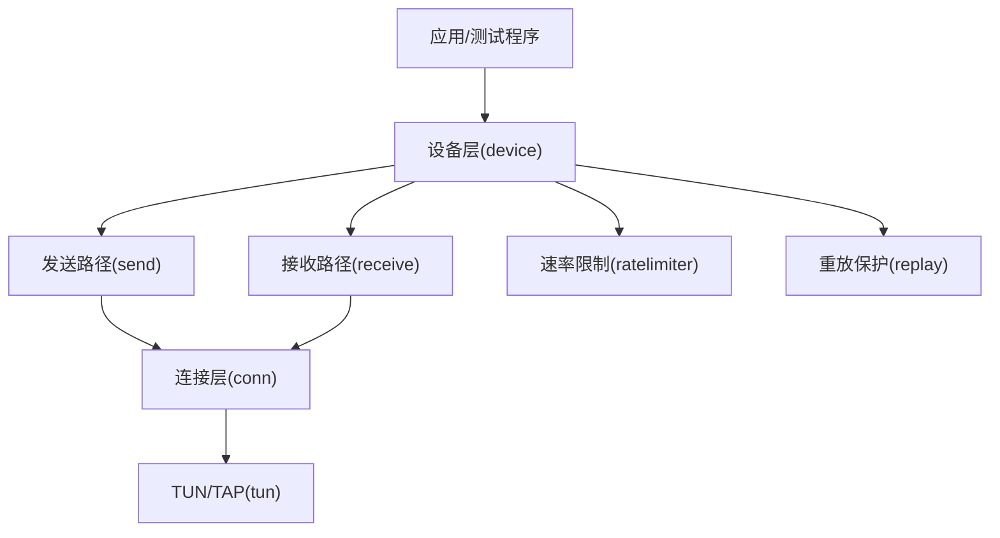
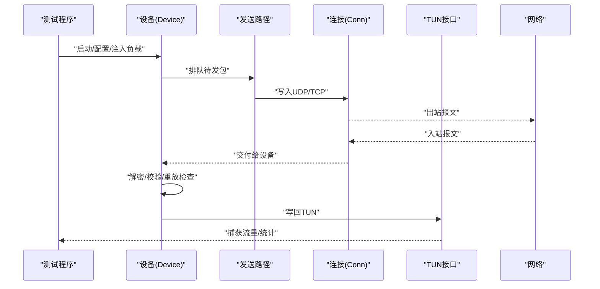
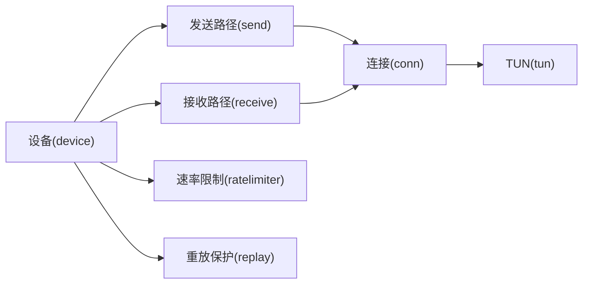

# 性能测试

<cite>
**本文引用的文件**
- [main.go](file://main.go)
- [device/device.go](file://device/device.go)
- [device/send.go](file://device/send.go)
- [device/receive.go](file://device/receive.go)
- [device/queueconstants_default.go](file://device/queueconstants_default.go)
- [conn/conn.go](file://conn/conn.go)
- [conn/bind_std.go](file://conn/bind_std.go)
- [tun/tun.go](file://tun/tun.go)
- [tun/tun_linux.go](file://tun/tun_linux.go)
- [ratelimiter/ratelimiter.go](file://ratelimiter/ratelimiter.go)
- [replay/replay.go](file://replay/replay.go)
- [go.mod](file://go.mod)
</cite>

## 目录
1. [简介](#简介)
2. [项目结构](#项目结构)
3. [核心组件](#核心组件)
4. [架构总览](#架构总览)
5. [详细组件分析](#详细组件分析)
6. [依赖关系分析](#依赖关系分析)
7. [性能考量](#性能考量)
8. [故障排查指南](#故障排查指南)
9. [结论](#结论)
10. [附录](#附录)

## 简介
本文件面向wireguard-go的性能测试与基准评估，覆盖以下目标：
- 设计方法与指标定义：明确吞吐、时延、丢包率、CPU/内存等关键指标。
- 压力测试场景与参数配置：构造高并发、大包小包、多队列、限速等场景。
- 监控方法：系统级与应用级的内存与CPU观测手段。
- 数据包处理性能：封装/解封装、加密/解密、GSO/TSO等路径的测量。
- 并发场景评估：多对端、多连接、多核并行下的表现。
- 回归检测：自动化基线对比与阈值告警流程。
- 优化验证：变更前后对比与可复现实验。

## 项目结构
wireguard-go采用分层模块化设计，网络栈与设备逻辑分离，便于在用户态进行端到端性能测试：
- 设备层（device）：负责密钥协商、会话状态、收发队列、定时器、速率限制、重放保护等。
- 连接层（conn）：抽象底层套接字绑定、特性探测（如GSO）、标记、粘性路由等。
- TUN/TAP层（tun）：跨平台虚拟网卡接口，提供内核到用户态的数据面通道。
- 工具模块：速率限制器、重放窗口等。

图表来源
- [device/device.go:1-200](file://device/device.go#L1-L200)
- [device/send.go:1-200](file://device/send.go#L1-L200)
- [device/receive.go:1-200](file://device/receive.go#L1-L200)
- [conn/conn.go:1-200](file://conn/conn.go#L1-L200)
- [tun/tun.go:1-200](file://tun/tun.go#L1-L200)

章节来源
- [device/device.go:1-200](file://device/device.go#L1-L200)
- [conn/conn.go:1-200](file://conn/conn.go#L1-L200)
- [tun/tun.go:1-200](file://tun/tun.go#L1-L200)

## 核心组件
- 设备（Device）：维护对端、密钥对、队列常量、计时器等，是性能测试的核心编排点。
- 发送路径（Send）：将上层数据打包为噪声协议报文，走UDP/TCP等传输，支持批量与零拷贝优化。
- 接收路径（Receive）：解析入站报文，校验MAC、重放窗口、解密后投递至TUN或上层。
- 连接抽象（Conn）：屏蔽不同平台差异，暴露读写、特性能力（如GSO）。
- TUN接口（TUN）：提供虚拟网卡读写，承载IP层流量。
- 速率限制（RateLimiter）：控制带宽/包率，用于压力测试中的限流场景。
- 重放保护（Replay）：基于时间戳或序列号去重，影响吞吐与时延。

章节来源
- [device/device.go:1-200](file://device/device.go#L1-L200)
- [device/send.go:1-200](file://device/send.go#L1-L200)
- [device/receive.go:1-200](file://device/receive.go#L1-L200)
- [conn/conn.go:1-200](file://conn/conn.go#L1-L200)
- [tun/tun.go:1-200](file://tun/tun.go#L1-L200)
- [ratelimiter/ratelimiter.go:1-200](file://ratelimiter/ratelimiter.go#L1-L200)
- [replay/replay.go:1-200](file://replay/replay.go#L1-L200)

## 架构总览
下图展示从TUN到网络的完整数据面路径，以及性能测试注入点（计数器、采样、节流）。

图表来源
- [device/device.go:1-200](file://device/device.go#L1-L200)
- [device/send.go:1-200](file://device/send.go#L1-L200)
- [device/receive.go:1-200](file://device/receive.go#L1-L200)
- [conn/conn.go:1-200](file://conn/conn.go#L1-L200)
- [tun/tun.go:1-200](file://tun/tun.go#L1-L200)

## 详细组件分析

### 设备层与队列常量
- 作用：管理对端、密钥对、定时器、队列容量等；队列常量直接影响吞吐与延迟。
- 关键点：
  - 队列大小与批处理策略决定内存占用与CPU抖动。
  - 定时器精度影响握手与保活开销。
- 建议：通过调整队列常量观察吞吐/时延拐点，定位瓶颈。

章节来源
- [device/device.go:1-200](file://device/device.go#L1-L200)
- [device/queueconstants_default.go:1-200](file://device/queueconstants_default.go#L1-L200)

### 发送路径（Send）
- 作用：将应用数据封装为噪声协议报文并发送。
- 关键点：
  - 批量发送减少系统调用次数。
  - 零拷贝/GSO可降低CPU占用。
- 建议：在高吞吐场景开启GSO/TSO（若可用），并增大批量大小。

章节来源
- [device/send.go:1-200](file://device/send.go#L1-L200)

### 接收路径（Receive）
- 作用：解析入站报文，校验完整性与重放窗口，解密后投递。
- 关键点：
  - MAC校验与解密是主要CPU热点。
  - 重放窗口过大可能增加内存与比较开销。
- 建议：根据业务需求合理设置重放窗口，避免过大导致CPU飙升。

章节来源
- [device/receive.go:1-200](file://device/receive.go#L1-L200)

### 连接层（Conn）
- 作用：抽象底层套接字读写、特性探测（如GSO）、标记、粘性路由等。
- 关键点：
  - 不同平台实现差异会影响性能。
  - 特性开关（如GSO）需结合内核支持情况启用。
- 建议：在Linux上优先使用高性能绑定实现，并启用GSO/TSO。

章节来源
- [conn/conn.go:1-200](file://conn/conn.go#L1-L200)
- [conn/bind_std.go:1-200](file://conn/bind_std.go#L1-L200)

### TUN接口（TUN）
- 作用：提供虚拟网卡读写，承载IP层流量。
- 关键点：
  - 内核驱动与MTU设置影响吞吐与时延。
  - 大报文分片会增加CPU开销。
- 建议：合理设置MTU，尽量使用大报文减少头部开销。

章节来源
- [tun/tun.go:1-200](file://tun/tun.go#L1-L200)
- [tun/tun_linux.go:1-200](file://tun/tun_linux.go#L1-L200)

### 速率限制（RateLimiter）
- 作用：控制带宽/包率，用于模拟拥塞或合规限速。
- 关键点：
  - 令牌桶/漏桶算法选择影响公平性与突发容忍度。
- 建议：在压力测试中逐步提升速率，观察吞吐与时延变化。

章节来源
- [ratelimiter/ratelimiter.go:1-200](file://ratelimiter/ratelimiter.go#L1-L200)

### 重放保护（Replay）
- 作用：防止重放攻击，基于时间戳或序列号去重。
- 关键点：
  - 窗口大小与清理策略影响内存与CPU。
- 建议：按业务安全要求设定窗口，避免过宽导致资源浪费。

章节来源
- [replay/replay.go:1-200](file://replay/replay.go#L1-L200)

## 依赖关系分析
- 设备层依赖发送/接收路径、定时器、速率限制与重放保护。
- 发送/接收路径依赖连接层与TUN接口。
- 连接层依赖具体平台绑定实现。
- 外部依赖由Go模块管理。

图表来源
- [device/device.go:1-200](file://device/device.go#L1-L200)
- [device/send.go:1-200](file://device/send.go#L1-L200)
- [device/receive.go:1-200](file://device/receive.go#L1-L200)
- [conn/conn.go:1-200](file://conn/conn.go#L1-L200)
- [tun/tun.go:1-200](file://tun/tun.go#L1-L200)
- [ratelimiter/ratelimiter.go:1-200](file://ratelimiter/ratelimiter.go#L1-L200)
- [replay/replay.go:1-200](file://replay/replay.go#L1-L200)

章节来源
- [go.mod:1-200](file://go.mod#L1-L200)

## 性能考量
- 吞吐与时延：关注端到端P95/P99时延与稳定吞吐，避免尖峰抖动。
- CPU与内存：监控GC频率、堆大小、goroutine数量，识别热点路径。
- 队列与批处理：队列过小导致频繁阻塞，过大增加内存与延迟。
- 特性开关：GSO/TSO在Linux上显著降低CPU，但需内核支持。
- 速率限制：在接近链路上限时观察丢包与时延增长。
- 重放窗口：过大会增加内存与比较成本，需权衡安全与性能。

[本节为通用指导，不直接分析具体文件]

## 故障排查指南
- 吞吐不达标：检查队列常量、批处理大小、GSO/TSO是否启用。
- 时延抖动：观察GC与系统调用热点，调整队列与批处理。
- 内存泄漏：监控堆增长与goroutine数，定位未释放资源。
- 丢包率高：检查速率限制、内核缓冲区、MTU设置。
- 重放问题：核对时间同步与窗口设置，避免误判。

[本节为通用指导，不直接分析具体文件]

## 结论
通过分层理解与针对性调优，可在wireguard-go中实现高吞吐、低时延的稳定性能。建议在CI中固化基线与回归检测，确保每次变更可量化评估。

[本节为总结性内容，不直接分析具体文件]

## 附录

### 性能基准测试设计与指标定义
- 指标
  - 吞吐：Mbps/pps，区分小包与大包。
  - 时延：端到端P50/P95/P99，含握手与保活。
  - 丢包率：入/出方向统计。
  - CPU：用户态/内核态占比，每核利用率。
  - 内存：堆大小、GC次数、队列占用。
- 方法
  - 单流/多流：逐步增加并发流数。
  - 包长分布：均匀/正态/混合，覆盖典型业务。
  - 特性开关：GSO/TSO开/关对比。
  - 速率限制：阶梯式提升，观察拐点。
- 环境
  - 固定CPU亲和、关闭节能模式、关闭无关进程。
  - 记录内核版本、驱动、MTU、队列参数。

[本节为通用指导，不直接分析具体文件]

### 压力测试场景与参数配置
- 场景
  - 持续高吞吐：大包、满带宽、长时间运行。
  - 突发流量：短周期高峰，检验缓冲与丢弃策略。
  - 多对端：模拟多个Peer同时活跃。
  - 受限带宽：速率限制下稳定性。
- 参数
  - 并发流数、包长、持续时间、速率限制阈值。
  - 队列常量、批处理大小、GSO/TSO开关。
  - 重放窗口大小、定时器精度。

[本节为通用指导，不直接分析具体文件]

### 内存与CPU监控方法
- 系统级
  - Linux：perf、bpftrace、top、htop、pidstat、vmstat、sar。
  - Windows：PerfMon、Process Explorer、ETW。
- 应用级
  - Go pprof：cpu、mem、block、mutex。
  - 自定义指标：队列长度、GC次数、goroutine数。
- 采集
  - 定时快照、导出到时序数据库、可视化看板。

[本节为通用指导，不直接分析具体文件]

### 数据包处理性能测试实现
- 路径
  - TUN写：模拟上行流量，测量封装/加密耗时。
  - UDP读：模拟下行流量，测量解密/校验耗时。
- 工具
  - 自研压测客户端/服务端，或使用标准工具（如iperf）配合TUN。
- 统计
  - 逐包时间戳、批次大小、系统调用次数。
  - 区分冷/热路径，识别热点函数。

[本节为通用指导，不直接分析具体文件]

### 并发场景下的性能评估方法
- 维度
  - 并发Peer数、每Peer流数、包长分布。
  - 多核分配：CPU亲和、NUMA感知。
- 方法
  - 逐步放大并发，观察吞吐饱和点与时延拐点。
  - 隔离干扰：关闭无关服务，固定电源策略。
- 指标
  - 每核利用率、上下文切换、锁竞争、GC停顿。

[本节为通用指导，不直接分析具体文件]

### 性能回归检测的配置与流程
- 基线
  - 固定环境与参数，记录吞吐、时延、CPU、内存基线。
- 触发
  - CI流水线在代码变更时自动执行基准套件。
- 判定
  - 阈值：吞吐下降>5%、时延上升>10%、CPU上升>15%即告警。
- 报告
  - 生成对比报告、热点函数列表、回归定位建议。

[本节为通用指导，不直接分析具体文件]

### 性能优化效果的验证方法
- 对比
  - 变更前后的吞吐、时延、CPU、内存对比。
- 复现
  - 固定参数与环境，确保结果可复现。
- 归因
  - 使用pprof与perf定位热点，验证优化点有效性。
- 发布
  - 将优化纳入基线，更新回归阈值。

[本节为通用指导，不直接分析具体文件]