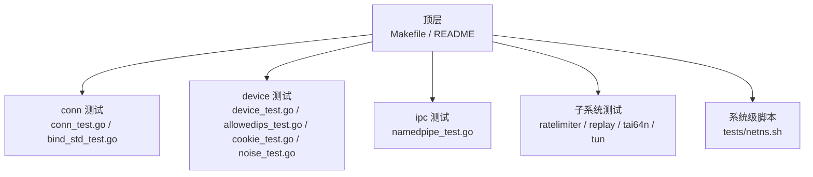
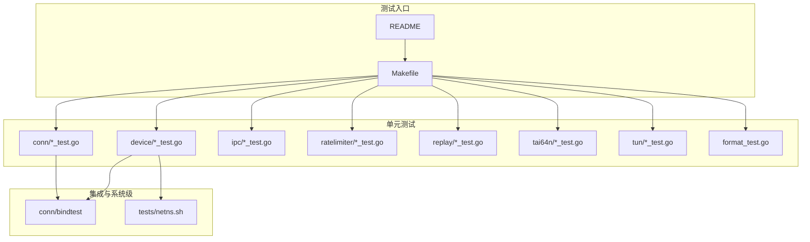
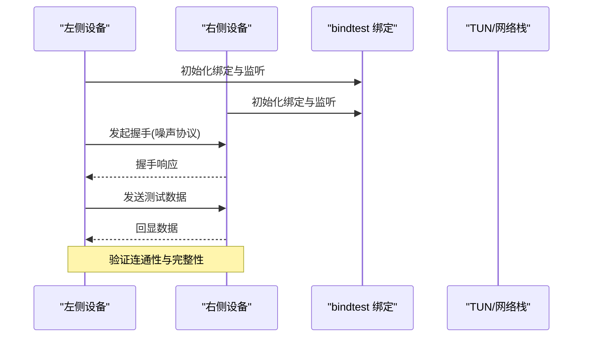
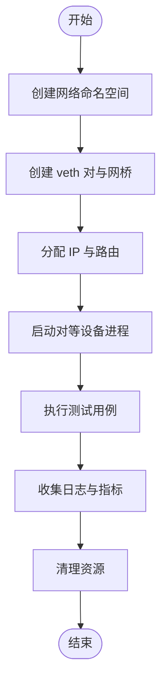
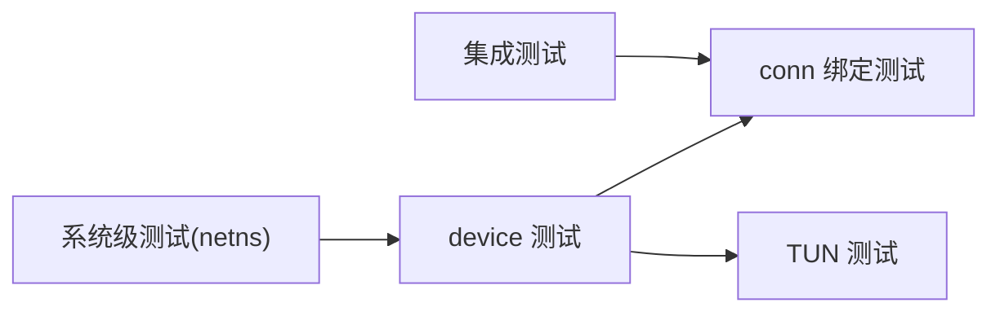

# 测试策略

<cite>
**本文引用的文件**
- [Makefile](file://Makefile)
- [README.md](file://README.md)
- [format_test.go](file://format_test.go)
- [conn/bindtest/bindtest.go](file://conn/bindtest/bindtest.go)
- [conn/conn_test.go](file://conn/conn_test.go)
- [conn/bind_std_test.go](file://conn/bind_std_test.go)
- [device/device_test.go](file://device/device_test.go)
- [device/allowedips_test.go](file://device/allowedips_test.go)
- [device/cookie_test.go](file://device/cookie_test.go)
- [device/kdf_test.go](file://device/kdf_test.go)
- [device/noise_test.go](file://device/noise_test.go)
- [device/pools_test.go](file://device/pools_test.go)
- [device/race_disabled_test.go](file://device/race_disabled_test.go)
- [device/race_enabled_test.go](file://device/race_enabled_test.go)
- [ipc/namedpipe/namedpipe_test.go](file://ipc/namedpipe/namedpipe_test.go)
- [ratelimiter/ratelimiter_test.go](file://ratelimiter/ratelimiter_test.go)
- [replay/replay_test.go](file://replay/replay_test.go)
- [tai64n/tai64n_test.go](file://tai64n/tai64n_test.go)
- [tun/checksum_test.go](file://tun/checksum_test.go)
- [tun/offload_linux_test.go](file://tun/offload_linux_test.go)
- [tests/netns.sh](file://tests/netns.sh)
</cite>

## 目录
1. [简介](#简介)
2. [项目结构](#项目结构)
3. [核心组件](#核心组件)
4. [架构总览](#架构总览)
5. [详细组件分析](#详细组件分析)
6. [依赖分析](#依赖分析)
7. [性能考虑](#性能考虑)
8. [故障排查指南](#故障排查指南)
9. [结论](#结论)
10. [附录](#附录)

## 简介
本文件为 WireGuard Go 项目的测试策略文档，覆盖单元测试规范与覆盖率要求、集成测试设计与实现、网络命名空间测试环境搭建、性能与压力测试方法、代码格式化与静态分析配置、测试数据生成与管理、持续集成中的测试流程，以及为新测试用例开发提供指导。目标是帮助开发者快速理解并高质量地扩展测试体系，确保功能正确性、稳定性与可维护性。

## 项目结构
仓库采用按功能域划分的目录组织方式，测试文件与源码同目录或紧邻子目录（如 conn/bindtest），便于就近维护与复用。关键测试相关位置：
- 顶层：格式检查与通用入口
- conn：绑定层与连接抽象的测试与测试辅助
- device：协议栈核心逻辑与状态机测试
- ipc：用户态接口与命名管道测试
- ratelimiter、replay、tai64n、tun：各子系统测试
- tests：系统级脚本（如网络命名空间）

**图表来源**
- [Makefile:1-200](file://Makefile#L1-L200)
- [conn/conn_test.go:1-200](file://conn/conn_test.go#L1-L200)
- [device/device_test.go:1-200](file://device/device_test.go#L1-L200)
- [ipc/namedpipe/namedpipe_test.go:1-200](file://ipc/namedpipe/namedpipe_test.go#L1-L200)
- [tests/netns.sh:1-200](file://tests/netns.sh#L1-L200)

**章节来源**
- [Makefile:1-200](file://Makefile#L1-L200)
- [README.md:1-200](file://README.md#L1-L200)

## 核心组件
- 单元测试
  - 使用 Go 标准 testing 包，遵循 _test.go 命名约定。
  - 覆盖范围：设备状态机、密钥派生、噪声协议、允许 IP 表、Cookie 处理、速率限制、重放检测、时间戳、TUN 校验和等。
  - 并发安全：通过 race 构建标签启用竞态检测。
- 集成测试
  - 基于真实或模拟的网络栈与 TUN 接口，验证端到端通信。
  - 借助 conn/bindtest 提供的绑定测试工具进行跨平台一致性验证。
- 系统级测试
  - 使用 tests/netns.sh 在 Linux 上创建隔离的网络命名空间，模拟多节点拓扑。
- 代码质量
  - 使用 format_test.go 执行 go fmt 检查，确保风格一致。
  - Makefile 聚合测试、格式化与可选静态分析任务。

**章节来源**
- [format_test.go:1-200](file://format_test.go#L1-L200)
- [conn/bindtest/bindtest.go:1-200](file://conn/bindtest/bindtest.go#L1-L200)
- [device/device_test.go:1-200](file://device/device_test.go#L1-L200)
- [device/race_enabled_test.go:1-200](file://device/race_enabled_test.go#L1-L200)
- [device/race_disabled_test.go:1-200](file://device/race_disabled_test.go#L1-L200)
- [tests/netns.sh:1-200](file://tests/netns.sh#L1-L200)

## 架构总览
下图展示测试体系如何围绕核心模块组织，并通过统一入口（Makefile）与测试辅助库协同工作。

**图表来源**
- [Makefile:1-200](file://Makefile#L1-L200)
- [conn/bindtest/bindtest.go:1-200](file://conn/bindtest/bindtest.go#L1-L200)
- [tests/netns.sh:1-200](file://tests/netns.sh#L1-L200)
- [format_test.go:1-200](file://format_test.go#L1-L200)

## 详细组件分析

### 单元测试编写规范与覆盖率要求
- 命名与组织
  - 测试文件以 _test.go 结尾，放置于对应包内；公共测试辅助放在独立包（如 conn/bindtest）。
- 用例设计
  - 每个用例聚焦单一职责，输入输出明确，断言清晰。
  - 对并发路径使用 t.Parallel() 与 race 构建标签组合验证。
- 覆盖率目标
  - 建议核心模块（device、conn、ipc）行覆盖率不低于 80%，分支覆盖率不低于 70%。
  - 对错误路径与边界条件需重点覆盖。
- 示例参考
  - 设备层：[device/device_test.go](file://device/device_test.go)
  - 允许IP表：[device/allowedips_test.go](file://device/allowedips_test.go)
  - Cookie 与噪声协议：[device/cookie_test.go](file://device/cookie_test.go)、[device/noise_test.go](file://device/noise_test.go)
  - 速率限制与重放：[ratelimiter/ratelimiter_test.go](file://ratelimiter/ratelimiter_test.go)、[replay/replay_test.go](file://replay/replay_test.go)
  - 时间戳与TUN校验和：[tai64n/tai64n_test.go](file://tai64n/tai64n_test.go)、[tun/checksum_test.go](file://tun/checksum_test.go)

**章节来源**
- [device/device_test.go:1-200](file://device/device_test.go#L1-L200)
- [device/allowedips_test.go:1-200](file://device/allowedips_test.go#L1-L200)
- [device/cookie_test.go:1-200](file://device/cookie_test.go#L1-L200)
- [device/noise_test.go:1-200](file://device/noise_test.go#L1-L200)
- [ratelimiter/ratelimiter_test.go:1-200](file://ratelimiter/ratelimiter_test.go#L1-L200)
- [replay/replay_test.go:1-200](file://replay/replay_test.go#L1-L200)
- [tai64n/tai64n_test.go:1-200](file://tai64n/tai64n_test.go#L1-L200)
- [tun/checksum_test.go:1-200](file://tun/checksum_test.go#L1-L200)

### 集成测试设计与实现
- 目标
  - 验证设备间握手、加密隧道建立、数据包转发与路由行为。
- 方法
  - 使用 conn/bindtest 提供统一的绑定抽象，屏蔽平台差异，构造虚拟网络拓扑。
  - 结合 TUN 接口与 netstack 示例进行端到端验证。
- 典型流程
  - 启动两个设备实例 -> 建立对等关系 -> 发送探测流量 -> 验证双向连通性与统计。

**图表来源**
- [conn/bindtest/bindtest.go:1-200](file://conn/bindtest/bindtest.go#L1-L200)
- [device/device_test.go:1-200](file://device/device_test.go#L1-L200)

**章节来源**
- [conn/bindtest/bindtest.go:1-200](file://conn/bindtest/bindtest.go#L1-L200)
- [device/device_test.go:1-200](file://device/device_test.go#L1-L200)

### 网络命名空间的测试环境搭建
- 适用场景
  - 在 Linux 上隔离网络栈，模拟多节点、多网卡、多路由策略的复杂拓扑。
- 步骤概览
  - 创建 veth 对与网桥，分配 IP 与路由规则。
  - 将进程或线程放入不同网络命名空间，分别运行对等设备。
  - 通过脚本驱动自动化测试与结果收集。
- 参考脚本
  - [tests/netns.sh](file://tests/netns.sh)

**图表来源**
- [tests/netns.sh:1-200](file://tests/netns.sh#L1-L200)

**章节来源**
- [tests/netns.sh:1-200](file://tests/netns.sh#L1-L200)

### 性能测试与压力测试
- 目标
  - 评估吞吐、延迟、CPU/内存占用及在高负载下的稳定性。
- 方法
  - 使用基准测试（Go benchmark）测量热点路径性能。
  - 通过并发会话与批量报文注入进行压力测试。
  - 结合系统监控工具采集指标（如 CPU、内存、网络 I/O）。
- 关注点
  - 队列长度、缓冲区大小、锁竞争、GC 频率。
  - 不同平台与内核版本的差异。

[本节为通用指导，不直接分析具体文件]

### 代码格式化与静态分析配置
- 格式化
  - 使用 go fmt 保证风格一致，通过 [format_test.go](file://format_test.go) 在 CI 中强制检查。
- 静态分析
  - 可在 Makefile 中集成 golint、staticcheck、golangci-lint 等工具，作为可选任务。
- 建议
  - 提交前本地运行格式化与基础检查，减少 CI 失败。

**章节来源**
- [format_test.go:1-200](file://format_test.go#L1-L200)
- [Makefile:1-200](file://Makefile#L1-L200)

### 测试数据的生成与管理
- 原则
  - 使用确定性种子生成随机数据，保证用例可重现。
  - 将大型或共享数据置于固定位置，避免重复生成。
- 实践
  - 在测试中按需生成密钥、噪声消息、TUN 报文等。
  - 对边界值与异常数据进行专门构造。
- 管理
  - 使用临时目录存放中间产物，并在用例结束后清理。

[本节为通用指导，不直接分析具体文件]

### 持续集成中的测试流程
- 触发
  - 推送或拉取请求时自动运行。
- 阶段
  - 格式化检查 -> 单元测试 -> 集成测试 -> 可选静态分析 -> 覆盖率报告。
- 命令参考
  - 使用 Makefile 聚合命令，统一在不同环境中执行。
- 反馈
  - 失败时提供详细日志与定位信息，便于快速修复。

**章节来源**
- [Makefile:1-200](file://Makefile#L1-L200)
- [README.md:1-200](file://README.md#L1-L200)

### 新测试用例开发指导
- 步骤
  - 确定被测模块与用例目标。
  - 选择合适的基础设施（单元/集成/系统级）。
  - 编写测试与断言，必要时添加测试辅助函数。
  - 运行本地测试与覆盖率分析，确保稳定通过。
  - 提交前执行格式化与基础检查。
- 参考
  - 设备层：[device/device_test.go](file://device/device_test.go)
  - 绑定层：[conn/bind_std_test.go](file://conn/bind_std_test.go)
  - 命名管道：[ipc/namedpipe/namedpipe_test.go](file://ipc/namedpipe/namedpipe_test.go)

**章节来源**
- [device/device_test.go:1-200](file://device/device_test.go#L1-L200)
- [conn/bind_std_test.go:1-200](file://conn/bind_std_test.go#L1-L200)
- [ipc/namedpipe/namedpipe_test.go:1-200](file://ipc/namedpipe/namedpipe_test.go#L1-L200)

## 依赖分析
测试之间的耦合主要体现在：
- 设备测试依赖 conn 绑定抽象与 TUN 接口。
- 集成测试依赖 bindtest 与系统网络能力。
- 系统级测试依赖 Linux 网络命名空间能力。

**图表来源**
- [device/device_test.go:1-200](file://device/device_test.go#L1-L200)
- [conn/conn_test.go:1-200](file://conn/conn_test.go#L1-L200)
- [tests/netns.sh:1-200](file://tests/netns.sh#L1-L200)

**章节来源**
- [device/device_test.go:1-200](file://device/device_test.go#L1-L200)
- [conn/conn_test.go:1-200](file://conn/conn_test.go#L1-L200)
- [tests/netns.sh:1-200](file://tests/netns.sh#L1-L200)

## 性能考虑
- 基准测试
  - 针对热点路径（如噪声握手、队列操作）编写基准用例，定期回归。
- 压力测试
  - 模拟高并发与会话数，观察资源消耗与稳定性。
- 平台差异
  - 不同操作系统与内核版本可能影响性能，需在多平台上验证。

[本节为通用指导，不直接分析具体文件]

## 故障排查指南
- 常见问题
  - 端口占用或权限不足导致绑定失败。
  - 网络命名空间未正确创建或清理。
  - 竞态问题仅在开启 race 检测时暴露。
- 诊断方法
  - 使用最小化用例复现问题。
  - 增加日志与断点，逐步缩小范围。
  - 利用 bindtest 与 netns 脚本隔离环境。
- 参考
  - 竞态构建标签：[device/race_enabled_test.go](file://device/race_enabled_test.go)、[device/race_disabled_test.go](file://device/race_disabled_test.go)
  - 绑定测试：[conn/bind_std_test.go](file://conn/bind_std_test.go)
  - 命名空间脚本：[tests/netns.sh](file://tests/netns.sh)

**章节来源**
- [device/race_enabled_test.go:1-200](file://device/race_enabled_test.go#L1-L200)
- [device/race_disabled_test.go:1-200](file://device/race_disabled_test.go#L1-L200)
- [conn/bind_std_test.go:1-200](file://conn/bind_std_test.go#L1-L200)
- [tests/netns.sh:1-200](file://tests/netns.sh#L1-L200)

## 结论
本测试策略围绕单元、集成与系统级三个层次构建，配合格式化与静态分析保障代码质量，并通过网络命名空间与绑定测试工具提升可移植性与可靠性。建议在新增功能时同步完善测试与覆盖率，持续回归以确保长期稳定。

## 附录
- 常用命令
  - 运行全部测试：参见 Makefile 聚合任务。
  - 仅运行格式化检查：参见 format_test.go。
  - 启用竞态检测：使用相应构建标签运行测试。
- 参考文件
  - 顶层说明：[README.md](file://README.md)
  - 构建与测试入口：[Makefile](file://Makefile)

**章节来源**
- [README.md:1-200](file://README.md#L1-L200)
- [Makefile:1-200](file://Makefile#L1-L200)
- [format_test.go:1-200](file://format_test.go#L1-L200)