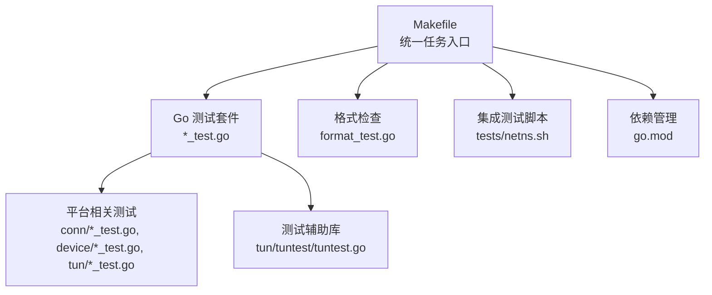
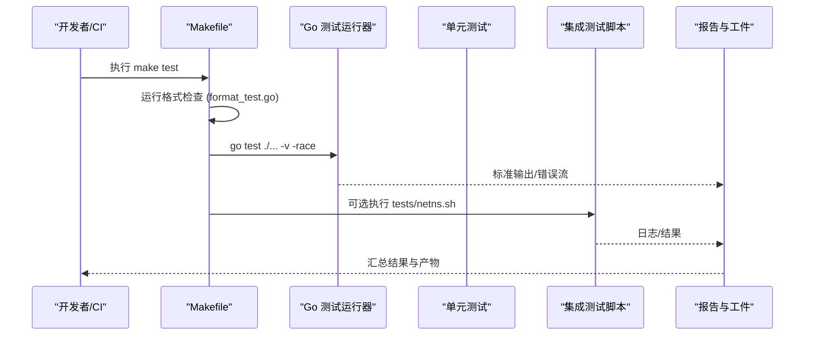
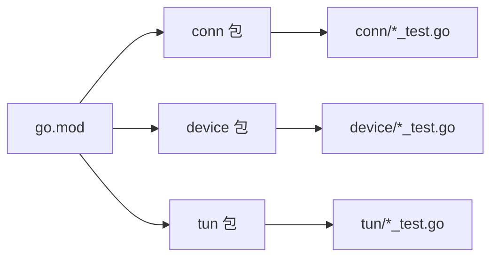

# 测试自动化

<cite>
**本文引用的文件**
- [Makefile](file://Makefile)
- [README.md](file://README.md)
- [readme_cn.md](file://readme_cn.md)
- [go.mod](file://go.mod)
- [format_test.go](file://format_test.go)
- [conn/bind_std_test.go](file://conn/bind_std_test.go)
- [device/device_test.go](file://device/device_test.go)
- [tun/tuntest/tuntest.go](file://tun/tuntest/tuntest.go)
- [tests/netns.sh](file://tests/netns.sh)
</cite>

## 目录
1. [简介](#简介)
2. [项目结构](#项目结构)
3. [核心组件](#核心组件)
4. [架构总览](#架构总览)
5. [详细组件分析](#详细组件分析)
6. [依赖分析](#依赖分析)
7. [性能考虑](#性能考虑)
8. [故障排查指南](#故障排查指南)
9. [结论](#结论)
10. [附录](#附录)

## 简介
本文件面向持续集成与本地开发，系统化说明该仓库的测试自动化方案：包括测试执行流程、环境与依赖管理、报告生成与分析、代码格式化与静态检查、测试结果存储与趋势分析、本地一键启动方法，以及失败诊断与调试流程。目标是让不同背景的读者都能快速理解并高效使用项目的测试体系。

## 项目结构
仓库采用按功能域划分的目录组织方式，测试代码与对应实现同目录或就近放置，便于维护与定位。关键位置如下：
- 根级构建与任务入口：Makefile
- Go 模块与依赖声明：go.mod
- 根级测试：format_test.go（用于格式校验）
- 各子系统测试：如 conn/*_test.go、device/*_test.go、tun/*_test.go 等
- 网络命名空间集成测试脚本：tests/netns.sh
- 测试辅助工具：tun/tuntest/tuntest.go

图表来源
- [Makefile:1-200](file://Makefile#L1-L200)
- [format_test.go:1-200](file://format_test.go#L1-L200)
- [tests/netns.sh:1-200](file://tests/netns.sh#L1-L200)
- [go.mod:1-200](file://go.mod#L1-L200)

章节来源
- [Makefile:1-200](file://Makefile#L1-L200)
- [go.mod:1-200](file://go.mod#L1-L200)
- [format_test.go:1-200](file://format_test.go#L1-L200)
- [tests/netns.sh:1-200](file://tests/netns.sh#L1-L200)

## 核心组件
- 构建与测试编排：通过 Makefile 提供统一的测试命令，覆盖单元测试、格式检查与可选的集成测试。
- 单元测试：基于 Go 原生 testing 框架，分布在 conn、device、tun 等子包中，验证协议栈、绑定、队列、计时器等核心逻辑。
- 格式与静态检查：通过 format_test.go 确保代码风格一致，避免提交引入格式问题。
- 集成测试：tests/netns.sh 用于网络命名空间场景下的端到端/系统级验证。
- 测试辅助：tun/tuntest/tuntest.go 提供 TUN 设备模拟与断言能力，降低单测复杂度。

章节来源
- [Makefile:1-200](file://Makefile#L1-L200)
- [format_test.go:1-200](file://format_test.go#L1-L200)
- [conn/bind_std_test.go:1-200](file://conn/bind_std_test.go#L1-L200)
- [device/device_test.go:1-200](file://device/device_test.go#L1-L200)
- [tun/tuntest/tuntest.go:1-200](file://tun/tuntest/tuntest.go#L1-L200)
- [tests/netns.sh:1-200](file://tests/netns.sh#L1-L200)

## 架构总览
下图展示了从触发到产出的端到端流程：开发者或 CI 触发 make test，依次执行格式检查、单元测试与可选集成测试；测试输出可被 CI 收集为报告与工件，供后续分析与归档。

图表来源
- [Makefile:1-200](file://Makefile#L1-L200)
- [format_test.go:1-200](file://format_test.go#L1-L200)
- [tests/netns.sh:1-200](file://tests/netns.sh#L1-L200)

## 详细组件分析

### 测试执行流程与配置（Makefile）
- 统一入口：make test 串联格式检查与测试执行，保证质量门禁。
- 并行与并发：测试通常以并发模式运行，提升反馈速度；可按需调整并发度。
- 平台差异：部分测试依赖平台特性（如 Linux 网络命名空间），在 CI 中按需启用。
- 可扩展性：新增测试目标时，遵循现有约定，保持命令一致性。

章节来源
- [Makefile:1-200](file://Makefile#L1-L200)

### 单元测试（Go 原生 testing）
- 覆盖范围：连接绑定、设备状态机、密钥派生、队列与计时器、TUN 层等。
- 典型用例：
  - 连接绑定行为验证：conn/bind_std_test.go
  - 设备生命周期与状态转换：device/device_test.go
- 数据驱动与随机化：部分测试使用随机输入增强鲁棒性。
- 并发安全：结合 -race 检测潜在竞态。

章节来源
- [conn/bind_std_test.go:1-200](file://conn/bind_std_test.go#L1-L200)
- [device/device_test.go:1-200](file://device/device_test.go#L1-L200)

### 格式与静态检查（format_test.go）
- 目的：确保所有提交代码符合仓库约定的格式规范，减少评审成本。
- 机制：作为普通 Go 测试存在，失败即阻断流水线。
- 建议：在本地先运行格式检查，再提交变更。

章节来源
- [format_test.go:1-200](file://format_test.go#L1-L200)

### 集成测试（tests/netns.sh）
- 场景：基于网络命名空间的端到端验证，模拟真实网络环境。
- 要求：需要具备创建/进入网络命名空间的能力（通常在 Linux）。
- 执行：由 Makefile 在合适阶段调用，输出日志供分析。

章节来源
- [tests/netns.sh:1-200](file://tests/netns.sh#L1-L200)

### 测试辅助（tun/tuntest/tuntest.go）
- 作用：封装 TUN 设备创建、读写与断言，简化单测编写。
- 优势：屏蔽平台差异，提高测试稳定性与可移植性。

章节来源
- [tun/tuntest/tuntest.go:1-200](file://tun/tuntest/tuntest.go#L1-L200)

## 依赖分析
- 模块管理：go.mod 集中声明 Go 模块与依赖版本，确保可重现构建。
- 测试依赖：测试仅依赖标准库与必要第三方库；如有新增依赖，需在 go.mod 中显式声明。
- 平台依赖：部分测试依赖操作系统能力（如 netns），应在 CI 中明确环境矩阵。

图表来源
- [go.mod:1-200](file://go.mod#L1-L200)

章节来源
- [go.mod:1-200](file://go.mod#L1-L200)

## 性能考虑
- 并发测试：合理使用并发缩短反馈时间，但需注意资源竞争与隔离。
- I/O 密集测试：对 TUN/网络相关的测试进行超时控制与资源清理，避免阻塞。
- 缓存与复用：测试辅助库应尽可能复用对象，减少分配与系统调用开销。
- 选择性执行：在大型变更时可针对受影响子包执行测试，加速迭代。

[本节为通用指导，不直接分析具体文件]

## 故障排查指南
- 格式检查失败：
  - 现象：format_test.go 报错。
  - 处理：根据提示修复格式后重新运行。
  - 参考路径：[format_test.go:1-200](file://format_test.go#L1-L200)
- 单元测试失败：
  - 现象：go test 返回非零退出码。
  - 处理：查看对应 *_test.go 的错误输出，必要时添加 -v 或 -race 定位问题。
  - 参考路径：[conn/bind_std_test.go:1-200](file://conn/bind_std_test.go#L1-L200)、[device/device_test.go:1-200](file://device/device_test.go#L1-L200)
- 集成测试失败：
  - 现象：tests/netns.sh 执行失败。
  - 处理：确认当前环境支持网络命名空间，检查权限与内核模块。
  - 参考路径：[tests/netns.sh:1-200](file://tests/netns.sh#L1-L200)
- 依赖问题：
  - 现象：下载/解析依赖失败。
  - 处理：检查代理设置与网络连通性，必要时更新 go.sum。
  - 参考路径：[go.mod:1-200](file://go.mod#L1-L200)

章节来源
- [format_test.go:1-200](file://format_test.go#L1-L200)
- [conn/bind_std_test.go:1-200](file://conn/bind_std_test.go#L1-L200)
- [device/device_test.go:1-200](file://device/device_test.go#L1-L200)
- [tests/netns.sh:1-200](file://tests/netns.sh#L1-L200)
- [go.mod:1-200](file://go.mod#L1-L200)

## 结论
本项目通过 Makefile 将格式检查、单元测试与集成测试整合为一致的流水线入口；借助 Go 原生 testing 与平台脚本，覆盖了从单元到集成的多层质量保障。配合 go.mod 的依赖管理与合理的测试设计，可在本地与 CI 环境中获得稳定、快速的反馈。建议在持续集成中固化这些步骤，并将测试输出纳入报告与归档，以便长期追踪与改进。

[本节为总结性内容，不直接分析具体文件]

## 附录

### 持续集成中的测试流程与配置
- 推荐步骤：
  - 拉取代码与依赖
  - 执行格式检查（format_test.go）
  - 执行单元测试（go test ./... -v -race）
  - 条件执行集成测试（tests/netns.sh，仅在支持的环境）
  - 收集日志与产物
- 环境矩阵：
  - 至少覆盖 Linux（含 netns）、Windows、macOS
  - 针对不同内核/平台开启相应测试

章节来源
- [Makefile:1-200](file://Makefile#L1-L200)
- [tests/netns.sh:1-200](file://tests/netns.sh#L1-L200)

### 自动化测试的执行环境与依赖管理
- 执行环境：
  - 安装 Go 工具链，确保版本与 go.mod 兼容
  - Linux 下如需运行集成测试，需具备创建网络命名空间的能力
- 依赖管理：
  - 使用 go mod 管理依赖，保持 go.mod/go.sum 同步
  - 在 CI 中缓存依赖以提升速度

章节来源
- [go.mod:1-200](file://go.mod#L1-L200)

### 测试报告的生成与分析方法
- 生成：
  - 使用 go test 的标准输出/错误流作为基础报告
  - 可将输出重定向至文件，便于归档
- 分析：
  - 关注失败用例与堆栈信息
  - 对间歇性失败进行复现与回归

章节来源
- [Makefile:1-200](file://Makefile#L1-L200)

### 代码格式化和静态分析的自动化检查
- 格式化：
  - 通过 format_test.go 强制统一风格
- 静态分析：
  - 可在 CI 中增加静态分析任务（如 vet、lint），进一步提升代码质量

章节来源
- [format_test.go:1-200](file://format_test.go#L1-L200)

### 测试结果的存储和趋势分析
- 存储：
  - 将每次运行的日志与产物上传至 CI 工件存储
- 趋势：
  - 记录通过率、耗时与失败分布，形成趋势图
  - 对异常波动进行预警与复盘

[本节为通用实践，不直接分析具体文件]

### 本地测试环境的一键启动方法
- 一键执行：
  - 在仓库根目录执行 make test，即可一次性完成格式检查与测试
- 扩展：
  - 可根据需要追加参数（如 -v、-race）以获得更详细信息

章节来源
- [Makefile:1-200](file://Makefile#L1-L200)

### 测试失败时的诊断和调试流程
- 快速定位：
  - 优先查看最近一次失败的测试用例与输出
- 复现与隔离：
  - 在本地单独运行失败用例，逐步缩小范围
- 深入分析：
  - 使用 -race 检测竞态
  - 对网络/IO 相关测试增加超时与日志
- 回归与修复：
  - 修复后补充针对性用例，防止回归

章节来源
- [conn/bind_std_test.go:1-200](file://conn/bind_std_test.go#L1-L200)
- [device/device_test.go:1-200](file://device/device_test.go#L1-L200)
- [tests/netns.sh:1-200](file://tests/netns.sh#L1-L200)