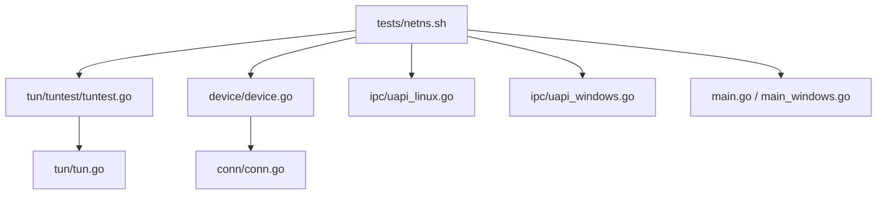
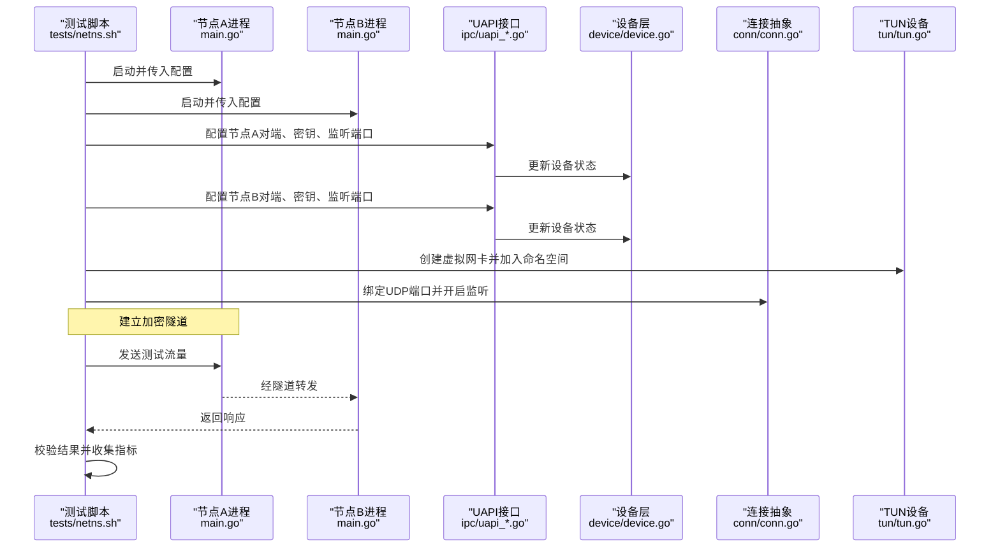
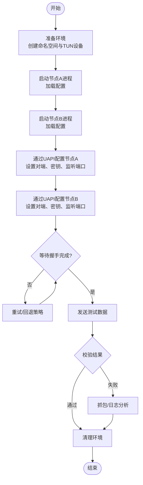
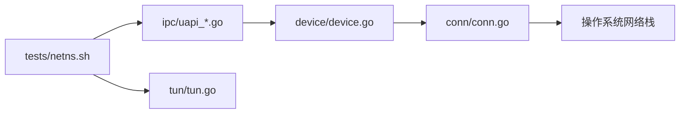

# 集成测试

<cite>
**本文引用的文件**
- [tests/netns.sh](file://tests/netns.sh)
- [tun/tuntest/tuntest.go](file://tun/tuntest/tuntest.go)
- [tun/tun.go](file://tun/tun.go)
- [device/device.go](file://device/device.go)
- [conn/conn.go](file://conn/conn.go)
- [ipc/uapi_linux.go](file://ipc/uapi_linux.go)
- [ipc/uapi_windows.go](file://ipc/uapi_windows.go)
- [main.go](file://main.go)
- [main_windows.go](file://main_windows.go)
- [go.mod](file://go.mod)
</cite>

## 目录
1. [简介](#简介)
2. [项目结构](#项目结构)
3. [核心组件](#核心组件)
4. [架构总览](#架构总览)
5. [详细组件分析](#详细组件分析)
6. [依赖关系分析](#依赖关系分析)
7. [性能考虑](#性能考虑)
8. [故障排查指南](#故障排查指南)
9. [结论](#结论)
10. [附录](#附录)

## 简介
本文件面向集成测试，聚焦于以下目标：
- 网络命名空间测试环境的搭建与使用方法
- 端到端测试的设计与实现策略
- 多节点通信测试的场景与配置
- VPN隧道建立的完整测试流程
- 测试数据的准备与管理方法
- 性能基准测试的实现指导
- 测试环境的隔离与清理机制

本仓库提供了基于 shell 的网络命名空间脚本以及 Go 层的 TUN/TCP 栈、设备抽象、IPC（UAPI）等能力，可用于构建端到端的 WireGuard 集成测试。

## 项目结构
与集成测试直接相关的顶层目录与文件包括：
- tests/netns.sh：用于创建、编排网络命名空间的脚本入口
- tun/tuntest/tuntest.go：TUN 设备的测试辅助封装
- device/device.go：WireGuard 设备核心逻辑（对上层暴露的接口）
- conn/conn.go：网络套接字绑定与特性抽象
- ipc/*：平台相关 UAPI 实现（Linux/Windows），用于进程间控制设备
- main*.go：可执行程序入口（提供 CLI/服务化能力，便于在测试中启动实例）
- go.mod：模块依赖声明

图表来源
- [tests/netns.sh](file://tests/netns.sh)
- [tun/tuntest/tuntest.go:1-200](file://tun/tuntest/tuntest.go#L1-L200)
- [tun/tun.go:1-200](file://tun/tun.go#L1-L200)
- [device/device.go:1-200](file://device/device.go#L1-L200)
- [conn/conn.go:1-200](file://conn/conn.go#L1-L200)
- [ipc/uapi_linux.go:1-200](file://ipc/uapi_linux.go#L1-L200)
- [ipc/uapi_windows.go:1-200](file://ipc/uapi_windows.go#L1-L200)
- [main.go:1-200](file://main.go#L1-L200)
- [main_windows.go:1-200](file://main_windows.go#L1-L200)

章节来源
- [tests/netns.sh](file://tests/netns.sh)
- [tun/tuntest/tuntest.go:1-200](file://tun/tuntest/tuntest.go#L1-L200)
- [tun/tun.go:1-200](file://tun/tun.go#L1-L200)
- [device/device.go:1-200](file://device/device.go#L1-L200)
- [conn/conn.go:1-200](file://conn/conn.go#L1-L200)
- [ipc/uapi_linux.go:1-200](file://ipc/uapi_linux.go#L1-L200)
- [ipc/uapi_windows.go:1-200](file://ipc/uapi_windows.go#L1-L200)
- [main.go:1-200](file://main.go#L1-L200)
- [main_windows.go:1-200](file://main_windows.go#L1-L200)

## 核心组件
- 网络命名空间编排器（tests/netns.sh）
  - 负责创建/销毁命名空间、虚拟网卡、路由与防火墙规则，驱动多个 WireGuard 实例进行端到端验证。
- TUN 测试辅助（tun/tuntest/tuntest.go）
  - 封装 TUN 设备生命周期管理，便于在测试中快速创建/回收虚拟网络接口。
- 设备层（device/device.go）
  - 提供 WireGuard 协议栈的核心状态机、密钥交换、数据包收发等能力；测试通过 IPC 或 API 配置并驱动。
- 连接抽象（conn/conn.go）
  - 抽象底层 UDP/TCP 绑定、GSO、标记、粘性路由等特性，屏蔽平台差异。
- IPC/UAPI（ipc/*）
  - 提供跨进程配置与查询接口，使测试脚本能够动态配置设备（如添加对端、设置密钥、启用/禁用接口）。
- 可执行入口（main*.go）
  - 作为被测进程，承载设备实例；测试可通过命令行参数或环境变量启动并注入配置。

章节来源
- [tests/netns.sh](file://tests/netns.sh)
- [tun/tuntest/tuntest.go:1-200](file://tun/tuntest/tuntest.go#L1-L200)
- [device/device.go:1-200](file://device/device.go#L1-L200)
- [conn/conn.go:1-200](file://conn/conn.go#L1-L200)
- [ipc/uapi_linux.go:1-200](file://ipc/uapi_linux.go#L1-L200)
- [ipc/uapi_windows.go:1-200](file://ipc/uapi_windows.go#L1-L200)
- [main.go:1-200](file://main.go#L1-L200)
- [main_windows.go:1-200](file://main_windows.go#L1-L200)

## 架构总览
下图展示了集成测试的整体调用链：测试脚本驱动多个命名空间中的 WireGuard 进程，通过 UAPI 完成配置，利用 TUN 设备转发流量，最终在应用层进行连通性与性能验证。

图表来源
- [tests/netns.sh](file://tests/netns.sh)
- [main.go:1-200](file://main.go#L1-L200)
- [ipc/uapi_linux.go:1-200](file://ipc/uapi_linux.go#L1-L200)
- [ipc/uapi_windows.go:1-200](file://ipc/uapi_windows.go#L1-L200)
- [device/device.go:1-200](file://device/device.go#L1-L200)
- [conn/conn.go:1-200](file://conn/conn.go#L1-L200)
- [tun/tun.go:1-200](file://tun/tun.go#L1-L200)

## 详细组件分析

### 网络命名空间测试环境搭建与使用
- 目标
  - 在单个主机上模拟多节点拓扑，确保各节点具备独立的网络栈、路由表与防火墙策略。
- 关键步骤
  - 创建若干网络命名空间，并在每个命名空间中创建 veth 对或 TUN 设备以模拟链路。
  - 为每个命名空间分配独立 IP 段，配置默认网关与静态路由，必要时添加 iptables/nftables 规则。
  - 在每个命名空间内启动一个 WireGuard 进程（main.go），并通过 UAPI 注入配置。
  - 在测试脚本中编排启动顺序、等待就绪、发送探测流量、断言结果。
- 注意事项
  - 权限要求：创建命名空间与网络设备通常需要 root 或 CAP_NET_ADMIN。
  - 资源清理：确保无论成功或失败均能删除命名空间与临时文件，避免污染宿主机网络。
  - 端口冲突：为不同节点分配不重叠的监听端口范围。

章节来源
- [tests/netns.sh](file://tests/netns.sh)
- [tun/tuntest/tuntest.go:1-200](file://tun/tuntest/tuntest.go#L1-L200)
- [tun/tun.go:1-200](file://tun/tun.go#L1-L200)
- [ipc/uapi_linux.go:1-200](file://ipc/uapi_linux.go#L1-L200)
- [ipc/uapi_windows.go:1-200](file://ipc/uapi_windows.go#L1-L200)
- [main.go:1-200](file://main.go#L1-L200)

### 端到端测试设计与实现策略
- 设计原则
  - 最小化外部依赖：尽量在命名空间内部完成所有配置与数据面验证。
  - 可重复性：每次运行前重置环境，保证结果稳定。
  - 可观测性：记录关键事件（启动、配置、建连、丢包、重传、错误码）。
- 典型用例
  - 单跳连通性：A↔B 直连，验证握手、数据传输、断开恢复。
  - 多跳中继：A→B→C，验证路由与 NAT 穿透场景。
  - 异常恢复：链路抖动、对端重启、密钥轮换后的自动重建。
- 实现要点
  - 使用 TUN 设备将测试流量注入协议栈，或使用应用层客户端（如 ping/http）在命名空间内发起请求。
  - 通过 UAPI 动态修改配置（如对端公钥、预共享密钥、Keepalive 间隔）。
  - 使用 netstat/ss/tcpdump 等工具抓取报文进行分析。

章节来源
- [tests/netns.sh](file://tests/netns.sh)
- [device/device.go:1-200](file://device/device.go#L1-L200)
- [conn/conn.go:1-200](file://conn/conn.go#L1-L200)
- [tun/tuntest/tuntest.go:1-200](file://tun/tuntest/tuntest.go#L1-L200)

### 多节点通信测试场景与配置
- 场景
  - 星型拓扑：中心节点与多个边缘节点通信。
  - 链式拓扑：A→B→C 的多跳转发。
  - 混合拓扑：部分节点位于不同命名空间，部分在同一命名空间。
- 配置要点
  - 每个节点需配置唯一的私钥/公钥对，合理设置 AllowedIPs 与 Endpoint。
  - 根据拓扑调整 MTU、Keepalive、重试策略。
  - 若涉及 NAT/公网，需结合 STUN/TURN 或打洞策略（由上层应用或中间件处理）。
- 验证方法
  - 逐跳 Ping/HTTP 探测，统计延迟与丢包率。
  - 抓包分析握手过程与数据面路径。

章节来源
- [tests/netns.sh](file://tests/netns.sh)
- [device/device.go:1-200](file://device/device.go#L1-L200)
- [conn/conn.go:1-200](file://conn/conn.go#L1-L200)

### VPN 隧道建立完整测试流程

图表来源
- [tests/netns.sh](file://tests/netns.sh)
- [ipc/uapi_linux.go:1-200](file://ipc/uapi_linux.go#L1-L200)
- [ipc/uapi_windows.go:1-200](file://ipc/uapi_windows.go#L1-L200)
- [device/device.go:1-200](file://device/device.go#L1-L200)
- [conn/conn.go:1-200](file://conn/conn.go#L1-L200)
- [tun/tun.go:1-200](file://tun/tun.go#L1-L200)

章节来源
- [tests/netns.sh](file://tests/netns.sh)
- [ipc/uapi_linux.go:1-200](file://ipc/uapi_linux.go#L1-L200)
- [ipc/uapi_windows.go:1-200](file://ipc/uapi_windows.go#L1-L200)
- [device/device.go:1-200](file://device/device.go#L1-L200)
- [conn/conn.go:1-200](file://conn/conn.go#L1-L200)
- [tun/tun.go:1-200](file://tun/tun.go#L1-L200)

### 测试数据的准备与管理
- 数据分类
  - 配置数据：节点私钥/公钥、AllowedIPs、Endpoint、Keepalive 等。
  - 流量数据：固定长度报文、随机载荷、突发流量模式。
  - 期望结果：延迟阈值、丢包上限、重传次数等。
- 管理方式
  - 使用配置文件或环境变量集中管理，支持按场景切换。
  - 生成对称密钥对时采用确定性种子，便于复现。
  - 将大体积测试文件置于只读目录，避免写入污染。
- 最佳实践
  - 数据与配置分离，便于版本化管理。
  - 在 CI 中缓存常用数据，缩短执行时间。

章节来源
- [tests/netns.sh](file://tests/netns.sh)
- [device/device.go:1-200](file://device/device.go#L1-L200)

### 性能基准测试实现指导
- 指标
  - 吞吐量（Mbps）、延迟（ms）、CPU 占用、内存增长、丢包率、握手耗时。
- 方法
  - 使用 iperf 或自定义客户端在命名空间内产生持续流量。
  - 通过 UAPI 导出统计信息（如已发送/接收字节数、会话计数）。
  - 在不同 MTU、窗口大小、并发连接数下采集数据。
- 稳定性
  - 预热阶段排除冷启动影响。
  - 多次运行取中位数，剔除异常值。
  - 记录系统负载与内核参数，确保可比性。

章节来源
- [conn/conn.go:1-200](file://conn/conn.go#L1-L200)
- [device/device.go:1-200](file://device/device.go#L1-L200)
- [tests/netns.sh](file://tests/netns.sh)

### 测试环境的隔离与清理机制
- 隔离
  - 每个测试用例独占一组命名空间与端口，避免相互干扰。
  - 使用不同的 IP 段与网段划分，防止路由冲突。
- 清理
  - 无论成功或失败，均在退出钩子中删除命名空间、释放端口、清理临时文件。
  - 捕获信号（如 SIGTERM/SIGINT）触发优雅关闭与资源回收。
- 幂等性
  - 启动前检查并清理残留资源，确保多次运行一致。

章节来源
- [tests/netns.sh](file://tests/netns.sh)
- [tun/tuntest/tuntest.go:1-200](file://tun/tuntest/tuntest.go#L1-L200)

## 依赖关系分析
- 模块依赖
  - 测试脚本依赖 UAPI 与 TUN 设备；设备层依赖连接抽象；连接抽象依赖平台网络栈。
- 耦合度
  - 通过 UAPI 解耦测试脚本与设备实现，便于替换后端或扩展功能。
- 外部依赖
  - 操作系统网络栈、iptables/nftables、命名空间能力。
- 风险点
  - 平台差异（Linux/Windows）可能导致行为不一致，需在多平台验证。

图表来源
- [tests/netns.sh](file://tests/netns.sh)
- [ipc/uapi_linux.go:1-200](file://ipc/uapi_linux.go#L1-L200)
- [ipc/uapi_windows.go:1-200](file://ipc/uapi_windows.go#L1-L200)
- [device/device.go:1-200](file://device/device.go#L1-L200)
- [conn/conn.go:1-200](file://conn/conn.go#L1-L200)
- [tun/tun.go:1-200](file://tun/tun.go#L1-L200)

章节来源
- [go.mod:1-200](file://go.mod#L1-L200)
- [tests/netns.sh](file://tests/netns.sh)
- [device/device.go:1-200](file://device/device.go#L1-L200)
- [conn/conn.go:1-200](file://conn/conn.go#L1-L200)

## 性能考虑
- 减少上下文切换：批量配置 UAPI，降低频繁调用开销。
- 优化 MTU：根据链路特性调整 MTU，避免分片。
- 并发控制：限制并发连接数，避免耗尽文件描述符。
- 监控与采样：在高负载下降低采样频率，平衡精度与开销。
- 平台差异：关注 Linux 与 Windows 的性能表现差异，针对性调优。

[本节为通用指导，无需特定文件引用]

## 故障排查指南
- 常见问题
  - 无法创建命名空间或 TUN 设备：检查权限与内核模块。
  - 握手失败：核对公钥/私钥匹配、AllowedIPs 与 Endpoint 可达性。
  - 无流量：检查路由、防火墙规则与端口绑定。
- 定位手段
  - 抓包分析：在命名空间内使用 tcpdump 抓取握手与数据报文。
  - 日志输出：启用设备与连接层日志，定位错误码与状态。
  - 逐步缩小范围：先验证单跳连通，再扩展到多跳。
- 恢复策略
  - 重启受影响节点，重新下发配置。
  - 清理残留命名空间与端口，避免状态污染。

章节来源
- [tests/netns.sh](file://tests/netns.sh)
- [ipc/uapi_linux.go:1-200](file://ipc/uapi_linux.go#L1-L200)
- [ipc/uapi_windows.go:1-200](file://ipc/uapi_windows.go#L1-L200)
- [device/device.go:1-200](file://device/device.go#L1-L200)
- [conn/conn.go:1-200](file://conn/conn.go#L1-L200)

## 结论
本仓库提供了构建 WireGuard 集成测试的关键构件：网络命名空间编排、TUN 设备封装、设备与连接抽象、UAPI 配置通道以及可执行入口。借助这些能力，可以系统化地搭建端到端测试环境，覆盖多节点通信、VPN 隧道建立、性能基准与环境隔离等场景。建议在 CI 中固化测试流程，确保每次变更都能得到充分验证。

[本节为总结性内容，无需特定文件引用]

## 附录
- 建议的测试矩阵
  - 平台：Linux、Windows
  - 拓扑：单跳、多跳、星型、链式
  - 负载：低、中、高
  - 异常：对端重启、链路抖动、密钥轮换
- 参考命令与工具
  - 命名空间与网络：ip、nsenter、iptables/nftables
  - 抓包与分析：tcpdump、wireshark
  - 流量生成：iperf、自定义客户端
  - 指标采集：UAPI 统计、系统监控工具

[本节为补充说明，无需特定文件引用]