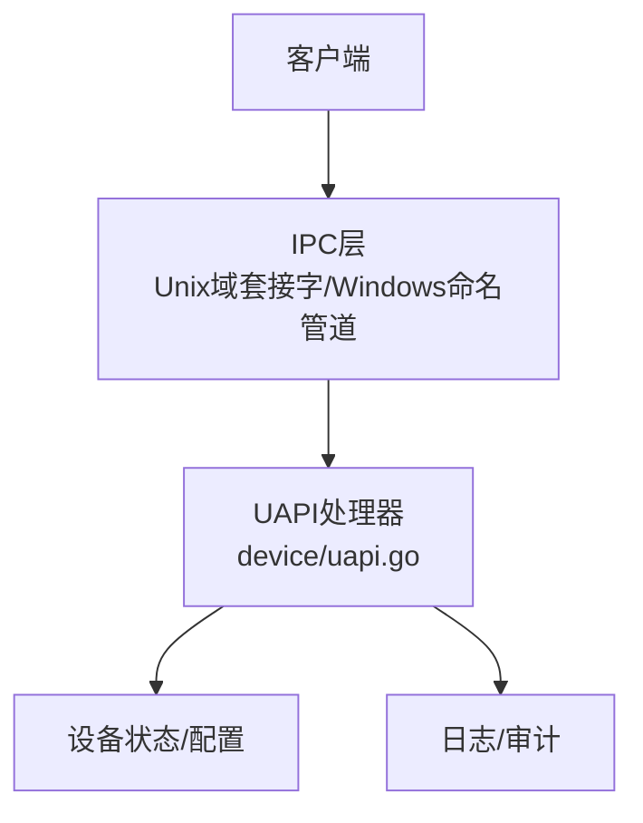
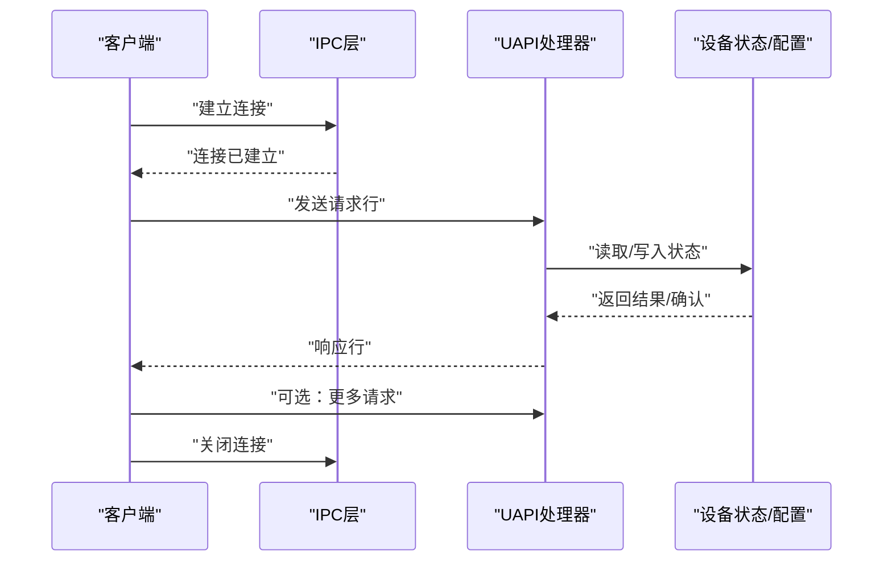
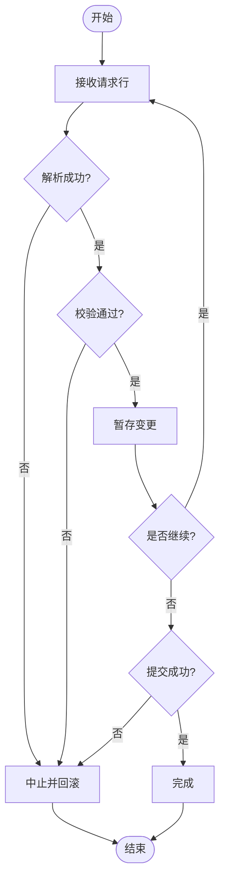
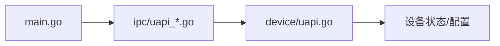

# UAPI规范

<cite>
**本文引用的文件**
- [device/uapi.go](file://device/uapi.go)
- [ipc/uapi_unix.go](file://ipc/uapi_unix.go)
- [ipc/uapi_windows.go](file://ipc/uapi_windows.go)
- [ipc/namedpipe/namedpipe.go](file://ipc/namedpipe/namedpipe.go)
- [main.go](file://main.go)
- [version.go](file://version.go)
</cite>

## 目录
1. [简介](#简介)
2. [项目结构](#项目结构)
3. [核心组件](#核心组件)
4. [架构总览](#架构总览)
5. [详细组件分析](#详细组件分析)
6. [依赖关系分析](#依赖关系分析)
7. [性能考虑](#性能考虑)
8. [故障排查指南](#故障排查指南)
9. [结论](#结论)
10. [附录](#附录)

## 简介
本规范定义 wireguard-go 的用户空间接口（UAPI），用于在进程外对设备配置进行查询与更新。UAPI 基于文本协议，通过 Unix 域套接字（类 Unix）或 Windows 命名管道（Windows）暴露服务。其设计目标是：
- 提供稳定、可解析的文本请求/响应格式
- 支持只读查询与受控的配置更新
- 明确错误语义与版本兼容性策略
- 为第三方工具提供清晰的集成指南

## 项目结构
UAPI 相关代码主要分布在以下模块：
- device/uapi.go：实现 UAPI 协议的核心逻辑（命令解析、事务处理、状态输出等）
- ipc/uapi_unix.go：Unix 域套接字服务端实现
- ipc/uapi_windows.go：Windows 命名管道服务端实现
- ipc/namedpipe/namedpipe.go：命名管道底层封装
- main.go：程序入口，负责启动监听并接入 UAPI 服务
- version.go：版本信息常量，供兼容性与标识使用

图表来源
- [ipc/uapi_unix.go:1-200](file://ipc/uapi_unix.go#L1-L200)
- [ipc/uapi_windows.go:1-200](file://ipc/uapi_windows.go#L1-L200)
- [device/uapi.go:1-300](file://device/uapi.go#L1-L300)

章节来源
- [device/uapi.go:1-300](file://device/uapi.go#L1-L300)
- [ipc/uapi_unix.go:1-200](file://ipc/uapi_unix.go#L1-L200)
- [ipc/uapi_windows.go:1-200](file://ipc/uapi_windows.go#L1-L200)
- [ipc/namedpipe/namedpipe.go:1-200](file://ipc/namedpipe/namedpipe.go#L1-L200)
- [main.go:1-200](file://main.go#L1-L200)
- [version.go:1-50](file://version.go#L1-L50)

## 核心组件
- UAPI 服务器：监听本地 IPC 端点，接受连接并分发到处理器
- UAPI 处理器：解析请求、执行命令、生成响应、管理事务
- 设备状态访问器：读取当前设备与对等体状态
- 配置更新器：应用配置变更，支持事务性提交与回滚

关键职责划分：
- IPC 层仅负责传输与连接生命周期管理
- 处理器负责协议语义、校验、事务控制
- 设备层提供数据读写能力

章节来源
- [device/uapi.go:1-300](file://device/uapi.go#L1-L300)
- [ipc/uapi_unix.go:1-200](file://ipc/uapi_unix.go#L1-L200)
- [ipc/uapi_windows.go:1-200](file://ipc/uapi_windows.go#L1-L200)

## 架构总览
UAPI 采用“传输层 + 协议层”的分层架构。传输层根据平台选择 Unix 域套接字或 Windows 命名管道；协议层以文本行作为消息边界，按命令类型路由到对应处理函数。

图表来源
- [ipc/uapi_unix.go:1-200](file://ipc/uapi_unix.go#L1-L200)
- [ipc/uapi_windows.go:1-200](file://ipc/uapi_windows.go#L1-L200)
- [device/uapi.go:1-300](file://device/uapi.go#L1-L300)

## 详细组件分析

### 通信机制与平台差异
- Unix 域套接字（类 Unix）
  - 通过本地文件系统路径或抽象名称建立连接
  - 适合单主机内进程间通信，具备较低开销与较高安全性
- Windows 命名管道
  - 通过命名管道名建立连接，支持跨进程安全访问控制
  - 与 Unix 域套接字在 API 层面存在差异，但对外暴露的 UAPI 行为一致

注意：
- 两端必须就协议文本格式达成一致
- 连接关闭后需重新建立新连接以发起新的请求序列

章节来源
- [ipc/uapi_unix.go:1-200](file://ipc/uapi_unix.go#L1-L200)
- [ipc/uapi_windows.go:1-200](file://ipc/uapi_windows.go#L1-L200)
- [ipc/namedpipe/namedpipe.go:1-200](file://ipc/namedpipe/namedpipe.go#L1-L200)

### 命令集与参数规范
UAPI 支持三类基本操作：
- 查询：获取设备或对等体的当前状态
- 更新：设置或修改设备/对等体属性
- 事务：将多个更新组合为一个原子提交单元

通用规则：
- 每行一个键值对或命令
- 空行表示请求结束
- 响应按行返回，包含状态码与数据

常见命令类别（示例说明，具体字段以实现为准）：
- 设备查询：列出设备基本信息、监听地址、统计等
- 对等体查询：列出对等体公钥、最后握手时间、流量计数等
- 设备更新：设置私钥、监听端口、允许 IP 列表等
- 对等体更新：设置公钥、预共享密钥、允许 IP、持久保持心跳间隔等
- 事务：开始事务、提交事务、回滚事务

章节来源
- [device/uapi.go:1-300](file://device/uapi.go#L1-L300)

### 请求/响应格式
- 请求格式
  - 每行一个键=值或命令
  - 以空行终止请求
- 响应格式
  - 每行一个键=值或状态行
  - 以空行终止响应
- 编码
  - UTF-8 文本
  - 行分隔符为换行
- 大小限制
  - 建议客户端避免超长行与超大响应
  - 服务端应拒绝异常大的请求

章节来源
- [device/uapi.go:1-300](file://device/uapi.go#L1-L300)

### 配置更新的生命周期与事务处理
- 生命周期阶段
  - 接收：逐行接收请求
  - 解析：校验键名与值合法性
  - 验证：检查约束条件（如格式、范围、依赖）
  - 暂存：将变更放入事务缓冲区
  - 提交：一次性应用到设备状态
  - 回滚：失败时恢复原状
- 事务语义
  - 多步更新要么全部成功，要么全部失败
  - 提交前不生效，确保一致性
- 错误处理
  - 遇到非法输入立即中止当前事务
  - 记录错误原因以便客户端重试或修正

图表来源
- [device/uapi.go:1-300](file://device/uapi.go#L1-L300)

章节来源
- [device/uapi.go:1-300](file://device/uapi.go#L1-L300)

### 错误码与错误处理
- 分类
  - 语法错误：请求格式不正确或缺少必要字段
  - 语义错误：字段值非法或违反约束
  - 运行时错误：资源不足、权限不足、内部错误
- 行为
  - 遇到错误立即停止当前事务
  - 返回明确的错误行，便于客户端定位问题
  - 不改变设备状态（除非部分提交已被允许且已生效）

章节来源
- [device/uapi.go:1-300](file://device/uapi.go#L1-L300)

### 版本兼容性与向后兼容
- 版本标识
  - 通过版本常量标识协议版本
- 兼容性策略
  - 新增字段：旧客户端忽略未知字段
  - 删除字段：新客户端容忍缺失字段并提供默认值
  - 行为变更：仅在次版本升级中引入，并提供降级路径
- 建议
  - 客户端实现最小可用子集
  - 服务端保留已知历史字段以维持兼容

章节来源
- [version.go:1-50](file://version.go#L1-L50)
- [device/uapi.go:1-300](file://device/uapi.go#L1-L300)

### 完整请求/响应示例（概念性）
以下为概念性示例，展示典型交互流程。实际字段与顺序以实现为准。

- 查询设备信息
  - 请求
    - 行1：get=device
  - 响应
    - 行1：name=wg0
    - 行2：listen_port=51820
    - 行3：public_key=...
    - 空行：结束

- 设置对等体并启用
  - 请求
    - 行1：set-peer=...
    - 行2：public_key=...
    - 行3：allowed_ip=10.0.0.2/32
    - 行4：persistent_keepalive_interval=25
    - 空行：结束
  - 响应
    - 行1：status=ok
    - 空行：结束

- 事务批量更新
  - 请求
    - 行1：begin-transaction
    - 行2：set-peer=...
    - 行3：set-device=...
    - 行4：commit-transaction
    - 空行：结束
  - 响应
    - 行1：status=ok
    - 空行：结束

章节来源
- [device/uapi.go:1-300](file://device/uapi.go#L1-L300)

## 依赖关系分析
UAPI 的依赖关系如下：
- IPC 层依赖平台特定实现（Unix 域套接字或 Windows 命名管道）
- 处理器依赖设备状态与配置模块
- 主程序负责初始化 IPC 并绑定到本地端点

图表来源
- [main.go:1-200](file://main.go#L1-L200)
- [ipc/uapi_unix.go:1-200](file://ipc/uapi_unix.go#L1-L200)
- [ipc/uapi_windows.go:1-200](file://ipc/uapi_windows.go#L1-L200)
- [device/uapi.go:1-300](file://device/uapi.go#L1-L300)

章节来源
- [main.go:1-200](file://main.go#L1-L200)
- [ipc/uapi_unix.go:1-200](file://ipc/uapi_unix.go#L1-L200)
- [ipc/uapi_windows.go:1-200](file://ipc/uapi_windows.go#L1-L200)
- [device/uapi.go:1-300](file://device/uapi.go#L1-L300)

## 性能考虑
- 连接复用
  - 尽量复用长连接以减少握手开销
- 批处理
  - 使用事务将多次更新合并提交，降低同步成本
- 流式响应
  - 大响应分块返回，避免阻塞
- 资源限制
  - 限制最大并发连接数与请求大小
- 平台差异
  - Windows 命名管道在高并发下需注意缓冲与超时设置
  - Unix 域套接字通常具有更低的系统调用开销

[本节为通用指导，不直接分析具体文件]

## 故障排查指南
常见问题与处理建议：
- 连接失败
  - 检查 IPC 端点是否存在与权限
  - 确认服务端已启动并监听
- 解析错误
  - 检查请求行格式与键名拼写
  - 确认必填字段齐全
- 校验失败
  - 检查字段取值范围与依赖关系
  - 查看错误行中的描述信息
- 事务失败
  - 确认所有步骤均合法
  - 回滚后逐步缩小问题范围
- 性能问题
  - 减少频繁的小请求，改用事务批处理
  - 监控连接数与响应延迟

章节来源
- [device/uapi.go:1-300](file://device/uapi.go#L1-L300)

## 结论
UAPI 提供了稳定、可解析的本地配置接口，适用于自动化运维与第三方工具集成。通过统一的文本协议与事务机制，能够在不同平台上保持一致的行为。建议在开发中遵循最小可用子集原则，充分利用事务提升可靠性，并关注版本兼容性与错误处理。

[本节为总结，不直接分析具体文件]

## 附录

### 集成指南与最佳实践
- 客户端实现要点
  - 建立连接后发送请求，等待响应
  - 使用事务批量更新以提高一致性与性能
  - 对未知字段采取忽略策略以增强兼容性
- 错误处理
  - 捕获并记录错误行，便于诊断
  - 遇到不可恢复错误时重试或提示用户
- 安全与权限
  - 限制 IPC 端点的访问权限
  - 在生产环境中启用必要的认证与审计
- 测试建议
  - 覆盖正常路径与异常路径
  - 模拟高并发与大数据量场景

[本节为通用指导，不直接分析具体文件]